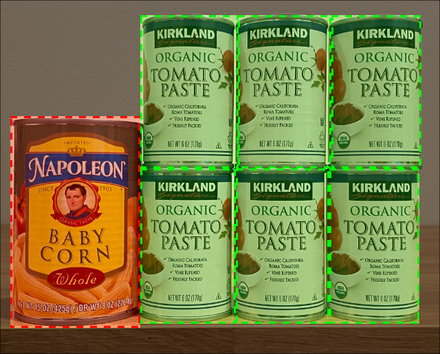

<!--
CO_OP_TRANSLATOR_METADATA:
{
  "original_hash": "1c9e5fa8b7be726c75a97232b1e41c97",
  "translation_date": "2025-08-25T20:44:53+00:00",
  "source_file": "5-retail/lessons/2-check-stock-device/README.md",
  "language_code": "de"
}
-->
# Lagerbestand mit einem IoT-Gerät überprüfen


> Sketchnote von [Nitya Narasimhan](https://github.com/nitya). Klicken Sie auf das Bild für eine größere Version.

## Quiz vor der Vorlesung

[Quiz vor der Vorlesung](https://black-meadow-040d15503.1.azurestaticapps.net/quiz/39)

## Einführung

In der vorherigen Lektion haben Sie die verschiedenen Einsatzmöglichkeiten der Objekterkennung im Einzelhandel kennengelernt. Außerdem haben Sie gelernt, wie man einen Objekterkenner trainiert, um Lagerbestände zu identifizieren. In dieser Lektion erfahren Sie, wie Sie Ihren Objekterkenner von Ihrem IoT-Gerät aus nutzen können, um Lagerbestände zu zählen.

In dieser Lektion behandeln wir:

* [Lagerbestand zählen](../../../../../5-retail/lessons/2-check-stock-device)
* [Den Objekterkenner von Ihrem IoT-Gerät aus aufrufen](../../../../../5-retail/lessons/2-check-stock-device)
* [Begrenzungsrahmen](../../../../../5-retail/lessons/2-check-stock-device)
* [Das Modell neu trainieren](../../../../../5-retail/lessons/2-check-stock-device)
* [Lagerbestand zählen](../../../../../5-retail/lessons/2-check-stock-device)

> 🗑 Dies ist die letzte Lektion in diesem Projekt. Vergessen Sie nach Abschluss dieser Lektion und der Aufgabe nicht, Ihre Cloud-Dienste aufzuräumen. Sie benötigen die Dienste, um die Aufgabe abzuschließen, stellen Sie also sicher, dass Sie diese zuerst abschließen.
>
> Konsultieren Sie bei Bedarf [die Anleitung zum Aufräumen Ihres Projekts](../../../clean-up.md) für Anweisungen, wie Sie dies tun können.

## Lagerbestand zählen

Objekterkenner können für die Lagerbestandsprüfung verwendet werden, entweder um Lagerbestände zu zählen oder sicherzustellen, dass sich die Artikel dort befinden, wo sie sein sollten. IoT-Geräte mit Kameras können im gesamten Geschäft eingesetzt werden, um Lagerbestände zu überwachen, beginnend mit Hotspots, an denen das Auffüllen von Artikeln wichtig ist, wie z. B. Bereiche, in denen kleine Mengen von hochpreisigen Artikeln gelagert werden.

Beispielsweise, wenn eine Kamera auf ein Regal zeigt, das 8 Dosen Tomatenmark aufnehmen kann, und ein Objekterkenner nur 7 Dosen erkennt, fehlt eine und muss nachgefüllt werden.


Im obigen Bild hat ein Objekterkenner 7 Dosen Tomatenmark auf einem Regal erkannt, das 8 Dosen aufnehmen kann. Das IoT-Gerät kann nicht nur eine Benachrichtigung über die Notwendigkeit des Nachfüllens senden, sondern auch einen Hinweis auf den Standort des fehlenden Artikels geben, wichtige Daten, wenn Sie Roboter zum Auffüllen von Regalen verwenden.

> 💁 Je nach Geschäft und Beliebtheit des Artikels würde wahrscheinlich kein Nachfüllen erfolgen, wenn nur eine Dose fehlt. Sie müssten einen Algorithmus entwickeln, der bestimmt, wann nachgefüllt werden soll, basierend auf Ihren Produkten, Kunden und anderen Kriterien.

✅ In welchen anderen Szenarien könnten Sie Objekterkennung und Roboter kombinieren?

Manchmal kann das falsche Lager auf den Regalen sein. Dies könnte ein menschlicher Fehler beim Nachfüllen sein oder Kunden, die ihre Meinung über einen Kauf ändern und einen Artikel in den nächstbesten freien Platz zurücklegen. Wenn es sich um einen nicht verderblichen Artikel wie Konserven handelt, ist dies ärgerlich. Wenn es sich um einen verderblichen Artikel wie Tiefkühl- oder gekühlte Waren handelt, kann dies bedeuten, dass das Produkt nicht mehr verkauft werden kann, da es möglicherweise unmöglich ist, festzustellen, wie lange der Artikel außerhalb des Gefrierschranks war.

Die Objekterkennung kann verwendet werden, um unerwartete Artikel zu erkennen und erneut einen Menschen oder Roboter zu benachrichtigen, den Artikel so schnell wie möglich zurückzubringen.



Im obigen Bild wurde eine Dose Babymais neben das Tomatenmark-Regal gestellt. Der Objekterkenner hat dies erkannt, sodass das IoT-Gerät einen Menschen oder Roboter benachrichtigen kann, die Dose an ihren richtigen Platz zurückzubringen.

## Den Objekterkenner von Ihrem IoT-Gerät aus aufrufen

Der Objekterkenner, den Sie in der letzten Lektion trainiert haben, kann von Ihrem IoT-Gerät aus aufgerufen werden.

### Aufgabe - Eine Iteration Ihres Objekterkenners veröffentlichen

Iterationen werden über das Custom Vision-Portal veröffentlicht.

1. Starten Sie das Custom Vision-Portal unter [CustomVision.ai](https://customvision.ai) und melden Sie sich an, falls Sie es noch nicht geöffnet haben. Öffnen Sie dann Ihr `stock-detector`-Projekt.

1. Wählen Sie die Registerkarte **Performance** aus den Optionen oben aus.

1. Wählen Sie die neueste Iteration aus der Liste *Iterations* auf der Seite aus.

1. Wählen Sie die Schaltfläche **Publish** für die Iteration aus.

    

1. Im Dialogfeld *Publish Model* setzen Sie die *Prediction resource* auf die `stock-detector-prediction`-Ressource, die Sie in der letzten Lektion erstellt haben. Lassen Sie den Namen als `Iteration2` und wählen Sie die Schaltfläche **Publish**.

1. Sobald die Iteration veröffentlicht ist, wählen Sie die Schaltfläche **Prediction URL**. Dies zeigt Details der Vorhersage-API, die Sie benötigen, um das Modell von Ihrem IoT-Gerät aus aufzurufen. Der untere Abschnitt ist mit *If you have an image file* beschriftet, und dies sind die Details, die Sie benötigen. Kopieren Sie die angezeigte URL, die etwa so aussieht:

    ```output
    https://<location>.api.cognitive.microsoft.com/customvision/v3.0/Prediction/<id>/detect/iterations/Iteration2/image
    ```

    Dabei ist `<location>` der Standort, den Sie beim Erstellen Ihrer Custom Vision-Ressource verwendet haben, und `<id>` eine lange ID aus Buchstaben und Zahlen.

    Kopieren Sie auch den Wert *Prediction-Key*. Dies ist ein sicherer Schlüssel, den Sie übergeben müssen, wenn Sie das Modell aufrufen. Nur Anwendungen, die diesen Schlüssel übergeben, dürfen das Modell verwenden, alle anderen Anwendungen werden abgelehnt.

    

✅ Wenn eine neue Iteration veröffentlicht wird, hat sie einen anderen Namen. Wie würden Sie die Iteration ändern, die ein IoT-Gerät verwendet?

### Aufgabe - Den Objekterkenner von Ihrem IoT-Gerät aus aufrufen

Folgen Sie der entsprechenden Anleitung unten, um den Objekterkenner von Ihrem IoT-Gerät aus zu verwenden:

* [Arduino - Wio Terminal](wio-terminal-object-detector.md)
* [Einplatinencomputer - Raspberry Pi/virtuelles Gerät](single-board-computer-object-detector.md)

## Begrenzungsrahmen

Wenn Sie den Objekterkenner verwenden, erhalten Sie nicht nur die erkannten Objekte mit ihren Tags und Wahrscheinlichkeiten zurück, sondern auch die Begrenzungsrahmen der Objekte. Diese definieren, wo der Objekterkenner das Objekt mit der angegebenen Wahrscheinlichkeit erkannt hat.

> 💁 Ein Begrenzungsrahmen ist ein Rahmen, der den Bereich definiert, der das erkannte Objekt enthält, ein Rahmen, der die Grenze für das Objekt definiert.

Die Ergebnisse einer Vorhersage im **Predictions**-Tab in Custom Vision haben die Begrenzungsrahmen, die auf das Bild gezeichnet sind, das zur Vorhersage gesendet wurde.


Im obigen Bild wurden 4 Dosen Tomatenmark erkannt. In den Ergebnissen wird ein rotes Quadrat für jedes Objekt, das im Bild erkannt wurde, überlagert, das den Begrenzungsrahmen für das Bild angibt.

✅ Öffnen Sie die Vorhersagen in Custom Vision und sehen Sie sich die Begrenzungsrahmen an.

Begrenzungsrahmen werden mit 4 Werten definiert - oben, links, Höhe und Breite. Diese Werte liegen auf einer Skala von 0-1 und repräsentieren die Positionen als Prozentsatz der Bildgröße. Der Ursprung (die Position 0,0) ist die obere linke Ecke des Bildes, sodass der obere Wert die Entfernung von oben ist und die Unterseite des Begrenzungsrahmens die obere Position plus die Höhe ist.


Das obige Bild ist 600 Pixel breit und 800 Pixel hoch. Der Begrenzungsrahmen beginnt 320 Pixel nach unten, was eine obere Koordinate von 0,4 ergibt (800 x 0,4 = 320). Von links beginnt der Begrenzungsrahmen 240 Pixel quer, was eine linke Koordinate von 0,4 ergibt (600 x 0,4 = 240). Die Höhe des Begrenzungsrahmens beträgt 240 Pixel, was einen Höhenwert von 0,3 ergibt (800 x 0,3 = 240). Die Breite des Begrenzungsrahmens beträgt 120 Pixel, was einen Breitenwert von 0,2 ergibt (600 x 0,2 = 120).

| Koordinate | Wert  |
| ---------- | ----: |
| Oben       | 0,4   |
| Links      | 0,4   |
| Höhe       | 0,3   |
| Breite     | 0,2   |

Die Verwendung von Prozentwerten von 0-1 bedeutet, dass unabhängig davon, wie groß das Bild skaliert wird, der Begrenzungsrahmen 0,4 des Weges entlang und nach unten beginnt und 0,3 der Höhe und 0,2 der Breite beträgt.

Sie können Begrenzungsrahmen in Kombination mit Wahrscheinlichkeiten verwenden, um zu bewerten, wie genau eine Erkennung ist. Beispielsweise kann ein Objekterkenner mehrere Objekte erkennen, die sich überlappen, z. B. eine Dose, die in einer anderen erkannt wird. Ihr Code könnte die Begrenzungsrahmen betrachten, verstehen, dass dies unmöglich ist, und alle Objekte ignorieren, die eine signifikante Überlappung mit anderen Objekten haben.


Im obigen Beispiel zeigt ein Begrenzungsrahmen eine vorhergesagte Dose Tomatenmark mit 78,3 %. Ein zweiter Begrenzungsrahmen ist etwas kleiner und befindet sich innerhalb des ersten Begrenzungsrahmens mit einer Wahrscheinlichkeit von 64,3 %. Ihr Code kann die Begrenzungsrahmen überprüfen, sehen, dass sie sich vollständig überlappen, und die niedrigere Wahrscheinlichkeit ignorieren, da es unmöglich ist, dass eine Dose in einer anderen ist.

✅ Können Sie sich eine Situation vorstellen, in der es gültig ist, ein Objekt innerhalb eines anderen zu erkennen?

## Das Modell neu trainieren

Wie beim Bildklassifikator können Sie Ihr Modell mit Daten, die von Ihrem IoT-Gerät erfasst wurden, neu trainieren. Die Verwendung dieser realen Daten stellt sicher, dass Ihr Modell gut funktioniert, wenn es von Ihrem IoT-Gerät aus verwendet wird.

Im Gegensatz zum Bildklassifikator können Sie nicht einfach ein Bild taggen. Stattdessen müssen Sie jeden Begrenzungsrahmen überprüfen, der vom Modell erkannt wurde. Wenn der Rahmen um das falsche Objekt liegt, muss er gelöscht werden, wenn er sich an der falschen Stelle befindet, muss er angepasst werden.

### Aufgabe - Das Modell neu trainieren

1. Stellen Sie sicher, dass Sie eine Reihe von Bildern mit Ihrem IoT-Gerät erfasst haben.

1. Wählen Sie im **Predictions**-Tab ein Bild aus. Sie sehen rote Rahmen, die die Begrenzungsrahmen der erkannten Objekte anzeigen.

1. Arbeiten Sie jeden Begrenzungsrahmen durch. Wählen Sie ihn zuerst aus, und Sie sehen ein Pop-up, das das Tag anzeigt. Verwenden Sie die Griffe an den Ecken des Begrenzungsrahmens, um die Größe bei Bedarf anzupassen. Wenn das Tag falsch ist, entfernen Sie es mit der **X**-Schaltfläche und fügen Sie das richtige Tag hinzu. Wenn der Begrenzungsrahmen kein Objekt enthält, löschen Sie ihn mit der Papierkorb-Schaltfläche.

1. Schließen Sie den Editor, wenn Sie fertig sind, und das Bild wird vom **Predictions**-Tab in den **Training Images**-Tab verschoben. Wiederholen Sie den Vorgang für alle Vorhersagen.

1. Verwenden Sie die **Train**-Schaltfläche, um Ihr Modell neu zu trainieren. Sobald es trainiert wurde, veröffentlichen Sie die Iteration und aktualisieren Sie Ihr IoT-Gerät, um die URL der neuen Iteration zu verwenden.

1. Setzen Sie Ihren Code erneut ein und testen Sie Ihr IoT-Gerät.

## Lagerbestand zählen

Mit einer Kombination aus der Anzahl der erkannten Objekte und den Begrenzungsrahmen können Sie den Lagerbestand auf einem Regal zählen.

### Aufgabe - Lagerbestand zählen

Folgen Sie der entsprechenden Anleitung unten, um den Lagerbestand mit den Ergebnissen des Objekterkenners von Ihrem IoT-Gerät aus zu zählen:

* [Arduino - Wio Terminal](wio-terminal-count-stock.md)
* [Einplatinencomputer - Raspberry Pi/virtuelles Gerät](single-board-computer-count-stock.md)

---

## 🚀 Herausforderung

Können Sie falschen Lagerbestand erkennen? Trainieren Sie Ihr Modell auf mehrere Objekte und aktualisieren Sie dann Ihre App, um Sie zu benachrichtigen, wenn falscher Lagerbestand erkannt wird.

Vielleicht können Sie dies sogar weiterführen und Lagerbestand nebeneinander auf demselben Regal erkennen und prüfen, ob etwas an den falschen Platz gestellt wurde, indem Sie Grenzen für die Begrenzungsrahmen definieren.

## Quiz nach der Vorlesung

[Quiz nach der Vorlesung](https://black-meadow-040d15503.1.azurestaticapps.net/quiz/40)

## Überprüfung & Selbststudium

* Erfahren Sie mehr darüber, wie Sie ein End-to-End-System zur Lagererkennung entwerfen können, im [Out of stock detection at the edge pattern guide auf Microsoft Docs](https://docs.microsoft.com/hybrid/app-solutions/pattern-out-of-stock-at-edge?WT.mc_id=academic-17441-jabenn).
* Lernen Sie andere Möglichkeiten kennen, End-to-End-Einzelhandelslösungen zu erstellen, die eine Reihe von IoT- und Cloud-Diensten kombinieren, indem Sie dieses [Behind the scenes of a retail solution - Hands On! Video auf YouTube](https://www.youtube.com/watch?v=m3Pc300x2Mw) ansehen.

## Aufgabe

[Verwenden Sie Ihren Objekterkenner am Edge](assignment.md)

**Haftungsausschluss**:  
Dieses Dokument wurde mit dem KI-Übersetzungsdienst [Co-op Translator](https://github.com/Azure/co-op-translator) übersetzt. Obwohl wir uns um Genauigkeit bemühen, beachten Sie bitte, dass automatisierte Übersetzungen Fehler oder Ungenauigkeiten enthalten können. Das Originaldokument in seiner ursprünglichen Sprache sollte als maßgebliche Quelle betrachtet werden. Für kritische Informationen wird eine professionelle menschliche Übersetzung empfohlen. Wir übernehmen keine Haftung für Missverständnisse oder Fehlinterpretationen, die sich aus der Nutzung dieser Übersetzung ergeben.