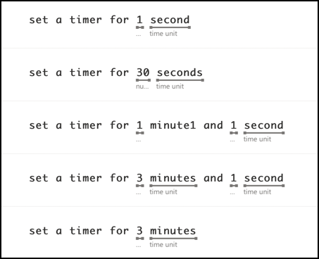

<!--
CO_OP_TRANSLATOR_METADATA:
{
  "original_hash": "6f4ba69d77f16c4a5110623a96a215c3",
  "translation_date": "2025-08-25T22:31:08+00:00",
  "source_file": "6-consumer/lessons/2-language-understanding/README.md",
  "language_code": "de"
}
-->
# Sprache verstehen


> Sketchnote von [Nitya Narasimhan](https://github.com/nitya). Klicken Sie auf das Bild für eine größere Version.

## Quiz vor der Vorlesung

[Quiz vor der Vorlesung](https://black-meadow-040d15503.1.azurestaticapps.net/quiz/43)

## Einführung

In der letzten Lektion haben Sie Sprache in Text umgewandelt. Damit dies für die Programmierung eines intelligenten Timers verwendet werden kann, muss Ihr Code verstehen, was gesagt wurde. Sie könnten davon ausgehen, dass der Benutzer einen festen Satz spricht, wie „Stelle einen 3-Minuten-Timer ein“, und diesen Ausdruck analysieren, um herauszufinden, wie lange der Timer laufen soll. Dies ist jedoch nicht sehr benutzerfreundlich. Wenn ein Benutzer sagen würde: „Stelle einen Timer für 3 Minuten ein“, würden Sie oder ich verstehen, was gemeint ist, aber Ihr Code würde dies nicht tun, da er einen festen Satz erwartet.

Hier kommt das Sprachverständnis ins Spiel, bei dem KI-Modelle verwendet werden, um Text zu interpretieren und die benötigten Details zurückzugeben. Zum Beispiel könnte das Modell sowohl „Stelle einen 3-Minuten-Timer ein“ als auch „Stelle einen Timer für 3 Minuten ein“ verstehen und erkennen, dass ein Timer für 3 Minuten erforderlich ist.

In dieser Lektion lernen Sie Sprachverständnismodelle kennen, wie man sie erstellt, trainiert und aus Ihrem Code verwendet.

In dieser Lektion behandeln wir:

* [Sprachverständnis](../../../../../6-consumer/lessons/2-language-understanding)
* [Ein Sprachverständnismodell erstellen](../../../../../6-consumer/lessons/2-language-understanding)
* [Absichten und Entitäten](../../../../../6-consumer/lessons/2-language-understanding)
* [Das Sprachverständnismodell verwenden](../../../../../6-consumer/lessons/2-language-understanding)

## Sprachverständnis

Menschen nutzen Sprache seit Hunderttausenden von Jahren zur Kommunikation. Wir kommunizieren mit Worten, Klängen oder Handlungen und verstehen, was gesagt wird – sowohl die Bedeutung der Worte, Klänge oder Handlungen als auch deren Kontext. Wir verstehen Aufrichtigkeit und Sarkasmus, wodurch dieselben Worte je nach Tonfall unterschiedliche Bedeutungen haben können.

✅ Denken Sie an einige der Gespräche, die Sie kürzlich geführt haben. Wie viel von diesen Gesprächen wäre für einen Computer schwer zu verstehen, weil sie Kontext benötigen?

Sprachverständnis, auch als natürliches Sprachverständnis bezeichnet, ist Teil eines Bereichs der künstlichen Intelligenz namens natürliche Sprachverarbeitung (oder NLP) und befasst sich mit dem Leseverständnis, also dem Versuch, die Details von Wörtern oder Sätzen zu verstehen. Wenn Sie einen Sprachassistenten wie Alexa oder Siri verwenden, haben Sie Sprachverständnisdienste genutzt. Dies sind die KI-Dienste im Hintergrund, die „Alexa, spiele das neueste Album von Taylor Swift“ in meine Tochter verwandeln, die im Wohnzimmer zu ihren Lieblingstiteln tanzt.

> 💁 Computer, trotz all ihrer Fortschritte, sind noch weit davon entfernt, Text wirklich zu verstehen. Wenn wir bei Computern von Sprachverständnis sprechen, meinen wir nichts, das auch nur annähernd so fortgeschritten ist wie menschliche Kommunikation. Stattdessen geht es darum, einige Wörter zu nehmen und wichtige Details zu extrahieren.

Als Menschen verstehen wir Sprache, ohne wirklich darüber nachzudenken. Wenn ich einen anderen Menschen bitten würde, „das neueste Album von Taylor Swift zu spielen“, dann wüsste er instinktiv, was ich meine. Für einen Computer ist das schwieriger. Er müsste die Wörter, die aus Sprache in Text umgewandelt wurden, nehmen und die folgenden Informationen herausarbeiten:

* Musik muss abgespielt werden
* Die Musik stammt von der Künstlerin Taylor Swift
* Die spezifische Musik ist ein ganzes Album mit mehreren Tracks in Reihenfolge
* Taylor Swift hat viele Alben, daher müssen diese chronologisch sortiert werden, und das zuletzt veröffentlichte ist das gewünschte

✅ Denken Sie an einige andere Sätze, die Sie gesprochen haben, wenn Sie etwas angefordert haben, wie z. B. Kaffee bestellen oder ein Familienmitglied bitten, Ihnen etwas zu reichen. Versuchen Sie, diese in die Informationen zu zerlegen, die ein Computer extrahieren müsste, um den Satz zu verstehen.

Sprachverständnismodelle sind KI-Modelle, die darauf trainiert sind, bestimmte Details aus Sprache zu extrahieren, und dann für spezifische Aufgaben mithilfe von Transferlernen trainiert werden, ähnlich wie Sie ein benutzerdefiniertes Vision-Modell mit einer kleinen Menge an Bildern trainiert haben. Sie können ein Modell nehmen und es dann mit dem Text trainieren, den Sie verstehen möchten.

## Ein Sprachverständnismodell erstellen


Sie können Sprachverständnismodelle mit LUIS erstellen, einem Sprachverständnisdienst von Microsoft, der Teil der Cognitive Services ist.

### Aufgabe – eine Authoring-Ressource erstellen

Um LUIS zu verwenden, müssen Sie eine Authoring-Ressource erstellen.

1. Verwenden Sie den folgenden Befehl, um eine Authoring-Ressource in Ihrer `smart-timer`-Ressourcengruppe zu erstellen:

    ```python
    az cognitiveservices account create --name smart-timer-luis-authoring \
                                        --resource-group smart-timer \
                                        --kind LUIS.Authoring \
                                        --sku F0 \
                                        --yes \
                                        --location <location>
    ```

    Ersetzen Sie `<location>` durch den Standort, den Sie beim Erstellen der Ressourcengruppe verwendet haben.

    > ⚠️ LUIS ist nicht in allen Regionen verfügbar. Wenn Sie die folgende Fehlermeldung erhalten:
    >
    > ```output
    > InvalidApiSetId: The account type 'LUIS.Authoring' is either invalid or unavailable in given region.
    > ```
    >
    > wählen Sie eine andere Region.

    Dadurch wird eine kostenlose LUIS-Authoring-Ressource erstellt.

### Aufgabe – eine Sprachverständnis-App erstellen

1. Öffnen Sie das LUIS-Portal unter [luis.ai](https://luis.ai?WT.mc_id=academic-17441-jabenn) in Ihrem Browser und melden Sie sich mit demselben Konto an, das Sie für Azure verwendet haben.

1. Folgen Sie den Anweisungen im Dialogfeld, um Ihr Azure-Abonnement auszuwählen, und wählen Sie dann die `smart-timer-luis-authoring`-Ressource aus, die Sie gerade erstellt haben.

1. Wählen Sie aus der Liste *Conversation apps* die Schaltfläche **New app**, um eine neue Anwendung zu erstellen. Benennen Sie die neue App `smart-timer` und setzen Sie die *Culture* auf Ihre Sprache.

    > 💁 Es gibt ein Feld für eine Vorhersageressource. Sie können eine zweite Ressource nur für Vorhersagen erstellen, aber die kostenlose Authoring-Ressource erlaubt 1.000 Vorhersagen pro Monat, was für die Entwicklung ausreichen sollte. Sie können dieses Feld also leer lassen.

1. Lesen Sie die Anleitung, die erscheint, nachdem Sie die App erstellt haben, um die Schritte zu verstehen, die Sie unternehmen müssen, um das Sprachverständnismodell zu trainieren. Schließen Sie diese Anleitung, wenn Sie fertig sind.

## Absichten und Entitäten

Das Sprachverständnis basiert auf *Absichten* und *Entitäten*. Absichten sind das Ziel der Worte, z. B. Musik abspielen, einen Timer einstellen oder Essen bestellen. Entitäten sind das, worauf sich die Absicht bezieht, wie das Album, die Dauer des Timers oder die Art des Essens. Jeder Satz, den das Modell interpretiert, sollte mindestens eine Absicht und optional eine oder mehrere Entitäten haben.

Einige Beispiele:

| Satz                                               | Absicht           | Entitäten                                   |
| -------------------------------------------------- | ----------------- | ------------------------------------------ |
| „Spiele das neueste Album von Taylor Swift“        | *Musik abspielen* | *das neueste Album von Taylor Swift*       |
| „Stelle einen 3-Minuten-Timer ein“                 | *Timer einstellen*| *3 Minuten*                                |
| „Storniere meinen Timer“                           | *Timer stornieren*| Keine                                      |
| „Bestelle 3 große Ananaspizzen und einen Caesar-Salat“ | *Essen bestellen* | *3 große Ananaspizzen*, *Caesar-Salat*     |

✅ Mit den Sätzen, die Sie sich zuvor überlegt haben, was wäre die Absicht und welche Entitäten wären in diesen Sätzen enthalten?

Um LUIS zu trainieren, legen Sie zuerst die Entitäten fest. Diese können eine feste Liste von Begriffen sein oder aus dem Text gelernt werden. Zum Beispiel könnten Sie eine feste Liste von Lebensmitteln aus Ihrem Menü bereitstellen, mit Variationen (oder Synonymen) jedes Wortes, wie *Aubergine* und *Melanzani* als Variationen von *Aubergine*. LUIS hat auch vorgefertigte Entitäten, die verwendet werden können, wie Zahlen und Orte.

Für das Einstellen eines Timers könnten Sie eine Entität mit den vorgefertigten Zahlenentitäten für die Zeit haben und eine andere für die Einheiten, wie Minuten und Sekunden. Jede Einheit hätte mehrere Variationen, um die Singular- und Pluralformen abzudecken – wie Minute und Minuten.

Nachdem die Entitäten definiert sind, erstellen Sie Absichten. Diese werden vom Modell basierend auf Beispielsätzen gelernt, die Sie bereitstellen (bekannt als Äußerungen). Zum Beispiel könnten Sie für eine *Timer einstellen*-Absicht die folgenden Sätze bereitstellen:

* `stelle einen 1-Sekunden-Timer ein`
* `stelle einen Timer für 1 Minute und 12 Sekunden ein`
* `stelle einen Timer für 3 Minuten ein`
* `stelle einen 9-Minuten-30-Sekunden-Timer ein`

Dann sagen Sie LUIS, welche Teile dieser Sätze den Entitäten zugeordnet sind:


Der Satz `stelle einen Timer für 1 Minute und 12 Sekunden ein` hat die Absicht `Timer einstellen`. Er hat auch 2 Entitäten mit jeweils 2 Werten:

|            | Zeit | Einheit |
| ---------- | ---- | ------- |
| 1 Minute   | 1    | Minute  |
| 12 Sekunden| 12   | Sekunde |

Um ein gutes Modell zu trainieren, benötigen Sie eine Vielzahl unterschiedlicher Beispielsätze, um die vielen verschiedenen Möglichkeiten abzudecken, wie jemand dasselbe anfragen könnte.

> 💁 Wie bei jedem KI-Modell gilt: Je mehr Daten und je genauer die Daten, die Sie zum Trainieren verwenden, desto besser wird das Modell.

✅ Denken Sie an die verschiedenen Möglichkeiten, wie Sie dasselbe anfragen könnten und erwarten würden, dass ein Mensch es versteht.

### Aufgabe – Entitäten zum Sprachverständnismodell hinzufügen

Für den Timer müssen Sie 2 Entitäten hinzufügen – eine für die Zeiteinheit (Minuten oder Sekunden) und eine für die Anzahl der Minuten oder Sekunden.

Anleitungen zur Verwendung des LUIS-Portals finden Sie in der [Quickstart-Dokumentation: Erstellen Sie Ihre App im LUIS-Portal auf Microsoft Docs](https://docs.microsoft.com/azure/cognitive-services/luis/luis-get-started-create-app?WT.mc_id=academic-17441-jabenn).

1. Wählen Sie im LUIS-Portal die Registerkarte *Entities* und fügen Sie die vorgefertigte Entität *number* hinzu, indem Sie die Schaltfläche **Add prebuilt entity** auswählen und dann *number* aus der Liste auswählen.

1. Erstellen Sie eine neue Entität für die Zeiteinheit mit der Schaltfläche **Create**. Benennen Sie die Entität `time unit` und setzen Sie den Typ auf *List*. Fügen Sie Werte für `minute` und `second` zur Liste der *Normalized values* hinzu und fügen Sie die Singular- und Pluralformen zur Liste der *synonyms* hinzu. Drücken Sie `return`, nachdem Sie jedes Synonym hinzugefügt haben, um es zur Liste hinzuzufügen.

    | Normalisierter Wert | Synonyme        |
    | ------------------- | --------------- |
    | Minute              | Minute, Minuten |
    | Sekunde             | Sekunde, Sekunden |

### Aufgabe – Absichten zum Sprachverständnismodell hinzufügen

1. Wählen Sie auf der Registerkarte *Intents* die Schaltfläche **Create**, um eine neue Absicht zu erstellen. Benennen Sie diese Absicht `set timer`.

1. Geben Sie in den Beispielen verschiedene Möglichkeiten ein, einen Timer einzustellen, sowohl mit Minuten, Sekunden als auch mit einer Kombination aus Minuten und Sekunden. Beispiele könnten sein:

    * `stelle einen 1-Sekunden-Timer ein`
    * `stelle einen 4-Minuten-Timer ein`
    * `stelle einen vier-Minuten-sechs-Sekunden-Timer ein`
    * `stelle einen 9-Minuten-30-Sekunden-Timer ein`
    * `stelle einen Timer für 1 Minute und 12 Sekunden ein`
    * `stelle einen Timer für 3 Minuten ein`
    * `stelle einen Timer für 3 Minuten und 1 Sekunde ein`
    * `stelle einen Timer für drei Minuten und eine Sekunde ein`
    * `stelle einen Timer für 1 Minute und 1 Sekunde ein`
    * `stelle einen Timer für 30 Sekunden ein`
    * `stelle einen Timer für 1 Sekunde ein`

    Mischen Sie Zahlen als Wörter und Zahlen, damit das Modell lernt, mit beiden umzugehen.

1. Während Sie jedes Beispiel eingeben, wird LUIS beginnen, Entitäten zu erkennen, und wird unterstreichen und kennzeichnen, was es findet.

    

### Aufgabe – Modell trainieren und testen

1. Sobald die Entitäten und Absichten konfiguriert sind, können Sie das Modell mit der Schaltfläche **Train** im oberen Menü trainieren. Wählen Sie diese Schaltfläche aus, und das Modell sollte in wenigen Sekunden trainiert werden. Die Schaltfläche wird während des Trainings ausgegraut und nach Abschluss wieder aktiviert.

1. Wählen Sie die Schaltfläche **Test** im oberen Menü, um das Sprachverständnismodell zu testen. Geben Sie Text wie `stelle einen Timer für 5 Minuten und 4 Sekunden ein` ein und drücken Sie die Eingabetaste. Der Satz wird in einem Feld unter dem Textfeld angezeigt, in das Sie ihn eingegeben haben, und darunter wird die *Top-Absicht* angezeigt, oder die Absicht, die mit der höchsten Wahrscheinlichkeit erkannt wurde. Dies sollte `set timer` sein. Der Name der Absicht wird von der Wahrscheinlichkeit gefolgt, dass die erkannte Absicht die richtige ist.

1. Wählen Sie die Option **Inspect**, um eine Aufschlüsselung der Ergebnisse zu sehen. Sie sehen die Absicht mit der höchsten Punktzahl und ihrer prozentualen Wahrscheinlichkeit sowie Listen der erkannten Entitäten.

1. Schließen Sie das *Test*-Fenster, wenn Sie mit dem Testen fertig sind.

### Aufgabe – Modell veröffentlichen

Um dieses Modell aus dem Code zu verwenden, müssen Sie es veröffentlichen. Beim Veröffentlichen aus LUIS können Sie entweder in einer Staging-Umgebung für Tests oder in einer Produktionsumgebung für eine vollständige Veröffentlichung veröffentlichen. In dieser Lektion reicht eine Staging-Umgebung aus.

1. Wählen Sie im LUIS-Portal die Schaltfläche **Publish** im oberen Menü.

1. Stellen Sie sicher, dass *Staging slot* ausgewählt ist, und wählen Sie dann **Done**. Sie sehen eine Benachrichtigung, wenn die App veröffentlicht wurde.

1. Sie können dies mit curl testen. Um den curl-Befehl zu erstellen, benötigen Sie drei Werte – den Endpunkt, die Anwendungs-ID (App ID) und einen API-Schlüssel. Diese können im Abschnitt **MANAGE** abgerufen werden, der im oberen Menü ausgewählt werden kann.

    1. Kopieren Sie aus dem Abschnitt *Settings* die App ID.
1. Wählen Sie im Abschnitt *Azure-Ressourcen* die *Authoring Resource* aus und kopieren Sie den *Primary Key* und die *Endpoint-URL*.

1. Führen Sie den folgenden Curl-Befehl in Ihrer Eingabeaufforderung oder Ihrem Terminal aus:

    ```sh
    curl "<endpoint url>/luis/prediction/v3.0/apps/<app id>/slots/staging/predict" \
          --request GET \
          --get \
          --data "subscription-key=<primary key>" \
          --data "verbose=false" \
          --data "show-all-intents=true" \
          --data-urlencode "query=<sentence>"
    ```

    Ersetzen Sie `<endpoint url>` durch die Endpoint-URL aus dem Abschnitt *Azure-Ressourcen*.

    Ersetzen Sie `<app id>` durch die App-ID aus dem Abschnitt *Einstellungen*.

    Ersetzen Sie `<primary key>` durch den Primary Key aus dem Abschnitt *Azure-Ressourcen*.

    Ersetzen Sie `<sentence>` durch den Satz, den Sie testen möchten.

1. Die Ausgabe dieses Aufrufs wird ein JSON-Dokument sein, das die Abfrage, die Top-Absicht und eine Liste von Entitäten nach Typ aufschlüsselt.

    ```JSON
    {
        "query": "set a timer for 45 minutes and 12 seconds",
        "prediction": {
            "topIntent": "set timer",
            "intents": {
                "set timer": {
                    "score": 0.97031575
                },
                "None": {
                    "score": 0.02205793
                }
            },
            "entities": {
                "number": [
                    45,
                    12
                ],
                "time-unit": [
                    [
                        "minute"
                    ],
                    [
                        "second"
                    ]
                ]
            }
        }
    }
    ```

    Das obige JSON stammt aus einer Abfrage mit `set a timer for 45 minutes and 12 seconds`:

    * Die `set timer` war die Top-Absicht mit einer Wahrscheinlichkeit von 97 %.
    * Zwei *number*-Entitäten wurden erkannt: `45` und `12`.
    * Zwei *time-unit*-Entitäten wurden erkannt: `minute` und `second`.

## Verwenden des Sprachverständnismodells

Sobald das LUIS-Modell veröffentlicht ist, kann es aus dem Code aufgerufen werden. In früheren Lektionen haben Sie einen IoT Hub verwendet, um die Kommunikation mit Cloud-Diensten zu verwalten, Telemetrie zu senden und Befehle zu empfangen. Dies ist sehr asynchron – sobald Telemetrie gesendet wird, wartet Ihr Code nicht auf eine Antwort, und wenn der Cloud-Dienst nicht verfügbar ist, würden Sie es nicht bemerken.

Für einen intelligenten Timer möchten wir sofort eine Antwort erhalten, damit wir dem Benutzer mitteilen können, dass ein Timer gesetzt wurde, oder ihn darauf hinweisen können, dass die Cloud-Dienste nicht verfügbar sind. Dazu wird unser IoT-Gerät direkt einen Web-Endpunkt aufrufen, anstatt sich auf einen IoT Hub zu verlassen.

Anstatt LUIS direkt vom IoT-Gerät aus aufzurufen, können Sie serverlosen Code mit einem anderen Auslösertyp verwenden – einem HTTP-Trigger. Dadurch kann Ihre Funktions-App REST-Anfragen empfangen und darauf reagieren. Diese Funktion wird ein REST-Endpunkt sein, den Ihr Gerät aufrufen kann.

> 💁 Obwohl Sie LUIS direkt von Ihrem IoT-Gerät aus aufrufen können, ist es besser, etwas wie serverlosen Code zu verwenden. Auf diese Weise müssen Sie, wenn Sie die LUIS-App ändern möchten, die Sie aufrufen, beispielsweise wenn Sie ein besseres Modell trainieren oder ein Modell in einer anderen Sprache trainieren, nur Ihren Cloud-Code aktualisieren und nicht den Code auf potenziell Tausenden oder Millionen von IoT-Geräten neu bereitstellen.

### Aufgabe – Erstellen einer serverlosen Funktions-App

1. Erstellen Sie eine Azure Functions-App namens `smart-timer-trigger` und öffnen Sie diese in VS Code.

1. Fügen Sie dieser App einen HTTP-Trigger namens `speech-trigger` hinzu, indem Sie den folgenden Befehl im VS Code-Terminal ausführen:

    ```sh
    func new --name text-to-timer --template "HTTP trigger"
    ```

    Dadurch wird ein HTTP-Trigger namens `text-to-timer` erstellt.

1. Testen Sie den HTTP-Trigger, indem Sie die Funktions-App ausführen. Wenn sie ausgeführt wird, sehen Sie den Endpunkt in der Ausgabe:

    ```output
    Functions:
    
            text-to-timer: [GET,POST] http://localhost:7071/api/text-to-timer
    ```

    Testen Sie dies, indem Sie die URL [http://localhost:7071/api/text-to-timer](http://localhost:7071/api/text-to-timer) in Ihrem Browser laden.

    ```output
    This HTTP triggered function executed successfully. Pass a name in the query string or in the request body for a personalized response.
    ```

### Aufgabe – Verwenden des Sprachverständnismodells

1. Das SDK für LUIS ist über ein Pip-Paket verfügbar. Fügen Sie die folgende Zeile zur Datei `requirements.txt` hinzu, um die Abhängigkeit von diesem Paket hinzuzufügen:

    ```sh
    azure-cognitiveservices-language-luis
    ```

1. Stellen Sie sicher, dass das VS Code-Terminal die virtuelle Umgebung aktiviert hat, und führen Sie den folgenden Befehl aus, um die Pip-Pakete zu installieren:

    ```sh
    pip install -r requirements.txt
    ```

    > 💁 Wenn Sie Fehler erhalten, müssen Sie möglicherweise Pip mit dem folgenden Befehl aktualisieren:
    >
    > ```sh
    > pip install --upgrade pip
    > ```

1. Fügen Sie der Datei `local.settings.json` neue Einträge für Ihren LUIS-API-Schlüssel, die Endpoint-URL und die App-ID aus dem **MANAGE**-Tab des LUIS-Portals hinzu:

    ```JSON
    "LUIS_KEY": "<primary key>",
    "LUIS_ENDPOINT_URL": "<endpoint url>",
    "LUIS_APP_ID": "<app id>"
    ```

    Ersetzen Sie `<endpoint url>` durch die Endpoint-URL aus dem Abschnitt *Azure-Ressourcen* des **MANAGE**-Tabs. Dies wird `https://<location>.api.cognitive.microsoft.com/` sein.

    Ersetzen Sie `<app id>` durch die App-ID aus dem Abschnitt *Einstellungen* des **MANAGE**-Tabs.

    Ersetzen Sie `<primary key>` durch den Primary Key aus dem Abschnitt *Azure-Ressourcen* des **MANAGE**-Tabs.

1. Fügen Sie die folgenden Importe zur Datei `__init__.py` hinzu:

    ```python
    import json
    import os
    from azure.cognitiveservices.language.luis.runtime import LUISRuntimeClient
    from msrest.authentication import CognitiveServicesCredentials
    ```

    Dies importiert einige Systembibliotheken sowie die Bibliotheken zur Interaktion mit LUIS.

1. Löschen Sie den Inhalt der `main`-Methode und fügen Sie den folgenden Code hinzu:

    ```python
    luis_key = os.environ['LUIS_KEY']
    endpoint_url = os.environ['LUIS_ENDPOINT_URL']
    app_id = os.environ['LUIS_APP_ID']
    
    credentials = CognitiveServicesCredentials(luis_key)
    client = LUISRuntimeClient(endpoint=endpoint_url, credentials=credentials)
    ```

    Dies lädt die Werte, die Sie zur Datei `local.settings.json` für Ihre LUIS-App hinzugefügt haben, erstellt ein Anmeldeobjekt mit Ihrem API-Schlüssel und erstellt dann ein LUIS-Clientobjekt, um mit Ihrer LUIS-App zu interagieren.

1. Dieser HTTP-Trigger wird aufgerufen, indem der zu verstehende Text als JSON übergeben wird, wobei der Text in einer Eigenschaft namens `text` enthalten ist. Der folgende Code extrahiert den Wert aus dem Body der HTTP-Anfrage und protokolliert ihn in der Konsole. Fügen Sie diesen Code zur `main`-Funktion hinzu:

    ```python
    req_body = req.get_json()
    text = req_body['text']
    logging.info(f'Request - {text}')
    ```

1. Vorhersagen werden von LUIS angefordert, indem eine Vorhersageanfrage gesendet wird – ein JSON-Dokument, das den vorherzusagenden Text enthält. Erstellen Sie dies mit dem folgenden Code:

    ```python
    prediction_request = { 'query' : text }
    ```

1. Diese Anfrage kann dann an LUIS gesendet werden, wobei der Staging-Slot verwendet wird, in den Ihre App veröffentlicht wurde:

    ```python
    prediction_response = client.prediction.get_slot_prediction(app_id, 'Staging', prediction_request)
    ```

1. Die Vorhersageantwort enthält die Top-Absicht – die Absicht mit der höchsten Vorhersagewahrscheinlichkeit – sowie die Entitäten. Wenn die Top-Absicht `set timer` ist, können die Entitäten gelesen werden, um die benötigte Zeit für den Timer zu erhalten:

    ```python
    if prediction_response.prediction.top_intent == 'set timer':
        numbers = prediction_response.prediction.entities['number']
        time_units = prediction_response.prediction.entities['time unit']
        total_seconds = 0
    ```

    Die `number`-Entitäten sind ein Array von Zahlen. Wenn Sie beispielsweise sagen *"Set a four minute 17 second timer."*, enthält das `number`-Array zwei Ganzzahlen – 4 und 17.

    Die `time unit`-Entitäten sind ein Array von Arrays von Zeichenfolgen, wobei jede Zeiteinheit als Array von Zeichenfolgen innerhalb des Arrays enthalten ist. Wenn Sie beispielsweise sagen *"Set a four minute 17 second timer."*, enthält das `time unit`-Array zwei Arrays mit jeweils einem Wert – `['minute']` und `['second']`.

    Die JSON-Version dieser Entitäten für *"Set a four minute 17 second timer."* lautet:

    ```json
    {
        "number": [4, 17],
        "time unit": [
            ["minute"],
            ["second"]
        ]
    }
    ```

    Dieser Code definiert auch eine Zählung für die Gesamtzeit des Timers in Sekunden. Diese wird mit den Werten aus den Entitäten gefüllt.

1. Die Entitäten sind nicht verknüpft, aber wir können einige Annahmen über sie treffen. Sie werden in der gesprochenen Reihenfolge sein, sodass die Position im Array verwendet werden kann, um zu bestimmen, welche Zahl zu welcher Zeiteinheit passt. Zum Beispiel:

    * *"Set a 30 second timer"* – dies wird eine Zahl, `30`, und eine Zeiteinheit, `second`, haben, sodass die einzelne Zahl zur einzelnen Zeiteinheit passt.
    * *"Set a 2 minute and 30 second timer"* – dies wird zwei Zahlen, `2` und `30`, und zwei Zeiteinheiten, `minute` und `second`, haben, sodass die erste Zahl zur ersten Zeiteinheit passt (2 Minuten) und die zweite Zahl zur zweiten Zeiteinheit (30 Sekunden).

    Der folgende Code ermittelt die Anzahl der Elemente in den `number`-Entitäten und verwendet diese, um das erste Element aus jedem Array zu extrahieren, dann das zweite und so weiter. Fügen Sie dies innerhalb des `if`-Blocks hinzu.

    ```python
    for i in range(0, len(numbers)):
        number = numbers[i]
        time_unit = time_units[i][0]
    ```

    Für *"Set a four minute 17 second timer."* wird dies zweimal durchlaufen und die folgenden Werte ergeben:

    | Schleifenanzahl | `number` | `time_unit` |
    | ---------------: | -------: | ----------- |
    | 0                | 4        | minute      |
    | 1                | 17       | second      |

1. Innerhalb dieser Schleife verwenden Sie die Zahl und die Zeiteinheit, um die Gesamtzeit für den Timer zu berechnen, indem Sie für jede Minute 60 Sekunden und die Anzahl der Sekunden für jede Sekunde hinzufügen.

    ```python
    if time_unit == 'minute':
        total_seconds += number * 60
    else:
        total_seconds += number
    ```

1. Außerhalb dieser Schleife durch die Entitäten protokollieren Sie die Gesamtzeit für den Timer:

    ```python
    logging.info(f'Timer required for {total_seconds} seconds')
    ```

1. Die Anzahl der Sekunden muss als HTTP-Antwort von der Funktion zurückgegeben werden. Am Ende des `if`-Blocks fügen Sie Folgendes hinzu:

    ```python
    payload = {
        'seconds': total_seconds
    }
    return func.HttpResponse(json.dumps(payload), status_code=200)
    ```

    Dieser Code erstellt eine Nutzlast, die die Gesamtanzahl der Sekunden für den Timer enthält, konvertiert sie in eine JSON-Zeichenfolge und gibt sie als HTTP-Ergebnis mit einem Statuscode von 200 zurück, was bedeutet, dass der Aufruf erfolgreich war.

1. Schließlich behandeln Sie außerhalb des `if`-Blocks den Fall, dass die Absicht nicht erkannt wurde, indem Sie einen Fehlercode zurückgeben:

    ```python
    return func.HttpResponse(status_code=404)
    ```

    404 ist der Statuscode für *nicht gefunden*.

1. Führen Sie die Funktions-App aus und testen Sie sie mit Curl.

    ```sh
    curl --request POST 'http://localhost:7071/api/text-to-timer' \
         --header 'Content-Type: application/json' \
         --include \
         --data '{"text":"<text>"}'
    ```

    Ersetzen Sie `<text>` durch den Text Ihrer Anfrage, beispielsweise `set a 2 minutes 27 second timer`.

    Sie werden die folgende Ausgabe von der Funktions-App sehen:

    ```output
    Functions:

            text-to-timer: [GET,POST] http://localhost:7071/api/text-to-timer
    
    For detailed output, run func with --verbose flag.
    [2021-06-26T19:45:14.502Z] Worker process started and initialized.
    [2021-06-26T19:45:19.338Z] Host lock lease acquired by instance ID '000000000000000000000000951CAE4E'.
    [2021-06-26T19:45:52.059Z] Executing 'Functions.text-to-timer' (Reason='This function was programmatically called via the host APIs.', Id=f68bfb90-30e4-47a5-99da-126b66218e81)
    [2021-06-26T19:45:53.577Z] Timer required for 147 seconds
    [2021-06-26T19:45:53.746Z] Executed 'Functions.text-to-timer' (Succeeded, Id=f68bfb90-30e4-47a5-99da-126b66218e81, Duration=1750ms)
    ```

    Der Curl-Aufruf wird Folgendes zurückgeben:

    ```output
    HTTP/1.1 200 OK
    Date: Tue, 29 Jun 2021 01:14:11 GMT
    Content-Type: text/plain; charset=utf-8
    Server: Kestrel
    Transfer-Encoding: chunked
    
    {"seconds": 147}
    ```

    Die Anzahl der Sekunden für den Timer befindet sich im Wert `"seconds"`.

> 💁 Sie finden diesen Code im Ordner [code/functions](../../../../../6-consumer/lessons/2-language-understanding/code/functions).

### Aufgabe – Machen Sie Ihre Funktion für Ihr IoT-Gerät verfügbar

1. Damit Ihr IoT-Gerät Ihren REST-Endpunkt aufrufen kann, muss es die URL kennen. Als Sie ihn zuvor aufgerufen haben, haben Sie `localhost` verwendet, was eine Abkürzung ist, um REST-Endpunkte auf Ihrem lokalen Computer zu erreichen. Damit Ihr IoT-Gerät Zugriff erhält, müssen Sie entweder in die Cloud veröffentlichen oder Ihre IP-Adresse verwenden, um lokal darauf zuzugreifen.

    > ⚠️ Wenn Sie ein Wio Terminal verwenden, ist es einfacher, die Funktions-App lokal auszuführen, da es eine Abhängigkeit von Bibliotheken gibt, die bedeuten, dass Sie die Funktions-App nicht auf die gleiche Weise bereitstellen können wie zuvor. Führen Sie die Funktions-App lokal aus und greifen Sie über die IP-Adresse Ihres Computers darauf zu. Wenn Sie in die Cloud bereitstellen möchten, werden in einer späteren Lektion Informationen dazu bereitgestellt.

    * Veröffentlichen der Funktions-App – Folgen Sie den Anweisungen in früheren Lektionen, um Ihre Funktions-App in die Cloud zu veröffentlichen. Sobald sie veröffentlicht ist, lautet die URL `https://<APP_NAME>.azurewebsites.net/api/text-to-timer`, wobei `<APP_NAME>` der Name Ihrer Funktions-App ist. Stellen Sie sicher, dass Sie auch Ihre lokalen Einstellungen veröffentlichen.

      Beim Arbeiten mit HTTP-Triggern sind diese standardmäßig mit einem Funktions-App-Schlüssel gesichert. Um diesen Schlüssel zu erhalten, führen Sie den folgenden Befehl aus:

      ```sh
      az functionapp keys list --resource-group smart-timer \
                               --name <APP_NAME>                               
      ```

      Kopieren Sie den Wert des `default`-Eintrags aus dem Abschnitt `functionKeys`.

      ```output
      {
        "functionKeys": {
          "default": "sQO1LQaeK9N1qYD6SXeb/TctCmwQEkToLJU6Dw8TthNeUH8VA45hlA=="
        },
        "masterKey": "RSKOAIlyvvQEQt9dfpabJT018scaLpQu9p1poHIMCxx5LYrIQZyQ/g==",
        "systemKeys": {}
      }
      ```

      Dieser Schlüssel muss als Abfrageparameter zur URL hinzugefügt werden, sodass die endgültige URL `https://<APP_NAME>.azurewebsites.net/api/text-to-timer?code=<FUNCTION_KEY>` lautet, wobei `<APP_NAME>` der Name Ihrer Funktions-App und `<FUNCTION_KEY>` Ihr Standard-Funktionsschlüssel ist.

      > 💁 Sie können die Art der Autorisierung des HTTP-Triggers mit der Einstellung `authlevel` in der Datei `function.json` ändern. Weitere Informationen dazu finden Sie im [Konfigurationsabschnitt der Azure Functions HTTP-Trigger-Dokumentation auf Microsoft Docs](https://docs.microsoft.com/azure/azure-functions/functions-bindings-http-webhook-trigger?WT.mc_id=academic-17441-jabenn&tabs=python#configuration).

    * Funktions-App lokal ausführen und über die IP-Adresse darauf zugreifen – Sie können die IP-Adresse Ihres Computers in Ihrem lokalen Netzwerk abrufen und diese verwenden, um die URL zu erstellen.

      Finden Sie Ihre IP-Adresse:

      * Unter Windows 10 folgen Sie der [Anleitung zum Finden Ihrer IP-Adresse](https://support.microsoft.com/windows/find-your-ip-address-f21a9bbc-c582-55cd-35e0-73431160a1b9?WT.mc_id=academic-17441-jabenn).
      * Unter macOS folgen Sie der [Anleitung zum Finden Ihrer IP-Adresse auf einem Mac](https://www.hellotech.com/guide/for/how-to-find-ip-address-on-mac).
      * Unter Linux folgen Sie dem Abschnitt zum Finden Ihrer privaten IP-Adresse in der [Anleitung zum Finden Ihrer IP-Adresse unter Linux](https://opensource.com/article/18/5/how-find-ip-address-linux).

      Sobald Sie Ihre IP-Adresse haben, können Sie auf die Funktion unter `http://` zugreifen.

:7071/api/text-to-timer`, wobei `<IP_ADDRESS>` Ihre IP-Adresse ist, zum Beispiel `http://192.168.1.10:7071/api/text-to-timer`.

      > 💁 Beachten Sie, dass Port 7071 verwendet wird, daher müssen Sie nach der IP-Adresse `:7071` hinzufügen.

      > 💁 Dies funktioniert nur, wenn Ihr IoT-Gerät sich im selben Netzwerk wie Ihr Computer befindet.

1. Testen Sie den Endpunkt, indem Sie ihn mit curl aufrufen.

---

## 🚀 Herausforderung

Es gibt viele Möglichkeiten, dasselbe anzufordern, wie beispielsweise das Einstellen eines Timers. Überlegen Sie sich verschiedene Möglichkeiten, dies zu tun, und verwenden Sie diese als Beispiele in Ihrer LUIS-App. Testen Sie diese aus, um zu sehen, wie gut Ihr Modell mit unterschiedlichen Arten der Timer-Anfrage umgehen kann.

## Quiz nach der Vorlesung

[Quiz nach der Vorlesung](https://black-meadow-040d15503.1.azurestaticapps.net/quiz/44)

## Rückblick & Selbststudium

* Lesen Sie mehr über LUIS und seine Fähigkeiten auf der [Language Understanding (LUIS)-Dokumentationsseite auf Microsoft Docs](https://docs.microsoft.com/azure/cognitive-services/luis/?WT.mc_id=academic-17441-jabenn)
* Lesen Sie mehr über Sprachverständnis auf der [Seite über natürliches Sprachverständnis auf Wikipedia](https://wikipedia.org/wiki/Natural-language_understanding)
* Lesen Sie mehr über HTTP-Triggers in der [Azure Functions HTTP Trigger-Dokumentation auf Microsoft Docs](https://docs.microsoft.com/azure/azure-functions/functions-bindings-http-webhook-trigger?WT.mc_id=academic-17441-jabenn&tabs=python)

## Aufgabe

[Timer abbrechen](assignment.md)

**Haftungsausschluss**:  
Dieses Dokument wurde mit dem KI-Übersetzungsdienst [Co-op Translator](https://github.com/Azure/co-op-translator) übersetzt. Obwohl wir uns um Genauigkeit bemühen, beachten Sie bitte, dass automatisierte Übersetzungen Fehler oder Ungenauigkeiten enthalten können. Das Originaldokument in seiner ursprünglichen Sprache sollte als maßgebliche Quelle betrachtet werden. Für kritische Informationen wird eine professionelle menschliche Übersetzung empfohlen. Wir übernehmen keine Haftung für Missverständnisse oder Fehlinterpretationen, die sich aus der Nutzung dieser Übersetzung ergeben.