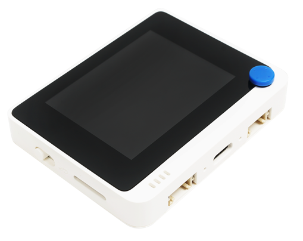

<!--
CO_OP_TRANSLATOR_METADATA:
{
  "original_hash": "9bae08314d8487cb76ddf3d8797e1544",
  "translation_date": "2025-08-27T21:16:30+00:00",
  "source_file": "1-getting-started/lessons/1-introduction-to-iot/README.md",
  "language_code": "el"
}
-->
# Εισαγωγή στο IoT

> Σκίτσο-σημείωση από τη [Nitya Narasimhan](https://github.com/nitya). Κάντε κλικ στην εικόνα για μεγαλύτερη έκδοση.

Αυτό το μάθημα διδάχθηκε ως μέρος της σειράς [Hello IoT](https://youtube.com/playlist?list=PLmsFUfdnGr3xRts0TIwyaHyQuHaNQcb6-) από το [Microsoft Reactor](https://developer.microsoft.com/reactor/?WT.mc_id=academic-17441-jabenn). Το μάθημα παρουσιάστηκε σε 2 βίντεο - ένα μάθημα διάρκειας 1 ώρας και μία ώρα γραφείου για βαθύτερη ανάλυση των θεμάτων και απαντήσεις σε ερωτήσεις.

> 🎥 Κάντε κλικ στις παραπάνω εικόνες για να παρακολουθήσετε τα βίντεο

## Ερωτηματολόγιο πριν το μάθημα

[Ερωτηματολόγιο πριν το μάθημα](https://black-meadow-040d15503.1.azurestaticapps.net/quiz/1)

## Εισαγωγή

Αυτό το μάθημα καλύπτει ορισμένα εισαγωγικά θέματα γύρω από το Διαδίκτυο των Πραγμάτων (IoT) και σας καθοδηγεί στη ρύθμιση του υλικού σας.

Σε αυτό το μάθημα θα καλύψουμε:

* [Τι είναι το 'Διαδίκτυο των Πραγμάτων';](../../../../../1-getting-started/lessons/1-introduction-to-iot)
* [Συσκευές IoT](../../../../../1-getting-started/lessons/1-introduction-to-iot)
* [Ρύθμιση της συσκευής σας](../../../../../1-getting-started/lessons/1-introduction-to-iot)
* [Εφαρμογές του IoT](../../../../../1-getting-started/lessons/1-introduction-to-iot)
* [Παραδείγματα συσκευών IoT γύρω σας](../../../../../1-getting-started/lessons/1-introduction-to-iot)

## Τι είναι το 'Διαδίκτυο των Πραγμάτων';

Ο όρος 'Διαδίκτυο των Πραγμάτων' επινοήθηκε από τον [Kevin Ashton](https://wikipedia.org/wiki/Kevin_Ashton) το 1999, για να περιγράψει τη σύνδεση του Διαδικτύου με τον φυσικό κόσμο μέσω αισθητήρων. Έκτοτε, ο όρος χρησιμοποιείται για να περιγράψει οποιαδήποτε συσκευή αλληλεπιδρά με τον φυσικό κόσμο γύρω της, είτε συλλέγοντας δεδομένα από αισθητήρες είτε παρέχοντας αλληλεπιδράσεις στον πραγματικό κόσμο μέσω ενεργοποιητών (συσκευές που κάνουν κάτι, όπως να ανάψουν έναν διακόπτη ή ένα LED), συνήθως συνδεδεμένες με άλλες συσκευές ή το Διαδίκτυο.

> **Αισθητήρες** συλλέγουν πληροφορίες από τον κόσμο, όπως μέτρηση ταχύτητας, θερμοκρασίας ή τοποθεσίας.
>
> **Ενεργοποιητές** μετατρέπουν ηλεκτρικά σήματα σε αλληλεπιδράσεις στον πραγματικό κόσμο, όπως ενεργοποίηση ενός διακόπτη, άναμμα φώτων, παραγωγή ήχων ή αποστολή σημάτων ελέγχου σε άλλο υλικό, π.χ. για να ενεργοποιηθεί μια πρίζα.

Το IoT ως τεχνολογικός τομέας περιλαμβάνει περισσότερα από απλές συσκευές - περιλαμβάνει υπηρεσίες που βασίζονται στο cloud για την επεξεργασία δεδομένων από αισθητήρες ή την αποστολή αιτημάτων σε ενεργοποιητές συνδεδεμένους με συσκευές IoT. Περιλαμβάνει επίσης συσκευές που δεν έχουν ή δεν χρειάζονται σύνδεση στο Διαδίκτυο, συχνά αναφερόμενες ως συσκευές άκρου. Αυτές είναι συσκευές που μπορούν να επεξεργαστούν και να ανταποκριθούν στα δεδομένα αισθητήρων μόνες τους, συνήθως χρησιμοποιώντας μοντέλα AI που έχουν εκπαιδευτεί στο cloud.

Το IoT είναι ένας ταχέως αναπτυσσόμενος τεχνολογικός τομέας. Υπολογίζεται ότι μέχρι το τέλος του 2020, 30 δισεκατομμύρια συσκευές IoT είχαν αναπτυχθεί και συνδεθεί στο Διαδίκτυο. Στο μέλλον, εκτιμάται ότι μέχρι το 2025, οι συσκευές IoT θα συλλέγουν σχεδόν 80 zettabytes δεδομένων ή 80 τρισεκατομμύρια gigabytes. Αυτό είναι τεράστιος όγκος δεδομένων!

✅ Κάντε λίγη έρευνα: Πόσα από τα δεδομένα που παράγονται από συσκευές IoT χρησιμοποιούνται πραγματικά και πόσα αγνοούνται; Γιατί αγνοείται τόσο μεγάλος όγκος δεδομένων;

Αυτά τα δεδομένα είναι το κλειδί για την επιτυχία του IoT. Για να γίνετε επιτυχημένος προγραμματιστής IoT, πρέπει να κατανοήσετε ποια δεδομένα χρειάζεται να συλλέξετε, πώς να τα συλλέξετε, πώς να λαμβάνετε αποφάσεις βάσει αυτών και πώς να χρησιμοποιείτε αυτές τις αποφάσεις για να αλληλεπιδράσετε με τον φυσικό κόσμο, αν χρειαστεί.

## Συσκευές IoT

Το **T** στο IoT αντιπροσωπεύει τα **Πράγματα** - συσκευές που αλληλεπιδρούν με τον φυσικό κόσμο γύρω τους είτε συλλέγοντας δεδομένα από αισθητήρες είτε παρέχοντας αλληλεπιδράσεις στον πραγματικό κόσμο μέσω ενεργοποιητών.

Οι συσκευές για παραγωγή ή εμπορική χρήση, όπως οι καταναλωτικοί ιχνηλάτες φυσικής κατάστασης ή οι βιομηχανικοί ελεγκτές μηχανών, είναι συνήθως κατασκευασμένες κατά παραγγελία. Χρησιμοποιούν προσαρμοσμένες πλακέτες κυκλωμάτων, ίσως ακόμη και προσαρμοσμένους επεξεργαστές, σχεδιασμένους για να καλύπτουν τις ανάγκες μιας συγκεκριμένης εργασίας, είτε πρόκειται για το να είναι αρκετά μικρές ώστε να χωρούν σε έναν καρπό είτε αρκετά ανθεκτικές για να λειτουργούν σε περιβάλλοντα υψηλής θερμοκρασίας, πίεσης ή δονήσεων.

Ως προγραμματιστής που μαθαίνει για το IoT ή δημιουργεί ένα πρωτότυπο συσκευής, θα χρειαστεί να ξεκινήσετε με ένα κιτ ανάπτυξης. Αυτές είναι γενικής χρήσης συσκευές IoT σχεδιασμένες για προγραμματιστές, συχνά με χαρακτηριστικά που δεν θα υπήρχαν σε μια συσκευή παραγωγής, όπως εξωτερικές ακίδες για σύνδεση αισθητήρων ή ενεργοποιητών, υλικό για υποστήριξη αποσφαλμάτωσης ή πρόσθετους πόρους που θα αύξαναν το κόστος σε μια μεγάλη παραγωγή.

Αυτά τα κιτ ανάπτυξης συνήθως χωρίζονται σε δύο κατηγορίες - μικροελεγκτές και υπολογιστές μονού πίνακα. Αυτά θα παρουσιαστούν εδώ, και θα τα αναλύσουμε περισσότερο στο επόμενο μάθημα.

> 💁 Το τηλέφωνό σας μπορεί επίσης να θεωρηθεί ως μια γενικής χρήσης συσκευή IoT, με ενσωματωμένους αισθητήρες και ενεργοποιητές, με διαφορετικές εφαρμογές να χρησιμοποιούν τους αισθητήρες και τους ενεργοποιητές με διαφορετικούς τρόπους και με διαφορετικές υπηρεσίες cloud. Μπορείτε ακόμη να βρείτε ορισμένα μαθήματα IoT που χρησιμοποιούν μια εφαρμογή τηλεφώνου ως συσκευή IoT.

### Μικροελεγκτές

Ένας μικροελεγκτής (επίσης γνωστός ως MCU, συντομογραφία του microcontroller unit) είναι ένας μικρός υπολογιστής που αποτελείται από:

🧠 Έναν ή περισσότερους κεντρικούς επεξεργαστές (CPUs) - τον 'εγκέφαλο' του μικροελεγκτή που εκτελεί το πρόγραμμά σας

💾 Μνήμη (RAM και μνήμη προγράμματος) - όπου αποθηκεύεται το πρόγραμμά σας, τα δεδομένα και οι μεταβλητές

🔌 Προγραμματιζόμενες συνδέσεις εισόδου/εξόδου (I/O) - για επικοινωνία με εξωτερικές περιφερειακές συσκευές (συνδεδεμένες συσκευές) όπως αισθητήρες και ενεργοποιητές

Οι μικροελεγκτές είναι συνήθως χαμηλού κόστους υπολογιστικές συσκευές, με μέσες τιμές για αυτές που χρησιμοποιούνται σε προσαρμοσμένο υλικό να πέφτουν γύρω στα 0,50 δολάρια ΗΠΑ, και ορισμένες συσκευές να κοστίζουν μόλις 0,03 δολάρια ΗΠΑ. Τα κιτ ανάπτυξης μπορούν να ξεκινήσουν από μόλις 4 δολάρια ΗΠΑ, με το κόστος να αυξάνεται καθώς προστίθενται περισσότερα χαρακτηριστικά. Το [Wio Terminal](https://www.seeedstudio.com/Wio-Terminal-p-4509.html), ένα κιτ ανάπτυξης μικροελεγκτή από τη [Seeed studios](https://www.seeedstudio.com) που διαθέτει αισθητήρες, ενεργοποιητές, WiFi και οθόνη, κοστίζει περίπου 30 δολάρια ΗΠΑ.

> 💁 Όταν ψάχνετε στο Διαδίκτυο για μικροελεγκτές, να είστε προσεκτικοί με την αναζήτηση του όρου **MCU**, καθώς αυτό θα επιστρέψει πολλά αποτελέσματα για το Marvel Cinematic Universe, όχι για μικροελεγκτές.

Οι μικροελεγκτές έχουν σχεδιαστεί για να προγραμματίζονται ώστε να εκτελούν έναν περιορισμένο αριθμό πολύ συγκεκριμένων εργασιών, αντί να είναι γενικής χρήσης υπολογιστές όπως οι υπολογιστές PC ή Mac. Εκτός από πολύ συγκεκριμένα σενάρια, δεν μπορείτε να συνδέσετε οθόνη, πληκτρολόγιο και ποντίκι και να τα χρησιμοποιήσετε για γενικούς σκοπούς.

Τα κιτ ανάπτυξης μικροελεγκτών συνήθως συνοδεύονται από πρόσθετους ενσωματωμένους αισθητήρες και ενεργοποιητές. Οι περισσότερες πλακέτες θα έχουν ένα ή περισσότερα LED που μπορείτε να προγραμματίσετε, μαζί με άλλες συσκευές όπως τυπικές υποδοχές για την προσθήκη περισσότερων αισθητήρων ή ενεργοποιητών χρησιμοποιώντας διάφορα οικοσυστήματα κατασκευαστών ή ενσωματωμένους αισθητήρες (συνήθως τους πιο δημοφιλείς, όπως αισθητήρες θερμοκρασίας). Ορισμένοι μικροελεγκτές διαθέτουν ενσωματωμένη ασύρματη συνδεσιμότητα όπως Bluetooth ή WiFi ή έχουν πρόσθετους μικροελεγκτές στην πλακέτα για να προσθέσουν αυτή τη συνδεσιμότητα.

> 💁 Οι μικροελεγκτές συνήθως προγραμματίζονται σε C/C++.

### Υπολογιστές μονού πίνακα

Ένας υπολογιστής μονού πίνακα είναι μια μικρή υπολογιστική συσκευή που περιέχει όλα τα στοιχεία ενός πλήρους υπολογιστή σε μια μικρή πλακέτα. Αυτές είναι συσκευές που έχουν προδιαγραφές κοντά σε έναν επιτραπέζιο ή φορητό υπολογιστή PC ή Mac, τρέχουν ένα πλήρες λειτουργικό σύστημα, αλλά είναι μικρότερες, καταναλώνουν λιγότερη ενέργεια και είναι σημαντικά φθηνότερες.

Το Raspberry Pi είναι ένας από τους πιο δημοφιλείς υπολογιστές μονού πίνακα.

Όπως ένας μικροελεγκτής, οι υπολογιστές μονού πίνακα διαθέτουν CPU, μνήμη και ακίδες εισόδου/εξόδου, αλλά έχουν πρόσθετα χαρακτηριστικά όπως ένα τσιπ γραφικών για σύνδεση οθονών, εξόδους ήχου και θύρες USB για σύνδεση πληκτρολογίων, ποντικιών και άλλων τυπικών USB συσκευών όπως κάμερες ή εξωτερική αποθήκευση. Τα προγράμματα αποθηκεύονται σε κάρτες SD ή σκληρούς δίσκους μαζί με το λειτουργικό σύστημα, αντί για ένα τσιπ μνήμης ενσωματωμένο στην πλακέτα.

> 🎓 Μπορείτε να σκεφτείτε έναν υπολογιστή μονού πίνακα ως μια μικρότερη, φθηνότερη έκδοση του PC ή Mac που χρησιμοποιείτε αυτή τη στιγμή, με την προσθήκη ακίδων GPIO (γενικής χρήσης εισόδου/εξόδου) για αλληλεπίδραση με αισθητήρες και ενεργοποιητές.

Οι υπολογιστές μονού πίνακα είναι πλήρως εξοπλισμένοι υπολογιστές, οπότε μπορούν να προγραμματιστούν σε οποιαδήποτε γλώσσα. Οι συσκευές IoT συνήθως προγραμματίζονται σε Python.

### Επιλογές υλικού για τα υπόλοιπα μαθήματα

Όλα τα επόμενα μαθήματα περιλαμβάνουν εργασίες που χρησιμοποιούν μια συσκευή IoT για αλληλεπίδραση με τον φυσικό κόσμο και επικοινωνία με το cloud. Κάθε μάθημα υποστηρίζει 3 επιλογές συσκευών - Arduino (χρησιμοποιώντας ένα Seeed Studios Wio Terminal) ή έναν υπολογιστή μονού πίνακα, είτε μια φυσική συσκευή (ένα Raspberry Pi 4) είτε έναν εικονικό υπολογιστή μονού πίνακα που τρέχει στον υπολογιστή σας.

Μπορείτε να διαβάσετε για το υλικό που χρειάζεται για να ολοκληρώσετε όλες τις εργασίες στον [οδηγό υλικού](../../../hardware.md).

> 💁 Δεν χρειάζεται να αγοράσετε κανένα υλικό IoT για να ολοκληρώσετε τις εργασίες, μπορείτε να κάνετε τα πάντα χρησιμοποιώντας έναν εικονικό υπολογιστή μονού πίνακα.

Ποιο υλικό θα επιλέξετε εξαρτάται από το τι έχετε διαθέσιμο είτε στο σπίτι είτε στο σχολείο σας, και από τη γλώσσα προγραμματισμού που γνωρίζετε ή σκοπεύετε να μάθετε. Και οι δύο παραλλαγές υλικού θα χρησιμοποιούν το ίδιο οικοσύστημα αισθητήρων, οπότε αν ξεκινήσετε με τη μία επιλογή, μπορείτε να αλλάξετε στην άλλη χωρίς να χρειαστεί να αντικαταστήσετε το μεγαλύτερο μέρος του εξοπλισμού. Ο εικονικός υπολογιστής μονού πίνακα θα είναι ισοδύναμος με την εκμάθηση σε ένα Raspberry Pi, με τον περισσότερο κώδικα να μπορεί να μεταφερθεί στο Pi αν τελικά αποκτήσετε μια συσκευή και αισθητήρες.

### Κιτ ανάπτυξης Arduino

Αν σας ενδιαφέρει να μάθετε ανάπτυξη μικροελεγκτών, μπορείτε να ολοκληρώσετε τις εργασίες χρησιμοποιώντας μια συσκευή Arduino. Θα χρειαστείτε μια βασική κατανόηση του προγραμματισμού σε C/C++, καθώς τα μαθήματα θα διδάσκουν μόνο τον κώδικα που είναι σχετικός με το πλαίσιο Arduino, τους αισθητήρες και τους ενεργοποιητές που χρησιμοποιούνται, και τις βιβλιοθήκες που αλληλεπιδρούν με το cloud.

Οι εργασίες θα χρησιμοποιούν το [Visual Studio Code](https://code.visualstudio.com/?WT.mc_id=academic-17441-jabenn) με την επέκταση [PlatformIO για ανάπτυξη μικροελεγκτών](https://platformio.org). Μπορείτε επίσης να χρησιμοποιήσετε το Arduino IDE αν είστε εξοικειωμένοι με αυτό το εργαλείο, καθώς δεν θα παρέχονται οδηγίες.

### Κιτ ανάπτυξης υπολογιστή μονού πίνακα

Αν σας ενδιαφέρει να μάθετε ανάπτυξη IoT χρησιμοποιώντας υπολογιστές μονού πίνακα, μπορείτε να ολοκληρώσετε τις εργασίες χρησιμοποιώντας ένα Raspberry Pi ή μια εικονική συσκευή που τρέχει στον υπολογιστή σας.

Θα χρειαστείτε μια βασική κατανόηση του προγραμματισμού σε Python, καθώς τα μαθήματα θα διδάσκουν μόνο τον κώδικα που είναι σχετικός με τους αισθητήρες και τους ενεργοποιητές που χρησιμοποιούνται, και τις βιβλιοθήκες που αλληλεπιδρούν με το cloud
> 💁 Αν δεν έχετε ακόμα συσκευή, ανατρέξτε στον [οδηγό υλικού](../../../hardware.md) για να σας βοηθήσει να αποφασίσετε ποια συσκευή θα χρησιμοποιήσετε και ποιο επιπλέον υλικό χρειάζεται να αγοράσετε. Δεν είναι απαραίτητο να αγοράσετε υλικό, καθώς όλα τα έργα μπορούν να εκτελεστούν σε εικονικό υλικό.
Αυτές οι οδηγίες περιλαμβάνουν συνδέσμους σε ιστότοπους τρίτων από τους δημιουργούς του υλικού ή των εργαλείων που θα χρησιμοποιήσετε. Αυτό γίνεται για να διασφαλιστεί ότι χρησιμοποιείτε πάντα τις πιο ενημερωμένες οδηγίες για τα διάφορα εργαλεία και υλικά.

Ακολουθήστε τον αντίστοιχο οδηγό για να ρυθμίσετε τη συσκευή σας και να ολοκληρώσετε ένα έργο 'Hello World'. Αυτό θα είναι το πρώτο βήμα για τη δημιουργία ενός IoT φωτιστικού νύχτας κατά τη διάρκεια των 4 μαθημάτων σε αυτό το εισαγωγικό μέρος.

* [Arduino - Wio Terminal](wio-terminal.md)
* [Μονοπλακέτα υπολογιστής - Raspberry Pi](pi.md)
* [Μονοπλακέτα υπολογιστής - Εικονική συσκευή](virtual-device.md)

✅ Θα χρησιμοποιήσετε το VS Code τόσο για το Arduino όσο και για τους μονοπλακέτα υπολογιστές. Αν δεν το έχετε χρησιμοποιήσει πριν, διαβάστε περισσότερα γι' αυτό στον [ιστότοπο του VS Code](https://code.visualstudio.com?WT.mc_id=academic-17441-jabenn).

## Εφαρμογές του IoT

Το IoT καλύπτει ένα τεράστιο φάσμα χρήσεων, σε μερικές ευρείες κατηγορίες:

* Καταναλωτικό IoT
* Εμπορικό IoT
* Βιομηχανικό IoT
* IoT Υποδομών

✅ Κάντε λίγη έρευνα: Για κάθε μία από τις παρακάτω περιοχές, βρείτε ένα συγκεκριμένο παράδειγμα που δεν αναφέρεται στο κείμενο.

### Καταναλωτικό IoT

Το καταναλωτικό IoT αναφέρεται σε IoT συσκευές που οι καταναλωτές αγοράζουν και χρησιμοποιούν στο σπίτι. Ορισμένες από αυτές τις συσκευές είναι εξαιρετικά χρήσιμες, όπως έξυπνα ηχεία, έξυπνα συστήματα θέρμανσης και ρομποτικές σκούπες. Άλλες είναι αμφίβολης χρησιμότητας, όπως βρύσες που ελέγχονται με φωνή και δεν μπορείτε να τις κλείσετε επειδή ο φωνητικός έλεγχος δεν σας ακούει πάνω από τον ήχο του τρεχούμενου νερού.

Οι καταναλωτικές IoT συσκευές δίνουν τη δυνατότητα στους ανθρώπους να πετυχαίνουν περισσότερα στο περιβάλλον τους, ειδικά στο 1 δισεκατομμύριο ανθρώπων που έχουν κάποια αναπηρία. Οι ρομποτικές σκούπες μπορούν να προσφέρουν καθαρά πατώματα σε άτομα με κινητικά προβλήματα που δεν μπορούν να σκουπίσουν μόνα τους, οι φούρνοι που ελέγχονται με φωνή επιτρέπουν σε άτομα με περιορισμένη όραση ή κινητικό έλεγχο να ζεστάνουν τους φούρνους τους μόνο με τη φωνή τους, ενώ οι συσκευές παρακολούθησης υγείας επιτρέπουν στους ασθενείς να παρακολουθούν χρόνιες παθήσεις με πιο τακτικές και λεπτομερείς ενημερώσεις για την κατάστασή τους. Αυτές οι συσκευές γίνονται τόσο διαδεδομένες που ακόμη και μικρά παιδιά τις χρησιμοποιούν στην καθημερινότητά τους, για παράδειγμα, μαθητές που κάνουν εικονική εκπαίδευση κατά τη διάρκεια της πανδημίας COVID, ρυθμίζοντας χρονοδιακόπτες σε έξυπνες οικιακές συσκευές για να παρακολουθούν τη σχολική τους εργασία ή ξυπνητήρια για να τους υπενθυμίζουν τις επερχόμενες συναντήσεις της τάξης.

✅ Ποιες καταναλωτικές IoT συσκευές έχετε πάνω σας ή στο σπίτι σας;

### Εμπορικό IoT

Το εμπορικό IoT καλύπτει τη χρήση του IoT στον χώρο εργασίας. Σε ένα γραφείο, μπορεί να υπάρχουν αισθητήρες πληρότητας και ανιχνευτές κίνησης για τη διαχείριση του φωτισμού και της θέρμανσης, ώστε να λειτουργούν μόνο όταν χρειάζεται, μειώνοντας το κόστος και τις εκπομπές άνθρακα. Σε ένα εργοστάσιο, οι IoT συσκευές μπορούν να παρακολουθούν κινδύνους ασφαλείας, όπως εργαζόμενους που δεν φορούν κράνη ή θόρυβο που έχει φτάσει σε επικίνδυνα επίπεδα. Στο λιανικό εμπόριο, οι IoT συσκευές μπορούν να μετρούν τη θερμοκρασία των ψυκτικών αποθηκευτικών χώρων, ειδοποιώντας τον ιδιοκτήτη του καταστήματος αν ένα ψυγείο ή καταψύκτης είναι εκτός της απαιτούμενης θερμοκρασίας, ή μπορούν να παρακολουθούν αντικείμενα στα ράφια για να καθοδηγούν τους υπαλλήλους να αναπληρώσουν προϊόντα που έχουν πωληθεί. Η βιομηχανία μεταφορών βασίζεται όλο και περισσότερο στο IoT για την παρακολούθηση της θέσης των οχημάτων, την καταγραφή των χιλιομέτρων στον δρόμο για χρέωση χρήσης δρόμων, την παρακολούθηση των ωρών και της συμμόρφωσης με τα διαλείμματα των οδηγών ή την ειδοποίηση του προσωπικού όταν ένα όχημα πλησιάζει σε ένα σταθμό για να προετοιμαστεί για φόρτωση ή εκφόρτωση.

✅ Ποιες εμπορικές IoT συσκευές έχετε στο σχολείο ή στον χώρο εργασίας σας;

### Βιομηχανικό IoT (IIoT)

Το βιομηχανικό IoT, ή IIoT, είναι η χρήση IoT συσκευών για τον έλεγχο και τη διαχείριση μηχανημάτων σε μεγάλη κλίμακα. Αυτό καλύπτει ένα ευρύ φάσμα χρήσεων, από εργοστάσια έως ψηφιακή γεωργία.

Τα εργοστάσια χρησιμοποιούν IoT συσκευές με πολλούς διαφορετικούς τρόπους. Τα μηχανήματα μπορούν να παρακολουθούνται με πολλαπλούς αισθητήρες για την καταγραφή παραμέτρων όπως η θερμοκρασία, οι δονήσεις και η ταχύτητα περιστροφής. Αυτά τα δεδομένα μπορούν να παρακολουθούνται ώστε να σταματήσει το μηχάνημα αν βγει εκτός ορισμένων ορίων - για παράδειγμα, αν υπερθερμανθεί και χρειαστεί να απενεργοποιηθεί. Αυτά τα δεδομένα μπορούν επίσης να συλλέγονται και να αναλύονται με την πάροδο του χρόνου για την πρόβλεψη συντήρησης, όπου μοντέλα AI θα εξετάζουν τα δεδομένα που οδηγούν σε μια βλάβη και θα τα χρησιμοποιούν για να προβλέψουν άλλες βλάβες πριν συμβούν.

Η ψηφιακή γεωργία είναι σημαντική αν ο πλανήτης θέλει να θρέψει τον αυξανόμενο πληθυσμό, ειδικά για τα 2 δισεκατομμύρια ανθρώπους σε 500 εκατομμύρια νοικοκυριά που επιβιώνουν από [γεωργία επιβίωσης](https://wikipedia.org/wiki/Subsistence_agriculture). Η ψηφιακή γεωργία μπορεί να κυμαίνεται από αισθητήρες λίγων δολαρίων έως τεράστιες εμπορικές εγκαταστάσεις. Ένας αγρότης μπορεί να ξεκινήσει παρακολουθώντας τις θερμοκρασίες και χρησιμοποιώντας [ημέρες βαθμού ανάπτυξης](https://wikipedia.org/wiki/Growing_degree-day) για να προβλέψει πότε μια καλλιέργεια θα είναι έτοιμη για συγκομιδή. Μπορούν να συνδέσουν την παρακολούθηση της υγρασίας του εδάφους με αυτοματοποιημένα συστήματα ποτίσματος για να δώσουν στα φυτά τους όσο νερό χρειάζονται, αλλά όχι περισσότερο, ώστε να διασφαλίσουν ότι οι καλλιέργειες τους δεν θα στεγνώσουν χωρίς να σπαταλήσουν νερό. Οι αγρότες προχωρούν ακόμη περισσότερο χρησιμοποιώντας drones, δεδομένα από δορυφόρους και AI για την παρακολούθηση της ανάπτυξης των καλλιεργειών, των ασθενειών και της ποιότητας του εδάφους σε τεράστιες εκτάσεις γεωργικής γης.

✅ Ποιες άλλες IoT συσκευές θα μπορούσαν να βοηθήσουν τους αγρότες;

### IoT Υποδομών

Το IoT Υποδομών παρακολουθεί και ελέγχει τις τοπικές και παγκόσμιες υποδομές που χρησιμοποιούν οι άνθρωποι καθημερινά.

[Έξυπνες πόλεις](https://wikipedia.org/wiki/Smart_city) είναι αστικές περιοχές που χρησιμοποιούν IoT συσκευές για τη συλλογή δεδομένων σχετικά με την πόλη και τη χρήση αυτών για τη βελτίωση της λειτουργίας της πόλης. Αυτές οι πόλεις συνήθως λειτουργούν με συνεργασίες μεταξύ τοπικών κυβερνήσεων, ακαδημαϊκών ιδρυμάτων και τοπικών επιχειρήσεων, παρακολουθώντας και διαχειριζόμενες πράγματα που ποικίλλουν από τις μεταφορές έως τη στάθμευση και τη ρύπανση. Για παράδειγμα, στην Κοπεγχάγη της Δανίας, η ατμοσφαιρική ρύπανση είναι σημαντική για τους τοπικούς κατοίκους, οπότε μετριέται και τα δεδομένα χρησιμοποιούνται για την παροχή πληροφοριών σχετικά με τις καθαρότερες διαδρομές για ποδηλασία και τζόκινγκ.

[Έξυπνα δίκτυα ηλεκτρικής ενέργειας](https://wikipedia.org/wiki/Smart_grid) επιτρέπουν καλύτερη ανάλυση της ζήτησης ενέργειας συλλέγοντας δεδομένα χρήσης σε επίπεδο μεμονωμένων κατοικιών. Αυτά τα δεδομένα μπορούν να καθοδηγήσουν αποφάσεις σε εθνικό επίπεδο, όπως πού να κατασκευαστούν νέοι σταθμοί παραγωγής ενέργειας, και σε προσωπικό επίπεδο, παρέχοντας στους χρήστες πληροφορίες για το πόση ενέργεια χρησιμοποιούν, πότε τη χρησιμοποιούν και ακόμη και προτάσεις για τη μείωση του κόστους, όπως η φόρτιση ηλεκτρικών αυτοκινήτων τη νύχτα.

✅ Αν μπορούσατε να προσθέσετε IoT συσκευές για να μετρήσετε κάτι όπου ζείτε, τι θα ήταν;

## Παραδείγματα IoT συσκευών που μπορεί να έχετε γύρω σας

Θα εκπλαγείτε από το πόσες IoT συσκευές έχετε γύρω σας. Γράφω αυτό από το σπίτι και έχω τις εξής συσκευές συνδεδεμένες στο Διαδίκτυο με έξυπνες λειτουργίες όπως έλεγχος μέσω εφαρμογής, φωνητικός έλεγχος ή η δυνατότητα να μου στέλνουν δεδομένα μέσω του τηλεφώνου μου:

* Πολλαπλά έξυπνα ηχεία
* Ψυγείο, πλυντήριο πιάτων, φούρνος και φούρνος μικροκυμάτων
* Μετρητής ηλεκτρικής ενέργειας για ηλιακούς συλλέκτες
* Έξυπνες πρίζες
* Κουδούνι με κάμερα και κάμερες ασφαλείας
* Έξυπνος θερμοστάτης με πολλαπλούς έξυπνους αισθητήρες δωματίου
* Ανοιχτήρι γκαραζόπορτας
* Συστήματα ψυχαγωγίας στο σπίτι και τηλεοράσεις με φωνητικό έλεγχο
* Φώτα
* Συσκευές παρακολούθησης φυσικής κατάστασης και υγείας

Όλοι αυτοί οι τύποι συσκευών έχουν αισθητήρες και/ή ενεργοποιητές και επικοινωνούν με το Διαδίκτυο. Μπορώ να δω από το τηλέφωνό μου αν η γκαραζόπορτα μου είναι ανοιχτή και να ζητήσω από το έξυπνο ηχείο μου να την κλείσει για μένα. Μπορώ ακόμη και να την ρυθμίσω σε χρονοδιακόπτη ώστε αν είναι ακόμα ανοιχτή τη νύχτα, να κλείσει αυτόματα. Όταν χτυπάει το κουδούνι μου, μπορώ να δω από το τηλέφωνό μου ποιος είναι εκεί όπου κι αν βρίσκομαι στον κόσμο και να μιλήσω μαζί του μέσω ενός ηχείου και μικροφώνου ενσωματωμένου στο κουδούνι. Μπορώ να παρακολουθώ τη γλυκόζη στο αίμα μου, τον καρδιακό ρυθμό και τα μοτίβα ύπνου, αναζητώντας μοτίβα στα δεδομένα για να βελτιώσω την υγεία μου. Μπορώ να ελέγχω τα φώτα μου μέσω του cloud και να κάθομαι στο σκοτάδι όταν η σύνδεση στο Διαδίκτυο πέφτει.

---

## 🚀 Πρόκληση

Καταγράψτε όσες IoT συσκευές μπορείτε που βρίσκονται στο σπίτι, το σχολείο ή τον χώρο εργασίας σας - μπορεί να είναι περισσότερες από όσες νομίζετε!

## Κουίζ μετά το μάθημα

[Κουίζ μετά το μάθημα](https://black-meadow-040d15503.1.azurestaticapps.net/quiz/2)

## Ανασκόπηση & Αυτομελέτη

Διαβάστε για τα οφέλη και τις αποτυχίες των καταναλωτικών IoT έργων. Ελέγξτε ειδησεογραφικούς ιστότοπους για άρθρα σχετικά με περιπτώσεις που έχουν αποτύχει, όπως θέματα ιδιωτικότητας, προβλήματα υλικού ή προβλήματα που προκαλούνται από έλλειψη συνδεσιμότητας.

Μερικά παραδείγματα:

* Δείτε τον λογαριασμό Twitter **[Internet of Sh*t](https://twitter.com/internetofshit)** *(προειδοποίηση για βωμολοχίες)* για μερικά καλά παραδείγματα αποτυχιών με καταναλωτικό IoT.
* [c|net - Το Apple Watch μου έσωσε τη ζωή μου: 5 άνθρωποι μοιράζονται τις ιστορίες τους](https://www.cnet.com/news/apple-watch-lifesaving-health-features-read-5-peoples-stories/)
* [c|net - Τεχνικός της ADT παραδέχεται ενοχή για παρακολούθηση των ροών κάμερας πελατών για χρόνια](https://www.cnet.com/news/adt-home-security-technician-pleads-guilty-to-spying-on-customer-camera-feeds-for-years/) *(προειδοποίηση για μη συναινετική παρακολούθηση)*

## Εργασία

[Ερευνήστε ένα IoT έργο](assignment.md)

---

**Αποποίηση ευθύνης**:  
Αυτό το έγγραφο έχει μεταφραστεί χρησιμοποιώντας την υπηρεσία αυτόματης μετάφρασης [Co-op Translator](https://github.com/Azure/co-op-translator). Παρόλο που καταβάλλουμε προσπάθειες για ακρίβεια, παρακαλούμε να έχετε υπόψη ότι οι αυτοματοποιημένες μεταφράσεις ενδέχεται να περιέχουν λάθη ή ανακρίβειες. Το πρωτότυπο έγγραφο στη μητρική του γλώσσα θα πρέπει να θεωρείται η αυθεντική πηγή. Για κρίσιμες πληροφορίες, συνιστάται επαγγελματική ανθρώπινη μετάφραση. Δεν φέρουμε ευθύνη για τυχόν παρεξηγήσεις ή εσφαλμένες ερμηνείες που προκύπτουν από τη χρήση αυτής της μετάφρασης.