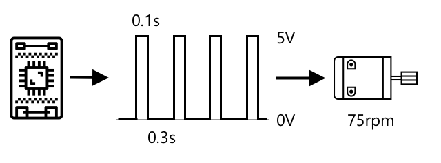

<!--
CO_OP_TRANSLATOR_METADATA:
{
  "original_hash": "e9ee00eb5fc55922a73762acc542166b",
  "translation_date": "2025-08-27T21:25:50+00:00",
  "source_file": "1-getting-started/lessons/3-sensors-and-actuators/README.md",
  "language_code": "el"
}
-->
# Αλληλεπίδραση με τον φυσικό κόσμο μέσω αισθητήρων και ενεργοποιητών


> Σχεδιαστικό σημείωμα από τη [Nitya Narasimhan](https://github.com/nitya). Κάντε κλικ στην εικόνα για μεγαλύτερη έκδοση.

Αυτή η ενότητα διδάχθηκε ως μέρος της σειράς [Hello IoT](https://youtube.com/playlist?list=PLmsFUfdnGr3xRts0TIwyaHyQuHaNQcb6-) από το [Microsoft Reactor](https://developer.microsoft.com/reactor/?WT.mc_id=academic-17441-jabenn). Η ενότητα παρουσιάστηκε σε 2 βίντεο - ένα μάθημα διάρκειας 1 ώρας και μια ώρα γραφείου για πιο βαθιά ανάλυση και απαντήσεις σε ερωτήσεις.

[](https://youtu.be/Lqalu1v6aF4)

[](https://youtu.be/qR3ekcMlLWA)

> 🎥 Κάντε κλικ στις παραπάνω εικόνες για να παρακολουθήσετε τα βίντεο

## Ερωτηματολόγιο πριν το μάθημα

[Ερωτηματολόγιο πριν το μάθημα](https://black-meadow-040d15503.1.azurestaticapps.net/quiz/5)

## Εισαγωγή

Αυτή η ενότητα εισάγει δύο σημαντικές έννοιες για τη συσκευή IoT σας - τους αισθητήρες και τους ενεργοποιητές. Θα ασχοληθείτε πρακτικά με αυτά, προσθέτοντας έναν αισθητήρα φωτός στο IoT πρότζεκτ σας και στη συνέχεια ένα LED που ελέγχεται από τα επίπεδα φωτός, δημιουργώντας ουσιαστικά ένα νυχτερινό φως.

Σε αυτή την ενότητα θα καλύψουμε:

* [Τι είναι οι αισθητήρες;](../../../../../1-getting-started/lessons/3-sensors-and-actuators)
* [Χρήση ενός αισθητήρα](../../../../../1-getting-started/lessons/3-sensors-and-actuators)
* [Τύποι αισθητήρων](../../../../../1-getting-started/lessons/3-sensors-and-actuators)
* [Τι είναι οι ενεργοποιητές;](../../../../../1-getting-started/lessons/3-sensors-and-actuators)
* [Χρήση ενός ενεργοποιητή](../../../../../1-getting-started/lessons/3-sensors-and-actuators)
* [Τύποι ενεργοποιητών](../../../../../1-getting-started/lessons/3-sensors-and-actuators)

## Τι είναι οι αισθητήρες;

Οι αισθητήρες είναι συσκευές υλικού που αντιλαμβάνονται τον φυσικό κόσμο - δηλαδή μετρούν μία ή περισσότερες ιδιότητες γύρω τους και στέλνουν την πληροφορία σε μια συσκευή IoT. Οι αισθητήρες καλύπτουν μια τεράστια γκάμα συσκευών, καθώς υπάρχουν τόσα πολλά πράγματα που μπορούν να μετρηθούν, από φυσικές ιδιότητες όπως η θερμοκρασία του αέρα έως φυσικές αλληλεπιδράσεις όπως η κίνηση.

Μερικοί κοινοί αισθητήρες περιλαμβάνουν:

* Αισθητήρες θερμοκρασίας - αυτοί αντιλαμβάνονται τη θερμοκρασία του αέρα ή τη θερμοκρασία του αντικειμένου στο οποίο είναι βυθισμένοι. Για χομπίστες και προγραμματιστές, συχνά συνδυάζονται με αισθητήρες πίεσης αέρα και υγρασίας σε μία συσκευή.
* Κουμπιά - αντιλαμβάνονται πότε έχουν πατηθεί.
* Αισθητήρες φωτός - ανιχνεύουν επίπεδα φωτός και μπορεί να είναι για συγκεκριμένα χρώματα, UV φως, IR φως ή γενικό ορατό φως.
* Κάμερες - αντιλαμβάνονται μια οπτική αναπαράσταση του κόσμου τραβώντας φωτογραφίες ή μεταδίδοντας βίντεο.
* Επιταχυνσιόμετρα - αντιλαμβάνονται κίνηση σε πολλαπλές κατευθύνσεις.
* Μικρόφωνα - αντιλαμβάνονται ήχο, είτε γενικά επίπεδα ήχου είτε κατευθυντικό ήχο.

✅ Κάντε λίγη έρευνα. Τι αισθητήρες έχει το κινητό σας;

Όλοι οι αισθητήρες έχουν ένα κοινό χαρακτηριστικό - μετατρέπουν αυτό που αντιλαμβάνονται σε ένα ηλεκτρικό σήμα που μπορεί να ερμηνευθεί από μια συσκευή IoT. Το πώς ερμηνεύεται αυτό το ηλεκτρικό σήμα εξαρτάται από τον αισθητήρα, καθώς και από το πρωτόκολλο επικοινωνίας που χρησιμοποιείται για την επικοινωνία με τη συσκευή IoT.

## Χρήση ενός αισθητήρα

Ακολουθήστε τον αντίστοιχο οδηγό παρακάτω για να προσθέσετε έναν αισθητήρα στη συσκευή IoT σας:

* [Arduino - Wio Terminal](wio-terminal-sensor.md)
* [Υπολογιστής μονού πίνακα - Raspberry Pi](pi-sensor.md)
* [Υπολογιστής μονού πίνακα - Εικονική συσκευή](virtual-device-sensor.md)

## Τύποι αισθητήρων

Οι αισθητήρες είναι είτε αναλογικοί είτε ψηφιακοί.

### Αναλογικοί αισθητήρες

Μερικοί από τους πιο βασικούς αισθητήρες είναι οι αναλογικοί αισθητήρες. Αυτοί οι αισθητήρες λαμβάνουν μια τάση από τη συσκευή IoT, τα εξαρτήματα του αισθητήρα προσαρμόζουν αυτή την τάση και η τάση που επιστρέφεται από τον αισθητήρα μετριέται για να δώσει την τιμή του αισθητήρα.

> 🎓 Η τάση είναι ένα μέτρο του πόση ώθηση υπάρχει για να μετακινηθεί η ηλεκτρική ενέργεια από ένα μέρος σε άλλο, όπως από τον θετικό πόλο μιας μπαταρίας στον αρνητικό πόλο. Για παράδειγμα, μια τυπική μπαταρία AA είναι 1.5V (V είναι το σύμβολο για τα βολτ) και μπορεί να ωθήσει την ηλεκτρική ενέργεια με δύναμη 1.5V από τον θετικό πόλο στον αρνητικό πόλο. Διαφορετικά ηλεκτρικά εξαρτήματα απαιτούν διαφορετικές τάσεις για να λειτουργήσουν, για παράδειγμα, ένα LED μπορεί να ανάψει με 2-3V, αλλά μια λάμπα πυρακτώσεως 100W θα χρειαστεί 240V. Μπορείτε να διαβάσετε περισσότερα για την τάση στη [σελίδα της Wikipedia για την τάση](https://wikipedia.org/wiki/Voltage).

Ένα παράδειγμα αυτού είναι ένα ποτενσιόμετρο. Πρόκειται για έναν περιστροφικό διακόπτη που μπορείτε να γυρίσετε μεταξύ δύο θέσεων και ο αισθητήρας μετρά την περιστροφή.


Η συσκευή IoT θα στείλει ένα ηλεκτρικό σήμα στο ποτενσιόμετρο με μια τάση, όπως 5 βολτ (5V). Καθώς το ποτενσιόμετρο ρυθμίζεται, αλλάζει την τάση που βγαίνει από την άλλη πλευρά. Φανταστείτε ότι έχετε ένα ποτενσιόμετρο με ετικέτα ως περιστροφικό διακόπτη που πηγαίνει από 0 έως [11](https://wikipedia.org/wiki/Up_to_eleven), όπως ένας διακόπτης έντασης σε έναν ενισχυτή. Όταν το ποτενσιόμετρο είναι στη θέση πλήρους απενεργοποίησης (0), τότε 0V (0 βολτ) θα βγαίνουν. Όταν είναι στη θέση πλήρους ενεργοποίησης (11), 5V (5 βολτ) θα βγαίνουν.

> 🎓 Αυτή είναι μια υπεραπλούστευση, και μπορείτε να διαβάσετε περισσότερα για τα ποτενσιόμετρα και τις μεταβλητές αντιστάσεις στη [σελίδα της Wikipedia για το ποτενσιόμετρο](https://wikipedia.org/wiki/Potentiometer).

Η τάση που βγαίνει από τον αισθητήρα διαβάζεται από τη συσκευή IoT και η συσκευή μπορεί να ανταποκριθεί σε αυτήν. Ανάλογα με τον αισθητήρα, αυτή η τάση μπορεί να είναι μια αυθαίρετη τιμή ή να αντιστοιχεί σε μια τυπική μονάδα. Για παράδειγμα, ένας αναλογικός αισθητήρας θερμοκρασίας βασισμένος σε έναν [θεμίστορα](https://wikipedia.org/wiki/Thermistor) αλλάζει την αντίστασή του ανάλογα με τη θερμοκρασία. Η τάση εξόδου μπορεί στη συνέχεια να μετατραπεί σε θερμοκρασία σε Kelvin, και αντίστοιχα σε °C ή °F, μέσω υπολογισμών στον κώδικα.

✅ Τι πιστεύετε ότι συμβαίνει αν ο αισθητήρας επιστρέψει υψηλότερη τάση από αυτή που στάλθηκε (για παράδειγμα από μια εξωτερική πηγή ενέργειας); ⛔️ ΜΗΝ το δοκιμάσετε.

#### Μετατροπή από αναλογικό σε ψηφιακό

Οι συσκευές IoT είναι ψηφιακές - δεν μπορούν να λειτουργήσουν με αναλογικές τιμές, λειτουργούν μόνο με 0 και 1. Αυτό σημαίνει ότι οι αναλογικές τιμές αισθητήρων πρέπει να μετατραπούν σε ψηφιακό σήμα πριν μπορέσουν να επεξεργαστούν. Πολλές συσκευές IoT διαθέτουν μετατροπείς αναλογικού σε ψηφιακό (ADCs) για να μετατρέψουν τις αναλογικές εισόδους σε ψηφιακές αναπαραστάσεις της τιμής τους. Οι αισθητήρες μπορούν επίσης να λειτουργούν με ADCs μέσω μιας συνδετικής πλακέτας. Για παράδειγμα, στο οικοσύστημα Seeed Grove με ένα Raspberry Pi, οι αναλογικοί αισθητήρες συνδέονται σε συγκεκριμένες θύρες σε ένα 'hat' που κάθεται πάνω στο Pi συνδεδεμένο στις ακίδες GPIO του Pi, και αυτό το hat διαθέτει ADC για να μετατρέψει την τάση σε ψηφιακό σήμα που μπορεί να σταλεί από τις ακίδες GPIO του Pi.

Φανταστείτε ότι έχετε έναν αναλογικό αισθητήρα φωτός συνδεδεμένο σε μια συσκευή IoT που χρησιμοποιεί 3.3V και επιστρέφει μια τιμή 1V. Αυτή η τιμή 1V δεν σημαίνει τίποτα στον ψηφιακό κόσμο, οπότε πρέπει να μετατραπεί. Η τάση θα μετατραπεί σε αναλογική τιμή χρησιμοποιώντας μια κλίμακα ανάλογα με τη συσκευή και τον αισθητήρα. Ένα παράδειγμα είναι ο αισθητήρας φωτός Seeed Grove που εξάγει τιμές από 0 έως 1,023. Για αυτόν τον αισθητήρα που λειτουργεί στα 3.3V, μια έξοδος 1V θα ήταν μια τιμή 300. Μια συσκευή IoT δεν μπορεί να χειριστεί το 300 ως αναλογική τιμή, οπότε η τιμή θα μετατραπεί σε `0000000100101100`, τη δυαδική αναπαράσταση του 300 από το Grove hat. Αυτό στη συνέχεια θα επεξεργαστεί από τη συσκευή IoT.

✅ Αν δεν γνωρίζετε τη δυαδική αναπαράσταση, κάντε λίγη έρευνα για να μάθετε πώς οι αριθμοί αναπαρίστανται με 0 και 1. Το [μάθημα εισαγωγής στη δυαδική αναπαράσταση από το BBC Bitesize](https://www.bbc.co.uk/bitesize/guides/zwsbwmn/revision/1) είναι ένα εξαιρετικό σημείο εκκίνησης.

Από την πλευρά του προγραμματισμού, όλα αυτά συνήθως χειρίζονται από βιβλιοθήκες που συνοδεύουν τους αισθητήρες, οπότε δεν χρειάζεται να ανησυχείτε για αυτή τη μετατροπή μόνοι σας. Για τον αισθητήρα φωτός Grove, θα χρησιμοποιούσατε τη βιβλιοθήκη Python και θα καλούσατε την ιδιότητα `light`, ή τη βιβλιοθήκη Arduino και θα καλούσατε τη `analogRead` για να λάβετε μια τιμή 300.

### Ψηφιακοί αισθητήρες

Οι ψηφιακοί αισθητήρες, όπως οι αναλογικοί αισθητήρες, ανιχνεύουν τον κόσμο γύρω τους χρησιμοποιώντας αλλαγές στην ηλεκτρική τάση. Η διαφορά είναι ότι εξάγουν ένα ψηφιακό σήμα, είτε μετρώντας μόνο δύο καταστάσεις είτε χρησιμοποιώντας έναν ενσωματωμένο ADC. Οι ψηφιακοί αισθητήρες γίνονται όλο και πιο συνηθισμένοι για να αποφεύγεται η ανάγκη χρήσης ADC είτε σε μια συνδετική πλακέτα είτε στη συσκευή IoT.

Ο απλούστερος ψηφιακός αισθητήρας είναι ένα κουμπί ή ένας διακόπτης. Πρόκειται για έναν αισθητήρα με δύο καταστάσεις, ενεργοποιημένο ή απενεργοποιημένο.


Οι ακίδες σε συσκευές IoT όπως οι ακίδες GPIO μπορούν να μετρήσουν αυτό το σήμα απευθείας ως 0 ή 1. Αν η τάση που στάλθηκε είναι ίδια με την τάση που επιστρέφεται, η τιμή που διαβάζεται είναι 1, διαφορετικά η τιμή που διαβάζεται είναι 0. Δεν υπάρχει ανάγκη για μετατροπή του σήματος, μπορεί να είναι μόνο 1 ή 0.

> 💁 Οι τάσεις δεν είναι ποτέ ακριβείς, ειδικά καθώς τα εξαρτήματα σε έναν αισθητήρα θα έχουν κάποια αντίσταση, οπότε υπάρχει συνήθως μια ανοχή. Για παράδειγμα, οι ακίδες GPIO σε ένα Raspberry Pi λειτουργούν στα 3.3V και διαβάζουν ένα σήμα επιστροφής πάνω από 1.8V ως 1, κάτω από 1.8V ως 0.

* 3.3V εισέρχονται στο κουμπί. Το κουμπί είναι απενεργοποιημένο, οπότε 0V βγαίνουν, δίνοντας μια τιμή 0
* 3.3V εισέρχονται στο κουμπί. Το κουμπί είναι ενεργοποιημένο, οπότε 3.3V βγαίνουν, δίνοντας μια τιμή 1

Πιο προηγμένοι ψηφιακοί αισθητήρες διαβάζουν αναλογικές τιμές και στη συνέχεια τις μετατρέπουν χρησιμοποιώντας ενσωματωμένους ADC σε ψηφιακά σήματα. Για παράδειγμα, ένας ψηφιακός αισθητήρας θερμοκρασίας θα εξακολουθεί να χρησιμοποιεί ένα θερμοζεύγος με τον ίδιο τρόπο όπως ένας αναλογικός αισθητήρας και θα εξακολουθεί να μετρά την αλλαγή στην τάση που προκαλείται από την αντίσταση του θερμοζεύγους στη τρέχουσα θερμοκρασία. Αντί να επιστρέφει μια αναλογική τιμή και να βασίζεται στη συσκευή ή στη συνδετική πλακέτα για να τη μετατρέψει σε ψηφιακό σήμα, ένας ADC ενσωματωμένος στον αισθητήρα θα μετατρέψει την τιμή και θα την στείλει ως μια σειρά από 0 και 1 στη συσκευή IoT. Αυτά τα 0 και 1 στέλνονται με τον ίδιο τρόπο όπως το ψηφιακό σήμα για ένα κουμπί, με το 1 να είναι πλήρης τάση και το 0 να είναι 0V.


Η αποστολή ψηφιακών δεδομένων επιτρέπει στους αισθητήρες να γίνονται πιο περίπλοκοι και να στέλνουν πιο λεπτομερή δεδομένα, ακόμη και κρυπτογραφημένα δεδομένα για ασφαλείς αισθητήρες. Ένα παράδειγμα είναι μια κάμερα. Πρόκειται για έναν αισθητήρα που καταγράφει μια εικόνα και την στέλνει ως ψηφιακά δεδομένα που περιέχουν αυτή την εικόνα, συνήθως σε συμπιεσμένη μορφή όπως JPEG, για να διαβαστεί από τη συσκευή IoT. Μπορεί ακόμη και να μεταδίδει βίντεο καταγράφοντας εικόνες και στέλνοντας είτε την πλήρη εικόνα καρέ-καρέ είτε μια συμπιεσμένη ροή βίντεο.

## Τι είναι οι ενεργοποιητές;

Οι ενεργοποιητές είναι το αντίθετο των αισθητήρων - μετατρέπουν ένα ηλεκτρικό σή


Όπως και με τους αισθητήρες, η πραγματική συσκευή IoT λειτουργεί με ψηφιακά σήματα, όχι αναλογικά. Αυτό σημαίνει ότι για να στείλει ένα αναλογικό σήμα, η συσκευή IoT χρειάζεται έναν μετατροπέα ψηφιακού σε αναλογικό σήμα (DAC), είτε απευθείας στη συσκευή IoT είτε σε μια πλακέτα σύνδεσης. Αυτός ο μετατροπέας μετατρέπει τα 0 και 1 της συσκευής IoT σε αναλογική τάση που μπορεί να χρησιμοποιήσει ο ενεργοποιητής.

✅ Τι πιστεύετε ότι θα συμβεί αν η συσκευή IoT στείλει υψηλότερη τάση από αυτή που μπορεί να διαχειριστεί ο ενεργοποιητής;  
⛔️ ΜΗΝ το δοκιμάσετε.

#### Διαμόρφωση πλάτους παλμού (Pulse-Width Modulation)

Μια άλλη επιλογή για τη μετατροπή ψηφιακών σημάτων από μια συσκευή IoT σε αναλογικό σήμα είναι η διαμόρφωση πλάτους παλμού (PWM). Αυτό περιλαμβάνει την αποστολή πολλών σύντομων ψηφιακών παλμών που λειτουργούν σαν να ήταν αναλογικό σήμα.

Για παράδειγμα, μπορείτε να χρησιμοποιήσετε το PWM για να ελέγξετε την ταχύτητα ενός κινητήρα.

Φανταστείτε ότι ελέγχετε έναν κινητήρα με παροχή 5V. Στέλνετε έναν σύντομο παλμό στον κινητήρα σας, ενεργοποιώντας την τάση στα 5V για δύο εκατοστά του δευτερολέπτου (0,02s). Σε αυτό το διάστημα, ο κινητήρας μπορεί να περιστραφεί κατά ένα δέκατο της περιστροφής, ή 36°. Το σήμα στη συνέχεια διακόπτεται για δύο εκατοστά του δευτερολέπτου (0,02s), στέλνοντας ένα χαμηλό σήμα (0V). Κάθε κύκλος ενεργοποίησης και απενεργοποίησης διαρκεί 0,04s. Ο κύκλος επαναλαμβάνεται.


Αυτό σημαίνει ότι σε ένα δευτερόλεπτο έχετε 25 παλμούς των 5V διάρκειας 0,02s που περιστρέφουν τον κινητήρα, καθένας ακολουθούμενος από παύση 0,02s στα 0V που δεν περιστρέφει τον κινητήρα. Κάθε παλμός περιστρέφει τον κινητήρα κατά ένα δέκατο της περιστροφής, που σημαίνει ότι ο κινητήρας ολοκληρώνει 2,5 περιστροφές ανά δευτερόλεπτο. Έχετε χρησιμοποιήσει ένα ψηφιακό σήμα για να περιστρέψετε τον κινητήρα με 2,5 περιστροφές ανά δευτερόλεπτο ή 150 [περιστροφές ανά λεπτό](https://wikipedia.org/wiki/Revolutions_per_minute) (μια μη τυπική μονάδα μέτρησης της ταχύτητας περιστροφής).

```output
25 pulses per second x 0.1 rotations per pulse = 2.5 rotations per second
2.5 rotations per second x 60 seconds in a minute = 150rpm
```

> 🎓 Όταν ένα σήμα PWM είναι ενεργό για το μισό χρόνο και ανενεργό για το άλλο μισό, αναφέρεται ως [κύκλος λειτουργίας 50%](https://wikipedia.org/wiki/Duty_cycle). Οι κύκλοι λειτουργίας μετρώνται ως το ποσοστό του χρόνου που το σήμα βρίσκεται σε κατάσταση ενεργοποίησης σε σύγκριση με την κατάσταση απενεργοποίησης.



Μπορείτε να αλλάξετε την ταχύτητα του κινητήρα αλλάζοντας το μέγεθος των παλμών. Για παράδειγμα, με τον ίδιο κινητήρα μπορείτε να διατηρήσετε τον ίδιο χρόνο κύκλου 0,04s, με τον παλμό ενεργοποίησης να μειώνεται στο μισό (0,01s) και τον παλμό απενεργοποίησης να αυξάνεται σε 0,03s. Έχετε τον ίδιο αριθμό παλμών ανά δευτερόλεπτο (25), αλλά κάθε παλμός ενεργοποίησης έχει τη μισή διάρκεια. Ένας παλμός με μισή διάρκεια περιστρέφει τον κινητήρα κατά ένα εικοστό της περιστροφής, και με 25 παλμούς ανά δευτερόλεπτο θα ολοκληρώσει 1,25 περιστροφές ανά δευτερόλεπτο ή 75rpm. Αλλάζοντας την ταχύτητα των παλμών ενός ψηφιακού σήματος, έχετε μειώσει στο μισό την ταχύτητα ενός αναλογικού κινητήρα.

```output
25 pulses per second x 0.05 rotations per pulse = 1.25 rotations per second
1.25 rotations per second x 60 seconds in a minute = 75rpm
```

✅ Πώς θα διατηρούσατε την περιστροφή του κινητήρα ομαλή, ειδικά σε χαμηλές ταχύτητες; Θα χρησιμοποιούσατε μικρό αριθμό μακρών παλμών με μεγάλες παύσεις ή πολλούς πολύ σύντομους παλμούς με πολύ σύντομες παύσεις;

> 💁 Ορισμένοι αισθητήρες χρησιμοποιούν επίσης PWM για να μετατρέψουν αναλογικά σήματα σε ψηφιακά.

> 🎓 Μπορείτε να διαβάσετε περισσότερα για τη διαμόρφωση πλάτους παλμού στη [σελίδα της Wikipedia για τη διαμόρφωση πλάτους παλμού](https://wikipedia.org/wiki/Pulse-width_modulation).

### Ψηφιακοί ενεργοποιητές

Οι ψηφιακοί ενεργοποιητές, όπως και οι ψηφιακοί αισθητήρες, είτε έχουν δύο καταστάσεις που ελέγχονται από υψηλή ή χαμηλή τάση είτε έχουν ενσωματωμένο DAC ώστε να μπορούν να μετατρέψουν ένα ψηφιακό σήμα σε αναλογικό.

Ένας απλός ψηφιακός ενεργοποιητής είναι ένα LED. Όταν μια συσκευή στέλνει ένα ψηφιακό σήμα 1, στέλνεται μια υψηλή τάση που ανάβει το LED. Όταν στέλνεται ένα ψηφιακό σήμα 0, η τάση πέφτει στα 0V και το LED σβήνει.


✅ Ποιοι άλλοι απλοί ενεργοποιητές δύο καταστάσεων μπορείτε να σκεφτείτε; Ένα παράδειγμα είναι ένας ηλεκτρομαγνήτης (solenoid), ο οποίος μπορεί να ενεργοποιηθεί για να κάνει πράγματα όπως να μετακινήσει έναν σύρτη πόρτας για να κλειδώσει/ξεκλειδώσει μια πόρτα.

Πιο προηγμένοι ψηφιακοί ενεργοποιητές, όπως οι οθόνες, απαιτούν τα ψηφιακά δεδομένα να αποστέλλονται σε συγκεκριμένες μορφές. Συνήθως συνοδεύονται από βιβλιοθήκες που διευκολύνουν την αποστολή των σωστών δεδομένων για τον έλεγχό τους.

---

## 🚀 Πρόκληση

Η πρόκληση στις δύο τελευταίες ενότητες ήταν να καταγράψετε όσες περισσότερες συσκευές IoT μπορείτε που βρίσκονται στο σπίτι, το σχολείο ή τον χώρο εργασίας σας και να αποφασίσετε αν είναι βασισμένες σε μικροελεγκτές ή σε υπολογιστές μονού πίνακα ή ακόμα και σε συνδυασμό και των δύο.

Για κάθε συσκευή που καταγράψατε, ποιοι αισθητήρες και ενεργοποιητές είναι συνδεδεμένοι σε αυτές; Ποιος είναι ο σκοπός κάθε αισθητήρα και ενεργοποιητή που είναι συνδεδεμένος σε αυτές τις συσκευές;

## Κουίζ μετά το μάθημα

[Κουίζ μετά το μάθημα](https://black-meadow-040d15503.1.azurestaticapps.net/quiz/6)

## Ανασκόπηση & Αυτομελέτη

* Διαβάστε για τον ηλεκτρισμό και τα κυκλώματα στο [ThingLearn](http://thinglearn.jenlooper.com/curriculum/).  
* Διαβάστε για τους διαφορετικούς τύπους αισθητήρων θερμοκρασίας στον [οδηγό αισθητήρων θερμοκρασίας του Seeed Studios](https://www.seeedstudio.com/blog/2019/10/14/temperature-sensors-for-arduino-projects/).  
* Διαβάστε για τα LED στη [σελίδα της Wikipedia για τα LED](https://wikipedia.org/wiki/Light-emitting_diode).  

## Εργασία

[Έρευνα για αισθητήρες και ενεργοποιητές](assignment.md)

---

**Αποποίηση ευθύνης**:  
Αυτό το έγγραφο έχει μεταφραστεί χρησιμοποιώντας την υπηρεσία αυτόματης μετάφρασης [Co-op Translator](https://github.com/Azure/co-op-translator). Παρόλο που καταβάλλουμε προσπάθειες για ακρίβεια, παρακαλούμε να έχετε υπόψη ότι οι αυτόματες μεταφράσεις ενδέχεται να περιέχουν λάθη ή ανακρίβειες. Το πρωτότυπο έγγραφο στη μητρική του γλώσσα θα πρέπει να θεωρείται η αυθεντική πηγή. Για κρίσιμες πληροφορίες, συνιστάται επαγγελματική ανθρώπινη μετάφραση. Δεν φέρουμε ευθύνη για τυχόν παρεξηγήσεις ή εσφαλμένες ερμηνείες που προκύπτουν από τη χρήση αυτής της μετάφρασης.