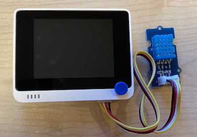

<!--
CO_OP_TRANSLATOR_METADATA:
{
  "original_hash": "59263d094f20b302053888cd236880c3",
  "translation_date": "2025-08-27T22:08:37+00:00",
  "source_file": "2-farm/lessons/1-predict-plant-growth/wio-terminal-temp.md",
  "language_code": "el"
}
-->
# Μέτρηση θερμοκρασίας - Wio Terminal

Σε αυτό το μέρος του μαθήματος, θα προσθέσετε έναν αισθητήρα θερμοκρασίας στο Wio Terminal σας και θα διαβάσετε τις τιμές θερμοκρασίας από αυτόν.

## Υλικό

Το Wio Terminal χρειάζεται έναν αισθητήρα θερμοκρασίας.

Ο αισθητήρας που θα χρησιμοποιήσετε είναι ο [αισθητήρας υγρασίας και θερμοκρασίας DHT11](https://www.seeedstudio.com/Grove-Temperature-Humidity-Sensor-DHT11.html), που συνδυάζει δύο αισθητήρες σε μία συσκευασία. Είναι αρκετά δημοφιλής, με αρκετούς εμπορικά διαθέσιμους αισθητήρες που συνδυάζουν θερμοκρασία, υγρασία και μερικές φορές ατμοσφαιρική πίεση. Το στοιχείο του αισθητήρα θερμοκρασίας είναι ένας θερμίστορας αρνητικού συντελεστή θερμοκρασίας (NTC), ένας θερμίστορας όπου η αντίσταση μειώνεται καθώς αυξάνεται η θερμοκρασία.

Πρόκειται για έναν ψηφιακό αισθητήρα, οπότε διαθέτει ενσωματωμένο ADC για τη δημιουργία ψηφιακού σήματος που περιέχει δεδομένα θερμοκρασίας και υγρασίας, τα οποία μπορεί να διαβάσει ο μικροελεγκτής.

### Σύνδεση του αισθητήρα θερμοκρασίας

Ο αισθητήρας θερμοκρασίας Grove μπορεί να συνδεθεί στη ψηφιακή θύρα του Wio Terminal.

#### Εργασία - σύνδεση του αισθητήρα θερμοκρασίας

Συνδέστε τον αισθητήρα θερμοκρασίας.


1. Εισάγετε το ένα άκρο ενός καλωδίου Grove στην υποδοχή του αισθητήρα υγρασίας και θερμοκρασίας. Θα μπει μόνο με έναν συγκεκριμένο τρόπο.

1. Με το Wio Terminal αποσυνδεδεμένο από τον υπολογιστή σας ή άλλη πηγή τροφοδοσίας, συνδέστε το άλλο άκρο του καλωδίου Grove στην δεξιά υποδοχή Grove του Wio Terminal, όπως κοιτάτε την οθόνη. Αυτή είναι η υποδοχή που βρίσκεται πιο μακριά από το κουμπί τροφοδοσίας.



## Προγραμματισμός του αισθητήρα θερμοκρασίας

Το Wio Terminal μπορεί τώρα να προγραμματιστεί για να χρησιμοποιήσει τον συνδεδεμένο αισθητήρα θερμοκρασίας.

### Εργασία - προγραμματισμός του αισθητήρα θερμοκρασίας

Προγραμματίστε τη συσκευή.

1. Δημιουργήστε ένα ολοκαίνουργιο έργο Wio Terminal χρησιμοποιώντας το PlatformIO. Ονομάστε αυτό το έργο `temperature-sensor`. Προσθέστε κώδικα στη συνάρτηση `setup` για να ρυθμίσετε τη σειριακή θύρα.

    > ⚠️ Μπορείτε να ανατρέξετε [στις οδηγίες για τη δημιουργία ενός έργου PlatformIO στο έργο 1, μάθημα 1, αν χρειαστεί](../../../1-getting-started/lessons/1-introduction-to-iot/wio-terminal.md#create-a-platformio-project).

1. Προσθέστε μια εξάρτηση βιβλιοθήκης για τη βιβλιοθήκη Seeed Grove Humidity and Temperature sensor στο αρχείο `platformio.ini` του έργου:

    ```ini
    lib_deps =
        seeed-studio/Grove Temperature And Humidity Sensor @ 1.0.1
    ```

    > ⚠️ Μπορείτε να ανατρέξετε [στις οδηγίες για την προσθήκη βιβλιοθηκών σε ένα έργο PlatformIO στο έργο 1, μάθημα 4, αν χρειαστεί](../../../1-getting-started/lessons/4-connect-internet/wio-terminal-mqtt.md#install-the-wifi-and-mqtt-arduino-libraries).

1. Προσθέστε τις ακόλουθες οδηγίες `#include` στην κορυφή του αρχείου, κάτω από την υπάρχουσα `#include <Arduino.h>`:

    ```cpp
    #include <DHT.h>
    #include <SPI.h>
    ```

    Αυτές εισάγουν αρχεία που χρειάζονται για την αλληλεπίδραση με τον αισθητήρα. Το αρχείο κεφαλίδας `DHT.h` περιέχει τον κώδικα για τον ίδιο τον αισθητήρα, και η προσθήκη του `SPI.h` διασφαλίζει ότι ο κώδικας που χρειάζεται για την επικοινωνία με τον αισθητήρα συνδέεται κατά τη μεταγλώττιση της εφαρμογής.

1. Πριν από τη συνάρτηση `setup`, δηλώστε τον αισθητήρα DHT:

    ```cpp
    DHT dht(D0, DHT11);
    ```

    Αυτό δηλώνει μια παρουσία της κλάσης `DHT` που διαχειρίζεται τον **Ψ**ηφιακό αισθητήρα **Υ**γρασίας και **Θ**ερμοκρασίας. Αυτός είναι συνδεδεμένος στη θύρα `D0`, τη δεξιά υποδοχή Grove του Wio Terminal. Η δεύτερη παράμετρος ενημερώνει τον κώδικα ότι ο αισθητήρας που χρησιμοποιείται είναι ο *DHT11* - η βιβλιοθήκη που χρησιμοποιείτε υποστηρίζει άλλες παραλλαγές αυτού του αισθητήρα.

1. Στη συνάρτηση `setup`, προσθέστε κώδικα για τη ρύθμιση της σειριακής σύνδεσης:

    ```cpp
    void setup()
    {
        Serial.begin(9600);
    
        while (!Serial)
            ; // Wait for Serial to be ready
    
        delay(1000);
    }
    ```

1. Στο τέλος της συνάρτησης `setup`, μετά την τελευταία `delay`, προσθέστε μια κλήση για την εκκίνηση του αισθητήρα DHT:

    ```cpp
    dht.begin();
    ```

1. Στη συνάρτηση `loop`, προσθέστε κώδικα για να καλέσετε τον αισθητήρα και να εκτυπώσετε τη θερμοκρασία στη σειριακή θύρα:

    ```cpp
    void loop()
    {
        float temp_hum_val[2] = {0};
        dht.readTempAndHumidity(temp_hum_val);
        Serial.print("Temperature: ");
        Serial.print(temp_hum_val[1]);
        Serial.println ("°C");
    
        delay(10000);
    }
    ```

    Αυτός ο κώδικας δηλώνει έναν κενό πίνακα 2 float και τον περνάει στην κλήση `readTempAndHumidity` της παρουσίας `DHT`. Αυτή η κλήση γεμίζει τον πίνακα με 2 τιμές - η υγρασία μπαίνει στο 0ο στοιχείο του πίνακα (θυμηθείτε ότι στους πίνακες C++ η αρίθμηση ξεκινά από το 0, οπότε το 0ο στοιχείο είναι το "πρώτο" στοιχείο του πίνακα), και η θερμοκρασία μπαίνει στο 1ο στοιχείο.

    Η θερμοκρασία διαβάζεται από το 1ο στοιχείο του πίνακα και εκτυπώνεται στη σειριακή θύρα.

    > 🇺🇸 Η θερμοκρασία διαβάζεται σε Κελσίου. Για τους Αμερικανούς, για να τη μετατρέψετε σε Φαρενάιτ, διαιρέστε την τιμή σε Κελσίου με το 5, πολλαπλασιάστε με το 9 και προσθέστε 32. Για παράδειγμα, μια μέτρηση θερμοκρασίας 20°C γίνεται ((20/5)*9) + 32 = 68°F.

1. Δημιουργήστε και ανεβάστε τον κώδικα στο Wio Terminal.

    > ⚠️ Μπορείτε να ανατρέξετε [στις οδηγίες για τη δημιουργία ενός έργου PlatformIO στο έργο 1, μάθημα 1, αν χρειαστεί](../../../1-getting-started/lessons/1-introduction-to-iot/wio-terminal.md#write-the-hello-world-app).

1. Μόλις ανεβεί, μπορείτε να παρακολουθήσετε τη θερμοκρασία χρησιμοποιώντας τον σειριακό παρατηρητή:

    ```output
    > Executing task: platformio device monitor <
    
    --- Available filters and text transformations: colorize, debug, default, direct, hexlify, log2file, nocontrol, printable, send_on_enter, time
    --- More details at http://bit.ly/pio-monitor-filters
    --- Miniterm on /dev/cu.usbmodem1201  9600,8,N,1 ---
    --- Quit: Ctrl+C | Menu: Ctrl+T | Help: Ctrl+T followed by Ctrl+H ---
    Temperature: 25.00°C
    Temperature: 25.00°C
    Temperature: 25.00°C
    Temperature: 24.00°C
    ```

> 💁 Μπορείτε να βρείτε αυτόν τον κώδικα στον φάκελο [code-temperature/wio-terminal](../../../../../2-farm/lessons/1-predict-plant-growth/code-temperature/wio-terminal).

😀 Το πρόγραμμα του αισθητήρα θερμοκρασίας σας ήταν επιτυχές!

---

**Αποποίηση ευθύνης**:  
Αυτό το έγγραφο έχει μεταφραστεί χρησιμοποιώντας την υπηρεσία αυτόματης μετάφρασης [Co-op Translator](https://github.com/Azure/co-op-translator). Παρόλο που καταβάλλουμε προσπάθειες για ακρίβεια, παρακαλούμε να έχετε υπόψη ότι οι αυτοματοποιημένες μεταφράσεις ενδέχεται να περιέχουν λάθη ή ανακρίβειες. Το πρωτότυπο έγγραφο στη μητρική του γλώσσα θα πρέπει να θεωρείται η αυθεντική πηγή. Για κρίσιμες πληροφορίες, συνιστάται επαγγελματική ανθρώπινη μετάφραση. Δεν φέρουμε ευθύνη για τυχόν παρεξηγήσεις ή εσφαλμένες ερμηνείες που προκύπτουν από τη χρήση αυτής της μετάφρασης.