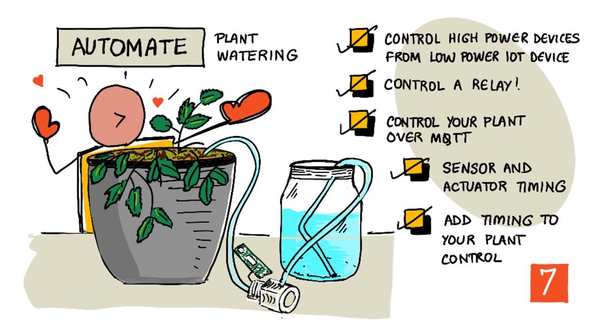
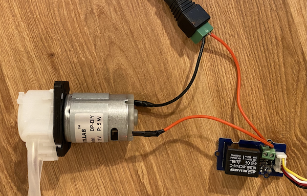

<!--
CO_OP_TRANSLATOR_METADATA:
{
  "original_hash": "f7bb24ba53fb627ddb38a8b24a05e594",
  "translation_date": "2025-08-27T22:09:23+00:00",
  "source_file": "2-farm/lessons/3-automated-plant-watering/README.md",
  "language_code": "el"
}
-->
# Αυτόματο πότισμα φυτών



> Σκίτσο από τη [Nitya Narasimhan](https://github.com/nitya). Κάντε κλικ στην εικόνα για μεγαλύτερη έκδοση.

Αυτό το μάθημα διδάχθηκε ως μέρος της σειράς [IoT for Beginners Project 2 - Digital Agriculture](https://youtube.com/playlist?list=PLmsFUfdnGr3yCutmcVg6eAUEfsGiFXgcx) από το [Microsoft Reactor](https://developer.microsoft.com/reactor/?WT.mc_id=academic-17441-jabenn).

[](https://youtu.be/g9FfZwv9R58)

## Ερωτηματολόγιο πριν το μάθημα

[Ερωτηματολόγιο πριν το μάθημα](https://black-meadow-040d15503.1.azurestaticapps.net/quiz/13)

## Εισαγωγή

Στο προηγούμενο μάθημα, μάθατε πώς να παρακολουθείτε την υγρασία του εδάφους. Σε αυτό το μάθημα, θα μάθετε πώς να κατασκευάσετε τα βασικά εξαρτήματα ενός αυτόματου συστήματος ποτίσματος που ανταποκρίνεται στην υγρασία του εδάφους. Θα μάθετε επίσης για το χρόνο απόκρισης - πώς οι αισθητήρες μπορεί να χρειάζονται χρόνο για να ανταποκριθούν στις αλλαγές και πώς οι ενεργοποιητές μπορεί να χρειάζονται χρόνο για να αλλάξουν τις ιδιότητες που μετρούν οι αισθητήρες.

Σε αυτό το μάθημα θα καλύψουμε:

* [Έλεγχος συσκευών υψηλής ισχύος από συσκευή IoT χαμηλής ισχύος](../../../../../2-farm/lessons/3-automated-plant-watering)
* [Έλεγχος ενός ρελέ](../../../../../2-farm/lessons/3-automated-plant-watering)
* [Έλεγχος του φυτού σας μέσω MQTT](../../../../../2-farm/lessons/3-automated-plant-watering)
* [Χρονισμός αισθητήρων και ενεργοποιητών](../../../../../2-farm/lessons/3-automated-plant-watering)
* [Προσθήκη χρονισμού στον διακομιστή ελέγχου του φυτού σας](../../../../../2-farm/lessons/3-automated-plant-watering)

## Έλεγχος συσκευών υψηλής ισχύος από συσκευή IoT χαμηλής ισχύος

Οι συσκευές IoT χρησιμοποιούν χαμηλή τάση. Ενώ αυτό είναι αρκετό για αισθητήρες και ενεργοποιητές χαμηλής ισχύος όπως τα LED, δεν είναι αρκετό για να ελέγξει μεγαλύτερο εξοπλισμό, όπως μια αντλία νερού που χρησιμοποιείται για άρδευση. Ακόμα και μικρές αντλίες που θα μπορούσατε να χρησιμοποιήσετε για φυτά εσωτερικού χώρου καταναλώνουν υπερβολικό ρεύμα για ένα κιτ ανάπτυξης IoT και θα μπορούσαν να προκαλέσουν ζημιά στην πλακέτα.

> 🎓 Το ρεύμα, που μετριέται σε Αμπέρ (A), είναι η ποσότητα ηλεκτρισμού που κινείται μέσα σε ένα κύκλωμα. Η τάση παρέχει την ώθηση, ενώ το ρεύμα είναι το πόσο ωθείται. Μπορείτε να διαβάσετε περισσότερα για το ρεύμα στη [σελίδα για το ηλεκτρικό ρεύμα στη Wikipedia](https://wikipedia.org/wiki/Electric_current).

Η λύση σε αυτό είναι να συνδέσετε την αντλία σε μια εξωτερική πηγή ενέργειας και να χρησιμοποιήσετε έναν ενεργοποιητή για να την ενεργοποιήσετε, παρόμοια με το πώς θα ανάβατε ένα φως. Χρειάζεται μια μικρή ποσότητα ενέργειας (με τη μορφή ενέργειας από το σώμα σας) για να γυρίσετε έναν διακόπτη, και αυτό συνδέει το φως με το ηλεκτρικό δίκτυο που λειτουργεί στα 110v/240v.


> 🎓 [Ηλεκτρικό δίκτυο](https://wikipedia.org/wiki/Mains_electricity) αναφέρεται στην ηλεκτρική ενέργεια που παρέχεται σε σπίτια και επιχειρήσεις μέσω εθνικών υποδομών σε πολλές περιοχές του κόσμου.

✅ Οι συσκευές IoT συνήθως παρέχουν 3.3V ή 5V, με λιγότερο από 1 αμπέρ (1A) ρεύματος. Συγκρίνετε αυτό με το ηλεκτρικό δίκτυο που είναι συνήθως στα 230V (120V στη Βόρεια Αμερική και 100V στην Ιαπωνία) και μπορεί να παρέχει ισχύ για συσκευές που καταναλώνουν 30A.

Υπάρχουν διάφοροι ενεργοποιητές που μπορούν να το κάνουν αυτό, συμπεριλαμβανομένων μηχανικών συσκευών που μπορείτε να προσαρμόσετε σε υπάρχοντες διακόπτες για να μιμηθούν ένα δάχτυλο που τους ανάβει. Ο πιο δημοφιλής είναι το ρελέ.

### Ρελέ

Ένα ρελέ είναι ένας ηλεκτρομηχανικός διακόπτης που μετατρέπει ένα ηλεκτρικό σήμα σε μηχανική κίνηση που ενεργοποιεί έναν διακόπτη. Ο πυρήνας ενός ρελέ είναι ένας ηλεκτρομαγνήτης.

> 🎓 [Ηλεκτρομαγνήτες](https://wikipedia.org/wiki/Electromagnet) είναι μαγνήτες που δημιουργούνται περνώντας ηλεκτρισμό μέσα από ένα πηνίο σύρματος. Όταν ο ηλεκτρισμός είναι ενεργοποιημένος, το πηνίο μαγνητίζεται. Όταν ο ηλεκτρισμός απενεργοποιείται, το πηνίο χάνει τη μαγνητική του ιδιότητα.


Σε ένα ρελέ, ένα κύκλωμα ελέγχου τροφοδοτεί τον ηλεκτρομαγνήτη. Όταν ο ηλεκτρομαγνήτης είναι ενεργοποιημένος, τραβά έναν μοχλό που κινεί έναν διακόπτη, κλείνοντας ένα ζεύγος επαφών και ολοκληρώνοντας ένα κύκλωμα εξόδου.


Όταν το κύκλωμα ελέγχου είναι απενεργοποιημένο, ο ηλεκτρομαγνήτης απενεργοποιείται, απελευθερώνοντας τον μοχλό και ανοίγοντας τις επαφές, απενεργοποιώντας το κύκλωμα εξόδου. Τα ρελέ είναι ψηφιακοί ενεργοποιητές - ένα υψηλό σήμα στο ρελέ το ενεργοποιεί, ένα χαμηλό σήμα το απενεργοποιεί.

Το κύκλωμα εξόδου μπορεί να χρησιμοποιηθεί για την τροφοδοσία πρόσθετου εξοπλισμού, όπως ένα σύστημα άρδευσης. Η συσκευή IoT μπορεί να ενεργοποιήσει το ρελέ, ολοκληρώνοντας το κύκλωμα εξόδου που τροφοδοτεί το σύστημα άρδευσης, και τα φυτά ποτίζονται. Στη συνέχεια, η συσκευή IoT μπορεί να απενεργοποιήσει το ρελέ, διακόπτοντας την τροφοδοσία στο σύστημα άρδευσης, σταματώντας το νερό.


Στο παραπάνω βίντεο, ένα ρελέ ενεργοποιείται. Ένα LED στο ρελέ ανάβει για να υποδείξει ότι είναι ενεργοποιημένο (ορισμένες πλακέτες ρελέ έχουν LED για να υποδεικνύουν αν το ρελέ είναι ενεργοποιημένο ή απενεργοποιημένο), και η ισχύς αποστέλλεται στην αντλία, ενεργοποιώντας την και αντλώντας νερό σε ένα φυτό.

> 💁 Τα ρελέ μπορούν επίσης να χρησιμοποιηθούν για την εναλλαγή μεταξύ δύο κυκλωμάτων εξόδου αντί να ενεργοποιούν ή να απενεργοποιούν ένα. Καθώς ο μοχλός κινείται, μετακινεί έναν διακόπτη από την ολοκλήρωση ενός κυκλώματος εξόδου στην ολοκλήρωση ενός άλλου κυκλώματος εξόδου, συνήθως μοιράζοντας μια κοινή σύνδεση ισχύος ή γείωσης.

✅ Κάντε μια έρευνα: Υπάρχουν πολλοί τύποι ρελέ, με διαφορές όπως αν το κύκλωμα ελέγχου ενεργοποιεί ή απενεργοποιεί το ρελέ όταν εφαρμόζεται ισχύς, ή αν υπάρχουν πολλαπλά κυκλώματα εξόδου. Μάθετε για αυτούς τους διαφορετικούς τύπους.

Όταν ο μοχλός κινείται, συνήθως μπορείτε να τον ακούσετε να κάνει επαφή με τον ηλεκτρομαγνήτη με έναν καθαρό ήχο "κλικ".

> 💁 Ένα ρελέ μπορεί να συνδεθεί έτσι ώστε η σύνδεση να διακόπτει την τροφοδοσία στο ίδιο το ρελέ, απενεργοποιώντας το, το οποίο στη συνέχεια στέλνει ξανά ισχύ στο ρελέ, ενεργοποιώντας το ξανά, και ούτω καθεξής. Αυτό σημαίνει ότι το ρελέ θα κάνει κλικ πολύ γρήγορα, δημιουργώντας έναν ήχο βουητού. Έτσι λειτουργούσαν μερικά από τα πρώτα κουδούνια πόρτας.

### Ισχύς ρελέ

Ο ηλεκτρομαγνήτης δεν χρειάζεται πολλή ισχύ για να ενεργοποιηθεί και να τραβήξει τον μοχλό, μπορεί να ελεγχθεί χρησιμοποιώντας την έξοδο 3.3V ή 5V από ένα κιτ ανάπτυξης IoT. Το κύκλωμα εξόδου μπορεί να μεταφέρει πολύ περισσότερη ισχύ, ανάλογα με το ρελέ, συμπεριλαμβανομένης της τάσης δικτύου ή ακόμα και υψηλότερων επιπέδων ισχύος για βιομηχανική χρήση. Με αυτόν τον τρόπο, ένα κιτ ανάπτυξης IoT μπορεί να ελέγξει ένα σύστημα άρδευσης, από μια μικρή αντλία για ένα μόνο φυτό, έως ένα τεράστιο βιομηχανικό σύστημα για μια ολόκληρη εμπορική φάρμα.


Η παραπάνω εικόνα δείχνει ένα ρελέ Grove. Το κύκλωμα ελέγχου συνδέεται με μια συσκευή IoT και ενεργοποιεί ή απενεργοποιεί το ρελέ χρησιμοποιώντας 3.3V ή 5V. Το κύκλωμα εξόδου έχει δύο ακροδέκτες, οποιοσδήποτε από αυτούς μπορεί να είναι ισχύς ή γείωση. Το κύκλωμα εξόδου μπορεί να χειριστεί έως 250V στα 10A, αρκετό για μια σειρά από συσκευές που λειτουργούν με τάση δικτύου. Μπορείτε να βρείτε ρελέ που μπορούν να χειριστούν ακόμα υψηλότερα επίπεδα ισχύος.



Στην παραπάνω εικόνα, η ισχύς παρέχεται σε μια αντλία μέσω ενός ρελέ. Υπάρχει ένα κόκκινο καλώδιο που συνδέει τον ακροδέκτη +5V μιας τροφοδοσίας USB με έναν ακροδέκτη του κυκλώματος εξόδου του ρελέ, και ένα άλλο κόκκινο καλώδιο που συνδέει τον άλλο ακροδέκτη του κυκλώματος εξόδου με την αντλία. Ένα μαύρο καλώδιο συνδέει την αντλία με τη γείωση της τροφοδοσίας USB. Όταν το ρελέ ενεργοποιείται, ολοκληρώνει το κύκλωμα, στέλνοντας 5V στην αντλία, ενεργοποιώντας την αντλία.

## Έλεγχος ενός ρελέ

Μπορείτε να ελέγξετε ένα ρελέ από το κιτ ανάπτυξης IoT σας.

### Εργασία - έλεγχος ενός ρελέ

Ακολουθήστε τον αντίστοιχο οδηγό για να ελέγξετε ένα ρελέ χρησιμοποιώντας τη συσκευή IoT σας:

* [Arduino - Wio Terminal](wio-terminal-relay.md)
* [Υπολογιστής μονού πίνακα - Raspberry Pi](pi-relay.md)
* [Υπολογιστής μονού πίνακα - Εικονική συσκευή](virtual-device-relay.md)

## Έλεγχος του φυτού σας μέσω MQTT

Μέχρι στιγμής, το ρελέ σας ελέγχεται απευθείας από τη συσκευή IoT με βάση μια μόνο μέτρηση υγρασίας εδάφους. Σε ένα εμπορικό σύστημα άρδευσης, η λογική ελέγχου θα είναι κεντρική, επιτρέποντας τη λήψη αποφάσεων για το πότισμα χρησιμοποιώντας δεδομένα από πολλούς αισθητήρες και επιτρέποντας οποιαδήποτε διαμόρφωση να αλλάζει σε ένα μόνο σημείο. Για να προσομοιώσετε αυτό, μπορείτε να ελέγξετε το ρελέ μέσω MQTT.

### Εργασία - έλεγχος του ρελέ μέσω MQTT

1. Προσθέστε τις αντίστοιχες βιβλιοθήκες MQTT/pip πακέτα και κώδικα στο έργο σας `soil-moisture-sensor` για να συνδεθείτε στο MQTT. Ονομάστε το client ID ως `soilmoisturesensor_client` με πρόθεμα το ID σας.

    > ⚠️ Μπορείτε να ανατρέξετε στις [οδηγίες για τη σύνδεση στο MQTT στο έργο 1, μάθημα 4 αν χρειαστεί](../../../1-getting-started/lessons/4-connect-internet/README.md#connect-your-iot-device-to-mqtt).

1. Προσθέστε τον αντίστοιχο κώδικα συσκευής για την αποστολή τηλεμετρίας με τις ρυθμίσεις υγρασίας εδάφους. Για το μήνυμα τηλεμετρίας, ονομάστε την ιδιότητα `soil_moisture`.

    > ⚠️ Μπορείτε να ανατρέξετε στις [οδηγίες για την αποστολή τηλεμετρίας στο MQTT στο έργο 1, μάθημα 4 αν χρειαστεί](../../../1-getting-started/lessons/4-connect-internet/README.md#send-telemetry-from-your-iot-device).

1. Δημιουργήστε κάποιον τοπικό κώδικα διακομιστή για να εγγραφείτε στην τηλεμετρία και να στείλετε μια εντολή για τον έλεγχο του ρελέ σε έναν φάκελο που ονομάζεται `soil-moisture-sensor-server`. Ονομάστε την ιδιότητα στο μήνυμα εντολής `relay_on` και ορίστε το client ID ως `soilmoisturesensor_server` με πρόθεμα το ID σας. Διατηρήστε την ίδια δομή με τον κώδικα διακομιστή που γράψατε για το έργο 1, μάθημα 4, καθώς θα προσθέσετε σε αυτόν τον κώδικα αργότερα σε αυτό το μάθημα.

    > ⚠️ Μπορείτε να ανατρέξετε στις [οδηγίες για την αποστολή τηλεμετρίας στο MQTT](../../../1-getting-started/lessons/4-connect-internet/README.md#write-the-server-code) και [την αποστολή εντολών μέσω MQTT](../../../1-getting-started/lessons/4-connect-internet/README.md#send-commands-to-the-mqtt-broker) στο έργο 1, μάθημα 4 αν χρειαστεί.

1. Προσθέστε τον αντίστοιχο κώδικα συσκευής για τον έλεγχο του ρελέ από τις ληφθείσες εντολές, χρησιμοποιώντας την ιδιότητα `relay_on` από το μήνυμα. Στείλτε true για `relay_on` αν η `soil_moisture` είναι μεγαλύτερη από 450, διαφορετικά στείλτε false, όπως η λογική που προσθέσατε για τη συσκευή IoT νωρίτερα.

    > ⚠️ Μπορείτε να ανατρέξετε στις [οδηγίες για την απόκριση σε εντολές από το MQTT στο έργο 1, μάθημα 4 αν χρειαστεί](../../../1-getting-started/lessons/4-connect-internet/README.md#handle-commands-on-the-iot-device).

> 💁 Μπορείτε να βρείτε αυτόν τον κώδικα στον φάκελο [code-mqtt](../../../../../2-farm/lessons/3-automated-plant-watering/code-mqtt).

Βεβαιωθείτε ότι ο κώδικας εκτελείται στη συσκευή και τον τοπικό διακομιστή σας και δοκιμά
💁 Αν ποτίσατε πολύ κοντά στον αισθητήρα, μπορεί να παρατηρήσατε ότι η ένδειξη έπεσε γρήγορα και μετά ανέβηκε ξανά - αυτό συμβαίνει επειδή το νερό κοντά στον αισθητήρα εξαπλώνεται στο υπόλοιπο έδαφος, μειώνοντας την υγρασία του εδάφους γύρω από τον αισθητήρα.


Στο παραπάνω διάγραμμα, μια μέτρηση υγρασίας εδάφους δείχνει 658. Το φυτό ποτίζεται, αλλά αυτή η μέτρηση δεν αλλάζει αμέσως, καθώς το νερό δεν έχει φτάσει ακόμα στον αισθητήρα. Το πότισμα μπορεί να ολοκληρωθεί πριν το νερό φτάσει στον αισθητήρα και η τιμή πέσει για να αντικατοπτρίσει το νέο επίπεδο υγρασίας.

Αν γράφατε κώδικα για να ελέγξετε ένα σύστημα άρδευσης μέσω ενός ρελέ με βάση τα επίπεδα υγρασίας του εδάφους, θα έπρεπε να λάβετε υπόψη αυτή την καθυστέρηση και να ενσωματώσετε πιο έξυπνο χρονισμό στη συσκευή IoT σας.

✅ Σκεφτείτε πώς θα μπορούσατε να το κάνετε αυτό.

### Έλεγχος χρονισμού αισθητήρα και ενεργοποιητή

Φανταστείτε ότι σας έχει ανατεθεί να κατασκευάσετε ένα σύστημα άρδευσης για μια φάρμα. Με βάση τον τύπο του εδάφους, το ιδανικό επίπεδο υγρασίας του εδάφους για τα φυτά που καλλιεργούνται έχει βρεθεί ότι αντιστοιχεί σε μια αναλογική τάση μέτρησης 400-450.

Θα μπορούσατε να προγραμματίσετε τη συσκευή με τον ίδιο τρόπο όπως το νυχτερινό φως - κάθε φορά που ο αισθητήρας διαβάζει πάνω από 450, ενεργοποιήστε ένα ρελέ για να ενεργοποιήσετε μια αντλία. Το πρόβλημα είναι ότι το νερό χρειάζεται χρόνο για να φτάσει από την αντλία, μέσω του εδάφους, στον αισθητήρα. Ο αισθητήρας θα σταματήσει το νερό όταν ανιχνεύσει επίπεδο 450, αλλά το επίπεδο υγρασίας θα συνεχίσει να πέφτει καθώς το αντλημένο νερό συνεχίζει να διαπερνά το έδαφος. Το τελικό αποτέλεσμα είναι σπατάλη νερού και ο κίνδυνος ζημιάς στις ρίζες.

✅ Θυμηθείτε - το υπερβολικό νερό μπορεί να είναι εξίσου κακό για τα φυτά όσο και η έλλειψη νερού, και σπαταλά έναν πολύτιμο πόρο.

Η καλύτερη λύση είναι να κατανοήσετε ότι υπάρχει καθυστέρηση μεταξύ της ενεργοποίησης του ενεργοποιητή και της αλλαγής της ιδιότητας που διαβάζει ο αισθητήρας. Αυτό σημαίνει ότι όχι μόνο ο αισθητήρας πρέπει να περιμένει λίγο πριν μετρήσει ξανά την τιμή, αλλά και ο ενεργοποιητής πρέπει να απενεργοποιηθεί για λίγο πριν γίνει η επόμενη μέτρηση του αισθητήρα.

Πόσο χρόνο πρέπει να είναι ενεργοποιημένο το ρελέ κάθε φορά; Είναι καλύτερο να είστε προσεκτικοί και να ενεργοποιείτε το ρελέ μόνο για λίγο, στη συνέχεια να περιμένετε να διαπεράσει το νερό και μετά να ξαναελέγξετε τα επίπεδα υγρασίας. Άλλωστε, μπορείτε πάντα να το ενεργοποιήσετε ξανά για να προσθέσετε περισσότερο νερό, δεν μπορείτε να αφαιρέσετε νερό από το έδαφος.

> 💁 Αυτός ο τύπος ελέγχου χρονισμού είναι πολύ συγκεκριμένος για τη συσκευή IoT που κατασκευάζετε, την ιδιότητα που μετράτε και τους αισθητήρες και ενεργοποιητές που χρησιμοποιούνται.


Για παράδειγμα, έχω ένα φυτό φράουλας με έναν αισθητήρα υγρασίας εδάφους και μια αντλία που ελέγχεται από ένα ρελέ. Έχω παρατηρήσει ότι όταν προσθέτω νερό χρειάζονται περίπου 20 δευτερόλεπτα για να σταθεροποιηθεί η μέτρηση υγρασίας του εδάφους. Αυτό σημαίνει ότι πρέπει να απενεργοποιήσω το ρελέ και να περιμένω 20 δευτερόλεπτα πριν ελέγξω τα επίπεδα υγρασίας. Προτιμώ να έχω λιγότερο νερό παρά υπερβολικό - μπορώ πάντα να ενεργοποιήσω ξανά την αντλία, αλλά δεν μπορώ να αφαιρέσω νερό από το φυτό.


Αυτό σημαίνει ότι η καλύτερη διαδικασία θα ήταν ένας κύκλος ποτίσματος που μοιάζει με:

* Ενεργοποίηση της αντλίας για 5 δευτερόλεπτα
* Αναμονή 20 δευτερολέπτων
* Έλεγχος της υγρασίας του εδάφους
* Αν το επίπεδο είναι ακόμα πάνω από το απαιτούμενο, επαναλάβετε τα παραπάνω βήματα

Τα 5 δευτερόλεπτα μπορεί να είναι υπερβολικά για την αντλία, ειδικά αν τα επίπεδα υγρασίας είναι μόνο ελαφρώς πάνω από το απαιτούμενο επίπεδο. Ο καλύτερος τρόπος για να γνωρίζετε τι χρονισμό να χρησιμοποιήσετε είναι να το δοκιμάσετε και στη συνέχεια να προσαρμόσετε όταν έχετε δεδομένα από τον αισθητήρα, με έναν συνεχή κύκλο ανατροφοδότησης. Αυτό μπορεί να οδηγήσει ακόμη και σε πιο λεπτομερή χρονισμό, όπως η ενεργοποίηση της αντλίας για 1 δευτερόλεπτο για κάθε 100 πάνω από το απαιτούμενο επίπεδο υγρασίας του εδάφους, αντί για σταθερά 5 δευτερόλεπτα.

✅ Κάντε μια έρευνα: Υπάρχουν άλλες παραμέτρους χρονισμού που πρέπει να ληφθούν υπόψη; Μπορεί το φυτό να ποτίζεται οποιαδήποτε στιγμή που η υγρασία του εδάφους είναι πολύ χαμηλή ή υπάρχουν συγκεκριμένες ώρες της ημέρας που είναι καλές και κακές για το πότισμα των φυτών;

> 💁 Οι προβλέψεις καιρού μπορούν επίσης να ληφθούν υπόψη κατά τον έλεγχο αυτοματοποιημένων συστημάτων ποτίσματος για εξωτερική καλλιέργεια. Αν αναμένεται βροχή, τότε το πότισμα μπορεί να αναβληθεί μέχρι να τελειώσει η βροχή. Σε εκείνο το σημείο το έδαφος μπορεί να είναι αρκετά υγρό ώστε να μην χρειάζεται πότισμα, πολύ πιο αποτελεσματικό από το να σπαταλάτε νερό ποτίζοντας λίγο πριν τη βροχή.

## Προσθέστε χρονισμό στον διακομιστή ελέγχου φυτών σας

Ο κώδικας του διακομιστή μπορεί να τροποποιηθεί για να προσθέσει έλεγχο γύρω από τον χρονισμό του κύκλου ποτίσματος και την αναμονή για να αλλάξουν τα επίπεδα υγρασίας του εδάφους. Η λογική του διακομιστή για τον έλεγχο του χρονισμού του ρελέ είναι:

1. Λήψη μηνύματος τηλεμετρίας
1. Έλεγχος του επιπέδου υγρασίας του εδάφους
1. Αν είναι εντάξει, μην κάνετε τίποτα. Αν η μέτρηση είναι πολύ υψηλή (που σημαίνει ότι η υγρασία του εδάφους είναι πολύ χαμηλή), τότε:
    1. Στείλτε εντολή για ενεργοποίηση του ρελέ
    1. Περιμένετε 5 δευτερόλεπτα
    1. Στείλτε εντολή για απενεργοποίηση του ρελέ
    1. Περιμένετε 20 δευτερόλεπτα για να σταθεροποιηθούν τα επίπεδα υγρασίας του εδάφους

Ο κύκλος ποτίσματος, η διαδικασία από τη λήψη του μηνύματος τηλεμετρίας μέχρι την ετοιμότητα για επεξεργασία των επιπέδων υγρασίας του εδάφους ξανά, διαρκεί περίπου 25 δευτερόλεπτα. Στέλνουμε επίπεδα υγρασίας του εδάφους κάθε 10 δευτερόλεπτα, οπότε υπάρχει επικάλυψη όπου λαμβάνεται ένα μήνυμα ενώ ο διακομιστής περιμένει να σταθεροποιηθούν τα επίπεδα υγρασίας του εδάφους, κάτι που θα μπορούσε να ξεκινήσει έναν άλλο κύκλο ποτίσματος.

Υπάρχουν δύο επιλογές για να αντιμετωπιστεί αυτό:

* Αλλάξτε τον κώδικα της συσκευής IoT ώστε να στέλνει τηλεμετρία μόνο κάθε λεπτό, έτσι ώστε ο κύκλος ποτίσματος να ολοκληρωθεί πριν σταλεί το επόμενο μήνυμα
* Αποσυνδεθείτε από την τηλεμετρία κατά τη διάρκεια του κύκλου ποτίσματος

Η πρώτη επιλογή δεν είναι πάντα καλή λύση για μεγάλες φάρμες. Ο αγρότης μπορεί να θέλει να καταγράψει τα επίπεδα υγρασίας του εδάφους καθώς το έδαφος ποτίζεται για μετέπειτα ανάλυση, για παράδειγμα για να γνωρίζει τη ροή του νερού σε διαφορετικές περιοχές της φάρμας ώστε να καθοδηγήσει πιο στοχευμένο πότισμα. Η δεύτερη επιλογή είναι καλύτερη - ο κώδικας απλώς αγνοεί την τηλεμετρία όταν δεν μπορεί να τη χρησιμοποιήσει, αλλά η τηλεμετρία εξακολουθεί να υπάρχει για άλλες υπηρεσίες που μπορεί να την εγγραφούν.

> 💁 Τα δεδομένα IoT δεν αποστέλλονται μόνο από μία συσκευή σε μία υπηρεσία, αντίθετα πολλές συσκευές μπορούν να στέλνουν δεδομένα σε έναν μεσολαβητή και πολλές υπηρεσίες μπορούν να ακούν τα δεδομένα από τον μεσολαβητή. Για παράδειγμα, μία υπηρεσία θα μπορούσε να ακούει δεδομένα υγρασίας εδάφους και να τα αποθηκεύει σε μια βάση δεδομένων για ανάλυση αργότερα. Μια άλλη υπηρεσία μπορεί επίσης να ακούει την ίδια τηλεμετρία για να ελέγχει ένα σύστημα άρδευσης.

### Εργασία - προσθέστε χρονισμό στον διακομιστή ελέγχου φυτών σας

Ενημερώστε τον κώδικα του διακομιστή σας ώστε να λειτουργεί το ρελέ για 5 δευτερόλεπτα και στη συνέχεια να περιμένει 20 δευτερόλεπτα.

1. Ανοίξτε τον φάκελο `soil-moisture-sensor-server` στο VS Code αν δεν είναι ήδη ανοιχτός. Βεβαιωθείτε ότι το εικονικό περιβάλλον είναι ενεργοποιημένο.

1. Ανοίξτε το αρχείο `app.py`

1. Προσθέστε τον παρακάτω κώδικα στο αρχείο `app.py` κάτω από τις υπάρχουσες εισαγωγές:

    ```python
    import threading
    ```

    Αυτή η δήλωση εισάγει το `threading` από τις βιβλιοθήκες της Python, το οποίο επιτρέπει στην Python να εκτελεί άλλο κώδικα ενώ περιμένει.

1. Προσθέστε τον παρακάτω κώδικα πριν από τη συνάρτηση `handle_telemetry` που χειρίζεται τα μηνύματα τηλεμετρίας που λαμβάνονται από τον κώδικα του διακομιστή:

    ```python
    water_time = 5
    wait_time = 20
    ```

    Αυτό ορίζει πόσο χρόνο θα λειτουργεί το ρελέ (`water_time`) και πόσο χρόνο θα περιμένει μετά για να ελέγξει την υγρασία του εδάφους (`wait_time`).

1. Κάτω από αυτόν τον κώδικα, προσθέστε τον παρακάτω:

    ```python
    def send_relay_command(client, state):
        command = { 'relay_on' : state }
        print("Sending message:", command)
        client.publish(server_command_topic, json.dumps(command))
    ```

    Αυτός ο κώδικας ορίζει μια συνάρτηση που ονομάζεται `send_relay_command` που στέλνει μια εντολή μέσω MQTT για να ελέγξει το ρελέ. Η τηλεμετρία δημιουργείται ως λεξικό και στη συνέχεια μετατρέπεται σε συμβολοσειρά JSON. Η τιμή που περνάει στο `state` καθορίζει αν το ρελέ πρέπει να είναι ενεργοποιημένο ή απενεργοποιημένο.

1. Μετά τη συνάρτηση `send_relay_code`, προσθέστε τον παρακάτω κώδικα:

    ```python
    def control_relay(client):
        print("Unsubscribing from telemetry")
        mqtt_client.unsubscribe(client_telemetry_topic)
    
        send_relay_command(client, True)
        time.sleep(water_time)
        send_relay_command(client, False)
    
        time.sleep(wait_time)
    
        print("Subscribing to telemetry")
        mqtt_client.subscribe(client_telemetry_topic)
    ```

    Αυτό ορίζει μια συνάρτηση για τον έλεγχο του ρελέ με βάση τον απαιτούμενο χρονισμό. Ξεκινά με την αποσύνδεση από την τηλεμετρία ώστε τα μηνύματα υγρασίας εδάφους να μην επεξεργάζονται ενώ γίνεται το πότισμα. Στη συνέχεια στέλνει μια εντολή για να ενεργοποιήσει το ρελέ. Μετά περιμένει για το `water_time` πριν στείλει μια εντολή για να απενεργοποιήσει το ρελέ. Τέλος, περιμένει για να σταθεροποιηθούν τα επίπεδα υγρασίας του εδάφους για `wait_time` δευτερόλεπτα. Στη συνέχεια επανασυνδέεται στην τηλεμετρία.

1. Αλλάξτε τη συνάρτηση `handle_telemetry` στην εξής:

    ```python
    def handle_telemetry(client, userdata, message):
        payload = json.loads(message.payload.decode())
        print("Message received:", payload)
    
        if payload['soil_moisture'] > 450:
            threading.Thread(target=control_relay, args=(client,)).start()
    ```

    Αυτός ο κώδικας ελέγχει το επίπεδο υγρασίας του εδάφους. Αν είναι μεγαλύτερο από 450, το έδαφος χρειάζεται πότισμα, οπότε καλεί τη συνάρτηση `control_relay`. Αυτή η συνάρτηση εκτελείται σε ξεχωριστό νήμα, που τρέχει στο παρασκήνιο.

1. Βεβαιωθείτε ότι η συσκευή IoT σας λειτουργεί και στη συνέχεια εκτελέστε αυτόν τον κώδικα. Αλλάξτε τα επίπεδα υγρασίας του εδάφους και παρατηρήστε τι συμβαίνει στο ρελέ - θα πρέπει να ενεργοποιείται για 5 δευτερόλεπτα και στη συνέχεια να παραμένει απενεργοποιημένο για τουλάχιστον 20 δευτερόλεπτα, ενεργοποιούμενο μόνο αν τα επίπεδα υγρασίας του εδάφους δεν είναι επαρκή.

    ```output
    (.venv) ➜  soil-moisture-sensor-server ✗ python app.py
    Message received: {'soil_moisture': 457}
    Unsubscribing from telemetry
    Sending message: {'relay_on': True}
    Sending message: {'relay_on': False}
    Subscribing to telemetry
    Message received: {'soil_moisture': 302}
    ```

    Ένας καλός τρόπος για να δοκιμάσετε αυτό σε ένα προσομοιωμένο σύστημα άρδευσης είναι να χρησιμοποιήσετε ξηρό έδαφος και στη συνέχεια να ρίξετε νερό χειροκίνητα ενώ το ρελέ είναι ενεργοποιημένο, σταματώντας να ρίχνετε όταν το ρελέ απενεργοποιείται.

> 💁 Μπορείτε να βρείτε αυτόν τον κώδικα στον φάκελο [code-timing](../../../../../2-farm/lessons/3-automated-plant-watering/code-timing).

> 💁 Αν θέλετε να χρησιμοποιήσετε μια αντλία για να κατασκευάσετε ένα πραγματικό σύστημα άρδευσης, τότε μπορείτε να χρησιμοποιήσετε μια [6V αντλία νερού](https://www.seeedstudio.com/6V-Mini-Water-Pump-p-1945.html) με μια [τροφοδοσία USB](https://www.adafruit.com/product/3628). Βεβαιωθείτε ότι η τροφοδοσία προς ή από την αντλία είναι συνδεδεμένη μέσω του ρελέ.

---

## 🚀 Πρόκληση

Μπορείτε να σκεφτείτε άλλες συσκευές IoT ή άλλες ηλεκτρικές συσκευές που έχουν παρόμοιο πρόβλημα όπου χρειάζεται χρόνος για να φτάσουν τα αποτελέσματα του ενεργοποιητή στον αισθητήρα; Πιθανότατα έχετε μερικές στο σπίτι ή στο σχολείο σας.

* Ποιες ιδιότητες μετρούν;
* Πόσο χρόνο χρειάζεται για να αλλάξει η ιδιότητα μετά τη χρήση του ενεργοποιητή;
* Είναι εντάξει η ιδιότητα να αλλάξει πέρα από την απαιτούμενη τιμή;
* Πώς μπορεί να επιστραφεί στην απαιτούμενη τιμή αν χρειαστεί;

## Κουίζ μετά τη διάλεξη

[Κουίζ μετά τη διάλεξη](https://black-meadow-040d15503.1.azurestaticapps.net/quiz/14)

## Ανασκόπηση & Αυτομελέτη

* Διαβάστε περισσότερα για τα ρελέ, συμπεριλαμβανομένης της ιστορικής τους χρήσης σε τηλεφωνικά κέντρα, στη [σελίδα Wikipedia για τα ρελέ](https://wikipedia.org/wiki/Relay).

## Εργασία

[Κατασκευάστε έναν πιο αποδοτικό κύκλο ποτίσματος](assignment.md)

---

**Αποποίηση ευθύνης**:  
Αυτό το έγγραφο έχει μεταφραστεί χρησιμοποιώντας την υπηρεσία αυτόματης μετάφρασης [Co-op Translator](https://github.com/Azure/co-op-translator). Παρόλο που καταβάλλουμε προσπάθειες για ακρίβεια, παρακαλούμε να έχετε υπόψη ότι οι αυτοματοποιημένες μεταφράσεις ενδέχεται να περιέχουν λάθη ή ανακρίβειες. Το πρωτότυπο έγγραφο στη μητρική του γλώσσα θα πρέπει να θεωρείται η αυθεντική πηγή. Για κρίσιμες πληροφορίες, συνιστάται επαγγελματική ανθρώπινη μετάφραση. Δεν φέρουμε ευθύνη για τυχόν παρεξηγήσεις ή εσφαλμένες ερμηνείες που προκύπτουν από τη χρήση αυτής της μετάφρασης.