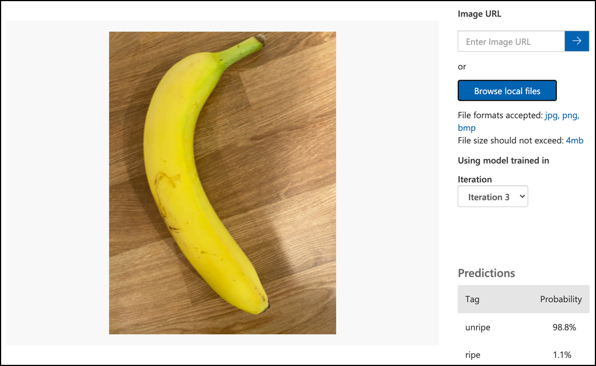

<!--
CO_OP_TRANSLATOR_METADATA:
{
  "original_hash": "f5e63c916d2dd97d58be12aaf76bd9f1",
  "translation_date": "2025-08-27T19:58:09+00:00",
  "source_file": "4-manufacturing/lessons/1-train-fruit-detector/README.md",
  "language_code": "el"
}
-->
# Εκπαίδευση ανιχνευτή ποιότητας φρούτων


> Σχεδιαστικό σημείωμα από [Nitya Narasimhan](https://github.com/nitya). Κάντε κλικ στην εικόνα για μεγαλύτερη έκδοση.

Αυτό το βίντεο παρέχει μια επισκόπηση της υπηρεσίας Azure Custom Vision, μιας υπηρεσίας που θα καλυφθεί σε αυτό το μάθημα.

[](https://www.youtube.com/watch?v=TETcDLJlWR4)

> 🎥 Κάντε κλικ στην εικόνα παραπάνω για να παρακολουθήσετε το βίντεο

## Ερωτηματολόγιο πριν το μάθημα

[Ερωτηματολόγιο πριν το μάθημα](https://black-meadow-040d15503.1.azurestaticapps.net/quiz/29)

## Εισαγωγή

Η πρόσφατη άνοδος της Τεχνητής Νοημοσύνης (AI) και της Μηχανικής Μάθησης (ML) παρέχει ένα ευρύ φάσμα δυνατοτήτων στους σημερινούς προγραμματιστές. Τα μοντέλα ML μπορούν να εκπαιδευτούν ώστε να αναγνωρίζουν διάφορα πράγματα σε εικόνες, όπως άγουρα φρούτα, και αυτό μπορεί να χρησιμοποιηθεί σε συσκευές IoT για να βοηθήσει στη διαλογή προϊόντων είτε κατά τη συγκομιδή είτε κατά την επεξεργασία σε εργοστάσια ή αποθήκες.

Σε αυτό το μάθημα θα μάθετε για την ταξινόμηση εικόνων - τη χρήση μοντέλων ML για να διακρίνετε εικόνες διαφορετικών αντικειμένων. Θα μάθετε πώς να εκπαιδεύσετε έναν ταξινομητή εικόνων ώστε να διακρίνει φρούτα που είναι καλά από φρούτα που είναι κακά, είτε άγουρα είτε υπερώριμα, χτυπημένα ή σάπια.

Σε αυτό το μάθημα θα καλύψουμε:

* [Χρήση AI και ML για τη διαλογή τροφίμων](../../../../../4-manufacturing/lessons/1-train-fruit-detector)
* [Ταξινόμηση εικόνων μέσω Μηχανικής Μάθησης](../../../../../4-manufacturing/lessons/1-train-fruit-detector)
* [Εκπαίδευση ταξινομητή εικόνων](../../../../../4-manufacturing/lessons/1-train-fruit-detector)
* [Δοκιμή του ταξινομητή εικόνων](../../../../../4-manufacturing/lessons/1-train-fruit-detector)
* [Επανεκπαίδευση του ταξινομητή εικόνων](../../../../../4-manufacturing/lessons/1-train-fruit-detector)

## Χρήση AI και ML για τη διαλογή τροφίμων

Η σίτιση του παγκόσμιου πληθυσμού είναι δύσκολη, ειδικά σε τιμές που καθιστούν τα τρόφιμα προσιτά για όλους. Ένα από τα μεγαλύτερα κόστη είναι το εργατικό δυναμικό, γι' αυτό οι αγρότες στρέφονται όλο και περισσότερο στην αυτοματοποίηση και σε εργαλεία όπως το IoT για να μειώσουν τα εργατικά τους κόστη. Η συγκομιδή με το χέρι είναι έντονα εργατική (και συχνά εξαντλητική εργασία) και αντικαθίσταται από μηχανήματα, ειδικά σε πλουσιότερες χώρες. Παρά τις οικονομίες κόστους που προσφέρει η χρήση μηχανημάτων για τη συγκομιδή, υπάρχει ένα μειονέκτημα - η δυνατότητα διαλογής τροφίμων κατά τη συγκομιδή.

Δεν ωριμάζουν όλες οι καλλιέργειες ομοιόμορφα. Οι ντομάτες, για παράδειγμα, μπορεί να έχουν ακόμα μερικούς πράσινους καρπούς στο φυτό όταν η πλειοψηφία είναι έτοιμη για συγκομιδή. Παρόλο που είναι σπατάλη να συγκομίζονται αυτές νωρίς, είναι φθηνότερο και ευκολότερο για τον αγρότη να συγκομίσει τα πάντα χρησιμοποιώντας μηχανήματα και να απορρίψει αργότερα τα άγουρα προϊόντα.

✅ Ρίξτε μια ματιά σε διάφορα φρούτα ή λαχανικά, είτε μεγαλώνουν κοντά σας σε αγροκτήματα ή στον κήπο σας, είτε σε καταστήματα. Είναι όλα στην ίδια ωριμότητα ή βλέπετε διαφορές;

Η άνοδος της αυτοματοποιημένης συγκομιδής μετέφερε τη διαλογή των προϊόντων από τη συγκομιδή στο εργοστάσιο. Τα τρόφιμα ταξίδευαν σε μακριές ταινίες μεταφοράς με ομάδες ανθρώπων που έλεγχαν τα προϊόντα, αφαιρώντας οτιδήποτε δεν πληρούσε τα απαιτούμενα πρότυπα ποιότητας. Η συγκομιδή ήταν φθηνότερη χάρη στα μηχανήματα, αλλά υπήρχε ακόμα κόστος για τη χειροκίνητη διαλογή τροφίμων.


Η επόμενη εξέλιξη ήταν η χρήση μηχανών για τη διαλογή, είτε ενσωματωμένων στη μηχανή συγκομιδής είτε στα εργοστάσια επεξεργασίας. Η πρώτη γενιά αυτών των μηχανών χρησιμοποιούσε οπτικούς αισθητήρες για την ανίχνευση χρωμάτων, ελέγχοντας ενεργοποιητές για να σπρώξουν τις πράσινες ντομάτες σε κάδο απορριμμάτων χρησιμοποιώντας μοχλούς ή ριπές αέρα, αφήνοντας τις κόκκινες ντομάτες να συνεχίσουν σε ένα δίκτυο ταινιών μεταφοράς.

Σε αυτό το βίντεο, καθώς οι ντομάτες πέφτουν από μια ταινία μεταφοράς σε άλλη, οι πράσινες ντομάτες ανιχνεύονται και εκτοξεύονται σε κάδο χρησιμοποιώντας μοχλούς.

✅ Τι συνθήκες θα χρειάζονταν σε ένα εργοστάσιο ή σε ένα χωράφι για να λειτουργούν σωστά αυτοί οι οπτικοί αισθητήρες;

Οι πιο πρόσφατες εξελίξεις αυτών των μηχανών διαλογής αξιοποιούν την AI και τη ML, χρησιμοποιώντας μοντέλα εκπαιδευμένα να διακρίνουν καλό προϊόν από κακό, όχι μόνο από προφανείς διαφορές χρώματος όπως πράσινες ντομάτες έναντι κόκκινων, αλλά και από πιο λεπτές διαφορές στην εμφάνιση που μπορεί να υποδεικνύουν ασθένεια ή χτυπήματα.

## Ταξινόμηση εικόνων μέσω Μηχανικής Μάθησης

Ο παραδοσιακός προγραμματισμός είναι όταν παίρνετε δεδομένα, εφαρμόζετε έναν αλγόριθμο στα δεδομένα και λαμβάνετε αποτελέσματα. Για παράδειγμα, στο προηγούμενο έργο πήρατε συντεταγμένες GPS και μια γεωγραφική περιοχή, εφαρμόσατε έναν αλγόριθμο που παρέχεται από το Azure Maps και λάβατε ένα αποτέλεσμα για το αν το σημείο ήταν μέσα ή έξω από τη γεωγραφική περιοχή. Εισάγετε περισσότερα δεδομένα, λαμβάνετε περισσότερα αποτελέσματα.


Η μηχανική μάθηση το αντιστρέφει - ξεκινάτε με δεδομένα και γνωστά αποτελέσματα, και ο αλγόριθμος μηχανικής μάθησης μαθαίνει από τα δεδομένα. Στη συνέχεια, μπορείτε να πάρετε αυτόν τον εκπαιδευμένο αλγόριθμο, που ονομάζεται *μοντέλο μηχανικής μάθησης* ή *μοντέλο*, και να εισάγετε νέα δεδομένα για να λάβετε νέα αποτελέσματα.

> 🎓 Η διαδικασία κατά την οποία ένας αλγόριθμος μηχανικής μάθησης μαθαίνει από τα δεδομένα ονομάζεται *εκπαίδευση*. Τα δεδομένα εισόδου και τα γνωστά αποτελέσματα ονομάζονται *δεδομένα εκπαίδευσης*.

Για παράδειγμα, θα μπορούσατε να δώσετε σε ένα μοντέλο εκατομμύρια εικόνες άγουρων μπανανών ως δεδομένα εκπαίδευσης εισόδου, με το αποτέλεσμα εκπαίδευσης να ορίζεται ως `άγουρη`, και εκατομμύρια εικόνες ώριμων μπανανών ως δεδομένα εκπαίδευσης με το αποτέλεσμα να ορίζεται ως `ώριμη`. Ο αλγόριθμος ML θα δημιουργήσει στη συνέχεια ένα μοντέλο βασισμένο σε αυτά τα δεδομένα. Στη συνέχεια, δίνετε σε αυτό το μοντέλο μια νέα εικόνα μπανάνας και θα προβλέψει αν η νέα εικόνα είναι ώριμη ή άγουρη.

> 🎓 Τα αποτελέσματα των μοντέλων ML ονομάζονται *προβλέψεις*


Τα μοντέλα ML δεν δίνουν μια δυαδική απάντηση, αντίθετα δίνουν πιθανότητες. Για παράδειγμα, ένα μοντέλο μπορεί να λάβει μια εικόνα μπανάνας και να προβλέψει `ώριμη` με 99.7% και `άγουρη` με 0.3%. Ο κώδικάς σας θα επιλέξει την καλύτερη πρόβλεψη και θα αποφασίσει ότι η μπανάνα είναι ώριμη.

Το μοντέλο ML που χρησιμοποιείται για την ανίχνευση εικόνων όπως αυτή ονομάζεται *ταξινομητής εικόνων* - του δίνονται ετικετοποιημένες εικόνες και στη συνέχεια ταξινομεί νέες εικόνες βάσει αυτών των ετικετών.

> 💁 Αυτό είναι μια υπεραπλούστευση, και υπάρχουν πολλοί άλλοι τρόποι εκπαίδευσης μοντέλων που δεν χρειάζονται πάντα ετικετοποιημένα αποτελέσματα, όπως η μη επιβλεπόμενη μάθηση. Αν θέλετε να μάθετε περισσότερα για τη ML, δείτε το [ML for beginners, ένα πρόγραμμα σπουδών 24 μαθημάτων για τη Μηχανική Μάθηση](https://aka.ms/ML-beginners).

## Εκπαίδευση ταξινομητή εικόνων

Για να εκπαιδεύσετε επιτυχώς έναν ταξινομητή εικόνων, χρειάζεστε εκατομμύρια εικόνες. Ωστόσο, μόλις έχετε έναν ταξινομητή εικόνων εκπαιδευμένο σε εκατομμύρια ή δισεκατομμύρια διάφορες εικόνες, μπορείτε να τον επαναχρησιμοποιήσετε και να τον επανεκπαιδεύσετε χρησιμοποιώντας ένα μικρό σύνολο εικόνων και να έχετε εξαιρετικά αποτελέσματα, χρησιμοποιώντας μια διαδικασία που ονομάζεται *μεταφορά μάθησης*.

> 🎓 Η μεταφορά μάθησης είναι όταν μεταφέρετε τη μάθηση από ένα υπάρχον μοντέλο ML σε ένα νέο μοντέλο βασισμένο σε νέα δεδομένα.

Μόλις ένας ταξινομητής εικόνων έχει εκπαιδευτεί για μια μεγάλη ποικιλία εικόνων, τα εσωτερικά του είναι εξαιρετικά στο να αναγνωρίζουν σχήματα, χρώματα και μοτίβα. Η μεταφορά μάθησης επιτρέπει στο μοντέλο να χρησιμοποιήσει όσα έχει ήδη μάθει στην αναγνώριση τμημάτων εικόνας και να τα χρησιμοποιήσει για την αναγνώριση νέων εικόνων.


Μπορείτε να το σκεφτείτε σαν τα παιδικά βιβλία με σχήματα, όπου μόλις μπορείτε να αναγνωρίσετε ένα ημικύκλιο, ένα ορθογώνιο και ένα τρίγωνο, μπορείτε να αναγνωρίσετε ένα ιστιοφόρο ή μια γάτα ανάλογα με τη διαμόρφωση αυτών των σχημάτων. Ο ταξινομητής εικόνων μπορεί να αναγνωρίσει τα σχήματα, και η μεταφορά μάθησης τον διδάσκει ποιος συνδυασμός δημιουργεί ένα πλοίο ή μια γάτα - ή μια ώριμη μπανάνα.

Υπάρχει μια μεγάλη ποικιλία εργαλείων που μπορούν να σας βοηθήσουν να το κάνετε αυτό, συμπεριλαμβανομένων υπηρεσιών cloud που μπορούν να σας βοηθήσουν να εκπαιδεύσετε το μοντέλο σας και να το χρησιμοποιήσετε μέσω web APIs.

> 💁 Η εκπαίδευση αυτών των μοντέλων απαιτεί πολλή υπολογιστική ισχύ, συνήθως μέσω Μονάδων Επεξεργασίας Γραφικών (GPUs). Το ίδιο εξειδικευμένο υλικό που κάνει τα παιχνίδια στο Xbox σας να φαίνονται εκπληκτικά μπορεί επίσης να χρησιμοποιηθεί για την εκπαίδευση μοντέλων μηχανικής μάθησης. Χρησιμοποιώντας το cloud μπορείτε να νοικιάσετε χρόνο σε ισχυρούς υπολογιστές με GPUs για να εκπαιδεύσετε αυτά τα μοντέλα, αποκτώντας πρόσβαση στην υπολογιστική ισχύ που χρειάζεστε, μόνο για τον χρόνο που τη χρειάζεστε.

## Custom Vision

Το Custom Vision είναι ένα εργαλείο βασισμένο στο cloud για την εκπαίδευση ταξινομητών εικόνων. Σας επιτρέπει να εκπαιδεύσετε έναν ταξινομητή χρησιμοποιώντας μόνο έναν μικρό αριθμό εικόνων. Μπορείτε να ανεβάσετε εικόνες μέσω μιας διαδικτυακής πύλης, ενός web API ή ενός SDK, δίνοντας σε κάθε εικόνα μια *ετικέτα* που έχει την ταξινόμηση αυτής της εικόνας. Στη συνέχεια εκπαιδεύετε το μοντέλο και το δοκιμάζετε για να δείτε πόσο καλά αποδίδει. Μόλις είστε ικανοποιημένοι με το μοντέλο, μπορείτε να δημοσιεύσετε εκδόσεις του που μπορούν να προσπελαστούν μέσω ενός web API ή ενός SDK.


> 💁 Μπορείτε να εκπαιδεύσετε ένα μοντέλο Custom Vision με μόλις 5 εικόνες ανά ταξινόμηση, αλλά περισσότερες είναι καλύτερες. Μπορείτε να έχετε καλύτερα αποτελέσματα με τουλάχιστον 30 εικόνες.

Το Custom Vision είναι μέρος μιας σειράς εργαλείων AI από τη Microsoft που ονομάζονται Cognitive Services. Αυτά είναι εργαλεία AI που μπορούν να χρησιμοποιηθούν είτε χωρίς καμία εκπαίδευση είτε με μια μικρή ποσότητα εκπαίδευσης. Περιλαμβάνουν αναγνώριση και μετάφραση ομιλίας, κατανόηση γλώσσας και ανάλυση εικόνας. Αυτά είναι διαθέσιμα με μια δωρεάν βαθμίδα ως υπηρεσίες στο Azure.

> 💁 Η δωρεάν βαθμίδα είναι υπεραρκετή για να δημιουργήσετε ένα μοντέλο, να το εκπαιδεύσετε και στη συνέχεια να το χρησιμοποιήσετε για εργασίες ανάπτυξης. Μπορείτε να διαβάσετε για τα όρια της δωρεάν βαθμίδας στη [σελίδα Limits and quotas του Custom Vision στη Microsoft docs](https://docs.microsoft.com/azure/cognitive-services/custom-vision-service/limits-and-quotas?WT.mc_id=academic-17441-jabenn).

### Εργασία - δημιουργία πόρου Cognitive Services

Για να χρησιμοποιήσετε το Custom Vision, πρέπει πρώτα να δημιουργήσετε δύο πόρους Cognitive Services στο Azure χρησιμοποιώντας το Azure CLI, έναν για την εκπαίδευση Custom Vision και έναν για την πρόβλεψη Custom Vision.

1. Δημιουργήστε μια Ομάδα Πόρων για αυτό το έργο με όνομα `fruit-quality-detector`.

1. Χρησιμοποιήστε την ακόλουθη εντολή για να δημιουργήσετε έναν δωρεάν πόρο εκπαίδευσης Custom Vision:

    ```sh
    az cognitiveservices account create --name fruit-quality-detector-training \
                                        --resource-group fruit-quality-detector \
                                        --kind CustomVision.Training \
                                        --sku F0 \
                                        --yes \
                                        --location <location>
    ```

    Αντικαταστήστε το `<location>` με την τοποθεσία που χρησιμοποιήσατε κατά τη δημιουργία της Ομάδας Πόρων.

    Αυτό θα δημιουργήσει έναν πόρο εκπαίδευσης Custom Vision στην Ομάδα Πόρων σας. Θα ονομάζεται `fruit-quality-detector-training` και θα χρησιμοποιεί το `F0` sku, που είναι η δωρεάν βαθμίδα. Η επιλογή `--yes` σημαίνει ότι συμφωνείτε με τους όρους και τις προϋποθέσεις των Cognitive Services.

> 💁 Χρησιμοποιήστε το `S0` sku αν έχετε ήδη έναν δωρεάν λογαριασμό που χρησιμοποιεί οπο
💁 Αυτοί οι ταξινομητές μπορούν να ταξινομήσουν εικόνες από οτιδήποτε, οπότε αν δεν έχετε φρούτα διαφορετικής ποιότητας, μπορείτε να χρησιμοποιήσετε δύο διαφορετικά είδη φρούτων ή γάτες και σκύλους!
Ιδανικά, κάθε εικόνα θα πρέπει να περιλαμβάνει μόνο το φρούτο, είτε με ένα σταθερό φόντο είτε με μια μεγάλη ποικιλία φόντων. Βεβαιωθείτε ότι δεν υπάρχει τίποτα στο φόντο που να είναι συγκεκριμένο για ώριμα ή άγουρα φρούτα.

> 💁 Είναι σημαντικό να μην υπάρχουν συγκεκριμένα φόντα ή αντικείμενα που δεν σχετίζονται με το αντικείμενο που ταξινομείται για κάθε ετικέτα, διαφορετικά ο ταξινομητής μπορεί απλώς να ταξινομεί με βάση το φόντο. Υπήρξε ένας ταξινομητής για τον καρκίνο του δέρματος που εκπαιδεύτηκε σε σπίλους, φυσιολογικούς και καρκινικούς, και οι καρκινικοί είχαν όλοι χάρακες δίπλα τους για να μετρηθεί το μέγεθος. Αποδείχθηκε ότι ο ταξινομητής ήταν σχεδόν 100% ακριβής στην αναγνώριση χαράκων στις εικόνες, όχι καρκινικών σπίλων.

Οι ταξινομητές εικόνων λειτουργούν σε πολύ χαμηλή ανάλυση. Για παράδειγμα, το Custom Vision μπορεί να επεξεργαστεί εικόνες εκπαίδευσης και πρόβλεψης έως 10240x10240, αλλά εκπαιδεύει και εκτελεί το μοντέλο σε εικόνες μεγέθους 227x227. Οι μεγαλύτερες εικόνες συρρικνώνονται σε αυτό το μέγεθος, οπότε βεβαιωθείτε ότι το αντικείμενο που ταξινομείτε καταλαμβάνει μεγάλο μέρος της εικόνας, διαφορετικά μπορεί να είναι πολύ μικρό στην μικρότερη εικόνα που χρησιμοποιείται από τον ταξινομητή.

1. Συγκεντρώστε εικόνες για τον ταξινομητή σας. Θα χρειαστείτε τουλάχιστον 5 εικόνες για κάθε ετικέτα για να εκπαιδεύσετε τον ταξινομητή, αλλά όσο περισσότερες τόσο το καλύτερο. Θα χρειαστείτε επίσης μερικές επιπλέον εικόνες για να δοκιμάσετε τον ταξινομητή. Αυτές οι εικόνες θα πρέπει να είναι διαφορετικές εικόνες του ίδιου αντικειμένου. Για παράδειγμα:

    * Χρησιμοποιώντας 2 ώριμες μπανάνες, τραβήξτε μερικές φωτογραφίες από κάθε μία από διαφορετικές γωνίες, τραβώντας τουλάχιστον 7 φωτογραφίες (5 για εκπαίδευση, 2 για δοκιμή), αλλά ιδανικά περισσότερες.

        

    * Επαναλάβετε την ίδια διαδικασία χρησιμοποιώντας 2 άγουρες μπανάνες.

    Θα πρέπει να έχετε τουλάχιστον 10 εικόνες εκπαίδευσης, με τουλάχιστον 5 ώριμες και 5 άγουρες, και 4 εικόνες δοκιμής, 2 ώριμες, 2 άγουρες. Οι εικόνες σας θα πρέπει να είναι png ή jpeg, μικρότερες από 6MB. Εάν τις δημιουργήσετε με ένα iPhone, για παράδειγμα, μπορεί να είναι εικόνες υψηλής ανάλυσης HEIC, οπότε θα χρειαστεί να μετατραπούν και πιθανώς να συρρικνωθούν. Όσο περισσότερες εικόνες τόσο το καλύτερο, και θα πρέπει να έχετε παρόμοιο αριθμό ώριμων και άγουρων.

    Εάν δεν έχετε και ώριμα και άγουρα φρούτα, μπορείτε να χρησιμοποιήσετε διαφορετικά φρούτα ή οποιαδήποτε δύο αντικείμενα έχετε διαθέσιμα. Μπορείτε επίσης να βρείτε μερικές παραδειγματικές εικόνες στον φάκελο [images](../../../../../4-manufacturing/lessons/1-train-fruit-detector/images) με ώριμες και άγουρες μπανάνες που μπορείτε να χρησιμοποιήσετε.

1. Ακολουθήστε την [ενότητα ανεβάσματος και ετικετοποίησης εικόνων του οδηγού γρήγορης εκκίνησης για τη δημιουργία ταξινομητή στις Microsoft docs](https://docs.microsoft.com/azure/cognitive-services/custom-vision-service/getting-started-build-a-classifier?WT.mc_id=academic-17441-jabenn#upload-and-tag-images) για να ανεβάσετε τις εικόνες εκπαίδευσης. Ετικετοποιήστε τα ώριμα φρούτα ως `ripe` και τα άγουρα φρούτα ως `unripe`.

    

1. Ακολουθήστε την [ενότητα εκπαίδευσης του ταξινομητή του οδηγού γρήγορης εκκίνησης στις Microsoft docs](https://docs.microsoft.com/azure/cognitive-services/custom-vision-service/getting-started-build-a-classifier?WT.mc_id=academic-17441-jabenn#train-the-classifier) για να εκπαιδεύσετε τον ταξινομητή εικόνων στις ανεβασμένες εικόνες σας.

    Θα σας δοθεί επιλογή τύπου εκπαίδευσης. Επιλέξτε **Γρήγορη Εκπαίδευση**.

Ο ταξινομητής θα ξεκινήσει την εκπαίδευση. Θα χρειαστούν λίγα λεπτά για να ολοκληρωθεί η εκπαίδευση.

> 🍌 Εάν αποφασίσετε να φάτε τα φρούτα σας ενώ ο ταξινομητής εκπαιδεύεται, βεβαιωθείτε ότι έχετε αρκετές εικόνες για δοκιμή πρώτα!

## Δοκιμάστε τον ταξινομητή εικόνων σας

Μόλις ο ταξινομητής σας εκπαιδευτεί, μπορείτε να τον δοκιμάσετε δίνοντάς του μια νέα εικόνα για ταξινόμηση.

### Εργασία - δοκιμάστε τον ταξινομητή εικόνων σας

1. Ακολουθήστε την [τεκμηρίωση δοκιμής του μοντέλου σας στις Microsoft docs](https://docs.microsoft.com/azure/cognitive-services/custom-vision-service/test-your-model?WT.mc_id=academic-17441-jabenn#test-your-model) για να δοκιμάσετε τον ταξινομητή εικόνων σας. Χρησιμοποιήστε τις εικόνες δοκιμής που δημιουργήσατε νωρίτερα, όχι οποιαδήποτε από τις εικόνες που χρησιμοποιήσατε για εκπαίδευση.

    

1. Δοκιμάστε όλες τις εικόνες δοκιμής που έχετε στη διάθεσή σας και παρατηρήστε τις πιθανότητες.

## Επανεκπαιδεύστε τον ταξινομητή εικόνων σας

Όταν δοκιμάζετε τον ταξινομητή σας, μπορεί να μην δώσει τα αποτελέσματα που περιμένατε. Οι ταξινομητές εικόνων χρησιμοποιούν μηχανική μάθηση για να κάνουν προβλέψεις σχετικά με το τι υπάρχει σε μια εικόνα, βασισμένοι σε πιθανότητες ότι συγκεκριμένα χαρακτηριστικά μιας εικόνας σημαίνουν ότι ταιριάζει με μια συγκεκριμένη ετικέτα. Δεν καταλαβαίνει τι υπάρχει στην εικόνα - δεν ξέρει τι είναι μια μπανάνα ή κατανοεί τι κάνει μια μπανάνα μπανάνα αντί για βάρκα. Μπορείτε να βελτιώσετε τον ταξινομητή σας επανεκπαιδεύοντάς τον με εικόνες που κάνει λάθος.

Κάθε φορά που κάνετε μια πρόβλεψη χρησιμοποιώντας την επιλογή γρήγορης δοκιμής, η εικόνα και τα αποτελέσματα αποθηκεύονται. Μπορείτε να χρησιμοποιήσετε αυτές τις εικόνες για να επανεκπαιδεύσετε το μοντέλο σας.

### Εργασία - επανεκπαιδεύστε τον ταξινομητή εικόνων σας

1. Ακολουθήστε την [τεκμηρίωση χρήσης της προβλεπόμενης εικόνας για εκπαίδευση στις Microsoft docs](https://docs.microsoft.com/azure/cognitive-services/custom-vision-service/test-your-model?WT.mc_id=academic-17441-jabenn#use-the-predicted-image-for-training) για να επανεκπαιδεύσετε το μοντέλο σας, χρησιμοποιώντας τη σωστή ετικέτα για κάθε εικόνα.

1. Μόλις το μοντέλο σας επανεκπαιδευτεί, δοκιμάστε το σε νέες εικόνες.

---

## 🚀 Πρόκληση

Τι πιστεύετε ότι θα συμβεί αν χρησιμοποιήσετε μια εικόνα φράουλας με ένα μοντέλο εκπαιδευμένο σε μπανάνες, ή μια εικόνα φουσκωτής μπανάνας, ή ένα άτομο με κοστούμι μπανάνας, ή ακόμα και έναν κίτρινο καρτούν χαρακτήρα όπως κάποιον από τους Simpsons;

Δοκιμάστε το και δείτε ποιες είναι οι προβλέψεις. Μπορείτε να βρείτε εικόνες για να δοκιμάσετε χρησιμοποιώντας [Bing Image search](https://www.bing.com/images/trending).

## Κουίζ μετά τη διάλεξη

[Κουίζ μετά τη διάλεξη](https://black-meadow-040d15503.1.azurestaticapps.net/quiz/30)

## Ανασκόπηση & Αυτομελέτη

* Όταν εκπαιδεύσατε τον ταξινομητή σας, θα είδατε τιμές για *Precision*, *Recall* και *AP* που αξιολογούν το μοντέλο που δημιουργήθηκε. Διαβάστε για το τι είναι αυτές οι τιμές χρησιμοποιώντας την [ενότητα αξιολόγησης του ταξινομητή του οδηγού γρήγορης εκκίνησης στις Microsoft docs](https://docs.microsoft.com/azure/cognitive-services/custom-vision-service/getting-started-build-a-classifier?WT.mc_id=academic-17441-jabenn#evaluate-the-classifier)
* Διαβάστε για το πώς να βελτιώσετε τον ταξινομητή σας από την [ενότητα βελτίωσης του Custom Vision μοντέλου στις Microsoft docs](https://docs.microsoft.com/azure/cognitive-services/custom-vision-service/getting-started-improving-your-classifier?WT.mc_id=academic-17441-jabenn)

## Εργασία

[Εκπαιδεύστε τον ταξινομητή σας για πολλαπλά φρούτα και λαχανικά](assignment.md)

---

**Αποποίηση ευθύνης**:  
Αυτό το έγγραφο έχει μεταφραστεί χρησιμοποιώντας την υπηρεσία αυτόματης μετάφρασης [Co-op Translator](https://github.com/Azure/co-op-translator). Παρόλο που καταβάλλουμε προσπάθειες για ακρίβεια, παρακαλούμε να έχετε υπόψη ότι οι αυτοματοποιημένες μεταφράσεις ενδέχεται να περιέχουν σφάλματα ή ανακρίβειες. Το πρωτότυπο έγγραφο στη μητρική του γλώσσα θα πρέπει να θεωρείται η αυθεντική πηγή. Για κρίσιμες πληροφορίες, συνιστάται επαγγελματική ανθρώπινη μετάφραση. Δεν φέρουμε ευθύνη για τυχόν παρεξηγήσεις ή εσφαλμένες ερμηνείες που προκύπτουν από τη χρήση αυτής της μετάφρασης.