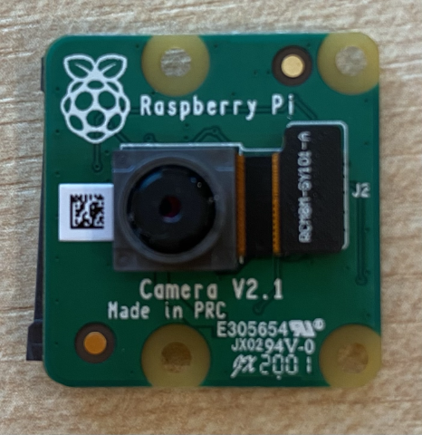

<!--
CO_OP_TRANSLATOR_METADATA:
{
  "original_hash": "c677667095f6133eee418c7e53615d05",
  "translation_date": "2025-08-27T20:12:48+00:00",
  "source_file": "4-manufacturing/lessons/2-check-fruit-from-device/pi-camera.md",
  "language_code": "el"
}
-->
# Λήψη εικόνας - Raspberry Pi

Σε αυτό το μέρος του μαθήματος, θα προσθέσετε έναν αισθητήρα κάμερας στο Raspberry Pi σας και θα διαβάσετε εικόνες από αυτόν.

## Υλικό

Το Raspberry Pi χρειάζεται μια κάμερα.

Η κάμερα που θα χρησιμοποιήσετε είναι το [Raspberry Pi Camera Module](https://www.raspberrypi.org/products/camera-module-v2/). Αυτή η κάμερα έχει σχεδιαστεί για να λειτουργεί με το Raspberry Pi και συνδέεται μέσω ενός ειδικού συνδέσμου στο Pi.

> 💁 Αυτή η κάμερα χρησιμοποιεί το [Camera Serial Interface, ένα πρωτόκολλο από την Mobile Industry Processor Interface Alliance](https://wikipedia.org/wiki/Camera_Serial_Interface), γνωστό ως MIPI-CSI. Πρόκειται για ένα ειδικό πρωτόκολλο για τη μεταφορά εικόνων.

## Σύνδεση της κάμερας

Η κάμερα μπορεί να συνδεθεί στο Raspberry Pi χρησιμοποιώντας ένα καλώδιο κορδέλας.

### Εργασία - σύνδεση της κάμερας



1. Απενεργοποιήστε το Pi.

1. Συνδέστε το καλώδιο κορδέλας που συνοδεύει την κάμερα στην κάμερα. Για να το κάνετε αυτό, τραβήξτε απαλά το μαύρο πλαστικό κλιπ στη θήκη ώστε να βγει λίγο έξω, στη συνέχεια σύρετε το καλώδιο μέσα στην υποδοχή, με την μπλε πλευρά να κοιτάζει μακριά από τον φακό και τις μεταλλικές λωρίδες να κοιτάζουν προς τον φακό. Μόλις το καλώδιο μπει εντελώς, πιέστε το μαύρο πλαστικό κλιπ πίσω στη θέση του.

    Μπορείτε να βρείτε μια κινούμενη εικόνα που δείχνει πώς να ανοίξετε το κλιπ και να εισάγετε το καλώδιο στην [τεκμηρίωση Raspberry Pi Getting Started with the Camera module](https://projects.raspberrypi.org/en/projects/getting-started-with-picamera/2).

    

1. Αφαιρέστε το Grove Base Hat από το Pi.

1. Περάστε το καλώδιο κορδέλας μέσα από την υποδοχή κάμερας στο Grove Base Hat. Βεβαιωθείτε ότι η μπλε πλευρά του καλωδίου κοιτάζει προς τις αναλογικές θύρες με την ένδειξη **A0**, **A1** κ.λπ.

    

1. Εισάγετε το καλώδιο κορδέλας στην υποδοχή κάμερας στο Pi. Και πάλι, τραβήξτε το μαύρο πλαστικό κλιπ προς τα πάνω, εισάγετε το καλώδιο και στη συνέχεια πιέστε το κλιπ πίσω στη θέση του. Η μπλε πλευρά του καλωδίου πρέπει να κοιτάζει προς τις θύρες USB και ethernet.

    

1. Επανατοποθετήστε το Grove Base Hat.

## Προγραμματισμός της κάμερας

Το Raspberry Pi μπορεί τώρα να προγραμματιστεί για να χρησιμοποιήσει την κάμερα χρησιμοποιώντας τη βιβλιοθήκη Python [PiCamera](https://pypi.org/project/picamera/).

### Εργασία - ενεργοποίηση λειτουργίας κάμερας παλαιού τύπου

Δυστυχώς, με την κυκλοφορία του Raspberry Pi OS Bullseye, το λογισμικό κάμερας που συνοδεύει το λειτουργικό σύστημα άλλαξε, πράγμα που σημαίνει ότι από προεπιλογή το PiCamera δεν λειτουργεί πλέον. Υπάρχει μια αντικατάσταση σε εξέλιξη, που ονομάζεται PiCamera2, αλλά δεν είναι ακόμα έτοιμη για χρήση.

Προς το παρόν, μπορείτε να ρυθμίσετε το Pi σας σε λειτουργία κάμερας παλαιού τύπου για να επιτρέψετε τη λειτουργία του PiCamera. Η υποδοχή κάμερας είναι επίσης απενεργοποιημένη από προεπιλογή, αλλά η ενεργοποίηση του λογισμικού κάμερας παλαιού τύπου την ενεργοποιεί αυτόματα.

1. Ενεργοποιήστε το Pi και περιμένετε να εκκινήσει.

1. Εκκινήστε το VS Code, είτε απευθείας στο Pi είτε συνδεθείτε μέσω της επέκτασης Remote SSH.

1. Εκτελέστε τις παρακάτω εντολές από το τερματικό σας:

    ```sh
    sudo raspi-config nonint do_legacy 0
    sudo reboot
    ```

    Αυτό θα ενεργοποιήσει μια ρύθμιση για την ενεργοποίηση του λογισμικού κάμερας παλαιού τύπου και στη συνέχεια θα επανεκκινήσει το Pi για να τεθεί σε ισχύ αυτή η ρύθμιση.

1. Περιμένετε να επανεκκινήσει το Pi και στη συνέχεια επανεκκινήστε το VS Code.

### Εργασία - προγραμματισμός της κάμερας

Προγραμματίστε τη συσκευή.

1. Από το τερματικό, δημιουργήστε έναν νέο φάκελο στον αρχικό κατάλογο του χρήστη `pi` με το όνομα `fruit-quality-detector`. Δημιουργήστε ένα αρχείο σε αυτόν τον φάκελο με το όνομα `app.py`.

1. Ανοίξτε αυτόν τον φάκελο στο VS Code.

1. Για να αλληλεπιδράσετε με την κάμερα, μπορείτε να χρησιμοποιήσετε τη βιβλιοθήκη Python PiCamera. Εγκαταστήστε το πακέτο Pip για αυτό με την παρακάτω εντολή:

    ```sh
    pip3 install picamera
    ```

1. Προσθέστε τον παρακάτω κώδικα στο αρχείο `app.py`:

    ```python
    import io
    import time
    from picamera import PiCamera
    ```

    Αυτός ο κώδικας εισάγει κάποιες απαραίτητες βιβλιοθήκες, συμπεριλαμβανομένης της βιβλιοθήκης `PiCamera`.

1. Προσθέστε τον παρακάτω κώδικα κάτω από αυτόν για να αρχικοποιήσετε την κάμερα:

    ```python
    camera = PiCamera()
    camera.resolution = (640, 480)
    camera.rotation = 0
    
    time.sleep(2)
    ```

    Αυτός ο κώδικας δημιουργεί ένα αντικείμενο PiCamera, ορίζει την ανάλυση σε 640x480. Παρόλο που υποστηρίζονται υψηλότερες αναλύσεις (έως 3280x2464), ο ταξινομητής εικόνων λειτουργεί με πολύ μικρότερες εικόνες (227x227), επομένως δεν υπάρχει ανάγκη να καταγράψετε και να στείλετε μεγαλύτερες εικόνες.

    Η γραμμή `camera.rotation = 0` ορίζει την περιστροφή της εικόνας. Το καλώδιο κορδέλας εισέρχεται στο κάτω μέρος της κάμερας, αλλά αν η κάμερά σας περιστραφεί για να δείχνει πιο εύκολα το αντικείμενο που θέλετε να ταξινομήσετε, τότε μπορείτε να αλλάξετε αυτή τη γραμμή στον αριθμό των μοιρών περιστροφής.

    

    Για παράδειγμα, αν κρεμάσετε το καλώδιο κορδέλας πάνω από κάτι ώστε να βρίσκεται στην κορυφή της κάμερας, τότε ορίστε την περιστροφή να είναι 180:

    ```python
    camera.rotation = 180
    ```

    Η κάμερα χρειάζεται λίγα δευτερόλεπτα για να ξεκινήσει, γι' αυτό η γραμμή `time.sleep(2)`.

1. Προσθέστε τον παρακάτω κώδικα κάτω από αυτόν για να καταγράψετε την εικόνα ως δυαδικά δεδομένα:

    ```python
    image = io.BytesIO()
    camera.capture(image, 'jpeg')
    image.seek(0)
    ```

    Αυτός ο κώδικας δημιουργεί ένα αντικείμενο `BytesIO` για την αποθήκευση δυαδικών δεδομένων. Η εικόνα διαβάζεται από την κάμερα ως αρχείο JPEG και αποθηκεύεται σε αυτό το αντικείμενο. Αυτό το αντικείμενο έχει έναν δείκτη θέσης για να γνωρίζει πού βρίσκεται στα δεδομένα, ώστε να μπορούν να γραφτούν περισσότερα δεδομένα στο τέλος αν χρειαστεί, γι' αυτό η γραμμή `image.seek(0)` μετακινεί αυτή τη θέση πίσω στην αρχή ώστε όλα τα δεδομένα να μπορούν να διαβαστούν αργότερα.

1. Κάτω από αυτό, προσθέστε τον παρακάτω κώδικα για να αποθηκεύσετε την εικόνα σε ένα αρχείο:

    ```python
    with open('image.jpg', 'wb') as image_file:
        image_file.write(image.read())
    ```

    Αυτός ο κώδικας ανοίγει ένα αρχείο με το όνομα `image.jpg` για εγγραφή, στη συνέχεια διαβάζει όλα τα δεδομένα από το αντικείμενο `BytesIO` και τα γράφει στο αρχείο.

    > 💁 Μπορείτε να καταγράψετε την εικόνα απευθείας σε ένα αρχείο αντί για ένα αντικείμενο `BytesIO` περνώντας το όνομα του αρχείου στην κλήση `camera.capture`. Ο λόγος για τη χρήση του αντικειμένου `BytesIO` είναι ώστε αργότερα σε αυτό το μάθημα να μπορείτε να στείλετε την εικόνα στον ταξινομητή εικόνων σας.

1. Στρέψτε την κάμερα σε κάτι και εκτελέστε αυτόν τον κώδικα.

1. Μια εικόνα θα καταγραφεί και θα αποθηκευτεί ως `image.jpg` στον τρέχοντα φάκελο. Θα δείτε αυτό το αρχείο στον εξερευνητή του VS Code. Επιλέξτε το αρχείο για να δείτε την εικόνα. Αν χρειάζεται περιστροφή, ενημερώστε τη γραμμή `camera.rotation = 0` όπως απαιτείται και τραβήξτε άλλη μια φωτογραφία.

> 💁 Μπορείτε να βρείτε αυτόν τον κώδικα στον φάκελο [code-camera/pi](../../../../../4-manufacturing/lessons/2-check-fruit-from-device/code-camera/pi).

😀 Το πρόγραμμα της κάμεράς σας ήταν επιτυχές!

---

**Αποποίηση ευθύνης**:  
Αυτό το έγγραφο έχει μεταφραστεί χρησιμοποιώντας την υπηρεσία αυτόματης μετάφρασης [Co-op Translator](https://github.com/Azure/co-op-translator). Παρόλο που καταβάλλουμε προσπάθειες για ακρίβεια, παρακαλούμε να έχετε υπόψη ότι οι αυτοματοποιημένες μεταφράσεις ενδέχεται να περιέχουν σφάλματα ή ανακρίβειες. Το πρωτότυπο έγγραφο στη μητρική του γλώσσα θα πρέπει να θεωρείται η αυθεντική πηγή. Για κρίσιμες πληροφορίες, συνιστάται επαγγελματική ανθρώπινη μετάφραση. Δεν φέρουμε ευθύνη για τυχόν παρεξηγήσεις ή εσφαλμένες ερμηνείες που προκύπτουν από τη χρήση αυτής της μετάφρασης.