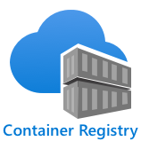

<!--
CO_OP_TRANSLATOR_METADATA:
{
  "original_hash": "2625af24587465c5547ae33d6cc000a5",
  "translation_date": "2025-08-27T20:05:17+00:00",
  "source_file": "4-manufacturing/lessons/3-run-fruit-detector-edge/README.md",
  "language_code": "el"
}
-->
# Εκτελέστε τον ανιχνευτή φρούτων σας στην άκρη


> Σκίτσο από τη [Nitya Narasimhan](https://github.com/nitya). Κάντε κλικ στην εικόνα για μεγαλύτερη έκδοση.

Αυτό το βίντεο παρέχει μια επισκόπηση της εκτέλεσης ταξινομητών εικόνας σε συσκευές IoT, το θέμα που καλύπτεται σε αυτό το μάθημα.

[](https://www.youtube.com/watch?v=_K5fqGLO8us)

## Ερωτηματολόγιο πριν το μάθημα

[Ερωτηματολόγιο πριν το μάθημα](https://black-meadow-040d15503.1.azurestaticapps.net/quiz/33)

## Εισαγωγή

Στο προηγούμενο μάθημα χρησιμοποιήσατε τον ταξινομητή εικόνας σας για να ταξινομήσετε ώριμα και άγουρα φρούτα, στέλνοντας μια εικόνα που καταγράφηκε από την κάμερα της συσκευής IoT σας μέσω του διαδικτύου σε μια υπηρεσία cloud. Αυτές οι κλήσεις απαιτούν χρόνο, κοστίζουν χρήματα και, ανάλογα με το είδος των δεδομένων εικόνας που χρησιμοποιείτε, μπορεί να έχουν επιπτώσεις στην ιδιωτικότητα.

Σε αυτό το μάθημα θα μάθετε πώς να εκτελείτε μοντέλα μηχανικής μάθησης (ML) στην άκρη - σε συσκευές IoT που λειτουργούν στο δικό σας δίκτυο αντί για το cloud. Θα μάθετε τα πλεονεκτήματα και τα μειονεκτήματα της υπολογιστικής στην άκρη σε σύγκριση με την υπολογιστική στο cloud, πώς να αναπτύξετε το μοντέλο AI σας στην άκρη και πώς να το προσπελάσετε από τη συσκευή IoT σας.

Σε αυτό το μάθημα θα καλύψουμε:

* [Υπολογιστική στην άκρη](../../../../../4-manufacturing/lessons/3-run-fruit-detector-edge)
* [Azure IoT Edge](../../../../../4-manufacturing/lessons/3-run-fruit-detector-edge)
* [Εγγραφή μιας συσκευής IoT Edge](../../../../../4-manufacturing/lessons/3-run-fruit-detector-edge)
* [Ρύθμιση μιας συσκευής IoT Edge](../../../../../4-manufacturing/lessons/3-run-fruit-detector-edge)
* [Εξαγωγή του μοντέλου σας](../../../../../4-manufacturing/lessons/3-run-fruit-detector-edge)
* [Προετοιμασία του container σας για ανάπτυξη](../../../../../4-manufacturing/lessons/3-run-fruit-detector-edge)
* [Ανάπτυξη του container σας](../../../../../4-manufacturing/lessons/3-run-fruit-detector-edge)
* [Χρήση της συσκευής IoT Edge σας](../../../../../4-manufacturing/lessons/3-run-fruit-detector-edge)

## Υπολογιστική στην άκρη

Η υπολογιστική στην άκρη περιλαμβάνει τη χρήση υπολογιστών που επεξεργάζονται δεδομένα IoT όσο το δυνατόν πιο κοντά στο σημείο όπου δημιουργούνται τα δεδομένα. Αντί να γίνεται αυτή η επεξεργασία στο cloud, μεταφέρεται στην άκρη του cloud - στο εσωτερικό σας δίκτυο.


Στα μαθήματα μέχρι τώρα, είχατε συσκευές που συλλέγουν δεδομένα και στέλνουν δεδομένα στο cloud για ανάλυση, εκτελώντας λειτουργίες χωρίς διακομιστή ή μοντέλα AI στο cloud.


Η υπολογιστική στην άκρη περιλαμβάνει τη μεταφορά ορισμένων υπηρεσιών cloud εκτός του cloud και την εκτέλεσή τους σε υπολογιστές που λειτουργούν στο ίδιο δίκτυο με τις συσκευές IoT, επικοινωνώντας με το cloud μόνο όταν είναι απαραίτητο. Για παράδειγμα, μπορείτε να εκτελέσετε μοντέλα AI σε συσκευές άκρης για να αναλύσετε την ωριμότητα των φρούτων και να στείλετε μόνο αναλυτικά δεδομένα πίσω στο cloud, όπως τον αριθμό των ώριμων φρούτων σε σύγκριση με τα άγουρα.

✅ Σκεφτείτε τις εφαρμογές IoT που έχετε δημιουργήσει μέχρι τώρα. Ποια μέρη τους θα μπορούσαν να μεταφερθούν στην άκρη;

### Πλεονεκτήματα

Τα πλεονεκτήματα της υπολογιστικής στην άκρη είναι:

1. **Ταχύτητα** - η υπολογιστική στην άκρη είναι ιδανική για δεδομένα που απαιτούν άμεση επεξεργασία, καθώς οι ενέργειες γίνονται στο ίδιο δίκτυο με τη συσκευή, αντί να γίνονται κλήσεις μέσω του διαδικτύου. Αυτό επιτρέπει υψηλότερες ταχύτητες, καθώς τα εσωτερικά δίκτυα μπορούν να λειτουργούν με σημαντικά μεγαλύτερες ταχύτητες από τις συνδέσεις στο διαδίκτυο, με τα δεδομένα να ταξιδεύουν πολύ μικρότερη απόσταση.

    > 💁 Παρά το γεγονός ότι χρησιμοποιούνται οπτικά καλώδια για συνδέσεις στο διαδίκτυο που επιτρέπουν στα δεδομένα να ταξιδεύουν με την ταχύτητα του φωτός, τα δεδομένα μπορεί να χρειαστούν χρόνο για να ταξιδέψουν σε όλο τον κόσμο προς τους παρόχους cloud. Για παράδειγμα, αν στέλνετε δεδομένα από την Ευρώπη σε υπηρεσίες cloud στις ΗΠΑ, χρειάζονται τουλάχιστον 28ms για να διασχίσουν τον Ατλαντικό μέσω οπτικού καλωδίου, και αυτό αγνοεί τον χρόνο που απαιτείται για να φτάσουν τα δεδομένα στο καλώδιο, να μετατραπούν από ηλεκτρικά σε φωτεινά σήματα και πάλι πίσω στην άλλη πλευρά, και από το καλώδιο στον πάροχο cloud.

    Η υπολογιστική στην άκρη απαιτεί επίσης λιγότερη κίνηση δικτύου, μειώνοντας τον κίνδυνο τα δεδομένα σας να επιβραδυνθούν λόγω συμφόρησης στο περιορισμένο εύρος ζώνης που είναι διαθέσιμο για μια σύνδεση στο διαδίκτυο.

1. **Απομακρυσμένη προσβασιμότητα** - η υπολογιστική στην άκρη λειτουργεί όταν έχετε περιορισμένη ή καθόλου συνδεσιμότητα, ή όταν η συνδεσιμότητα είναι πολύ ακριβή για συνεχή χρήση. Για παράδειγμα, όταν εργάζεστε σε ανθρωπιστικές περιοχές καταστροφών όπου η υποδομή είναι περιορισμένη ή σε αναπτυσσόμενες χώρες.

1. **Χαμηλότερο κόστος** - η συλλογή, αποθήκευση, ανάλυση και ενεργοποίηση ενεργειών σε συσκευές άκρης μειώνει τη χρήση υπηρεσιών cloud, κάτι που μπορεί να μειώσει το συνολικό κόστος της εφαρμογής IoT σας. Υπάρχει μια πρόσφατη αύξηση στις συσκευές που έχουν σχεδιαστεί για υπολογιστική στην άκρη, όπως οι επιταχυντές AI όπως το [Jetson Nano από την NVIDIA](https://developer.nvidia.com/embedded/jetson-nano-developer-kit), που μπορούν να εκτελούν φόρτους εργασίας AI χρησιμοποιώντας υλικό βασισμένο σε GPU σε συσκευές που κοστίζουν λιγότερο από 100 δολάρια ΗΠΑ.

1. **Ιδιωτικότητα και ασφάλεια** - με την υπολογιστική στην άκρη, τα δεδομένα παραμένουν στο δίκτυό σας και δεν ανεβαίνουν στο cloud. Αυτό προτιμάται συχνά για ευαίσθητες και προσωπικά αναγνωρίσιμες πληροφορίες, ειδικά επειδή τα δεδομένα δεν χρειάζεται να αποθηκεύονται μετά την ανάλυσή τους, κάτι που μειώνει σημαντικά τον κίνδυνο διαρροών δεδομένων. Παραδείγματα περιλαμβάνουν ιατρικά δεδομένα και πλάνα από κάμερες ασφαλείας.

1. **Διαχείριση μη ασφαλών συσκευών** - αν έχετε συσκευές με γνωστά προβλήματα ασφαλείας που δεν θέλετε να συνδέσετε απευθείας στο δίκτυό σας ή στο διαδίκτυο, τότε μπορείτε να τις συνδέσετε σε ένα ξεχωριστό δίκτυο με μια συσκευή IoT Edge ως πύλη. Αυτή η συσκευή άκρης μπορεί επίσης να έχει σύνδεση με το ευρύτερο δίκτυό σας ή το διαδίκτυο και να διαχειρίζεται τη ροή δεδομένων.

1. **Υποστήριξη για μη συμβατές συσκευές** - αν έχετε συσκευές που δεν μπορούν να συνδεθούν στο IoT Hub, για παράδειγμα συσκευές που μπορούν να συνδεθούν μόνο μέσω HTTP ή συσκευές που έχουν μόνο Bluetooth για σύνδεση, μπορείτε να χρησιμοποιήσετε μια συσκευή IoT Edge ως πύλη για να προωθήσετε μηνύματα στο IoT Hub.

✅ Κάντε έρευνα: Ποια άλλα πλεονεκτήματα μπορεί να έχει η υπολογιστική στην άκρη;

### Μειονεκτήματα

Υπάρχουν μειονεκτήματα στην υπολογιστική στην άκρη, όπου το cloud μπορεί να είναι η προτιμώμενη επιλογή:

1. **Κλίμακα και ευελιξία** - η υπολογιστική στο cloud μπορεί να προσαρμοστεί στις ανάγκες δικτύου και δεδομένων σε πραγματικό χρόνο προσθέτοντας ή μειώνοντας διακομιστές και άλλους πόρους. Για να προσθέσετε περισσότερους υπολογιστές άκρης απαιτείται χειροκίνητη προσθήκη περισσότερων συσκευών.

1. **Αξιοπιστία και ανθεκτικότητα** - η υπολογιστική στο cloud παρέχει πολλαπλούς διακομιστές συχνά σε πολλαπλές τοποθεσίες για πλεονασμό και ανάκτηση από καταστροφές. Για να έχετε το ίδιο επίπεδο πλεονασμού στην άκρη απαιτούνται μεγάλες επενδύσεις και πολλή δουλειά διαμόρφωσης.

1. **Συντήρηση** - οι πάροχοι υπηρεσιών cloud παρέχουν συντήρηση και ενημερώσεις συστήματος.

✅ Κάντε έρευνα: Ποια άλλα μειονεκτήματα μπορεί να έχει η υπολογιστική στην άκρη;

Τα μειονεκτήματα είναι ουσιαστικά το αντίθετο των πλεονεκτημάτων της χρήσης του cloud - πρέπει να κατασκευάσετε και να διαχειριστείτε αυτές τις συσκευές μόνοι σας, αντί να βασίζεστε στην εμπειρία και την κλίμακα των παρόχων cloud.

Ορισμένοι από τους κινδύνους μετριάζονται από τη φύση της υπολογιστικής στην άκρη. Για παράδειγμα, αν έχετε μια συσκευή άκρης που λειτουργεί σε ένα εργοστάσιο και συλλέγει δεδομένα από μηχανήματα, δεν χρειάζεται να σκεφτείτε ορισμένα σενάρια ανάκτησης από καταστροφές. Αν η παροχή ρεύματος στο εργοστάσιο διακοπεί, τότε δεν χρειάζεστε εφεδρική συσκευή άκρης, καθώς οι μηχανές που παράγουν τα δεδομένα που επεξεργάζεται η συσκευή άκρης θα είναι επίσης χωρίς ρεύμα.

Για συστήματα IoT, συχνά θα θέλετε έναν συνδυασμό υπολογιστικής στο cloud και στην άκρη, αξιοποιώντας κάθε υπηρεσία με βάση τις ανάγκες του συστήματος, των πελατών του και των διαχειριστών του.

## Azure IoT Edge


Το Azure IoT Edge είναι μια υπηρεσία που μπορεί να σας βοηθήσει να μεταφέρετε φόρτους εργασίας εκτός του cloud και στην άκρη. Ρυθμίζετε μια συσκευή ως συσκευή άκρης και από το cloud μπορείτε να αναπτύξετε κώδικα σε αυτή τη συσκευή άκρης. Αυτό σας επιτρέπει να συνδυάσετε τις δυνατότητες του cloud και της άκρης.

> 🎓 *Φόρτοι εργασίας* είναι ένας όρος για οποιαδήποτε υπηρεσία που εκτελεί κάποια εργασία, όπως μοντέλα AI, εφαρμογές ή λειτουργίες χωρίς διακομιστή.

Για παράδειγμα, μπορείτε να εκπαιδεύσετε έναν ταξινομητή εικόνας στο cloud και στη συνέχεια να τον αναπτύξετε από το cloud σε μια συσκευή άκρης. Η συσκευή IoT σας στέλνει εικόνες στη συσκευή άκρης για ταξινόμηση, αντί να στέλνει τις εικόνες μέσω του διαδικτύου. Αν χρειαστεί να αναπτύξετε μια νέα έκδοση του μοντέλου, μπορείτε να την εκπαιδεύσετε στο cloud και να χρησιμοποιήσετε το IoT Edge για να ενημερώσετε το μοντέλο στη συσκευή άκρης με τη νέα έκδοση.

> 🎓 Το λογισμικό που αναπτύσσεται στο IoT Edge είναι γνωστό ως *modules*. Από προεπιλογή, το IoT Edge εκτελεί modules που επικοινωνούν με το IoT Hub, όπως τα modules `edgeAgent` και `edgeHub`. Όταν αναπτύσσετε έναν ταξινομητή εικόνας, αυτός αναπτύσσεται ως πρόσθετο module.

Το IoT Edge είναι ενσωματωμένο στο IoT Hub, ώστε να μπορείτε να διαχειρίζεστε συσκευές άκρης χρησιμοποιώντας την ίδια υπηρεσία που θα χρησιμοποιούσατε για τη διαχείριση συσκευών IoT, με το ίδιο επίπεδο ασφάλειας.

Το IoT Edge εκτελεί κώδικα από *containers* - αυτοτελείς εφαρμογές που εκτελούνται απομονωμένες από τις υπόλοιπες εφαρμογές στον υπολογιστή σας. Όταν εκτελείτε ένα container, λειτουργεί σαν ένας ξεχωριστός υπολογιστής μέσα στον υπολογιστή σας, με το δικό του λογισμικό, υπηρεσίες και εφαρμογές. Τις περισσότερες φορές, τα containers δεν μπορούν να έχουν πρόσβαση σε τίποτα στον υπολογιστή σας, εκτός αν επιλέξετε να μοιραστείτε πράγματα όπως ένας φάκελος με το container. Το container στη συνέχεια εκθέτει υπηρεσίες μέσω μιας ανοιχτής θύρας που μπορείτε να συνδεθείτε ή να εκθέσετε στο δίκτυό σας.


Για παράδειγμα, μπορείτε να έχετε ένα container με έναν ιστότοπο που εκτελείται στη θύρα 80, την προεπιλεγμένη θύρα HTTP, και μπορείτε στη συνέχεια να το εκθέσετε από τον υπολογιστή σας επίσης στη θύρα 80.

✅ Κάντε έρευνα: Διαβάστε για τα containers και υπηρεσίες όπως το Docker ή το Moby.

Μπορείτε να χρησιμοποιήσετε το Custom Vision για να κατεβάσετε ταξινομητές εικόνας και να τους αναπτύξετε ως containers, είτε απευθείας σε μια συσκευή είτε μέσω IoT Edge. Μόλις εκτελούνται σε ένα container, μπορούν να προσπελαστούν χρησιμοποιώντας το ίδιο REST API όπως η έκδοση cloud, αλλά με το endpoint να δείχνει στη συσκευή άκρης που εκτελεί το container.

## Εγγραφή μιας συσκευής IoT Edge

Για να χρησιμοποιήσετε μια συσκευή IoT Edge, πρέπει να εγγραφεί στο IoT Hub.

### Εργασία - εγγραφή μιας συσκευής IoT Edge

1. Δημιουργήστε ένα IoT Hub στην ομάδα πόρων `fruit-quality-detector`. Δώστε του ένα μοναδικό όνομα βασισμένο στο `fruit-quality-detector`.

1. Εγγράψτε μια συσκευή IoT Edge που ονομάζεται `fruit-quality-detector-edge` στο IoT Hub σας. Η εντολή για να το κάνετε αυτό είναι παρόμοια με αυτή που χρησιμοποιείται για την εγγραφή μιας μη συσκευής άκρης, εκτός από το ότι περνάτε τη σημαία `--edge-enabled`.

    ```sh
    az iot hub device-identity create --edge-enabled \
                                      --device-id fruit-quality-detector-edge \
                                      --hub-name <hub_name>
    ```

    Αντικαταστήστε το `<hub_name>` με το όνομα του IoT Hub σας.

1. Αποκτήστε τη συμβολοσειρά σύνδεσης για τη συσκευή σας χρησιμοποιώντας την ακόλουθη εντολή:

    ```sh
    az iot hub device-identity connection-string show --device-id fruit-quality-detector-edge \
                                                      --output table \
                                                      --hub-name <hub_name>
    ```

    Αντικαταστήστε το `<hub_name>` με το όνομα του IoT Hub σας.

    Κρατήστε ένα αντίγραφο της συμβολοσειράς σύνδεσης που εμφανίζεται στην έξοδο.

## Ρύθμιση μιας συσκευής IoT Edge

Μόλις δημιουργήσετε την εγγραφή της συσκευής άκρης στο IoT Hub σας, μπορείτε να ρυθμίσετε τη συσκευή άκρης.

### Εργασία - Εγκατάσταση και εκκίνηση του IoT Edge Runtime

**Το IoT Edge runtime εκτελεί μόνο containers Linux.** Μπορεί να εκτελεστεί σε Linux ή σε Windows χρησιμοποιώντας εικονικές μηχανές Linux.

* Αν χρησιμοποιείτε ένα Raspberry Pi ως συσκευή IoT σας, τότε αυτό εκτελεί μια υποστηριζόμενη έκδοση του Linux και μπορεί να φιλοξενήσει το IoT Edge runtime. Ακολουθήστε τον [οδη
1. Ανοίξτε την πύλη Custom Vision στο [CustomVision.ai](https://customvision.ai) και συνδεθείτε αν δεν την έχετε ήδη ανοιχτή. Στη συνέχεια, ανοίξτε το έργο σας `fruit-quality-detector`.

1. Επιλέξτε το κουμπί **Ρυθμίσεις** (το εικονίδιο ⚙).

1. Στη λίστα *Domains*, επιλέξτε *Food (compact)*.

1. Στην ενότητα *Export Capabilities*, βεβαιωθείτε ότι είναι επιλεγμένο το *Basic platforms (Tensorflow, CoreML, ONNX, ...)*.

1. Στο κάτω μέρος της σελίδας Ρυθμίσεων, επιλέξτε **Αποθήκευση Αλλαγών**.

1. Επανεκπαιδεύστε το μοντέλο με το κουμπί **Train**, επιλέγοντας *Γρήγορη εκπαίδευση*.

### Εργασία - εξαγωγή του μοντέλου σας

Μόλις εκπαιδευτεί το μοντέλο, πρέπει να εξαχθεί ως κοντέινερ.

1. Επιλέξτε την καρτέλα **Απόδοση** και βρείτε την τελευταία σας επανάληψη που εκπαιδεύτηκε χρησιμοποιώντας το compact domain.

1. Επιλέξτε το κουμπί **Εξαγωγή** στην κορυφή.

1. Επιλέξτε **DockerFile**, και στη συνέχεια διαλέξτε μια έκδοση που ταιριάζει με τη συσκευή edge σας:

    * Αν εκτελείτε IoT Edge σε υπολογιστή Linux, Windows ή Εικονική Μηχανή, επιλέξτε την έκδοση *Linux*.
    * Αν εκτελείτε IoT Edge σε Raspberry Pi, επιλέξτε την έκδοση *ARM (Raspberry Pi 3)*.

> 🎓 Το Docker είναι ένα από τα πιο δημοφιλή εργαλεία για τη διαχείριση κοντέινερ, και ένα DockerFile είναι ένα σύνολο οδηγιών για τη ρύθμιση του κοντέινερ.

1. Επιλέξτε **Εξαγωγή** για να δημιουργήσει το Custom Vision τα σχετικά αρχεία και στη συνέχεια **Λήψη** για να τα κατεβάσετε σε ένα αρχείο zip.

1. Αποθηκεύστε τα αρχεία στον υπολογιστή σας και αποσυμπιέστε τον φάκελο.

## Προετοιμασία του κοντέινερ για ανάπτυξη


Αφού κατεβάσετε το μοντέλο σας, πρέπει να δημιουργηθεί σε κοντέινερ και να αποσταλεί σε ένα container registry - μια διαδικτυακή τοποθεσία όπου μπορείτε να αποθηκεύετε κοντέινερ. Το IoT Edge μπορεί στη συνέχεια να κατεβάσει το κοντέινερ από το registry και να το προωθήσει στη συσκευή σας.



Το container registry που θα χρησιμοποιήσετε για αυτό το μάθημα είναι το Azure Container Registry. Αυτή δεν είναι δωρεάν υπηρεσία, οπότε για να εξοικονομήσετε χρήματα, βεβαιωθείτε ότι [καθαρίζετε το έργο σας](../../../clean-up.md) μόλις τελειώσετε.

> 💁 Μπορείτε να δείτε το κόστος χρήσης του Azure Container Registry στη [σελίδα τιμολόγησης του Azure Container Registry](https://azure.microsoft.com/pricing/details/container-registry/?WT.mc_id=academic-17441-jabenn).

### Εργασία - εγκατάσταση του Docker

Για να δημιουργήσετε και να αναπτύξετε τον ταξινομητή, ίσως χρειαστεί να εγκαταστήσετε το [Docker](https://www.docker.com/).

Θα χρειαστεί να το κάνετε μόνο αν σκοπεύετε να δημιουργήσετε το κοντέινερ από διαφορετική συσκευή από αυτήν που εγκαταστήσατε το IoT Edge - καθώς κατά την εγκατάσταση του IoT Edge, το Docker εγκαθίσταται αυτόματα.

1. Αν δημιουργείτε το κοντέινερ Docker σε διαφορετική συσκευή από τη συσκευή IoT Edge, ακολουθήστε τις οδηγίες εγκατάστασης Docker στη [σελίδα εγκατάστασης Docker](https://www.docker.com/products/docker-desktop) για να εγκαταστήσετε το Docker Desktop ή τη μηχανή Docker. Βεβαιωθείτε ότι εκτελείται μετά την εγκατάσταση.

### Εργασία - δημιουργία πόρου container registry

1. Εκτελέστε την παρακάτω εντολή από το Terminal ή το command prompt για να δημιουργήσετε έναν πόρο Azure Container Registry:

    ```sh
    az acr create --resource-group fruit-quality-detector \
                  --sku Basic \
                  --name <Container registry name>
    ```

    Αντικαταστήστε το `<Container registry name>` με ένα μοναδικό όνομα για το container registry σας, χρησιμοποιώντας μόνο γράμματα και αριθμούς. Βασίστε το στο `fruitqualitydetector`. Αυτό το όνομα γίνεται μέρος του URL για πρόσβαση στο container registry, οπότε πρέπει να είναι μοναδικό παγκοσμίως.

1. Συνδεθείτε στο Azure Container Registry με την παρακάτω εντολή:

    ```sh
    az acr login --name <Container registry name>
    ```

    Αντικαταστήστε το `<Container registry name>` με το όνομα που χρησιμοποιήσατε για το container registry σας.

1. Ενεργοποιήστε τη λειτουργία διαχειριστή στο container registry για να δημιουργήσετε έναν κωδικό πρόσβασης με την παρακάτω εντολή:

    ```sh
    az acr update --admin-enabled true \
                 --name <Container registry name>
    ```

    Αντικαταστήστε το `<Container registry name>` με το όνομα που χρησιμοποιήσατε για το container registry σας.

1. Δημιουργήστε κωδικούς πρόσβασης για το container registry σας με την παρακάτω εντολή:

    ```sh
     az acr credential renew --password-name password \
                             --output table \
                             --name <Container registry name>
    ```

    Αντικαταστήστε το `<Container registry name>` με το όνομα που χρησιμοποιήσατε για το container registry σας.

    Κρατήστε ένα αντίγραφο της τιμής του `PASSWORD`, καθώς θα το χρειαστείτε αργότερα.

### Εργασία - δημιουργία του κοντέινερ σας

Αυτό που κατεβάσατε από το Custom Vision ήταν ένα DockerFile που περιέχει οδηγίες για το πώς πρέπει να δημιουργηθεί το κοντέινερ, μαζί με τον κώδικα εφαρμογής που θα εκτελείται μέσα στο κοντέινερ για να φιλοξενήσει το μοντέλο Custom Vision σας, καθώς και ένα REST API για να το καλείτε. Μπορείτε να χρησιμοποιήσετε το Docker για να δημιουργήσετε ένα κοντέινερ με ετικέτα από το DockerFile και στη συνέχεια να το προωθήσετε στο container registry σας.

> 🎓 Τα κοντέινερ λαμβάνουν μια ετικέτα που ορίζει ένα όνομα και μια έκδοση για αυτά. Όταν χρειάζεται να ενημερώσετε ένα κοντέινερ, μπορείτε να το δημιουργήσετε με την ίδια ετικέτα αλλά με νεότερη έκδοση.

1. Ανοίξτε το terminal ή το command prompt και μεταβείτε στο αποσυμπιεσμένο μοντέλο που κατεβάσατε από το Custom Vision.

1. Εκτελέστε την παρακάτω εντολή για να δημιουργήσετε και να προσθέσετε ετικέτα στην εικόνα:

    ```sh
    docker build --platform <platform> -t <Container registry name>.azurecr.io/classifier:v1 .
    ```

    Αντικαταστήστε το `<platform>` με την πλατφόρμα στην οποία θα εκτελείται αυτό το κοντέινερ. Αν εκτελείτε IoT Edge σε Raspberry Pi, ορίστε το σε `linux/armhf`, διαφορετικά ορίστε το σε `linux/amd64`.

    > 💁 Αν εκτελείτε αυτήν την εντολή από τη συσκευή στην οποία εκτελείται το IoT Edge, όπως από το Raspberry Pi σας, μπορείτε να παραλείψετε το `--platform <platform>` καθώς προεπιλέγεται η τρέχουσα πλατφόρμα.

    Αντικαταστήστε το `<Container registry name>` με το όνομα που χρησιμοποιήσατε για το container registry σας.

    > 💁 Αν εκτελείτε σε Linux ή Raspberry Pi OS, ίσως χρειαστεί να χρησιμοποιήσετε `sudo` για να εκτελέσετε αυτήν την εντολή.

    Το Docker θα δημιουργήσει την εικόνα, ρυθμίζοντας όλο το απαραίτητο λογισμικό. Η εικόνα θα λάβει την ετικέτα `classifier:v1`.

    ```output
    ➜  d4ccc45da0bb478bad287128e1274c3c.DockerFile.Linux docker build --platform linux/amd64 -t  fruitqualitydetectorjimb.azurecr.io/classifier:v1 .
    [+] Building 102.4s (11/11) FINISHED
     => [internal] load build definition from Dockerfile
     => => transferring dockerfile: 131B
     => [internal] load .dockerignore
     => => transferring context: 2B
     => [internal] load metadata for docker.io/library/python:3.7-slim
     => [internal] load build context
     => => transferring context: 905B
     => [1/6] FROM docker.io/library/python:3.7-slim@sha256:b21b91c9618e951a8cbca5b696424fa5e820800a88b7e7afd66bba0441a764d6
     => => resolve docker.io/library/python:3.7-slim@sha256:b21b91c9618e951a8cbca5b696424fa5e820800a88b7e7afd66bba0441a764d6
     => => sha256:b4d181a07f8025e00e0cb28f1cc14613da2ce26450b80c54aea537fa93cf3bda 27.15MB / 27.15MB
     => => sha256:de8ecf497b753094723ccf9cea8a46076e7cb845f333df99a6f4f397c93c6ea9 2.77MB / 2.77MB
     => => sha256:707b80804672b7c5d8f21e37c8396f319151e1298d976186b4f3b76ead9f10c8 10.06MB / 10.06MB
     => => sha256:b21b91c9618e951a8cbca5b696424fa5e820800a88b7e7afd66bba0441a764d6 1.86kB / 1.86kB
     => => sha256:44073386687709c437586676b572ff45128ff1f1570153c2f727140d4a9accad 1.37kB / 1.37kB
     => => sha256:3d94f0f2ca798607808b771a7766f47ae62a26f820e871dd488baeccc69838d1 8.31kB / 8.31kB
     => => sha256:283715715396fd56d0e90355125fd4ec57b4f0773f306fcd5fa353b998beeb41 233B / 233B
     => => sha256:8353afd48f6b84c3603ea49d204bdcf2a1daada15f5d6cad9cc916e186610a9f 2.64MB / 2.64MB
     => => extracting sha256:b4d181a07f8025e00e0cb28f1cc14613da2ce26450b80c54aea537fa93cf3bda
     => => extracting sha256:de8ecf497b753094723ccf9cea8a46076e7cb845f333df99a6f4f397c93c6ea9
     => => extracting sha256:707b80804672b7c5d8f21e37c8396f319151e1298d976186b4f3b76ead9f10c8
     => => extracting sha256:283715715396fd56d0e90355125fd4ec57b4f0773f306fcd5fa353b998beeb41
     => => extracting sha256:8353afd48f6b84c3603ea49d204bdcf2a1daada15f5d6cad9cc916e186610a9f
     => [2/6] RUN pip install -U pip
     => [3/6] RUN pip install --no-cache-dir numpy~=1.17.5 tensorflow~=2.0.2 flask~=1.1.2 pillow~=7.2.0
     => [4/6] RUN pip install --no-cache-dir mscviplib==2.200731.16
     => [5/6] COPY app /app
     => [6/6] WORKDIR /app
     => exporting to image
     => => exporting layers
     => => writing image sha256:1846b6f134431f78507ba7c079358ed66d944c0e185ab53428276bd822400386
     => => naming to fruitqualitydetectorjimb.azurecr.io/classifier:v1
    ```

### Εργασία - προώθηση του κοντέινερ σας στο container registry

1. Χρησιμοποιήστε την παρακάτω εντολή για να προωθήσετε το κοντέινερ σας στο container registry:

    ```sh
    docker push <Container registry name>.azurecr.io/classifier:v1
    ```

    Αντικαταστήστε το `<Container registry name>` με το όνομα που χρησιμοποιήσατε για το container registry σας.

    > 💁 Αν εκτελείτε σε Linux, ίσως χρειαστεί να χρησιμοποιήσετε `sudo` για να εκτελέσετε αυτήν την εντολή.

    Το κοντέινερ θα προωθηθεί στο container registry.

    ```output
    ➜  d4ccc45da0bb478bad287128e1274c3c.DockerFile.Linux docker push fruitqualitydetectorjimb.azurecr.io/classifier:v1
    The push refers to repository [fruitqualitydetectorjimb.azurecr.io/classifier]
    5f70bf18a086: Pushed 
    8a1ba9294a22: Pushed 
    56cf27184a76: Pushed 
    b32154f3f5dd: Pushed 
    36103e9a3104: Pushed 
    e2abb3cacca0: Pushed 
    4213fd357bbe: Pushed 
    7ea163ba4dce: Pushed 
    537313a13d90: Pushed 
    764055ebc9a7: Pushed 
    v1: digest: sha256:ea7894652e610de83a5a9e429618e763b8904284253f4fa0c9f65f0df3a5ded8 size: 2423
    ```

1. Για να επαληθεύσετε την προώθηση, μπορείτε να καταγράψετε τα κοντέινερ στο registry σας με την παρακάτω εντολή:

    ```sh
    az acr repository list --output table \
                           --name <Container registry name> 
    ```

    Αντικαταστήστε το `<Container registry name>` με το όνομα που χρησιμοποιήσατε για το container registry σας.

    ```output
    ➜  d4ccc45da0bb478bad287128e1274c3c.DockerFile.Linux az acr repository list --name fruitqualitydetectorjimb --output table
    Result
    ----------
    classifier
    ```

    Θα δείτε τον ταξινομητή σας να εμφανίζεται στην έξοδο.

## Ανάπτυξη του κοντέινερ σας

Το κοντέινερ σας μπορεί τώρα να αναπτυχθεί στη συσκευή IoT Edge σας. Για να το αναπτύξετε, πρέπει να ορίσετε ένα αρχείο ανάπτυξης - ένα έγγραφο JSON που περιέχει τις μονάδες που θα αναπτυχθούν στη συσκευή edge.

### Εργασία - δημιουργία του αρχείου ανάπτυξης

1. Δημιουργήστε ένα νέο αρχείο που ονομάζεται `deployment.json` κάπου στον υπολογιστή σας.

1. Προσθέστε τα παρακάτω σε αυτό το αρχείο:

    ```json
    {
        "content": {
            "modulesContent": {
                "$edgeAgent": {
                    "properties.desired": {
                        "schemaVersion": "1.1",
                        "runtime": {
                            "type": "docker",
                            "settings": {
                                "minDockerVersion": "v1.25",
                                "loggingOptions": "",
                                "registryCredentials": {
                                    "ClassifierRegistry": {
                                        "username": "<Container registry name>",
                                        "password": "<Container registry password>",
                                        "address": "<Container registry name>.azurecr.io"
                                      }
                                }
                            }
                        },
                        "systemModules": {
                            "edgeAgent": {
                                "type": "docker",
                                "settings": {
                                    "image": "mcr.microsoft.com/azureiotedge-agent:1.1",
                                    "createOptions": "{}"
                                }
                            },
                            "edgeHub": {
                                "type": "docker",
                                "status": "running",
                                "restartPolicy": "always",
                                "settings": {
                                    "image": "mcr.microsoft.com/azureiotedge-hub:1.1",
                                    "createOptions": "{\"HostConfig\":{\"PortBindings\":{\"5671/tcp\":[{\"HostPort\":\"5671\"}],\"8883/tcp\":[{\"HostPort\":\"8883\"}],\"443/tcp\":[{\"HostPort\":\"443\"}]}}}"
                                }
                            }
                        },
                        "modules": {
                            "ImageClassifier": {
                                "version": "1.0",
                                "type": "docker",
                                "status": "running",
                                "restartPolicy": "always",
                                "settings": {
                                    "image": "<Container registry name>.azurecr.io/classifier:v1",
                                    "createOptions": "{\"ExposedPorts\": {\"80/tcp\": {}},\"HostConfig\": {\"PortBindings\": {\"80/tcp\": [{\"HostPort\": \"80\"}]}}}"
                                }
                            }
                        }
                    }
                },
                "$edgeHub": {
                    "properties.desired": {
                        "schemaVersion": "1.1",
                        "routes": {
                            "upstream": "FROM /messages/* INTO $upstream"
                        },
                        "storeAndForwardConfiguration": {
                            "timeToLiveSecs": 7200
                        }
                    }
                }
            }
        }
    }
    ```

    > 💁 Μπορείτε να βρείτε αυτό το αρχείο στον φάκελο [code-deployment/deployment](../../../../../4-manufacturing/lessons/3-run-fruit-detector-edge/code-deployment/deployment).

    Αντικαταστήστε τις τρεις εμφανίσεις του `<Container registry name>` με το όνομα που χρησιμοποιήσατε για το container registry σας. Μία είναι στην ενότητα `ImageClassifier` module, οι άλλες δύο είναι στην ενότητα `registryCredentials`.

    Αντικαταστήστε το `<Container registry password>` στην ενότητα `registryCredentials` με τον κωδικό πρόσβασης του container registry σας.

1. Από τον φάκελο που περιέχει το αρχείο ανάπτυξης, εκτελέστε την παρακάτω εντολή:

    ```sh
    az iot edge set-modules --device-id fruit-quality-detector-edge \
                            --content deployment.json \
                            --hub-name <hub_name>
    ```

    Αντικαταστήστε το `<hub_name>` με το όνομα του IoT Hub σας.

    Η μονάδα ταξινομητή εικόνων θα αναπτυχθεί στη συσκευή edge σας.

### Εργασία - επαλήθευση ότι ο ταξινομητής εκτελείται

1. Συνδεθείτε στη συσκευή IoT Edge:

    * Αν χρησιμοποιείτε Raspberry Pi για να εκτελέσετε το IoT Edge, συνδεθείτε μέσω ssh είτε από το terminal σας είτε μέσω απομακρυσμένης συνεδρίας SSH στο VS Code.
    * Αν εκτελείτε IoT Edge σε κοντέινερ Linux στα Windows, ακολουθήστε τα βήματα στον [οδηγό επαλήθευσης επιτυχούς διαμόρφωσης](https://docs.microsoft.com/azure/iot-edge/how-to-install-iot-edge-on-windows?WT.mc_id=academic-17441-jabenn&view=iotedge-2018-06&tabs=powershell#verify-successful-configuration) για να συνδεθείτε στη συσκευή IoT Edge.
    * Αν εκτελείτε IoT Edge σε εικονική μηχανή, μπορείτε να συνδεθείτε μέσω SSH στη μηχανή χρησιμοποιώντας το `adminUsername` και τον `password` που ορίσατε κατά τη δημιουργία της VM, και χρησιμοποιώντας είτε τη διεύθυνση IP είτε το DNS όνομα:

        ```sh
        ssh <adminUsername>@<IP address>
        ```

        Ή:

        ```sh
        ssh <adminUsername>@<DNS Name>
        ```

        Εισάγετε τον κωδικό πρόσβασής σας όταν σας ζητηθεί.

1. Μόλις συνδεθείτε, εκτελέστε την παρακάτω εντολή για να λάβετε τη λίστα των μονάδων IoT Edge:

    ```sh
    iotedge list
    ```

    > 💁 Ίσως χρειαστεί να εκτελέσετε αυτήν την εντολή με `sudo`.

    Θα δείτε τις εκτελούμενες μονάδες:

    ```output
    jim@fruit-quality-detector-jimb:~$ iotedge list
    NAME             STATUS           DESCRIPTION      CONFIG
    ImageClassifier  running          Up 42 minutes    fruitqualitydetectorjimb.azurecr.io/classifier:v1
    edgeAgent        running          Up 42 minutes    mcr.microsoft.com/azureiotedge-agent:1.1
    edgeHub          running          Up 42 minutes    mcr.microsoft.com/azureiotedge-hub:1.1
    ```

1. Ελέγξτε τα logs για τη μονάδα ταξινομητή εικόνων με την παρακάτω εντολή:

    ```sh
    iotedge logs ImageClassifier
    ```

    > 💁 Ίσως χρειαστεί να εκτελέσετε αυτήν την εντολή με `sudo`.

    ```output
    jim@fruit-quality-detector-jimb:~$ iotedge logs ImageClassifier
    2021-07-05 20:30:15.387144: I tensorflow/core/platform/cpu_feature_guard.cc:142] Your CPU supports instructions that this TensorFlow binary was not compiled to use: AVX2 FMA
    2021-07-05 20:30:15.392185: I tensorflow/core/platform/profile_utils/cpu_utils.cc:94] CPU Frequency: 2394450000 Hz
    2021-07-05 20:30:15.392712: I tensorflow/compiler/xla/service/service.cc:168] XLA service 0x55ed9ac83470 executing computations on platform Host. Devices:
    2021-07-05 20:30:15.392806: I tensorflow/compiler/xla/service/service.cc:175]   StreamExecutor device (0): Host, Default Version
    Loading model...Success!
    Loading labels...2 found. Success!
     * Serving Flask app "app" (lazy loading)
     * Environment: production
       WARNING: This is a development server. Do not use it in a production deployment.
       Use a production WSGI server instead.
     * Debug mode: off
     * Running on http://0.0.0.0:80/ (Press CTRL+C to quit)
    ```

### Εργασία - δοκιμή του ταξινομητή εικόνων

1. Μπορείτε να χρησιμοποιήσετε το CURL για να δοκιμάσετε τον ταξινομητή εικόνων χρησιμοποιώντας τη διεύθυνση IP ή το όνομα υποδοχής του υπολογιστή που εκτελεί τον IoT Edge agent. Βρείτε τη διεύθυνση IP:

    * Αν βρίσκεστε στον ίδιο υπολογιστή που εκτελεί το IoT Edge, μπορείτε να χρησιμοποιήσετε το `localhost` ως όνομα υποδοχής.
    * Αν χρησιμοποιείτε VM, μπορείτε να χρησιμοποιήσετε είτε τη διεύθυνση IP είτε το DNS όνομα του VM.
    * Διαφορετικά, μπορείτε να βρείτε τη διεύθυνση IP του υπολογιστή που εκτελεί το IoT Edge:
      * Στα Windows 10, ακολουθήστε τον [οδηγό εύρεσης της διεύθυνσης IP σας](https://support.microsoft.com/windows/find-your-ip-address-f21a9bbc-c582-55cd-35e0-73431160a1b9?WT.mc_id=academic-17441-jabenn).
      * Στο macOS, ακολουθήστε τον [οδηγό εύρεσης της διεύθυνσης IP σε Mac](https://www.hellotech.com/guide/for/how-to-find-ip-address-on-mac).
      * Στο Linux, ακολουθήστε την ενότητα για την εύρεση της ιδιωτικής διεύθυνσης IP στον [οδηγό εύρεσης της διεύθυνσης IP στο Linux](https://opensource.com/article/18/5/how-find-ip-address-linux).

1. Μπορείτε να δοκιμάσετε το κοντέινερ με ένα τοπικό αρχείο εκτελώντας την παρακάτω εντολή curl:

    ```sh
    curl --location \
         --request POST 'http://<IP address or name>/image' \
         --header 'Content-Type: image/png' \
         --data-binary '@<file_Name>' 
    ```

    Αντικαταστήστε το `<IP address or name>` με τη διεύθυνση IP ή το όνομα υποδοχής του υπολογιστή που εκτελεί το IoT Edge. Αντικαταστήστε το `<file_Name>` με το όνομα του αρχείου που θέλετε να δοκιμάσετε.

    Θα δείτε τα αποτελέσματα της πρόβλεψης στην έξοδο:

    ```output
    {
        "created": "2021-07-05T21:44:39.573181",
        "id": "",
        "iteration": "",
        "predictions": [
            {
                "boundingBox": null,
                "probability": 0.9995615482330322,
                "tagId": "",
                "tagName": "ripe"
            },
            {
                "boundingBox": null,
                "probability": 0.0004384400090202689,
                "tagId": "",
                "tagName": "unripe"
            }
        ],
        "project": ""
    }
    ```

    > 💁 Δεν χρειάζεται να παρέχετε κλειδί πρόβλεψης εδώ, καθώς αυτό δεν χρησιμοποιεί πόρο Azure. Αντίθετα, η ασφάλεια θα διαμορφωθεί στο εσωτερικό δίκτυο με βάση τις εσωτερικές ανάγκες ασφαλείας, αντί να βασίζεται σε δημόσιο endpoint και API key.

## Χρήση της συσκευής IoT Edge σας

Τώρα που ο Ταξινομητής Εικόνων έχει αναπτυχθεί σε μια συσκευή IoT Edge, μπορείτε να τον χρησιμοποιήσετε από τη συσκευή IoT σας.

### Εργασία - χρήση της συσκευής IoT Edge σας

Ακολουθήστε τον σχετικό οδηγό για να ταξινομήσετε εικόνες χρησιμοποιώντας τον ταξινομητή IoT Edge:

* [Arduino - Wio Terminal](wio-terminal.md)
* [Single-board computer - Raspberry Pi/Virtual IoT device](single-board-computer.md)

### Επανεκπαίδευση μοντέλου

Ένα από τα μειονεκτήματα της εκτέλεσης ταξινομητών εικόνων σε IoT Edge είναι ότι δεν είναι συνδεδεμένοι με το έργο σας στο Custom Vision. Αν κοιτάξετε την καρτέλα **Predictions** στο Custom Vision, δεν θα δείτε τις εικόνες που ταξινομήθηκαν χρησιμοποιώντας τον ταξινομητή Edge.

Αυτό είναι η αναμενόμενη συμπεριφορά - οι εικόνες δεν αποστέλλονται στο cloud για ταξινόμηση, οπότε δεν θα είναι διαθέσιμες στο cloud. Ένα από τα πλεονεκτήματα της χρήσης IoT Edge είναι η ιδιωτικότητα, διασφαλίζοντας ότι οι εικόνες δεν φεύγουν από το δίκτυό σας, ενώ ένα άλλο είναι η δυνατότητα λειτουργίας εκτός σύνδεσης, χωρίς να βασίζεστε στη μεταφόρτωση εικόνων όταν η συσκευή δεν έχει σύνδεση στο διαδίκτυο. Το μειονέκτημα είναι η βελτίωση του μοντέλου σας - θα πρέπει να υλοποιήσετε έναν άλλο τρόπο αποθήκευσης εικόνων που μπορούν να ταξινομηθούν εκ νέου χειροκίνητα για να βελτιώσετε και να επανεκπαιδεύσετε τον ταξινομητή εικόνων.

✅ Σκεφτείτε τρόπους για να ανεβάσετε εικόνες για την επανεκπαίδευση του ταξινομητή.

---

## 🚀
* Διαβάστε περισσότερα σχετικά με το edge computing, με έμφαση στο πώς το 5G μπορεί να βοηθήσει στην επέκταση του edge computing στο [άρθρο "τι είναι το edge computing και γιατί έχει σημασία;" στο NetworkWorld](https://www.networkworld.com/article/3224893/what-is-edge-computing-and-how-its-changing-the-network.html)
* Μάθετε περισσότερα για την εκτέλεση υπηρεσιών AI στο IoT Edge παρακολουθώντας το [επεισόδιο "μάθετε πώς να χρησιμοποιείτε το Azure IoT Edge σε μια προκατασκευασμένη υπηρεσία AI στο Edge για ανίχνευση γλώσσας" του Learn Live στο Microsoft Channel9](https://channel9.msdn.com/Shows/Learn-Live/Sharpen-Your-AI-Edge-Skills-Episode-4-Learn-How-to-Use-Azure-IoT-Edge-on-a-Pre-Built-AI-Service-on-t?WT.mc_id=academic-17441-jabenn)

## Εργασία

[Εκτελέστε άλλες υπηρεσίες στο edge](assignment.md)

---

**Αποποίηση ευθύνης**:  
Αυτό το έγγραφο έχει μεταφραστεί χρησιμοποιώντας την υπηρεσία αυτόματης μετάφρασης [Co-op Translator](https://github.com/Azure/co-op-translator). Παρόλο που καταβάλλουμε προσπάθειες για ακρίβεια, παρακαλούμε να έχετε υπόψη ότι οι αυτοματοποιημένες μεταφράσεις ενδέχεται να περιέχουν λάθη ή ανακρίβειες. Το πρωτότυπο έγγραφο στη μητρική του γλώσσα θα πρέπει να θεωρείται η αυθεντική πηγή. Για κρίσιμες πληροφορίες, συνιστάται επαγγελματική ανθρώπινη μετάφραση. Δεν φέρουμε ευθύνη για τυχόν παρεξηγήσεις ή εσφαλμένες ερμηνείες που προκύπτουν από τη χρήση αυτής της μετάφρασης.