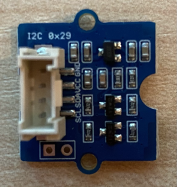

<!--
CO_OP_TRANSLATOR_METADATA:
{
  "original_hash": "288aebb0c59f7be1d2719b8f9660a313",
  "translation_date": "2025-08-27T20:03:31+00:00",
  "source_file": "4-manufacturing/lessons/4-trigger-fruit-detector/wio-terminal-proximity.md",
  "language_code": "el"
}
-->
# Ανίχνευση εγγύτητας - Wio Terminal

Σε αυτό το μέρος του μαθήματος, θα προσθέσετε έναν αισθητήρα εγγύτητας στο Wio Terminal σας και θα διαβάσετε την απόσταση από αυτόν.

## Υλικό

Το Wio Terminal χρειάζεται έναν αισθητήρα εγγύτητας.

Ο αισθητήρας που θα χρησιμοποιήσετε είναι ένας [Grove Time of Flight distance sensor](https://www.seeedstudio.com/Grove-Time-of-Flight-Distance-Sensor-VL53L0X.html). Αυτός ο αισθητήρας χρησιμοποιεί ένα λέιζερ για να ανιχνεύσει την απόσταση. Ο αισθητήρας έχει εμβέλεια από 10mm έως 2000mm (1cm - 2m) και αναφέρει τιμές σε αυτό το εύρος με αρκετή ακρίβεια, ενώ οι αποστάσεις πάνω από 1000mm αναφέρονται ως 8109mm.

Ο ανιχνευτής λέιζερ βρίσκεται στο πίσω μέρος του αισθητήρα, στην αντίθετη πλευρά από την υποδοχή Grove.

Αυτός είναι ένας συνδυασμένος ψηφιακός και I²C αισθητήρας.

### Σύνδεση του αισθητήρα Time of Flight

Ο αισθητήρας Grove Time of Flight μπορεί να συνδεθεί στο Wio Terminal.

#### Εργασία - σύνδεση του αισθητήρα Time of Flight

Συνδέστε τον αισθητήρα Time of Flight.



1. Εισάγετε το ένα άκρο ενός καλωδίου Grove στην υποδοχή του αισθητήρα Time of Flight. Θα μπει μόνο με έναν συγκεκριμένο τρόπο.

1. Με το Wio Terminal αποσυνδεδεμένο από τον υπολογιστή σας ή άλλη πηγή τροφοδοσίας, συνδέστε το άλλο άκρο του καλωδίου Grove στην αριστερή υποδοχή Grove του Wio Terminal, όπως κοιτάτε την οθόνη. Αυτή είναι η υποδοχή που βρίσκεται πιο κοντά στο κουμπί τροφοδοσίας. Αυτή είναι μια συνδυασμένη ψηφιακή και I²C υποδοχή.


1. Τώρα μπορείτε να συνδέσετε το Wio Terminal στον υπολογιστή σας.

## Προγραμματισμός του αισθητήρα Time of Flight

Το Wio Terminal μπορεί τώρα να προγραμματιστεί για να χρησιμοποιήσει τον συνδεδεμένο αισθητήρα Time of Flight.

### Εργασία - προγραμματισμός του αισθητήρα Time of Flight

1. Δημιουργήστε ένα ολοκαίνουργιο έργο Wio Terminal χρησιμοποιώντας το PlatformIO. Ονομάστε αυτό το έργο `distance-sensor`. Προσθέστε κώδικα στη συνάρτηση `setup` για να ρυθμίσετε τη σειριακή θύρα.

1. Προσθέστε μια εξάρτηση βιβλιοθήκης για τη βιβλιοθήκη Seeed Grove Time of Flight Distance Sensor στο αρχείο `platformio.ini` του έργου:

    ```ini
    lib_deps =
        seeed-studio/Grove Ranging sensor - VL53L0X @ ^1.1.1
    ```

1. Στο `main.cpp`, προσθέστε το παρακάτω κάτω από τις υπάρχουσες οδηγίες `include` για να δηλώσετε μια παρουσία της κλάσης `Seeed_vl53l0x` για την αλληλεπίδραση με τον αισθητήρα Time of Flight:

    ```cpp
    #include "Seeed_vl53l0x.h"
    
    Seeed_vl53l0x VL53L0X;
    ```

1. Προσθέστε το παρακάτω στο κάτω μέρος της συνάρτησης `setup` για να αρχικοποιήσετε τον αισθητήρα:

    ```cpp
    VL53L0X.VL53L0X_common_init();
    VL53L0X.VL53L0X_high_accuracy_ranging_init();
    ```

1. Στη συνάρτηση `loop`, διαβάστε μια τιμή από τον αισθητήρα:

    ```cpp
    VL53L0X_RangingMeasurementData_t RangingMeasurementData;
    memset(&RangingMeasurementData, 0, sizeof(VL53L0X_RangingMeasurementData_t));

    VL53L0X.PerformSingleRangingMeasurement(&RangingMeasurementData);
    ```

    Αυτός ο κώδικας αρχικοποιεί μια δομή δεδομένων για να διαβάσει δεδομένα, και στη συνέχεια την περνά στη μέθοδο `PerformSingleRangingMeasurement`, όπου θα γεμίσει με τη μέτρηση της απόστασης.

1. Κάτω από αυτό, γράψτε τη μέτρηση της απόστασης και στη συνέχεια καθυστερήστε για 1 δευτερόλεπτο:

    ```cpp
    Serial.print("Distance = ");
    Serial.print(RangingMeasurementData.RangeMilliMeter);
    Serial.println(" mm");

    delay(1000);
    ```

1. Δημιουργήστε, ανεβάστε και εκτελέστε αυτόν τον κώδικα. Θα μπορείτε να δείτε μετρήσεις απόστασης με το σειριακό monitor. Τοποθετήστε αντικείμενα κοντά στον αισθητήρα και θα δείτε τη μέτρηση της απόστασης:

    ```output
    Distance = 29 mm
    Distance = 28 mm
    Distance = 30 mm
    Distance = 151 mm
    ```

    Ο ανιχνευτής βρίσκεται στο πίσω μέρος του αισθητήρα, οπότε βεβαιωθείτε ότι χρησιμοποιείτε τη σωστή πλευρά όταν μετράτε την απόσταση.

    

> 💁 Μπορείτε να βρείτε αυτόν τον κώδικα στον φάκελο [code-proximity/wio-terminal](../../../../../4-manufacturing/lessons/4-trigger-fruit-detector/code-proximity/wio-terminal).

😀 Το πρόγραμμα του αισθητήρα εγγύτητας σας ήταν επιτυχές!

---

**Αποποίηση ευθύνης**:  
Αυτό το έγγραφο έχει μεταφραστεί χρησιμοποιώντας την υπηρεσία αυτόματης μετάφρασης [Co-op Translator](https://github.com/Azure/co-op-translator). Παρόλο που καταβάλλουμε προσπάθειες για ακρίβεια, παρακαλούμε να έχετε υπόψη ότι οι αυτοματοποιημένες μεταφράσεις ενδέχεται να περιέχουν λάθη ή ανακρίβειες. Το πρωτότυπο έγγραφο στη μητρική του γλώσσα θα πρέπει να θεωρείται η αυθεντική πηγή. Για κρίσιμες πληροφορίες, συνιστάται επαγγελματική ανθρώπινη μετάφραση. Δεν φέρουμε ευθύνη για τυχόν παρεξηγήσεις ή εσφαλμένες ερμηνείες που προκύπτουν από τη χρήση αυτής της μετάφρασης.