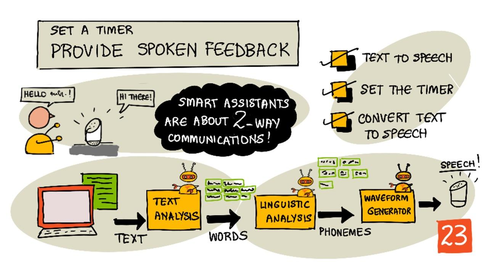

<!--
CO_OP_TRANSLATOR_METADATA:
{
  "original_hash": "b73fe10ec6b580fba2affb6f6e0a5c4d",
  "translation_date": "2025-08-27T20:24:18+00:00",
  "source_file": "6-consumer/lessons/3-spoken-feedback/README.md",
  "language_code": "el"
}
-->
# Ρύθμιση χρονομέτρου και παροχή φωνητικής ανατροφοδότησης



> Σκιαγραφία από τη [Nitya Narasimhan](https://github.com/nitya). Κάντε κλικ στην εικόνα για μεγαλύτερη έκδοση.

## Κουίζ πριν το μάθημα

[Κουίζ πριν το μάθημα](https://black-meadow-040d15503.1.azurestaticapps.net/quiz/45)

## Εισαγωγή

Οι έξυπνοι βοηθοί δεν είναι συσκευές επικοινωνίας μονής κατεύθυνσης. Τους μιλάτε και σας απαντούν:

"Alexa, ρύθμισε ένα χρονόμετρο 3 λεπτών"

"Εντάξει, το χρονόμετρό σας έχει ρυθμιστεί για 3 λεπτά"

Στα δύο προηγούμενα μαθήματα μάθατε πώς να μετατρέπετε την ομιλία σε κείμενο και στη συνέχεια να εξάγετε ένα αίτημα ρύθμισης χρονομέτρου από αυτό το κείμενο. Σε αυτό το μάθημα θα μάθετε πώς να ρυθμίζετε το χρονόμετρο στη συσκευή IoT, απαντώντας στον χρήστη με φωνητικά λόγια που επιβεβαιώνουν το χρονόμετρό του και ειδοποιώντας τον όταν ολοκληρωθεί το χρονόμετρο.

Σε αυτό το μάθημα θα καλύψουμε:

* [Μετατροπή κειμένου σε ομιλία](../../../../../6-consumer/lessons/3-spoken-feedback)
* [Ρύθμιση του χρονομέτρου](../../../../../6-consumer/lessons/3-spoken-feedback)
* [Μετατροπή κειμένου σε ομιλία](../../../../../6-consumer/lessons/3-spoken-feedback)

## Μετατροπή κειμένου σε ομιλία

Η μετατροπή κειμένου σε ομιλία, όπως υποδηλώνει το όνομα, είναι η διαδικασία μετατροπής κειμένου σε ήχο που περιέχει το κείμενο ως ομιλούμενες λέξεις. Η βασική αρχή είναι να διασπάσουμε τις λέξεις του κειμένου στους συστατικούς τους ήχους (γνωστούς ως φωνήματα) και να συνθέσουμε ήχο για αυτούς τους ήχους, είτε χρησιμοποιώντας προηχογραφημένο ήχο είτε ήχο που παράγεται από μοντέλα τεχνητής νοημοσύνης.


Τα συστήματα μετατροπής κειμένου σε ομιλία συνήθως έχουν 3 στάδια:

* Ανάλυση κειμένου
* Γλωσσολογική ανάλυση
* Δημιουργία κυματομορφής

### Ανάλυση κειμένου

Η ανάλυση κειμένου περιλαμβάνει τη λήψη του παρεχόμενου κειμένου και τη μετατροπή του σε λέξεις που μπορούν να χρησιμοποιηθούν για τη δημιουργία ομιλίας. Για παράδειγμα, αν μετατρέψετε το "Hello world", δεν απαιτείται ανάλυση κειμένου, οι δύο λέξεις μπορούν να μετατραπούν σε ομιλία. Αν έχετε "1234" όμως, τότε αυτό μπορεί να χρειαστεί να μετατραπεί είτε στις λέξεις "Χίλια διακόσια τριάντα τέσσερα" είτε "Ένα, δύο, τρία, τέσσερα" ανάλογα με το πλαίσιο. Για το "Έχω 1234 μήλα", θα ήταν "Χίλια διακόσια τριάντα τέσσερα", αλλά για το "Το παιδί μέτρησε 1234" τότε θα ήταν "Ένα, δύο, τρία, τέσσερα".

Οι λέξεις που δημιουργούνται διαφέρουν όχι μόνο για τη γλώσσα, αλλά και για την τοπική διάλεκτο αυτής της γλώσσας. Για παράδειγμα, στα Αμερικανικά Αγγλικά, το 120 θα ήταν "One hundred twenty", ενώ στα Βρετανικά Αγγλικά θα ήταν "One hundred and twenty", με τη χρήση του "and" μετά τις εκατοντάδες.

✅ Μερικά άλλα παραδείγματα που απαιτούν ανάλυση κειμένου περιλαμβάνουν το "in" ως συντομογραφία της ίντσας και το "st" ως συντομογραφία του αγίου ή της οδού. Μπορείτε να σκεφτείτε άλλα παραδείγματα στη γλώσσα σας για λέξεις που είναι ασαφείς χωρίς πλαίσιο;

Μόλις οι λέξεις οριστούν, αποστέλλονται για γλωσσολογική ανάλυση.

### Γλωσσολογική ανάλυση

Η γλωσσολογική ανάλυση διασπά τις λέξεις σε φωνήματα. Τα φωνήματα βασίζονται όχι μόνο στα γράμματα που χρησιμοποιούνται, αλλά και στα άλλα γράμματα της λέξης. Για παράδειγμα, στα Αγγλικά ο ήχος 'a' στο 'car' και στο 'care' είναι διαφορετικός. Η Αγγλική γλώσσα έχει 44 διαφορετικά φωνήματα για τα 26 γράμματα του αλφαβήτου, μερικά από τα οποία μοιράζονται διαφορετικά γράμματα, όπως το ίδιο φώνημα που χρησιμοποιείται στην αρχή του 'circle' και του 'serpent'.

✅ Κάντε μια έρευνα: Ποια είναι τα φωνήματα για τη γλώσσα σας;

Μόλις οι λέξεις μετατραπούν σε φωνήματα, αυτά τα φωνήματα χρειάζονται επιπλέον δεδομένα για να υποστηρίξουν την προσωδία, προσαρμόζοντας τον τόνο ή τη διάρκεια ανάλογα με το πλαίσιο. Ένα παράδειγμα είναι ότι στα Αγγλικά η αύξηση του τόνου μπορεί να χρησιμοποιηθεί για να μετατρέψει μια πρόταση σε ερώτηση, με αυξημένο τόνο για την τελευταία λέξη να υποδηλώνει ερώτηση.

Για παράδειγμα - η πρόταση "You have an apple" είναι μια δήλωση που λέει ότι έχετε ένα μήλο. Αν ο τόνος αυξηθεί στο τέλος, αυξάνοντας για τη λέξη apple, γίνεται η ερώτηση "You have an apple?", ρωτώντας αν έχετε ένα μήλο. Η γλωσσολογική ανάλυση πρέπει να χρησιμοποιήσει το ερωτηματικό στο τέλος για να αποφασίσει να αυξήσει τον τόνο.

Μόλις τα φωνήματα δημιουργηθούν, μπορούν να αποσταλούν για δημιουργία κυματομορφής για την παραγωγή του ηχητικού αποτελέσματος.

### Δημιουργία κυματομορφής

Τα πρώτα ηλεκτρονικά συστήματα μετατροπής κειμένου σε ομιλία χρησιμοποιούσαν μεμονωμένες ηχογραφήσεις για κάθε φώνημα, οδηγώντας σε πολύ μονότονες, ρομποτικές φωνές. Η γλωσσολογική ανάλυση παρήγαγε φωνήματα, αυτά φορτώνονταν από μια βάση δεδομένων ήχων και συνδυάζονταν για να δημιουργήσουν τον ήχο.

✅ Κάντε μια έρευνα: Βρείτε ηχογραφήσεις από πρώιμα συστήματα σύνθεσης ομιλίας. Συγκρίνετέ τα με τη σύγχρονη σύνθεση ομιλίας, όπως αυτή που χρησιμοποιείται στους έξυπνους βοηθούς.

Οι πιο σύγχρονες μέθοδοι δημιουργίας κυματομορφών χρησιμοποιούν μοντέλα μηχανικής μάθησης που βασίζονται σε βαθιά μάθηση (πολύ μεγάλα νευρωνικά δίκτυα που λειτουργούν με παρόμοιο τρόπο με τους νευρώνες του εγκεφάλου) για να παράγουν πιο φυσικές φωνές που μπορεί να είναι αδιαχώριστες από τις ανθρώπινες.

> 💁 Μερικά από αυτά τα μοντέλα μηχανικής μάθησης μπορούν να επανεκπαιδευτούν χρησιμοποιώντας μεταφορά μάθησης για να ακούγονται σαν πραγματικοί άνθρωποι. Αυτό σημαίνει ότι η χρήση της φωνής ως σύστημα ασφαλείας, κάτι που οι τράπεζες προσπαθούν όλο και περισσότερο να κάνουν, δεν είναι πλέον καλή ιδέα, καθώς οποιοσδήποτε με μια ηχογράφηση λίγων λεπτών της φωνής σας μπορεί να σας μιμηθεί.

Αυτά τα μεγάλα μοντέλα μηχανικής μάθησης εκπαιδεύονται για να συνδυάζουν και τα τρία βήματα σε ολοκληρωμένα συστήματα σύνθεσης ομιλίας.

## Ρύθμιση του χρονομέτρου

Για να ρυθμίσετε το χρονόμετρο, η συσκευή IoT σας πρέπει να καλέσει το REST endpoint που δημιουργήσατε χρησιμοποιώντας serverless κώδικα και στη συνέχεια να χρησιμοποιήσει τον προκύπτοντα αριθμό δευτερολέπτων για να ρυθμίσει ένα χρονόμετρο.

### Εργασία - καλέστε τη serverless λειτουργία για να λάβετε τον χρόνο του χρονομέτρου

Ακολουθήστε τον σχετικό οδηγό για να καλέσετε το REST endpoint από τη συσκευή IoT σας και να ρυθμίσετε ένα χρονόμετρο για τον απαιτούμενο χρόνο:

* [Arduino - Wio Terminal](wio-terminal-set-timer.md)
* [Υπολογιστής μονού πίνακα - Raspberry Pi/Εικονική συσκευή IoT](single-board-computer-set-timer.md)

## Μετατροπή κειμένου σε ομιλία

Η ίδια υπηρεσία ομιλίας που χρησιμοποιήσατε για να μετατρέψετε την ομιλία σε κείμενο μπορεί να χρησιμοποιηθεί για να μετατρέψετε το κείμενο πίσω σε ομιλία, και αυτό μπορεί να αναπαραχθεί μέσω ενός ηχείου στη συσκευή IoT σας. Το κείμενο που θα μετατραπεί αποστέλλεται στην υπηρεσία ομιλίας, μαζί με τον τύπο του απαιτούμενου ήχου (όπως ο ρυθμός δειγματοληψίας), και επιστρέφονται δυαδικά δεδομένα που περιέχουν τον ήχο.

Όταν στέλνετε αυτό το αίτημα, το στέλνετε χρησιμοποιώντας *Speech Synthesis Markup Language* (SSML), μια γλώσσα σήμανσης βασισμένη σε XML για εφαρμογές σύνθεσης ομιλίας. Αυτή ορίζει όχι μόνο το κείμενο που θα μετατραπεί, αλλά και τη γλώσσα του κειμένου, τη φωνή που θα χρησιμοποιηθεί, και μπορεί ακόμη και να χρησιμοποιηθεί για να ορίσει την ταχύτητα, την ένταση και τον τόνο για μερικές ή όλες τις λέξεις του κειμένου.

Για παράδειγμα, αυτό το SSML ορίζει ένα αίτημα για τη μετατροπή του κειμένου "Your 3 minute 5 second time has been set" σε ομιλία χρησιμοποιώντας μια Βρετανική Αγγλική φωνή που ονομάζεται `en-GB-MiaNeural`

```xml
<speak version='1.0' xml:lang='en-GB'>
    <voice xml:lang='en-GB' name='en-GB-MiaNeural'>
        Your 3 minute 5 second time has been set
    </voice>
</speak>
```

> 💁 Τα περισσότερα συστήματα μετατροπής κειμένου σε ομιλία έχουν πολλαπλές φωνές για διαφορετικές γλώσσες, με σχετικές προφορές όπως μια Βρετανική Αγγλική φωνή με Αγγλική προφορά και μια Νεοζηλανδική Αγγλική φωνή με Νεοζηλανδική προφορά.

### Εργασία - μετατροπή κειμένου σε ομιλία

Ακολουθήστε τον σχετικό οδηγό για να μετατρέψετε κείμενο σε ομιλία χρησιμοποιώντας τη συσκευή IoT σας:

* [Arduino - Wio Terminal](wio-terminal-text-to-speech.md)
* [Υπολογιστής μονού πίνακα - Raspberry Pi](pi-text-to-speech.md)
* [Υπολογιστής μονού πίνακα - Εικονική συσκευή](virtual-device-text-to-speech.md)

---

## 🚀 Πρόκληση

Το SSML έχει τρόπους να αλλάζει τον τρόπο που προφέρονται οι λέξεις, όπως η προσθήκη έμφασης σε ορισμένες λέξεις, η προσθήκη παύσεων ή η αλλαγή του τόνου. Δοκιμάστε μερικά από αυτά, στέλνοντας διαφορετικό SSML από τη συσκευή IoT σας και συγκρίνοντας το αποτέλεσμα. Μπορείτε να διαβάσετε περισσότερα για το SSML, συμπεριλαμβανομένου του πώς να αλλάξετε τον τρόπο που προφέρονται οι λέξεις, στις [προδιαγραφές Speech Synthesis Markup Language (SSML) Version 1.1 από το World Wide Web Consortium](https://www.w3.org/TR/speech-synthesis11/).

## Κουίζ μετά το μάθημα

[Κουίζ μετά το μάθημα](https://black-meadow-040d15503.1.azurestaticapps.net/quiz/46)

## Ανασκόπηση & Αυτομελέτη

* Διαβάστε περισσότερα για τη σύνθεση ομιλίας στη [σελίδα για τη σύνθεση ομιλίας στη Wikipedia](https://wikipedia.org/wiki/Speech_synthesis)
* Διαβάστε περισσότερα για τους τρόπους που οι εγκληματίες χρησιμοποιούν τη σύνθεση ομιλίας για να κλέψουν στο [άρθρο του BBC για τις ψεύτικες φωνές](https://www.bbc.com/news/technology-48908736)
* Μάθετε περισσότερα για τους κινδύνους για τους ηθοποιούς φωνής από τις συνθετικές εκδοχές των φωνών τους στο [άρθρο του Vice για τη μήνυση στο TikTok](https://www.vice.com/en/article/z3xqwj/this-tiktok-lawsuit-is-highlighting-how-ai-is-screwing-over-voice-actors)

## Εργασία

[Ακύρωση του χρονομέτρου](assignment.md)

---

**Αποποίηση ευθύνης**:  
Αυτό το έγγραφο έχει μεταφραστεί χρησιμοποιώντας την υπηρεσία αυτόματης μετάφρασης [Co-op Translator](https://github.com/Azure/co-op-translator). Παρόλο που καταβάλλουμε προσπάθειες για ακρίβεια, παρακαλούμε να έχετε υπόψη ότι οι αυτοματοποιημένες μεταφράσεις ενδέχεται να περιέχουν λάθη ή ανακρίβειες. Το πρωτότυπο έγγραφο στη μητρική του γλώσσα θα πρέπει να θεωρείται η αυθεντική πηγή. Για κρίσιμες πληροφορίες, συνιστάται επαγγελματική ανθρώπινη μετάφραση. Δεν φέρουμε ευθύνη για τυχόν παρεξηγήσεις ή εσφαλμένες ερμηνείες που προκύπτουν από τη χρήση αυτής της μετάφρασης.