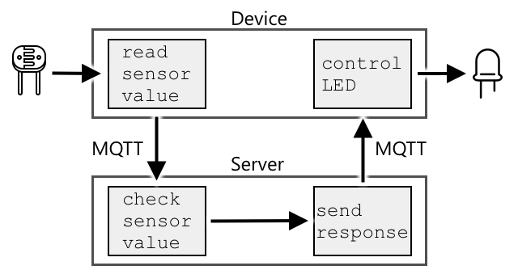

<!--
CO_OP_TRANSLATOR_METADATA:
{
  "original_hash": "71b5040e0b3472f1c0949c9b55f224c0",
  "translation_date": "2025-08-28T19:53:18+00:00",
  "source_file": "1-getting-started/lessons/4-connect-internet/README.md",
  "language_code": "en"
}
-->
# Connect your device to the Internet


> Sketchnote by [Nitya Narasimhan](https://github.com/nitya). Click the image for a larger version.

This lesson was part of the [Hello IoT series](https://youtube.com/playlist?list=PLmsFUfdnGr3xRts0TIwyaHyQuHaNQcb6-) from the [Microsoft Reactor](https://developer.microsoft.com/reactor/?WT.mc_id=academic-17441-jabenn). It was delivered in two videos: a 1-hour lesson and a 1-hour office hour session that explored the lesson in more detail and answered questions.

[](https://youtu.be/O4dd172mZhs)

[](https://youtu.be/j-cVCzRDE2Q)

> 🎥 Click the images above to watch the videos

## Pre-lecture quiz

[Pre-lecture quiz](https://black-meadow-040d15503.1.azurestaticapps.net/quiz/7)

## Introduction

The **I** in IoT stands for **Internet**—the cloud connectivity and services that enable many of the features of IoT devices, from collecting data from sensors to sending commands to actuators. IoT devices typically connect to a cloud IoT service using a standard communication protocol. This service integrates with the rest of your IoT application, including AI services for data-driven decisions and web apps for control or reporting.

> 🎓 Data collected from sensors and sent to the cloud is called telemetry.

IoT devices can also receive messages from the cloud. These messages often contain commands—instructions to perform actions either internally (like rebooting or updating firmware) or externally (like turning on a light via an actuator).

This lesson introduces some of the communication protocols IoT devices use to connect to the cloud and the types of data they send or receive. You'll also get hands-on experience by adding internet control to your nightlight, moving the LED control logic to 'server' code running locally.

In this lesson, we'll cover:

* [Communication protocols](../../../../../1-getting-started/lessons/4-connect-internet)
* [Message Queueing Telemetry Transport (MQTT)](../../../../../1-getting-started/lessons/4-connect-internet)
* [Telemetry](../../../../../1-getting-started/lessons/4-connect-internet)
* [Commands](../../../../../1-getting-started/lessons/4-connect-internet)

## Communication protocols

IoT devices use various communication protocols to connect to the Internet. The most popular ones are based on publish/subscribe messaging via a broker. IoT devices connect to the broker to publish telemetry and subscribe to commands. Cloud services also connect to the broker, subscribing to telemetry messages and publishing commands to specific devices or groups of devices.


MQTT is the most widely used communication protocol for IoT devices and is the focus of this lesson. Other protocols include AMQP and HTTP/HTTPS.

## Message Queueing Telemetry Transport (MQTT)

[MQTT](http://mqtt.org) is a lightweight, open standard messaging protocol designed for device-to-device communication. It was originally developed in 1999 to monitor oil pipelines and was released as an open standard by IBM 15 years later.

MQTT uses a single broker and multiple clients. Clients connect to the broker, which routes messages to the appropriate recipients. Messages are routed using named topics rather than being sent directly to specific clients. A client can publish to a topic, and any clients subscribed to that topic will receive the message.


✅ Do some research. If you have a large number of IoT devices, how can you ensure your MQTT broker can handle all the messages?

### Connect your IoT device to MQTT

The first step in adding internet control to your nightlight is connecting it to an MQTT broker.

#### Task

Connect your device to an MQTT broker.

In this part of the lesson, you'll connect your IoT nightlight to the internet for remote control. Later, your IoT device will send a telemetry message with the light level to a public MQTT broker. This message will be processed by server code you write, which will check the light level and send a command back to the device to turn the LED on or off.

A real-world use case for this setup could involve gathering data from multiple light sensors before deciding to turn on lights in a large area, like a stadium. This approach prevents lights from being activated if only one sensor is obstructed (e.g., by clouds or a bird) while others detect sufficient light.

✅ What other scenarios might require evaluating data from multiple sensors before sending commands?

To simplify this assignment, you'll use a public test server running [Eclipse Mosquitto](https://www.mosquitto.org), an open-source MQTT broker. This test broker is publicly available at [test.mosquitto.org](https://test.mosquitto.org) and doesn't require an account, making it ideal for testing MQTT clients and servers.

> 💁 This test broker is public and not secure. Anyone can listen to what you publish, so avoid using it for sensitive data.



Follow the relevant step below to connect your device to the MQTT broker:

* [Arduino - Wio Terminal](wio-terminal-mqtt.md)
* [Single-board computer - Raspberry Pi/Virtual IoT device](single-board-computer-mqtt.md)

### A deeper dive into MQTT

MQTT topics can have a hierarchy, and clients can subscribe to different levels using wildcards. For example, you can send temperature data to `/telemetry/temperature` and humidity data to `/telemetry/humidity`. In your cloud app, you can subscribe to `/telemetry/*` to receive both temperature and humidity messages.

Messages can be sent with a quality of service (QoS) level, which determines the delivery guarantee:

* At most once: The message is sent once without acknowledgment (fire and forget).
* At least once: The message is retried until acknowledged (acknowledged delivery).
* Exactly once: A two-level handshake ensures the message is received only once (assured delivery).

✅ What scenarios might require assured delivery over fire-and-forget messaging?

Despite its name, MQTT doesn't support message queues. If a client disconnects, it won't receive messages sent during the disconnection unless the QoS process was already in progress. However, messages with a retained flag are stored by the broker and sent to clients that later subscribe to the topic, ensuring they receive the latest message.

MQTT also includes a keep-alive feature to check if the connection remains active during long gaps between messages.

> 🦟 [Mosquitto from the Eclipse Foundation](https://mosquitto.org) offers a free MQTT broker you can run locally for experimentation, as well as a public broker at [test.mosquitto.org](https://test.mosquitto.org).

MQTT connections can be public and open or secured with encryption, usernames, passwords, or certificates.

> 💁 MQTT uses TCP/IP, the same underlying protocol as HTTP, but on a different port. It can also operate over WebSockets for communication with web apps or in environments where standard MQTT connections are blocked.

## Telemetry

The term telemetry comes from Greek roots meaning "remote measurement." It refers to collecting data from sensors and sending it to the cloud.

> 💁 One of the earliest telemetry systems was invented in France in 1874. It transmitted real-time weather and snow depth data from Mont Blanc to Paris using physical wires, as wireless technology didn't exist yet.

Revisiting the smart thermostat example from Lesson 1:


The thermostat collects temperature data using sensors. It likely has a built-in sensor and connects to external sensors via a wireless protocol like [Bluetooth Low Energy](https://wikipedia.org/wiki/Bluetooth_Low_Energy) (BLE).

Example telemetry data:

| Name | Value | Description |
| ---- | ----- | ----------- |
| `thermostat_temperature` | 18°C | Temperature from the thermostat's built-in sensor |
| `livingroom_temperature` | 19°C | Temperature from a remote sensor labeled `livingroom` |
| `bedroom_temperature` | 21°C | Temperature from a remote sensor labeled `bedroom` |

The cloud service uses this telemetry to decide what commands to send to control the heating.

### Send telemetry from your IoT device

The next step in adding internet control to your nightlight is sending light level telemetry to the MQTT broker on a telemetry topic.

#### Task - send telemetry from your IoT device

Send light level telemetry to the MQTT broker.

Data is sent in JSON format (JavaScript Object Notation), a standard for encoding data as key-value pairs.

✅ If you're unfamiliar with JSON, check out the [JSON.org documentation](https://www.json.org/).

Follow the relevant step below to send telemetry from your device to the MQTT broker:

* [Arduino - Wio Terminal](wio-terminal-telemetry.md)
* [Single-board computer - Raspberry Pi/Virtual IoT device](single-board-computer-telemetry.md)

### Receive telemetry from the MQTT broker

Sending telemetry is pointless without something to process it. The light level telemetry needs a listener to process the data. This 'server' code is similar to what you'd deploy to a cloud service in a larger IoT application. For now, you'll run it locally on your computer (or on your Raspberry Pi if coding directly there). The server code is a Python app that listens for telemetry messages over MQTT and later sends command messages to control the LED.

✅ Do some research: What happens to MQTT messages if there is no listener?

#### Install Python and VS Code

If Python and VS Code aren't installed on your computer, you'll need to install them to write the server code. If you're using a virtual IoT device or working directly on a Raspberry Pi, you can skip this step since these tools should already be installed.

##### Task - install Python and VS Code

Install Python and VS Code.

1. Install Python. Visit the [Python downloads page](https://www.python.org/downloads/) for instructions on installing the latest version.

2. Install Visual Studio Code (VS Code). This is the editor you'll use to write your virtual device code in Python. Refer to the [VS Code documentation](https://code.visualstudio.com?WT.mc_id=academic-17441-jabenn) for installation instructions.
> 💁 You are free to use any Python IDE or editor for these lessons if you have a preferred tool, but the lessons will provide instructions based on using VS Code.
1. Install the VS Code Pylance extension. This is an extension for VS Code that provides Python language support. Refer to the [Pylance extension documentation](https://marketplace.visualstudio.com/items?WT.mc_id=academic-17441-jabenn&itemName=ms-python.vscode-pylance) for instructions on installing this extension in VS Code.

#### Configure a Python virtual environment

One of Python's powerful features is the ability to install [pip packages](https://pypi.org)—these are code packages written by others and shared online. You can install a pip package on your computer with a single command and then use it in your code. In this case, you'll use pip to install a package for MQTT communication.

By default, when you install a package, it becomes available system-wide, which can lead to version conflicts. For example, one application might require a specific version of a package, but installing a newer version for another application could break the first one. To avoid this, you can use a [Python virtual environment](https://docs.python.org/3/library/venv.html). A virtual environment is essentially a copy of Python in a dedicated folder, and any pip packages you install are confined to that folder.

##### Task - Configure a Python virtual environment

Set up a Python virtual environment and install the MQTT pip packages.

1. From your terminal or command line, run the following commands to create and navigate to a new directory:

    ```sh
    mkdir nightlight-server
    cd nightlight-server
    ```

1. Next, create a virtual environment in the `.venv` folder by running:

    ```sh
    python3 -m venv .venv
    ```

    > 💁 Use `python3` explicitly to create the virtual environment, especially if Python 2 is also installed on your system. If Python 2 is present, the `python` command might default to Python 2 instead of Python 3.

1. Activate the virtual environment:

    * On Windows:
        * If you're using the Command Prompt or Command Prompt via Windows Terminal, run:

            ```cmd
            .venv\Scripts\activate.bat
            ```

        * If you're using PowerShell, run:

            ```powershell
            .\.venv\Scripts\Activate.ps1
            ```

    * On macOS or Linux, run:

        ```cmd
        source ./.venv/bin/activate
        ```

    > 💁 These commands should be executed from the same directory where you created the virtual environment. You don't need to navigate into the `.venv` folder. Always run the activation command and any subsequent commands to install packages or execute code from the directory where the virtual environment was created.

1. Once the virtual environment is activated, the default `python` command will use the Python version associated with the virtual environment. Check the version by running:

    ```sh
    python --version
    ```

    The output will look something like this:

    ```output
    (.venv) ➜  nightlight-server python --version
    Python 3.9.1
    ```

    > 💁 Your Python version might differ. As long as it's version 3.6 or higher, you're good to go. If not, delete the folder, install a newer Python version, and try again.

1. Install the pip package for [Paho-MQTT](https://pypi.org/project/paho-mqtt/), a popular MQTT library, by running:

    ```sh
    pip install paho-mqtt
    ```

    This package will only be installed in the virtual environment and won't be available outside of it.

#### Write the server code

Now you can write the server code in Python.

##### Task - Write the server code

Write the server code.

1. From your terminal or command line, create a Python file named `app.py` inside the virtual environment:

    * On Windows, run:

        ```cmd
        type nul > app.py
        ```

    * On macOS or Linux, run:

        ```cmd
        touch app.py
        ```

1. Open the current folder in VS Code:

    ```sh
    code .
    ```

1. When VS Code launches, it will activate the Python virtual environment. This will be indicated in the bottom status bar:

    

1. If the VS Code Terminal is already open when VS Code starts, the virtual environment might not be activated in it. To fix this, kill the terminal using the **Kill the active terminal instance** button:

    

1. Open a new VS Code Terminal by selecting *Terminal -> New Terminal* or pressing `` CTRL+` ``. The new terminal will load the virtual environment, and the activation command will appear in the terminal. The virtual environment's name (`.venv`) will also be displayed in the prompt:

    ```output
    ➜  nightlight-server source .venv/bin/activate
    (.venv) ➜  nightlight 
    ```

1. Open the `app.py` file in the VS Code explorer and add the following code:

    ```python
    import json
    import time
    
    import paho.mqtt.client as mqtt
    
    id = '<ID>'
    
    client_telemetry_topic = id + '/telemetry'
    client_name = id + 'nightlight_server'
    
    mqtt_client = mqtt.Client(client_name)
    mqtt_client.connect('test.mosquitto.org')
    
    mqtt_client.loop_start()
    
    def handle_telemetry(client, userdata, message):
        payload = json.loads(message.payload.decode())
        print("Message received:", payload)
    
    mqtt_client.subscribe(client_telemetry_topic)
    mqtt_client.on_message = handle_telemetry
    
    while True:
        time.sleep(2)
    ```

    Replace `<ID>` on line 6 with the unique ID you used when creating your device code.

    ⚠️ This **must** match the ID used on your device; otherwise, the server code won't subscribe to or publish to the correct topic.

    This code creates an MQTT client with a unique name and connects to the *test.mosquitto.org* broker. It then starts a background thread to process messages on subscribed topics.

    The client subscribes to the telemetry topic and defines a function to handle incoming messages. When a telemetry message is received, the `handle_telemetry` function is called, printing the message to the console.

    Finally, an infinite loop keeps the application running. The MQTT client listens for messages in the background as long as the main application is running.

1. Run the Python app from the VS Code terminal:

    ```sh
    python app.py
    ```

    The app will start listening for messages from the IoT device.

1. Ensure your device is running and sending telemetry messages. Adjust the light levels detected by your physical or virtual device. Received messages will be printed in the terminal.

    ```output
    (.venv) ➜  nightlight-server python app.py
    Message received: {'light': 0}
    Message received: {'light': 400}
    ```

    The `app.py` file in the nightlight virtual environment must be running for the `app.py` file in the nightlight-server virtual environment to receive the messages.

> 💁 You can find this code in the [code-server/server](../../../../../1-getting-started/lessons/4-connect-internet/code-server/server) folder.

### How often should telemetry be sent?

A key consideration with telemetry is how frequently to measure and send data. The answer depends on the use case. Measuring frequently allows for faster responses to changes but consumes more power, bandwidth, and cloud resources. You need to strike a balance.

For a thermostat, measuring every few minutes is likely sufficient since temperatures don't change rapidly. Measuring once a day might be too infrequent, while measuring every second would generate excessive, redundant data, consuming bandwidth and power unnecessarily.

For critical machinery in a factory, measuring multiple times per second might be necessary to detect issues early and prevent costly failures. In such cases, it's better to over-collect data than to miss important telemetry.

> 💁 In scenarios like this, you might consider using an edge device to process telemetry locally and reduce reliance on the Internet.

### Loss of connectivity

Internet connections can be unreliable. What should an IoT device do during an outage—discard the data or store it until connectivity is restored? Again, it depends.

For a thermostat, old data can likely be discarded once a new measurement is taken. The current temperature is what matters for controlling the heating.

For machinery, you might want to retain all data, especially if it's used for trend analysis or anomaly detection. Machine learning models often analyze historical data to predict maintenance needs. In such cases, the IoT device should store telemetry locally and send it once connectivity is restored.

IoT devices should also be designed to function during outages. For example, a smart thermostat should still control heating based on local conditions even if it can't send telemetry to the cloud.

[](https://twitter.com/internetofshit/status/1315736960082808832)

For MQTT, handling connectivity loss requires the device and server code to ensure message delivery. For example, messages could require acknowledgments, and any unacknowledged messages could be queued for later delivery.

## Commands

Commands are messages sent from the cloud to a device, instructing it to perform an action. This could involve controlling an actuator or issuing a device-specific instruction, such as rebooting or collecting additional telemetry.


For example, a thermostat might receive a command from the cloud to turn the heating on based on telemetry data from sensors.

### Send commands to the MQTT broker

The next step for the Internet-controlled nightlight is to have the server send commands to the IoT device to control the light based on detected light levels.

1. Open the server code in VS Code.

1. Add the following line after the declaration of the `client_telemetry_topic` to define the topic for sending commands:

    ```python
    server_command_topic = id + '/commands'
    ```

1. Add the following code to the end of the `handle_telemetry` function:

    ```python
    command = { 'led_on' : payload['light'] < 300 }
    print("Sending message:", command)
    
    client.publish(server_command_topic, json.dumps(command))
    ```

    This sends a JSON message to the command topic with the `led_on` value set to true or false, depending on whether the light level is below 300. If the light level is below 300, true is sent to turn the LED on.

1. Run the code as before.

1. Adjust the light levels detected by your physical or virtual device. Messages received and commands sent will be displayed in the terminal:

    ```output
    (.venv) ➜  nightlight-server python app.py
    Message received: {'light': 0}
    Sending message: {'led_on': True}
    Message received: {'light': 400}
    Sending message: {'led_on': False}
    ```

> 💁 Telemetry and commands are sent on single topics. This means telemetry from multiple devices will appear on the same topic, and commands for multiple devices will appear on the same commands topic. To send a command to a specific device, you could use unique topics, such as `/commands/device1` or `/commands/device2`. This way, a device listens only to messages intended for it.

> 💁 You can find this code in the [code-commands/server](../../../../../1-getting-started/lessons/4-connect-internet/code-commands/server) folder.

### Handle commands on the IoT device

Now that the server is sending commands, you can add code to the IoT device to handle them and control the LED.

Follow the relevant instructions below to listen for commands from the MQTT broker:

* [Arduino - Wio Terminal](wio-terminal-commands.md)
* [Single-board computer - Raspberry Pi/Virtual IoT device](single-board-computer-commands.md)

Once the code is implemented and running, experiment with changing light levels. Observe the server and device outputs, and watch the LED respond to changes.

### Loss of connectivity

What should a cloud service do if it needs to send a command to an offline IoT device? Again, it depends.

If the latest command overrides earlier ones, the earlier commands can likely be ignored. For example, if a command to turn the heating on is followed by one to turn it off, the first command can be discarded.

If commands must be processed in sequence (e.g., move a robot arm up, then close a grabber), they should be queued and sent in order once connectivity is restored.

✅ How could the device or server code ensure commands are always sent and processed in order over MQTT if needed?

---

## 🚀 Challenge

In the last three lessons, the challenge was to list as many IoT devices as you can find in your home, school, or workplace. Determine whether they are built around microcontrollers, single-board computers, or a mix of both, and consider the sensors and actuators they use.
For these devices, consider what messages they might be sending or receiving. What telemetry data do they transmit? What messages or commands might they receive? Do you think they are secure?

## Post-lecture quiz

[Post-lecture quiz](https://black-meadow-040d15503.1.azurestaticapps.net/quiz/8)

## Review & Self Study

Learn more about MQTT on the [MQTT Wikipedia page](https://wikipedia.org/wiki/MQTT).

Try setting up an MQTT broker yourself using [Mosquitto](https://www.mosquitto.org) and connect to it from your IoT device and server code.

> 💁 Tip - By default, Mosquitto doesn't permit anonymous connections (connections without a username and password) and doesn't allow connections from outside the computer it's running on.  
> You can resolve this by using a [`mosquitto.conf` config file](https://www.mosquitto.org/man/mosquitto-conf-5.html) with the following:  
>
> ```sh
> listener 1883 0.0.0.0
> allow_anonymous true
> ```

## Assignment

[Compare and contrast MQTT with other communication protocols](assignment.md)

---

**Disclaimer**:  
This document has been translated using the AI translation service [Co-op Translator](https://github.com/Azure/co-op-translator). While we aim for accuracy, please note that automated translations may include errors or inaccuracies. The original document in its native language should be regarded as the authoritative source. For critical information, professional human translation is advised. We are not responsible for any misunderstandings or misinterpretations resulting from the use of this translation.