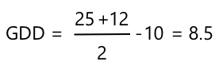

<!--
CO_OP_TRANSLATOR_METADATA:
{
  "original_hash": "d105b44deae539165855c976dcdeca99",
  "translation_date": "2025-08-28T20:36:16+00:00",
  "source_file": "2-farm/lessons/1-predict-plant-growth/README.md",
  "language_code": "en"
}
-->
    This code extracts the temperature from the telemetry message and gets the current date and time. It then appends a new row to the CSV file with the date and temperature.

1. Run the server code and ensure it is receiving telemetry from your IoT device. Check the CSV file to confirm that temperature data is being saved correctly.

✅ Why do you think saving data in a CSV file might be useful for farmers?

### Task - calculate GDD from the temperature data

Once the temperature data is saved in a CSV file, you can calculate the GDD for each day and total it up to determine the cumulative GDD for a crop.

1. Write a Python script to read the CSV file and calculate the GDD for each day. Use the simplified GDD formula:

    ```output
    date,temperature
    2021-04-19T17:21:36-07:00,25
    2021-04-19T17:31:36-07:00,24
    2021-04-19T17:41:36-07:00,25
    ```

    Replace `T_max`, `T_min`, and `T_base` with the appropriate values for your crop.

1. Add code to sum up the daily GDD values to calculate the total GDD so far.

1. Print the daily GDD values and the total GDD to the console.

✅ Why is it important to calculate cumulative GDD for crops?

### Task - notify when crops are close to maturity

Once you have the total GDD, you can add logic to notify the farmer when the crop is close to maturity. For example:

1. Set a threshold for the GDD required for maturity based on the crop you are monitoring.

2. Add a condition to check if the total GDD is within a certain range of the maturity threshold (e.g., 90% of the required GDD).

3. If the condition is met, print a message or send a notification to alert the farmer.

✅ How could automated notifications improve farming efficiency?

## Post-lecture quiz

[Post-lecture quiz](https://black-meadow-040d15503.1.azurestaticapps.net/quiz/10)

## Review & Self-study

In this lesson, you learned how temperature affects plant growth and how to calculate growing degree days (GDD) using temperature data. You also explored how IoT devices can help farmers monitor and predict crop maturity.

✅ Research other environmental factors that can be monitored using IoT devices to improve farming practices.

## Assignment

1. Use your IoT device to measure temperature data for a few days.
2. Save the data to a CSV file and calculate the GDD for a crop of your choice.
3. Determine how close the crop is to maturity based on the GDD calculation.
4. Write a short report summarizing your findings and how this data could help a farmer.
This code opens the CSV file and appends a new row at the end. The row includes the current date and time formatted in a human-readable way, followed by the temperature received from the IoT device. The data is stored in [ISO 8601 format](https://wikipedia.org/wiki/ISO_8601) with the timezone, but without microseconds.

1. Run this code as before, ensuring your IoT device is sending data. A CSV file named `temperature.csv` will be created in the same folder. If you open it, you will see date/times and temperature measurements:

    ```output
    date,temperature
    2021-04-19T17:21:36-07:00,25
    2021-04-19T17:31:36-07:00,24
    2021-04-19T17:41:36-07:00,25
    ```

1. Let this code run for a while to collect data. Ideally, you should run it for an entire day to gather enough data for GDD calculations.

    
> 💁 If you are using a Virtual IoT Device, check the random checkbox and set a range to avoid getting the same temperature every time the temperature value is returned.
     

    > 💁 If you want to run this for an entire day, make sure the computer running your server code doesn’t go to sleep. You can do this by adjusting your power settings or using something like [this keep system active Python script](https://github.com/jaqsparow/keep-system-active).
    
> 💁 You can find this code in the [code-server/temperature-sensor-server](../../../../../2-farm/lessons/1-predict-plant-growth/code-server/temperature-sensor-server) folder.

### Task - calculate GDD using the stored data

Once the server has captured temperature data, you can calculate the GDD for a plant.

The steps to do this manually are:

1. Determine the base temperature for the plant. For example, the base temperature for strawberries is 10°C.

1. From the `temperature.csv` file, find the highest and lowest temperatures for the day.

1. Use the GDD formula provided earlier to calculate the GDD.

For example, if the highest temperature for the day is 25°C and the lowest is 12°C:



* 25 + 12 = 37
* 37 / 2 = 18.5
* 18.5 - 10 = 8.5

Thus, the strawberries have received **8.5** GDD. Since strawberries need about 250 GDD to bear fruit, there’s still some time to go.

---

## 🚀 Challenge

Plants need more than just heat to grow. What other factors are necessary?

For these factors, investigate whether there are sensors that can measure them. Are there actuators to control these levels? How would you design one or more IoT devices to optimize plant growth?

## Post-lecture quiz

[Post-lecture quiz](https://black-meadow-040d15503.1.azurestaticapps.net/quiz/10)

## Review & Self Study

* Learn more about digital agriculture on the [Digital Agriculture Wikipedia page](https://wikipedia.org/wiki/Digital_agriculture). Also, read about precision agriculture on the [Precision Agriculture Wikipedia page](https://wikipedia.org/wiki/Precision_agriculture).
* The full growing degree days calculation is more complex than the simplified version provided here. Learn about the more detailed equation and how to handle temperatures below the baseline on the [Growing Degree Day Wikipedia page](https://wikipedia.org/wiki/Growing_degree-day).
* Food scarcity may become a problem in the future if we continue using the same farming methods. Explore advanced farming techniques in this [Hi-Tech Farms of Future video on YouTube](https://www.youtube.com/watch?v=KIEOuKD9KX8).

## Assignment

[Visualize GDD data using a Jupyter Notebook](assignment.md)

---

**Disclaimer**:  
This document has been translated using the AI translation service [Co-op Translator](https://github.com/Azure/co-op-translator). While we aim for accuracy, please note that automated translations may include errors or inaccuracies. The original document in its native language should be regarded as the authoritative source. For critical information, professional human translation is advised. We are not responsible for any misunderstandings or misinterpretations resulting from the use of this translation.