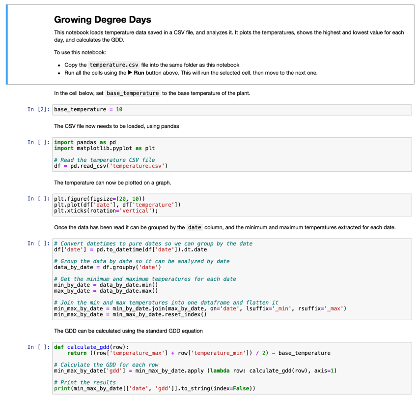

<!--
CO_OP_TRANSLATOR_METADATA:
{
  "original_hash": "1e21b012c6685f8bf73e0e76cdca3347",
  "translation_date": "2025-08-28T20:38:58+00:00",
  "source_file": "2-farm/lessons/1-predict-plant-growth/assignment.md",
  "language_code": "en"
}
-->
# Visualize GDD Data Using a Jupyter Notebook

## Instructions

In this lesson, you collected GDD data using an IoT sensor. To obtain reliable GDD data, you need to gather data over several days. Tools like [Jupyter Notebooks](https://jupyter.org) can help you analyze the data by visualizing temperature trends and calculating GDD.

Start by collecting data for a few days. Ensure that your server code runs continuously while your IoT device is active. You can achieve this by adjusting your power management settings or using a script like [this keep system active Python script](https://github.com/jaqsparow/keep-system-active).

Once you have the temperature data, you can use the Jupyter Notebook provided in this repository to visualize it and calculate GDD. Jupyter notebooks combine code and instructions in sections called *cells*, often written in Python. You can follow the instructions and execute each block of code step by step. Additionally, you can modify the code. For instance, in this notebook, you can adjust the base temperature used to calculate the GDD for your specific plant.

1. Create a folder named `gdd-calculation`.

1. Download the [gdd.ipynb](./code-notebook/gdd.ipynb) file and place it in the `gdd-calculation` folder.

1. Copy the `temperature.csv` file generated by the MQTT server.

1. Set up a new Python virtual environment in the `gdd-calculation` folder.

1. Install the necessary pip packages for Jupyter notebooks, along with libraries for managing and plotting the data:

    ```sh
    pip install --upgrade pip
    pip install pandas
    pip install matplotlib
    pip install jupyter
    ```

1. Launch the notebook in Jupyter:

    ```sh
    jupyter notebook gdd.ipynb
    ```

    Jupyter will start and open the notebook in your browser. Follow the instructions in the notebook to visualize the recorded temperatures and calculate the growing degree days.

    

## Rubric

| Criteria          | Exemplary                                   | Adequate                          | Needs Improvement         |
| ------------------ | ------------------------------------------- | ---------------------------------- | ------------------------- |
| Capture data       | Capture at least 2 complete days of data    | Capture at least 1 complete day   | Capture some data         |
| Calculate GDD      | Successfully run the notebook and calculate GDD | Successfully run the notebook     | Not able to run the notebook |

---

**Disclaimer**:  
This document has been translated using the AI translation service [Co-op Translator](https://github.com/Azure/co-op-translator). While we aim for accuracy, please note that automated translations may include errors or inaccuracies. The original document in its native language should be regarded as the authoritative source. For critical information, professional human translation is advised. We are not responsible for any misunderstandings or misinterpretations resulting from the use of this translation.