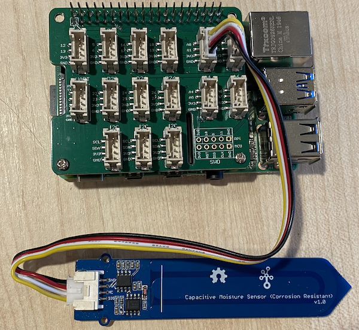

<!--
CO_OP_TRANSLATOR_METADATA:
{
  "original_hash": "9d4d00a47d5d0f3e6ce42c0d1020064a",
  "translation_date": "2025-08-28T20:18:37+00:00",
  "source_file": "2-farm/lessons/2-detect-soil-moisture/pi-soil-moisture.md",
  "language_code": "en"
}
-->
# Measure soil moisture - Raspberry Pi

In this part of the lesson, you will add a capacitive soil moisture sensor to your Raspberry Pi and read values from it.

## Hardware

The Raspberry Pi requires a capacitive soil moisture sensor.

The sensor you'll use is a [Capacitive Soil Moisture Sensor](https://www.seeedstudio.com/Grove-Capacitive-Moisture-Sensor-Corrosion-Resistant.html), which measures soil moisture by detecting the capacitance of the soil—a property that changes as the soil's moisture level changes. As the soil moisture increases, the voltage decreases.

This is an analog sensor, so it uses an analog pin and the 10-bit ADC in the Grove Base Hat on the Pi to convert the voltage into a digital signal ranging from 1 to 1,023. This signal is then sent over I2C via the GPIO pins on the Pi.

### Connect the soil moisture sensor

The Grove soil moisture sensor can be connected to the Raspberry Pi.

#### Task - connect the soil moisture sensor

Connect the soil moisture sensor.


1. Insert one end of a Grove cable into the socket on the soil moisture sensor. It will only fit one way.

1. With the Raspberry Pi powered off, connect the other end of the Grove cable to the analog socket marked **A0** on the Grove Base Hat attached to the Pi. This socket is the second from the right in the row of sockets next to the GPIO pins.



1. Insert the soil moisture sensor into the soil. The sensor has a 'highest position line'—a white line across the sensor. Insert the sensor up to, but not past, this line.


## Program the soil moisture sensor

The Raspberry Pi can now be programmed to use the attached soil moisture sensor.

### Task - program the soil moisture sensor

Program the device.

1. Power up the Pi and wait for it to boot.

1. Launch VS Code, either directly on the Pi or by connecting via the Remote SSH extension.

    > ⚠️ You can refer to [the instructions for setting up and launching VS Code in nightlight - lesson 1 if needed](../../../1-getting-started/lessons/1-introduction-to-iot/pi.md).

1. From the terminal, create a new folder in the `pi` user's home directory called `soil-moisture-sensor`. Create a file in this folder called `app.py`.

1. Open this folder in VS Code.

1. Add the following code to the `app.py` file to import some required libraries:

    ```python
    import time
    from grove.adc import ADC
    ```

    The `import time` statement imports the `time` module, which will be used later in this assignment.

    The `from grove.adc import ADC` statement imports the `ADC` from the Grove Python libraries. This library contains code to interact with the analog-to-digital converter on the Pi Base Hat and read voltages from analog sensors.

1. Add the following code below this to create an instance of the `ADC` class:

    ```python
    adc = ADC()
    ```

1. Add an infinite loop that reads from this ADC on the A0 pin and writes the result to the console. This loop will then sleep for 10 seconds between reads.

    ```python
    while True:
        soil_moisture = adc.read(0)
        print("Soil moisture:", soil_moisture)

        time.sleep(10)
    ```

1. Run the Python app. You will see the soil moisture measurements displayed in the console. Add some water to the soil or remove the sensor from the soil and observe the value change.

    ```output
    pi@raspberrypi:~/soil-moisture-sensor $ python3 app.py 
    Soil moisture: 615
    Soil moisture: 612
    Soil moisture: 498
    Soil moisture: 493
    Soil moisture: 490
    Soil Moisture: 388
    ```

    In the example output above, you can see the voltage drop as water is added.

> 💁 You can find this code in the [code/pi](../../../../../2-farm/lessons/2-detect-soil-moisture/code/pi) folder.

😀 Your soil moisture sensor program was a success!

---

**Disclaimer**:  
This document has been translated using the AI translation service [Co-op Translator](https://github.com/Azure/co-op-translator). While we aim for accuracy, please note that automated translations may include errors or inaccuracies. The original document in its native language should be regarded as the authoritative source. For critical information, professional human translation is advised. We are not responsible for any misunderstandings or misinterpretations resulting from the use of this translation.