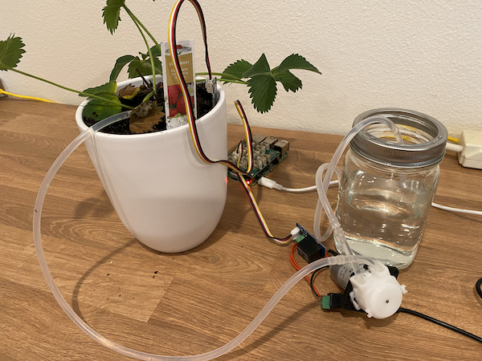

<!--
CO_OP_TRANSLATOR_METADATA:
{
  "original_hash": "f7bb24ba53fb627ddb38a8b24a05e594",
  "translation_date": "2025-08-28T20:41:08+00:00",
  "source_file": "2-farm/lessons/3-automated-plant-watering/README.md",
  "language_code": "en"
}
-->
# Automated plant watering


> Sketchnote by [Nitya Narasimhan](https://github.com/nitya). Click the image for a larger version.

This lesson was taught as part of the [IoT for Beginners Project 2 - Digital Agriculture series](https://youtube.com/playlist?list=PLmsFUfdnGr3yCutmcVg6eAUEfsGiFXgcx) from the [Microsoft Reactor](https://developer.microsoft.com/reactor/?WT.mc_id=academic-17441-jabenn).

[](https://youtu.be/g9FfZwv9R58)

## Pre-lecture quiz

[Pre-lecture quiz](https://black-meadow-040d15503.1.azurestaticapps.net/quiz/13)

## Introduction

In the previous lesson, you learned how to monitor soil moisture. In this lesson, you'll learn how to build the core components of an automated watering system that responds to soil moisture levels. You'll also explore the concept of timing—how sensors may take time to respond to changes and how actuators may take time to affect the properties being measured by sensors.

In this lesson, we’ll cover:

* [Control high power devices from a low power IoT device](../../../../../2-farm/lessons/3-automated-plant-watering)
* [Control a relay](../../../../../2-farm/lessons/3-automated-plant-watering)
* [Control your plant over MQTT](../../../../../2-farm/lessons/3-automated-plant-watering)
* [Sensor and actuator timing](../../../../../2-farm/lessons/3-automated-plant-watering)
* [Add timing to your plant control server](../../../../../2-farm/lessons/3-automated-plant-watering)

## Control high power devices from a low power IoT device

IoT devices operate at low voltage. While this is sufficient for sensors and low-power actuators like LEDs, it’s not enough to control larger hardware, such as a water pump for irrigation. Even small pumps for houseplants draw too much current for an IoT development kit and could damage the board.

> 🎓 Current, measured in Amps (A), is the amount of electricity flowing through a circuit. Voltage provides the push, while current measures how much is pushed. You can learn more about current on the [electric current page on Wikipedia](https://wikipedia.org/wiki/Electric_current).

The solution is to connect the pump to an external power supply and use an actuator to switch the pump on, similar to flipping a light switch. It takes only a small amount of energy (from your body) to flip the switch, which then connects the light to mains electricity running at 110V/240V.


> 🎓 [Mains electricity](https://wikipedia.org/wiki/Mains_electricity) refers to the electricity supplied to homes and businesses through national infrastructure in many parts of the world.

✅ IoT devices typically provide 3.3V or 5V at less than 1 amp (1A) of current. In comparison, mains electricity is usually 230V (120V in North America and 100V in Japan) and can power devices that draw up to 30A.

There are various actuators that can achieve this, including mechanical devices that mimic a finger flipping a switch. The most common actuator for this purpose is a relay.

### Relays

A relay is an electromechanical switch that converts an electrical signal into a mechanical movement to turn a switch on or off. At the core of a relay is an electromagnet.

> 🎓 [Electromagnets](https://wikipedia.org/wiki/Electromagnet) are magnets created by passing electricity through a coil of wire. When electricity flows through the coil, it becomes magnetized. When the electricity stops, the coil loses its magnetism.


In a relay, a control circuit powers the electromagnet. When the electromagnet is activated, it pulls a lever that moves a switch, closing a pair of contacts and completing an output circuit.


When the control circuit is off, the electromagnet deactivates, releasing the lever and opening the contacts, which turns off the output circuit. Relays are digital actuators—a high signal turns the relay on, and a low signal turns it off.

The output circuit can power additional hardware, such as an irrigation system. The IoT device can turn the relay on, completing the output circuit to power the irrigation system and water the plants. The IoT device can then turn the relay off, cutting power to the irrigation system and stopping the water flow.


In the video above, a relay is activated. An LED on the relay lights up to indicate it is on (some relay boards include LEDs for this purpose), and power is sent to the pump, which waters the plant.

> 💁 Relays can also switch between two output circuits instead of simply turning one on or off. As the lever moves, it switches from completing one output circuit to completing another, often sharing a common power or ground connection.

✅ Research task: There are different types of relays, with variations such as whether the control circuit turns the relay on or off when power is applied, or whether multiple output circuits are supported. Look into these different types.

When the lever moves, you can often hear a distinct clicking sound as it makes contact with the electromagnet.

> 💁 A relay can be wired so that activating it breaks its own power connection, turning it off. This then reactivates the relay, creating a rapid on-off cycle that produces a buzzing sound. This principle was used in early electric doorbells.

### Relay power

The electromagnet in a relay requires very little power to activate and can be controlled using the 3.3V or 5V output from an IoT development kit. The output circuit, however, can handle much higher power levels, depending on the relay, including mains voltage or even higher levels for industrial applications. This allows an IoT development kit to control irrigation systems ranging from small pumps for individual plants to large-scale systems for commercial farms.


The image above shows a Grove relay. The control circuit connects to an IoT device and uses 3.3V or 5V to turn the relay on or off. The output circuit has two terminals, which can be used for power or ground. This relay can handle up to 250V at 10A, making it suitable for a variety of mains-powered devices. Higher-capacity relays are also available.


In the image above, a pump is powered through a relay. A red wire connects the +5V terminal of a USB power supply to one terminal of the relay’s output circuit, and another red wire connects the other terminal to the pump. A black wire connects the pump to the ground on the USB power supply. When the relay is activated, it completes the circuit, sending 5V to the pump and turning it on.

## Control a relay

You can control a relay using your IoT development kit.

### Task - control a relay

Follow the appropriate guide to control a relay with your IoT device:

* [Arduino - Wio Terminal](wio-terminal-relay.md)
* [Single-board computer - Raspberry Pi](pi-relay.md)
* [Single-board computer - Virtual device](virtual-device-relay.md)

## Control your plant over MQTT

Currently, your relay is controlled directly by the IoT device based on a single soil moisture reading. In a commercial irrigation system, control logic is centralized, allowing decisions to be made using data from multiple sensors and enabling configuration changes in one place. You can simulate this by controlling the relay over MQTT.

### Task - control the relay over MQTT

1. Add the necessary MQTT libraries/pip packages and code to your `soil-moisture-sensor` project to connect to MQTT. Name the client ID as `soilmoisturesensor_client` prefixed by your ID.

    > ⚠️ Refer to [the instructions for connecting to MQTT in project 1, lesson 4 if needed](../../../1-getting-started/lessons/4-connect-internet/README.md#connect-your-iot-device-to-mqtt).

2. Add the required device code to send telemetry with the soil moisture settings. Name the telemetry property `soil_moisture`.

    > ⚠️ Refer to [the instructions for sending telemetry to MQTT in project 1, lesson 4 if needed](../../../1-getting-started/lessons/4-connect-internet/README.md#send-telemetry-from-your-iot-device).

3. Create local server code to subscribe to telemetry and send a command to control the relay in a folder called `soil-moisture-sensor-server`. Name the command property `relay_on`, and set the client ID as `soilmoisturesensor_server` prefixed by your ID. Use the same structure as the server code from project 1, lesson 4, as you’ll expand on this code later.

    > ⚠️ Refer to [the instructions for sending telemetry to MQTT](../../../1-getting-started/lessons/4-connect-internet/README.md#write-the-server-code) and [sending commands over MQTT](../../../1-getting-started/lessons/4-connect-internet/README.md#send-commands-to-the-mqtt-broker) in project 1, lesson 4 if needed.

4. Add the necessary device code to control the relay based on received commands, using the `relay_on` property from the message. Send `true` for `relay_on` if the `soil_moisture` is greater than 450; otherwise, send `false`, following the same logic as before.

    > ⚠️ Refer to [the instructions for responding to commands from MQTT in project 1, lesson 4 if needed](../../../1-getting-started/lessons/4-connect-internet/README.md#handle-commands-on-the-iot-device).

> 💁 You can find this code in the [code-mqtt](../../../../../2-farm/lessons/3-automated-plant-watering/code-mqtt) folder.

Ensure the code is running on your device and local server, and test it by adjusting soil moisture levels, either by modifying the values sent by the virtual sensor or by physically altering the soil moisture (e.g., adding water or removing the sensor).

## Sensor and actuator timing

In lesson 3, you built a nightlight—an LED that turns on as soon as a low light level is detected by a sensor. The light sensor responded instantly to changes, and the device reacted quickly, limited only by the delay in the `loop` function or `while True:` loop. However, as an IoT developer, you can’t always rely on such fast feedback loops.

### Timing for soil moisture

If you completed the previous lesson using a physical soil moisture sensor, you may have noticed that the soil moisture reading took a few seconds to drop after watering the plant. This delay isn’t due to the sensor being slow but rather the time it takes for water to soak through the soil.
💁 If you watered too close to the sensor, you might have noticed the reading drop quickly and then rise again. This happens because the water near the sensor spreads through the rest of the soil, temporarily lowering the moisture level detected by the sensor.


In the diagram above, a soil moisture reading shows 658. The plant is watered, but this reading doesn't change immediately because the water hasn't yet reached the sensor. Watering might even finish before the water reaches the sensor, and the value only drops once the water has soaked through the soil.

If you were writing code to control an irrigation system using a relay based on soil moisture levels, you would need to account for this delay and implement smarter timing in your IoT device.

✅ Take a moment to think about how you might handle this.

### Control sensor and actuator timing

Imagine you’ve been tasked with building an irrigation system for a farm. Based on the soil type, the ideal soil moisture level for the plants has been determined to correspond to an analog voltage reading of 400-450.

You could program the device similarly to a nightlight: whenever the sensor reads above 450, turn on a relay to activate a pump. However, the problem is that water takes time to travel from the pump, through the soil, to the sensor. The sensor will stop the water when it detects a level of 450, but the water level will continue to drop as the pumped water keeps soaking through the soil. This results in wasted water and increases the risk of root damage.

✅ Remember: too much water can be just as harmful to plants as too little, and it wastes a valuable resource.

A better solution is to understand that there’s a delay between the actuator turning on and the sensor detecting a change. This means the sensor should wait for a while before measuring the value again, and the actuator should turn off for a while before the next sensor measurement is taken.

How long should the relay stay on each time? It’s better to err on the side of caution and only turn the relay on for a short period, then wait for the water to soak through, and re-check the moisture levels. After all, you can always turn it on again to add more water, but you can’t remove water from the soil.

> 💁 This kind of timing control is highly specific to the IoT device you’re building, the property you’re measuring, and the sensors and actuators being used.



For example, I have a strawberry plant with a soil moisture sensor and a pump controlled by a relay. I’ve observed that when I add water, it takes about 20 seconds for the soil moisture reading to stabilize. This means I need to turn the relay off and wait 20 seconds before checking the moisture levels. I’d rather have too little water than too much—I can always turn the pump on again, but I can’t remove water from the plant.


The best process for a watering cycle would look something like this:

* Turn on the pump for 5 seconds  
* Wait 20 seconds  
* Check the soil moisture  
* If the level is still above the required threshold, repeat the steps above  

Five seconds might be too long for the pump, especially if the moisture levels are only slightly above the required threshold. The best way to determine the timing is to experiment, then adjust based on sensor data, using a constant feedback loop. This can even lead to more granular timing, such as turning the pump on for 1 second for every 100 above the required soil moisture level, instead of a fixed 5 seconds.

✅ Do some research: Are there other timing considerations? Can the plant be watered anytime the soil moisture is too low, or are there specific times of day that are better or worse for watering?

> 💁 Weather predictions can also be factored into automated watering systems for outdoor plants. If rain is expected, watering can be delayed until after the rain. At that point, the soil might already be moist enough, making watering unnecessary and saving water.

## Add timing to your plant control server

The server code can be updated to include control over the timing of the watering cycle and waiting for soil moisture levels to stabilize. The server logic for controlling the relay timing is as follows:

1. Telemetry message received  
2. Check the soil moisture level  
3. If the level is acceptable, do nothing. If the reading is too high (indicating the soil moisture is too low):  
    1. Send a command to turn the relay on  
    2. Wait for 5 seconds  
    3. Send a command to turn the relay off  
    4. Wait for 20 seconds for the soil moisture levels to stabilize  

The watering cycle, from receiving the telemetry message to being ready to process soil moisture levels again, takes about 25 seconds. Since soil moisture levels are sent every 10 seconds, there’s an overlap where a message is received while the server is waiting for soil moisture levels to stabilize, potentially starting another watering cycle.

There are two ways to address this:

* Change the IoT device code to send telemetry every minute, ensuring the watering cycle is completed before the next message is sent.  
* Unsubscribe from telemetry during the watering cycle.  

The first option isn’t always ideal for large farms. For example, the farmer might want to capture soil moisture levels during watering for later analysis, such as understanding water flow in different areas of the farm to guide more targeted watering. The second option is better—the code ignores telemetry when it can’t use it, but the telemetry is still available for other services that might subscribe to it.

> 💁 IoT data isn’t sent from just one device to one service. Instead, many devices can send data to a broker, and many services can listen to the data from the broker. For example, one service could store soil moisture data in a database for later analysis, while another service uses the same telemetry to control an irrigation system.

### Task - add timing to your plant control server

Update your server code to run the relay for 5 seconds, then wait 20 seconds.

1. Open the `soil-moisture-sensor-server` folder in VS Code if it isn’t already open. Make sure the virtual environment is activated.  

1. Open the `app.py` file.  

1. Add the following code to the `app.py` file below the existing imports:  

    ```python
    import threading
    ```  

    This statement imports `threading` from Python libraries. Threading allows Python to execute other code while waiting.  

1. Add the following code before the `handle_telemetry` function that handles telemetry messages received by the server code:  

    ```python
    water_time = 5
    wait_time = 20
    ```  

    This defines how long to run the relay (`water_time`) and how long to wait afterward to check the soil moisture (`wait_time`).  

1. Below this code, add the following:  

    ```python
    def send_relay_command(client, state):
        command = { 'relay_on' : state }
        print("Sending message:", command)
        client.publish(server_command_topic, json.dumps(command))
    ```  

    This code defines a function called `send_relay_command` that sends a command over MQTT to control the relay. The telemetry is created as a dictionary, then converted to a JSON string. The value passed into `state` determines whether the relay should be on or off.  

1. After the `send_relay_code` function, add the following code:  

    ```python
    def control_relay(client):
        print("Unsubscribing from telemetry")
        mqtt_client.unsubscribe(client_telemetry_topic)
    
        send_relay_command(client, True)
        time.sleep(water_time)
        send_relay_command(client, False)
    
        time.sleep(wait_time)
    
        print("Subscribing to telemetry")
        mqtt_client.subscribe(client_telemetry_topic)
    ```  

    This defines a function to control the relay based on the required timing. It starts by unsubscribing from telemetry so that soil moisture messages aren’t processed during watering. Next, it sends a command to turn the relay on. It then waits for the `water_time` before sending a command to turn the relay off. Finally, it waits for the soil moisture levels to stabilize for `wait_time` seconds and then re-subscribes to telemetry.  

1. Change the `handle_telemetry` function to the following:  

    ```python
    def handle_telemetry(client, userdata, message):
        payload = json.loads(message.payload.decode())
        print("Message received:", payload)
    
        if payload['soil_moisture'] > 450:
            threading.Thread(target=control_relay, args=(client,)).start()
    ```  

    This code checks the soil moisture level. If it’s greater than 450, the soil needs watering, so it calls the `control_relay` function. This function runs on a separate thread in the background.  

1. Make sure your IoT device is running, then run this code. Change the soil moisture levels and observe what happens to the relay—it should turn on for 5 seconds, then remain off for at least 20 seconds, only turning on again if the soil moisture levels are insufficient.  

    ```output
    (.venv) ➜  soil-moisture-sensor-server ✗ python app.py
    Message received: {'soil_moisture': 457}
    Unsubscribing from telemetry
    Sending message: {'relay_on': True}
    Sending message: {'relay_on': False}
    Subscribing to telemetry
    Message received: {'soil_moisture': 302}
    ```  

    A good way to test this in a simulated irrigation system is to use dry soil, then manually pour water while the relay is on, stopping when the relay turns off.  

> 💁 You can find this code in the [code-timing](../../../../../2-farm/lessons/3-automated-plant-watering/code-timing) folder.  

> 💁 If you want to use a pump to build a real irrigation system, you can use a [6V water pump](https://www.seeedstudio.com/6V-Mini-Water-Pump-p-1945.html) with a [USB terminal power supply](https://www.adafruit.com/product/3628). Ensure the power to or from the pump is connected via the relay.  

---

## 🚀 Challenge

Can you think of other IoT or electrical devices with a similar issue, where it takes time for the actuator’s effect to reach the sensor? You probably have a few at home or school.  

* What properties do they measure?  
* How long does it take for the property to change after the actuator is used?  
* Is it acceptable for the property to exceed the required value?  
* How can it be brought back to the required value if needed?  

## Post-lecture quiz

[Post-lecture quiz](https://black-meadow-040d15503.1.azurestaticapps.net/quiz/14)  

## Review & Self Study

* Learn more about relays, including their historical use in telephone exchanges, on the [relay Wikipedia page](https://wikipedia.org/wiki/Relay).  

## Assignment

[Build a more efficient watering cycle](assignment.md)  

---

**Disclaimer**:  
This document has been translated using the AI translation service [Co-op Translator](https://github.com/Azure/co-op-translator). While we aim for accuracy, please note that automated translations may include errors or inaccuracies. The original document in its native language should be regarded as the authoritative source. For critical information, professional human translation is advised. We are not responsible for any misunderstandings or misinterpretations resulting from the use of this translation.