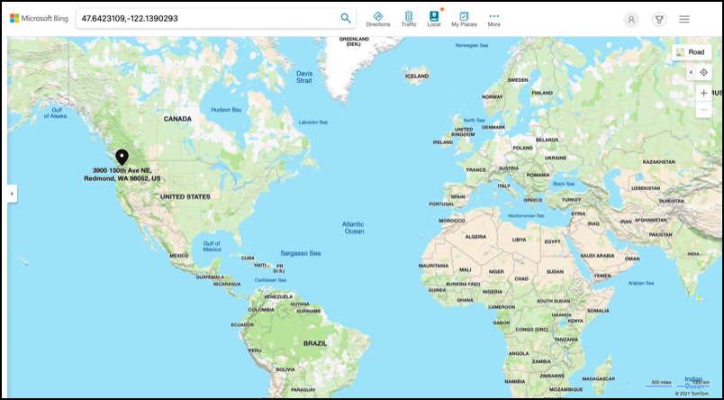

<!--
CO_OP_TRANSLATOR_METADATA:
{
  "original_hash": "52ed2bd997d08040f79a1a6ef2bac958",
  "translation_date": "2025-08-28T19:34:55+00:00",
  "source_file": "3-transport/lessons/1-location-tracking/README.md",
  "language_code": "en"
}
-->
# Location tracking

> Sketchnote by [Nitya Narasimhan](https://github.com/nitya). Click the image for a larger version.

## Pre-lecture quiz

[Pre-lecture quiz](https://black-meadow-040d15503.1.azurestaticapps.net/quiz/21)

## Introduction

The process of delivering food from a farmer to a consumer typically involves loading boxes of produce onto trucks, ships, airplanes, or other transport vehicles and delivering them to a destination—either directly to a customer or to a central hub or warehouse for further processing. This entire journey, from farm to consumer, is part of what’s known as the *supply chain*. The video below from Arizona State University's W. P. Carey School of Business explains the concept of the supply chain and how it is managed in greater detail.

> 🎥 Click the image above to watch a video

Integrating IoT devices into the supply chain can significantly enhance its efficiency, enabling better tracking of items, improved transport planning, faster response to issues, and optimized goods handling.

When managing a fleet of vehicles like trucks, it’s useful to know the location of each vehicle at any given time. Vehicles equipped with GPS sensors can send their location to IoT systems, allowing owners to track their position, review their travel routes, and estimate their arrival times. Since most vehicles operate outside WiFi coverage, they rely on cellular networks to transmit this data. In some cases, GPS sensors are part of more advanced IoT devices, such as electronic logbooks, which monitor how long a truck has been in transit to ensure drivers comply with local regulations on working hours.

In this lesson, you’ll learn how to track a vehicle’s location using a Global Positioning System (GPS) sensor.

This lesson will cover:

* [Connected vehicles](../../../../../3-transport/lessons/1-location-tracking)
* [Geospatial coordinates](../../../../../3-transport/lessons/1-location-tracking)
* [Global Positioning Systems (GPS)](../../../../../3-transport/lessons/1-location-tracking)
* [Read GPS sensor data](../../../../../3-transport/lessons/1-location-tracking)
* [NMEA GPS data](../../../../../3-transport/lessons/1-location-tracking)
* [Decode GPS sensor data](../../../../../3-transport/lessons/1-location-tracking)

## Connected vehicles

IoT is revolutionizing the transportation of goods by enabling fleets of *connected vehicles*. These vehicles communicate with central IT systems, providing information about their location and other sensor data. Connected fleets offer numerous advantages:

* **Location tracking** - You can determine a vehicle’s location at any time, enabling you to:
  * Receive alerts when a vehicle is nearing its destination, allowing you to prepare for unloading.
  * Locate stolen vehicles.
  * Combine location and route data with traffic updates to reroute vehicles during their journey.
  * Comply with tax regulations. In some countries, vehicles are taxed based on mileage driven on public roads (e.g., [New Zealand's RUC](https://www.nzta.govt.nz/vehicles/licensing-rego/road-user-charges/)). Knowing when a vehicle is on public versus private roads simplifies tax calculations.
  * Direct maintenance crews to the exact location in case of a breakdown.

* **Driver telemetry** - Monitor driver behavior to ensure compliance with speed limits, safe cornering, efficient braking, and overall safe driving practices. Connected vehicles can also include cameras to record incidents, which can be linked to insurance policies, offering discounts for safe drivers.

* **Driver hours compliance** - Ensure drivers adhere to legal limits on driving hours by tracking engine on/off times.

These benefits can be combined—for instance, integrating driver hours compliance with location tracking to reroute drivers who cannot reach their destination within their allowed driving hours. Additional vehicle-specific telemetry, such as temperature data from refrigerated trucks, can also be used to reroute vehicles if their current path risks compromising temperature-sensitive goods.

> 🎓 Logistics refers to the process of moving goods from one location to another, such as transporting produce from a farm to a supermarket via one or more warehouses. For example, a farmer might pack boxes of tomatoes that are loaded onto a truck, delivered to a central warehouse, and then transferred to another truck carrying a mix of produce types for delivery to a supermarket.

The key technology for vehicle tracking is GPS—sensors that can determine their location anywhere on Earth. In this lesson, you’ll learn how to use a GPS sensor, starting with understanding how locations are defined on Earth.

## Geospatial coordinates

Geospatial coordinates are used to specify points on the Earth’s surface, similar to how coordinates are used to identify pixels on a computer screen or stitches in cross-stitch patterns. Each point is defined by a pair of coordinates. For example, the Microsoft Campus in Redmond, Washington, USA is located at 47.6423109, -122.1390293.

### Latitude and longitude

The Earth is a sphere—a three-dimensional circle. Points on its surface are defined by dividing it into 360 degrees, similar to the geometry of circles. Latitude measures degrees north to south, while longitude measures degrees east to west.

> 💁 The original reason for dividing circles into 360 degrees is unclear. The [degree (angle) page on Wikipedia](https://wikipedia.org/wiki/Degree_(angle)) explores some possible explanations.

Latitude is measured using lines that encircle the Earth parallel to the equator, dividing the Northern and Southern Hemispheres into 90° each. The equator is at 0°, the North Pole is at 90° (90° North), and the South Pole is at -90° (90° South).

Longitude measures degrees east and west. The 0° origin of longitude is called the *Prime Meridian*, established in 1884 as a line running from the North to the South Pole through the [British Royal Observatory in Greenwich, England](https://wikipedia.org/wiki/Royal_Observatory,_Greenwich).

> 🎓 A meridian is an imaginary line running from the North Pole to the South Pole, forming a semicircle.

Longitude is measured by determining the number of degrees around the equator from the Prime Meridian to the meridian passing through the point of interest. Longitude ranges from -180° (180° West) to 0° at the Prime Meridian, to 180° (180° East). The points 180° and -180° refer to the same location, known as the antimeridian or 180th meridian, which is opposite the Prime Meridian.

> 💁 The antimeridian is distinct from the International Date Line, which roughly follows the same path but is not a straight line and adjusts to accommodate geopolitical boundaries.

✅ Do some research: Find the latitude and longitude of your current location.

### Degrees, minutes, and seconds vs decimal degrees

Historically, latitude and longitude were measured using sexagesimal numbering (base-60), a system developed by the Ancient Babylonians who first recorded time and distance. You likely use sexagesimal daily without realizing it—dividing hours into 60 minutes and minutes into 60 seconds.

Latitude and longitude are traditionally expressed in degrees, minutes, and seconds, where one minute equals 1/60 of a degree, and one second equals 1/60 of a minute.

For example, at the equator:
* 1° of latitude equals **111.3 kilometers**
* 1 minute of latitude equals 111.3/60 = **1.855 kilometers**
* 1 second of latitude equals 1.855/60 = **0.031 kilometers**

Minutes are denoted by a single quote (`'`), and seconds by a double quote (`"`). For instance, 2 degrees, 17 minutes, and 43 seconds would be written as `2°17'43"`. Fractions of seconds are expressed as decimals, e.g., half a second is `0°0'0.5"`.

Computers, however, use decimal degrees for GPS data. For example, `2°17'43"` is expressed as `2.295277`. The degree symbol is often omitted.

Coordinates are always given as `latitude, longitude`. For example, the Microsoft Campus at `47.6423109,-122.117198` has:
* Latitude: `47.6423109` (47.6423109 degrees north of the equator)
* Longitude: `-122.1390293` (122.1390293 degrees west of the Prime Meridian).

## Global Positioning Systems (GPS)

GPS systems use multiple satellites orbiting the Earth to determine your location. You’ve likely used GPS without realizing it—whether finding your location on a mapping app, tracking your ride in a ride-hailing app, or using satellite navigation (sat-nav) in your car.

> 🎓 The satellites in 'satellite navigation' are GPS satellites!

GPS works by using satellites that transmit signals containing their position and an accurate timestamp. These signals travel via radio waves and are detected by an antenna in the GPS sensor. The sensor measures how long it took for the signal to arrive, calculates the distance to the satellite based on the constant speed of radio waves, and uses data from at least three satellites to pinpoint its location.

> 💁 GPS sensors require antennas to detect radio waves. Built-in antennas in vehicles are typically positioned for optimal signal reception, such as on the windshield or roof. For external GPS systems, like smartphones or IoT devices, ensure the antenna has a clear view of the sky, such as mounting it on the windshield.

Since GPS satellites orbit the Earth, location data includes altitude above sea level in addition to latitude and longitude.

Previously, GPS accuracy was limited to about 5 meters due to restrictions imposed by the US military. These restrictions were lifted in 2000, allowing accuracy up to 30 centimeters. However, achieving this level of precision may not always be possible due to signal interference.

✅ If you have a smartphone, open a mapping app and check how accurate your location is. It may take a moment for your phone to connect to multiple satellites for improved accuracy.
💁 The satellites are equipped with atomic clocks that are extremely precise, but they experience a drift of 38 microseconds (0.0000038 seconds) per day compared to atomic clocks on Earth. This occurs because time slows down as speed increases, as predicted by Einstein's theories of special and general relativity—the satellites move faster than the Earth's rotation. This drift has been used to confirm the predictions of special and general relativity and must be accounted for in the design of GPS systems. In essence, time moves slower on a GPS satellite.
GPS systems have been developed and implemented by several countries and political unions, including the US, Russia, Japan, India, the EU, and China. Modern GPS sensors can connect to most of these systems to achieve faster and more accurate positioning.

> 🎓 The groups of satellites in each system are called constellations.

## Read GPS sensor data

Most GPS sensors transmit GPS data via UART.

> ⚠️ UART was covered in [project 2, lesson 2](../../../2-farm/lessons/2-detect-soil-moisture/README.md#universal-asynchronous-receiver-transmitter-uart). Refer back to that lesson if needed.

You can use a GPS sensor on your IoT device to retrieve GPS data.

### Task - Connect a GPS sensor and read GPS data

Follow the relevant guide to read GPS data using your IoT device:

* [Arduino - Wio Terminal](wio-terminal-gps-sensor.md)
* [Single-board computer - Raspberry Pi](pi-gps-sensor.md)
* [Single-board computer - Virtual device](virtual-device-gps-sensor.md)

## NMEA GPS data

When you run your code, the output might look like random text. This is actually standard GPS data, and it has specific meanings.

GPS sensors output data using NMEA messages, which follow the NMEA 0183 standard. NMEA stands for the [National Marine Electronics Association](https://www.nmea.org), a US-based trade organization that sets standards for communication between marine electronics.

> 💁 This standard is proprietary and costs at least US$2,000, but enough information is publicly available that most of the standard has been reverse-engineered and can be used in open-source and other non-commercial code.

These messages are text-based. Each message consists of a *sentence* that starts with a `$` character, followed by 2 characters indicating the source of the message (e.g., GP for the US GPS system, GN for GLONASS, the Russian GPS system), and 3 characters indicating the type of message. The rest of the message contains fields separated by commas, ending with a newline character.

Some types of messages that can be received include:

| Type | Description |
| ---- | ----------- |
| GGA | GPS Fix Data, including the latitude, longitude, and altitude of the GPS sensor, along with the number of satellites used to calculate this fix. |
| ZDA | The current date and time, including the local time zone. |
| GSV | Details of the satellites in view—defined as the satellites the GPS sensor can detect signals from. |

> 💁 GPS data includes timestamps, so your IoT device can retrieve the time from a GPS sensor if needed, rather than relying on an NTP server or an internal real-time clock.

The GGA message provides the current location in the `(dd)dmm.mmmm` format, along with a single character indicating direction. In this format, `d` represents degrees, and `m` represents minutes, with seconds expressed as decimal fractions of minutes. For example, 2°17'43" would be represented as 217.716666667—2 degrees and 17.716666667 minutes.

The direction character can be `N` or `S` for latitude to indicate north or south, and `E` or `W` for longitude to indicate east or west. For example, a latitude of 2°17'43" would have a direction character of `N`, while -2°17'43" would have a direction character of `S`.

For example, the NMEA sentence `$GNGGA,020604.001,4738.538654,N,12208.341758,W,1,3,,164.7,M,-17.1,M,,*67` contains:

* The latitude part `4738.538654,N`, which converts to 47.6423109 in decimal degrees. `4738.538654` is 47.6423109, and the direction is `N` (north), so it is a positive latitude.

* The longitude part `12208.341758,W`, which converts to -122.1390293 in decimal degrees. `12208.341758` is 122.1390293°, and the direction is `W` (west), so it is a negative longitude.

## Decode GPS sensor data

Instead of using raw NMEA data, it’s better to decode it into a more useful format. There are several open-source libraries available to help extract meaningful data from raw NMEA messages.

### Task - Decode GPS sensor data

Follow the relevant guide to decode GPS sensor data using your IoT device:

* [Arduino - Wio Terminal](wio-terminal-gps-decode.md)
* [Single-board computer - Raspberry Pi/Virtual IoT device](single-board-computer-gps-decode.md)

---

## 🚀 Challenge

Write your own NMEA decoder! Instead of relying on third-party libraries to decode NMEA sentences, can you create your own decoder to extract latitude and longitude from NMEA sentences?

## Post-lecture quiz

[Post-lecture quiz](https://black-meadow-040d15503.1.azurestaticapps.net/quiz/22)

## Review & Self Study

* Learn more about Geospatial Coordinates on the [Geographic coordinate system page on Wikipedia](https://wikipedia.org/wiki/Geographic_coordinate_system).
* Read about the Prime Meridians on other celestial bodies besides Earth on the [Prime Meridian page on Wikipedia](https://wikipedia.org/wiki/Prime_meridian#Prime_meridian_on_other_planetary_bodies).
* Research the various GPS systems developed by different world governments and political unions, such as the EU, Japan, Russia, India, and the US.

## Assignment

[Investigate other GPS data](assignment.md)

---

**Disclaimer**:  
This document has been translated using the AI translation service [Co-op Translator](https://github.com/Azure/co-op-translator). While we aim for accuracy, please note that automated translations may include errors or inaccuracies. The original document in its native language should be regarded as the authoritative source. For critical information, professional human translation is advised. We are not responsible for any misunderstandings or misinterpretations resulting from the use of this translation.