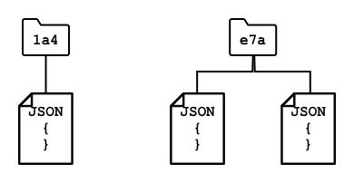

<!--
CO_OP_TRANSLATOR_METADATA:
{
  "original_hash": "e345843ccfeb7261d81500d19c64d476",
  "translation_date": "2025-08-28T19:46:24+00:00",
  "source_file": "3-transport/lessons/2-store-location-data/README.md",
  "language_code": "en"
}
-->
# Store location data


> Sketchnote by [Nitya Narasimhan](https://github.com/nitya). Click the image for a larger version.

## Pre-lecture quiz

[Pre-lecture quiz](https://black-meadow-040d15503.1.azurestaticapps.net/quiz/23)

## Introduction

In the previous lesson, you learned how to use a GPS sensor to capture location data. To visualize the location of a food-laden truck and its journey, this data needs to be sent to a cloud-based IoT service and stored appropriately.

In this lesson, you'll explore different methods for storing IoT data and learn how to store data from your IoT service using serverless code.

This lesson will cover:

* [Structured and unstructured data](../../../../../3-transport/lessons/2-store-location-data)
* [Send GPS data to an IoT Hub](../../../../../3-transport/lessons/2-store-location-data)
* [Hot, warm, and cold paths](../../../../../3-transport/lessons/2-store-location-data)
* [Handle GPS events using serverless code](../../../../../3-transport/lessons/2-store-location-data)
* [Azure Storage Accounts](../../../../../3-transport/lessons/2-store-location-data)
* [Connect your serverless code to storage](../../../../../3-transport/lessons/2-store-location-data)

## Structured and unstructured data

Computer systems process data, which comes in various forms and sizes. This data can range from single numbers to large text files, videos, images, and IoT data. Generally, data falls into one of two categories: *structured* data and *unstructured* data.

* **Structured data** has a well-defined, rigid structure that doesn't change and often maps to tables with relationships. For example, a person's details, including their name, date of birth, and address.

* **Unstructured data** lacks a fixed structure and can change frequently. Examples include documents like written reports or spreadsheets.

✅ Research task: Can you think of other examples of structured and unstructured data?

> 💁 There is also semi-structured data, which has some structure but doesn't fit neatly into fixed tables.

IoT data is typically considered unstructured.

Imagine equipping a fleet of vehicles on a large commercial farm with IoT devices. You might use different devices for different types of vehicles. For example:

* For farm vehicles like tractors, you might want GPS data to ensure they are working in the correct fields.
* For delivery trucks transporting food to warehouses, you might want GPS data, speed, and acceleration data to ensure safe driving, as well as driver identity and start/stop data to ensure compliance with local working hour laws.
* For refrigerated trucks, you might want temperature data to ensure food remains at the correct temperature during transit.

This data can change dynamically. For instance, if the IoT device is in a truck cab, the data it sends might vary depending on the trailer, such as sending temperature data only when a refrigerated trailer is attached.

✅ What other IoT data might be captured? Consider the types of loads trucks carry and maintenance data.

This data varies across vehicles but is sent to the same IoT service for processing. The IoT service must handle this unstructured data, storing it in a way that allows for searching and analysis while accommodating different data structures.

### SQL vs NoSQL storage

Databases are services that store and query data. They come in two types: SQL and NoSQL.

#### SQL databases

The first databases were Relational Database Management Systems (RDBMS), also known as relational databases or SQL databases. They use Structured Query Language (SQL) to add, remove, update, or query data. These databases consist of a schema—a predefined set of tables, similar to a spreadsheet. Each table has multiple named columns. When inserting data, you add a row to the table, filling in values for each column. This creates a rigid structure. While you can leave columns empty, adding a new column requires modifying the database and populating values for existing rows. These databases are relational, meaning one table can relate to another.


For example, if you store a user's personal details in a table, you might assign a unique internal ID to each user. This ID can be used in another table to store details like their purchases. When looking up a user, you can use their ID to retrieve their personal details from one table and their purchases from another.

SQL databases are ideal for storing structured data and ensuring it adheres to a schema.

✅ If you're unfamiliar with SQL, take a moment to read about it on the [SQL page on Wikipedia](https://wikipedia.org/wiki/SQL).

Popular SQL databases include Microsoft SQL Server, MySQL, and PostgreSQL.

✅ Research task: Learn more about these SQL databases and their features.

#### NoSQL databases

NoSQL databases are named for their lack of rigid structure compared to SQL databases. They are also known as document databases because they can store unstructured data like documents.

> 💁 Despite their name, some NoSQL databases allow SQL queries.



NoSQL databases don't have a predefined schema, allowing you to insert unstructured data, often in JSON format. These documents can be organized into folders, similar to files on a computer. Each document can have different fields. For instance, if you store IoT data from farm vehicles, some documents might include accelerometer and speed data, while others might include trailer temperature data. Adding a new truck type with built-in scales to track produce weight would allow the IoT device to add this new field without requiring database changes.

Popular NoSQL databases include Azure CosmosDB, MongoDB, and CouchDB.

✅ Research task: Learn more about these NoSQL databases and their features.

In this lesson, you'll use NoSQL storage to store IoT data.

## Send GPS data to an IoT Hub

In the previous lesson, you captured GPS data from a sensor connected to your IoT device. To store this data in the cloud, you need to send it to an IoT service. You'll use Azure IoT Hub, the same IoT cloud service from the previous project.


### Task - send GPS data to an IoT Hub

1. Create a new IoT Hub using the free tier.

    > ⚠️ Refer to the [instructions for creating an IoT Hub from project 2, lesson 4](../../../2-farm/lessons/4-migrate-your-plant-to-the-cloud/README.md#create-an-iot-service-in-the-cloud) if needed.

    Create a new Resource Group named `gps-sensor` and give the IoT Hub a unique name based on `gps-sensor`, such as `gps-sensor-<your name>`.

    > 💁 If you still have your IoT Hub from the previous project, you can reuse it. Use the name of this IoT Hub and its Resource Group when creating other services.

1. Add a new device to the IoT Hub named `gps-sensor`. Retrieve the connection string for the device.

1. Update your device code to send GPS data to the new IoT Hub using the device connection string.

    > ⚠️ Refer to the [instructions for connecting your device to an IoT Hub from project 2, lesson 4](../../../2-farm/lessons/4-migrate-your-plant-to-the-cloud/README.md#connect-your-device-to-the-iot-service) if needed.

1. Send GPS data as JSON in the following format:

    ```json
    {
        "gps" :
        {
            "lat" : <latitude>,
            "lon" : <longitude>
        }
    }
    ```

1. Send GPS data every minute to avoid exceeding your daily message limit.

If you're using the Wio Terminal, ensure all necessary libraries are added, and set the time using an NTP server. Your code should read all data from the serial port before sending the GPS location, using the existing code from the previous lesson. Use the following code to construct the JSON document:

```cpp
DynamicJsonDocument doc(1024);
doc["gps"]["lat"] = gps.location.lat();
doc["gps"]["lon"] = gps.location.lng();
```

If you're using a Virtual IoT device, install all required libraries using a virtual environment.

For both the Raspberry Pi and Virtual IoT device, use the existing code from the previous lesson to retrieve latitude and longitude values, then send them in the correct JSON format using the following code:

```python
message_json = { "gps" : { "lat":lat, "lon":lon } }
print("Sending telemetry", message_json)
message = Message(json.dumps(message_json))
```

> 💁 You can find this code in the [code/wio-terminal](../../../../../3-transport/lessons/2-store-location-data/code/wio-terminal), [code/pi](../../../../../3-transport/lessons/2-store-location-data/code/pi), or [code/virtual-device](../../../../../3-transport/lessons/2-store-location-data/code/virtual-device) folder.

Run your device code and verify that messages are flowing into IoT Hub using the `az iot hub monitor-events` CLI command.

## Hot, warm, and cold paths

IoT data sent to the cloud isn't always processed in real time. Some data requires immediate processing, while other data can be processed later. The flow of data to services that process it at different times is categorized into hot, warm, and cold paths.

### Hot path

The hot path processes data in real time or near real time. This is used for alerts, such as notifying you when a vehicle approaches a depot or when the temperature in a refrigerated truck is too high.

Hot path data is handled as soon as events are received by cloud services.

### Warm path

The warm path processes data shortly after it's received, often for reporting or short-term analytics. For example, you might use warm path data for daily mileage reports based on data collected the previous day.

Warm path data is stored in quickly accessible storage.

### Cold path

The cold path stores historical data for long-term use, allowing processing whenever needed. For instance, you might use cold path data for annual mileage reports or analytics to optimize routes and reduce fuel costs.

Cold path data is stored in data warehouses—databases designed for large, unchanging datasets that can be queried efficiently. Cloud applications typically run regular jobs to move data from warm path storage to the data warehouse.

✅ Consider the data you've captured so far in these lessons. Is it hot, warm, or cold path data?

## Handle GPS events using serverless code

Once data is flowing into your IoT Hub, you can write serverless code to listen for events published to the Event-Hub-compatible endpoint. This represents the warm path, where data will be stored and used in the next lesson for journey reporting.


### Task - handle GPS events using serverless code

1. Create an Azure Functions app using the Azure Functions CLI. Use the Python runtime, create it in a folder named `gps-trigger`, and use the same name for the Functions App project. Ensure you set up a virtual environment for this.
> ⚠️ You can refer to the [instructions for creating an Azure Functions Project from project 2, lesson 5](../../../2-farm/lessons/5-migrate-application-to-the-cloud/README.md#create-a-serverless-application) if needed.
1. Add an IoT Hub event trigger that uses the Event Hub-compatible endpoint of the IoT Hub.

    > ⚠️ You can refer to the [instructions for creating an IoT Hub event trigger from project 2, lesson 5](../../../2-farm/lessons/5-migrate-application-to-the-cloud/README.md#create-an-iot-hub-event-trigger) if needed.

1. Set the Event Hub-compatible endpoint connection string in the `local.settings.json` file, and use the key for that entry in the `function.json` file.

1. Use the Azurite app as a local storage emulator.

1. Run your functions app to ensure it is receiving events from your GPS device. Make sure your IoT device is also running and sending GPS data.

    ```output
    Python EventHub trigger processed an event: {"gps": {"lat": 47.73481, "lon": -122.25701}}
    ```

## Azure Storage Accounts


Azure Storage Accounts is a general-purpose storage service that can store data in various ways. You can store data as blobs, in queues, in tables, or as files, all at the same time.

### Blob storage

The term *Blob* stands for binary large objects, but it has become synonymous with any unstructured data. You can store any type of data in blob storage, from JSON documents containing IoT data to image and video files. Blob storage uses *containers*, which are named buckets where you can store data, similar to tables in a relational database. These containers can have one or more folders to store blobs, and each folder can contain additional folders, similar to how files are organized on your computer's hard drive.

In this lesson, you will use blob storage to store IoT data.

✅ Do some research: Read up on [Azure Blob Storage](https://docs.microsoft.com/azure/storage/blobs/storage-blobs-overview?WT.mc_id=academic-17441-jabenn)

### Table storage

Table storage allows you to store semi-structured data. It is essentially a NoSQL database, so it doesn't require a predefined schema, but it is designed to store data in one or more tables, with unique keys to identify each row.

✅ Do some research: Read up on [Azure Table Storage](https://docs.microsoft.com/azure/storage/tables/table-storage-overview?WT.mc_id=academic-17441-jabenn)

### Queue storage

Queue storage allows you to store messages of up to 64KB in size in a queue. You can add messages to the back of the queue and read them from the front. Messages are stored indefinitely as long as there is available storage space, making it possible to store messages long-term and process them later. For example, you could add GPS data to a queue daily and process all the messages at the end of the month.

✅ Do some research: Read up on [Azure Queue Storage](https://docs.microsoft.com/azure/storage/queues/storage-queues-introduction?WT.mc_id=academic-17441-jabenn)

### File storage

File storage allows you to store files in the cloud, which can be accessed by apps or devices using standard protocols. You can write files to file storage and mount it as a drive on your PC or Mac.

✅ Do some research: Read up on [Azure File Storage](https://docs.microsoft.com/azure/storage/files/storage-files-introduction?WT.mc_id=academic-17441-jabenn)

## Connect your serverless code to storage

Your function app now needs to connect to blob storage to store messages from the IoT Hub. There are two ways to do this:

* Use the blob storage Python SDK within the function code to write data as blobs.
* Use an output function binding to automatically save the function's return value to blob storage.

In this lesson, you will use the Python SDK to learn how to interact with blob storage.


The data will be saved as a JSON blob with the following format:

```json
{
    "device_id": <device_id>,
    "timestamp" : <time>,
    "gps" :
    {
        "lat" : <latitude>,
        "lon" : <longitude>
    }
}
```

### Task - connect your serverless code to storage

1. Create an Azure Storage account. Name it something like `gps<your name>`.

    > ⚠️ You can refer to the [instructions for creating a storage account from project 2, lesson 5](../../../2-farm/lessons/5-migrate-application-to-the-cloud/README.md#task---create-the-cloud-resources) if needed.

    If you still have a storage account from the previous project, you can reuse it.

    > 💁 You will be able to use the same storage account to deploy your Azure Functions app later in this lesson.

1. Run the following command to get the connection string for the storage account:

    ```sh
    az storage account show-connection-string --output table \
                                              --name <storage_name>
    ```

    Replace `<storage_name>` with the name of the storage account you created in the previous step.

1. Add a new entry to the `local.settings.json` file for your storage account connection string, using the value from the previous step. Name it `STORAGE_CONNECTION_STRING`.

1. Add the following to the `requirements.txt` file to install the Azure storage Pip packages:

    ```sh
    azure-storage-blob
    ```

    Install the packages from this file in your virtual environment.

    > If you get an error, upgrade your Pip version in your virtual environment to the latest version with the following command, then try again:
    >
    > ```sh
    > pip install --upgrade pip
    > ```

1. In the `__init__.py` file for the `iot-hub-trigger`, add the following import statements:

    ```python
    import json
    import os
    import uuid
    from azure.storage.blob import BlobServiceClient, PublicAccess
    ```

    The `json` module will be used to read and write JSON, the `os` module will be used to read the connection string, and the `uuid` module will be used to generate unique IDs for GPS readings.

    The `azure.storage.blob` package contains the Python SDK for working with blob storage.

1. Before the `main` method, add the following helper function:

    ```python
    def get_or_create_container(name):
        connection_str = os.environ['STORAGE_CONNECTION_STRING']
        blob_service_client = BlobServiceClient.from_connection_string(connection_str)
    
        for container in blob_service_client.list_containers():
            if container.name == name:
                return blob_service_client.get_container_client(container.name)
        
        return blob_service_client.create_container(name, public_access=PublicAccess.Container)
    ```

    The Python blob SDK doesn't have a built-in method to create a container if it doesn't exist. This code loads the connection string from the `local.settings.json` file (or the Application Settings once deployed to the cloud), creates a `BlobServiceClient` class to interact with the blob storage account, and checks for the existence of the specified container. If the container doesn't exist, it creates one and returns a `ContainerClient` class to interact with it.

    When a new container is created, public access is granted to query the blobs in the container. This will be used in the next lesson to visualize GPS data on a map.

1. Unlike the soil moisture example, this code will store every event. Add the following code inside the `for event in events:` loop in the `main` function, below the `logging` statement:

    ```python
    device_id = event.iothub_metadata['connection-device-id']
    blob_name = f'{device_id}/{str(uuid.uuid1())}.json'
    ```

    This code retrieves the device ID from the event metadata and uses it to create a blob name. Blobs can be stored in folders, and the device ID will be used as the folder name, so each device will have its GPS events stored in one folder. The blob name consists of the folder name and a unique document name, separated by forward slashes (similar to Linux/macOS paths).

    For example, for the `gps-sensor` device ID, the blob name might be `gps-sensor/a9487ac2-b9cf-11eb-b5cd-1e00621e3648.json`.

1. Add the following code below this:

    ```python
    container_client = get_or_create_container('gps-data')
    blob = container_client.get_blob_client(blob_name)
    ```

    This code retrieves the container client using the `get_or_create_container` helper function and then gets a blob client object using the blob name. Blob clients can refer to existing blobs or, as in this case, to new blobs.

1. Add the following code after this:

    ```python
    event_body = json.loads(event.get_body().decode('utf-8'))
    blob_body = {
        'device_id' : device_id,
        'timestamp' : event.iothub_metadata['enqueuedtime'],
        'gps': event_body['gps']
    }
    ```

    This builds the content of the blob to be written to blob storage. It is a JSON document containing the device ID, the time the telemetry was sent to IoT Hub, and the GPS coordinates from the telemetry.

    > 💁 It's important to use the enqueued time of the message rather than the current time to capture when the message was sent. The message might sit in the hub for a while before being picked up if the Functions App isn't running.

1. Add the following code below this:

    ```python
    logging.info(f'Writing blob to {blob_name} - {blob_body}')
    blob.upload_blob(json.dumps(blob_body).encode('utf-8'))
    ```

    This code logs the details of the blob about to be written and uploads the blob content to blob storage.

1. Run the Functions app. You will see blobs being written for all the GPS events in the output:

    ```output
    [2021-05-21T01:31:14.325Z] Python EventHub trigger processed an event: {"gps": {"lat": 47.73092, "lon": -122.26206}}
    ...
    [2021-05-21T01:31:14.351Z] Writing blob to gps-sensor/4b6089fe-ba8d-11eb-bc7b-1e00621e3648.json - {'device_id': 'gps-sensor', 'timestamp': '2021-05-21T00:57:53.878Z', 'gps': {'lat': 47.73092, 'lon': -122.26206}}
    ```

    > 💁 Make sure you are not running the IoT Hub event monitor at the same time.

> 💁 You can find this code in the [code/functions](../../../../../3-transport/lessons/2-store-location-data/code/functions) folder.

### Task - verify the uploaded blobs

1. To view the blobs created, you can use either the [Azure Storage Explorer](https://azure.microsoft.com/features/storage-explorer/?WT.mc_id=academic-17441-jabenn), a free tool for managing storage accounts, or the CLI.

    1. To use the CLI, first retrieve an account key. Run the following command:

        ```sh
        az storage account keys list --output table \
                                     --account-name <storage_name>
        ```

        Replace `<storage_name>` with the name of the storage account.

        Copy the value of `key1`.

    1. Run the following command to list the blobs in the container:

        ```sh
        az storage blob list --container-name gps-data \
                             --output table \
                             --account-name <storage_name> \
                             --account-key <key1>
        ```

        Replace `<storage_name>` with the name of the storage account, and `<key1>` with the value of `key1` you copied earlier.

        This will list all the blobs in the container:

        ```output
        Name                                                  Blob Type    Blob Tier    Length    Content Type              Last Modified              Snapshot
        ----------------------------------------------------  -----------  -----------  --------  ------------------------  -------------------------  ----------
        gps-sensor/1810d55e-b9cf-11eb-9f5b-1e00621e3648.json  BlockBlob    Hot          45        application/octet-stream  2021-05-21T00:54:27+00:00
        gps-sensor/18293e46-b9cf-11eb-9f5b-1e00621e3648.json  BlockBlob    Hot          45        application/octet-stream  2021-05-21T00:54:28+00:00
        gps-sensor/1844549c-b9cf-11eb-9f5b-1e00621e3648.json  BlockBlob    Hot          45        application/octet-stream  2021-05-21T00:54:28+00:00
        gps-sensor/1894d714-b9cf-11eb-9f5b-1e00621e3648.json  BlockBlob    Hot          45        application/octet-stream  2021-05-21T00:54:28+00:00
        ```

    1. Download one of the blobs using the following command:

        ```sh
        az storage blob download --container-name gps-data \
                                 --account-name <storage_name> \
                                 --account-key <key1> \
                                 --name <blob_name> \
                                 --file <file_name>
        ```

        Replace `<storage_name>` with the name of the storage account, `<key1>` with the value of `key1`, `<blob_name>` with the full name of the blob (including the folder name), and `<file_name>` with the name of the local file to save the blob to.

    Once downloaded, you can open the JSON file in VS Code to view the GPS location details:

    ```json
    {"device_id": "gps-sensor", "timestamp": "2021-05-21T00:57:53.878Z", "gps": {"lat": 47.73092, "lon": -122.26206}}
    ```

### Task - deploy your Functions App to the cloud

Now that your Function app is working, you can deploy it to the cloud.

1. Create a new Azure Functions app, using the storage account you created earlier. Name it something like `gps-sensor-` followed by a unique identifier, such as random words or your name.

    > ⚠️ You can refer to the [instructions for creating a Functions app from project 2, lesson 5](../../../2-farm/lessons/5-migrate-application-to-the-cloud/README.md#task---create-the-cloud-resources) if needed.

1. Upload the `IOT_HUB_CONNECTION_STRING` and `STORAGE_CONNECTION_STRING` values to the Application Settings.

    > ⚠️ You can refer to the [instructions for uploading Application Settings from project 2, lesson 5](../../../2-farm/lessons/5-migrate-application-to-the-cloud/README.md#task---upload-your-application-settings) if needed.

1. Deploy your local Functions app to the cloud.
> ⚠️ You can refer to the [instructions for deploying your Functions app from project 2, lesson 5](../../../2-farm/lessons/5-migrate-application-to-the-cloud/README.md#task---deploy-your-functions-app-to-the-cloud) if needed.
---

## 🚀 Challenge

GPS data isn't perfectly accurate, and detected locations can be off by several meters, especially in tunnels or areas with tall buildings.

How could satellite navigation systems address this issue? What information does your sat-nav have that could help it make better predictions about your location?

## Post-lecture quiz

[Post-lecture quiz](https://black-meadow-040d15503.1.azurestaticapps.net/quiz/24)

## Review & Self Study

* Learn about structured data on the [Data model page on Wikipedia](https://wikipedia.org/wiki/Data_model)
* Explore semi-structured data on the [Semi-structured data page on Wikipedia](https://wikipedia.org/wiki/Semi-structured_data)
* Understand unstructured data on the [Unstructured data page on Wikipedia](https://wikipedia.org/wiki/Unstructured_data)
* Dive deeper into Azure Storage and its various storage types in the [Azure Storage documentation](https://docs.microsoft.com/azure/storage/?WT.mc_id=academic-17441-jabenn)

## Assignment

[Investigate function bindings](assignment.md)

---

**Disclaimer**:  
This document has been translated using the AI translation service [Co-op Translator](https://github.com/Azure/co-op-translator). While we aim for accuracy, please note that automated translations may include errors or inaccuracies. The original document in its native language should be regarded as the authoritative source. For critical information, professional human translation is advised. We are not responsible for any misunderstandings or misinterpretations resulting from the use of this translation.