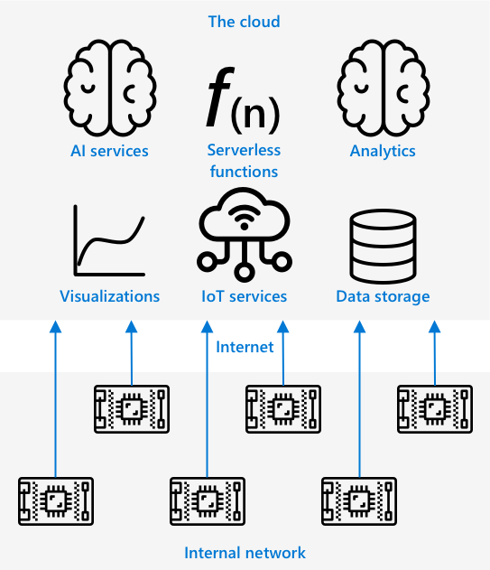

<!--
CO_OP_TRANSLATOR_METADATA:
{
  "original_hash": "2625af24587465c5547ae33d6cc000a5",
  "translation_date": "2025-08-28T19:04:11+00:00",
  "source_file": "4-manufacturing/lessons/3-run-fruit-detector-edge/README.md",
  "language_code": "en"
}
-->
# Run your fruit detector on the edge


> Sketchnote by [Nitya Narasimhan](https://github.com/nitya). Click the image for a larger version.

This video provides an overview of running image classifiers on IoT devices, the topic covered in this lesson.

[](https://www.youtube.com/watch?v=_K5fqGLO8us)

## Pre-lecture quiz

[Pre-lecture quiz](https://black-meadow-040d15503.1.azurestaticapps.net/quiz/33)

## Introduction

In the previous lesson, you used your image classifier to distinguish between ripe and unripe fruit by sending an image captured by your IoT device's camera to a cloud service over the internet. However, these calls can take time, incur costs, and, depending on the type of image data, raise privacy concerns.

In this lesson, you'll learn how to run machine learning (ML) models on the edge—on IoT devices operating within your own network rather than in the cloud. You'll explore the benefits and limitations of edge computing compared to cloud computing, learn how to deploy your AI model to the edge, and understand how to access it from your IoT device.

This lesson will cover:

* [Edge computing](../../../../../4-manufacturing/lessons/3-run-fruit-detector-edge)
* [Azure IoT Edge](../../../../../4-manufacturing/lessons/3-run-fruit-detector-edge)
* [Register an IoT Edge device](../../../../../4-manufacturing/lessons/3-run-fruit-detector-edge)
* [Set up an IoT Edge device](../../../../../4-manufacturing/lessons/3-run-fruit-detector-edge)
* [Export your model](../../../../../4-manufacturing/lessons/3-run-fruit-detector-edge)
* [Prepare your container for deployment](../../../../../4-manufacturing/lessons/3-run-fruit-detector-edge)
* [Deploy your container](../../../../../4-manufacturing/lessons/3-run-fruit-detector-edge)
* [Use your IoT Edge device](../../../../../4-manufacturing/lessons/3-run-fruit-detector-edge)

## Edge computing

Edge computing involves processing IoT data as close as possible to where the data is generated. Instead of processing data in the cloud, the computation is moved to the edge of the cloud—your internal network.



In previous lessons, your devices collected data and sent it to the cloud for analysis, running serverless functions or AI models in the cloud.


Edge computing shifts some cloud services to computers running on the same network as the IoT devices, communicating with the cloud only when necessary. For example, you can run AI models on edge devices to analyze fruit ripeness and send only analytics, such as the count of ripe versus unripe fruit, back to the cloud.

✅ Reflect on the IoT applications you've built so far. Which parts could be moved to the edge?

### Upsides

The advantages of edge computing include:

1. **Speed** - Edge computing is ideal for time-sensitive data since actions occur on the same network as the device, avoiding internet calls. This results in faster processing because internal networks typically operate at much higher speeds than internet connections, with data traveling shorter distances.

    > 💁 Even though optical cables allow internet data to travel at the speed of light, sending data across the globe to cloud providers can still take time. For instance, sending data from Europe to cloud services in the US takes at least 28ms to cross the Atlantic via optical cable, not accounting for the time required to route the data, convert signals, and process it at the cloud provider.

    Edge computing also reduces network traffic, minimizing the risk of data slowdowns due to congestion on limited internet bandwidth.

2. **Remote accessibility** - Edge computing works in areas with limited or no connectivity or where connectivity is too expensive for continuous use. This is useful in scenarios like humanitarian disaster zones or developing regions.

3. **Lower costs** - Performing data collection, storage, analysis, and triggering actions on edge devices reduces reliance on cloud services, potentially lowering the overall cost of your IoT application. Affordable devices designed for edge computing, such as AI accelerator boards like the [Jetson Nano from NVIDIA](https://developer.nvidia.com/embedded/jetson-nano-developer-kit), can run AI workloads on hardware costing less than $100.

4. **Privacy and security** - With edge computing, data remains on your network and isn't uploaded to the cloud. This is preferable for sensitive or personally identifiable information. Additionally, data doesn't need to be stored after analysis, reducing the risk of data breaches. Examples include medical data and security camera footage.

5. **Handling insecure devices** - If you have devices with known security vulnerabilities, you can connect them to a separate network linked to a gateway IoT Edge device. This edge device can then securely manage data flows to your wider network or the internet.

6. **Support for incompatible devices** - Devices that can't connect to IoT Hub (e.g., those limited to HTTP or Bluetooth connections) can use an IoT Edge device as a gateway to forward messages to IoT Hub.

✅ Research: What other advantages might edge computing offer?

### Downsides

Edge computing has some drawbacks, making the cloud a better option in certain cases:

1. **Scale and flexibility** - Cloud computing can dynamically adjust resources to meet network and data demands. Scaling edge computing requires manually adding more devices.

2. **Reliability and resiliency** - Cloud computing offers redundancy and disaster recovery through multiple servers in various locations. Achieving similar redundancy on the edge requires significant investment and configuration.

3. **Maintenance** - Cloud providers handle system maintenance and updates.

✅ Research: What other disadvantages might edge computing have?

The downsides of edge computing are essentially the opposite of the cloud's advantages—you must build and manage the devices yourself, rather than relying on the expertise and scalability of cloud providers.

Some risks are mitigated by the nature of edge computing. For instance, if an edge device in a factory gathers data from machinery, you don't need to plan for certain disaster recovery scenarios. If the factory loses power, the machines generating the data will also be offline, so a backup edge device isn't necessary.

For IoT systems, a hybrid approach often works best, combining cloud and edge computing based on the system's needs, its users, and its maintainers.

## Azure IoT Edge


Azure IoT Edge is a service that helps you move workloads from the cloud to the edge. You can set up a device as an edge device and deploy code to it from the cloud, enabling a mix of cloud and edge capabilities.

> 🎓 *Workloads* refer to any service that performs tasks, such as AI models, applications, or serverless functions.

For example, you can train an image classifier in the cloud and deploy it to an edge device. Your IoT device can then send images to the edge device for classification instead of sending them over the internet. If you need to update the model, you can train a new version in the cloud and use IoT Edge to deploy it to the edge device.

> 🎓 Software deployed to IoT Edge is called *modules*. By default, IoT Edge runs modules like `edgeAgent` and `edgeHub` that communicate with IoT Hub. Additional modules, such as an image classifier, can be deployed as needed.

IoT Edge is integrated with IoT Hub, allowing you to manage edge devices with the same service used for IoT devices, maintaining the same level of security.

IoT Edge runs code from *containers*—self-contained applications isolated from other software on your computer. A container acts like a separate computer within your computer, running its own software, services, and applications. Containers typically can't access anything on your computer unless explicitly allowed, such as sharing a folder. Services in the container are exposed via open ports that you can connect to or share on your network.


For example, a container running a website on port 80 (the default HTTP port) can expose the site on your computer's port 80.

✅ Research: Learn about containers and tools like Docker or Moby.

Custom Vision allows you to download image classifiers and deploy them as containers, either directly to a device or via IoT Edge. Once running in a container, the classifier can be accessed using the same REST API as the cloud version, but with the endpoint pointing to the edge device.

## Register an IoT Edge device

To use an IoT Edge device, you must register it in IoT Hub.

### Task - Register an IoT Edge device

1. Create an IoT Hub in the `fruit-quality-detector` resource group. Give it a unique name based on `fruit-quality-detector`.

2. Register an IoT Edge device called `fruit-quality-detector-edge` in your IoT Hub. Use the following command, adding the `--edge-enabled` flag:

    ```sh
    az iot hub device-identity create --edge-enabled \
                                      --device-id fruit-quality-detector-edge \
                                      --hub-name <hub_name>
    ```

    Replace `<hub_name>` with your IoT Hub's name.

3. Retrieve the device's connection string using this command:

    ```sh
    az iot hub device-identity connection-string show --device-id fruit-quality-detector-edge \
                                                      --output table \
                                                      --hub-name <hub_name>
    ```

    Replace `<hub_name>` with your IoT Hub's name.

    Copy the connection string from the output.

## Set up an IoT Edge device

After registering the edge device in IoT Hub, you can set up the device.

### Task - Install and start the IoT Edge Runtime

**The IoT Edge runtime only supports Linux containers.** It can run on Linux or on Windows using Linux Virtual Machines.

* If you're using a Raspberry Pi as your IoT device, it runs a supported Linux version and can host the IoT Edge runtime. Follow the [install Azure IoT Edge for Linux guide on Microsoft docs](https://docs.microsoft.com/azure/iot-edge/how-to-install-iot-edge?WT.mc_id=academic-17441-jabenn) to install IoT Edge and set the connection string.

    > 💁 Remember, Raspberry Pi OS is a variant of Debian Linux.

* If you're using a Linux computer, follow the same guide to install IoT Edge and set the connection string.

* If you're using Windows, install the IoT Edge runtime in a Linux Virtual Machine by following the [install and start the IoT Edge runtime section of the deploy your first IoT Edge module to a Windows device quickstart on Microsoft docs](https://docs.microsoft.com/azure/iot-edge/quickstart?WT.mc_id=academic-17441-jabenn#install-and-start-the-iot-edge-runtime). Stop at the *Deploy a module* section.

* If you're using macOS, create a virtual machine (VM) in the cloud to use as your IoT Edge device. Follow the [create a virtual machine running IoT Edge guide](vm-iotedge.md) for instructions.

## Export your model

To run the classifier on the edge, export it from Custom Vision. Custom Vision supports two types of models: standard and compact. Compact models are optimized for size, making them suitable for IoT devices.

When you created the image classifier, you used the *Food* domain, optimized for food images. In Custom Vision, you can switch your project to the *Food (compact)* domain and retrain the model using your existing data.

### Task - Train your model using the Food (compact) domain
1. Open the Custom Vision portal at [CustomVision.ai](https://customvision.ai) and sign in if you haven’t already. Then, access your `fruit-quality-detector` project.

1. Click the **Settings** button (the ⚙ icon).

1. In the *Domains* list, choose *Food (compact)*.

1. Under *Export Capabilities*, ensure *Basic platforms (Tensorflow, CoreML, ONNX, ...)* is selected.

1. At the bottom of the Settings page, click **Save Changes**.

1. Retrain the model by clicking the **Train** button and selecting *Quick training*.

### Task - Export your model

After training the model, it needs to be exported as a container.

1. Go to the **Performance** tab and locate your latest iteration trained using the compact domain.

1. Click the **Export** button at the top.

1. Choose **DockerFile**, then select the version that matches your edge device:

    * If you’re using IoT Edge on a Linux computer, Windows computer, or Virtual Machine, select the *Linux* version.
    * If you’re using IoT Edge on a Raspberry Pi, select the *ARM (Raspberry Pi 3)* version.

> 🎓 Docker is a widely-used tool for managing containers, and a DockerFile contains instructions for setting up the container.

1. Click **Export** to let Custom Vision generate the necessary files, then click **Download** to save them as a zip file.

1. Save the files to your computer and unzip the folder.

## Prepare your container for deployment


After downloading your model, it needs to be built into a container and pushed to a container registry—an online location for storing containers. IoT Edge can then pull the container from the registry and deploy it to your device.


The container registry used in this lesson is Azure Container Registry. This service is not free, so to save costs, ensure you [clean up your project](../../../clean-up.md) after completing the lesson.

> 💁 You can view the costs of using Azure Container Registry on the [Azure Container Registry pricing page](https://azure.microsoft.com/pricing/details/container-registry/?WT.mc_id=academic-17441-jabenn).

### Task - Install Docker

To build and deploy the classifier, you may need to install [Docker](https://www.docker.com/).

You only need to do this if you plan to build your container on a device other than the one where IoT Edge is installed—Docker is installed as part of IoT Edge setup.

1. If you’re building the Docker container on a different device, follow the installation instructions on the [Docker install page](https://www.docker.com/products/docker-desktop) to install Docker Desktop or the Docker engine. Ensure Docker is running after installation.

### Task - Create a container registry resource

1. Run the following command in your terminal or command prompt to create an Azure Container Registry resource:

    ```sh
    az acr create --resource-group fruit-quality-detector \
                  --sku Basic \
                  --name <Container registry name>
    ```

    Replace `<Container registry name>` with a unique name for your container registry, using only letters and numbers. Base this name on `fruitqualitydetector`. The name will be part of the URL used to access the container registry, so it must be globally unique.

1. Log in to the Azure Container Registry using the following command:

    ```sh
    az acr login --name <Container registry name>
    ```

    Replace `<Container registry name>` with the name you chose for your container registry.

1. Enable admin mode for the container registry to generate a password using the following command:

    ```sh
    az acr update --admin-enabled true \
                 --name <Container registry name>
    ```

    Replace `<Container registry name>` with the name you chose for your container registry.

1. Generate passwords for your container registry using the following command:

    ```sh
     az acr credential renew --password-name password \
                             --output table \
                             --name <Container registry name>
    ```

    Replace `<Container registry name>` with the name you chose for your container registry.

    Copy the value of `PASSWORD`, as you’ll need it later.

### Task - Build your container

The files downloaded from Custom Vision include a DockerFile with instructions for building the container, application code to host your custom vision model, and a REST API to interact with it. Use Docker to build a tagged container from the DockerFile and push it to your container registry.

> 🎓 Containers are tagged with a name and version. When updating a container, you can use the same tag but increment the version.

1. Open your terminal or command prompt and navigate to the unzipped model folder downloaded from Custom Vision.

1. Run the following command to build and tag the image:

    ```sh
    docker build --platform <platform> -t <Container registry name>.azurecr.io/classifier:v1 .
    ```

    Replace `<platform>` with the platform the container will run on. If using IoT Edge on a Raspberry Pi, set this to `linux/armhf`. Otherwise, set it to `linux/amd64`.

    > 💁 If running this command on the same device as IoT Edge (e.g., Raspberry Pi), you can omit the `--platform <platform>` part as it defaults to the current platform.

    Replace `<Container registry name>` with the name you chose for your container registry.

    > 💁 If using Linux or Raspberry Pi OS, you may need to use `sudo` to run this command.

    Docker will build the image, configuring all necessary software. The image will be tagged as `classifier:v1`.

    ```output
    ➜  d4ccc45da0bb478bad287128e1274c3c.DockerFile.Linux docker build --platform linux/amd64 -t  fruitqualitydetectorjimb.azurecr.io/classifier:v1 .
    [+] Building 102.4s (11/11) FINISHED
     => [internal] load build definition from Dockerfile
     => => transferring dockerfile: 131B
     => [internal] load .dockerignore
     => => transferring context: 2B
     => [internal] load metadata for docker.io/library/python:3.7-slim
     => [internal] load build context
     => => transferring context: 905B
     => [1/6] FROM docker.io/library/python:3.7-slim@sha256:b21b91c9618e951a8cbca5b696424fa5e820800a88b7e7afd66bba0441a764d6
     => => resolve docker.io/library/python:3.7-slim@sha256:b21b91c9618e951a8cbca5b696424fa5e820800a88b7e7afd66bba0441a764d6
     => => sha256:b4d181a07f8025e00e0cb28f1cc14613da2ce26450b80c54aea537fa93cf3bda 27.15MB / 27.15MB
     => => sha256:de8ecf497b753094723ccf9cea8a46076e7cb845f333df99a6f4f397c93c6ea9 2.77MB / 2.77MB
     => => sha256:707b80804672b7c5d8f21e37c8396f319151e1298d976186b4f3b76ead9f10c8 10.06MB / 10.06MB
     => => sha256:b21b91c9618e951a8cbca5b696424fa5e820800a88b7e7afd66bba0441a764d6 1.86kB / 1.86kB
     => => sha256:44073386687709c437586676b572ff45128ff1f1570153c2f727140d4a9accad 1.37kB / 1.37kB
     => => sha256:3d94f0f2ca798607808b771a7766f47ae62a26f820e871dd488baeccc69838d1 8.31kB / 8.31kB
     => => sha256:283715715396fd56d0e90355125fd4ec57b4f0773f306fcd5fa353b998beeb41 233B / 233B
     => => sha256:8353afd48f6b84c3603ea49d204bdcf2a1daada15f5d6cad9cc916e186610a9f 2.64MB / 2.64MB
     => => extracting sha256:b4d181a07f8025e00e0cb28f1cc14613da2ce26450b80c54aea537fa93cf3bda
     => => extracting sha256:de8ecf497b753094723ccf9cea8a46076e7cb845f333df99a6f4f397c93c6ea9
     => => extracting sha256:707b80804672b7c5d8f21e37c8396f319151e1298d976186b4f3b76ead9f10c8
     => => extracting sha256:283715715396fd56d0e90355125fd4ec57b4f0773f306fcd5fa353b998beeb41
     => => extracting sha256:8353afd48f6b84c3603ea49d204bdcf2a1daada15f5d6cad9cc916e186610a9f
     => [2/6] RUN pip install -U pip
     => [3/6] RUN pip install --no-cache-dir numpy~=1.17.5 tensorflow~=2.0.2 flask~=1.1.2 pillow~=7.2.0
     => [4/6] RUN pip install --no-cache-dir mscviplib==2.200731.16
     => [5/6] COPY app /app
     => [6/6] WORKDIR /app
     => exporting to image
     => => exporting layers
     => => writing image sha256:1846b6f134431f78507ba7c079358ed66d944c0e185ab53428276bd822400386
     => => naming to fruitqualitydetectorjimb.azurecr.io/classifier:v1
    ```

### Task - Push your container to your container registry

1. Use the following command to push your container to the container registry:

    ```sh
    docker push <Container registry name>.azurecr.io/classifier:v1
    ```

    Replace `<Container registry name>` with the name you chose for your container registry.

    > 💁 If using Linux, you may need to use `sudo` to run this command.

    The container will be pushed to the registry.

    ```output
    ➜  d4ccc45da0bb478bad287128e1274c3c.DockerFile.Linux docker push fruitqualitydetectorjimb.azurecr.io/classifier:v1
    The push refers to repository [fruitqualitydetectorjimb.azurecr.io/classifier]
    5f70bf18a086: Pushed 
    8a1ba9294a22: Pushed 
    56cf27184a76: Pushed 
    b32154f3f5dd: Pushed 
    36103e9a3104: Pushed 
    e2abb3cacca0: Pushed 
    4213fd357bbe: Pushed 
    7ea163ba4dce: Pushed 
    537313a13d90: Pushed 
    764055ebc9a7: Pushed 
    v1: digest: sha256:ea7894652e610de83a5a9e429618e763b8904284253f4fa0c9f65f0df3a5ded8 size: 2423
    ```

1. Verify the push by listing the containers in your registry using the following command:

    ```sh
    az acr repository list --output table \
                           --name <Container registry name> 
    ```

    Replace `<Container registry name>` with the name you chose for your container registry.

    ```output
    ➜  d4ccc45da0bb478bad287128e1274c3c.DockerFile.Linux az acr repository list --name fruitqualitydetectorjimb --output table
    Result
    ----------
    classifier
    ```

    You’ll see your classifier listed in the output.

## Deploy your container

Your container can now be deployed to your IoT Edge device. To deploy it, you need to create a deployment manifest—a JSON document listing the modules to be deployed to the edge device.

### Task - Create the deployment manifest

1. Create a new file named `deployment.json` on your computer.

1. Add the following content to the file:

    ```json
    {
        "content": {
            "modulesContent": {
                "$edgeAgent": {
                    "properties.desired": {
                        "schemaVersion": "1.1",
                        "runtime": {
                            "type": "docker",
                            "settings": {
                                "minDockerVersion": "v1.25",
                                "loggingOptions": "",
                                "registryCredentials": {
                                    "ClassifierRegistry": {
                                        "username": "<Container registry name>",
                                        "password": "<Container registry password>",
                                        "address": "<Container registry name>.azurecr.io"
                                      }
                                }
                            }
                        },
                        "systemModules": {
                            "edgeAgent": {
                                "type": "docker",
                                "settings": {
                                    "image": "mcr.microsoft.com/azureiotedge-agent:1.1",
                                    "createOptions": "{}"
                                }
                            },
                            "edgeHub": {
                                "type": "docker",
                                "status": "running",
                                "restartPolicy": "always",
                                "settings": {
                                    "image": "mcr.microsoft.com/azureiotedge-hub:1.1",
                                    "createOptions": "{\"HostConfig\":{\"PortBindings\":{\"5671/tcp\":[{\"HostPort\":\"5671\"}],\"8883/tcp\":[{\"HostPort\":\"8883\"}],\"443/tcp\":[{\"HostPort\":\"443\"}]}}}"
                                }
                            }
                        },
                        "modules": {
                            "ImageClassifier": {
                                "version": "1.0",
                                "type": "docker",
                                "status": "running",
                                "restartPolicy": "always",
                                "settings": {
                                    "image": "<Container registry name>.azurecr.io/classifier:v1",
                                    "createOptions": "{\"ExposedPorts\": {\"80/tcp\": {}},\"HostConfig\": {\"PortBindings\": {\"80/tcp\": [{\"HostPort\": \"80\"}]}}}"
                                }
                            }
                        }
                    }
                },
                "$edgeHub": {
                    "properties.desired": {
                        "schemaVersion": "1.1",
                        "routes": {
                            "upstream": "FROM /messages/* INTO $upstream"
                        },
                        "storeAndForwardConfiguration": {
                            "timeToLiveSecs": 7200
                        }
                    }
                }
            }
        }
    }
    ```

    > 💁 You can find this file in the [code-deployment/deployment](../../../../../4-manufacturing/lessons/3-run-fruit-detector-edge/code-deployment/deployment) folder.

    Replace the three instances of `<Container registry name>` with the name you chose for your container registry. One is in the `ImageClassifier` module section, and the other two are in the `registryCredentials` section.

    Replace `<Container registry password>` in the `registryCredentials` section with your container registry password.

1. From the folder containing your deployment manifest, run the following command:

    ```sh
    az iot edge set-modules --device-id fruit-quality-detector-edge \
                            --content deployment.json \
                            --hub-name <hub_name>
    ```

    Replace `<hub_name>` with the name of your IoT Hub.

    The image classifier module will be deployed to your edge device.

### Task - Verify the classifier is running

1. Connect to the IoT Edge device:

    * If using a Raspberry Pi, connect via SSH from your terminal or through a remote SSH session in VS Code.
    * If running IoT Edge in a Linux container on Windows, follow the steps in the [verify successful configuration guide](https://docs.microsoft.com/azure/iot-edge/how-to-install-iot-edge-on-windows?WT.mc_id=academic-17441-jabenn&view=iotedge-2018-06&tabs=powershell#verify-successful-configuration) to connect to the IoT Edge device.
    * If running IoT Edge on a virtual machine, SSH into the machine using the `adminUsername` and `password` set during VM creation, and use either the IP address or DNS name:

        ```sh
        ssh <adminUsername>@<IP address>
        ```

        Or:

        ```sh
        ssh <adminUsername>@<DNS Name>
        ```

        Enter your password when prompted.

1. Once connected, run the following command to list IoT Edge modules:

    ```sh
    iotedge list
    ```

    > 💁 You may need to use `sudo` to run this command.

    You’ll see the running modules:

    ```output
    jim@fruit-quality-detector-jimb:~$ iotedge list
    NAME             STATUS           DESCRIPTION      CONFIG
    ImageClassifier  running          Up 42 minutes    fruitqualitydetectorjimb.azurecr.io/classifier:v1
    edgeAgent        running          Up 42 minutes    mcr.microsoft.com/azureiotedge-agent:1.1
    edgeHub          running          Up 42 minutes    mcr.microsoft.com/azureiotedge-hub:1.1
    ```

1. Check the logs for the Image classifier module using the following command:

    ```sh
    iotedge logs ImageClassifier
    ```

    > 💁 You may need to use `sudo` to run this command.

    ```output
    jim@fruit-quality-detector-jimb:~$ iotedge logs ImageClassifier
    2021-07-05 20:30:15.387144: I tensorflow/core/platform/cpu_feature_guard.cc:142] Your CPU supports instructions that this TensorFlow binary was not compiled to use: AVX2 FMA
    2021-07-05 20:30:15.392185: I tensorflow/core/platform/profile_utils/cpu_utils.cc:94] CPU Frequency: 2394450000 Hz
    2021-07-05 20:30:15.392712: I tensorflow/compiler/xla/service/service.cc:168] XLA service 0x55ed9ac83470 executing computations on platform Host. Devices:
    2021-07-05 20:30:15.392806: I tensorflow/compiler/xla/service/service.cc:175]   StreamExecutor device (0): Host, Default Version
    Loading model...Success!
    Loading labels...2 found. Success!
     * Serving Flask app "app" (lazy loading)
     * Environment: production
       WARNING: This is a development server. Do not use it in a production deployment.
       Use a production WSGI server instead.
     * Debug mode: off
     * Running on http://0.0.0.0:80/ (Press CTRL+C to quit)
    ```

### Task - Test the image classifier

1. Use CURL to test the image classifier using the IP address or hostname of the computer running the IoT Edge agent. Find the IP address:

    * If on the same machine as IoT Edge, use `localhost` as the hostname.
    * If using a VM, use the IP address or DNS name of the VM.
    * Otherwise, obtain the IP address of the machine running IoT Edge:
      * On Windows 10, follow the [find your IP address guide](https://support.microsoft.com/windows/find-your-ip-address-f21a9bbc-c582-55cd-35e0-73431160a1b9?WT.mc_id=academic-17441-jabenn).
      * On macOS, follow the [how to find your IP address on a Mac guide](https://www.hellotech.com/guide/for/how-to-find-ip-address-on-mac).
      * On Linux, follow the section on finding your private IP address in the [how to find your IP address in Linux guide](https://opensource.com/article/18/5/how-find-ip-address-linux).

1. Test the container with a local file using the following CURL command:

    ```sh
    curl --location \
         --request POST 'http://<IP address or name>/image' \
         --header 'Content-Type: image/png' \
         --data-binary '@<file_Name>' 
    ```

    Replace `<IP address or name>` with the IP address or hostname of the computer running IoT Edge. Replace `<file_Name>` with the name of the file to test.

    You’ll see the prediction results in the output:

    ```output
    {
        "created": "2021-07-05T21:44:39.573181",
        "id": "",
        "iteration": "",
        "predictions": [
            {
                "boundingBox": null,
                "probability": 0.9995615482330322,
                "tagId": "",
                "tagName": "ripe"
            },
            {
                "boundingBox": null,
                "probability": 0.0004384400090202689,
                "tagId": "",
                "tagName": "unripe"
            }
        ],
        "project": ""
    }
    ```

    > 💁 No prediction key is needed here, as this doesn’t use an Azure resource. Security is configured on the internal network based on internal needs, rather than relying on a public endpoint and API key.

## Use your IoT Edge device

Now that your Image Classifier is deployed to an IoT Edge device, you can use it from your IoT device.

### Task - Use your IoT Edge device

Follow the relevant guide to classify images using the IoT Edge classifier:

* [Arduino - Wio Terminal](wio-terminal.md)
* [Single-board computer - Raspberry Pi/Virtual IoT device](single-board-computer.md)

### Model retraining

One downside of running image classifiers on IoT Edge is that they aren’t connected to your Custom Vision project. If you check the **Predictions** tab in Custom Vision, you won’t see images classified using the Edge-based classifier.

This is expected behavior—images aren’t sent to the cloud for classification, ensuring privacy and offline functionality. However, this makes improving your model more challenging. You’d need to implement a method to store images for manual reclassification to improve and retrain the classifier.

✅ Consider ways to upload images for retraining the classifier.

---

## 🚀 Challenge

Running AI models on edge devices can be faster than in the cloud due to shorter network hops. However, it can also be slower because edge hardware may not be as powerful as cloud infrastructure.

Time the calls to your edge device and compare them to calls to the cloud. Analyze the reasons for any differences or similarities. Research methods to accelerate AI models on edge devices using specialized hardware.

## Post-lecture quiz

[Post-lecture quiz](https://black-meadow-040d15503.1.azurestaticapps.net/quiz/34)

## Review & Self Study

* Learn more about containers on the [OS-level virtualization page on Wikipedia](https://wikipedia.org/wiki/OS-level_virtualization).
* Read more about edge computing, focusing on how 5G can contribute to its growth, in the [What is edge computing and why does it matter? article on NetworkWorld](https://www.networkworld.com/article/3224893/what-is-edge-computing-and-how-it-s-changing-the-network.html).
* Discover how to run AI services on IoT Edge by watching the [Learn how to use Azure IoT Edge on a pre-built AI service on the Edge to do language detection episode of Learn Live on Microsoft Channel9](https://channel9.msdn.com/Shows/Learn-Live/Sharpen-Your-AI-Edge-Skills-Episode-4-Learn-How-to-Use-Azure-IoT-Edge-on-a-Pre-Built-AI-Service-on-t?WT.mc_id=academic-17441-jabenn).

## Assignment

[Run other services on the edge](assignment.md)

---

**Disclaimer**:  
This document has been translated using the AI translation service [Co-op Translator](https://github.com/Azure/co-op-translator). While we aim for accuracy, please note that automated translations may include errors or inaccuracies. The original document in its native language should be regarded as the authoritative source. For critical information, professional human translation is advised. We are not responsible for any misunderstandings or misinterpretations resulting from the use of this translation.