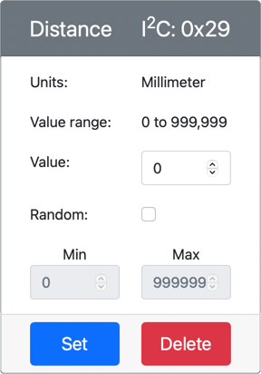

<!--
CO_OP_TRANSLATOR_METADATA:
{
  "original_hash": "7e9f05bdc50a40fd924b1d66934471bf",
  "translation_date": "2025-08-28T19:03:47+00:00",
  "source_file": "4-manufacturing/lessons/4-trigger-fruit-detector/virtual-device-proximity.md",
  "language_code": "en"
}
-->
# Detect proximity - Virtual IoT Hardware

In this part of the lesson, you will add a proximity sensor to your virtual IoT device and read distance measurements from it.

## Hardware

The virtual IoT device will use a simulated distance sensor.

In a physical IoT device, you would use a sensor equipped with a laser ranging module to measure distance.

### Add the distance sensor to CounterFit

To use a virtual distance sensor, you need to add one to the CounterFit app.

#### Task - Add the distance sensor to CounterFit

Add the distance sensor to the CounterFit app.

1. Open the `fruit-quality-detector` code in VS Code, and ensure the virtual environment is activated.

1. Install an additional Pip package to set up a CounterFit shim that simulates the [rpi-vl53l0x Pip package](https://pypi.org/project/rpi-vl53l0x/), a Python package designed to interact with [a VL53L0X time-of-flight distance sensor](https://wiki.seeedstudio.com/Grove-Time_of_Flight_Distance_Sensor-VL53L0X/). Make sure you install this from a terminal with the virtual environment activated.

    ```sh
    pip install counterfit-shims-rpi-vl53l0x
    ```

1. Ensure the CounterFit web app is running.

1. Create a distance sensor:

    1. In the *Create sensor* box in the *Sensors* pane, open the *Sensor type* dropdown and select *Distance*.

    1. Leave the *Units* as `Millimeter`.

    1. This sensor is an I2C sensor, so set the address to `0x29`. If you were using a physical VL53L0X sensor, this address would be hardcoded.

    1. Click the **Add** button to create the distance sensor.

    

    The distance sensor will be created and appear in the sensors list.

    

## Program the distance sensor

The virtual IoT device can now be programmed to use the simulated distance sensor.

### Task - Program the time-of-flight sensor

1. Create a new file in the `fruit-quality-detector` project called `distance-sensor.py`.

    > 💁 A simple way to simulate multiple IoT devices is to create each one in a separate Python file and run them simultaneously.

1. Start a connection to CounterFit with the following code:

    ```python
    from counterfit_connection import CounterFitConnection
    CounterFitConnection.init('127.0.0.1', 5000)
    ```

1. Add the following code below this:

    ```python
    import time
    
    from counterfit_shims_rpi_vl53l0x.vl53l0x import VL53L0X
    ```

    This imports the sensor library shim for the VL53L0X time-of-flight sensor.

1. Below this, add the following code to access the sensor:

    ```python
    distance_sensor = VL53L0X()
    distance_sensor.begin()
    ```

    This code declares a distance sensor and starts the sensor.

1. Finally, add an infinite loop to read distance measurements:

    ```python
    while True:
        distance_sensor.wait_ready()
        print(f'Distance = {distance_sensor.get_distance()} mm')
        time.sleep(1)
    ```

    This code waits for a value to be ready from the sensor and then prints it to the console.

1. Run this code.

    > 💁 Remember, this file is called `distance-sensor.py`! Make sure to run it using Python, not `app.py`.

1. You will see distance measurements appear in the console. Change the value in CounterFit to see the output update, or use random values.

    ```output
    (.venv) ➜  fruit-quality-detector python distance-sensor.py 
    Distance = 37 mm
    Distance = 42 mm
    Distance = 29 mm
    ```

> 💁 You can find this code in the [code-proximity/virtual-iot-device](../../../../../4-manufacturing/lessons/4-trigger-fruit-detector/code-proximity/virtual-iot-device) folder.

😀 Congratulations! Your proximity sensor program is working successfully!

---

**Disclaimer**:  
This document has been translated using the AI translation service [Co-op Translator](https://github.com/Azure/co-op-translator). While we aim for accuracy, please note that automated translations may include errors or inaccuracies. The original document in its native language should be regarded as the authoritative source. For critical information, professional human translation is advised. We are not responsible for any misunderstandings or misinterpretations resulting from the use of this translation.