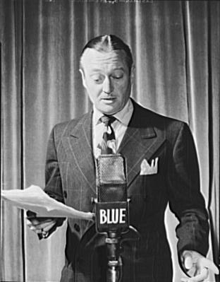

<!--
CO_OP_TRANSLATOR_METADATA:
{
  "original_hash": "6d6aa1be033625d201a190fc9c5cbfb4",
  "translation_date": "2025-08-28T19:22:38+00:00",
  "source_file": "6-consumer/lessons/1-speech-recognition/README.md",
  "language_code": "en"
}
-->
# Recognize speech with an IoT device


> Sketchnote by [Nitya Narasimhan](https://github.com/nitya). Click the image for a larger version.

This video provides an introduction to the Azure speech service, which will be explored in this lesson:

[](https://www.youtube.com/watch?v=iW0Fw0l3mrA)

> 🎥 Click the image above to watch the video

## Pre-lecture quiz

[Pre-lecture quiz](https://black-meadow-040d15503.1.azurestaticapps.net/quiz/41)

## Introduction

'Alexa, set a 12-minute timer.'

'Alexa, timer status.'

'Alexa, set an 8-minute timer called steam broccoli.'

Smart devices are becoming increasingly common—not just as smart speakers like HomePods, Echos, and Google Homes, but also embedded in our phones, watches, light fixtures, and thermostats.

> 💁 I have at least 19 devices in my home with voice assistants, and that's just the ones I know about!

Voice control enhances accessibility by enabling people with limited mobility to interact with devices. Whether it's a permanent disability, such as being born without arms, or a temporary one, like a broken arm, or even situations where your hands are occupied with shopping bags or young children, voice control can make life easier. For example, shouting 'Hey Siri, close my garage door' while managing a baby and a restless toddler can be a small but meaningful improvement.

One of the most common uses for voice assistants is setting timers, especially in the kitchen. Being able to set multiple timers using just your voice is incredibly helpful—no need to stop kneading dough, stirring soup, or cleaning your hands to use a physical timer.

In this lesson, you'll learn how to integrate voice recognition into IoT devices. You'll explore microphones as sensors, how to capture audio from a microphone connected to an IoT device, and how to use AI to convert spoken words into text. By the end of this project, you'll have built a smart kitchen timer capable of setting timers using voice commands in multiple languages.

This lesson will cover:

* [Microphones](../../../../../6-consumer/lessons/1-speech-recognition)
* [Capture audio from your IoT device](../../../../../6-consumer/lessons/1-speech-recognition)
* [Speech to text](../../../../../6-consumer/lessons/1-speech-recognition)
* [Convert speech to text](../../../../../6-consumer/lessons/1-speech-recognition)

## Microphones

Microphones are analog sensors that transform sound waves into electrical signals. Vibrations in the air cause components in the microphone to move slightly, leading to small changes in electrical signals. These changes are then amplified to produce an electrical output.

### Microphone types

Microphones come in various types:

* Dynamic - Dynamic microphones have a magnet attached to a moving diaphragm that moves within a coil of wire, generating an electrical current. This is the reverse of how most loudspeakers work, which use an electrical current to move a magnet in a coil of wire, causing a diaphragm to produce sound. As a result, speakers can function as dynamic microphones, and dynamic microphones can act as speakers. In devices like intercoms, where users alternate between listening and speaking, one device can serve both purposes.

    Dynamic microphones don't require external power; the electrical signal is generated entirely by the microphone.

    

* Ribbon - Ribbon microphones are similar to dynamic microphones but use a metal ribbon instead of a diaphragm. The ribbon moves within a magnetic field, generating an electrical current. Like dynamic microphones, ribbon microphones don't need external power.

    

* Condenser - Condenser microphones feature a thin metal diaphragm and a fixed metal backplate. Electricity is applied to both components, and as the diaphragm vibrates, the static charge between the plates changes, creating a signal. Condenser microphones require external power, known as *Phantom power*.

    

* MEMS - Microelectromechanical systems microphones, or MEMS, are microphones built on a chip. They have a pressure-sensitive diaphragm etched onto a silicon chip and operate similarly to condenser microphones. These microphones are extremely small and can be integrated into circuits.

    

    In the image above, the chip labeled **LEFT** is a MEMS microphone, with a tiny diaphragm less than a millimeter wide.

✅ Do some research: What microphones do you have around you—whether in your computer, phone, headset, or other devices? What type of microphones are they?

### Digital audio

Audio is an analog signal that carries highly detailed information. To convert this signal into digital format, the audio must be sampled thousands of times per second.

> 🎓 Sampling involves converting the audio signal into a digital value that represents the signal at a specific moment in time.


Digital audio is sampled using Pulse Code Modulation (PCM). PCM reads the voltage of the signal and selects the closest discrete value to that voltage based on a defined size.

> 💁 You can think of PCM as the sensor equivalent of pulse width modulation (PWM). PWM was covered back in [lesson 3 of the getting started project](../../../1-getting-started/lessons/3-sensors-and-actuators/README.md#pulse-width-modulation). PCM converts an analog signal to digital, while PWM converts a digital signal to analog.

For example, most streaming music services offer 16-bit or 24-bit audio. This means the voltage is converted into a value that fits within a 16-bit or 24-bit integer. A 16-bit integer ranges from -32,768 to 32,767, while a 24-bit integer ranges from −8,388,608 to 8,388,607. The more bits, the closer the sample is to what our ears actually perceive.

> 💁 You may have heard of 8-bit audio, often referred to as LoFi. This is audio sampled using only 8 bits, ranging from -128 to 127. Early computer audio was limited to 8 bits due to hardware constraints, which is why it's commonly associated with retro gaming.

These samples are taken thousands of times per second, using well-defined sample rates measured in KHz (thousands of readings per second). Streaming music services typically use 48KHz for most audio, but some 'lossless' audio formats go up to 96KHz or even 192KHz. Higher sample rates result in audio that is closer to the original, though there is debate about whether humans can perceive differences above 48KHz.

✅ Do some research: If you use a streaming music service, what sample rate and size does it use? If you listen to CDs, what is the sample rate and size of CD audio?

There are various formats for audio data. You've likely encountered mp3 files, which compress audio to reduce file size without sacrificing quality. Uncompressed audio is often stored as WAV files, which include 44 bytes of header information followed by raw audio data. The header contains details like the sample rate (e.g., 16000 for 16KHz), sample size (e.g., 16 for 16-bit), and the number of channels. After the header, the WAV file contains the raw audio data.

> 🎓 Channels refer to the number of audio streams in the file. For example, stereo audio with left and right channels has 2 channels. A 7.1 surround sound system for home theaters would have 8 channels.

### Audio data size

Audio data can be quite large. For instance, capturing uncompressed 16-bit audio at 16KHz (sufficient for speech-to-text models) requires 32KB of data per second:

* 16-bit means 2 bytes per sample (1 byte equals 8 bits).
* 16KHz equals 16,000 samples per second.
* 16,000 x 2 bytes = 32,000 bytes per second.

While this may seem small, it can be significant for microcontrollers with limited memory. For example, the Wio Terminal has 192KB of memory, which must also store program code and variables. Even with minimal program code, you couldn't capture more than 5 seconds of audio.

Microcontrollers can access additional storage, such as SD cards or flash memory. When building an IoT device that captures audio, you'll need to ensure you have extra storage and that your code writes the captured audio directly to that storage. When sending audio to the cloud, stream it from storage to the web request to avoid running out of memory by holding the entire audio block in memory.

## Capture audio from your IoT device

Your IoT device can connect to a microphone to capture audio, which can then be converted to text. It can also connect to speakers to output audio. In later lessons, speakers will be used for audio feedback, but setting them up now can help test the microphone.

### Task - configure your microphone and speakers

Follow the appropriate guide to set up the microphone and speakers for your IoT device:

* [Arduino - Wio Terminal](wio-terminal-microphone.md)
* [Single-board computer - Raspberry Pi](pi-microphone.md)
* [Single-board computer - Virtual device](virtual-device-microphone.md)

### Task - capture audio

Follow the relevant guide to capture audio on your IoT device:

* [Arduino - Wio Terminal](wio-terminal-audio.md)
* [Single-board computer - Raspberry Pi](pi-audio.md)
* [Single-board computer - Virtual device](virtual-device-audio.md)

## Speech to text

Speech to text, or speech recognition, uses AI to convert spoken words into text.

### Speech recognition models

To convert speech to text, audio samples are grouped and fed into a machine learning model based on a Recurrent Neural Network (RNN). This type of model uses previous data to make decisions about incoming data. For example, the RNN might identify one block of audio samples as the sound 'Hel' and another as 'lo,' then combine them to recognize the word 'Hello.'

Machine learning models always process data of a fixed size. For example, the image classifier you built in an earlier lesson resized images to a specific size before processing them. Similarly, speech models process fixed-sized audio chunks. These models must combine multiple predictions to distinguish between words like 'Hi' and 'Highway' or 'flock' and 'floccinaucinihilipilification.'

Speech models are advanced enough to understand context and can refine their predictions as more audio is processed. For instance, if you say, "I went to the shops to get two bananas and an apple too," the model can determine the correct spelling of 'to,' 'two,' and 'too' based on the context.
💁 Some speech services allow for customization to improve their performance in noisy environments like factories or with industry-specific terms such as chemical names. These customizations are trained by providing sample audio and corresponding transcriptions, utilizing transfer learning—similar to how you trained an image classifier with just a few images in a previous lesson.
### Privacy

When using speech-to-text on a consumer IoT device, privacy is extremely important. These devices continuously listen to audio, and as a consumer, you don’t want everything you say being sent to the cloud and converted to text. Not only would this consume a lot of Internet bandwidth, but it also raises significant privacy concerns, especially since some smart device manufacturers randomly select audio clips for [human review to validate the text generated and improve their models](https://www.theverge.com/2019/4/10/18305378/amazon-alexa-ai-voice-assistant-annotation-listen-private-recordings).

You want your smart device to send audio to the cloud for processing only when you are actively using it—not when it picks up audio in your home, which could include private meetings or personal conversations. Most smart devices operate using a *wake word*, a key phrase like "Alexa," "Hey Siri," or "OK Google" that triggers the device to 'wake up' and listen to your commands until it detects a pause in your speech, signaling that you’ve finished speaking.

> 🎓 Wake word detection is also known as *Keyword spotting* or *Keyword recognition*.

These wake words are detected locally on the device, not in the cloud. Smart devices have small AI models running on the device that listen for the wake word and, once detected, begin streaming audio to the cloud for further processing. These models are highly specialized and focus solely on detecting the wake word.

> 💁 Some tech companies are enhancing privacy by performing some speech-to-text conversion directly on the device. Apple announced that as part of their 2021 iOS and macOS updates, they would support on-device speech-to-text conversion, enabling many requests to be handled without relying on the cloud. This is made possible by the powerful processors in their devices, which can run machine learning models.

✅ What do you think are the privacy and ethical implications of storing audio sent to the cloud? Should this audio be stored, and if so, how? Do you think using recordings for law enforcement purposes is a fair trade-off for the loss of privacy?

Wake word detection typically uses a technique called TinyML, which involves adapting machine learning models to run on microcontrollers. These models are small in size and consume very little power.

To simplify the process and avoid the complexity of training and using a wake word model, the smart timer you’ll build in this lesson will use a button to activate speech recognition.

> 💁 If you’re interested in creating a wake word detection model to run on the Wio Terminal or Raspberry Pi, check out this [responding to your voice tutorial by Edge Impulse](https://docs.edgeimpulse.com/docs/responding-to-your-voice). If you’d like to use your computer for this, you can try the [get started with Custom Keyword quickstart on the Microsoft Docs](https://docs.microsoft.com/azure/cognitive-services/speech-service/keyword-recognition-overview?WT.mc_id=academic-17441-jabenn).

## Convert speech to text


Just like with image classification in an earlier project, there are pre-built AI services that can take speech as an audio file and convert it to text. One such service is the Speech Service, part of the Cognitive Services suite of pre-built AI services you can integrate into your applications.

### Task - configure a speech AI resource

1. Create a Resource Group for this project called `smart-timer`.

1. Use the following command to create a free speech resource:

    ```sh
    az cognitiveservices account create --name smart-timer \
                                        --resource-group smart-timer \
                                        --kind SpeechServices \
                                        --sku F0 \
                                        --yes \
                                        --location <location>
    ```

    Replace `<location>` with the location you used when creating the Resource Group.

1. You will need an API key to access the speech resource from your code. Run the following command to retrieve the key:

    ```sh
    az cognitiveservices account keys list --name smart-timer \
                                           --resource-group smart-timer \
                                           --output table
    ```

    Copy one of the keys for later use.

### Task - convert speech to text

Follow the relevant guide to convert speech to text on your IoT device:

* [Arduino - Wio Terminal](wio-terminal-speech-to-text.md)
* [Single-board computer - Raspberry Pi](pi-speech-to-text.md)
* [Single-board computer - Virtual device](virtual-device-speech-to-text.md)

---

## 🚀 Challenge

Speech recognition has been around for a long time and continues to improve. Research the current capabilities and compare how they have evolved over time, including how accurate machine transcriptions are compared to human transcriptions.

What do you think the future holds for speech recognition?

## Post-lecture quiz

[Post-lecture quiz](https://black-meadow-040d15503.1.azurestaticapps.net/quiz/42)

## Review & Self Study

* Learn about the different types of microphones and how they work by reading the [what's the difference between dynamic and condenser microphones article on Musician's HQ](https://musicianshq.com/whats-the-difference-between-dynamic-and-condenser-microphones/).
* Read more about the Cognitive Services Speech Service in the [speech service documentation on Microsoft Docs](https://docs.microsoft.com/azure/cognitive-services/speech-service/?WT.mc_id=academic-17441-jabenn).
* Explore keyword spotting in the [keyword recognition documentation on Microsoft Docs](https://docs.microsoft.com/azure/cognitive-services/speech-service/keyword-recognition-overview?WT.mc_id=academic-17441-jabenn).

## Assignment

[](assignment.md)

---

**Disclaimer**:  
This document has been translated using the AI translation service [Co-op Translator](https://github.com/Azure/co-op-translator). While we aim for accuracy, please note that automated translations may include errors or inaccuracies. The original document in its native language should be regarded as the authoritative source. For critical information, professional human translation is advised. We are not responsible for any misunderstandings or misinterpretations resulting from the use of this translation.