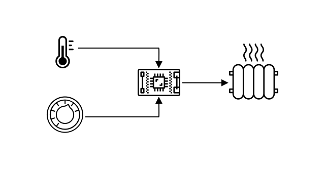

<!--
CO_OP_TRANSLATOR_METADATA:
{
  "original_hash": "9dd7f645ad1c6f20b72fee512987f772",
  "translation_date": "2025-08-26T15:17:51+00:00",
  "source_file": "1-getting-started/lessons/2-deeper-dive/README.md",
  "language_code": "es"
}
-->
# Una exploración más profunda en IoT

> Resumen visual por [Nitya Narasimhan](https://github.com/nitya). Haz clic en la imagen para verla en mayor tamaño.

Esta lección fue impartida como parte de la [serie Hello IoT](https://youtube.com/playlist?list=PLmsFUfdnGr3xRts0TIwyaHyQuHaNQcb6-) del [Microsoft Reactor](https://developer.microsoft.com/reactor/?WT.mc_id=academic-17441-jabenn). La lección se presentó en 2 videos: una clase de 1 hora y una sesión de preguntas y respuestas de 1 hora para profundizar en los temas y responder dudas.

> 🎥 Haz clic en las imágenes de arriba para ver los videos

## Cuestionario previo a la lección

[Cuestionario previo a la lección](https://black-meadow-040d15503.1.azurestaticapps.net/quiz/3)

## Introducción

En esta lección profundizaremos en algunos de los conceptos cubiertos en la lección anterior.

En esta lección veremos:

* [Componentes de una aplicación IoT](../../../../../1-getting-started/lessons/2-deeper-dive)
* [Exploración más profunda en microcontroladores](../../../../../1-getting-started/lessons/2-deeper-dive)
* [Exploración más profunda en computadoras de placa única](../../../../../1-getting-started/lessons/2-deeper-dive)

## Componentes de una aplicación IoT

Los dos componentes principales de una aplicación IoT son el *Internet* y el *dispositivo*. Veamos estos dos componentes con más detalle.

### El Dispositivo

La parte del **Dispositivo** en IoT se refiere a un aparato que puede interactuar con el mundo físico. Estos dispositivos suelen ser computadoras pequeñas y de bajo costo, que funcionan a bajas velocidades y consumen poca energía. Por ejemplo, microcontroladores simples con kilobytes de RAM (en lugar de gigabytes como en una PC) que operan a solo unos cientos de megahercios (en lugar de gigahercios como en una PC), pero que a veces consumen tan poca energía que pueden funcionar durante semanas, meses o incluso años con baterías.

Estos dispositivos interactúan con el mundo físico, ya sea utilizando sensores para recopilar datos de su entorno o controlando salidas o actuadores para realizar cambios físicos. Un ejemplo típico es un termostato inteligente: un dispositivo que tiene un sensor de temperatura, un medio para establecer una temperatura deseada como un dial o pantalla táctil, y una conexión a un sistema de calefacción o enfriamiento que puede encenderse cuando la temperatura detectada está fuera del rango deseado. El sensor de temperatura detecta que la habitación está demasiado fría y un actuador enciende la calefacción.

Existen una gran variedad de dispositivos que pueden actuar como dispositivos IoT, desde hardware dedicado que detecta una sola cosa, hasta dispositivos de propósito general, ¡incluso tu smartphone! Un smartphone puede usar sensores para detectar el mundo que lo rodea y actuadores para interactuar con él, por ejemplo, utilizando un sensor GPS para detectar tu ubicación y un altavoz para darte instrucciones de navegación hacia un destino.

✅ Piensa en otros sistemas que tengas a tu alrededor que lean datos de un sensor y los utilicen para tomar decisiones. Un ejemplo sería el termostato de un horno. ¿Puedes encontrar más?

### El Internet

La parte del **Internet** en una aplicación IoT consiste en aplicaciones a las que el dispositivo IoT puede conectarse para enviar y recibir datos, así como otras aplicaciones que pueden procesar los datos del dispositivo IoT y ayudar a tomar decisiones sobre qué solicitudes enviar a los actuadores del dispositivo IoT.

Una configuración típica sería tener algún tipo de servicio en la nube al que el dispositivo IoT se conecte, y este servicio en la nube maneja cosas como la seguridad, además de recibir mensajes del dispositivo IoT y enviar mensajes de vuelta al dispositivo. Este servicio en la nube luego se conecta a otras aplicaciones que pueden procesar o almacenar datos de sensores, o usar los datos de sensores junto con datos de otros sistemas para tomar decisiones.

Los dispositivos no siempre se conectan directamente a Internet a través de WiFi o conexiones cableadas. Algunos dispositivos usan redes en malla para comunicarse entre sí mediante tecnologías como Bluetooth, conectándose a través de un dispositivo central que tiene conexión a Internet.

En el ejemplo de un termostato inteligente, el termostato se conectaría usando WiFi doméstico a un servicio en la nube. Enviaría los datos de temperatura a este servicio en la nube, y desde allí se escribirían en una base de datos que permitiría al propietario verificar las temperaturas actuales y pasadas usando una aplicación en su teléfono. Otro servicio en la nube sabría qué temperatura desea el propietario y enviaría mensajes de vuelta al dispositivo IoT a través del servicio en la nube para indicarle al sistema de calefacción que se encienda o apague.

Una versión aún más inteligente podría usar IA en la nube con datos de otros sensores conectados a otros dispositivos IoT, como sensores de ocupación que detectan qué habitaciones están en uso, así como datos como el clima e incluso tu calendario, para tomar decisiones sobre cómo ajustar la temperatura de manera inteligente. Por ejemplo, podría apagar la calefacción si detecta en tu calendario que estás de vacaciones, o apagar la calefacción habitación por habitación dependiendo de cuáles usas, aprendiendo de los datos para ser cada vez más preciso con el tiempo.

✅ ¿Qué otros datos podrían ayudar a hacer un termostato conectado a Internet más inteligente?

### IoT en el Borde

Aunque la "I" en IoT significa Internet, estos dispositivos no siempre tienen que conectarse a Internet. En algunos casos, los dispositivos pueden conectarse a dispositivos de "borde" (edge) - dispositivos de puerta de enlace que funcionan en tu red local, lo que permite procesar datos sin necesidad de hacer una llamada a través de Internet. Esto puede ser más rápido cuando tienes una gran cantidad de datos o una conexión a Internet lenta, permite operar sin conexión donde la conectividad a Internet no es posible, como en un barco o en una zona de desastre al responder a una crisis humanitaria, y permite mantener los datos privados. Algunos dispositivos contienen código de procesamiento creado con herramientas en la nube y lo ejecutan localmente para recopilar y responder a datos sin usar una conexión a Internet para tomar decisiones.

Un ejemplo de esto es un dispositivo inteligente para el hogar como un Apple HomePod, Amazon Alexa o Google Home, que escucha tu voz utilizando modelos de IA entrenados en la nube, pero que se ejecutan localmente en el dispositivo. Estos dispositivos "despiertan" cuando se pronuncia una palabra o frase específica, y solo entonces envían tu voz a través de Internet para su procesamiento. El dispositivo deja de enviar datos de voz en un momento apropiado, como cuando detecta una pausa en tu discurso. Todo lo que dices antes de despertar al dispositivo con la palabra clave, y todo lo que dices después de que el dispositivo ha dejado de escuchar, no se envía a través de Internet al proveedor del dispositivo, y por lo tanto permanece privado.

✅ Piensa en otros escenarios donde la privacidad sea importante, de modo que el procesamiento de datos sería mejor realizarlo en el borde en lugar de en la nube. Como pista: piensa en dispositivos IoT con cámaras u otros dispositivos de imagen.

### Seguridad en IoT

Con cualquier conexión a Internet, la seguridad es una consideración importante. Existe un viejo chiste que dice que "la S en IoT significa Seguridad" - no hay una "S" en IoT, lo que implica que no es seguro.

Los dispositivos IoT se conectan a un servicio en la nube, y por lo tanto son tan seguros como ese servicio en la nube. Si tu servicio en la nube permite que cualquier dispositivo se conecte, entonces se pueden enviar datos maliciosos o pueden ocurrir ataques de virus. Esto puede tener consecuencias muy reales, ya que los dispositivos IoT interactúan y controlan otros dispositivos. Por ejemplo, el [gusano Stuxnet](https://wikipedia.org/wiki/Stuxnet) manipuló válvulas en centrifugadoras para dañarlas. Los hackers también han aprovechado [la mala seguridad para acceder a monitores de bebés](https://www.npr.org/sections/thetwo-way/2018/06/05/617196788/s-c-mom-says-baby-monitor-was-hacked-experts-say-many-devices-are-vulnerable) y otros dispositivos de vigilancia en el hogar.

> 💁 A veces, los dispositivos IoT y los dispositivos de borde funcionan en una red completamente aislada de Internet para mantener los datos privados y seguros. Esto se conoce como [air-gapping](https://wikipedia.org/wiki/Air_gap_(networking)).

## Exploración más profunda en microcontroladores

En la lección anterior, presentamos los microcontroladores. Ahora profundicemos en ellos.

### CPU

La CPU es el "cerebro" del microcontrolador. Es el procesador que ejecuta tu código y puede enviar y recibir datos de cualquier dispositivo conectado. Las CPUs pueden contener uno o más núcleos, que son esencialmente varias CPUs que pueden trabajar juntas para ejecutar tu código.

Las CPUs dependen de un reloj que marca millones o miles de millones de veces por segundo. Cada marca, o ciclo, sincroniza las acciones que la CPU puede realizar. Con cada marca, la CPU puede ejecutar una instrucción de un programa, como recuperar datos de un dispositivo externo o realizar un cálculo matemático. Este ciclo regular permite que todas las acciones se completen antes de que se procese la siguiente instrucción.

Cuanto más rápido sea el ciclo del reloj, más instrucciones se pueden procesar por segundo, y por lo tanto, más rápida será la CPU. Las velocidades de las CPUs se miden en [Hertz (Hz)](https://wikipedia.org/wiki/Hertz), una unidad estándar donde 1 Hz significa un ciclo o marca del reloj por segundo.

> 🎓 Las velocidades de las CPUs a menudo se dan en MHz o GHz. 1MHz es 1 millón de Hz, 1GHz es 1 mil millones de Hz.

> 💁 Las CPUs ejecutan programas utilizando el [ciclo de búsqueda-decodificación-ejecución](https://wikipedia.org/wiki/Instruction_cycle). Por cada marca del reloj, la CPU buscará la siguiente instrucción en la memoria, la decodificará y luego la ejecutará, como usar una unidad lógica aritmética (ALU) para sumar 2 números. Algunas ejecuciones tomarán varios ciclos para completarse, por lo que el siguiente ciclo se ejecutará en la siguiente marca después de que la instrucción haya terminado.

Los microcontroladores tienen velocidades de reloj mucho más bajas que las computadoras de escritorio o portátiles, o incluso la mayoría de los smartphones. Por ejemplo, el Wio Terminal tiene una CPU que funciona a 120MHz o 120,000,000 ciclos por segundo.

✅ Una PC o Mac promedio tiene una CPU con múltiples núcleos que funcionan a varios gigahercios, lo que significa que el reloj marca miles de millones de veces por segundo. Investiga la velocidad del reloj de tu computadora y compara cuántas veces es más rápida que el Wio Terminal.

Cada ciclo del reloj consume energía y genera calor. Cuanto más rápidas sean las marcas, más energía se consume y más calor se genera. Las PCs tienen disipadores de calor y ventiladores para eliminar el calor, sin los cuales se sobrecalentarían y se apagarían en segundos. Los microcontroladores a menudo no tienen ninguno de estos, ya que funcionan mucho más fríos y, por lo tanto, mucho más lentos. Las PCs funcionan con energía de red o baterías grandes durante unas pocas horas, mientras que los microcontroladores pueden funcionar durante días, meses o incluso años con baterías pequeñas. Los microcontroladores también pueden tener núcleos que funcionan a diferentes velocidades, cambiando a núcleos más lentos y de bajo consumo cuando la demanda en la CPU es baja para reducir el consumo de energía.

> 💁 Algunas PCs y Macs están adoptando la misma combinación de núcleos rápidos de alto rendimiento y núcleos más lentos de bajo consumo, cambiando entre ellos para ahorrar batería. Por ejemplo, el chip M1 en las últimas laptops de Apple puede alternar entre 4 núcleos de rendimiento y 4 núcleos de eficiencia para optimizar la duración de la batería o la velocidad dependiendo de la tarea que se esté ejecutando.

✅ Investiga un poco: Lee sobre las CPUs en el [artículo de Wikipedia sobre CPUs](https://wikipedia.org/wiki/Central_processing_unit)

#### Tarea

Investiga el Wio Terminal.

Si estás utilizando un Wio Terminal para estas lecciones, intenta encontrar la CPU. Busca la sección *Hardware Overview* en la [página del producto Wio Terminal](https://www.seeedstudio.com/Wio-Terminal-p-4509.html) para ver una imagen de los componentes internos, e intenta localizar la CPU a través de la ventana de plástico transparente en la parte trasera.

### Memoria

Los microcontroladores suelen tener dos tipos de memoria: memoria de programa y memoria de acceso aleatorio (RAM).

La memoria de programa es no volátil, lo que significa que lo que se escribe en ella permanece incluso cuando no hay energía en el dispositivo. Esta es la memoria que almacena el código de tu programa.

La RAM es la memoria utilizada por el programa para ejecutarse, conteniendo variables asignadas por tu programa y datos recopilados de periféricos. La RAM es volátil, lo que significa que cuando se corta la energía, su contenido se pierde, lo que efectivamente reinicia tu programa.
> 🎓 La memoria del programa almacena tu código y permanece incluso cuando no hay energía.
> 🎓 La RAM se utiliza para ejecutar tu programa y se reinicia cuando no hay energía

Al igual que con la CPU, la memoria en un microcontrolador es órdenes de magnitud más pequeña que en un PC o Mac. Un PC típico podría tener 8 Gigabytes (GB) de RAM, o 8,000,000,000 bytes, con cada byte teniendo suficiente espacio para almacenar una sola letra o un número del 0 al 255. Un microcontrolador tendría solo Kilobytes (KB) de RAM, siendo un kilobyte 1,000 bytes. El Wio Terminal mencionado anteriormente tiene 192KB de RAM, o 192,000 bytes, ¡más de 40,000 veces menos que un PC promedio!

El diagrama a continuación muestra la diferencia relativa de tamaño entre 192KB y 8GB: el pequeño punto en el centro representa 192KB.

El almacenamiento de programas también es más pequeño que en un PC. Un PC típico podría tener un disco duro de 500GB para almacenamiento de programas, mientras que un microcontrolador podría tener solo kilobytes o tal vez unos pocos megabytes (MB) de almacenamiento (1MB son 1,000KB, o 1,000,000 bytes). El Wio Terminal tiene 4MB de almacenamiento para programas.

✅ Investiga un poco: ¿Cuánta RAM y almacenamiento tiene la computadora que estás usando para leer esto? ¿Cómo se compara con un microcontrolador?

### Entrada/Salida

Los microcontroladores necesitan conexiones de entrada y salida (I/O) para leer datos de sensores y enviar señales de control a actuadores. Generalmente contienen varios pines de entrada/salida de propósito general (GPIO). Estos pines pueden configurarse en el software como entrada (es decir, reciben una señal) o salida (envían una señal).

🧠⬅️ Los pines de entrada se utilizan para leer valores de sensores.

🧠➡️ Los pines de salida envían instrucciones a actuadores.

✅ Aprenderás más sobre esto en una lección posterior.

#### Tarea

Investiga el Wio Terminal.

Si estás utilizando un Wio Terminal para estas lecciones, encuentra los pines GPIO. Busca la sección *Pinout diagram* en la [página del producto Wio Terminal](https://www.seeedstudio.com/Wio-Terminal-p-4509.html) para aprender qué pines son cuáles. El Wio Terminal viene con una pegatina que puedes montar en la parte trasera con los números de los pines, así que colócala ahora si no lo has hecho.

### Tamaño físico

Los microcontroladores suelen ser pequeños en tamaño, siendo el más pequeño, un [Freescale Kinetis KL03 MCU lo suficientemente pequeño como para caber en el hoyuelo de una pelota de golf](https://www.edn.com/tiny-arm-cortex-m0-based-mcu-shrinks-package/). Solo la CPU en un PC puede medir 40mm x 40mm, y eso sin incluir los disipadores de calor y ventiladores necesarios para garantizar que la CPU pueda funcionar más de unos segundos sin sobrecalentarse, siendo sustancialmente más grande que un microcontrolador completo. El kit de desarrollo Wio Terminal con un microcontrolador, carcasa, pantalla y una gama de conexiones y componentes no es mucho más grande que una CPU Intel i9 desnuda, y sustancialmente más pequeño que la CPU con un disipador de calor y ventilador.

| Dispositivo                      | Tamaño                |
| -------------------------------- | --------------------- |
| Freescale Kinetis KL03           | 1.6mm x 2mm x 1mm     |
| Wio Terminal                     | 72mm x 57mm x 12mm    |
| Intel i9 CPU, disipador y ventilador | 136mm x 145mm x 103mm |

### Frameworks y sistemas operativos

Debido a su baja velocidad y tamaño de memoria, los microcontroladores no ejecutan un sistema operativo (OS) en el sentido de escritorio de la palabra. El sistema operativo que hace que tu computadora funcione (Windows, Linux o macOS) necesita mucha memoria y potencia de procesamiento para ejecutar tareas que son completamente innecesarias para un microcontrolador. Recuerda que los microcontroladores suelen programarse para realizar una o más tareas muy específicas, a diferencia de una computadora de propósito general como un PC o Mac que necesita soportar una interfaz de usuario, reproducir música o películas, proporcionar herramientas para escribir documentos o código, jugar o navegar por Internet.

Para programar un microcontrolador sin un OS necesitas algunas herramientas que te permitan construir tu código de una manera que el microcontrolador pueda ejecutar, utilizando APIs que puedan comunicarse con cualquier periférico. Cada microcontrolador es diferente, por lo que los fabricantes normalmente soportan frameworks estándar que te permiten seguir una 'receta' estándar para construir tu código y ejecutarlo en cualquier microcontrolador que soporte ese framework.

Puedes programar microcontroladores utilizando un OS, a menudo referido como un sistema operativo en tiempo real (RTOS), ya que están diseñados para manejar el envío de datos hacia y desde periféricos en tiempo real. Estos sistemas operativos son muy ligeros y proporcionan características como:

* Multitarea, permitiendo que tu código ejecute más de un bloque de código al mismo tiempo, ya sea en múltiples núcleos o turnándose en un núcleo.
* Redes para permitir la comunicación segura a través de Internet.
* Componentes de interfaz gráfica de usuario (GUI) para construir interfaces de usuario (UI) en dispositivos que tienen pantallas.

✅ Investiga algunos RTOS diferentes: [Azure RTOS](https://azure.microsoft.com/services/rtos/?WT.mc_id=academic-17441-jabenn), [FreeRTOS](https://www.freertos.org), [Zephyr](https://www.zephyrproject.org)

#### Arduino

[Arduino](https://www.arduino.cc) es probablemente el framework de microcontroladores más popular, especialmente entre estudiantes, aficionados y creadores. Arduino es una plataforma de electrónica de código abierto que combina software y hardware. Puedes comprar placas compatibles con Arduino de Arduino mismo o de otros fabricantes, y luego programarlas utilizando el framework Arduino.

Las placas Arduino se programan en C o C++. Usar C/C++ permite que tu código se compile de manera muy compacta y se ejecute rápidamente, algo necesario en un dispositivo con recursos limitados como un microcontrolador. El núcleo de una aplicación Arduino se conoce como un sketch y es código C/C++ con 2 funciones: `setup` y `loop`. Cuando la placa se inicia, el código del framework Arduino ejecutará la función `setup` una vez, y luego ejecutará la función `loop` una y otra vez, ejecutándola continuamente hasta que se apague la energía.

Escribirías tu código de configuración en la función `setup`, como conectarte a WiFi y servicios en la nube o inicializar pines para entrada y salida. Tu código de bucle estaría en la función `loop`, como leer de un sensor y enviar el valor a la nube. Normalmente incluirías un retraso en cada bucle, por ejemplo, si solo quieres que los datos del sensor se envíen cada 10 segundos, agregarías un retraso de 10 segundos al final del bucle para que el microcontrolador pueda dormir, ahorrando energía, y luego ejecutar el bucle nuevamente cuando sea necesario 10 segundos después.

✅ Esta arquitectura de programa se conoce como un *bucle de eventos* o *bucle de mensajes*. Muchas aplicaciones utilizan esto en segundo plano y es el estándar para la mayoría de las aplicaciones de escritorio que se ejecutan en sistemas operativos como Windows, macOS o Linux. El `loop` escucha mensajes de componentes de la interfaz de usuario como botones o dispositivos como el teclado, y responde a ellos. Puedes leer más en este [artículo sobre el bucle de eventos](https://wikipedia.org/wiki/Event_loop).

Arduino proporciona bibliotecas estándar para interactuar con microcontroladores y los pines de I/O, con diferentes implementaciones internas para ejecutarse en diferentes microcontroladores. Por ejemplo, la función [`delay`](https://www.arduino.cc/reference/en/language/functions/time/delay/) pausará el programa durante un período de tiempo dado, la función [`digitalRead`](https://www.arduino.cc/reference/en/language/functions/digital-io/digitalread/) leerá un valor de `HIGH` o `LOW` del pin dado, independientemente de en qué placa se ejecute el código. Estas bibliotecas estándar significan que el código Arduino escrito para una placa puede recompilarse para cualquier otra placa Arduino y funcionará, suponiendo que los pines sean los mismos y las placas soporten las mismas características.

Existe un gran ecosistema de bibliotecas de terceros para Arduino que te permiten agregar características adicionales a tus proyectos Arduino, como usar sensores y actuadores o conectarte a servicios IoT en la nube.

##### Tarea

Investiga el Wio Terminal.

Si estás utilizando un Wio Terminal para estas lecciones, vuelve a leer el código que escribiste en la última lección. Encuentra las funciones `setup` y `loop`. Monitorea la salida serial para ver cómo se llama repetidamente a la función `loop`. Intenta agregar código a la función `setup` para escribir en el puerto serial y observa que este código solo se llama una vez cada vez que reinicias. Intenta reiniciar tu dispositivo con el interruptor de encendido en el lateral para mostrar que esto se llama cada vez que el dispositivo se reinicia.

## Exploración más profunda de las computadoras de placa única

En la última lección, introdujimos las computadoras de placa única. Ahora profundicemos en ellas.

### Raspberry Pi

La [Fundación Raspberry Pi](https://www.raspberrypi.org) es una organización benéfica del Reino Unido fundada en 2009 para promover el estudio de la informática, especialmente a nivel escolar. Como parte de esta misión, desarrollaron una computadora de placa única, llamada Raspberry Pi. Actualmente, las Raspberry Pi están disponibles en 3 variantes: una versión de tamaño completo, la más pequeña Pi Zero, y un módulo de computación que puede integrarse en tu dispositivo IoT final.

La última iteración de la Raspberry Pi de tamaño completo es la Raspberry Pi 4B. Esta tiene una CPU de cuatro núcleos (4 núcleos) que funciona a 1.5GHz, 2, 4 u 8GB de RAM, ethernet gigabit, WiFi, 2 puertos HDMI que soportan pantallas 4k, un puerto de salida de audio y video compuesto, puertos USB (2 USB 2.0, 2 USB 3.0), 40 pines GPIO, un conector para cámara para un módulo de cámara Raspberry Pi, y una ranura para tarjeta SD. Todo esto en una placa que mide 88mm x 58mm x 19.5mm y se alimenta con una fuente de alimentación USB-C de 3A. Estas comienzan en US$35, mucho más baratas que un PC o Mac.

> 💁 También hay una Pi400, una computadora todo en uno con una Pi4 integrada en un teclado.

El Pi Zero es mucho más pequeño y de menor potencia. Tiene una CPU de un solo núcleo a 1GHz, 512MB de RAM, WiFi (en el modelo Zero W), un solo puerto HDMI, un puerto micro-USB, 40 pines GPIO, un conector para cámara para un módulo de cámara Raspberry Pi, y una ranura para tarjeta SD. Mide 65mm x 30mm x 5mm y consume muy poca energía. El Zero cuesta US$5, mientras que la versión W con WiFi cuesta US$10.

> 🎓 Las CPUs en ambos dispositivos son procesadores ARM, a diferencia de los procesadores Intel/AMD x86 o x64 que encuentras en la mayoría de los PCs y Macs. Son similares a las CPUs que encuentras en algunos microcontroladores, así como en casi todos los teléfonos móviles, el Microsoft Surface X y los nuevos Macs basados en Apple Silicon.

Todas las variantes de Raspberry Pi ejecutan una versión de Debian Linux llamada Raspberry Pi OS. Está disponible en una versión ligera sin escritorio, perfecta para proyectos 'headless' donde no necesitas una pantalla, o una versión completa con un entorno de escritorio completo, con navegador web, aplicaciones de oficina, herramientas de programación y juegos. Como el sistema operativo es una versión de Debian Linux, puedes instalar cualquier aplicación o herramienta que funcione en Debian y esté construida para el procesador ARM dentro del Pi.

#### Tarea

Investiga el Raspberry Pi.

Si estás utilizando un Raspberry Pi para estas lecciones, lee sobre los diferentes componentes de hardware en la placa.

* Puedes encontrar detalles sobre los procesadores utilizados en la [página de documentación de hardware de Raspberry Pi](https://www.raspberrypi.org/documentation/hardware/raspberrypi/). Lee sobre el procesador utilizado en el Pi que estás usando.
* Localiza los pines GPIO. Lee más sobre ellos en la [documentación GPIO de Raspberry Pi](https://www.raspberrypi.org/documentation/hardware/raspberrypi/gpio/README.md). Usa la [guía de uso de pines GPIO](https://www.raspberrypi.org/documentation/usage/gpio/README.md) para identificar los diferentes pines en tu Pi.

### Programación de computadoras de placa única

Las computadoras de placa única son computadoras completas que ejecutan un sistema operativo completo. Esto significa que hay una amplia gama de lenguajes de programación, frameworks y herramientas que puedes usar para programarlas, a diferencia de los microcontroladores que dependen del soporte de la placa en frameworks como Arduino. La mayoría de los lenguajes de programación tienen bibliotecas que pueden acceder a los pines GPIO para enviar y recibir datos de sensores y actuadores.

✅ ¿Qué lenguajes de programación conoces? ¿Son compatibles con Linux?

El lenguaje de programación más común para construir aplicaciones IoT en un Raspberry Pi es Python. Existe un enorme ecosistema de hardware diseñado para el Pi, y casi todos incluyen el código necesario para usarlos como bibliotecas de Python. Algunos de estos ecosistemas están basados en 'hats' (sombreros), llamados así porque se colocan encima del Pi como un sombrero y se conectan con un gran conector a los 40 pines GPIO. Estos hats proporcionan capacidades adicionales, como pantallas, sensores, autos controlados remotamente o adaptadores para conectar sensores con cables estandarizados.
### Uso de computadoras de placa única en implementaciones profesionales de IoT

Las computadoras de placa única se utilizan en implementaciones profesionales de IoT, no solo como kits de desarrollo. Pueden ser una forma poderosa de controlar hardware y ejecutar tareas complejas, como modelos de aprendizaje automático. Por ejemplo, existe un [módulo de cómputo Raspberry Pi 4](https://www.raspberrypi.org/blog/raspberry-pi-compute-module-4/) que ofrece toda la potencia de una Raspberry Pi 4 pero en un formato compacto y más económico, sin la mayoría de los puertos, diseñado para ser instalado en hardware personalizado.

---

## 🚀 Desafío

El desafío de la última lección fue enumerar tantos dispositivos IoT como puedas que estén en tu hogar, escuela o lugar de trabajo. Para cada dispositivo en esta lista, ¿crees que están construidos alrededor de microcontroladores, computadoras de placa única o incluso una mezcla de ambos?

## Cuestionario posterior a la lección

[Cuestionario posterior a la lección](https://black-meadow-040d15503.1.azurestaticapps.net/quiz/4)

## Revisión y estudio autónomo

* Lee la [guía de introducción a Arduino](https://www.arduino.cc/en/Guide/Introduction) para entender más sobre la plataforma Arduino.
* Lee la [introducción a la Raspberry Pi 4](https://www.raspberrypi.org/products/raspberry-pi-4-model-b/) para aprender más sobre las Raspberry Pi.
* Aprende más sobre algunos de los conceptos y acrónimos en el artículo [¿Qué son los CPUs, MPUs, MCUs y GPUs? en la revista Electrical Engineering Journal](https://www.eejournal.com/article/what-the-faq-are-cpus-mpus-mcus-and-gpus/).

✅ Utiliza estas guías, junto con los costos mostrados siguiendo los enlaces en la [guía de hardware](../../../hardware.md) para decidir qué plataforma de hardware deseas usar, o si prefieres usar un dispositivo virtual.

## Tarea

[Compara y contrasta microcontroladores y computadoras de placa única](assignment.md)

---

**Descargo de responsabilidad**:  
Este documento ha sido traducido utilizando el servicio de traducción automática [Co-op Translator](https://github.com/Azure/co-op-translator). Aunque nos esforzamos por garantizar la precisión, tenga en cuenta que las traducciones automatizadas pueden contener errores o imprecisiones. El documento original en su idioma nativo debe considerarse como la fuente autorizada. Para información crítica, se recomienda una traducción profesional realizada por humanos. No nos hacemos responsables de malentendidos o interpretaciones erróneas que puedan surgir del uso de esta traducción.