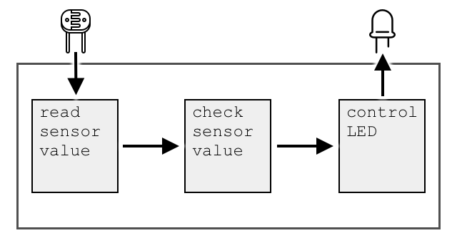

<!--
CO_OP_TRANSLATOR_METADATA:
{
  "original_hash": "e9ee00eb5fc55922a73762acc542166b",
  "translation_date": "2025-08-26T15:04:04+00:00",
  "source_file": "1-getting-started/lessons/3-sensors-and-actuators/README.md",
  "language_code": "es"
}
-->
# Interactúa con el mundo físico con sensores y actuadores


> Sketchnote por [Nitya Narasimhan](https://github.com/nitya). Haz clic en la imagen para una versión más grande.

Esta lección fue impartida como parte de la [serie Hello IoT](https://youtube.com/playlist?list=PLmsFUfdnGr3xRts0TIwyaHyQuHaNQcb6-) del [Microsoft Reactor](https://developer.microsoft.com/reactor/?WT.mc_id=academic-17441-jabenn). La lección se enseñó en 2 videos: una clase de 1 hora y una sesión de preguntas y respuestas de 1 hora para profundizar en partes de la lección y responder preguntas.

[](https://youtu.be/Lqalu1v6aF4)

[](https://youtu.be/qR3ekcMlLWA)

> 🎥 Haz clic en las imágenes de arriba para ver los videos

## Cuestionario previo a la lección

[Cuestionario previo a la lección](https://black-meadow-040d15503.1.azurestaticapps.net/quiz/5)

## Introducción

Esta lección introduce dos conceptos importantes para tu dispositivo IoT: sensores y actuadores. También trabajarás con ambos, añadiendo un sensor de luz a tu proyecto IoT y luego un LED controlado por niveles de luz, creando efectivamente una luz nocturna.

En esta lección cubriremos:

* [¿Qué son los sensores?](../../../../../1-getting-started/lessons/3-sensors-and-actuators)
* [Usar un sensor](../../../../../1-getting-started/lessons/3-sensors-and-actuators)
* [Tipos de sensores](../../../../../1-getting-started/lessons/3-sensors-and-actuators)
* [¿Qué son los actuadores?](../../../../../1-getting-started/lessons/3-sensors-and-actuators)
* [Usar un actuador](../../../../../1-getting-started/lessons/3-sensors-and-actuators)
* [Tipos de actuadores](../../../../../1-getting-started/lessons/3-sensors-and-actuators)

## ¿Qué son los sensores?

Los sensores son dispositivos de hardware que detectan el mundo físico, es decir, miden una o más propiedades a su alrededor y envían la información a un dispositivo IoT. Los sensores abarcan una amplia gama de dispositivos, ya que hay muchas cosas que se pueden medir, desde propiedades naturales como la temperatura del aire hasta interacciones físicas como el movimiento.

Algunos sensores comunes incluyen:

* Sensores de temperatura: detectan la temperatura del aire o la temperatura de lo que están inmersos. Para aficionados y desarrolladores, a menudo se combinan con presión de aire y humedad en un solo sensor.
* Botones: detectan cuando han sido presionados.
* Sensores de luz: detectan niveles de luz y pueden ser para colores específicos, luz UV, luz IR o luz visible en general.
* Cámaras: detectan una representación visual del mundo tomando una fotografía o transmitiendo video.
* Acelerómetros: detectan movimiento en múltiples direcciones.
* Micrófonos: detectan sonido, ya sea niveles generales de sonido o sonido direccional.

✅ Investiga un poco. ¿Qué sensores tiene tu teléfono?

Todos los sensores tienen algo en común: convierten lo que detectan en una señal eléctrica que puede ser interpretada por un dispositivo IoT. Cómo se interpreta esta señal eléctrica depende del sensor, así como del protocolo de comunicación utilizado para comunicarse con el dispositivo IoT.

## Usar un sensor

Sigue la guía correspondiente a continuación para añadir un sensor a tu dispositivo IoT:

* [Arduino - Wio Terminal](wio-terminal-sensor.md)
* [Computadora de placa única - Raspberry Pi](pi-sensor.md)
* [Computadora de placa única - Dispositivo virtual](virtual-device-sensor.md)

## Tipos de sensores

Los sensores pueden ser analógicos o digitales.

### Sensores analógicos

Algunos de los sensores más básicos son analógicos. Estos sensores reciben un voltaje del dispositivo IoT, los componentes del sensor ajustan este voltaje, y el voltaje que regresa del sensor se mide para obtener el valor del sensor.

> 🎓 El voltaje es una medida de cuánta fuerza hay para mover electricidad de un lugar a otro, como desde el terminal positivo de una batería al terminal negativo. Por ejemplo, una batería AA estándar es de 1.5V (V es el símbolo de voltios) y puede empujar electricidad con una fuerza de 1.5V desde su terminal positivo a su terminal negativo. Diferentes componentes eléctricos requieren diferentes voltajes para funcionar, por ejemplo, un LED puede iluminarse con entre 2-3V, pero una bombilla incandescente de 100W necesitaría 240V. Puedes leer más sobre voltaje en la [página de Voltaje en Wikipedia](https://wikipedia.org/wiki/Voltage).

Un ejemplo de esto es un potenciómetro. Este es un dial que puedes girar entre dos posiciones y el sensor mide la rotación.


El dispositivo IoT enviará una señal eléctrica al potenciómetro a un voltaje, como 5 voltios (5V). A medida que se ajusta el potenciómetro, cambia el voltaje que sale del otro lado. Imagina que tienes un potenciómetro etiquetado como un dial que va de 0 a [11](https://wikipedia.org/wiki/Up_to_eleven), como un control de volumen en un amplificador. Cuando el potenciómetro está en la posición completamente apagada (0), entonces saldrán 0V (0 voltios). Cuando está en la posición completamente encendida (11), saldrán 5V (5 voltios).

> 🎓 Esto es una simplificación, y puedes leer más sobre potenciómetros y resistencias variables en la [página de Wikipedia sobre potenciómetros](https://wikipedia.org/wiki/Potentiometer).

El voltaje que sale del sensor es leído por el dispositivo IoT, y el dispositivo puede responder a él. Dependiendo del sensor, este voltaje puede ser un valor arbitrario o puede mapearse a una unidad estándar. Por ejemplo, un sensor de temperatura analógico basado en un [termistor](https://wikipedia.org/wiki/Thermistor) cambia su resistencia dependiendo de la temperatura. El voltaje de salida puede luego convertirse en una temperatura en Kelvin, y correspondientemente en °C o °F, mediante cálculos en el código.

✅ ¿Qué crees que sucede si el sensor devuelve un voltaje más alto del que se envió (por ejemplo, proveniente de una fuente de alimentación externa)? ⛔️ NO pruebes esto.

#### Conversión de analógico a digital

Los dispositivos IoT son digitales: no pueden trabajar con valores analógicos, solo trabajan con 0s y 1s. Esto significa que los valores de los sensores analógicos necesitan convertirse en una señal digital antes de que puedan ser procesados. Muchos dispositivos IoT tienen convertidores de analógico a digital (ADCs) para convertir entradas analógicas en representaciones digitales de su valor. Los sensores también pueden trabajar con ADCs a través de una placa conectora. Por ejemplo, en el ecosistema Seeed Grove con una Raspberry Pi, los sensores analógicos se conectan a puertos específicos en un 'hat' que se coloca sobre la Pi conectado a los pines GPIO de la Pi, y este hat tiene un ADC para convertir el voltaje en una señal digital que puede enviarse desde los pines GPIO de la Pi.

Imagina que tienes un sensor de luz analógico conectado a un dispositivo IoT que usa 3.3V y está devolviendo un valor de 1V. Este 1V no significa nada en el mundo digital, por lo que necesita ser convertido. El voltaje será convertido a un valor analógico usando una escala dependiendo del dispositivo y sensor. Un ejemplo es el sensor de luz Seeed Grove que emite valores de 0 a 1,023. Para este sensor funcionando a 3.3V, una salida de 1V sería un valor de 300. Un dispositivo IoT no puede manejar 300 como un valor analógico, por lo que el valor sería convertido a `0000000100101100`, la representación binaria de 300 por el hat Grove. Esto luego sería procesado por el dispositivo IoT.

✅ Si no conoces el sistema binario, investiga un poco para aprender cómo los números se representan con 0s y 1s. La [lección introductoria al sistema binario de BBC Bitesize](https://www.bbc.co.uk/bitesize/guides/zwsbwmn/revision/1) es un excelente lugar para comenzar.

Desde una perspectiva de programación, todo esto generalmente es manejado por bibliotecas que vienen con los sensores, por lo que no necesitas preocuparte por esta conversión tú mismo. Para el sensor de luz Grove, usarías la biblioteca de Python y llamarías a la propiedad `light`, o usarías la biblioteca de Arduino y llamarías a `analogRead` para obtener un valor de 300.

### Sensores digitales

Los sensores digitales, al igual que los sensores analógicos, detectan el mundo que los rodea utilizando cambios en el voltaje eléctrico. La diferencia es que emiten una señal digital, ya sea midiendo solo dos estados o utilizando un ADC incorporado. Los sensores digitales son cada vez más comunes para evitar la necesidad de usar un ADC ya sea en una placa conectora o en el propio dispositivo IoT.

El sensor digital más simple es un botón o interruptor. Este es un sensor con dos estados: encendido o apagado.


Los pines en dispositivos IoT como los pines GPIO pueden medir esta señal directamente como un 0 o 1. Si el voltaje enviado es el mismo que el voltaje devuelto, el valor leído es 1; de lo contrario, el valor leído es 0. No hay necesidad de convertir la señal, solo puede ser 1 o 0.

> 💁 Los voltajes nunca son exactos, especialmente porque los componentes en un sensor tendrán algo de resistencia, por lo que generalmente hay una tolerancia. Por ejemplo, los pines GPIO en una Raspberry Pi funcionan con 3.3V y leen una señal de retorno por encima de 1.8V como un 1, por debajo de 1.8V como 0.

* 3.3V entran al botón. El botón está apagado, por lo que salen 0V, dando un valor de 0.
* 3.3V entran al botón. El botón está encendido, por lo que salen 3.3V, dando un valor de 1.

Los sensores digitales más avanzados leen valores analógicos y luego los convierten utilizando ADCs integrados en señales digitales. Por ejemplo, un sensor de temperatura digital aún utilizará un termopar de la misma manera que un sensor analógico y aún medirá el cambio en el voltaje causado por la resistencia del termopar a la temperatura actual. En lugar de devolver un valor analógico y depender del dispositivo o placa conectora para convertirlo en una señal digital, un ADC incorporado en el sensor convertirá el valor y lo enviará como una serie de 0s y 1s al dispositivo IoT. Estos 0s y 1s se envían de la misma manera que la señal digital de un botón, con 1 siendo el voltaje completo y 0 siendo 0V.


Enviar datos digitales permite que los sensores sean más complejos y envíen datos más detallados, incluso datos encriptados para sensores seguros. Un ejemplo es una cámara. Este es un sensor que captura una imagen y la envía como datos digitales que contienen esa imagen, generalmente en un formato comprimido como JPEG, para ser leído por el dispositivo IoT. Incluso puede transmitir video capturando imágenes y enviando ya sea el marco completo imagen por imagen o una transmisión de video comprimida.

## ¿Qué son los actuadores?

Los actuadores son lo opuesto a los sensores: convierten una señal eléctrica de tu dispositivo IoT en una interacción con el mundo físico, como emitir luz o sonido, o mover un motor.

Algunos actuadores comunes incluyen:

* LED: emiten luz cuando se encienden.
* Altavoz: emiten sonido basado en la señal enviada, desde un simple zumbador hasta un altavoz de audio que puede reproducir música.
* Motor paso a paso: convierten una señal en una cantidad definida de rotación, como girar un dial 90°.
* Relé: son interruptores que pueden encenderse o apagarse mediante una señal eléctrica. Permiten que un pequeño voltaje de un dispositivo IoT encienda voltajes más grandes.
* Pantallas: son actuadores más complejos y muestran información en una pantalla de múltiples segmentos. Las pantallas varían desde simples pantallas LED hasta monitores de video de alta resolución.

✅ Investiga un poco. ¿Qué actuadores tiene tu teléfono?

## Usar un actuador

Sigue la guía correspondiente a continuación para añadir un actuador a tu dispositivo IoT, controlado por el sensor, para construir una luz nocturna IoT. Recogerá niveles de luz del sensor de luz y usará un actuador en forma de LED para emitir luz cuando el nivel de luz detectado sea demasiado bajo.



* [Arduino - Wio Terminal](wio-terminal-actuator.md)
* [Computadora de placa única - Raspberry Pi](pi-actuator.md)
* [Computadora de placa única - Dispositivo virtual](virtual-device-actuator.md)

## Tipos de actuadores

Al igual que los sensores, los actuadores pueden ser analógicos o digitales.

### Actuadores analógicos

Los actuadores analógicos toman una señal analógica y la convierten en algún tipo de interacción, donde la interacción cambia según el voltaje suministrado.

Un ejemplo es una luz regulable, como las que podrías tener en tu casa. La cantidad de voltaje suministrado a la luz determina qué tan brillante es.


Al igual que con los sensores, el dispositivo IoT real funciona con señales digitales, no analógicas. Esto significa que, para enviar una señal analógica, el dispositivo IoT necesita un convertidor digital a analógico (DAC), ya sea directamente en el dispositivo IoT o en una placa de conexión. Esto convertirá los 0s y 1s del dispositivo IoT en un voltaje analógico que el actuador pueda usar.

✅ ¿Qué crees que sucede si el dispositivo IoT envía un voltaje más alto del que el actuador puede manejar?  
⛔️ NO pruebes esto.

#### Modulación por Ancho de Pulso

Otra opción para convertir señales digitales de un dispositivo IoT en una señal analógica es la modulación por ancho de pulso (PWM, por sus siglas en inglés). Esto implica enviar muchos pulsos digitales cortos que actúan como si fueran una señal analógica.

Por ejemplo, puedes usar PWM para controlar la velocidad de un motor.

Imagina que estás controlando un motor con un suministro de 5V. Envías un pulso corto a tu motor, cambiando el voltaje a alto (5V) durante dos centésimas de segundo (0.02s). En ese tiempo, tu motor puede girar una décima de vuelta, o 36°. Luego, la señal se detiene durante dos centésimas de segundo (0.02s), enviando una señal baja (0V). Cada ciclo de encendido y apagado dura 0.04s. El ciclo se repite.


Esto significa que en un segundo tienes 25 pulsos de 5V de 0.02s que hacen girar el motor, seguidos de 0.02s de pausa de 0V en los que el motor no gira. Cada pulso hace que el motor gire una décima de vuelta, lo que significa que el motor completa 2.5 vueltas por segundo. Has usado una señal digital para hacer girar el motor a 2.5 vueltas por segundo, o 150 [revoluciones por minuto](https://wikipedia.org/wiki/Revolutions_per_minute) (una medida no estándar de velocidad de rotación).

```output
25 pulses per second x 0.1 rotations per pulse = 2.5 rotations per second
2.5 rotations per second x 60 seconds in a minute = 150rpm
```

> 🎓 Cuando una señal PWM está activa la mitad del tiempo y desactivada la otra mitad, se le llama [ciclo de trabajo del 50%](https://wikipedia.org/wiki/Duty_cycle). Los ciclos de trabajo se miden como el porcentaje de tiempo que la señal está en estado activo en comparación con el estado inactivo.


Puedes cambiar la velocidad del motor ajustando el tamaño de los pulsos. Por ejemplo, con el mismo motor puedes mantener el mismo tiempo de ciclo de 0.04s, pero reducir el pulso activo a la mitad (0.01s) y aumentar el pulso inactivo a 0.03s. Tienes el mismo número de pulsos por segundo (25), pero cada pulso activo dura la mitad. Un pulso de la mitad de duración solo hace girar el motor una vigésima parte de una vuelta, y con 25 pulsos por segundo completará 1.25 vueltas por segundo o 75rpm. Al cambiar la duración de los pulsos de una señal digital, has reducido a la mitad la velocidad de un motor analógico.

```output
25 pulses per second x 0.05 rotations per pulse = 1.25 rotations per second
1.25 rotations per second x 60 seconds in a minute = 75rpm
```

✅ ¿Cómo mantendrías la rotación del motor suave, especialmente a bajas velocidades? ¿Usarías un pequeño número de pulsos largos con pausas largas o muchos pulsos muy cortos con pausas muy cortas?

> 💁 Algunos sensores también usan PWM para convertir señales analógicas en señales digitales.

> 🎓 Puedes leer más sobre la modulación por ancho de pulso en la [página de Wikipedia sobre modulación por ancho de pulso](https://wikipedia.org/wiki/Pulse-width_modulation).

### Actuadores digitales

Los actuadores digitales, al igual que los sensores digitales, tienen dos estados controlados por un voltaje alto o bajo, o tienen un DAC incorporado que les permite convertir una señal digital en una analógica.

Un actuador digital simple es un LED. Cuando un dispositivo envía una señal digital de 1, se envía un voltaje alto que enciende el LED. Cuando se envía una señal digital de 0, el voltaje cae a 0V y el LED se apaga.


✅ ¿Qué otros actuadores simples de dos estados se te ocurren? Un ejemplo es un solenoide, que es un electroimán que puede activarse para hacer cosas como mover un cerrojo de puerta para bloquear/desbloquear una puerta.

Los actuadores digitales más avanzados, como las pantallas, requieren que los datos digitales se envíen en ciertos formatos. Por lo general, vienen con bibliotecas que facilitan el envío de los datos correctos para controlarlos.

---

## 🚀 Desafío

El desafío en las dos últimas lecciones fue enumerar tantos dispositivos IoT como puedas que estén en tu hogar, escuela o lugar de trabajo y decidir si están construidos alrededor de microcontroladores o computadoras de placa única, o incluso una mezcla de ambos.

Para cada dispositivo que enumeraste, ¿a qué sensores y actuadores están conectados? ¿Cuál es el propósito de cada sensor y actuador conectado a estos dispositivos?

## Cuestionario posterior a la lección

[Cuestionario posterior a la lección](https://black-meadow-040d15503.1.azurestaticapps.net/quiz/6)

## Revisión y autoestudio

* Lee sobre electricidad y circuitos en [ThingLearn](http://thinglearn.jenlooper.com/curriculum/).  
* Lee sobre los diferentes tipos de sensores de temperatura en la [guía de sensores de temperatura de Seeed Studios](https://www.seeedstudio.com/blog/2019/10/14/temperature-sensors-for-arduino-projects/).  
* Lee sobre LEDs en la [página de Wikipedia sobre LEDs](https://wikipedia.org/wiki/Light-emitting_diode).  

## Tarea

[Investiga sensores y actuadores](assignment.md)  

---

**Descargo de responsabilidad**:  
Este documento ha sido traducido utilizando el servicio de traducción automática [Co-op Translator](https://github.com/Azure/co-op-translator). Si bien nos esforzamos por garantizar la precisión, tenga en cuenta que las traducciones automatizadas pueden contener errores o imprecisiones. El documento original en su idioma nativo debe considerarse la fuente autorizada. Para información crítica, se recomienda una traducción profesional realizada por humanos. No nos hacemos responsables de malentendidos o interpretaciones erróneas que puedan surgir del uso de esta traducción.