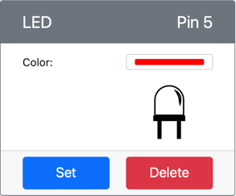

<!--
CO_OP_TRANSLATOR_METADATA:
{
  "original_hash": "9c640f93263fd9adbfda920739e09feb",
  "translation_date": "2025-08-26T15:07:19+00:00",
  "source_file": "1-getting-started/lessons/3-sensors-and-actuators/virtual-device-actuator.md",
  "language_code": "es"
}
-->
# Construir una luz nocturna - Hardware IoT Virtual

En esta parte de la lección, agregarás un LED a tu dispositivo IoT virtual y lo usarás para crear una luz nocturna.

## Hardware Virtual

La luz nocturna necesita un actuador, creado en la aplicación CounterFit.

El actuador es un **LED**. En un dispositivo IoT físico, sería un [diodo emisor de luz](https://wikipedia.org/wiki/Light-emitting_diode) que emite luz cuando la corriente fluye a través de él. Este es un actuador digital que tiene 2 estados: encendido y apagado. Enviar un valor de 1 enciende el LED, y un valor de 0 lo apaga.

La lógica de la luz nocturna en pseudocódigo es:

```output
Check the light level.
If the light is less than 300
    Turn the LED on
Otherwise
    Turn the LED off
```

### Agregar el actuador a CounterFit

Para usar un LED virtual, necesitas agregarlo a la aplicación CounterFit.

#### Tarea - agregar el actuador a CounterFit

Agrega el LED a la aplicación CounterFit.

1. Asegúrate de que la aplicación web CounterFit esté ejecutándose desde la parte anterior de esta tarea. Si no, iníciala y vuelve a agregar el sensor de luz.

1. Crea un LED:

    1. En el cuadro *Create actuator* en el panel *Actuator*, despliega el cuadro *Actuator type* y selecciona *LED*.

    1. Configura el *Pin* en *5*.

    1. Selecciona el botón **Add** para crear el LED en el Pin 5.

    

    El LED será creado y aparecerá en la lista de actuadores.

    

    Una vez que el LED haya sido creado, puedes cambiar el color usando el selector *Color*. Selecciona el botón **Set** para cambiar el color después de haberlo seleccionado.

### Programar la luz nocturna

La luz nocturna ahora puede ser programada usando el sensor de luz y el LED de CounterFit.

#### Tarea - programar la luz nocturna

Programa la luz nocturna.

1. Abre el proyecto de luz nocturna en VS Code que creaste en la parte anterior de esta tarea. Mata y vuelve a crear el terminal para asegurarte de que se esté ejecutando usando el entorno virtual si es necesario.

1. Abre el archivo `app.py`.

1. Agrega el siguiente código al archivo `app.py` para importar una biblioteca requerida. Esto debe ser agregado al principio, debajo de las otras líneas de `import`.

    ```python
    from counterfit_shims_grove.grove_led import GroveLed
    ```

    La declaración `from counterfit_shims_grove.grove_led import GroveLed` importa el `GroveLed` de las bibliotecas shim de Python de CounterFit Grove. Esta biblioteca tiene código para interactuar con un LED creado en la aplicación CounterFit.

1. Agrega el siguiente código después de la declaración de `light_sensor` para crear una instancia de la clase que gestiona el LED:

    ```python
    led = GroveLed(5)
    ```

    La línea `led = GroveLed(5)` crea una instancia de la clase `GroveLed` conectándose al pin **5** - el pin de CounterFit Grove al que está conectado el LED.

1. Agrega una verificación dentro del bucle `while`, y antes de `time.sleep`, para verificar los niveles de luz y encender o apagar el LED:

    ```python
    if light < 300:
        led.on()
    else:
        led.off()
    ```

    Este código verifica el valor de `light`. Si este es menor que 300, llama al método `on` de la clase `GroveLed`, que envía un valor digital de 1 al LED, encendiéndolo. Si el valor de luz es mayor o igual a 300, llama al método `off`, enviando un valor digital de 0 al LED, apagándolo.

    > 💁 Este código debe estar indentado al mismo nivel que la línea `print('Light level:', light)` para estar dentro del bucle while.

1. Desde el terminal de VS Code, ejecuta lo siguiente para ejecutar tu aplicación de Python:

    ```sh
    python3 app.py
    ```

    Los valores de luz serán mostrados en la consola.

    ```output
    (.venv) ➜  GroveTest python3 app.py 
    Light level: 143
    Light level: 244
    Light level: 246
    Light level: 253
    ```

1. Cambia la configuración de *Value* o *Random* para variar el nivel de luz por encima y por debajo de 300. El LED se encenderá y apagará.


> 💁 Puedes encontrar este código en la carpeta [code-actuator/virtual-device](../../../../../1-getting-started/lessons/3-sensors-and-actuators/code-actuator/virtual-device).

😀 ¡Tu programa de luz nocturna fue un éxito!

---

**Descargo de responsabilidad**:  
Este documento ha sido traducido utilizando el servicio de traducción automática [Co-op Translator](https://github.com/Azure/co-op-translator). Si bien nos esforzamos por lograr precisión, tenga en cuenta que las traducciones automáticas pueden contener errores o imprecisiones. El documento original en su idioma nativo debe considerarse como la fuente autorizada. Para información crítica, se recomienda una traducción profesional realizada por humanos. No nos hacemos responsables de malentendidos o interpretaciones erróneas que puedan surgir del uso de esta traducción.