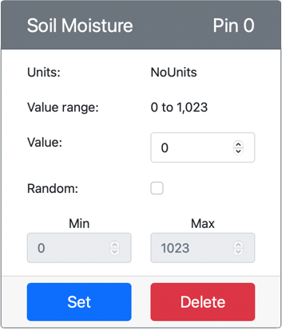

<!--
CO_OP_TRANSLATOR_METADATA:
{
  "original_hash": "2bf65f162bcebd35fbcba5fd245afac4",
  "translation_date": "2025-08-26T14:46:07+00:00",
  "source_file": "2-farm/lessons/2-detect-soil-moisture/virtual-device-soil-moisture.md",
  "language_code": "es"
}
-->
# Medir la humedad del suelo - Hardware IoT Virtual

En esta parte de la lección, agregarás un sensor capacitivo de humedad del suelo a tu dispositivo IoT virtual y leerás valores de él.

## Hardware Virtual

El dispositivo IoT virtual utilizará un sensor capacitivo de humedad del suelo simulado Grove. Esto mantiene este laboratorio igual que usar un Raspberry Pi con un sensor capacitivo de humedad del suelo físico.

En un dispositivo IoT físico, el sensor de humedad del suelo sería un sensor capacitivo que mide la humedad del suelo detectando la capacitancia del mismo, una propiedad que cambia a medida que cambia la humedad del suelo. A medida que aumenta la humedad del suelo, el voltaje disminuye.

Este es un sensor analógico, por lo que utiliza un ADC simulado de 10 bits para reportar un valor entre 1 y 1,023.

### Agregar el sensor de humedad del suelo a CounterFit

Para usar un sensor virtual de humedad del suelo, necesitas agregarlo a la aplicación CounterFit.

#### Tarea - Agregar el sensor de humedad del suelo a CounterFit

Agrega el sensor de humedad del suelo a la aplicación CounterFit.

1. Crea una nueva aplicación de Python en tu computadora en una carpeta llamada `soil-moisture-sensor` con un único archivo llamado `app.py` y un entorno virtual de Python, y agrega los paquetes pip de CounterFit.

    > ⚠️ Puedes consultar [las instrucciones para crear y configurar un proyecto de Python en CounterFit en la lección 1 si es necesario](../../../1-getting-started/lessons/1-introduction-to-iot/virtual-device.md).

1. Asegúrate de que la aplicación web de CounterFit esté ejecutándose.

1. Crea un sensor de humedad del suelo:

    1. En el cuadro *Create sensor* en el panel *Sensors*, despliega el cuadro *Sensor type* y selecciona *Soil Moisture*.

    1. Deja las *Units* configuradas en *NoUnits*.

    1. Asegúrate de que el *Pin* esté configurado en *0*.

    1. Selecciona el botón **Add** para crear el sensor *Soil Moisture* en el Pin 0.

    

    El sensor de humedad del suelo será creado y aparecerá en la lista de sensores.

    

## Programar la aplicación del sensor de humedad del suelo

La aplicación del sensor de humedad del suelo ahora puede ser programada utilizando los sensores de CounterFit.

### Tarea - Programar la aplicación del sensor de humedad del suelo

Programa la aplicación del sensor de humedad del suelo.

1. Asegúrate de que la aplicación `soil-moisture-sensor` esté abierta en VS Code.

1. Abre el archivo `app.py`.

1. Agrega el siguiente código al inicio de `app.py` para conectar la aplicación a CounterFit:

    ```python
    from counterfit_connection import CounterFitConnection
    CounterFitConnection.init('127.0.0.1', 5000)
    ```

1. Agrega el siguiente código al archivo `app.py` para importar algunas bibliotecas necesarias:

    ```python
    import time
    from counterfit_shims_grove.adc import ADC
    ```

    La declaración `import time` importa el módulo `time`, que se utilizará más adelante en esta tarea.

    La declaración `from counterfit_shims_grove.adc import ADC` importa la clase `ADC` para interactuar con un convertidor analógico a digital virtual que puede conectarse a un sensor de CounterFit.

1. Agrega el siguiente código debajo de esto para crear una instancia de la clase `ADC`:

    ```python
    adc = ADC()
    ```

1. Agrega un bucle infinito que lea desde este ADC en el pin 0 y escriba el resultado en la consola. Este bucle puede luego dormir durante 10 segundos entre lecturas.

    ```python
    while True:
        soil_moisture = adc.read(0)
        print("Soil moisture:", soil_moisture)
    
        time.sleep(10)
    ```

1. Desde la aplicación CounterFit, cambia el valor del sensor de humedad del suelo que será leído por la aplicación. Puedes hacerlo de dos maneras:

    * Ingresa un número en el cuadro *Value* del sensor de humedad del suelo y luego selecciona el botón **Set**. El número que ingreses será el valor devuelto por el sensor.

    * Marca la casilla *Random* y establece un valor *Min* y *Max*, luego selecciona el botón **Set**. Cada vez que el sensor lea un valor, leerá un número aleatorio entre *Min* y *Max*.

1. Ejecuta la aplicación de Python. Verás las mediciones de humedad del suelo escritas en la consola. Cambia el *Value* o la configuración de *Random* para ver cómo cambia el valor.

    ```output
    (.venv) ➜ soil-moisture-sensor $ python app.py 
    Soil moisture: 615
    Soil moisture: 612
    Soil moisture: 498
    Soil moisture: 493
    Soil moisture: 490
    Soil Moisture: 388
    ```

> 💁 Puedes encontrar este código en la carpeta [code/virtual-device](../../../../../2-farm/lessons/2-detect-soil-moisture/code/virtual-device).

😀 ¡Tu programa del sensor de humedad del suelo fue un éxito!

---

**Descargo de responsabilidad**:  
Este documento ha sido traducido utilizando el servicio de traducción automática [Co-op Translator](https://github.com/Azure/co-op-translator). Si bien nos esforzamos por garantizar la precisión, tenga en cuenta que las traducciones automatizadas pueden contener errores o imprecisiones. El documento original en su idioma nativo debe considerarse como la fuente autorizada. Para información crítica, se recomienda una traducción profesional realizada por humanos. No nos hacemos responsables de malentendidos o interpretaciones erróneas que puedan surgir del uso de esta traducción.