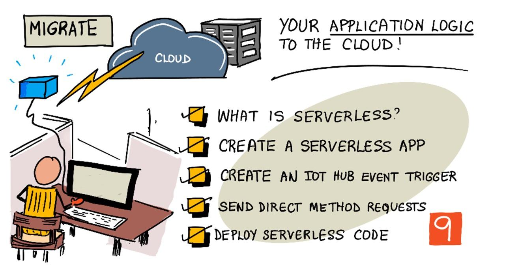

<!--
CO_OP_TRANSLATOR_METADATA:
{
  "original_hash": "5f2d2f4a5a023c93ab34a0cc5b47c0c4",
  "translation_date": "2025-08-26T14:39:06+00:00",
  "source_file": "2-farm/lessons/5-migrate-application-to-the-cloud/README.md",
  "language_code": "es"
}
-->
# Migra la lógica de tu aplicación a la nube



> Ilustración por [Nitya Narasimhan](https://github.com/nitya). Haz clic en la imagen para una versión más grande.

Esta lección fue impartida como parte de la serie [IoT para principiantes Proyecto 2 - Agricultura Digital](https://youtube.com/playlist?list=PLmsFUfdnGr3yCutmcVg6eAUEfsGiFXgcx) del [Microsoft Reactor](https://developer.microsoft.com/reactor/?WT.mc_id=academic-17441-jabenn).

[](https://youtu.be/VVZDcs5u1_I)

## Cuestionario previo a la lección

[Cuestionario previo a la lección](https://black-meadow-040d15503.1.azurestaticapps.net/quiz/17)

## Introducción

En la última lección, aprendiste cómo conectar el monitoreo de humedad del suelo de tus plantas y el control del relé a un servicio IoT basado en la nube. El siguiente paso es mover el código del servidor que controla el tiempo del relé a la nube. En esta lección, aprenderás cómo hacerlo utilizando funciones sin servidor.

En esta lección cubriremos:

* [¿Qué es sin servidor?](../../../../../2-farm/lessons/5-migrate-application-to-the-cloud)
* [Crear una aplicación sin servidor](../../../../../2-farm/lessons/5-migrate-application-to-the-cloud)
* [Crear un disparador de eventos para IoT Hub](../../../../../2-farm/lessons/5-migrate-application-to-the-cloud)
* [Enviar solicitudes de método directo desde código sin servidor](../../../../../2-farm/lessons/5-migrate-application-to-the-cloud)
* [Desplegar tu código sin servidor en la nube](../../../../../2-farm/lessons/5-migrate-application-to-the-cloud)

## ¿Qué es sin servidor?

Sin servidor, o computación sin servidor, implica crear pequeños bloques de código que se ejecutan en la nube en respuesta a diferentes tipos de eventos. Cuando ocurre el evento, tu código se ejecuta y recibe datos sobre el evento. Estos eventos pueden provenir de muchas fuentes, como solicitudes web, mensajes en una cola, cambios en datos de una base de datos o mensajes enviados a un servicio IoT por dispositivos IoT.


> 💁 Si has usado disparadores de bases de datos antes, puedes pensar en esto como algo similar: código que se activa por un evento como insertar una fila.


Tu código solo se ejecuta cuando ocurre el evento; no hay nada manteniendo tu código activo en otros momentos. El evento ocurre, tu código se carga y se ejecuta. Esto hace que el modelo sin servidor sea muy escalable: si muchos eventos ocurren al mismo tiempo, el proveedor de la nube puede ejecutar tu función tantas veces como sea necesario simultáneamente en los servidores disponibles. La desventaja de esto es que si necesitas compartir información entre eventos, debes guardarla en algún lugar como una base de datos en lugar de almacenarla en memoria.

Tu código se escribe como una función que toma detalles sobre el evento como parámetro. Puedes usar una amplia gama de lenguajes de programación para escribir estas funciones sin servidor.

> 🎓 Sin servidor también se conoce como Funciones como servicio (FaaS) ya que cada disparador de evento se implementa como una función en el código.

A pesar del nombre, sin servidor sí utiliza servidores. El nombre se debe a que, como desarrollador, no te preocupas por los servidores necesarios para ejecutar tu código; solo te importa que tu código se ejecute en respuesta a un evento. El proveedor de la nube tiene un *runtime* sin servidor que gestiona la asignación de servidores, redes, almacenamiento, CPU, memoria y todo lo necesario para ejecutar tu código. Este modelo significa que no pagas por servidor, ya que no hay un servidor específico. En cambio, pagas por el tiempo que tu código está en ejecución y la cantidad de memoria utilizada.

> 💰 Sin servidor es una de las formas más económicas de ejecutar código en la nube. Por ejemplo, al momento de escribir esto, un proveedor de nube permite que todas tus funciones sin servidor se ejecuten un total combinado de 1,000,000 veces al mes antes de comenzar a cobrarte, y después de eso cobran US$0.20 por cada 1,000,000 ejecuciones. Cuando tu código no está en ejecución, no pagas.

Como desarrollador de IoT, el modelo sin servidor es ideal. Puedes escribir una función que se llame en respuesta a mensajes enviados desde cualquier dispositivo IoT conectado a tu servicio IoT alojado en la nube. Tu código manejará todos los mensajes enviados, pero solo estará en ejecución cuando sea necesario.

✅ Revisa el código que escribiste como servidor escuchando mensajes a través de MQTT. ¿Cómo podría ejecutarse esto en la nube utilizando sin servidor? ¿Cómo crees que el código podría cambiar para admitir computación sin servidor?

> 💁 El modelo sin servidor se está expandiendo a otros servicios en la nube además de ejecutar código. Por ejemplo, las bases de datos sin servidor están disponibles en la nube utilizando un modelo de precios sin servidor donde pagas por cada solicitud realizada contra la base de datos, como una consulta o inserción, generalmente con precios basados en la cantidad de trabajo necesario para atender la solicitud. Por ejemplo, una sola selección de una fila contra una clave primaria costará menos que una operación complicada que une muchas tablas y devuelve miles de filas.

## Crear una aplicación sin servidor

El servicio de computación sin servidor de Microsoft se llama Azure Functions.


El siguiente video corto ofrece una visión general de Azure Functions.

[](https://www.youtube.com/watch?v=8-jz5f_JyEQ)

> 🎥 Haz clic en la imagen de arriba para ver el video.

✅ Tómate un momento para investigar y leer la visión general de Azure Functions en la [documentación de Microsoft Azure Functions](https://docs.microsoft.com/azure/azure-functions/functions-overview?WT.mc_id=academic-17441-jabenn).

Para escribir Azure Functions, comienzas con una aplicación de Azure Functions en el lenguaje de tu elección. Azure Functions admite de forma nativa Python, JavaScript, TypeScript, C#, F#, Java y Powershell. En esta lección aprenderás cómo escribir una aplicación de Azure Functions en Python.

> 💁 Azure Functions también admite controladores personalizados, por lo que puedes escribir tus funciones en cualquier lenguaje que soporte solicitudes HTTP, incluidos lenguajes más antiguos como COBOL.

Las aplicaciones de funciones consisten en uno o más *disparadores* - funciones que responden a eventos. Puedes tener múltiples disparadores dentro de una aplicación de funciones, todos compartiendo una configuración común. Por ejemplo, en el archivo de configuración de tu aplicación de funciones puedes tener los detalles de conexión de tu IoT Hub, y todas las funciones en la aplicación pueden usar esto para conectarse y escuchar eventos.

### Tarea - instalar las herramientas de Azure Functions

> Al momento de escribir esto, las herramientas de código de Azure Functions no funcionan completamente en Apple Silicon con proyectos de Python. Necesitarás usar una Mac basada en Intel, una PC con Windows o una PC con Linux.

Una gran característica de Azure Functions es que puedes ejecutarlas localmente. El mismo runtime que se utiliza en la nube puede ejecutarse en tu computadora, permitiéndote escribir código que responde a mensajes IoT y ejecutarlo localmente. Incluso puedes depurar tu código mientras se manejan eventos. Una vez que estés satisfecho con tu código, puedes desplegarlo en la nube.

Las herramientas de Azure Functions están disponibles como una CLI, conocida como Azure Functions Core Tools.

1. Instala las herramientas principales de Azure Functions siguiendo las instrucciones en la [documentación de Azure Functions Core Tools](https://docs.microsoft.com/azure/azure-functions/functions-run-local?WT.mc_id=academic-17441-jabenn).

1. Instala la extensión de Azure Functions para VS Code. Esta extensión proporciona soporte para crear, depurar y desplegar funciones de Azure. Consulta la [documentación de la extensión de Azure Functions](https://marketplace.visualstudio.com/items?WT.mc_id=academic-17441-jabenn&itemName=ms-azuretools.vscode-azurefunctions) para obtener instrucciones sobre cómo instalar esta extensión en VS Code.

Cuando despliegues tu aplicación de Azure Functions en la nube, necesitará usar una pequeña cantidad de almacenamiento en la nube para guardar cosas como los archivos de la aplicación y los archivos de registro. Cuando ejecutes tu aplicación de funciones localmente, aún necesitarás conectarte al almacenamiento en la nube, pero en lugar de usar almacenamiento real en la nube, puedes usar un emulador de almacenamiento llamado [Azurite](https://github.com/Azure/Azurite). Este se ejecuta localmente pero actúa como almacenamiento en la nube.

> 🎓 En Azure, el almacenamiento que utiliza Azure Functions es una Cuenta de Almacenamiento de Azure. Estas cuentas pueden almacenar archivos, blobs, datos en tablas o datos en colas. Puedes compartir una cuenta de almacenamiento entre muchas aplicaciones, como una aplicación de funciones y una aplicación web.

1. Azurite es una aplicación Node.js, por lo que necesitarás instalar Node.js. Puedes encontrar las instrucciones de descarga e instalación en el [sitio web de Node.js](https://nodejs.org/). Si estás usando una Mac, también puedes instalarlo desde [Homebrew](https://formulae.brew.sh/formula/node).

1. Instala Azurite usando el siguiente comando (`npm` es una herramienta que se instala cuando instalas Node.js):

    ```sh
    npm install -g azurite
    ```

1. Crea una carpeta llamada `azurite` para que Azurite la use para almacenar datos:

    ```sh
    mkdir azurite
    ```

1. Ejecuta Azurite, pasándole esta nueva carpeta:

    ```sh
    azurite --location azurite
    ```

    El emulador de almacenamiento Azurite se iniciará y estará listo para que el runtime local de Functions se conecte.

    ```output
    ➜  ~ azurite --location azurite  
    Azurite Blob service is starting at http://127.0.0.1:10000
    Azurite Blob service is successfully listening at http://127.0.0.1:10000
    Azurite Queue service is starting at http://127.0.0.1:10001
    Azurite Queue service is successfully listening at http://127.0.0.1:10001
    Azurite Table service is starting at http://127.0.0.1:10002
    Azurite Table service is successfully listening at http://127.0.0.1:10002
    ```

### Tarea - crear un proyecto de Azure Functions

La CLI de Azure Functions puede usarse para crear una nueva aplicación de funciones.

1. Crea una carpeta para tu aplicación de funciones y navega a ella. Llámala `soil-moisture-trigger`.

    ```sh
    mkdir soil-moisture-trigger
    cd soil-moisture-trigger
    ```

1. Crea un entorno virtual de Python dentro de esta carpeta:

    ```sh
    python3 -m venv .venv
    ```

1. Activa el entorno virtual:

    * En Windows:
        * Si estás usando el Command Prompt, o el Command Prompt a través de Windows Terminal, ejecuta:

            ```cmd
            .venv\Scripts\activate.bat
            ```

        * Si estás usando PowerShell, ejecuta:

            ```powershell
            .\.venv\Scripts\Activate.ps1
            ```

    * En macOS o Linux, ejecuta:

        ```cmd
        source ./.venv/bin/activate
        ```

    > 💁 Estos comandos deben ejecutarse desde la misma ubicación donde ejecutaste el comando para crear el entorno virtual. Nunca necesitarás navegar dentro de la carpeta `.venv`; siempre debes ejecutar el comando de activación y cualquier comando para instalar paquetes o ejecutar código desde la carpeta donde estabas cuando creaste el entorno virtual.

1. Ejecuta el siguiente comando para crear una aplicación de funciones en esta carpeta:

    ```sh
    func init --worker-runtime python soil-moisture-trigger
    ```

    Esto creará tres archivos dentro de la carpeta actual:

    * `host.json` - este documento JSON contiene configuraciones para tu aplicación de funciones. No necesitarás modificar estas configuraciones.
    * `local.settings.json` - este documento JSON contiene configuraciones que tu aplicación usaría al ejecutarse localmente, como cadenas de conexión para tu IoT Hub. Estas configuraciones son solo locales y no deben agregarse al control de código fuente. Cuando despliegues la aplicación en la nube, estas configuraciones no se desplegarán; en su lugar, tus configuraciones se cargarán desde configuraciones de aplicación. Esto se cubrirá más adelante en esta lección.
    * `requirements.txt` - este es un archivo de requisitos de [Pip](https://pip.pypa.io/en/stable/user_guide/#requirements-files) que contiene los paquetes de Pip necesarios para ejecutar tu aplicación de funciones.

1. El archivo `local.settings.json` tiene una configuración para la cuenta de almacenamiento que la aplicación de funciones usará. Esto por defecto está vacío, por lo que necesita configurarse. Para conectarte al emulador de almacenamiento local Azurite, establece este valor en lo siguiente:

    ```json
    "AzureWebJobsStorage": "UseDevelopmentStorage=true",
    ```

1. Instala los paquetes de Pip necesarios utilizando el archivo de requisitos:

    ```sh
    pip install -r requirements.txt
    ```

    > 💁 Los paquetes de Pip requeridos deben estar en este archivo, para que cuando la aplicación de funciones se despliegue en la nube, el runtime pueda asegurarse de instalar los paquetes correctos.

1. Para probar que todo está funcionando correctamente, puedes iniciar el runtime de Functions. Ejecuta el siguiente comando para hacerlo:

    ```sh
    func start
    ```

    Verás que el runtime se inicia e informa que no ha encontrado funciones de trabajo (disparadores).

    ```output
    (.venv) ➜  soil-moisture-trigger func start
    Found Python version 3.9.1 (python3).
    
    Azure Functions Core Tools
    Core Tools Version:       3.0.3442 Commit hash: 6bfab24b2743f8421475d996402c398d2fe4a9e0  (64-bit)
    Function Runtime Version: 3.0.15417.0
    
    [2021-05-05T01:24:46.795Z] No job functions found.
    ```
> ⚠️ Si recibes una notificación del firewall, concede acceso ya que la aplicación `func` necesita poder leer y escribir en tu red.
> ⚠️ Si estás utilizando macOS, es posible que aparezcan advertencias en la salida:
>
> ```output
    > (.venv) ➜  soil-moisture-trigger func start
    > Found Python version 3.9.1 (python3).
    >
    > Azure Functions Core Tools
    > Core Tools Version:       3.0.3442 Commit hash: 6bfab24b2743f8421475d996402c398d2fe4a9e0  (64-bit)
    > Function Runtime Version: 3.0.15417.0
    >
    > [2021-06-16T08:18:28.315Z] Cannot create directory for shared memory usage: /dev/shm/AzureFunctions
    > [2021-06-16T08:18:28.316Z] System.IO.FileSystem: Access to the path '/dev/shm/AzureFunctions' is denied. Operation not permitted.
    > [2021-06-16T08:18:30.361Z] No job functions found.
    > ```
>
> Puedes ignorarlas siempre y cuando la aplicación de Functions se inicie correctamente y liste las funciones en ejecución. Como se menciona en [esta pregunta en Microsoft Docs Q&A](https://docs.microsoft.com/answers/questions/396617/azure-functions-core-tools-error-osx-devshmazurefu.html?WT.mc_id=academic-17441-jabenn), estas advertencias pueden ser ignoradas.

1. Detén la aplicación de Functions presionando `ctrl+c`.

1. Abre la carpeta actual en VS Code, ya sea abriendo VS Code y luego esta carpeta, o ejecutando el siguiente comando:

    ```sh
    code .
    ```

    VS Code detectará tu proyecto de Functions y mostrará una notificación que dice:

    ```output
    Detected an Azure Functions Project in folder "soil-moisture-trigger" that may have been created outside of
    VS Code. Initialize for optimal use with VS Code?
    ```

    

    Selecciona **Sí** en esta notificación.

1. Asegúrate de que el entorno virtual de Python esté ejecutándose en la terminal de VS Code. Deténlo y reinícialo si es necesario.

## Crear un disparador de eventos de IoT Hub

La aplicación de Functions es el contenedor de tu código sin servidor. Para responder a eventos de IoT Hub, puedes agregar un disparador de IoT Hub a esta aplicación. Este disparador necesita conectarse al flujo de mensajes enviados al IoT Hub y responder a ellos. Para obtener este flujo de mensajes, tu disparador debe conectarse al *punto de conexión compatible con Event Hub* del IoT Hub.

IoT Hub se basa en otro servicio de Azure llamado Azure Event Hubs. Event Hubs es un servicio que permite enviar y recibir mensajes, y IoT Hub amplía esto para agregar características específicas para dispositivos IoT. La forma en que te conectas para leer mensajes del IoT Hub es la misma que si estuvieras utilizando Event Hubs.

✅ Investiga un poco: Lee la descripción general de Event Hubs en la [documentación de Azure Event Hubs](https://docs.microsoft.com/azure/event-hubs/event-hubs-about?WT.mc_id=academic-17441-jabenn). ¿Cómo se comparan las características básicas con IoT Hub?

Para que un dispositivo IoT se conecte al IoT Hub, debe usar una clave secreta que garantice que solo los dispositivos permitidos puedan conectarse. Lo mismo aplica al conectarse para leer mensajes; tu código necesitará una cadena de conexión que contenga una clave secreta, junto con los detalles del IoT Hub.

> 💁 La cadena de conexión predeterminada que obtienes tiene permisos de **iothubowner**, lo que otorga a cualquier código que la use permisos completos en el IoT Hub. Idealmente, deberías conectarte con el nivel más bajo de permisos necesarios. Esto se cubrirá en la próxima lección.

Una vez que tu disparador se haya conectado, el código dentro de la función se ejecutará para cada mensaje enviado al IoT Hub, independientemente del dispositivo que lo haya enviado. El disparador recibirá el mensaje como un parámetro.

### Tarea - obtener la cadena de conexión del punto de conexión compatible con Event Hub

1. Desde la terminal de VS Code, ejecuta el siguiente comando para obtener la cadena de conexión del punto de conexión compatible con Event Hub del IoT Hub:

    ```sh
    az iot hub connection-string show --default-eventhub \
                                      --output table \
                                      --hub-name <hub_name>
    ```

    Sustituye `<hub_name>` por el nombre que usaste para tu IoT Hub.

1. En VS Code, abre el archivo `local.settings.json`. Agrega el siguiente valor adicional dentro de la sección `Values`:

    ```json
    "IOT_HUB_CONNECTION_STRING": "<connection string>"
    ```

    Sustituye `<connection string>` por el valor del paso anterior. Necesitarás agregar una coma después de la línea anterior para que sea un JSON válido.

### Tarea - crear un disparador de eventos

Ahora estás listo para crear el disparador de eventos.

1. Desde la terminal de VS Code, ejecuta el siguiente comando desde dentro de la carpeta `soil-moisture-trigger`:

    ```sh
    func new --name iot-hub-trigger --template "Azure Event Hub trigger"
    ```

    Esto crea una nueva función llamada `iot-hub-trigger`. El disparador se conectará al punto de conexión compatible con Event Hub en el IoT Hub, por lo que puedes usar un disparador de Event Hub. No existe un disparador específico para IoT Hub.

Esto creará una carpeta dentro de la carpeta `soil-moisture-trigger` llamada `iot-hub-trigger` que contiene esta función. Esta carpeta tendrá los siguientes archivos:

* `__init__.py` - este es el archivo de código Python que contiene el disparador, utilizando la convención estándar de nombres de archivos Python para convertir esta carpeta en un módulo de Python.

    Este archivo contendrá el siguiente código:

    ```python
    import logging

    import azure.functions as func


    def main(event: func.EventHubEvent):
        logging.info('Python EventHub trigger processed an event: %s',
                    event.get_body().decode('utf-8'))
    ```

    El núcleo del disparador es la función `main`. Es esta función la que se llama con los eventos del IoT Hub. Esta función tiene un parámetro llamado `event` que contiene un `EventHubEvent`. Cada vez que se envía un mensaje al IoT Hub, esta función se llama pasando ese mensaje como el `event`, junto con propiedades que son las mismas que las anotaciones que viste en la última lección.

    El núcleo de esta función registra el evento.

* `function.json` - este archivo contiene la configuración del disparador. La configuración principal está en una sección llamada `bindings`. Un binding es el término para una conexión entre Azure Functions y otros servicios de Azure. Esta función tiene un binding de entrada a un Event Hub: se conecta a un Event Hub y recibe datos.

    > 💁 También puedes tener bindings de salida para que la salida de una función se envíe a otro servicio. Por ejemplo, podrías agregar un binding de salida a una base de datos y devolver el evento del IoT Hub desde la función, y este se insertará automáticamente en la base de datos.

    ✅ Investiga un poco: Lee sobre los bindings en la [documentación de conceptos de disparadores y bindings de Azure Functions](https://docs.microsoft.com/azure/azure-functions/functions-triggers-bindings?WT.mc_id=academic-17441-jabenn&tabs=python).

    La sección `bindings` incluye la configuración del binding. Los valores de interés son:

  * `"type": "eventHubTrigger"` - esto indica que la función necesita escuchar eventos de un Event Hub.
  * `"name": "events"` - este es el nombre del parámetro para los eventos del Event Hub. Esto coincide con el nombre del parámetro en la función `main` en el código Python.
  * `"direction": "in"` - este es un binding de entrada; los datos del Event Hub ingresan a la función.
  * `"connection": ""` - esto define el nombre de la configuración para leer la cadena de conexión. Al ejecutarse localmente, leerá esta configuración del archivo `local.settings.json`.

    > 💁 La cadena de conexión no puede almacenarse en el archivo `function.json`; debe leerse desde la configuración. Esto es para evitar que expongas accidentalmente tu cadena de conexión.

1. Debido a [un error en la plantilla de Azure Functions](https://github.com/Azure/azure-functions-templates/issues/1250), el archivo `function.json` tiene un valor incorrecto para el campo `cardinality`. Actualiza este campo de `many` a `one`:

    ```json
    "cardinality": "one",
    ```

1. Actualiza el valor de `"connection"` en el archivo `function.json` para que apunte al nuevo valor que agregaste en el archivo `local.settings.json`:

    ```json
    "connection": "IOT_HUB_CONNECTION_STRING",
    ```

    > 💁 Recuerda: esto debe apuntar a la configuración, no contener la cadena de conexión real.

1. La cadena de conexión contiene el valor `eventHubName`, por lo que el valor para esto en el archivo `function.json` debe dejarse vacío. Actualiza este valor a una cadena vacía:

    ```json
    "eventHubName": "",
    ```

### Tarea - ejecutar el disparador de eventos

1. Asegúrate de que no estás ejecutando el monitor de eventos de IoT Hub. Si este está en ejecución al mismo tiempo que la aplicación de Functions, la aplicación de Functions no podrá conectarse y consumir eventos.

    > 💁 Varias aplicaciones pueden conectarse a los puntos de conexión de IoT Hub utilizando diferentes *grupos de consumidores*. Esto se cubrirá en una lección posterior.

1. Para ejecutar la aplicación de Functions, ejecuta el siguiente comando desde la terminal de VS Code:

    ```sh
    func start
    ```

    La aplicación de Functions se iniciará y descubrirá la función `iot-hub-trigger`. Luego procesará cualquier evento que ya se haya enviado al IoT Hub en el último día.

    ```output
    (.venv) ➜  soil-moisture-trigger func start
    Found Python version 3.9.1 (python3).
    
    Azure Functions Core Tools
    Core Tools Version:       3.0.3442 Commit hash: 6bfab24b2743f8421475d996402c398d2fe4a9e0  (64-bit)
    Function Runtime Version: 3.0.15417.0
    
    Functions:
    
            iot-hub-trigger: eventHubTrigger
    
    For detailed output, run func with --verbose flag.
    [2021-05-05T02:44:07.517Z] Worker process started and initialized.
    [2021-05-05T02:44:09.202Z] Executing 'Functions.iot-hub-trigger' (Reason='(null)', Id=802803a5-eae9-4401-a1f4-176631456ce4)
    [2021-05-05T02:44:09.205Z] Trigger Details: PartitionId: 0, Offset: 1011240-1011632, EnqueueTimeUtc: 2021-05-04T19:04:04.2030000Z-2021-05-04T19:04:04.3900000Z, SequenceNumber: 2546-2547, Count: 2
    [2021-05-05T02:44:09.352Z] Python EventHub trigger processed an event: {"soil_moisture":628}
    [2021-05-05T02:44:09.354Z] Python EventHub trigger processed an event: {"soil_moisture":624}
    [2021-05-05T02:44:09.395Z] Executed 'Functions.iot-hub-trigger' (Succeeded, Id=802803a5-eae9-4401-a1f4-176631456ce4, Duration=245ms)
    ```

    Cada llamada a la función estará rodeada por un bloque `Executing 'Functions.iot-hub-trigger'`/`Executed 'Functions.iot-hub-trigger'` en la salida, para que puedas ver cuántos mensajes se procesaron en cada llamada a la función.

1. Asegúrate de que tu dispositivo IoT esté en funcionamiento. Verás nuevos mensajes de humedad del suelo apareciendo en la aplicación de Functions.

1. Detén y reinicia la aplicación de Functions. Verás que no procesará mensajes anteriores nuevamente, solo procesará nuevos mensajes.

> 💁 VS Code también admite la depuración de tus Functions. Puedes establecer puntos de interrupción haciendo clic en el borde al inicio de cada línea de código, colocando el cursor en una línea de código y seleccionando *Ejecutar -> Alternar punto de interrupción*, o presionando `F9`. Puedes iniciar el depurador seleccionando *Ejecutar -> Iniciar depuración*, presionando `F5`, o seleccionando el panel *Ejecutar y depurar* y haciendo clic en el botón **Iniciar depuración**. Al hacerlo, puedes ver los detalles de los eventos que se están procesando.

#### Resolución de problemas

* Si obtienes el siguiente error:

    ```output
    The listener for function 'Functions.iot-hub-trigger' was unable to start. Microsoft.WindowsAzure.Storage: Connection refused. System.Net.Http: Connection refused. System.Private.CoreLib: Connection refused.
    ```

    Verifica que Azurite esté en ejecución y que hayas configurado el `AzureWebJobsStorage` en el archivo `local.settings.json` como `UseDevelopmentStorage=true`.

* Si obtienes el siguiente error:

    ```output
    System.Private.CoreLib: Exception while executing function: Functions.iot-hub-trigger. System.Private.CoreLib: Result: Failure Exception: AttributeError: 'list' object has no attribute 'get_body'
    ```

    Verifica que hayas configurado el `cardinality` en el archivo `function.json` como `one`.

* Si obtienes el siguiente error:

    ```output
    Azure.Messaging.EventHubs: The path to an Event Hub may be specified as part of the connection string or as a separate value, but not both.  Please verify that your connection string does not have the `EntityPath` token if you are passing an explicit Event Hub name. (Parameter 'connectionString').
    ```

    Verifica que hayas configurado el `eventHubName` en el archivo `function.json` como una cadena vacía.

## Enviar solicitudes de método directo desde código sin servidor

Hasta ahora, tu aplicación de Functions está escuchando mensajes del IoT Hub utilizando el punto de conexión compatible con Event Hub. Ahora necesitas enviar comandos al dispositivo IoT. Esto se hace utilizando una conexión diferente al IoT Hub a través del *Registry Manager*. El Registry Manager es una herramienta que te permite ver qué dispositivos están registrados en el IoT Hub y comunicarte con esos dispositivos enviando mensajes de nube a dispositivo, solicitudes de método directo o actualizando el dispositivo gemelo. También puedes usarlo para registrar, actualizar o eliminar dispositivos IoT del IoT Hub.

Para conectarte al Registry Manager, necesitas una cadena de conexión.

### Tarea - obtener la cadena de conexión del Registry Manager

1. Para obtener la cadena de conexión, ejecuta el siguiente comando:

    ```sh
    az iot hub connection-string show --policy-name service \
                                      --output table \
                                      --hub-name <hub_name>
    ```

    Sustituye `<hub_name>` por el nombre que usaste para tu IoT Hub.

    La cadena de conexión se solicita para la política *ServiceConnect* utilizando el parámetro `--policy-name service`. Cuando solicitas una cadena de conexión, puedes especificar qué permisos permitirá esa cadena de conexión. La política ServiceConnect permite que tu código se conecte y envíe mensajes a dispositivos IoT.

    ✅ Investiga un poco: Lee sobre las diferentes políticas en la [documentación de permisos de IoT Hub](https://docs.microsoft.com/azure/iot-hub/iot-hub-devguide-security#iot-hub-permissions?WT.mc_id=academic-17441-jabenn).

1. En VS Code, abre el archivo `local.settings.json`. Agrega el siguiente valor adicional dentro de la sección `Values`:

    ```json
    "REGISTRY_MANAGER_CONNECTION_STRING": "<connection string>"
    ```

    Sustituye `<connection string>` por el valor del paso anterior. Necesitarás agregar una coma después de la línea anterior para que sea un JSON válido.

### Tarea - enviar una solicitud de método directo a un dispositivo

1. El SDK para el Registry Manager está disponible a través de un paquete Pip. Agrega la siguiente línea al archivo `requirements.txt` para agregar la dependencia de este paquete:

    ```sh
    azure-iot-hub
    ```

1. Asegúrate de que la terminal de VS Code tenga el entorno virtual activado y ejecuta el siguiente comando para instalar los paquetes Pip:

    ```sh
    pip install -r requirements.txt
    ```

1. Agrega las siguientes importaciones al archivo `__init__.py`:

    ```python
    import json
    import os
    from azure.iot.hub import IoTHubRegistryManager
    from azure.iot.hub.models import CloudToDeviceMethod
    ```

    Esto importa algunas bibliotecas del sistema, así como las bibliotecas para interactuar con el Registry Manager y enviar solicitudes de método directo.

1. Elimina el código dentro del método `main`, pero conserva el método en sí.

1. En el método `main`, agrega el siguiente código:

    ```python
    body = json.loads(event.get_body().decode('utf-8'))
    device_id = event.iothub_metadata['connection-device-id']

    logging.info(f'Received message: {body} from {device_id}')
    ```

    Este código extrae el cuerpo del evento que contiene el mensaje JSON enviado por el dispositivo IoT.

    Luego obtiene el ID del dispositivo de las anotaciones pasadas con el mensaje. El cuerpo del evento contiene el mensaje enviado como telemetría, el diccionario `iothub_metadata` contiene propiedades establecidas por el IoT Hub, como el ID del dispositivo del remitente y la hora en que se envió el mensaje.

    Esta información luego se registra. Verás este registro en la terminal cuando ejecutes la aplicación de Functions localmente.

1. Debajo de esto, agrega el siguiente código:

    ```python
    soil_moisture = body['soil_moisture']

    if soil_moisture > 450:
        direct_method = CloudToDeviceMethod(method_name='relay_on', payload='{}')
    else:
        direct_method = CloudToDeviceMethod(method_name='relay_off', payload='{}')
    ```

    Este código obtiene la humedad del suelo del mensaje. Luego verifica la humedad del suelo y, dependiendo del valor, crea una clase auxiliar para la solicitud de método directo para el método `relay_on` o `relay_off`. La solicitud del método no necesita una carga útil, por lo que se envía un documento JSON vacío.

1. Debajo de esto, agrega el siguiente código:

    ```python
    logging.info(f'Sending direct method request for {direct_method.method_name} for device {device_id}')

    registry_manager_connection_string = os.environ['REGISTRY_MANAGER_CONNECTION_STRING']
    registry_manager = IoTHubRegistryManager(registry_manager_connection_string)
    ```
Este código carga el `REGISTRY_MANAGER_CONNECTION_STRING` desde el archivo `local.settings.json`. Los valores en este archivo están disponibles como variables de entorno, y se pueden leer utilizando la función `os.environ`, una función que devuelve un diccionario con todas las variables de entorno.

> 💁 Cuando este código se despliega en la nube, los valores en el archivo `local.settings.json` se configurarán como *Application Settings*, y se podrán leer desde las variables de entorno.

El código luego crea una instancia de la clase auxiliar Registry Manager utilizando la cadena de conexión.

1. Debajo de esto, agrega el siguiente código:

    ```python
    registry_manager.invoke_device_method(device_id, direct_method)

    logging.info('Direct method request sent!')
    ```

    Este código indica al registry manager que envíe la solicitud de método directo al dispositivo que envió la telemetría.

    > 💁 En las versiones de la aplicación que creaste en lecciones anteriores utilizando MQTT, los comandos de control del relé se enviaban a todos los dispositivos. El código asumía que solo tendrías un dispositivo. Esta versión del código envía la solicitud de método a un único dispositivo, por lo que funcionaría si tuvieras múltiples configuraciones de sensores de humedad y relés, enviando la solicitud de método directo al dispositivo correcto.

1. Ejecuta la aplicación de Functions y asegúrate de que tu dispositivo IoT esté enviando datos. Verás los mensajes siendo procesados y las solicitudes de método directo siendo enviadas. Mueve el sensor de humedad del suelo dentro y fuera del suelo para ver cómo cambian los valores y el relé se enciende y apaga.

> 💁 Puedes encontrar este código en la carpeta [code/functions](../../../../../2-farm/lessons/5-migrate-application-to-the-cloud/code/functions).

## Despliega tu código sin servidor en la nube

Tu código ya está funcionando localmente, así que el siguiente paso es desplegar la aplicación de Functions en la nube.

### Tarea - crear los recursos en la nube

Tu aplicación de Functions necesita ser desplegada en un recurso de Functions App en Azure, dentro del grupo de recursos que creaste para tu IoT Hub. También necesitarás una cuenta de almacenamiento creada en Azure para reemplazar la emulada que tienes funcionando localmente.

1. Ejecuta el siguiente comando para crear una cuenta de almacenamiento:

    ```sh
    az storage account create --resource-group soil-moisture-sensor \
                              --sku Standard_LRS \
                              --name <storage_name> 
    ```

    Sustituye `<storage_name>` por un nombre para tu cuenta de almacenamiento. Este debe ser único a nivel global, ya que forma parte de la URL utilizada para acceder a la cuenta de almacenamiento. Solo puedes usar letras minúsculas y números para este nombre, sin otros caracteres, y está limitado a 24 caracteres. Usa algo como `sms` y agrega un identificador único al final, como algunas palabras aleatorias o tu nombre.

    La opción `--sku Standard_LRS` selecciona el nivel de precios, eligiendo la cuenta general de menor costo. No hay un nivel gratuito de almacenamiento, y pagas por lo que usas. Los costos son relativamente bajos, siendo el almacenamiento más caro menos de US$0.05 por mes por gigabyte almacenado.

    ✅ Lee más sobre precios en la [página de precios de Azure Storage Account](https://azure.microsoft.com/pricing/details/storage/?WT.mc_id=academic-17441-jabenn)

1. Ejecuta el siguiente comando para crear una Function App:

    ```sh
    az functionapp create --resource-group soil-moisture-sensor \
                          --runtime python \
                          --functions-version 3 \
                          --os-type Linux \
                          --consumption-plan-location <location> \
                          --storage-account <storage_name> \
                          --name <functions_app_name>
    ```

    Sustituye `<location>` por la ubicación que usaste al crear el grupo de recursos en la lección anterior.

    Sustituye `<storage_name>` por el nombre de la cuenta de almacenamiento que creaste en el paso anterior.

    Sustituye `<functions_app_name>` por un nombre único para tu Function App. Este debe ser único a nivel global, ya que forma parte de una URL que puede ser utilizada para acceder a la Function App. Usa algo como `soil-moisture-sensor-` y agrega un identificador único al final, como algunas palabras aleatorias o tu nombre.

    La opción `--functions-version 3` establece la versión de Azure Functions a utilizar. La versión 3 es la más reciente.

    La opción `--os-type Linux` indica al runtime de Functions que use Linux como sistema operativo para alojar estas funciones. Las funciones pueden alojarse en Linux o Windows, dependiendo del lenguaje de programación utilizado. Las aplicaciones en Python solo son compatibles con Linux.

### Tarea - subir tus configuraciones de aplicación

Cuando desarrollaste tu Function App, almacenaste algunas configuraciones en el archivo `local.settings.json` para las cadenas de conexión de tu IoT Hub. Estas deben ser escritas en las Application Settings de tu Function App en Azure para que puedan ser utilizadas por tu código.

> 🎓 El archivo `local.settings.json` es solo para configuraciones de desarrollo local, y no debe ser incluido en el control de código fuente, como GitHub. Cuando se despliega en la nube, se utilizan las Application Settings. Las Application Settings son pares clave/valor alojados en la nube y se leen desde las variables de entorno, ya sea en tu código o por el runtime al conectar tu código con IoT Hub.

1. Ejecuta el siguiente comando para establecer la configuración `IOT_HUB_CONNECTION_STRING` en las Application Settings de la Function App:

    ```sh
    az functionapp config appsettings set --resource-group soil-moisture-sensor \
                                          --name <functions_app_name> \
                                          --settings "IOT_HUB_CONNECTION_STRING=<connection string>"
    ```

    Sustituye `<functions_app_name>` por el nombre que usaste para tu Function App.

    Sustituye `<connection string>` por el valor de `IOT_HUB_CONNECTION_STRING` de tu archivo `local.settings.json`.

1. Repite el paso anterior, pero establece el valor de `REGISTRY_MANAGER_CONNECTION_STRING` con el valor correspondiente de tu archivo `local.settings.json`.

Cuando ejecutes estos comandos, también se mostrará una lista de todas las Application Settings para la Function App. Puedes usar esto para verificar que tus valores estén configurados correctamente.

> 💁 Verás un valor ya configurado para `AzureWebJobsStorage`. En tu archivo `local.settings.json`, este se configuró con un valor para usar el emulador de almacenamiento local. Cuando creaste la Function App, pasaste la cuenta de almacenamiento como un parámetro, y esto se configura automáticamente en esta configuración.

### Tarea - despliega tu Function App en la nube

Ahora que la Function App está lista, tu código puede ser desplegado.

1. Ejecuta el siguiente comando desde el terminal de VS Code para publicar tu Function App:

    ```sh
    func azure functionapp publish <functions_app_name>
    ```

    Sustituye `<functions_app_name>` por el nombre que usaste para tu Function App.

El código será empaquetado y enviado a la Function App, donde será desplegado y comenzará a ejecutarse. Habrá mucha salida en la consola, terminando con la confirmación del despliegue y una lista de las funciones desplegadas. En este caso, la lista solo contendrá el trigger.

```output
Deployment successful.
Remote build succeeded!
Syncing triggers...
Functions in soil-moisture-sensor:
    iot-hub-trigger - [eventHubTrigger]
```

Asegúrate de que tu dispositivo IoT esté funcionando. Cambia los niveles de humedad ajustando la humedad del suelo o moviendo el sensor dentro y fuera del suelo. Verás el relé encenderse y apagarse a medida que cambian los niveles de humedad del suelo.

---

## 🚀 Desafío

En la lección anterior, gestionaste el tiempo del relé cancelando la suscripción a los mensajes MQTT mientras el relé estaba encendido y durante un breve período después de que se apagaba. No puedes usar este método aquí: no puedes cancelar la suscripción a tu trigger de IoT Hub.

Piensa en diferentes formas en las que podrías manejar esto en tu Function App.

## Cuestionario post-lección

[Cuestionario post-lección](https://black-meadow-040d15503.1.azurestaticapps.net/quiz/18)

## Revisión y autoestudio

* Lee sobre computación sin servidor en la [página de computación sin servidor en Wikipedia](https://wikipedia.org/wiki/Serverless_computing)
* Lee sobre el uso de serverless en Azure, incluyendo algunos ejemplos adicionales en el [blog de Azure sobre necesidades IoT sin servidor](https://azure.microsoft.com/blog/go-serverless-for-your-iot-needs/?WT.mc_id=academic-17441-jabenn)
* Aprende más sobre Azure Functions en el [canal de YouTube de Azure Functions](https://www.youtube.com/c/AzureFunctions)

## Tarea

[Agregar control manual del relé](assignment.md)

---

**Descargo de responsabilidad**:  
Este documento ha sido traducido utilizando el servicio de traducción automática [Co-op Translator](https://github.com/Azure/co-op-translator). Aunque nos esforzamos por garantizar la precisión, tenga en cuenta que las traducciones automatizadas pueden contener errores o imprecisiones. El documento original en su idioma nativo debe considerarse como la fuente autorizada. Para información crítica, se recomienda una traducción profesional realizada por humanos. No nos hacemos responsables de malentendidos o interpretaciones erróneas que puedan surgir del uso de esta traducción.