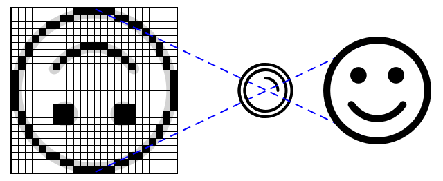

<!--
CO_OP_TRANSLATOR_METADATA:
{
  "original_hash": "557f4ee96b752e0651d2e6e74aa6bd14",
  "translation_date": "2025-08-26T14:10:00+00:00",
  "source_file": "4-manufacturing/lessons/2-check-fruit-from-device/README.md",
  "language_code": "es"
}
-->
# Verificar la calidad de la fruta desde un dispositivo IoT


> Resumen visual por [Nitya Narasimhan](https://github.com/nitya). Haz clic en la imagen para una versión más grande.

## Cuestionario previo a la lección

[Cuestionario previo a la lección](https://black-meadow-040d15503.1.azurestaticapps.net/quiz/31)

## Introducción

En la lección anterior aprendiste sobre clasificadores de imágenes y cómo entrenarlos para detectar frutas buenas y malas. Para usar este clasificador de imágenes en una aplicación IoT, necesitas capturar una imagen con algún tipo de cámara y enviarla a la nube para ser clasificada.

En esta lección aprenderás sobre sensores de cámara y cómo usarlos con un dispositivo IoT para capturar una imagen. También aprenderás cómo llamar al clasificador de imágenes desde tu dispositivo IoT.

En esta lección cubriremos:

* [Sensores de cámara](../../../../../4-manufacturing/lessons/2-check-fruit-from-device)
* [Capturar una imagen usando un dispositivo IoT](../../../../../4-manufacturing/lessons/2-check-fruit-from-device)
* [Publicar tu clasificador de imágenes](../../../../../4-manufacturing/lessons/2-check-fruit-from-device)
* [Clasificar imágenes desde tu dispositivo IoT](../../../../../4-manufacturing/lessons/2-check-fruit-from-device)
* [Mejorar el modelo](../../../../../4-manufacturing/lessons/2-check-fruit-from-device)

## Sensores de cámara

Los sensores de cámara, como su nombre lo indica, son cámaras que puedes conectar a tu dispositivo IoT. Pueden tomar imágenes fijas o capturar video en streaming. Algunos devuelven datos de imagen sin procesar, mientras que otros comprimen los datos en un archivo de imagen como JPEG o PNG. Por lo general, las cámaras que funcionan con dispositivos IoT son mucho más pequeñas y de menor resolución que las que podrías estar acostumbrado a usar, aunque también puedes encontrar cámaras de alta resolución que rivalizan con los mejores teléfonos. Además, puedes obtener lentes intercambiables, configuraciones de múltiples cámaras, cámaras térmicas infrarrojas o cámaras UV.



La mayoría de los sensores de cámara utilizan sensores de imagen donde cada píxel es un fotodiodo. Una lente enfoca la imagen en el sensor de imagen, y miles o millones de fotodiodos detectan la luz que incide en cada uno, registrándola como datos de píxeles.

> 💁 Las lentes invierten las imágenes, y el sensor de la cámara las voltea nuevamente para que queden en la orientación correcta. Esto es similar a lo que ocurre en tus ojos: lo que ves se detecta al revés en la parte posterior de tu ojo, y tu cerebro lo corrige.

> 🎓 El sensor de imagen se conoce como Sensor de Píxel Activo (APS), y el tipo más popular de APS es un sensor de semiconductor complementario de óxido metálico, o CMOS. Es posible que hayas escuchado el término sensor CMOS para referirse a los sensores de cámara.

Los sensores de cámara son digitales, enviando datos de imagen como datos digitales, generalmente con la ayuda de una biblioteca que facilita la comunicación. Las cámaras se conectan utilizando protocolos como SPI para permitirles enviar grandes cantidades de datos, ya que las imágenes son sustancialmente más grandes que los datos de un solo número de un sensor, como un sensor de temperatura.

✅ ¿Cuáles son las limitaciones en cuanto al tamaño de las imágenes en dispositivos IoT? Piensa en las restricciones, especialmente en el hardware de microcontroladores.

## Capturar una imagen usando un dispositivo IoT

Puedes usar tu dispositivo IoT para capturar una imagen que será clasificada.

### Tarea - capturar una imagen usando un dispositivo IoT

Sigue la guía correspondiente para capturar una imagen usando tu dispositivo IoT:

* [Arduino - Wio Terminal](wio-terminal-camera.md)
* [Computadora de placa única - Raspberry Pi](pi-camera.md)
* [Computadora de placa única - Dispositivo virtual](virtual-device-camera.md)

## Publicar tu clasificador de imágenes

Entrenaste tu clasificador de imágenes en la lección anterior. Antes de poder usarlo desde tu dispositivo IoT, necesitas publicar el modelo.

### Iteraciones del modelo

Cuando tu modelo se entrenó en la lección anterior, es posible que hayas notado que la pestaña **Performance** muestra iteraciones en el lado. Cuando entrenaste el modelo por primera vez, habrías visto *Iteration 1* en entrenamiento. Cuando mejoraste el modelo usando las imágenes de predicción, habrías visto *Iteration 2* en entrenamiento.

Cada vez que entrenas el modelo, obtienes una nueva iteración. Esto sirve para realizar un seguimiento de las diferentes versiones de tu modelo entrenadas con diferentes conjuntos de datos. Cuando realizas una **Quick Test**, hay un menú desplegable que puedes usar para seleccionar la iteración y comparar los resultados entre múltiples iteraciones.

Cuando estés satisfecho con una iteración, puedes publicarla para que esté disponible para ser utilizada desde aplicaciones externas. De esta manera, puedes tener una versión publicada que sea utilizada por tus dispositivos, mientras trabajas en una nueva versión a lo largo de múltiples iteraciones, y luego publicarla cuando estés satisfecho con ella.

### Tarea - publicar una iteración

Las iteraciones se publican desde el portal de Custom Vision.

1. Abre el portal de Custom Vision en [CustomVision.ai](https://customvision.ai) e inicia sesión si no lo tienes abierto ya. Luego abre tu proyecto `fruit-quality-detector`.

1. Selecciona la pestaña **Performance** de las opciones en la parte superior.

1. Selecciona la última iteración de la lista *Iterations* en el lado.

1. Haz clic en el botón **Publish** para la iteración.

    

1. En el cuadro de diálogo *Publish Model*, configura el *Prediction resource* en el recurso `fruit-quality-detector-prediction` que creaste en la lección anterior. Deja el nombre como `Iteration2` y selecciona el botón **Publish**.

1. Una vez publicado, selecciona el botón **Prediction URL**. Esto mostrará los detalles de la API de predicción, y necesitarás estos datos para llamar al modelo desde tu dispositivo IoT. La sección inferior está etiquetada como *If you have an image file*, y estos son los detalles que necesitas. Copia la URL que se muestra, que será algo como:

    ```output
    https://<location>.api.cognitive.microsoft.com/customvision/v3.0/Prediction/<id>/classify/iterations/Iteration2/image
    ```

    Donde `<location>` será la ubicación que usaste al crear tu recurso de visión personalizada, y `<id>` será un ID largo compuesto por letras y números.

    También copia el valor de la *Prediction-Key*. Esta es una clave segura que debes pasar al llamar al modelo. Solo las aplicaciones que pasen esta clave podrán usar el modelo; cualquier otra aplicación será rechazada.

    

✅ Cuando se publica una nueva iteración, tendrá un nombre diferente. ¿Cómo crees que podrías cambiar la iteración que está usando un dispositivo IoT?

## Clasificar imágenes desde tu dispositivo IoT

Ahora puedes usar estos detalles de conexión para llamar al clasificador de imágenes desde tu dispositivo IoT.

### Tarea - clasificar imágenes desde tu dispositivo IoT

Sigue la guía correspondiente para clasificar imágenes usando tu dispositivo IoT:

* [Arduino - Wio Terminal](wio-terminal-classify-image.md)
* [Computadora de placa única - Raspberry Pi/Dispositivo IoT virtual](single-board-computer-classify-image.md)

## Mejorar el modelo

Es posible que los resultados que obtengas al usar la cámara conectada a tu dispositivo IoT no coincidan con lo que esperabas. Las predicciones no siempre son tan precisas como al usar imágenes cargadas desde tu computadora. Esto se debe a que el modelo fue entrenado con datos diferentes a los que se están utilizando para las predicciones.

Para obtener los mejores resultados de un clasificador de imágenes, debes entrenar el modelo con imágenes que sean lo más similares posible a las imágenes utilizadas para las predicciones. Por ejemplo, si usaste la cámara de tu teléfono para capturar imágenes para el entrenamiento, la calidad, nitidez y color de las imágenes serán diferentes a las de una cámara conectada a un dispositivo IoT.


En la imagen anterior, la foto del plátano a la izquierda fue tomada con una cámara Raspberry Pi, mientras que la de la derecha fue tomada del mismo plátano en la misma ubicación con un iPhone. Hay una diferencia notable en la calidad: la foto del iPhone es más nítida, con colores más brillantes y mayor contraste.

✅ ¿Qué otros factores podrían causar que las imágenes capturadas por tu dispositivo IoT generen predicciones incorrectas? Piensa en el entorno en el que podría usarse un dispositivo IoT y qué factores pueden afectar la imagen capturada.

Para mejorar el modelo, puedes reentrenarlo usando las imágenes capturadas desde el dispositivo IoT.

### Tarea - mejorar el modelo

1. Clasifica múltiples imágenes de frutas maduras e inmaduras usando tu dispositivo IoT.

1. En el portal de Custom Vision, reentrena el modelo usando las imágenes en la pestaña *Predictions*.

    > ⚠️ Puedes consultar [las instrucciones para reentrenar tu clasificador en la lección 1 si es necesario](../1-train-fruit-detector/README.md#retrain-your-image-classifier).

1. Si tus imágenes son muy diferentes a las originales usadas para entrenar, puedes eliminar todas las imágenes originales seleccionándolas en la pestaña *Training Images* y haciendo clic en el botón **Delete**. Para seleccionar una imagen, mueve el cursor sobre ella y aparecerá una marca de verificación; selecciona esa marca para seleccionar o deseleccionar la imagen.

1. Entrena una nueva iteración del modelo y publícala siguiendo los pasos anteriores.

1. Actualiza la URL del endpoint en tu código y vuelve a ejecutar la aplicación.

1. Repite estos pasos hasta que estés satisfecho con los resultados de las predicciones.

---

## 🚀 Desafío

¿Qué tanto afecta la resolución de la imagen o la iluminación a la predicción?

Prueba cambiar la resolución de las imágenes en el código de tu dispositivo y observa si hace una diferencia en la calidad de las imágenes. También prueba cambiar la iluminación.

Si fueras a crear un dispositivo de producción para vender a granjas o fábricas, ¿cómo garantizarías que ofrezca resultados consistentes todo el tiempo?

## Cuestionario posterior a la lección

[Cuestionario posterior a la lección](https://black-meadow-040d15503.1.azurestaticapps.net/quiz/32)

## Revisión y autoestudio

Entrenaste tu modelo de visión personalizada usando el portal. Esto depende de tener imágenes disponibles, y en el mundo real puede que no consigas datos de entrenamiento que coincidan con lo que captura la cámara de tu dispositivo. Puedes solucionar esto entrenando directamente desde tu dispositivo usando la API de entrenamiento, para entrenar un modelo con imágenes capturadas desde tu dispositivo IoT.

* Lee sobre la API de entrenamiento en el [inicio rápido del SDK de Custom Vision](https://docs.microsoft.com/azure/cognitive-services/custom-vision-service/quickstarts/image-classification?WT.mc_id=academic-17441-jabenn&tabs=visual-studio&pivots=programming-language-python)

## Tarea

[Responder a los resultados de clasificación](assignment.md)

---

**Descargo de responsabilidad**:  
Este documento ha sido traducido utilizando el servicio de traducción automática [Co-op Translator](https://github.com/Azure/co-op-translator). Aunque nos esforzamos por garantizar la precisión, tenga en cuenta que las traducciones automáticas pueden contener errores o imprecisiones. El documento original en su idioma nativo debe considerarse como la fuente autorizada. Para información crítica, se recomienda una traducción profesional realizada por humanos. No nos hacemos responsables de malentendidos o interpretaciones erróneas que puedan surgir del uso de esta traducción.