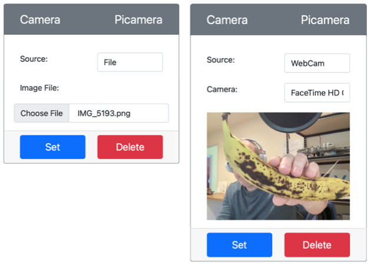

<!--
CO_OP_TRANSLATOR_METADATA:
{
  "original_hash": "3ba7150ffc4a6999f6c3cfb4906ec7df",
  "translation_date": "2025-08-26T14:13:24+00:00",
  "source_file": "4-manufacturing/lessons/2-check-fruit-from-device/virtual-device-camera.md",
  "language_code": "es"
}
-->
# Captura una imagen - Hardware IoT Virtual

En esta parte de la lección, agregarás un sensor de cámara a tu dispositivo IoT virtual y leerás imágenes desde él.

## Hardware

El dispositivo IoT virtual usará una cámara simulada que envía imágenes desde archivos o desde tu cámara web.

### Agregar la cámara a CounterFit

Para usar una cámara virtual, necesitas agregar una a la aplicación CounterFit.

#### Tarea - agregar la cámara a CounterFit

Agrega la cámara a la aplicación CounterFit.

1. Crea una nueva aplicación en Python en tu computadora dentro de una carpeta llamada `fruit-quality-detector` con un único archivo llamado `app.py` y un entorno virtual de Python, y agrega los paquetes pip de CounterFit.

    > ⚠️ Puedes consultar [las instrucciones para crear y configurar un proyecto de Python con CounterFit en la lección 1 si es necesario](../../../1-getting-started/lessons/1-introduction-to-iot/virtual-device.md).

1. Instala un paquete adicional de Pip para agregar un shim de CounterFit que pueda comunicarse con sensores de cámara simulando algunas funciones del paquete [Picamera Pip](https://pypi.org/project/picamera/). Asegúrate de instalarlo desde una terminal con el entorno virtual activado.

    ```sh
    pip install counterfit-shims-picamera
    ```

1. Asegúrate de que la aplicación web de CounterFit esté en ejecución.

1. Crea una cámara:

    1. En el cuadro *Create sensor* del panel *Sensors*, despliega el menú *Sensor type* y selecciona *Camera*.

    1. Establece el *Name* como `Picamera`.

    1. Selecciona el botón **Add** para crear la cámara.

    

    La cámara será creada y aparecerá en la lista de sensores.

    

## Programar la cámara

El dispositivo IoT virtual ahora puede ser programado para usar la cámara virtual.

### Tarea - programar la cámara

Programa el dispositivo.

1. Asegúrate de que la aplicación `fruit-quality-detector` esté abierta en VS Code.

1. Abre el archivo `app.py`.

1. Agrega el siguiente código al inicio de `app.py` para conectar la aplicación a CounterFit:

    ```python
    from counterfit_connection import CounterFitConnection
    CounterFitConnection.init('127.0.0.1', 5000)
    ```

1. Agrega el siguiente código a tu archivo `app.py`:

    ```python
    import io
    from counterfit_shims_picamera import PiCamera
    ```

    Este código importa algunas bibliotecas necesarias, incluyendo la clase `PiCamera` de la biblioteca counterfit_shims_picamera.

1. Agrega el siguiente código debajo de este para inicializar la cámara:

    ```python
    camera = PiCamera()
    camera.resolution = (640, 480)
    camera.rotation = 0
    ```

    Este código crea un objeto PiCamera, establece la resolución en 640x480. Aunque se admiten resoluciones más altas, el clasificador de imágenes funciona con imágenes mucho más pequeñas (227x227), por lo que no es necesario capturar y enviar imágenes más grandes.

    La línea `camera.rotation = 0` establece la rotación de la imagen en grados. Si necesitas rotar la imagen de la cámara web o del archivo, ajusta este valor según sea necesario. Por ejemplo, si deseas cambiar la imagen de un plátano en una cámara web en modo horizontal a modo vertical, establece `camera.rotation = 90`.

1. Agrega el siguiente código debajo de este para capturar la imagen como datos binarios:

    ```python
    image = io.BytesIO()
    camera.capture(image, 'jpeg')
    image.seek(0)
    ```

    Este código crea un objeto `BytesIO` para almacenar datos binarios. La imagen se lee desde la cámara como un archivo JPEG y se almacena en este objeto. Este objeto tiene un indicador de posición para saber dónde está en los datos, de modo que se puedan escribir más datos al final si es necesario. La línea `image.seek(0)` mueve esta posición al inicio para que todos los datos puedan leerse más tarde.

1. Debajo de esto, agrega lo siguiente para guardar la imagen en un archivo:

    ```python
    with open('image.jpg', 'wb') as image_file:
        image_file.write(image.read())
    ```

    Este código abre un archivo llamado `image.jpg` para escritura, luego lee todos los datos del objeto `BytesIO` y los escribe en el archivo.

    > 💁 Puedes capturar la imagen directamente en un archivo en lugar de un objeto `BytesIO` pasando el nombre del archivo a la llamada `camera.capture`. La razón para usar el objeto `BytesIO` es que más adelante en esta lección podrás enviar la imagen a tu clasificador de imágenes.

1. Configura la imagen que la cámara en CounterFit capturará. Puedes establecer la *Source* como *File*, luego subir un archivo de imagen, o establecer la *Source* como *WebCam*, y las imágenes se capturarán desde tu cámara web. Asegúrate de seleccionar el botón **Set** después de elegir una imagen o tu cámara web.

    

1. Se capturará una imagen y se guardará como `image.jpg` en la carpeta actual. Verás este archivo en el explorador de VS Code. Selecciona el archivo para ver la imagen. Si necesita rotación, actualiza la línea `camera.rotation = 0` según sea necesario y toma otra foto.

> 💁 Puedes encontrar este código en la carpeta [code-camera/virtual-iot-device](../../../../../4-manufacturing/lessons/2-check-fruit-from-device/code-camera/virtual-iot-device).

😀 ¡Tu programa de cámara fue un éxito!

---

**Descargo de responsabilidad**:  
Este documento ha sido traducido utilizando el servicio de traducción automática [Co-op Translator](https://github.com/Azure/co-op-translator). Aunque nos esforzamos por garantizar la precisión, tenga en cuenta que las traducciones automatizadas pueden contener errores o imprecisiones. El documento original en su idioma nativo debe considerarse como la fuente autorizada. Para información crítica, se recomienda una traducción profesional realizada por humanos. No nos hacemos responsables de malentendidos o interpretaciones erróneas que puedan surgir del uso de esta traducción.