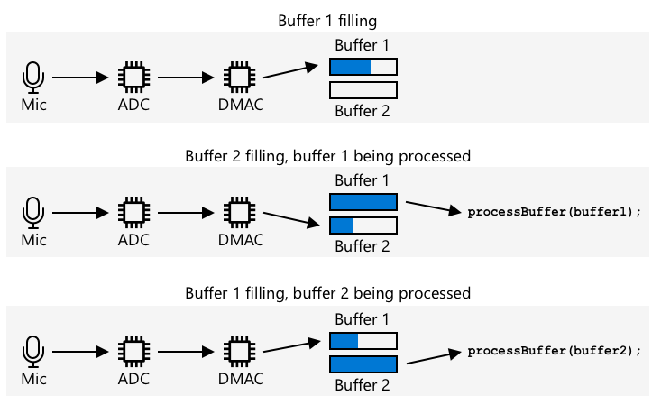

<!--
CO_OP_TRANSLATOR_METADATA:
{
  "original_hash": "2f336726b9410e97c3aaed76cc89b0d8",
  "translation_date": "2025-08-26T15:37:52+00:00",
  "source_file": "6-consumer/lessons/1-speech-recognition/wio-terminal-audio.md",
  "language_code": "es"
}
-->
# Capturar audio - Wio Terminal

En esta parte de la lección, escribirás código para capturar audio en tu Wio Terminal. La captura de audio será controlada por uno de los botones en la parte superior del Wio Terminal.

## Programar el dispositivo para capturar audio

Puedes capturar audio desde el micrófono utilizando código en C++. El Wio Terminal solo tiene 192KB de RAM, lo que no es suficiente para capturar más de un par de segundos de audio. Sin embargo, cuenta con 4MB de memoria flash, que se puede usar para guardar el audio capturado.

El micrófono integrado captura una señal analógica, que se convierte en una señal digital que el Wio Terminal puede procesar. Al capturar audio, los datos deben ser capturados en el momento correcto; por ejemplo, para capturar audio a 16KHz, los datos deben ser capturados exactamente 16,000 veces por segundo, con intervalos iguales entre cada muestra. En lugar de usar tu código para hacer esto, puedes utilizar el controlador de acceso directo a memoria (DMAC). Este es un circuito que puede capturar una señal y escribirla en la memoria sin interrumpir el código que se está ejecutando en el procesador.

✅ Lee más sobre DMA en la [página de acceso directo a memoria en Wikipedia](https://wikipedia.org/wiki/Direct_memory_access).



El DMAC puede capturar audio desde el ADC en intervalos fijos, como 16,000 veces por segundo para audio a 16KHz. Puede escribir estos datos capturados en un búfer de memoria preasignado, y cuando este se llena, lo pone a disposición de tu código para procesarlo. Usar esta memoria puede retrasar la captura de audio, pero puedes configurar múltiples búferes. El DMAC escribe en el búfer 1, y cuando este se llena, notifica a tu código para procesarlo mientras el DMAC escribe en el búfer 2. Cuando el búfer 2 se llena, notifica a tu código y vuelve a escribir en el búfer 1. De esta manera, mientras proceses cada búfer en menos tiempo del que toma llenarlo, no perderás datos.

Una vez que cada búfer ha sido capturado, puede escribirse en la memoria flash. La memoria flash necesita ser escrita utilizando direcciones definidas, especificando dónde escribir y cuánto escribir, similar a actualizar un arreglo de bytes en memoria. La memoria flash tiene granularidad, lo que significa que las operaciones de borrado y escritura dependen no solo de ser de un tamaño fijo, sino de alinearse a ese tamaño. Por ejemplo, si la granularidad es de 4096 bytes y solicitas un borrado en la dirección 4200, podría borrar todos los datos desde la dirección 4096 hasta la 8192. Esto significa que al escribir los datos de audio en la memoria flash, deben ser en bloques del tamaño correcto.

### Tarea - configurar la memoria flash

1. Crea un nuevo proyecto de Wio Terminal utilizando PlatformIO. Llama a este proyecto `smart-timer`. Agrega código en la función `setup` para configurar el puerto serial.

1. Agrega las siguientes dependencias de biblioteca al archivo `platformio.ini` para proporcionar acceso a la memoria flash:

    ```ini
    lib_deps =
        seeed-studio/Seeed Arduino FS @ 2.1.1
        seeed-studio/Seeed Arduino SFUD @ 2.0.2
    ```

1. Abre el archivo `main.cpp` y agrega la siguiente directiva de inclusión para la biblioteca de memoria flash en la parte superior del archivo:

    ```cpp
    #include <sfud.h>
    #include <SPI.h>
    ```

    > 🎓 SFUD significa Serial Flash Universal Driver, y es una biblioteca diseñada para trabajar con todos los chips de memoria flash.

1. En la función `setup`, agrega el siguiente código para configurar la biblioteca de almacenamiento flash:

    ```cpp
    while (!(sfud_init() == SFUD_SUCCESS))
        ;

    sfud_qspi_fast_read_enable(sfud_get_device(SFUD_W25Q32_DEVICE_INDEX), 2);
    ```

    Esto se ejecuta en un bucle hasta que la biblioteca SFUD se inicializa, luego activa las lecturas rápidas. La memoria flash integrada puede ser accedida utilizando una Interfaz Serial Periférica en Cola (QSPI), un tipo de controlador SPI que permite acceso continuo a través de una cola con un uso mínimo del procesador. Esto hace que sea más rápido leer y escribir en la memoria flash.

1. Crea un nuevo archivo en la carpeta `src` llamado `flash_writer.h`.

1. Agrega lo siguiente en la parte superior de este archivo:

    ```cpp
    #pragma once

    #include <Arduino.h>
    #include <sfud.h>
    ```

    Esto incluye algunos archivos de cabecera necesarios, incluyendo el archivo de cabecera para la biblioteca SFUD para interactuar con la memoria flash.

1. Define una clase en este nuevo archivo de cabecera llamada `FlashWriter`:

    ```cpp
    class FlashWriter
    {
    public:
    
    private:
    };
    ```

1. En la sección `private`, agrega el siguiente código:

    ```cpp
    byte *_sfudBuffer;
    size_t _sfudBufferSize;
    size_t _sfudBufferPos;
    size_t _sfudBufferWritePos;

    const sfud_flash *_flash;
    ```

    Esto define algunos campos para el búfer que se usará para almacenar datos antes de escribirlos en la memoria flash. Hay un arreglo de bytes, `_sfudBuffer`, para escribir datos, y cuando este se llena, los datos se escriben en la memoria flash. El campo `_sfudBufferPos` almacena la ubicación actual para escribir en este búfer, y `_sfudBufferWritePos` almacena la ubicación en la memoria flash para escribir. `_flash` es un puntero a la memoria flash donde se escribirá; algunos microcontroladores tienen múltiples chips de memoria flash.

1. Agrega el siguiente método a la sección `public` para inicializar esta clase:

    ```cpp
    void init()
    {
        _flash = sfud_get_device_table() + 0;
        _sfudBufferSize = _flash->chip.erase_gran;
        _sfudBuffer = new byte[_sfudBufferSize];
        _sfudBufferPos = 0;
        _sfudBufferWritePos = 0;
    }
    ```

    Esto configura la memoria flash en el Wio Terminal para escribir, y establece los búferes basándose en el tamaño de grano de la memoria flash. Esto está en un método `init`, en lugar de un constructor, ya que necesita ser llamado después de que la memoria flash haya sido configurada en la función `setup`.

1. Agrega el siguiente código a la sección `public`:

    ```cpp
    void writeSfudBuffer(byte b)
    {
        _sfudBuffer[_sfudBufferPos++] = b;
        if (_sfudBufferPos == _sfudBufferSize)
        {
            sfud_erase_write(_flash, _sfudBufferWritePos, _sfudBufferSize, _sfudBuffer);
            _sfudBufferWritePos += _sfudBufferSize;
            _sfudBufferPos = 0;
        }
    }

    void writeSfudBuffer(byte *b, size_t len)
    {
        for (size_t i = 0; i < len; ++i)
        {
            writeSfudBuffer(b[i]);
        }
    }

    void flushSfudBuffer()
    {
        if (_sfudBufferPos > 0)
        {
            sfud_erase_write(_flash, _sfudBufferWritePos, _sfudBufferSize, _sfudBuffer);
            _sfudBufferWritePos += _sfudBufferSize;
            _sfudBufferPos = 0;
        }
    }
    ```

    Este código define métodos para escribir bytes en el sistema de almacenamiento flash. Funciona escribiendo en un búfer en memoria que tiene el tamaño correcto para la memoria flash, y cuando este se llena, se escribe en la memoria flash, borrando cualquier dato existente en esa ubicación. También hay un método `flushSfudBuffer` para escribir un búfer incompleto, ya que los datos capturados no serán múltiplos exactos del tamaño de grano, por lo que la parte final de los datos necesita ser escrita.

    > 💁 La parte final de los datos escribirá datos adicionales no deseados, pero esto está bien ya que solo se leerán los datos necesarios.

### Tarea - configurar la captura de audio

1. Crea un nuevo archivo en la carpeta `src` llamado `config.h`.

1. Agrega lo siguiente en la parte superior de este archivo:

    ```cpp
    #pragma once

    #define RATE 16000
    #define SAMPLE_LENGTH_SECONDS 4
    #define SAMPLES RATE * SAMPLE_LENGTH_SECONDS
    #define BUFFER_SIZE (SAMPLES * 2) + 44
    #define ADC_BUF_LEN 1600
    ```

    Este código configura algunas constantes para la captura de audio.

    | Constante             | Valor  | Descripción |
    | --------------------- | -----: | - |
    | RATE                  | 16000  | La tasa de muestreo para el audio. 16,000 es 16KHz |
    | SAMPLE_LENGTH_SECONDS | 4      | La duración del audio a capturar. Esto está configurado a 4 segundos. Para grabar audio más largo, aumenta este valor. |
    | SAMPLES               | 64000  | El número total de muestras de audio que se capturarán. Configurado como la tasa de muestreo * el número de segundos |
    | BUFFER_SIZE           | 128044 | El tamaño del búfer de audio a capturar. El audio se capturará como un archivo WAV, que tiene 44 bytes de cabecera, luego 128,000 bytes de datos de audio (cada muestra tiene 2 bytes) |
    | ADC_BUF_LEN           | 1600   | El tamaño de los búferes para capturar audio desde el DMAC |

    > 💁 Si encuentras que 4 segundos son muy cortos para solicitar un temporizador, puedes aumentar el valor de `SAMPLE_LENGTH_SECONDS`, y todos los demás valores se recalcularán.

1. Crea un nuevo archivo en la carpeta `src` llamado `mic.h`.

1. Agrega lo siguiente en la parte superior de este archivo:

    ```cpp
    #pragma once

    #include <Arduino.h>

    #include "config.h"
    #include "flash_writer.h"
    ```

    Esto incluye algunos archivos de cabecera necesarios, incluyendo los archivos `config.h` y `FlashWriter`.

1. Agrega lo siguiente para definir una clase `Mic` que pueda capturar desde el micrófono:

    ```cpp
    class Mic
    {
    public:
        Mic()
        {
            _isRecording = false;
            _isRecordingReady = false;
        }
    
        void startRecording()
        {
            _isRecording = true;
            _isRecordingReady = false;
        }
    
        bool isRecording()
        {
            return _isRecording;
        }
    
        bool isRecordingReady()
        {
            return _isRecordingReady;
        }
    
    private:
        volatile bool _isRecording;
        volatile bool _isRecordingReady;
        FlashWriter _writer;
    };
    
    Mic mic;
    ```

    Esta clase actualmente solo tiene un par de campos para rastrear si la grabación ha comenzado y si una grabación está lista para ser utilizada. Cuando el DMAC está configurado, escribe continuamente en los búferes de memoria, por lo que el indicador `_isRecording` determina si estos deben ser procesados o ignorados. El indicador `_isRecordingReady` se establecerá cuando se hayan capturado los 4 segundos de audio requeridos. El campo `_writer` se utiliza para guardar los datos de audio en la memoria flash.

    Luego se declara una variable global para una instancia de la clase `Mic`.

1. Agrega el siguiente código a la sección `private` de la clase `Mic`:

    ```cpp
    typedef struct
    {
        uint16_t btctrl;
        uint16_t btcnt;
        uint32_t srcaddr;
        uint32_t dstaddr;
        uint32_t descaddr;
    } dmacdescriptor;

    // Globals - DMA and ADC
    volatile dmacdescriptor _wrb[DMAC_CH_NUM] __attribute__((aligned(16)));
    dmacdescriptor _descriptor_section[DMAC_CH_NUM] __attribute__((aligned(16)));
    dmacdescriptor _descriptor __attribute__((aligned(16)));

    void configureDmaAdc()
    {
        // Configure DMA to sample from ADC at a regular interval (triggered by timer/counter)
        DMAC->BASEADDR.reg = (uint32_t)_descriptor_section;                    // Specify the location of the descriptors
        DMAC->WRBADDR.reg = (uint32_t)_wrb;                                    // Specify the location of the write back descriptors
        DMAC->CTRL.reg = DMAC_CTRL_DMAENABLE | DMAC_CTRL_LVLEN(0xf);           // Enable the DMAC peripheral
        DMAC->Channel[1].CHCTRLA.reg = DMAC_CHCTRLA_TRIGSRC(TC5_DMAC_ID_OVF) | // Set DMAC to trigger on TC5 timer overflow
                                        DMAC_CHCTRLA_TRIGACT_BURST;             // DMAC burst transfer

        _descriptor.descaddr = (uint32_t)&_descriptor_section[1];                    // Set up a circular descriptor
        _descriptor.srcaddr = (uint32_t)&ADC1->RESULT.reg;                           // Take the result from the ADC0 RESULT register
        _descriptor.dstaddr = (uint32_t)_adc_buf_0 + sizeof(uint16_t) * ADC_BUF_LEN; // Place it in the adc_buf_0 array
        _descriptor.btcnt = ADC_BUF_LEN;                                             // Beat count
        _descriptor.btctrl = DMAC_BTCTRL_BEATSIZE_HWORD |                            // Beat size is HWORD (16-bits)
                                DMAC_BTCTRL_DSTINC |                                    // Increment the destination address
                                DMAC_BTCTRL_VALID |                                     // Descriptor is valid
                                DMAC_BTCTRL_BLOCKACT_SUSPEND;                           // Suspend DMAC channel 0 after block transfer
        memcpy(&_descriptor_section[0], &_descriptor, sizeof(_descriptor));          // Copy the descriptor to the descriptor section

        _descriptor.descaddr = (uint32_t)&_descriptor_section[0];                    // Set up a circular descriptor
        _descriptor.srcaddr = (uint32_t)&ADC1->RESULT.reg;                           // Take the result from the ADC0 RESULT register
        _descriptor.dstaddr = (uint32_t)_adc_buf_1 + sizeof(uint16_t) * ADC_BUF_LEN; // Place it in the adc_buf_1 array
        _descriptor.btcnt = ADC_BUF_LEN;                                             // Beat count
        _descriptor.btctrl = DMAC_BTCTRL_BEATSIZE_HWORD |                            // Beat size is HWORD (16-bits)
                                DMAC_BTCTRL_DSTINC |                                    // Increment the destination address
                                DMAC_BTCTRL_VALID |                                     // Descriptor is valid
                                DMAC_BTCTRL_BLOCKACT_SUSPEND;                           // Suspend DMAC channel 0 after block transfer
        memcpy(&_descriptor_section[1], &_descriptor, sizeof(_descriptor));          // Copy the descriptor to the descriptor section

        // Configure NVIC
        NVIC_SetPriority(DMAC_1_IRQn, 0); // Set the Nested Vector Interrupt Controller (NVIC) priority for DMAC1 to 0 (highest)
        NVIC_EnableIRQ(DMAC_1_IRQn);      // Connect DMAC1 to Nested Vector Interrupt Controller (NVIC)

        // Activate the suspend (SUSP) interrupt on DMAC channel 1
        DMAC->Channel[1].CHINTENSET.reg = DMAC_CHINTENSET_SUSP;

        // Configure ADC
        ADC1->INPUTCTRL.bit.MUXPOS = ADC_INPUTCTRL_MUXPOS_AIN12_Val; // Set the analog input to ADC0/AIN2 (PB08 - A4 on Metro M4)
        while (ADC1->SYNCBUSY.bit.INPUTCTRL)
            ;                              // Wait for synchronization
        ADC1->SAMPCTRL.bit.SAMPLEN = 0x00; // Set max Sampling Time Length to half divided ADC clock pulse (2.66us)
        while (ADC1->SYNCBUSY.bit.SAMPCTRL)
            ;                                         // Wait for synchronization
        ADC1->CTRLA.reg = ADC_CTRLA_PRESCALER_DIV128; // Divide Clock ADC GCLK by 128 (48MHz/128 = 375kHz)
        ADC1->CTRLB.reg = ADC_CTRLB_RESSEL_12BIT |    // Set ADC resolution to 12 bits
                            ADC_CTRLB_FREERUN;          // Set ADC to free run mode
        while (ADC1->SYNCBUSY.bit.CTRLB)
            ;                       // Wait for synchronization
        ADC1->CTRLA.bit.ENABLE = 1; // Enable the ADC
        while (ADC1->SYNCBUSY.bit.ENABLE)
            ;                       // Wait for synchronization
        ADC1->SWTRIG.bit.START = 1; // Initiate a software trigger to start an ADC conversion
        while (ADC1->SYNCBUSY.bit.SWTRIG)
            ; // Wait for synchronization

        // Enable DMA channel 1
        DMAC->Channel[1].CHCTRLA.bit.ENABLE = 1;

        // Configure Timer/Counter 5
        GCLK->PCHCTRL[TC5_GCLK_ID].reg = GCLK_PCHCTRL_CHEN |     // Enable peripheral channel for TC5
                                            GCLK_PCHCTRL_GEN_GCLK1; // Connect generic clock 0 at 48MHz

        TC5->COUNT16.WAVE.reg = TC_WAVE_WAVEGEN_MFRQ; // Set TC5 to Match Frequency (MFRQ) mode
        TC5->COUNT16.CC[0].reg = 3000 - 1;            // Set the trigger to 16 kHz: (4Mhz / 16000) - 1
        while (TC5->COUNT16.SYNCBUSY.bit.CC0)
            ; // Wait for synchronization

        // Start Timer/Counter 5
        TC5->COUNT16.CTRLA.bit.ENABLE = 1; // Enable the TC5 timer
        while (TC5->COUNT16.SYNCBUSY.bit.ENABLE)
            ; // Wait for synchronization
    }

    uint16_t _adc_buf_0[ADC_BUF_LEN];
    uint16_t _adc_buf_1[ADC_BUF_LEN];
    ```

    Este código define un método `configureDmaAdc` que configura el DMAC, conectándolo al ADC y configurándolo para llenar dos búferes alternos, `_adc_buf_0` y `_adc_buf_1`.

    > 💁 Una de las desventajas del desarrollo en microcontroladores es la complejidad del código necesario para interactuar con el hardware, ya que tu código opera a un nivel muy bajo interactuando directamente con el hardware. Este código es más complejo que el que escribirías para una computadora de placa única o una computadora de escritorio, ya que no hay un sistema operativo que ayude. Existen algunas bibliotecas disponibles que pueden simplificar esto, pero aún hay mucha complejidad.

1. A continuación, agrega el siguiente código:

    ```cpp
    // WAV files have a header. This struct defines that header
    struct wavFileHeader
    {
        char riff[4];         /* "RIFF"                                  */
        long flength;         /* file length in bytes                    */
        char wave[4];         /* "WAVE"                                  */
        char fmt[4];          /* "fmt "                                  */
        long chunk_size;      /* size of FMT chunk in bytes (usually 16) */
        short format_tag;     /* 1=PCM, 257=Mu-Law, 258=A-Law, 259=ADPCM */
        short num_chans;      /* 1=mono, 2=stereo                        */
        long srate;           /* Sampling rate in samples per second     */
        long bytes_per_sec;   /* bytes per second = srate*bytes_per_samp */
        short bytes_per_samp; /* 2=16-bit mono, 4=16-bit stereo          */
        short bits_per_samp;  /* Number of bits per sample               */
        char data[4];         /* "data"                                  */
        long dlength;         /* data length in bytes (filelength - 44)  */
    };

    void initBufferHeader()
    {
        wavFileHeader wavh;

        strncpy(wavh.riff, "RIFF", 4);
        strncpy(wavh.wave, "WAVE", 4);
        strncpy(wavh.fmt, "fmt ", 4);
        strncpy(wavh.data, "data", 4);

        wavh.chunk_size = 16;
        wavh.format_tag = 1; // PCM
        wavh.num_chans = 1;  // mono
        wavh.srate = RATE;
        wavh.bytes_per_sec = (RATE * 1 * 16 * 1) / 8;
        wavh.bytes_per_samp = 2;
        wavh.bits_per_samp = 16;
        wavh.dlength = RATE * 2 * 1 * 16 / 2;
        wavh.flength = wavh.dlength + 44;

        _writer.writeSfudBuffer((byte *)&wavh, 44);
    }
    ```

    Este código define la cabecera WAV como una estructura que ocupa 44 bytes de memoria. Escribe detalles sobre la tasa de audio, el tamaño y el número de canales. Luego, esta cabecera se escribe en la memoria flash.

1. A continuación, agrega lo siguiente para declarar un método que se llamará cuando los búferes de audio estén listos para ser procesados:

    ```cpp
    void audioCallback(uint16_t *buf, uint32_t buf_len)
    {
        static uint32_t idx = 44;

        if (_isRecording)
        {
            for (uint32_t i = 0; i < buf_len; i++)
            {
                int16_t audio_value = ((int16_t)buf[i] - 2048) * 16;

                _writer.writeSfudBuffer(audio_value & 0xFF);
                _writer.writeSfudBuffer((audio_value >> 8) & 0xFF);
            }

            idx += buf_len;
                
            if (idx >= BUFFER_SIZE)
            {
                _writer.flushSfudBuffer();
                idx = 44;
                _isRecording = false;
                _isRecordingReady = true;
            }
        }
    }
    ```

    Los búferes de audio son arreglos de enteros de 16 bits que contienen el audio del ADC. El ADC devuelve valores sin signo de 12 bits (0-1023), por lo que estos deben convertirse a valores con signo de 16 bits, y luego convertirse en 2 bytes para ser almacenados como datos binarios sin procesar.

    Estos bytes se escriben en los búferes de memoria flash. La escritura comienza en el índice 44, que es el desplazamiento de los 44 bytes escritos como la cabecera del archivo WAV. Una vez que se hayan capturado todos los bytes necesarios para la duración de audio requerida, los datos restantes se escriben en la memoria flash.

1. En la sección `public` de la clase `Mic`, agrega el siguiente código:

    ```cpp
    void dmaHandler()
    {
        static uint8_t count = 0;

        if (DMAC->Channel[1].CHINTFLAG.bit.SUSP)
        {
            DMAC->Channel[1].CHCTRLB.reg = DMAC_CHCTRLB_CMD_RESUME;
            DMAC->Channel[1].CHINTFLAG.bit.SUSP = 1;

            if (count)
            {
                audioCallback(_adc_buf_0, ADC_BUF_LEN);
            }
            else
            {
                audioCallback(_adc_buf_1, ADC_BUF_LEN);
            }

            count = (count + 1) % 2;
        }
    }
    ```

    Este código será llamado por el DMAC para indicar a tu código que procese los búferes. Verifica que haya datos para procesar y llama al método `audioCallback` con el búfer correspondiente.

1. Fuera de la clase, después de la declaración `Mic mic;`, agrega el siguiente código:

    ```cpp
    void DMAC_1_Handler()
    {
        mic.dmaHandler();
    }
    ```

    El `DMAC_1_Handler` será llamado por el DMAC cuando los búferes estén listos para ser procesados. Esta función se encuentra por nombre, por lo que solo necesita existir para ser llamada.

1. Agrega los siguientes dos métodos a la sección `public` de la clase `Mic`:

    ```cpp
    void init()
    {
        analogReference(AR_INTERNAL2V23);

        _writer.init();

        initBufferHeader();
        configureDmaAdc();
    }

    void reset()
    {
        _isRecordingReady = false;
        _isRecording = false;

        _writer.reset();

        initBufferHeader();
    }
    ```

    El método `init` contiene el código para inicializar la clase `Mic`. Este método establece el voltaje correcto para el pin del micrófono, configura el escritor de memoria flash, escribe la cabecera del archivo WAV y configura el DMAC. El método `reset` reinicia la memoria flash y vuelve a escribir la cabecera después de que el audio haya sido capturado y utilizado.

### Tarea - capturar audio

1. En el archivo `main.cpp`, agrega una directiva de inclusión para el archivo de cabecera `mic.h`:

    ```cpp
    #include "mic.h"
    ```

1. En la función `setup`, inicializa el botón C. La captura de audio comenzará cuando se presione este botón y continuará durante 4 segundos:

    ```cpp
    pinMode(WIO_KEY_C, INPUT_PULLUP);
    ```

1. A continuación, inicializa el micrófono y luego imprime en la consola que el audio está listo para ser capturado:

    ```cpp
    mic.init();

    Serial.println("Ready.");
    ```

1. Encima de la función `loop`, define una función para procesar el audio capturado. Por ahora, esta no hace nada, pero más adelante en esta lección enviará el audio para convertirlo a texto:

    ```cpp
    void processAudio()
    {
    
    }
    ```

1. Agrega lo siguiente a la función `loop`:

    ```cpp
    void loop()
    {
        if (digitalRead(WIO_KEY_C) == LOW && !mic.isRecording())
        {
            Serial.println("Starting recording...");
            mic.startRecording();
        }
    
        if (!mic.isRecording() && mic.isRecordingReady())
        {
            Serial.println("Finished recording");
    
            processAudio();
    
            mic.reset();
        }
    }
    ```

    Este código verifica el botón C, y si este se presiona y la grabación no ha comenzado, entonces el campo `_isRecording` de la clase `Mic` se establece en verdadero. Esto hará que el método `audioCallback` de la clase `Mic` almacene audio hasta que se hayan capturado 4 segundos. Una vez que se hayan capturado 4 segundos de audio, el campo `_isRecording` se establece en falso y el campo `_isRecordingReady` se establece en verdadero. Esto luego se verifica en la función `loop`, y cuando es verdadero, se llama a la función `processAudio`, y luego se reinicia la clase `Mic`.

1. Compila este código, súbelo a tu Wio Terminal y pruébalo a través del monitor serial. Presiona el botón C (el que está en el lado izquierdo, más cercano al interruptor de encendido) y habla. Se capturarán 4 segundos de audio.

    ```output
    --- Available filters and text transformations: colorize, debug, default, direct, hexlify, log2file, nocontrol, printable, send_on_enter, time
    --- More details at http://bit.ly/pio-monitor-filters
    --- Miniterm on /dev/cu.usbmodem1101  9600,8,N,1 ---
    --- Quit: Ctrl+C | Menu: Ctrl+T | Help: Ctrl+T followed by Ctrl+H ---
    Ready.
    Starting recording...
    Finished recording
    ```
💁 Puedes encontrar este código en la carpeta [code-record/wio-terminal](../../../../../6-consumer/lessons/1-speech-recognition/code-record/wio-terminal).
😀 ¡Tu programa de grabación de audio fue un éxito!

---

**Descargo de responsabilidad**:  
Este documento ha sido traducido utilizando el servicio de traducción automática [Co-op Translator](https://github.com/Azure/co-op-translator). Si bien nos esforzamos por garantizar la precisión, tenga en cuenta que las traducciones automatizadas pueden contener errores o imprecisiones. El documento original en su idioma nativo debe considerarse la fuente autorizada. Para información crítica, se recomienda una traducción profesional realizada por humanos. No nos hacemos responsables de malentendidos o interpretaciones erróneas que puedan surgir del uso de esta traducción.