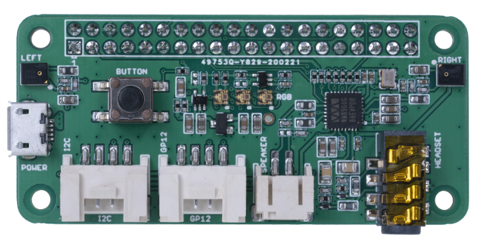

<!--
CO_OP_TRANSLATOR_METADATA:
{
  "original_hash": "93d352de36526b8990e41dd538100324",
  "translation_date": "2025-08-26T15:41:15+00:00",
  "source_file": "6-consumer/lessons/1-speech-recognition/wio-terminal-microphone.md",
  "language_code": "es"
}
-->
# Configura tu micrófono y altavoces - Wio Terminal

En esta parte de la lección, añadirás altavoces a tu Wio Terminal. El Wio Terminal ya tiene un micrófono incorporado, que puede usarse para capturar voz.

## Hardware

El Wio Terminal ya tiene un micrófono integrado, que puede usarse para capturar audio para el reconocimiento de voz.

Para añadir un altavoz, puedes usar el [ReSpeaker 2-Mics Pi Hat](https://www.seeedstudio.com/ReSpeaker-2-Mics-Pi-HAT.html). Este es un módulo externo que contiene 2 micrófonos MEMS, además de un conector para altavoz y una entrada para auriculares.

Necesitarás añadir auriculares, un altavoz con conector de 3.5mm o un altavoz con conexión JST como el [Mono Enclosed Speaker - 2W 6 Ohm](https://www.seeedstudio.com/Mono-Enclosed-Speaker-2W-6-Ohm-p-2832.html).

Para conectar el ReSpeaker 2-Mics Pi Hat necesitarás cables jumper de 40 pines (también conocidos como macho a macho).

> 💁 Si te sientes cómodo soldando, puedes usar el [40 Pin Raspberry Pi Hat Adapter Board For Wio Terminal](https://www.seeedstudio.com/40-Pin-Raspberry-Pi-Hat-Adapter-Board-For-Wio-Terminal-p-4730.html) para conectar el ReSpeaker.

También necesitarás una tarjeta SD para descargar y reproducir audio. El Wio Terminal solo admite tarjetas SD de hasta 16GB de capacidad, y estas deben estar formateadas en FAT32 o exFAT.

### Tarea - conectar el ReSpeaker Pi Hat

1. Con el Wio Terminal apagado, conecta el ReSpeaker 2-Mics Pi Hat al Wio Terminal usando los cables jumper y los conectores GPIO en la parte trasera del Wio Terminal:

    Los pines deben conectarse de la siguiente manera:

    

1. Coloca el ReSpeaker y el Wio Terminal con los conectores GPIO hacia arriba y en el lado izquierdo.

1. Comienza desde el conector en la esquina superior izquierda del GPIO del ReSpeaker. Conecta un cable jumper desde el conector superior izquierdo del ReSpeaker al conector superior izquierdo del Wio Terminal.

1. Repite este proceso hasta llegar al final de los conectores GPIO en el lado izquierdo. Asegúrate de que los pines estén bien ajustados.

    

    

    > 💁 Si tus cables jumper están agrupados en cintas, mantenlos juntos; esto facilita asegurarte de que todos los cables estén conectados en orden.

1. Repite el proceso usando los conectores GPIO del lado derecho en el ReSpeaker y el Wio Terminal. Estos cables deben pasar alrededor de los cables que ya están en su lugar.

    

    

    > 💁 Si tus cables jumper están agrupados en cintas, sepáralos en dos cintas. Pasa una por cada lado de los cables existentes.

    > 💁 Puedes usar cinta adhesiva para mantener los pines en un bloque y evitar que se suelten mientras los conectas.
    >
    > 

1. Necesitarás añadir un altavoz.

    * Si estás usando un altavoz con cable JST, conéctalo al puerto JST en el ReSpeaker.

      

    * Si estás usando un altavoz con conector de 3.5mm o auriculares, insértalos en la entrada de 3.5mm.

      

### Tarea - configurar la tarjeta SD

1. Conecta la tarjeta SD a tu computadora, usando un lector externo si no tienes una ranura para tarjetas SD.

1. Formatea la tarjeta SD usando la herramienta adecuada en tu computadora, asegurándote de usar el sistema de archivos FAT32 o exFAT.

1. Inserta la tarjeta SD en la ranura para tarjetas SD en el lado izquierdo del Wio Terminal, justo debajo del botón de encendido. Asegúrate de que la tarjeta esté completamente insertada y haga clic; es posible que necesites una herramienta delgada u otra tarjeta SD para ayudar a empujarla completamente.

    

    > 💁 Para expulsar la tarjeta SD, necesitas presionarla ligeramente y saldrá. Necesitarás una herramienta delgada para hacerlo, como un destornillador plano u otra tarjeta SD.

---

**Descargo de responsabilidad**:  
Este documento ha sido traducido utilizando el servicio de traducción automática [Co-op Translator](https://github.com/Azure/co-op-translator). Si bien nos esforzamos por garantizar la precisión, tenga en cuenta que las traducciones automatizadas pueden contener errores o imprecisiones. El documento original en su idioma nativo debe considerarse la fuente autorizada. Para información crítica, se recomienda una traducción profesional realizada por humanos. No nos hacemos responsables de malentendidos o interpretaciones erróneas que puedan surgir del uso de esta traducción.