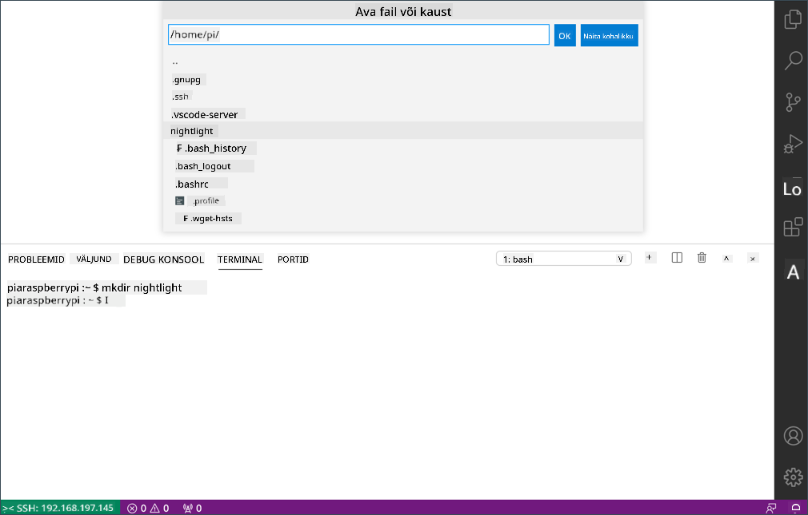

<!--
CO_OP_TRANSLATOR_METADATA:
{
  "original_hash": "8ff0d0a1d29832bb896b9c103b69a452",
  "translation_date": "2025-10-11T11:24:27+00:00",
  "source_file": "1-getting-started/lessons/1-introduction-to-iot/pi.md",
  "language_code": "et"
}
-->
# Raspberry Pi

[Raspberry Pi](https://raspberrypi.org) on üheplaadiline arvuti. Saad lisada sensoreid ja täitureid, kasutades mitmesuguseid seadmeid ja ökosüsteeme. Nendes õppetundides kasutatakse riistvara ökosüsteemi nimega [Grove](https://www.seeedstudio.com/category/Grove-c-1003.html). Sa programmeerid oma Pi-d ja pääsed Grove sensoritele ligi Pythonis.


## Seadistamine

Kui kasutad Raspberry Pi-d oma IoT riistvarana, on sul kaks valikut – võid läbida kõik need õppetunnid ja programmeerida otse Pi-l või ühendada kaugühenduse kaudu 'peata' Pi ja programmeerida oma arvutist.

Enne alustamist tuleb ühendada Grove Base Hat oma Pi-ga.

### Ülesanne - seadistamine

Paigalda Grove Base Hat oma Pi-le ja konfigureeri Pi.

1. Ühenda Grove Base Hat oma Pi-le. Mütsil olev pesa sobib kõigi Pi GPIO pinidega, libistades selle täielikult alla, et see kindlalt alusele kinnituks. Müts katab Pi-d.

    

1. Otsusta, kuidas soovid oma Pi-d programmeerida, ja mine vastavasse sektsiooni allpool:

    * [Töö otse Pi-l](../../../../../1-getting-started/lessons/1-introduction-to-iot)
    * [Kaugjuurdepääs Pi programmeerimiseks](../../../../../1-getting-started/lessons/1-introduction-to-iot)

### Töö otse Pi-l

Kui soovid töötada otse Pi-l, saad kasutada Raspberry Pi OS-i töölauaversiooni ja paigaldada kõik vajalikud tööriistad.

#### Ülesanne - töö otse Pi-l

Seadista oma Pi arendamiseks.

1. Järgi juhiseid [Raspberry Pi seadistamise juhendis](https://projects.raspberrypi.org/en/projects/raspberry-pi-setting-up), et seadistada oma Pi, ühendada see klaviatuuri/hiire/monitoriga, ühendada see WiFi või Etherneti võrku ja uuendada tarkvara.

Pi programmeerimiseks Grove sensorite ja täituritega tuleb paigaldada redaktor, mis võimaldab kirjutada seadme koodi, ning mitmesugused raamatukogud ja tööriistad, mis suhtlevad Grove riistvaraga.

1. Kui Pi on taaskäivitunud, ava Terminal, klõpsates **Terminal** ikooni ülemisel menüüribal või valides *Menu -> Accessories -> Terminal*

1. Käivita järgmine käsk, et tagada operatsioonisüsteemi ja paigaldatud tarkvara ajakohasus:

    ```sh
    sudo apt update && sudo apt full-upgrade --yes
    ```

1. Käivita järgmised käsud, et paigaldada kõik vajalikud raamatukogud Grove riistvara jaoks:

    ```sh
    sudo apt install git python3-dev python3-pip --yes

    git clone https://github.com/Seeed-Studio/grove.py
    cd grove.py
    sudo pip3 install .

    sudo raspi-config nonint do_i2c 0
    ```

    See algab Giti ja Pipi paigaldamisega Python pakettide paigaldamiseks.

    Üks Pythoni võimsamaid omadusi on [Pip pakettide](https://pypi.org) paigaldamise võimalus – need on teiste inimeste kirjutatud ja internetti üles laaditud koodipaketid. Sa saad ühe käsuga paigaldada Pip paketi oma arvutisse ja kasutada seda oma koodis.

    Seeed Grove Python paketid tuleb paigaldada lähtekoodist. Need käsud kloonivad repo, mis sisaldab selle paketi lähtekoodi, ja paigaldavad selle lokaalselt.

    > 💁 Vaikimisi, kui paigaldad paketi, on see saadaval kõikjal su arvutis, mis võib põhjustada probleeme pakettide versioonidega – näiteks üks rakendus sõltub ühest paketi versioonist, mis võib katki minna, kui paigaldad uue versiooni teise rakenduse jaoks. Selle probleemi lahendamiseks saad kasutada [Pythoni virtuaalset keskkonda](https://docs.python.org/3/library/venv.html), mis on sisuliselt Pythoni koopia spetsiaalses kaustas, ja kui paigaldad Pip pakette, paigaldatakse need ainult sellesse kausta. Pi-d kasutades ei kasuta sa virtuaalseid keskkondi. Grove paigaldusskript paigaldab Grove Python paketid globaalselt, nii et virtuaalse keskkonna kasutamiseks peaksid seadistama virtuaalse keskkonna ja seejärel käsitsi Grove paketid sinna keskkonda uuesti paigaldama. Lihtsam on kasutada globaalseid pakette, eriti kuna paljud Pi arendajad vilguvad iga projekti jaoks puhta SD-kaardi.

    Lõpuks lubatakse I<sup>2</sup>C liides.

1. Taaskäivita Pi, kasutades menüüd või käivitades järgmise käsu Terminalis:

    ```sh
    sudo reboot
    ```

1. Kui Pi on taaskäivitunud, ava Terminal uuesti ja käivita järgmine käsk, et paigaldada [Visual Studio Code (VS Code)](https://code.visualstudio.com?WT.mc_id=academic-17441-jabenn) – see on redaktor, mida kasutad seadme koodi kirjutamiseks Pythonis.

    ```sh
    sudo apt install code
    ```

    Kui see on paigaldatud, on VS Code saadaval ülemisest menüüst.

    > 💁 Sul on vabadus kasutada mis tahes Pythoni IDE-d või redaktorit, kui sul on eelistatud tööriist, kuid õppetunnid annavad juhiseid, lähtudes VS Code kasutamisest.

1. Paigalda Pylance. See on VS Code laiendus, mis pakub Pythoni keele tuge. Vaata [Pylance laienduse dokumentatsiooni](https://marketplace.visualstudio.com/items?WT.mc_id=academic-17441-jabenn&itemName=ms-python.vscode-pylance), et saada juhiseid selle laienduse paigaldamiseks VS Code-sse.

### Kaugjuurdepääs Pi programmeerimiseks

Selle asemel, et programmeerida otse Pi-l, saab Pi töötada 'peata' režiimis, st mitte olla ühendatud klaviatuuri/hiire/monitoriga, ja konfigureerida ning programmeerida seda oma arvutist, kasutades Visual Studio Code-i.

#### Seadista Pi OS

Kaugjuurdepääsuks tuleb Pi OS paigaldada SD-kaardile.

##### Ülesanne - seadista Pi OS

Seadista peata Pi OS.

1. Laadi alla **Raspberry Pi Imager** [Raspberry Pi OS tarkvara lehelt](https://www.raspberrypi.org/software/) ja paigalda see.

1. Sisesta SD-kaart oma arvutisse, vajadusel adapteri abil.

1. Käivita Raspberry Pi Imager.

1. Raspberry Pi Imageris vali **CHOOSE OS** nupp, seejärel vali *Raspberry Pi OS (Other)* ja *Raspberry Pi OS Lite (32-bit)*.

    

    > 💁 Raspberry Pi OS Lite on Raspberry Pi OS-i versioon, millel puudub töölaua kasutajaliides ja UI-põhised tööriistad. Need pole peata Pi jaoks vajalikud, teevad paigalduse väiksemaks ja käivitamise kiiremaks.

1. Vali **CHOOSE STORAGE** nupp ja seejärel oma SD-kaart.

1. Käivita **Advanced Options**, vajutades `Ctrl+Shift+X`. Need valikud võimaldavad Raspberry Pi OS-i eelkonfigureerimist enne selle kirjutamist SD-kaardile.

    1. Märgi **Enable SSH** märkeruut ja määra parool `pi` kasutajale. See on parool, mida kasutad hiljem Pi-le sisselogimiseks.

    1. Kui plaanid Pi-d ühendada WiFi kaudu, märgi **Configure WiFi** märkeruut ja sisesta oma WiFi SSID ja parool ning vali oma WiFi riik. Seda pole vaja teha, kui kasutad Etherneti kaablit. Veendu, et võrk, millega ühendad, on sama, kus su arvuti asub.

    1. Märgi **Set locale settings** märkeruut ja määra oma riik ja ajavöönd.

    1. Vali **SAVE** nupp.

1. Vali **WRITE** nupp, et kirjutada OS SD-kaardile. Kui kasutad macOS-i, küsitakse sinult parooli, kuna aluseks olev tööriist, mis kirjutab kettapilte, vajab privileegitud juurdepääsu.

OS kirjutatakse SD-kaardile ja kui see on valmis, eemaldab operatsioonisüsteem kaardi ja teavitab sind. Eemalda SD-kaart oma arvutist, sisesta see Pi-sse, lülita Pi sisse ja oota umbes 2 minutit, et see korralikult käivituks.

#### Ühenda Pi-ga

Järgmine samm on Pi-le kaugjuurdepääs. Seda saab teha `ssh` abil, mis on saadaval macOS-is, Linuxis ja Windowsi uuemates versioonides.

##### Ülesanne - ühenda Pi-ga

Juurdepääs Pi-le kaugühenduse kaudu.

1. Käivita Terminal või Command Prompt ja sisesta järgmine käsk, et Pi-ga ühenduda:

    ```sh
    ssh pi@raspberrypi.local
    ```

    Kui kasutad Windowsi vanemat versiooni, millel pole `ssh` paigaldatud, saad kasutada OpenSSH-d. Paigaldusjuhised leiad [OpenSSH paigaldamise dokumentatsioonist](https://docs.microsoft.com//windows-server/administration/openssh/openssh_install_firstuse?WT.mc_id=academic-17441-jabenn).

1. See peaks ühendama sind Pi-ga ja küsima parooli.

    Võimalus leida arvuteid oma võrgus, kasutades `<hostname>.local`, on Linuxi ja Windowsi suhteliselt hiljutine lisand. Kui kasutad Linuxi või Windowsi ja saad veateateid, et hostinime ei leitud, pead paigaldama täiendava tarkvara, et lubada ZeroConf võrgundus (Apple nimetab seda ka Bonjouriks):

    1. Kui kasutad Linuxi, paigalda Avahi järgmise käsuga:

        ```sh
        sudo apt-get install avahi-daemon
        ```

    1. Kui kasutad Windowsi, on ZeroConf lubamiseks kõige lihtsam paigaldada [Bonjour Print Services for Windows](http://support.apple.com/kb/DL999). Samuti saad paigaldada [iTunes for Windows](https://www.apple.com/itunes/download/), et saada uuem versioon utiliidist (mida pole eraldi saadaval).

    > 💁 Kui sa ei saa ühendust `raspberrypi.local` abil, saad kasutada Pi IP-aadressi. Vaata [Raspberry Pi IP-aadressi dokumentatsiooni](https://www.raspberrypi.org/documentation/remote-access/ip-address.md), et saada juhiseid mitmel viisil IP-aadressi leidmiseks.

1. Sisesta parool, mille määrasid Raspberry Pi Imager Advanced Options-is.

#### Konfigureeri tarkvara Pi-l

Kui oled Pi-ga ühendatud, tuleb tagada, et operatsioonisüsteem on ajakohane, ja paigaldada mitmesugused raamatukogud ja tööriistad, mis suhtlevad Grove riistvaraga.

##### Ülesanne - konfigureeri tarkvara Pi-l

Konfigureeri paigaldatud Pi tarkvara ja paigalda Grove raamatukogud.

1. Oma `ssh` sessioonist käivita järgmine käsk, et uuendada ja seejärel taaskäivitada Pi:

    ```sh
    sudo apt update && sudo apt full-upgrade --yes && sudo reboot
    ```

    Pi uuendatakse ja taaskäivitatakse. `ssh` sessioon lõpeb, kui Pi taaskäivitub, nii et oota umbes 30 sekundit ja ühenda uuesti.

1. Taasühendatud `ssh` sessioonist käivita järgmised käsud, et paigaldada kõik vajalikud raamatukogud Grove riistvara jaoks:

    ```sh
    sudo apt install git python3-dev python3-pip --yes

    git clone https://github.com/Seeed-Studio/grove.py
    cd grove.py
    sudo pip3 install .

    sudo raspi-config nonint do_i2c 0
    ```

    See algab Giti ja Pipi paigaldamisega Python pakettide paigaldamiseks.

    Üks Pythoni võimsamaid omadusi on [Pip pakettide](https://pypi.org) paigaldamise võimalus – need on teiste inimeste kirjutatud ja internetti üles laaditud koodipaketid. Sa saad ühe käsuga paigaldada Pip paketi oma arvutisse ja kasutada seda oma koodis.

    Seeed Grove Python paketid tuleb paigaldada lähtekoodist. Need käsud kloonivad repo, mis sisaldab selle paketi lähtekoodi, ja paigaldavad selle lokaalselt.

    > 💁 Vaikimisi, kui paigaldad paketi, on see saadaval kõikjal su arvutis, mis võib põhjustada probleeme pakettide versioonidega – näiteks üks rakendus sõltub ühest paketi versioonist, mis võib katki minna, kui paigaldad uue versiooni teise rakenduse jaoks. Selle probleemi lahendamiseks saad kasutada [Pythoni virtuaalset keskkonda](https://docs.python.org/3/library/venv.html), mis on sisuliselt Pythoni koopia spetsiaalses kaustas, ja kui paigaldad Pip pakette, paigaldatakse need ainult sellesse kausta. Pi-d kasutades ei kasuta sa virtuaalseid keskkondi. Grove paigaldusskript paigaldab Grove Python paketid globaalselt, nii et virtuaalse keskkonna kasutamiseks peaksid seadistama virtuaalse keskkonna ja seejärel käsitsi Grove paketid sinna keskkonda uuesti paigaldama. Lihtsam on kasutada globaalseid pakette, eriti kuna paljud Pi arendajad vilguvad iga projekti jaoks puhta SD-kaardi.

    Lõpuks lubatakse I<sup>2</sup>C liides.

1. Taaskäivita Pi, käivitades järgmise käsu:

    ```sh
    sudo reboot
    ```

    `ssh` sessioon lõpeb, kui Pi taaskäivitub. Pole vaja uuesti ühendust luua.

#### Konfigureeri VS Code kaugjuurdepääsuks

Kui Pi on konfigureeritud, saad sellega ühenduda, kasutades Visual Studio Code-i (VS Code) oma arvutist – see on tasuta arendaja tekstiredaktor, mida kasutad seadme koodi kirjutamiseks Pythonis.

##### Ülesanne - konfigureeri VS Code kaugjuurdepääsuks

Paigalda vajalik tarkvara ja ühenda kaugühenduse kaudu oma Pi-ga.

1. Paigalda VS Code oma arvutisse, järgides [VS Code dokumentatsiooni](https://code.visualstudio.com?WT.mc_id=academic-17441-jabenn).

1. Järgi juhiseid [VS Code kaugarenduse SSH dokumentatsioonis](https://code.visualstudio.com/docs/remote/ssh?WT.mc_id=academic-17441-jabenn), et paigaldada vajalikud komponendid.

1. Järgides samu juhiseid, ühenda VS Code Pi-ga.
1. Kui ühendus on loodud, järgige juhiseid [laienduste haldamine](https://code.visualstudio.com/docs/remote/ssh#_managing-extensions?WT.mc_id=academic-17441-jabenn), et paigaldada [Pylance laiendus](https://marketplace.visualstudio.com/items?WT.mc_id=academic-17441-jabenn&itemName=ms-python.vscode-pylance) kaugühenduse kaudu Pi-le.

## Tere maailm

Uue programmeerimiskeele või tehnoloogia kasutuselevõtul on tavaks luua "Tere maailm" rakendus – väike rakendus, mis kuvab midagi sellist nagu tekst `"Tere maailm"`, et näidata, et kõik tööriistad on õigesti seadistatud.

Pi jaoks mõeldud "Tere maailm" rakendus tagab, et Python ja Visual Studio Code on korrektselt paigaldatud.

See rakendus asub kaustas nimega `nightlight` ja seda kasutatakse hiljem erineva koodiga, et ehitada öölambi rakendus.

### Ülesanne - tere maailm

Loo "Tere maailm" rakendus.

1. Käivita VS Code, kas otse Pi-l või oma arvutis, ühendades Pi-ga Remote SSH laienduse abil.

1. Ava VS Code terminal, valides *Terminal -> New Terminal* või vajutades `` CTRL+` ``. Terminal avaneb `pi` kasutaja kodukataloogis.

1. Käivita järgmised käsud, et luua kataloog oma koodi jaoks ja luua Python-fail nimega `app.py` selle kataloogi sees:

    ```sh
    mkdir nightlight
    cd nightlight
    touch app.py
    ```

1. Ava see kaust VS Code'is, valides *File -> Open...* ja valides *nightlight* kausta, seejärel vali **OK**.

    

1. Ava `app.py` fail VS Code exploreris ja lisa järgmine kood:

    ```python
    print('Hello World!')
    ```

    Funktsioon `print` kuvab konsoolile kõik, mis sellele edastatakse.

1. Käivita VS Code terminalis järgmine käsk, et oma Python-rakendus käivitada:

    ```sh
    python app.py
    ```

    > 💁 Võib olla vajalik koodi käivitamiseks selgesõnaliselt kasutada `python3`, kui sul on lisaks Python 3-le paigaldatud ka Python 2 (vanem versioon). Kui sul on paigaldatud Python 2, siis `python` käivitamine kasutab Python 2 asemel Python 3. Vaikimisi on uusimatel Raspberry Pi OS versioonidel paigaldatud ainult Python 3.

    Järgmine väljund ilmub terminalis:

    ```output
    pi@raspberrypi:~/nightlight $ python3 app.py
    Hello World!
    ```

> 💁 Selle koodi leiad kaustast [code/pi](../../../../../1-getting-started/lessons/1-introduction-to-iot/code/pi).

😀 Sinu "Tere maailm" programm õnnestus!

---

**Lahtiütlus**:  
See dokument on tõlgitud AI tõlketeenuse [Co-op Translator](https://github.com/Azure/co-op-translator) abil. Kuigi püüame tagada täpsust, palume arvestada, et automaatsed tõlked võivad sisaldada vigu või ebatäpsusi. Algne dokument selle algses keeles tuleks pidada autoriteetseks allikaks. Olulise teabe puhul soovitame kasutada professionaalset inimtõlget. Me ei vastuta selle tõlke kasutamisest tulenevate arusaamatuste või valesti tõlgenduste eest.