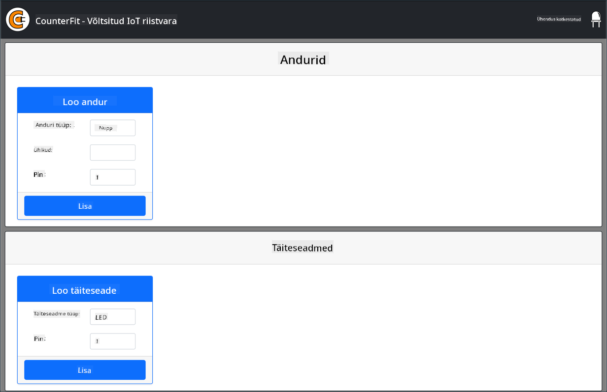
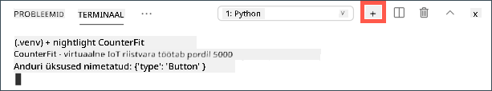
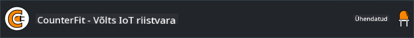

<!--
CO_OP_TRANSLATOR_METADATA:
{
  "original_hash": "52b4de6144b2efdced7797a5339d6035",
  "translation_date": "2025-10-11T11:25:40+00:00",
  "source_file": "1-getting-started/lessons/1-introduction-to-iot/virtual-device.md",
  "language_code": "et"
}
-->
# Virtuaalne üheplaadiarvuti

Selle asemel, et osta IoT-seade koos sensorite ja täituritega, saate kasutada oma arvutit IoT-riistvara simuleerimiseks. [CounterFit projekt](https://github.com/CounterFit-IoT/CounterFit) võimaldab teil käivitada rakenduse lokaalselt, mis simuleerib IoT-riistvara, nagu sensorid ja täiturid, ning pääseda nendele ligi lokaalse Python-koodi kaudu, mis on kirjutatud samamoodi nagu füüsilise riistvara kasutamisel Raspberry Pi peal.

## Seadistamine

CounterFiti kasutamiseks peate oma arvutisse paigaldama tasuta tarkvara.

### Ülesanne

Paigaldage vajalik tarkvara.

1. Paigaldage Python. Vaadake [Pythoni allalaadimise lehte](https://www.python.org/downloads/), et saada juhiseid Pythoni uusima versiooni paigaldamiseks.

1. Paigaldage Visual Studio Code (VS Code). See on redaktor, mida kasutate oma virtuaalse seadme koodi kirjutamiseks Pythonis. Vaadake [VS Code dokumentatsiooni](https://code.visualstudio.com?WT.mc_id=academic-17441-jabenn), et saada juhiseid VS Code'i paigaldamiseks.

    > 💁 Teil on vabadus kasutada mis tahes Python IDE-d või redaktorit, kui eelistate mõnda muud tööriista, kuid õppetunnid põhinevad VS Code'i kasutamisel.

1. Paigaldage VS Code'i Pylance laiendus. See on VS Code'i laiendus, mis pakub Pythoni keele tuge. Vaadake [Pylance laienduse dokumentatsiooni](https://marketplace.visualstudio.com/items?WT.mc_id=academic-17441-jabenn&itemName=ms-python.vscode-pylance), et saada juhiseid selle laienduse paigaldamiseks VS Code'i.

CounterFiti rakenduse paigaldamise ja seadistamise juhised antakse vastaval ajal ülesande juhistes, kuna see paigaldatakse iga projekti jaoks eraldi.

## Tere maailm

Traditsiooniliselt alustatakse uue programmeerimiskeele või tehnoloogiaga tutvumist "Tere maailm" rakenduse loomisega - väikese rakendusega, mis kuvab midagi sellist nagu tekst `"Tere maailm"`, et näidata, et kõik tööriistad on õigesti seadistatud.

Virtuaalse IoT-riistvara "Tere maailm" rakendus tagab, et Python ja Visual Studio Code on õigesti paigaldatud. Samuti ühendatakse see CounterFitiga virtuaalsete IoT-sensorite ja täiturite jaoks. See ei kasuta riistvara, vaid ühendub, et tõestada, et kõik töötab.

See rakendus asub kaustas `nightlight` ja seda kasutatakse hiljem erineva koodiga, et ehitada öölambi rakendus.

### Pythoni virtuaalse keskkonna seadistamine

Üks Pythoni võimsatest omadustest on [Pip pakettide](https://pypi.org) paigaldamise võimalus - need on teiste inimeste kirjutatud ja internetti üles laaditud koodipaketid. Saate Pip paketi oma arvutisse paigaldada ühe käsuga ja seejärel kasutada seda paketti oma koodis. Kasutate Pip'i CounterFitiga suhtlemiseks vajaliku paketi paigaldamiseks.

Vaikimisi, kui paigaldate paketi, on see saadaval kõikjal teie arvutis, mis võib põhjustada probleeme pakettide versioonidega - näiteks kui üks rakendus sõltub ühest paketi versioonist, mis katkeb, kui paigaldate uue versiooni teise rakenduse jaoks. Selle probleemi lahendamiseks saate kasutada [Pythoni virtuaalset keskkonda](https://docs.python.org/3/library/venv.html), mis on sisuliselt Pythoni koopia pühendatud kaustas, ja kui paigaldate Pip pakette, paigaldatakse need ainult sellesse kausta.

> 💁 Kui kasutate Raspberry Pi-d, siis te ei seadista virtuaalset keskkonda sellel seadmel Pip pakettide haldamiseks, vaid kasutate globaalseid pakette, kuna Grove'i paketid paigaldatakse globaalselt installeri skripti abil.

#### Ülesanne - Pythoni virtuaalse keskkonna seadistamine

Seadistage Pythoni virtuaalne keskkond ja paigaldage CounterFiti jaoks vajalikud Pip paketid.

1. Käivitage oma terminalis või käsureal järgmised käsud, et luua ja liikuda uude kataloogi:

    ```sh
    mkdir nightlight
    cd nightlight
    ```

1. Nüüd käivitage järgmine käsk, et luua virtuaalne keskkond `.venv` kaustas:

    ```sh
    python3 -m venv .venv
    ```

    > 💁 Virtuaalse keskkonna loomiseks peate selgesõnaliselt kutsuma `python3`, juhuks kui teil on lisaks Python 3-le paigaldatud ka Python 2. Kui Python 2 on paigaldatud, siis `python` kasutamine käivitab Python 2, mitte Python 3.

1. Aktiveerige virtuaalne keskkond:

    * Windowsis:
        * Kui kasutate käsurida või käsurida Windows Terminali kaudu, käivitage:

            ```cmd
            .venv\Scripts\activate.bat
            ```

        * Kui kasutate PowerShelli, käivitage:

            ```powershell
            .\.venv\Scripts\Activate.ps1
            ```

            > Kui saate veateate, et skriptide käivitamine on sellel süsteemil keelatud, peate lubama skriptide käivitamise, määrates sobiva täitmise poliitika. Seda saate teha, käivitades PowerShelli administraatorina ja seejärel käivitades järgmise käsu:

            ```powershell
            Set-ExecutionPolicy -ExecutionPolicy Unrestricted
            ```

            Sisestage `Y`, kui palutakse kinnitada. Seejärel käivitage PowerShell uuesti ja proovige uuesti.

            Vajadusel saate hiljem selle täitmise poliitika lähtestada. Lisateavet leiate [Microsoft Docs'i täitmise poliitikate lehelt](https://docs.microsoft.com/powershell/module/microsoft.powershell.core/about/about_execution_policies?WT.mc_id=academic-17441-jabenn).

    * macOS-is või Linuxis käivitage:

        ```cmd
        source ./.venv/bin/activate
        ```

    > 💁 Need käsud tuleks käivitada samast asukohast, kus käivitasite virtuaalse keskkonna loomise käsu. Te ei pea kunagi `.venv` kausta sisse liikuma, peaksite alati käivitama aktiveerimiskäsu ja kõik käsud pakettide paigaldamiseks või koodi käivitamiseks kaustast, kus olite virtuaalse keskkonna loomisel.

1. Kui virtuaalne keskkond on aktiveeritud, käivitab vaikimisi `python` käsk Pythoni versiooni, mida kasutati virtuaalse keskkonna loomiseks. Käivitage järgmine käsk, et saada versioon:

    ```sh
    python --version
    ```

    Väljund peaks sisaldama järgmist:

    ```output
    (.venv) ➜  nightlight python --version
    Python 3.9.1
    ```

    > 💁 Teie Pythoni versioon võib olla erinev - kui see on vähemalt versioon 3.6, on kõik korras. Kui ei, kustutage see kaust, paigaldage uuem Pythoni versioon ja proovige uuesti.

1. Käivitage järgmised käsud, et paigaldada CounterFiti jaoks vajalikud Pip paketid. Need paketid sisaldavad peamist CounterFiti rakendust ja Grove'i riistvara jaoks mõeldud shime. Need shimid võimaldavad teil kirjutada koodi nii, nagu programmeeriksite füüsiliste sensorite ja täituritega Grove'i ökosüsteemist, kuid ühendatuna virtuaalsete IoT-seadmetega.

    ```sh
    pip install CounterFit
    pip install counterfit-connection
    pip install counterfit-shims-grove
    ```

    Need Pip paketid paigaldatakse ainult virtuaalsesse keskkonda ja ei ole saadaval väljaspool seda.

### Koodi kirjutamine

Kui Pythoni virtuaalne keskkond on valmis, saate kirjutada "Tere maailm" rakenduse koodi.

#### Ülesanne - koodi kirjutamine

Looge Pythoni rakendus, mis kuvab konsoolile `"Tere maailm"`.

1. Käivitage oma terminalis või käsureal järgmised käsud virtuaalses keskkonnas, et luua Pythoni fail nimega `app.py`:

    * Windowsis käivitage:

        ```cmd
        type nul > app.py
        ```

    * macOS-is või Linuxis käivitage:

        ```cmd
        touch app.py
        ```

1. Avage praegune kaust VS Code'is:

    ```sh
    code .
    ```

    > 💁 Kui teie terminal tagastab macOS-is `command not found`, tähendab see, et VS Code'i pole lisatud PATH-i. Saate lisada VS Code'i PATH-i, järgides juhiseid [VS Code'i dokumentatsiooni jaotises "Käivitamine käsurealt"](https://code.visualstudio.com/docs/setup/mac?WT.mc_id=academic-17441-jabenn#_launching-from-the-command-line) ja käivitades käsu hiljem. VS Code lisatakse PATH-i vaikimisi Windowsis ja Linuxis.

1. Kui VS Code käivitub, aktiveerib see Pythoni virtuaalse keskkonna. Valitud virtuaalne keskkond kuvatakse alumises olekuribal:

    

1. Kui VS Code Terminal on juba käivitunud, kui VS Code käivitub, ei ole virtuaalne keskkond selles aktiveeritud. Kõige lihtsam on terminal sulgeda, kasutades nuppu **Kill the active terminal instance**:

    

    Saate aru, kas terminalis on virtuaalne keskkond aktiveeritud, kui terminali promptil on virtuaalse keskkonna nimi eesliitena. Näiteks võib see olla:

    ```sh
    (.venv) ➜  nightlight
    ```

    Kui promptil ei ole `.venv` eesliidet, siis virtuaalne keskkond ei ole terminalis aktiivne.

1. Käivitage uus VS Code Terminal, valides *Terminal -> New Terminal* või vajutades `` CTRL+` ``. Uus terminal laadib virtuaalse keskkonna ja selle aktiveerimise käsk ilmub terminalis. Promptil on ka virtuaalse keskkonna nimi (`.venv`):

    ```output
    ➜  nightlight source .venv/bin/activate
    (.venv) ➜  nightlight 
    ```

1. Avage VS Code'i exploreris `app.py` fail ja lisage järgmine kood:

    ```python
    print('Hello World!')
    ```

    Funktsioon `print` kuvab konsoolile kõik, mis sellele edastatakse.

1. Käivitage VS Code'i terminalis järgmine käsk, et käivitada oma Pythoni rakendus:

    ```sh
    python app.py
    ```

    Väljundis peaks olema:

    ```output
    (.venv) ➜  nightlight python app.py 
    Hello World!
    ```

😀 Teie "Tere maailm" programm õnnestus!

### Ühendage 'riistvara'

Teise "Tere maailm" sammuna käivitate CounterFiti rakenduse ja ühendate oma koodi sellega. See on virtuaalne ekvivalent IoT-riistvara ühendamisele arenduskomplektiga.

#### Ülesanne - 'riistvara' ühendamine

1. Käivitage VS Code'i terminalis CounterFiti rakendus järgmise käsuga:

    ```sh
    counterfit
    ```

    Rakendus hakkab tööle ja avaneb teie veebibrauseris:

    

    See on märgitud kui *Disconnected* ja paremas ülanurgas olev LED on välja lülitatud.

1. Lisage järgmine kood `app.py` faili algusesse:

    ```python
    from counterfit_connection import CounterFitConnection
    CounterFitConnection.init('127.0.0.1', 5000)
    ```

    See kood impordib `CounterFitConnection` klassi moodulist `counterfit_connection`, mis pärineb varem paigaldatud `counterfit-connection` pip paketist. Seejärel algatatakse ühendus CounterFiti rakendusega, mis töötab aadressil `127.0.0.1`, mis on IP-aadress, mida saab alati kasutada kohaliku arvuti (tihti nimetatud *localhost*) juurde pääsemiseks, pordil 5000.

    > 💁 Kui teil on teisi rakendusi, mis töötavad pordil 5000, saate seda muuta, uuendades koodi porti ja käivitades CounterFiti käsuga `CounterFit --port <port_number>`, asendades `<port_number>` soovitud pordiga.

1. Peate käivitama uue VS Code'i terminali, valides **Create a new integrated terminal** nupu. Seda seetõttu, et CounterFiti rakendus töötab praeguses terminalis.

    

1. Käivitage selles uues terminalis `app.py` fail nagu varem. CounterFiti olek muutub **Connected** ja LED süttib.

    

> 💁 Selle koodi leiate kaustast [code/virtual-device](../../../../../1-getting-started/lessons/1-introduction-to-iot/code/virtual-device).

😀 Teie ühendus riistvaraga õnnestus!

---

**Lahtiütlus**:  
See dokument on tõlgitud AI tõlketeenuse [Co-op Translator](https://github.com/Azure/co-op-translator) abil. Kuigi püüame tagada täpsust, palume arvestada, et automaatsed tõlked võivad sisaldada vigu või ebatäpsusi. Algne dokument selle algses keeles tuleks pidada autoriteetseks allikaks. Olulise teabe puhul soovitame kasutada professionaalset inimtõlget. Me ei vastuta selle tõlke kasutamisest tulenevate arusaamatuste või valesti tõlgenduste eest.