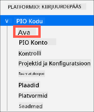
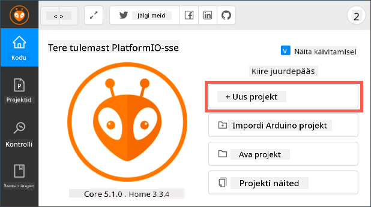
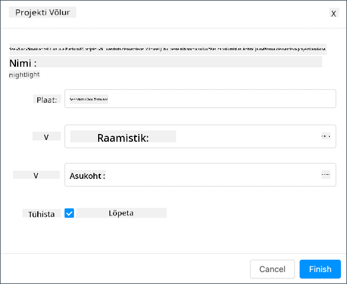
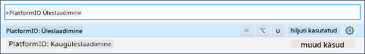
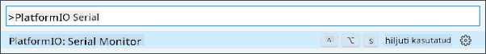

<!--
CO_OP_TRANSLATOR_METADATA:
{
  "original_hash": "a4f0c166010e31fd7b6ca20bc88dec6d",
  "translation_date": "2025-10-11T11:29:40+00:00",
  "source_file": "1-getting-started/lessons/1-introduction-to-iot/wio-terminal.md",
  "language_code": "et"
}
-->
# Wio Terminal

[Wio Terminal Seeed Studiosilt](https://www.seeedstudio.com/Wio-Terminal-p-4509.html) on Arduino-ühilduv mikrokontroller, millel on sisseehitatud WiFi, mõned sensorid ja aktuaatorid ning pordid, et lisada rohkem sensoreid ja aktuaatoreid, kasutades riistvara ökosüsteemi nimega [Grove](https://www.seeedstudio.com/category/Grove-c-1003.html).


## Seadistamine

Wio Terminali kasutamiseks peate oma arvutisse installima tasuta tarkvara. Enne WiFi-ühenduse loomist tuleb Wio Terminali püsivara uuendada.

### Ülesanne - seadistamine

Paigaldage vajalik tarkvara ja uuendage püsivara.

1. Installige Visual Studio Code (VS Code). See on redaktor, mida kasutate oma seadme koodi kirjutamiseks C/C++ keeles. Juhiste saamiseks VS Code'i installimiseks vaadake [VS Code'i dokumentatsiooni](https://code.visualstudio.com?WT.mc_id=academic-17441-jabenn).

    > 💁 Teine populaarne IDE Arduino arendamiseks on [Arduino IDE](https://www.arduino.cc/en/software). Kui olete selle tööriistaga juba tuttav, võite seda kasutada VS Code'i ja PlatformIO asemel, kuid õppetunnid põhinevad VS Code'i kasutamisel.

1. Installige VS Code'i PlatformIO laiendus. See on VS Code'i laiendus, mis toetab mikrokontrollerite programmeerimist C/C++ keeles. Juhiste saamiseks selle laienduse installimiseks VS Code'i vaadake [PlatformIO laienduse dokumentatsiooni](https://marketplace.visualstudio.com/items?WT.mc_id=academic-17441-jabenn&itemName=platformio.platformio-ide). See laiendus sõltub Microsofti C/C++ laiendusest, mis paigaldatakse automaatselt PlatformIO installimisel.

1. Ühendage Wio Terminal oma arvutiga. Wio Terminalil on USB-C port allosas, mis tuleb ühendada USB-pordiga teie arvutis. Wio Terminaliga on kaasas USB-C kuni USB-A kaabel, kuid kui teie arvutil on ainult USB-C pordid, vajate USB-C kaablit või USB-A kuni USB-C adapterit.

1. Järgige juhiseid [Wio Terminal Wiki WiFi ülevaate dokumentatsioonis](https://wiki.seeedstudio.com/Wio-Terminal-Network-Overview/), et seadistada oma Wio Terminal ja uuendada püsivara.

## Tere maailm

Uue programmeerimiskeele või tehnoloogiaga alustades on traditsiooniks luua 'Tere maailm' rakendus - väike rakendus, mis kuvab näiteks teksti `"Tere maailm"`, et näidata, et kõik tööriistad on õigesti seadistatud.

Wio Terminali Tere Maailm rakendus tagab, et Visual Studio Code on õigesti paigaldatud koos PlatformIO-ga ja seadistatud mikrokontrolleri arendamiseks.

### Loo PlatformIO projekt

Esimene samm on luua uus projekt, mis on PlatformIO-s seadistatud Wio Terminali jaoks.

#### Ülesanne - loo PlatformIO projekt

Loo PlatformIO projekt.

1. Ühenda Wio Terminal oma arvutiga

1. Käivita VS Code

1. PlatformIO ikoon on külgmenüüs:

    

    Vali see menüüvalik, seejärel vali *PIO Home -> Open*

    

1. Tervitusekraanil vali **+ New Project** nupp

    

1. Konfigureeri projekt *Project Wizard*is:

    1. Pane oma projektile nimeks `nightlight`

    1. *Board* rippmenüüst kirjuta `WIO`, et filtreerida plaate, ja vali *Seeeduino Wio Terminal*

    1. Jäta *Framework* väärtuseks *Arduino*

    1. Jäta *Use default location* märkeruut märgituks või tühista see ja vali oma projekti asukoht

    1. Vali **Finish** nupp

    

    PlatformIO laadib alla komponendid, mida on vaja Wio Terminali koodi kompileerimiseks, ja loob teie projekti. See võib võtta paar minutit.

### Uuri PlatformIO projekti

VS Code'i uurija näitab mitmeid faile ja kaustu, mille PlatformIO viisard on loonud.

#### Kaustad

* `.pio` - see kaust sisaldab ajutisi andmeid, mida PlatformIO vajab, nagu teegid või kompileeritud kood. Kui see kustutatakse, luuakse see automaatselt uuesti ja te ei pea seda lisama lähtekoodi kontrolli, kui jagate oma projekti sellistel saitidel nagu GitHub.
* `.vscode` - see kaust sisaldab PlatformIO ja VS Code'i konfiguratsiooni. Kui see kustutatakse, luuakse see automaatselt uuesti ja te ei pea seda lisama lähtekoodi kontrolli, kui jagate oma projekti sellistel saitidel nagu GitHub.
* `include` - see kaust on mõeldud väliste päisefailide jaoks, mida vajate täiendavate teekide lisamisel oma koodi. Selles õppetükis te seda kausta ei kasuta.
* `lib` - see kaust on mõeldud väliste teekide jaoks, mida soovite oma koodis kasutada. Selles õppetükis te seda kausta ei kasuta.
* `src` - see kaust sisaldab teie rakenduse peamist lähtekoodi. Alguses sisaldab see ainult ühte faili - `main.cpp`.
* `test` - see kaust on mõeldud teie koodi üksustestide jaoks.

#### Failid

* `main.cpp` - see fail `src` kaustas sisaldab teie rakenduse alguspunkti. Avage see fail, ja see sisaldab järgmist koodi:

    ```cpp
    #include <Arduino.h>
    
    void setup() {
      // put your setup code here, to run once:
    }
    
    void loop() {
      // put your main code here, to run repeatedly:
    }
    ```

    Kui seade käivitub, käivitab Arduino raamistik funktsiooni `setup` üks kord, seejärel käivitab funktsiooni `loop` korduvalt, kuni seade välja lülitatakse.

* `.gitignore` - see fail loetleb failid ja kataloogid, mida tuleb ignoreerida, kui lisate oma koodi git lähtekoodi kontrolli, näiteks üleslaadimisel GitHubi.

* `platformio.ini` - see fail sisaldab konfiguratsiooni teie seadme ja rakenduse jaoks. Avage see fail, ja see sisaldab järgmist koodi:

    ```ini
    [env:seeed_wio_terminal]
    platform = atmelsam
    board = seeed_wio_terminal
    framework = arduino
    ```

    `[env:seeed_wio_terminal]` sektsioon sisaldab konfiguratsiooni Wio Terminali jaoks. Teil võib olla mitu `env` sektsiooni, et teie koodi saaks kompileerida mitme plaadi jaoks.

    Teised väärtused vastavad projektiviisardi konfiguratsioonile:

  * `platform = atmelsam` määratleb riistvara, mida Wio Terminal kasutab (ATSAMD51-põhine mikrokontroller)
  * `board = seeed_wio_terminal` määratleb mikrokontrolleri plaadi tüübi (Wio Terminal)
  * `framework = arduino` määratleb, et see projekt kasutab Arduino raamistikku.

### Kirjuta Tere Maailm rakendus

Nüüd olete valmis kirjutama Tere Maailm rakendust.

#### Ülesanne - kirjuta Tere Maailm rakendus

Kirjuta Tere Maailm rakendus.

1. Avage `main.cpp` fail VS Code'is

1. Muutke koodi, et see vastaks järgmisele:

    ```cpp
    #include <Arduino.h>

    void setup()
    {
        Serial.begin(9600);

        while (!Serial)
            ; // Wait for Serial to be ready
    
        delay(1000);
    }
    
    void loop()
    {
        Serial.println("Hello World");
        delay(5000);
    }
    ```

    Funktsioon `setup` algatab ühenduse jadapordiga - antud juhul USB-port, mida kasutatakse Wio Terminali ühendamiseks teie arvutiga. Parameeter `9600` on [baudimäär](https://wikipedia.org/wiki/Symbol_rate) (tuntud ka kui sümbolimäär), ehk kiirus, millega andmeid saadetakse jadapordi kaudu bitides sekundis. See seadistus tähendab, et iga sekund saadetakse 9600 bitti (0 ja 1). Seejärel ootab see, kuni jadaport on valmis.

    Funktsioon `loop` saadab jadapordile rea `Hello World!`, mis sisaldab tähemärke `Hello World!` koos uue rea märgiga. Seejärel jääb see magama 5000 millisekundiks ehk 5 sekundiks. Pärast `loop` lõppu käivitatakse see uuesti ja uuesti, seni kuni mikrokontroller on sisse lülitatud.

1. Pange oma Wio Terminal üleslaadimisrežiimi. Peate seda tegema iga kord, kui laadite seadmesse uut koodi:

    1. Tõmmake toitelülitit kaks korda kiiresti alla - see naaseb iga kord automaatselt sisse lülitatud asendisse.

    1. Kontrollige sinist oleku LED-i USB-pordi paremal küljel. See peaks vilkuma.

    [](https://youtu.be/LeKU_7zLRrQ)
    
    Klõpsake ülaltoodud pildil, et vaadata, kuidas seda teha.

1. Koostage ja laadige kood Wio Terminali

    1. Avage VS Code'i käsupalett

    1. Sisestage `PlatformIO Upload`, et otsida üleslaadimise valikut, ja valige *PlatformIO: Upload*

        

        PlatformIO koostab koodi automaatselt, kui vaja, enne üleslaadimist.

    1. Kood kompileeritakse ja laaditakse Wio Terminali

        > 💁 Kui kasutate macOS-i, ilmub teade *DISK NOT EJECTED PROPERLY*. See juhtub, kuna Wio Terminal monteeritakse draivina osana vilkumisprotsessist ja see ühendatakse lahti, kui kompileeritud kood seadmesse kirjutatakse. Seda teadet võib ignoreerida.

    ⚠️ Kui saate veateateid, et üleslaadimisport pole saadaval, veenduge, et Wio Terminal on teie arvutiga ühendatud, sisse lülitatud ekraani vasakul küljel oleva lülitiga ja seatud üleslaadimisrežiimi. Roheline tuli allosas peaks põlema ja sinine tuli peaks vilkuma. Kui te ikka veel vea saate, tõmmake sisse/välja lülitit kaks korda kiiresti alla, et sundida Wio Terminal üleslaadimisrežiimi ja proovige uuesti üles laadida.

PlatformIO-l on Serial Monitor, mis võimaldab jälgida USB-kaabli kaudu Wio Terminalist saadetud andmeid. See võimaldab jälgida andmeid, mida saadab `Serial.println("Hello World");` käsk.

1. Avage VS Code'i käsupalett

1. Sisestage `PlatformIO Serial`, et otsida Serial Monitori valikut, ja valige *PlatformIO: Serial Monitor*

    

    Avaneb uus terminal ja jadapordi kaudu saadetud andmed kuvatakse selles terminalis:

    ```output
    > Executing task: platformio device monitor <
    
    --- Available filters and text transformations: colorize, debug, default, direct, hexlify, log2file, nocontrol, printable, send_on_enter, time
    --- More details at http://bit.ly/pio-monitor-filters
    --- Miniterm on /dev/cu.usbmodem101  9600,8,N,1 ---
    --- Quit: Ctrl+C | Menu: Ctrl+T | Help: Ctrl+T followed by Ctrl+H ---
    Hello World
    Hello World
    ```

    `Hello World` prinditakse jadamonitorile iga 5 sekundi järel.

> 💁 Selle koodi leiate [code/wio-terminal](../../../../../1-getting-started/lessons/1-introduction-to-iot/code/wio-terminal) kaustast.

😀 Teie 'Tere Maailm' programm õnnestus!

---

**Lahtiütlus**:  
See dokument on tõlgitud AI tõlketeenuse [Co-op Translator](https://github.com/Azure/co-op-translator) abil. Kuigi püüame tagada täpsust, palume arvestada, et automaatsed tõlked võivad sisaldada vigu või ebatäpsusi. Algne dokument selle algses keeles tuleks pidada autoriteetseks allikaks. Olulise teabe puhul soovitame kasutada professionaalset inimtõlget. Me ei vastuta selle tõlke kasutamisest tulenevate arusaamatuste või valesti tõlgenduste eest.