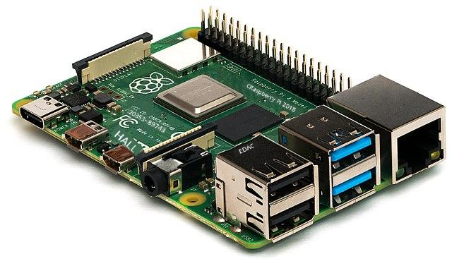
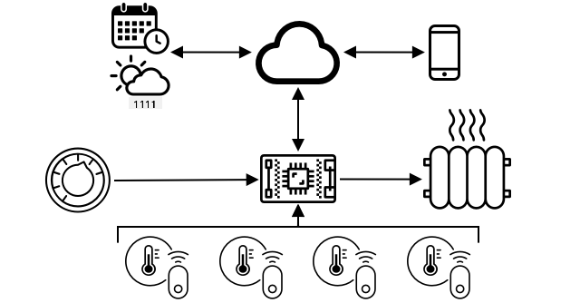
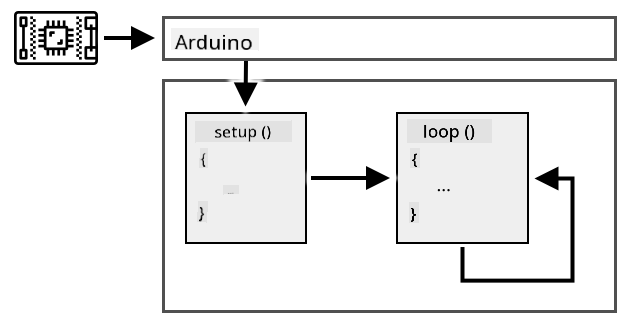
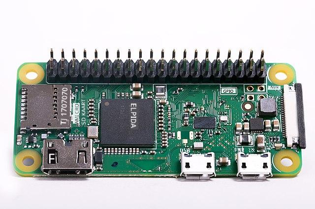

<!--
CO_OP_TRANSLATOR_METADATA:
{
  "original_hash": "9dd7f645ad1c6f20b72fee512987f772",
  "translation_date": "2025-10-11T11:31:34+00:00",
  "source_file": "1-getting-started/lessons/2-deeper-dive/README.md",
  "language_code": "et"
}
-->
# Süvitsi IoT teemadesse

> Visuaalne märkmik: [Nitya Narasimhan](https://github.com/nitya). Klõpsa pildil, et näha suuremat versiooni.

See õppetund oli osa [Hello IoT sarjast](https://youtube.com/playlist?list=PLmsFUfdnGr3xRts0TIwyaHyQuHaNQcb6-) [Microsoft Reactor](https://developer.microsoft.com/reactor/?WT.mc_id=academic-17441-jabenn) programmis. Õppetund jagunes kaheks videoks – 1-tunnine loeng ja 1-tunnine küsimuste-vastuste sessioon, kus süveneti loengu teemadesse ja vastati küsimustele.

> 🎥 Klõpsa ülalolevatel piltidel, et vaadata videoid

## Eelloengu test

[Eelloengu test](https://black-meadow-040d15503.1.azurestaticapps.net/quiz/3)

## Sissejuhatus

Selles õppetunnis süveneme mõningatesse eelmises õppetunnis käsitletud kontseptsioonidesse.

Õppetunnis käsitleme:

* [IoT rakenduse komponendid](../../../../../1-getting-started/lessons/2-deeper-dive)
* [Süvitsi mikroprotsessorite teemasse](../../../../../1-getting-started/lessons/2-deeper-dive)
* [Süvitsi üheplaadiarvutite teemasse](../../../../../1-getting-started/lessons/2-deeper-dive)

## IoT rakenduse komponendid

IoT rakenduse kaks peamist komponenti on *Internet* ja *asi*. Vaatame neid komponente veidi lähemalt.

### Asi

IoT **asi** viitab seadmele, mis suudab suhelda füüsilise maailmaga. Need seadmed on tavaliselt väikesed, odavad arvutid, mis töötavad madalatel kiirustel ja kasutavad vähe energiat – näiteks lihtsad mikroprotsessorid, millel on vaid kilobaidid RAM-i (võrreldes PC-de gigabaitidega), töötades vaid mõnesaja megahertsi juures (võrreldes PC-de gigahertsiga), kuid tarbides nii vähe energiat, et võivad töötada nädalate, kuude või isegi aastate jooksul patareide abil.

Need seadmed suhtlevad füüsilise maailmaga, kas sensorite abil, et koguda andmeid oma ümbrusest, või juhtides väljundeid või aktuaatoreid, et teha füüsilisi muudatusi. Tüüpiline näide on nutikas termostaat – seade, millel on temperatuuriandur, vahend soovitud temperatuuri seadmiseks, näiteks ketas või puutetundlik ekraan, ja ühendus kütte- või jahutussüsteemiga, mida saab sisse lülitada, kui tuvastatud temperatuur on väljaspool soovitud vahemikku. Temperatuuriandur tuvastab, et ruum on liiga külm, ja aktuaator lülitab kütte sisse.

IoT seadmeteks võivad olla väga erinevad asjad, alates spetsiaalsest riistvarast, mis tuvastab ühte asja, kuni üldotstarbeliste seadmeteni, isegi teie nutitelefon! Nutitelefon võib kasutada sensoreid, et tuvastada ümbritsevat maailma, ja aktuaatoreid, et suhelda maailmaga – näiteks GPS-sensori abil tuvastada teie asukohta ja kõlarit, et anda navigeerimisjuhiseid sihtkohta.

✅ Mõelge teistele süsteemidele, mis teie ümber andmeid sensorilt loevad ja nende põhjal otsuseid teevad. Üks näide oleks ahju termostaat. Kas leiate veel näiteid?

### Internet

IoT rakenduse **Interneti** pool koosneb rakendustest, millega IoT seade saab ühendust võtta, et saata ja vastu võtta andmeid, samuti teistest rakendustest, mis võivad IoT seadme andmeid töödelda ja aidata otsustada, milliseid taotlusi IoT seadme aktuaatoritele saata.

Tüüpiline seadistus oleks mingi pilveteenuse olemasolu, millega IoT seade ühendub. See pilveteenus haldab näiteks turvalisust, samuti IoT seadme sõnumite vastuvõtmist ja sõnumite saatmist tagasi seadmele. See pilveteenus ühendub seejärel teiste rakendustega, mis võivad sensorite andmeid töödelda või salvestada, või kasutada sensorite andmeid koos teiste süsteemide andmetega otsuste tegemiseks.

Seadmed ei pruugi alati otse Internetiga ühenduda WiFi või kaabliga. Mõned seadmed kasutavad võrgusilma tehnoloogiat, et suhelda omavahel Bluetoothi kaudu, ühendudes keskseadme kaudu, millel on Interneti-ühendus.

Näiteks nutika termostaadi puhul ühendub termostaat koduse WiFi kaudu pilveteenusega. See saadab temperatuuriandmed pilveteenusele, kust need kirjutatakse mingisse andmebaasi, võimaldades koduomanikul kontrollida praegust ja varasemat temperatuuri telefoni rakenduse kaudu. Teine pilveteenus teab, millist temperatuuri koduomanik soovib, ja saadab sõnumeid IoT seadmele pilveteenuse kaudu, et öelda küttele, kas see tuleks sisse või välja lülitada.

Veelgi nutikam versioon võiks kasutada pilves AI-d koos andmetega teistelt IoT seadmetelt, näiteks liikumisanduritelt, mis tuvastavad, millised ruumid on kasutuses, samuti andmeid nagu ilm ja isegi teie kalender, et teha otsuseid temperatuuri nutikaks seadmiseks. Näiteks võiks see lülitada kütte välja, kui teie kalendrist loeb, et olete puhkusel, või lülitada kütte välja ruumipõhiselt sõltuvalt sellest, milliseid ruume te kasutate, õppides andmetest aja jooksul üha täpsemaks.

✅ Millised muud andmed võiksid aidata Internetiga ühendatud termostaati nutikamaks muuta?

### IoT servas

Kuigi IoT tähistab Internetti, ei pea need seadmed tingimata Internetiga ühenduma. Mõnel juhul võivad seadmed ühenduda 'serva' seadmetega – väravaseadmetega, mis töötavad teie kohalikus võrgus, võimaldades andmeid töödelda ilma Interneti kaudu ühendust võtmata. See võib olla kiirem, kui teil on palju andmeid või aeglane Interneti-ühendus, võimaldab töötada võrguühenduseta, kus Interneti-ühendus pole võimalik, näiteks laeval või humanitaarabi kriisipiirkonnas, ja võimaldab hoida andmeid privaatsena. Mõned seadmed sisaldavad pilvetööriistade abil loodud töötlemiskoodi ja käitavad seda kohapeal, et koguda ja reageerida andmetele ilma Interneti-ühendust kasutamata otsuse tegemiseks.

Üks näide sellest on nutikodu seadmed, nagu Apple HomePod, Amazon Alexa või Google Home, mis kuulavad teie häält pilves treenitud AI mudelite abil, kuid töötavad kohapeal seadmes. Need seadmed 'ärkavad', kui öeldakse teatud sõna või fraas, ja ainult siis saadavad teie kõne Interneti kaudu töötlemiseks. Seade lõpetab kõne saatmise sobival hetkel, näiteks kui tuvastab pausi teie kõnes. Kõik, mida te ütlete enne seadme äratamist äratussõnaga, ja kõik, mida te ütlete pärast seda, kui seade on lõpetanud kuulamise, ei saadeta Internetti seadme pakkujale ja seega jääb privaatsena.

✅ Mõelge teistele olukordadele, kus privaatsus on oluline, nii et andmete töötlemine oleks parem teha servas, mitte pilves. Vihjeks – mõelge IoT seadmetele, millel on kaamerad või muud pildistamisseadmed.

### IoT turvalisus

Iga Interneti-ühenduse puhul on turvalisus oluline kaalutlus. On vana nali, et 'IoT-s tähistab S turvalisust' – IoT-s pole 'S-i', mis viitab sellele, et see pole turvaline.

IoT seadmed ühenduvad pilveteenusega ja on seega ainult nii turvalised, kui turvaline on see pilveteenus – kui teie pilveteenus lubab igal seadmel ühenduda, siis võib saata pahatahtlikke andmeid või toimuda viiruserünnakuid. Sellel võivad olla väga reaalsed tagajärjed, kuna IoT seadmed suhtlevad ja kontrollivad teisi seadmeid. Näiteks [Stuxneti uss](https://wikipedia.org/wiki/Stuxnet) manipuleeris tsentrifuugide ventiile, et neid kahjustada. Häkkerid on samuti ära kasutanud [halba turvalisust, et pääseda ligi beebimonitoridele](https://www.npr.org/sections/thetwo-way/2018/06/05/617196788/s-c-mom-says-baby-monitor-was-hacked-experts-say-many-devices-are-vulnerable) ja teistele koduvalveseadmetele.

> 💁 Mõnikord töötavad IoT seadmed ja servaseadmed võrgus, mis on täielikult Internetist isoleeritud, et hoida andmeid privaatsena ja turvalisena. Seda nimetatakse [õhuvaheks](https://wikipedia.org/wiki/Air_gap_(networking)).

## Süvitsi mikroprotsessorite teemasse

Eelmises õppetunnis tutvustasime mikroprotsessoreid. Vaatame nüüd neid lähemalt.

### CPU

CPU on mikroprotsessori 'aju'. See on protsessor, mis käitab teie koodi ja suudab saata andmeid ning vastu võtta andmeid mis tahes ühendatud seadmetelt. CPU-d võivad sisaldada ühte või mitut tuuma – sisuliselt ühte või mitut CPU-d, mis suudavad koos töötada teie koodi käitamiseks.

CPU-d sõltuvad kellast, mis tiksub miljoneid või miljardeid kordi sekundis. Iga tiksumine ehk tsükkel sünkroniseerib CPU tegevused. Iga tiksumisega saab CPU täita programmi juhise, näiteks andmete hankimise välisseadmest või matemaatilise arvutuse tegemise. See regulaarne tsükkel võimaldab kõiki tegevusi lõpule viia enne järgmise juhise töötlemist.

Mida kiirem on kellatsükkel, seda rohkem juhiseid saab sekundis töödelda ja seega on CPU kiirem. CPU kiirust mõõdetakse [hertsides (Hz)](https://wikipedia.org/wiki/Hertz), mis on standardühik, kus 1 Hz tähendab ühte tsüklit või kellatiksumist sekundis.

> 🎓 CPU kiirused antakse sageli MHz või GHz. 1MHz on 1 miljon Hz, 1GHz on 1 miljard Hz.

> 💁 CPU-d käitavad programme kasutades [fetch-decode-execute tsüklit](https://wikipedia.org/wiki/Instruction_cycle). Iga kellatiksumisega hangib CPU järgmise juhise mälust, dekodeerib selle ja täidab selle, näiteks kasutades aritmeetika-loogika üksust (ALU), et liita kaks numbrit. Mõned täitmised võtavad mitu tiksumist, nii et järgmine tsükkel käivitub järgmise tiksumise ajal pärast juhise täitmist.

Mikroprotsessoritel on palju madalamad kellakiirused kui lauaarvutitel, sülearvutitel või isegi enamikul nutitelefonidel. Näiteks Wio Terminalil on CPU, mis töötab 120MHz juures ehk 120 000 000 tsüklit sekundis.

✅ Keskmisel PC-l või Macil on CPU mitme tuumaga, mis töötab mitme gigahertsi juures, mis tähendab, et kell tiksub miljardeid kordi sekundis. Uurige oma arvuti kellakiirust ja võrrelge, kui palju kordi kiirem see on kui Wio Terminal.

Iga kellatsükkel tarbib energiat ja genereerib soojust. Mida kiiremini tiksub, seda rohkem energiat tarbitakse ja rohkem soojust genereeritakse. PC-del on jahutusradiaatorid ja ventilaatorid, et soojust eemaldada, ilma milleta nad üle kuumeneksid ja mõne sekundi jooksul välja lülituksid. Mikroprotsessoritel pole sageli kumbagi, kuna nad töötavad palju jahedamalt ja seega palju aeglasemalt. PC-d töötavad vooluvõrgust või suurtest akudest mõne tunni jooksul, mikroprotsessorid võivad töötada päevade, kuude või isegi aastate jooksul väikeste akude abil. Mikroprotsessoritel võivad olla ka tuumad, mis töötavad erinevatel kiirustel, lülitudes aeglasematele madala energiatarbega tuumadele, kui CPU koormus on madal, et vähendada energiatarbimist.

> 💁 Mõned PC-d ja Macid võtavad kasutusele sama segu kiiretest suure energiatarbega tuumadest ja aeglasematest madala energiatarbega tuumadest, lülitudes aku säästmiseks. Näiteks uusimate Apple'i sülearvutite M1 kiip võib lülituda 4 jõudlustuumalt 4 tõhusustuumale, et optimeerida aku kestvust või kiirust sõltuvalt käitatavast ülesandest.

✅ Tehke veidi uurimistööd: Lugege CPU-de kohta [Wikipedia CPU artiklist](https://wikipedia.org/wiki/Central_processing_unit)

#### Ülesanne

Uurige Wio Terminali.

Kui kasutate Wio Terminali nende õppetundide jaoks, proovige leida CPU. Leidke *Riistvara ülevaade* sektsioon [Wio Terminali tootelehelt](https://www.seeedstudio.com/Wio-Terminal-p-4509.html), et näha sisemust, ja proovige leida CPU läbi tagaküljel oleva läbipaistva plastakna.

### Mälu

Mikroprotsessoritel on tavaliselt kahte tüüpi mälu – programmimälu ja muutmälu (RAM).

Programmimälu on mittevolatiilne, mis tähendab, et kõik, mis sinna kirjutatakse, jääb alles ka siis, kui seadmel pole voolu. See on mälu, mis salvestab teie programmi koodi.

RAM on mälu, mida programm kasutab töötamiseks, sisaldades teie programmi poolt eraldatud muutujaid ja perifeeriaseadmetelt kogutud andmeid. RAM on volatiilne, voolu kadumisel kaob selle sisu, mis sisuliselt lähtestab teie programmi.
> 🎓 Programmi mälu salvestab sinu koodi ja jääb alles ka siis, kui voolu pole.

> 🎓 RAM-i kasutatakse programmi käivitamiseks ja see lähtestatakse, kui voolu pole.

Nagu protsessoriga, on mikrokontrolleri mälu suurus võrreldes PC või Maciga mitmeid suurusjärke väiksem. Tüüpilisel arvutil võib olla 8 gigabaiti (GB) RAM-i ehk 8 000 000 000 baiti, kus iga bait mahutab ühe tähe või numbri vahemikus 0–255. Mikrokontrolleril on tavaliselt ainult kilobaite (KB) RAM-i, kus kilobait on 1000 baiti. Ülalmainitud Wio terminalil on 192KB RAM-i ehk 192 000 baiti – üle 40 000 korra vähem kui keskmisel arvutil!

Allolev diagramm näitab suhtelist suuruse erinevust 192KB ja 8GB vahel – väike täpp keskel esindab 192KB.

Programmi salvestusruum on samuti väiksem kui arvutil. Tüüpilisel arvutil võib olla 500GB kõvaketas programmide salvestamiseks, samas kui mikrokontrolleril võib olla ainult kilobaite või mõni megabait (MB) salvestusruumi (1MB on 1000KB ehk 1 000 000 baiti). Wio terminalil on 4MB programmi salvestusruumi.

✅ Tee veidi uurimistööd: Kui palju RAM-i ja salvestusruumi on arvutil, mida praegu kasutad? Kuidas see võrdub mikrokontrolleriga?

### Sisend/väljund

Mikrokontrollerid vajavad sisend- ja väljundühendusi (I/O), et lugeda andmeid sensoritelt ja saata juhtsignaale aktuaatoritele. Tavaliselt on neil mitmeid üldotstarbelisi sisend/väljund (GPIO) kontakte. Neid kontakte saab tarkvaras seadistada sisendiks (vastuvõtavad signaali) või väljundiks (saadavad signaali).

🧠⬅️ Sisendkontaktid loevad väärtusi sensoritelt.

🧠➡️ Väljundkontaktid saadavad juhiseid aktuaatoritele.

✅ Sa õpid sellest rohkem järgmises õppetunnis.

#### Ülesanne

Uuri Wio terminali.

Kui kasutad Wio terminali nende õppetundide jaoks, leia GPIO kontaktid. Leia *Pinout diagrammi* sektsioon [Wio terminali tootelehelt](https://www.seeedstudio.com/Wio-Terminal-p-4509.html), et teada saada, millised kontaktid milleks on. Wio terminaliga on kaasas kleebis, mille saad kinnitada tagaküljele kontaktide numbritega – lisa see nüüd, kui sa pole seda veel teinud.

### Füüsiline suurus

Mikrokontrollerid on tavaliselt väikese suurusega, kusjuures väikseim, [Freescale Kinetis KL03 MCU, on piisavalt väike, et mahtuda golfipalli lohku](https://www.edn.com/tiny-arm-cortex-m0-based-mcu-shrinks-package/). PC protsessor võib mõõtmetelt olla 40mm x 40mm, ja see ei hõlma jahutusradiaatoreid ja ventilaatoreid, mis on vajalikud, et protsessor töötaks üle mõne sekundi ilma ülekuumenemiseta – oluliselt suurem kui täielik mikrokontroller. Wio terminali arenduskomplekt koos mikrokontrolleri, korpuse, ekraani ja mitmesuguste ühenduste ja komponentidega pole palju suurem kui paljas Intel i9 protsessor ja oluliselt väiksem kui protsessor koos jahutusradiaatori ja ventilaatoriga!

| Seade                           | Suurus                |
| ------------------------------- | --------------------- |
| Freescale Kinetis KL03          | 1.6mm x 2mm x 1mm     |
| Wio terminal                    | 72mm x 57mm x 12mm    |
| Intel i9 CPU, jahutusradiaator ja ventilaator | 136mm x 145mm x 103mm |

### Raamistikud ja operatsioonisüsteemid

Tänu madalale kiirusele ja mälumahule ei kasuta mikrokontrollerid operatsioonisüsteemi (OS) desktop-arvuti mõistes. Operatsioonisüsteem, mis paneb sinu arvuti tööle (Windows, Linux või macOS), vajab palju mälu ja töötlemisvõimsust, et käivitada ülesandeid, mis on mikrokontrolleri jaoks täiesti ebavajalikud. Pea meeles, et mikrokontrollerid on tavaliselt programmeeritud täitma ühte või mitut väga spetsiifilist ülesannet, erinevalt üldotstarbelisest arvutist nagu PC või Mac, mis peab toetama kasutajaliidest, mängima muusikat või filme, pakkuma tööriistu dokumentide või koodi kirjutamiseks, mängima mänge või sirvima internetti.

Mikrokontrolleri programmeerimiseks ilma operatsioonisüsteemita on vaja tööriistu, mis võimaldavad koodi koostada viisil, mida mikrokontroller suudab käivitada, kasutades API-sid, mis suudavad suhelda mis tahes lisaseadmetega. Iga mikrokontroller on erinev, seega toetavad tootjad tavaliselt standardseid raamistikke, mis võimaldavad järgida standardset "retsepti", et koostada kood ja panna see tööle mis tahes mikrokontrolleril, mis toetab seda raamistikku.

Mikrokontrollerite programmeerimiseks saab kasutada operatsioonisüsteemi – sageli nimetatakse seda reaalajas operatsioonisüsteemiks (RTOS), kuna need on loodud andmete saatmiseks ja vastuvõtmiseks lisaseadmetega reaalajas. Need operatsioonisüsteemid on väga kerged ja pakuvad selliseid funktsioone nagu:

* Multitehted, mis võimaldavad koodil käivitada rohkem kui ühte koodiplokki korraga, kas mitmel tuumal või kordamööda ühel tuumal.
* Võrgustik, mis võimaldab turvalist suhtlust interneti kaudu.
* Graafilise kasutajaliidese (GUI) komponendid kasutajaliideste (UI) loomiseks seadmetel, millel on ekraanid.

✅ Loe erinevate RTOS-ide kohta: [Azure RTOS](https://azure.microsoft.com/services/rtos/?WT.mc_id=academic-17441-jabenn), [FreeRTOS](https://www.freertos.org), [Zephyr](https://www.zephyrproject.org)

#### Arduino

[Arduino](https://www.arduino.cc) on tõenäoliselt kõige populaarsem mikrokontrolleri raamistik, eriti õpilaste, hobistide ja loojate seas. Arduino on avatud lähtekoodiga elektroonikaplatvorm, mis ühendab tarkvara ja riistvara. Arduino ühilduvaid plaate saab osta nii Arduino enda kui ka teiste tootjate käest, seejärel programmeerida neid Arduino raamistikuga.

Arduino plaate programmeeritakse C või C++ keeles. C/C++ kasutamine võimaldab koodi kompileerida väga väikseks ja käivitada kiiresti, mis on vajalik piiratud ressursiga seadmel nagu mikrokontroller. Arduino rakenduse tuuma nimetatakse visandiks (sketch) ja see on C/C++ kood, mis sisaldab kahte funktsiooni – `setup` ja `loop`. Kui plaat käivitub, käivitab Arduino raamistik koodi `setup` funktsiooni üks kord, seejärel käivitab `loop` funktsiooni uuesti ja uuesti, pidevalt, kuni vool välja lülitatakse.

`setup` funktsiooni kirjutatakse algseadistuse kood, näiteks WiFi ja pilveteenustega ühendamine või kontaktide initsialiseerimine sisendi ja väljundi jaoks. `loop` funktsioon sisaldab töötlemiskoodi, näiteks sensori lugemine ja väärtuse saatmine pilve. Tavaliselt lisatakse igasse tsüklisse viivitus, näiteks kui soovid sensori andmeid saata iga 10 sekundi järel, lisatakse tsükli lõppu 10-sekundiline viivitus, et mikrokontroller saaks magada, säästes energiat, ja käivitada tsükli uuesti 10 sekundi pärast.

✅ Seda programmi arhitektuuri nimetatakse *sündmuste tsükliks* või *sõnumite tsükliks*. Paljud rakendused kasutavad seda taustal ja see on standard enamiku desktop-rakenduste jaoks, mis töötavad operatsioonisüsteemidel nagu Windows, macOS või Linux. `loop` kuulab sõnumeid kasutajaliidese komponentidelt, nagu nupud, või seadmetelt, nagu klaviatuur, ja reageerib neile. Loe rohkem sellest [artiklist sündmuste tsükli kohta](https://wikipedia.org/wiki/Event_loop).

Arduino pakub standardseid teeke mikrokontrollerite ja I/O kontaktidega suhtlemiseks, erinevate rakendustega, mis töötavad erinevatel mikrokontrolleritel. Näiteks [`delay` funktsioon](https://www.arduino.cc/reference/en/language/functions/time/delay/) peatab programmi määratud ajaks, [`digitalRead` funktsioon](https://www.arduino.cc/reference/en/language/functions/digital-io/digitalread/) loeb väärtust `HIGH` või `LOW` antud kontaktist, olenemata sellest, millisel plaadil kood töötab. Need standardteegid tähendavad, et Arduino kood, mis on kirjutatud ühe plaadi jaoks, saab ümber kompileerida mis tahes teise Arduino plaadi jaoks ja töötab, eeldades, et kontaktid on samad ja plaadid toetavad samu funktsioone.

Arduino projektide jaoks on olemas suur kolmandate osapoolte teekide ökosüsteem, mis võimaldab lisada lisafunktsioone, näiteks sensorite ja aktuaatorite kasutamist või ühendamist pilve IoT teenustega.

##### Ülesanne

Uuri Wio terminali.

Kui kasutad Wio terminali nende õppetundide jaoks, loe uuesti koodi, mille kirjutasid eelmises õppetunnis. Leia `setup` ja `loop` funktsioon. Jälgi seeria väljundit, et näha, kuidas `loop` funktsiooni kutsutakse korduvalt. Proovi lisada koodi `setup` funktsiooni, et kirjutada seeria porti ja jälgi, et see kood kutsutakse ainult üks kord iga kord, kui seade taaskäivitub. Proovi taaskäivitada seadet külje peal oleva toitelülitiga, et näha, kuidas see kutsutakse iga kord, kui seade taaskäivitub.

## Süvitsi üheplaadi arvutite uurimine

Eelmises õppetunnis tutvustasime üheplaadi arvuteid. Vaatame nüüd neid sügavamalt.

### Raspberry Pi

[Raspberry Pi Foundation](https://www.raspberrypi.org) on Ühendkuningriigi heategevusorganisatsioon, mis asutati 2009. aastal, et edendada arvutiteaduse õppimist, eriti koolitasemel. Osana sellest missioonist arendasid nad välja üheplaadi arvuti, mida nimetatakse Raspberry Pi-ks. Raspberry Pi-d on praegu saadaval kolmes variandis – täissuuruses versioon, väiksem Pi Zero ja arvutimoodul, mida saab integreerida lõplikku IoT seadmesse.

Viimane täissuuruses Raspberry Pi iteratsioon on Raspberry Pi 4B. Sellel on neljatuumaline (4 tuuma) protsessor, mis töötab 1.5GHz sagedusel, 2, 4 või 8GB RAM-i, gigabitine Ethernet, WiFi, 2 HDMI porti, mis toetavad 4k ekraane, audio- ja komposiitvideo väljundport, USB-pordid (2 USB 2.0, 2 USB 3.0), 40 GPIO kontakti, kaameraühendus Raspberry Pi kaameramooduli jaoks ja SD-kaardi pesa. Kõik see plaadil, mille mõõtmed on 88mm x 58mm x 19.5mm ja mida toidab 3A USB-C toiteallikas. Need algavad hinnast 35 USA dollarit, mis on palju odavam kui PC või Mac.

> 💁 On olemas ka Pi400, kõik-ühes arvuti, millel on Pi4 integreeritud klaviatuuri sisse.

Pi Zero on palju väiksem ja madalama võimsusega. Sellel on ühetuumaline 1GHz protsessor, 512MB RAM-i, WiFi (Zero W mudelis), üks HDMI port, üks mikro-USB port, 40 GPIO kontakti, kaameraühendus Raspberry Pi kaameramooduli jaoks ja SD-kaardi pesa. Selle mõõtmed on 65mm x 30mm x 5mm ja see tarbib väga vähe energiat. Zero maksab 5 USA dollarit, WiFi-ga W versioon maksab 10 USA dollarit.

> 🎓 Mõlema seadme protsessorid on ARM-protsessorid, erinevalt Intel/AMD x86 või x64 protsessoritest, mida leidub enamikus PC-des ja Macides. Need on sarnased protsessoritega, mida leidub mõnes mikrokontrolleris, samuti peaaegu kõigis mobiiltelefonides, Microsoft Surface X-is ja uutes Apple Silicon-põhistes Apple Macides.

Kõik Raspberry Pi variandid töötavad Debian Linuxi versioonil, mida nimetatakse Raspberry Pi OS-iks. See on saadaval kerge versioonina ilma desktopita, mis sobib ideaalselt "peata" projektide jaoks, kus ekraani pole vaja, või täisversioonina koos täieliku desktopikeskkonnaga, veebibrauseri, kontoritarkvara, kodeerimistööriistade ja mängudega. Kuna operatsioonisüsteem on Debian Linuxi versioon, saab installida mis tahes rakenduse või tööriista, mis töötab Debianil ja on ehitatud Pi sees olevale ARM-protsessorile.

#### Ülesanne

Uuri Raspberry Pi-d.

Kui kasutad Raspberry Pi-d nende õppetundide jaoks, loe erinevate riistvarakomponentide kohta plaadil.

* Leiad protsessorite kohta üksikasju [Raspberry Pi riistvara dokumentatsiooni lehelt](https://www.raspberrypi.org/documentation/hardware/raspberrypi/). Loe protsessori kohta, mida kasutatakse Pi-s, mida kasutad.
* Leia GPIO kontaktid. Loe nende kohta rohkem [Raspberry Pi GPIO dokumentatsioonist](https://www.raspberrypi.org/documentation/hardware/raspberrypi/gpio/README.md). Kasuta [GPIO kontaktide kasutusjuhendit](https://www.raspberrypi.org/documentation/usage/gpio/README.md), et tuvastada erinevad kontaktid oma Pi-l.

### Üheplaadi arvutite programmeerimine

Üheplaadi arvutid on täisväärtuslikud arvutid, mis töötavad täisväärtuslikul operatsioonisüsteemil. See tähendab, et nende programmeerimiseks on lai valik programmeerimiskeeli, raamistikke ja tööriistu, erinevalt mikrokontrolleritest, mis sõltuvad raamistikest nagu Arduino. Enamik programmeerimiskeeli sisaldab teeke, mis võimaldavad GPIO kontakte kasutada andmete saatmiseks ja vastuvõtmiseks sensoritelt ja aktuaatoritelt.

✅ Milliseid programmeerimiskeeli sa tunned? Kas need on Linuxis toetatud?
Kõige levinum programmeerimiskeel IoT-rakenduste loomiseks Raspberry Pi-l on Python. Pi jaoks on olemas suur riistvara ökosüsteem, millest peaaegu kõik sisaldavad vastavat koodi, mida saab kasutada Python'i teekidena. Mõned neist ökosüsteemidest põhinevad "hat'idel" – nii nimetatakse neid, kuna need istuvad Pi peal nagu müts ja ühenduvad suure pistikuga 40 GPIO pinni külge. Need hat'id pakuvad täiendavaid võimalusi, nagu ekraanid, sensorid, kaugjuhitavad autod või adapterid, mis võimaldavad ühendada sensoreid standardiseeritud kaablitega.

### Üheplaadiarvutite kasutamine professionaalsetes IoT lahendustes

Üheplaadiarvuteid kasutatakse professionaalsetes IoT lahendustes, mitte ainult arendajate komplektidena. Need võivad pakkuda võimsat viisi riistvara juhtimiseks ja keeruliste ülesannete täitmiseks, nagu masinõppe mudelite käitamine. Näiteks on olemas [Raspberry Pi 4 Compute Module](https://www.raspberrypi.org/blog/raspberry-pi-compute-module-4/), mis pakub kogu Raspberry Pi 4 jõudlust, kuid kompaktsemas ja odavamas vormis ilma enamikku portidest, olles mõeldud kohandatud riistvarasse paigaldamiseks.

---

## 🚀 Väljakutse

Eelmise tunni väljakutse oli loetleda nii palju IoT-seadmeid kui võimalik, mis on teie kodus, koolis või töökohas. Iga seadme puhul mõelge, kas need on ehitatud mikroprotsessorite või üheplaadiarvutite ümber või isegi mõlema kombinatsioonina.

## Loengu järgne viktoriin

[Loengu järgne viktoriin](https://black-meadow-040d15503.1.azurestaticapps.net/quiz/4)

## Ülevaade ja iseseisev õppimine

* Lugege [Arduino alustamise juhendit](https://www.arduino.cc/en/Guide/Introduction), et saada rohkem teada Arduino platvormi kohta.
* Lugege [Raspberry Pi 4 tutvustust](https://www.raspberrypi.org/products/raspberry-pi-4-model-b/), et õppida rohkem Raspberry Pi kohta.
* Tutvuge mõnede mõistete ja lühenditega artiklis [Mis on CPU-d, MPU-d, MCU-d ja GPU-d?](https://www.eejournal.com/article/what-the-faq-are-cpus-mpus-mcus-and-gpus/) Electrical Engineering Journal'is.

✅ Kasutage neid juhendeid koos kuludega, mida näete [riistvara juhendi](../../../hardware.md) linkide kaudu, et otsustada, millist riistvaraplatvormi soovite kasutada või kas eelistate virtuaalset seadet.

## Ülesanne

[Võrdle ja vastanda mikroprotsessoreid ja üheplaadiarvuteid](assignment.md)

---

**Lahtiütlus**:  
See dokument on tõlgitud AI tõlketeenuse [Co-op Translator](https://github.com/Azure/co-op-translator) abil. Kuigi püüame tagada täpsust, palume arvestada, et automaatsed tõlked võivad sisaldada vigu või ebatäpsusi. Algne dokument selle algses keeles tuleks pidada autoriteetseks allikaks. Olulise teabe puhul soovitame kasutada professionaalset inimtõlget. Me ei vastuta selle tõlke kasutamisest tulenevate arusaamatuste või valesti tõlgenduste eest.