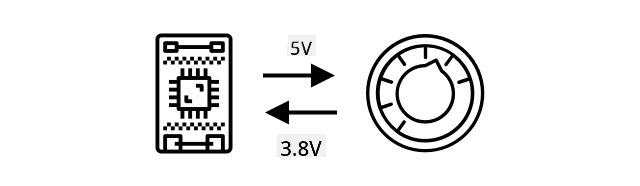
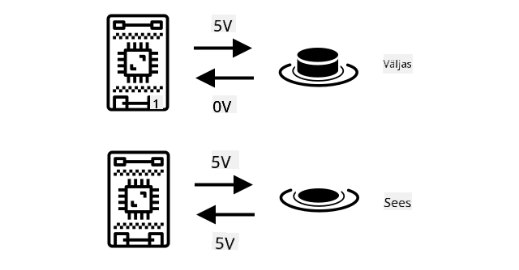
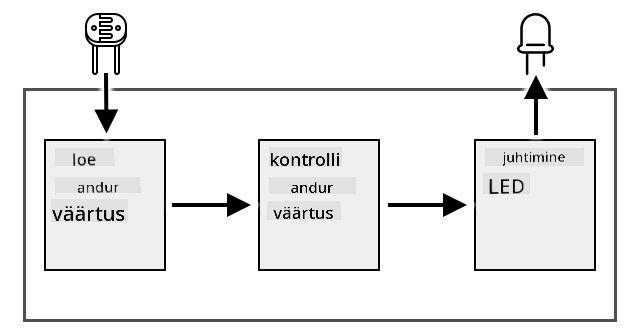
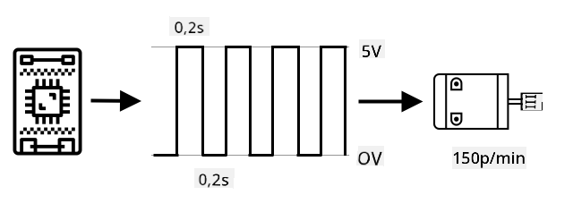
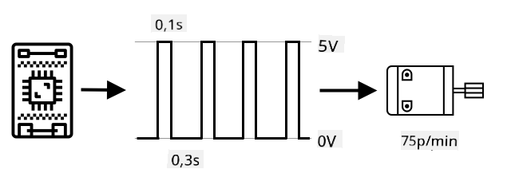
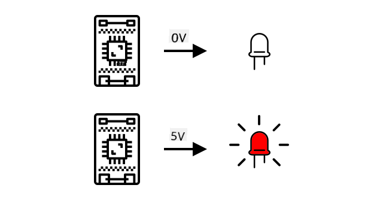

<!--
CO_OP_TRANSLATOR_METADATA:
{
  "original_hash": "e9ee00eb5fc55922a73762acc542166b",
  "translation_date": "2025-10-11T11:34:26+00:00",
  "source_file": "1-getting-started/lessons/3-sensors-and-actuators/README.md",
  "language_code": "et"
}
-->
# Suhtle füüsilise maailmaga sensorite ja täiturmehhanismide abil


> Visandi autor [Nitya Narasimhan](https://github.com/nitya). Klõpsa pildil, et näha suuremat versiooni.

See õppetund oli osa [Hello IoT sarjast](https://youtube.com/playlist?list=PLmsFUfdnGr3xRts0TIwyaHyQuHaNQcb6-) [Microsoft Reactor](https://developer.microsoft.com/reactor/?WT.mc_id=academic-17441-jabenn) programmis. Õppetund jagunes kaheks videoks - 1-tunnine loeng ja 1-tunnine küsimuste-vastuste tund, kus käsitleti loengu teemasid süvitsi ja vastati küsimustele.

[](https://youtu.be/Lqalu1v6aF4)

[](https://youtu.be/qR3ekcMlLWA)

> 🎥 Klõpsa ülalolevatel piltidel, et vaadata videoid

## Eelloengu viktoriin

[Eelloengu viktoriin](https://black-meadow-040d15503.1.azurestaticapps.net/quiz/5)

## Sissejuhatus

Selles õppetunnis tutvustatakse kahte olulist IoT-seadme komponenti - sensoreid ja täiturmehhanisme. Sa saad praktiliselt nendega töötada, lisades oma IoT-projektile valgussensori ja LED-i, mida juhitakse valguse taseme järgi, luues sisuliselt öölambi.

Selles õppetunnis käsitleme:

* [Mis on sensorid?](../../../../../1-getting-started/lessons/3-sensors-and-actuators)
* [Sensori kasutamine](../../../../../1-getting-started/lessons/3-sensors-and-actuators)
* [Sensori tüübid](../../../../../1-getting-started/lessons/3-sensors-and-actuators)
* [Mis on täiturmehhanismid?](../../../../../1-getting-started/lessons/3-sensors-and-actuators)
* [Täiturmehhanismi kasutamine](../../../../../1-getting-started/lessons/3-sensors-and-actuators)
* [Täiturmehhanismide tüübid](../../../../../1-getting-started/lessons/3-sensors-and-actuators)

## Mis on sensorid?

Sensorid on riistvaraseadmed, mis tajuvad füüsilist maailma - nad mõõdavad enda ümber ühte või mitut omadust ja edastavad teabe IoT-seadmele. Sensoreid on väga palju erinevaid, kuna mõõdetavaid omadusi on palju, alates looduslikest omadustest nagu õhutemperatuur kuni füüsiliste interaktsioonideni nagu liikumine.

Mõned levinumad sensorid on:

* Temperatuuriandurid - need mõõdavad õhutemperatuuri või temperatuuri, milles nad asuvad. Huvilistele ja arendajatele on need sageli kombineeritud õhurõhu ja niiskuse mõõtmisega ühes sensoris.
* Nupud - need tuvastavad, kui neid on vajutatud.
* Valgussensorid - need tuvastavad valguse tasemeid ja võivad olla mõeldud konkreetsete värvide, UV-valguse, IR-valguse või üldise nähtava valguse jaoks.
* Kaamerad - need tajuvad visuaalset kujutist maailmast, tehes foto või voogesitades videot.
* Kiirendusmõõturid - need tuvastavad liikumist mitmes suunas.
* Mikrofonid - need tajuvad heli, kas üldist helitaset või suunatud heli.

✅ Tee veidi uurimistööd. Millised sensorid on sinu telefonis?

Kõigil sensoritel on üks ühine joon - nad muudavad tajutava elektriliseks signaaliks, mida IoT-seade saab tõlgendada. Kuidas seda elektrilist signaali tõlgendatakse, sõltub sensorist ja kommunikatsiooniprotokollist, mida kasutatakse IoT-seadmega suhtlemiseks.

## Sensori kasutamine

Järgi allolevaid juhiseid, et lisada sensor oma IoT-seadmele:

* [Arduino - Wio Terminal](wio-terminal-sensor.md)
* [Üheplaadiarvuti - Raspberry Pi](pi-sensor.md)
* [Üheplaadiarvuti - Virtuaalne seade](virtual-device-sensor.md)

## Sensori tüübid

Sensorid võivad olla kas analoog- või digitaalsed.

### Analoogsensorid

Mõned kõige lihtsamad sensorid on analoogsensorid. Need sensorid saavad IoT-seadmelt pinget, sensori komponendid kohandavad seda pinget ja sensorist tagastatud pinge mõõdetakse, et saada sensori väärtus.

> 🎓 Pinge mõõdab, kui suur jõud on elektri liikumiseks ühest kohast teise, näiteks aku positiivsest klemmist negatiivse klemmini. Näiteks standardne AA patarei on 1,5V (V tähistab volti) ja suudab suruda elektrit 1,5V jõuga oma positiivsest klemmist negatiivsesse klemmisse. Erinevad elektrilised seadmed vajavad töötamiseks erinevaid pingeid, näiteks LED võib süttida 2-3V juures, kuid 100W hõõglamp vajaks 240V. Lisateavet pinge kohta leiad [Wikipedia pinge lehelt](https://wikipedia.org/wiki/Voltage).

Üks näide on potentsiomeeter. See on nupp, mida saab pöörata kahe positsiooni vahel ja sensor mõõdab pööramist.



IoT-seade saadab potentsiomeetrile elektrisignaali teatud pingega, näiteks 5 volti (5V). Kui potentsiomeetrit reguleeritakse, muutub pinge, mis teiselt poolt välja tuleb. Kujutage ette, et teil on potentsiomeeter, millel on skaala 0-st [11-ni](https://wikipedia.org/wiki/Up_to_eleven), näiteks helitugevuse nupp võimendil. Kui potentsiomeeter on täielikult välja lülitatud asendis (0), siis tuleb välja 0V (0 volti). Kui see on täielikult sisse lülitatud asendis (11), siis tuleb välja 5V (5 volti).

> 🎓 See on lihtsustatud selgitus ja potentsiomeetrite ning muutuva takistuse kohta saad rohkem lugeda [Wikipedia potentsiomeetri lehelt](https://wikipedia.org/wiki/Potentiometer).

Sensorist väljuv pinge loetakse IoT-seadme poolt ja seade saab sellele reageerida. Sõltuvalt sensorist võib see pinge olla suvaline väärtus või vastata standardühikule. Näiteks analoogtemperatuuri sensor, mis põhineb [termistoril](https://wikipedia.org/wiki/Thermistor), muudab oma takistust sõltuvalt temperatuurist. Väljundpinge saab seejärel koodis arvutuste abil teisendada temperatuuriks Kelvinites ja vastavalt °C või °F-ks.

✅ Mis sa arvad, mis juhtub, kui sensor tagastab kõrgema pinge, kui talle saadeti (näiteks välisest toiteallikast)? ⛔️ ÄRA proovi seda ise järele.

#### Analoog-digitaalmuundamine

IoT-seadmed on digitaalsed - nad ei saa töötada analoogväärtustega, vaid ainult 0-de ja 1-dega. See tähendab, et analoogsensori väärtused tuleb enne töötlemist digitaalseks signaaliks teisendada. Paljudel IoT-seadmetel on analoog-digitaalmuundurid (ADC-d), mis teisendavad analoogsisendid nende väärtuse digitaalseks esitusviisiks. Sensorid võivad töötada ka ADC-dega ühendusplaadi kaudu. Näiteks Seeed Grove ökosüsteemis Raspberry Pi-ga ühendatakse analoogsensorid konkreetsetesse portidesse 'hat'-il, mis on ühendatud Pi GPIO-pinkidega, ja see hat sisaldab ADC-d, mis teisendab pinge digitaalseks signaaliks, mida saab Pi GPIO-pinkidest saata.

Kujutage ette, et teil on analoogvalgussensor, mis on ühendatud IoT-seadmega, mis töötab 3,3V ja tagastab väärtuse 1V. See 1V ei tähenda digitaalses maailmas midagi, seega tuleb see teisendada. Pinge teisendatakse analoogväärtuseks skaalal, mis sõltub seadmest ja sensorist. Näiteks Seeed Grove valgussensor annab väärtusi vahemikus 0 kuni 1023. Selle sensori puhul, mis töötab 3,3V juures, oleks 1V väljund väärtus 300. IoT-seade ei saa käsitleda 300 analoogväärtusena, seega teisendatakse väärtus `0000000100101100`, binaarseks esitusviisiks 300 Grove hat-i poolt. Seejärel töötleb IoT-seade seda.

✅ Kui sa ei tea binaarsüsteemi, siis tee veidi uurimistööd, et õppida, kuidas numbreid esitatakse 0-de ja 1-de abil. [BBC Bitesize sissejuhatus binaarsüsteemi](https://www.bbc.co.uk/bitesize/guides/zwsbwmn/revision/1) on suurepärane koht alustamiseks.

Koodimise seisukohalt käsitletakse seda tavaliselt sensoritega kaasas olevate teekide abil, seega ei pea sa ise selle teisendamise pärast muretsema. Näiteks Grove valgussensori puhul kasutaksid sa Python teeki ja kutsuksid välja `light` omaduse või kasutaksid Arduino teeki ja kutsuksid välja `analogRead`, et saada väärtus 300.

### Digitaalsed sensorid

Digitaalsed sensorid, nagu analoogsensorid, tuvastavad ümbritsevat maailma elektripinge muutuste abil. Erinevus seisneb selles, et nad väljastavad digitaalse signaali, kas ainult kahe oleku mõõtmise teel või sisseehitatud ADC-d kasutades. Digitaalsed sensorid muutuvad üha tavalisemaks, et vältida vajadust kasutada ADC-d kas ühendusplaadil või IoT-seadmes endas.

Lihtsaim digitaalne sensor on nupp või lüliti. See on sensor, millel on kaks olekut, sisse või välja.



IoT-seadme GPIO-pinnid võivad seda signaali otse mõõta kui 0 või 1. Kui saadetud pinge on sama, mis tagastatud pinge, loetakse väärtuseks 1, vastasel juhul loetakse väärtuseks 0. Signaali ei ole vaja teisendada, see võib olla ainult 1 või 0.

> 💁 Pinged ei ole kunagi täpsed, eriti kuna sensori komponendid omavad teatud takistust, seega on tavaliselt olemas tolerants. Näiteks Raspberry Pi GPIO-pinnid töötavad 3,3V juures ja loevad tagastatud signaali üle 1,8V kui 1, alla 1,8V kui 0.

* 3,3V läheb nupule. Nupp on välja lülitatud, seega tuleb välja 0V, mis annab väärtuseks 0.
* 3,3V läheb nupule. Nupp on sisse lülitatud, seega tuleb välja 3,3V, mis annab väärtuseks 1.

Rohkem arenenud digitaalsed sensorid loevad analoogväärtusi ja seejärel teisendavad need sisseehitatud ADC-de abil digitaalseks signaaliks. Näiteks digitaalne temperatuuriandur kasutab endiselt termopaari samamoodi nagu analoogsensor ja mõõdab endiselt pingemuutust, mis on põhjustatud termopaari takistusest praegusel temperatuuril. Selle asemel, et tagastada analoogväärtus ja tugineda seadmele või ühendusplaadile, et see digitaalseks signaaliks teisendada, teisendab sensorisse sisseehitatud ADC väärtuse ja saadab selle IoT-seadmele 0-de ja 1-de jadana. Need 0-d ja 1-d saadetakse samamoodi nagu nupu digitaalne signaal, kus 1 on täispinge ja 0 on 0V.


Digitaalandmete saatmine võimaldab sensoritel muutuda keerukamaks ja edastada üksikasjalikumaid andmeid, isegi krüpteeritud andmeid turvaliste sensorite jaoks. Üks näide on kaamera. See on sensor, mis jäädvustab pildi ja saadab selle digitaalandmetena, mis sisaldavad seda pilti, tavaliselt tihendatud vormingus nagu JPEG, et IoT-seade saaks seda lugeda. Kaamera võib isegi videot voogesitada, jäädvustades pilte ja saates kas täieliku pildiraami kaadri kaupa või tihendatud videovoogu.

## Mis on täiturmehhanismid?

Täiturmehhanismid on sensorite vastandid - nad muudavad IoT-seadmest tuleva elektrilise signaali füüsiliseks interaktsiooniks, näiteks valguse või heli kiirgamiseks või mootori liigutamiseks.

Mõned levinumad täiturmehhanismid on:

* LED - kiirgab valgust, kui see sisse lülitatakse
* Kõlar - kiirgab heli vastavalt saadetud signaalile, alates lihtsast piiksust kuni muusikat mängiva helikõlarini
* Samm-mootor - muudab signaali kindlaks pöördenurgaks, näiteks pöörab nupu 90°
* Relee - lülitid, mida saab elektrilise signaaliga sisse või välja lülitada. Need võimaldavad IoT-seadmest tuleval väikesel pingel sisse lülitada suuremaid pingeid.
* Ekraanid - keerukamad täiturmehhanismid, mis kuvavad teavet mitme segmendiga ekraanil. Ekraanid varieeruvad lihtsatest LED-ekraanidest kuni kõrge eraldusvõimega videomonitorideni.

✅ Tee veidi uurimistööd. Millised täiturmehhanismid on sinu telefonis?

## Täiturmehhanismi kasutamine

Järgi allolevaid juhiseid, et lisada täiturmehhanism oma IoT-seadmele, mida juhib sensor, et ehitada IoT öölamp. See kogub valguse tasemeid valgussensorilt ja kasutab täiturmehhanismina LED-i, et kiirata valgust, kui tuvastatud valguse tase on liiga madal.



* [Arduino - Wio Terminal](wio-terminal-actuator.md)
* [Üheplaadiarvuti - Raspberry Pi](pi-actuator.md)
* [Üheplaadiarvuti - Virtuaalne seade](virtual-device-actuator.md)

## Täiturmehhanismide tüübid

Nagu sensorid, võivad täiturmehhanismid olla kas analoog- või digitaalsed.

### Analoogtäiturmehhanismid

Analoogtäiturmehhanismid võtavad vastu analoogsignaali ja muudavad selle mingiks interaktsiooniks, kus interaktsioon muutub vastavalt saadud pingele.
Üks näide on reguleeritava heledusega lamp, nagu need, mis võivad olla teie kodus. Lambi heledust määrab sellele antava pinge suurus.


Nagu sensorite puhul, töötavad tegelikud IoT-seadmed digitaalsete signaalidega, mitte analoogsignaalidega. See tähendab, et analoogsignaali saatmiseks vajab IoT-seade digitaal-analoogmuundurit (DAC), kas otse IoT-seadmel või ühendusplaadil. See muundab IoT-seadme 0-d ja 1-d analoogpingeks, mida aktuaator saab kasutada.

✅ Mis teie arvates juhtub, kui IoT-seade saadab aktuaatorile kõrgema pinge, kui see suudab taluda?  
⛔️ ÄRGE proovige seda ise järele.

#### Impulsi laiuse modulatsioon

Teine võimalus IoT-seadme digitaalsete signaalide analoogsignaaliks muundamiseks on impulsi laiuse modulatsioon (PWM). See hõlmab paljude lühikeste digitaalsete impulsside saatmist, mis toimivad analoogsignaalina.

Näiteks saab PWM-i kasutada mootori kiiruse reguleerimiseks.

Kujutage ette, et juhite mootorit 5V toiteallikaga. Saadate mootorile lühikese impulsi, lülitades pinge kõrgeks (5V) kahe sajandiku sekundi (0,02s) jooksul. Selle aja jooksul suudab mootor pöörata ühe kümnendiku pöördest ehk 36°. Seejärel signaal peatub kahe sajandiku sekundi (0,02s) jooksul, saates madala signaali (0V). Iga tsükkel sisse ja välja kestab 0,04s. Tsükkel kordub.



See tähendab, et ühe sekundi jooksul saadate 25 5V impulssi, mis kestavad 0,02s ja pööravad mootorit, millele järgneb 0,02s paus 0V-ga, kus mootor ei pöörle. Iga impulss pöörab mootorit ühe kümnendiku pöördest, mis tähendab, et mootor teeb 2,5 pöördet sekundis. Olete kasutanud digitaalset signaali, et pöörata mootorit kiirusel 2,5 pöördet sekundis ehk 150 [pööret minutis](https://wikipedia.org/wiki/Revolutions_per_minute) (mittestandardne pöörlemiskiiruse mõõtühik).

```output
25 pulses per second x 0.1 rotations per pulse = 2.5 rotations per second
2.5 rotations per second x 60 seconds in a minute = 150rpm
```
  
> 🎓 Kui PWM-signaal on poole ajast sees ja poole ajast väljas, nimetatakse seda [50% töötsükliks](https://wikipedia.org/wiki/Duty_cycle). Töötsüklit mõõdetakse protsendina ajast, mil signaal on seesolekus võrreldes väljasolekuga.



Mootori kiirust saab muuta impulsside suurust muutes. Näiteks sama mootori puhul saate hoida tsükli aja samana (0,04s), kuid vähendada sisse lülitatud impulssi poole võrra (0,01s) ja suurendada väljalülitatud impulssi (0,03s). Teil on sama arv impulsse sekundis (25), kuid iga sisse lülitatud impulss on poole lühem. Pool pikkusega impulss pöörab mootorit ühe kahekümnendiku pöördest ja 25 impulsi sekundis teeb mootor 1,25 pöördet sekundis ehk 75 pööret minutis. Muutes digitaalse signaali impulsi kiirust, olete analoogmootori kiiruse poole võrra vähendanud.

```output
25 pulses per second x 0.05 rotations per pulse = 1.25 rotations per second
1.25 rotations per second x 60 seconds in a minute = 75rpm
```
  
✅ Kuidas hoida mootori pöörlemine sujuvana, eriti madalatel kiirustel? Kas kasutaksite väikest arvu pikki impulsse pikkade pausidega või palju väga lühikesi impulsse lühikeste pausidega?

> 💁 Mõned sensorid kasutavad PWM-i ka analoogsignaalide digitaalsignaalideks muundamiseks.

> 🎓 Lisateavet impulsi laiuse modulatsiooni kohta leiate [Wikipedia PWM-lehelt](https://wikipedia.org/wiki/Pulse-width_modulation).

### Digitaalsed aktuaatorid

Digitaalsed aktuaatorid, nagu digitaalsed sensorid, on kas kahes olekus, mida juhitakse kõrge või madala pingega, või neil on sisseehitatud DAC, mis suudab digitaalse signaali analoogsignaaliks muundada.

Üks lihtne digitaalne aktuaator on LED. Kui seade saadab digitaalse signaali 1, saadetakse kõrge pinge, mis süütab LED-i. Kui saadetakse digitaalse signaali 0, langeb pinge 0V-ni ja LED kustub.



✅ Milliseid teisi lihtsaid kahe olekuga aktuaatoreid oskate välja mõelda? Üks näide on solenoid, mis on elektromagnet, mida saab aktiveerida, et teha asju nagu uksepolti liigutamine ukse lukustamiseks/avamiseks.

Täpsemad digitaalsed aktuaatorid, nagu ekraanid, nõuavad digitaalsete andmete saatmist kindlates formaatides. Tavaliselt on nendega kaasas teegid, mis muudavad õige andmete saatmise nende juhtimiseks lihtsamaks.

---

## 🚀 Väljakutse

Eelmise kahe tunni väljakutse oli loetleda nii palju IoT-seadmeid kui võimalik, mis on teie kodus, koolis või töökohas, ja otsustada, kas need on ehitatud mikrokontrollerite või üheplaadiarvutite ümber või isegi mõlema kombinatsioonina.

Iga loetletud seadme puhul, milliste sensorite ja aktuaatoritega need on ühendatud? Mis on nende seadmetega ühendatud iga sensori ja aktuaatori eesmärk?

## Loengu järgne viktoriin

[Loengu järgne viktoriin](https://black-meadow-040d15503.1.azurestaticapps.net/quiz/6)

## Ülevaade ja iseseisev õppimine

* Lugege elektri ja vooluringide kohta [ThingLearnis](http://thinglearn.jenlooper.com/curriculum/).  
* Lugege erinevat tüüpi temperatuuriandurite kohta [Seeed Studios temperatuuriandurite juhendis](https://www.seeedstudio.com/blog/2019/10/14/temperature-sensors-for-arduino-projects/)  
* Lugege LED-ide kohta [Wikipedia LED-lehel](https://wikipedia.org/wiki/Light-emitting_diode)  

## Ülesanne

[Uurige sensoreid ja aktuaatoreid](assignment.md)

---

**Lahtiütlus**:  
See dokument on tõlgitud AI tõlketeenuse [Co-op Translator](https://github.com/Azure/co-op-translator) abil. Kuigi püüame tagada täpsust, palume arvestada, et automaatsed tõlked võivad sisaldada vigu või ebatäpsusi. Algne dokument selle algses keeles tuleks pidada autoriteetseks allikaks. Olulise teabe puhul soovitame kasutada professionaalset inimtõlget. Me ei vastuta selle tõlke kasutamisest tulenevate arusaamatuste või valesti tõlgenduste eest.