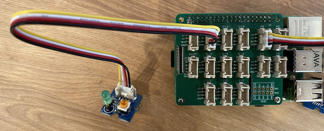

<!--
CO_OP_TRANSLATOR_METADATA:
{
  "original_hash": "4db8a3879a53490513571df2f6cf7641",
  "translation_date": "2025-10-11T11:33:23+00:00",
  "source_file": "1-getting-started/lessons/3-sensors-and-actuators/pi-actuator.md",
  "language_code": "et"
}
-->
# Ehita öölamp - Raspberry Pi

Selles õppetunni osas lisad oma Raspberry Pi-le LED-i ja kasutad seda öölambi loomiseks.

## Riistvara

Öölamp vajab nüüd täiturmehhanismi.

Täiturmehhanism on **LED**, [valgusdiood](https://wikipedia.org/wiki/Light-emitting_diode), mis kiirgab valgust, kui vool sellest läbi läheb. See on digitaalne täiturmehhanism, millel on kaks olekut: sisse ja välja. Väärtuse 1 saatmine lülitab LED-i sisse, väärtus 0 lülitab selle välja. LED on väline Grove täiturmehhanism ja tuleb ühendada Raspberry Pi Grove Base hat-iga.

Öölambi loogika pseudokoodis on järgmine:

```output
Check the light level.
If the light is less than 300
    Turn the LED on
Otherwise
    Turn the LED off
```

### Ühenda LED

Grove LED on moodul, millel on valik erinevaid LED-e, võimaldades valida oma lemmikvärvi.

#### Ülesanne - ühenda LED

Ühenda LED.


1. Vali oma lemmik LED ja sisesta selle jalad LED-mooduli kahte auku.

    LED-id on valgusdioodid ja dioodid on elektroonikakomponendid, mis juhivad voolu ainult ühes suunas. See tähendab, et LED tuleb ühendada õigetpidi, vastasel juhul see ei tööta.

    Üks LED-i jalgadest on positiivne klemm, teine negatiivne klemm. LED ei ole täiesti ümmargune ja on ühel küljel veidi lamedam. Veidi lamedam külg on negatiivne klemm. Kui ühendad LED-i mooduliga, veendu, et ümarama külje juures olev klemm on ühendatud mooduli välisküljel märgitud **+** pesaga ja lamedam külg on ühendatud mooduli keskele lähemal oleva pesaga.

1. LED-moodulil on pöördnupp, mis võimaldab reguleerida heledust. Keera see alguses täielikult üles, keerates seda väikese ristpea kruvikeerajaga vastupäeva nii kaugele kui võimalik.

1. Sisesta Grove-kaabli üks ots LED-mooduli pesasse. See läheb sisse ainult ühes suunas.

1. Kui Raspberry Pi on välja lülitatud, ühenda Grove-kaabli teine ots Grove Base hat-i digitaalsesse pesasse, mis on märgitud **D5**. See pesa on teine vasakult, GPIO-pesade kõrval asuvas reas.



## Programmeeri öölamp

Nüüd saab öölampi programmeerida, kasutades Grove valgussensorit ja Grove LED-i.

### Ülesanne - programmeeri öölamp

Programmeeri öölamp.

1. Lülita Pi sisse ja oota, kuni see käivitub.

1. Ava VS Code'is öölambi projekt, mille lõid selle ülesande eelmises osas, kas otse Pi peal või kasutades Remote SSH laiendust.

1. Lisa järgmine kood `app.py` faili, et importida vajalik teek. See tuleks lisada ülaossa, teiste `import` ridade alla.

    ```python
    from grove.grove_led import GroveLed
    ```

    Rida `from grove.grove_led import GroveLed` impordib `GroveLed` Grove Python teekidest. See teek sisaldab koodi Grove LED-iga suhtlemiseks.

1. Lisa järgmine kood pärast `light_sensor` deklaratsiooni, et luua klassi eksemplar, mis haldab LED-i:

    ```python
    led = GroveLed(5)
    ```

    Rida `led = GroveLed(5)` loob `GroveLed` klassi eksemplari, mis ühendub pin-iga **D5** - digitaalne Grove pesa, kuhu LED on ühendatud.

    > 💁 Kõigil pesadel on unikaalsed pin-numbrid. Pin-id 0, 2, 4 ja 6 on analoogpesad, pin-id 5, 16, 18, 22, 24 ja 26 on digitaalsed pesad.

1. Lisa `while` tsükli sisse, enne `time.sleep` rida, kontroll, mis kontrollib valguse taset ja lülitab LED-i sisse või välja:

    ```python
    if light < 300:
        led.on()
    else:
        led.off()
    ```

    See kood kontrollib `light` väärtust. Kui see on väiksem kui 300, kutsub see välja `GroveLed` klassi `on` meetodi, mis saadab LED-ile digitaalse väärtuse 1, lülitades selle sisse. Kui valguse väärtus on 300 või suurem, kutsub see välja `off` meetodi, saates digitaalse väärtuse 0, lülitades LED-i välja.

    > 💁 See kood peaks olema samal tasemel taandatud kui rida `print('Light level:', light)`, et see oleks `while` tsükli sees!

    > 💁 Digitaalväärtuste saatmisel täiturmehhanismidele on väärtus 0 võrdne 0V-ga ja väärtus 1 seadme maksimaalse pingega. Raspberry Pi puhul koos Grove sensorite ja täiturmehhanismidega on väärtus 1 võrdne 3,3V-ga.

1. Käivita oma Python rakendus VS Code terminalist järgmise käsuga:

    ```sh
    python3 app.py
    ```

    Valguse väärtused kuvatakse konsoolis.

    ```output
    pi@raspberrypi:~/nightlight $ python3 app.py 
    Light level: 634
    Light level: 634
    Light level: 634
    Light level: 230
    Light level: 104
    Light level: 290
    ```

1. Kata ja ava valgussensor. Pane tähele, kuidas LED süttib, kui valguse tase on 300 või vähem, ja kustub, kui valguse tase on suurem kui 300.

    > 💁 Kui LED ei sütti, veendu, et see on õigesti ühendatud ja pöördnupp on täielikult sisse keeratud.


> 💁 Selle koodi leiad kaustast [code-actuator/pi](../../../../../1-getting-started/lessons/3-sensors-and-actuators/code-actuator/pi).

😀 Sinu öölambi programm õnnestus!

---

**Lahtiütlus**:  
See dokument on tõlgitud, kasutades AI-tõlketeenust [Co-op Translator](https://github.com/Azure/co-op-translator). Kuigi püüame tagada täpsuse, palume arvestada, et automaatsed tõlked võivad sisaldada vigu või ebatäpsusi. Algne dokument selle algses keeles tuleks lugeda autoriteetseks allikaks. Olulise teabe puhul soovitame kasutada professionaalset inimtõlget. Me ei vastuta selle tõlke kasutamisest tulenevate arusaamatuste või valede tõlgenduste eest.