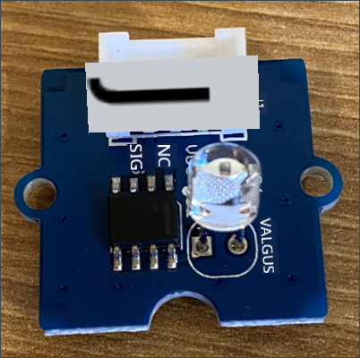
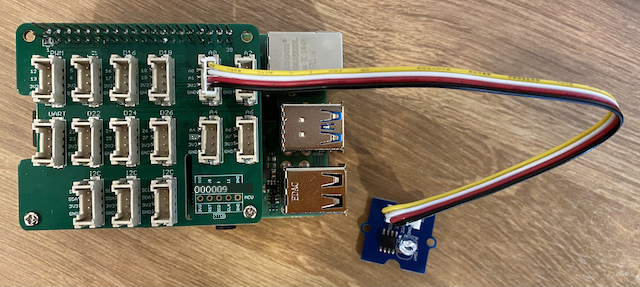

<!--
CO_OP_TRANSLATOR_METADATA:
{
  "original_hash": "ea733bd0cdf2479e082373f765a08678",
  "translation_date": "2025-10-11T11:35:25+00:00",
  "source_file": "1-getting-started/lessons/3-sensors-and-actuators/pi-sensor.md",
  "language_code": "et"
}
-->
# Ehita öölamp - Raspberry Pi

Selles õppetunni osas lisate oma Raspberry Pi-le valgusanduri.

## Riistvara

Selle õppetunni andur on **valgusandur**, mis kasutab [fotodioodi](https://wikipedia.org/wiki/Photodiode), et muundada valgus elektriliseks signaaliks. Tegemist on analooganduriga, mis saadab täisarvu väärtuse vahemikus 0 kuni 1,000, näidates suhtelist valguse hulka, mis ei vasta ühelegi standardsele mõõtühikule, nagu näiteks [lux](https://wikipedia.org/wiki/Lux).

Valgusandur on väline Grove andur ja tuleb ühendada Raspberry Pi Grove Base hat-iga.

### Ühenda valgusandur

Grove valgusandur, mida kasutatakse valguse taseme tuvastamiseks, tuleb ühendada Raspberry Pi-ga.

#### Ülesanne - ühenda valgusandur

Ühenda valgusandur.



1. Sisestage Grove kaabli üks ots valgusanduri mooduli pistikusse. Kaabel läheb sisse ainult ühel viisil.

1. Kui Raspberry Pi on välja lülitatud, ühendage Grove kaabli teine ots analoogpistikusse, mis on märgitud **A0** Grove Base hat-il, mis on Pi külge kinnitatud. See pistik asub GPIO pin-ide kõrval, teises pesas paremalt.



## Programmeeri valgusandur

Seadet saab nüüd programmeerida, kasutades Grove valgusandurit.

### Ülesanne - programmeeri valgusandur

Programmeeri seade.

1. Lülitage Pi sisse ja oodake, kuni see käivitub.

1. Avage öölambi projekt VS Code-is, mille te lõite selle ülesande eelmises osas, kas otse Pi peal või kasutades Remote SSH laiendust.

1. Avage `app.py` fail ja eemaldage sellest kogu kood.

1. Lisage `app.py` faili järgmine kood, et importida vajalikud teegid:

    ```python
    import time
    from grove.grove_light_sensor_v1_2 import GroveLightSensor
    ```

   `import time` lause impordib `time` mooduli, mida kasutatakse hiljem selles ülesandes.

   `from grove.grove_light_sensor_v1_2 import GroveLightSensor` lause impordib `GroveLightSensor` Grove Python teekidest. See teek sisaldab koodi Grove valgusanduriga suhtlemiseks ja see paigaldati ülemaailmselt Pi seadistamise ajal.

1. Lisage järgmine kood ülaltoodud koodi järel, et luua klassi instants, mis haldab valgusandurit:

    ```python
    light_sensor = GroveLightSensor(0)
    ```

   Rida `light_sensor = GroveLightSensor(0)` loob `GroveLightSensor` klassi instantsi, mis ühendub pin-iga **A0** - analoog Grove pin-iga, kuhu valgusandur on ühendatud.

1. Lisage lõputu tsükkel ülaltoodud koodi järel, et küsida valgusanduri väärtust ja kuvada see konsoolis:

    ```python
    while True:
        light = light_sensor.light
        print('Light level:', light)
    ```

   See loeb praeguse valguse taseme skaalal 0-1,023, kasutades `light` omadust `GroveLightSensor` klassis. See omadus loeb analoogväärtuse pin-ilt. See väärtus kuvatakse seejärel konsoolis.

1. Lisage tsükli lõppu väike ühe sekundi pikkune paus, kuna valguse taset ei ole vaja pidevalt kontrollida. Paus vähendab seadme energiatarbimist.

    ```python
    time.sleep(1)
    ```

1. Käivitage VS Code terminalist järgmine käsk, et oma Python rakendus käivitada:

    ```sh
    python3 app.py
    ```

   Valgusväärtused kuvatakse konsoolis. Katke ja avage valgusandur ning väärtused muutuvad:

    ```output
    pi@raspberrypi:~/nightlight $ python3 app.py 
    Light level: 634
    Light level: 634
    Light level: 634
    Light level: 230
    Light level: 104
    Light level: 290
    ```

> 💁 Selle koodi leiate [code-sensor/pi](../../../../../1-getting-started/lessons/3-sensors-and-actuators/code-sensor/pi) kaustast.

😀 Valgusanduri lisamine teie öölambi programmi oli edukas!

---

**Lahtiütlus**:  
See dokument on tõlgitud AI tõlketeenuse [Co-op Translator](https://github.com/Azure/co-op-translator) abil. Kuigi püüame tagada täpsust, palume arvestada, et automaatsed tõlked võivad sisaldada vigu või ebatäpsusi. Algne dokument selle algses keeles tuleks pidada autoriteetseks allikaks. Olulise teabe puhul soovitame kasutada professionaalset inimtõlget. Me ei vastuta selle tõlke kasutamisest tulenevate arusaamatuste või valesti tõlgenduste eest.