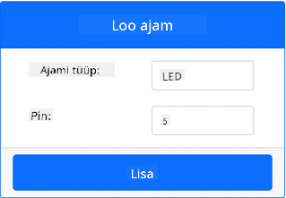
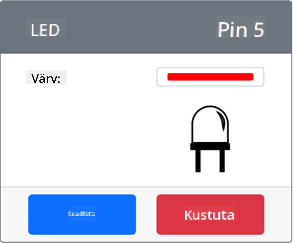

<!--
CO_OP_TRANSLATOR_METADATA:
{
  "original_hash": "9c640f93263fd9adbfda920739e09feb",
  "translation_date": "2025-10-11T11:36:57+00:00",
  "source_file": "1-getting-started/lessons/3-sensors-and-actuators/virtual-device-actuator.md",
  "language_code": "et"
}
-->
# Ehita öölamp - Virtuaalne IoT riistvara

Selles õppetunni osas lisad oma virtuaalsele IoT seadmele LED-i ja kasutad seda öölambi loomiseks.

## Virtuaalne riistvara

Öölamp vajab ühte täiturmehhanismi, mis luuakse CounterFit rakenduses.

Täiturmehhanism on **LED**. Füüsilises IoT seadmes oleks see [valgusdiood](https://wikipedia.org/wiki/Light-emitting_diode), mis kiirgab valgust, kui vool sellest läbi läheb. See on digitaalne täiturmehhanism, millel on kaks olekut: sisse ja välja. Väärtuse 1 saatmine lülitab LED-i sisse ja väärtuse 0 saatmine lülitab selle välja.

Öölambi loogika pseudokoodis on:

```output
Check the light level.
If the light is less than 300
    Turn the LED on
Otherwise
    Turn the LED off
```

### Täiturmehhanismi lisamine CounterFit rakendusse

Virtuaalse LED-i kasutamiseks tuleb see CounterFit rakendusse lisada.

#### Ülesanne - täiturmehhanismi lisamine CounterFit rakendusse

Lisa LED CounterFit rakendusse.

1. Veendu, et CounterFit veebirakendus töötab eelmise ülesande osast. Kui ei, käivita see uuesti ja lisa valgusandur uuesti.

1. Loo LED:

    1. *Create actuator* kastis *Actuator* paneelil, ava *Actuator type* rippmenüü ja vali *LED*.

    1. Määra *Pin* väärtuseks *5*.

    1. Vajuta **Add** nuppu, et luua LED Pin 5 peal.

    

    LED luuakse ja ilmub täiturmehhanismide loendisse.

    

    Kui LED on loodud, saad muuta selle värvi *Color* valiku abil. Vali värv ja vajuta **Set** nuppu, et värv muuta.

### Öölambi programmeerimine

Nüüd saab öölampi programmeerida, kasutades CounterFit valgusandurit ja LED-i.

#### Ülesanne - öölambi programmeerimine

Programmeerige öölamp.

1. Ava öölambi projekt VS Code'is, mille lõid eelmises ülesande osas. Vajadusel sulge ja taaskäivita terminal, et tagada virtuaalse keskkonna kasutamine.

1. Ava `app.py` fail.

1. Lisa järgmine kood `app.py` faili, et importida vajalik teek. See tuleks lisada ülemisse ossa, teiste `import` ridade alla.

    ```python
    from counterfit_shims_grove.grove_led import GroveLed
    ```

    `from counterfit_shims_grove.grove_led import GroveLed` lause impordib `GroveLed` CounterFit Grove shim Python teekidest. See teek sisaldab koodi, mis võimaldab suhelda CounterFit rakenduses loodud LED-iga.

1. Lisa järgmine kood pärast `light_sensor` deklaratsiooni, et luua klassi instants, mis haldab LED-i:

    ```python
    led = GroveLed(5)
    ```

    Rida `led = GroveLed(5)` loob `GroveLed` klassi instantsi, mis ühendub Pin **5**-ga - CounterFit Grove pin, millele LED on ühendatud.

1. Lisa kontroll `while` tsükli sisse, enne `time.sleep`, et kontrollida valguse taset ja lülitada LED sisse või välja:

    ```python
    if light < 300:
        led.on()
    else:
        led.off()
    ```

    See kood kontrollib `light` väärtust. Kui see on väiksem kui 300, kutsub see `GroveLed` klassi `on` meetodi, mis saadab LED-ile digitaalse väärtuse 1, lülitades selle sisse. Kui valguse väärtus on suurem või võrdne 300-ga, kutsub see `off` meetodi, saates digitaalse väärtuse 0, lülitades LED-i välja.

    > 💁 See kood peaks olema samal tasemel kui `print('Light level:', light)` rida, et olla `while` tsükli sees!

1. VS Code terminalis käivita järgmine käsk, et oma Python rakendus käivitada:

    ```sh
    python3 app.py
    ```

    Valguse väärtused kuvatakse konsoolis.

    ```output
    (.venv) ➜  GroveTest python3 app.py 
    Light level: 143
    Light level: 244
    Light level: 246
    Light level: 253
    ```

1. Muuda *Value* või *Random* seadeid, et varieerida valguse taset üle ja alla 300. LED lülitub sisse ja välja.


> 💁 Selle koodi leiad [code-actuator/virtual-device](../../../../../1-getting-started/lessons/3-sensors-and-actuators/code-actuator/virtual-device) kaustast.

😀 Sinu öölambi programm oli edukas!

---

**Lahtiütlus**:  
See dokument on tõlgitud AI tõlketeenuse [Co-op Translator](https://github.com/Azure/co-op-translator) abil. Kuigi püüame tagada täpsust, palume arvestada, et automaatsed tõlked võivad sisaldada vigu või ebatäpsusi. Algne dokument selle algses keeles tuleks pidada autoriteetseks allikaks. Olulise teabe puhul soovitame kasutada professionaalset inimtõlget. Me ei vastuta selle tõlke kasutamisest tulenevate arusaamatuste või valesti tõlgenduste eest.