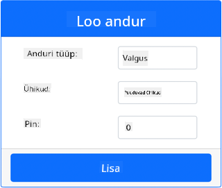
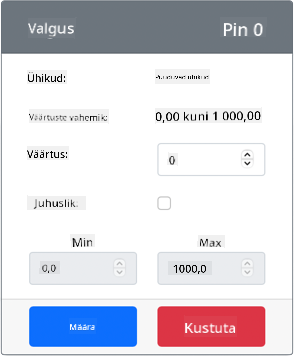

<!--
CO_OP_TRANSLATOR_METADATA:
{
  "original_hash": "11f10c6760fb8202cf368422702fdf70",
  "translation_date": "2025-10-11T11:36:30+00:00",
  "source_file": "1-getting-started/lessons/3-sensors-and-actuators/virtual-device-sensor.md",
  "language_code": "et"
}
-->
# Ehita öölamp - Virtuaalne IoT riistvara

Selles õppetunni osas lisate oma virtuaalsele IoT-seadmele valgusanduri.

## Virtuaalne riistvara

Öölamp vajab ühte andurit, mis luuakse CounterFit rakenduses.

Andur on **valgusandur**. Füüsilises IoT-seadmes oleks see [fotodiood](https://wikipedia.org/wiki/Photodiode), mis muundab valguse elektriliseks signaaliks. Valgusandurid on analoogandurid, mis saadavad täisarvulise väärtuse, mis näitab suhtelist valguse hulka, kuid ei vasta ühelegi standardsele mõõtühikule, nagu näiteks [lux](https://wikipedia.org/wiki/Lux).

### Lisa andurid CounterFit rakendusse

Virtuaalse valgusanduri kasutamiseks peate selle CounterFit rakendusse lisama.

#### Ülesanne - lisa andurid CounterFit rakendusse

Lisa valgusandur CounterFit rakendusse.

1. Veendu, et CounterFit veebirakendus töötab eelmise ülesande osast. Kui ei, käivita see.

1. Loo valgusandur:

    1. *Sensors* paneelil *Create sensor* kastis, ava *Sensor type* rippmenüü ja vali *Light*.

    1. Jäta *Units* väärtuseks *NoUnits*.

    1. Veendu, et *Pin* väärtuseks on *0*.

    1. Vajuta **Add** nuppu, et luua valgusandur Pin 0 külge.

    

    Valgusandur luuakse ja ilmub andurite nimekirja.

    

## Programmeeri valgusandur

Seadet saab nüüd programmeerida kasutama sisseehitatud valgusandurit.

### Ülesanne - programmeeri valgusandur

Programmeeri seade.

1. Ava öölambi projekt VS Code'is, mille lõite eelmises ülesande osas. Vajadusel sulge ja taaskäivita terminal, et veenduda, et see töötab virtuaalses keskkonnas.

1. Ava `app.py` fail.

1. Lisa järgmine kood `app.py` faili ülaossa koos teiste `import` lausete juurde, et importida vajalikud teegid:

    ```python
    import time
    from counterfit_shims_grove.grove_light_sensor_v1_2 import GroveLightSensor
    ```

    `import time` lause impordib Pythoni `time` mooduli, mida kasutatakse hiljem selles ülesandes.

    `from counterfit_shims_grove.grove_light_sensor_v1_2 import GroveLightSensor` lause impordib `GroveLightSensor` CounterFit Grove shim Pythoni teekidest. See teek sisaldab koodi, mis võimaldab suhelda CounterFit rakenduses loodud valgusanduriga.

1. Lisa järgmine kood faili lõppu, et luua klassi instantsid, mis haldavad valgusandurit:

    ```python
    light_sensor = GroveLightSensor(0)
    ```

    Rida `light_sensor = GroveLightSensor(0)` loob `GroveLightSensor` klassi instantsi, mis ühendub pin **0** külge - CounterFit Grove pin, mille külge valgusandur on ühendatud.

1. Lisa lõputu tsükkel ülaltoodud koodi järel, et küsida valgusanduri väärtust ja kuvada see konsoolis:

    ```python
    while True:
        light = light_sensor.light
        print('Light level:', light)
    ```

    See loeb praeguse valguse taseme, kasutades `GroveLightSensor` klassi `light` omadust. See omadus loeb analoogväärtuse pinilt. See väärtus kuvatakse konsoolis.

1. Lisa tsükli lõppu ühe sekundi pikkune paus, kuna valguse taset ei ole vaja pidevalt kontrollida. Paus vähendab seadme energiatarbimist.

    ```python
    time.sleep(1)
    ```

1. Käivita VS Code terminalist järgmine käsk, et käivitada oma Pythoni rakendus:

    ```sh
    python3 app.py
    ```

    Valgusväärtused kuvatakse konsoolis. Esialgu on see väärtus 0.

1. Muuda CounterFit rakenduses valgusanduri väärtust, mida rakendus loeb. Seda saab teha kahel viisil:

    * Sisesta number valgusanduri *Value* kasti ja vajuta **Set** nuppu. Sisestatud number on väärtus, mille andur tagastab.

    * Märgi *Random* märkeruut ja sisesta *Min* ja *Max* väärtused, seejärel vajuta **Set** nuppu. Iga kord, kui andur loeb väärtust, loeb see juhusliku arvu vahemikus *Min* ja *Max*.

    Määratud väärtused kuvatakse konsoolis. Muuda *Value* või *Random* seadeid, et väärtus muutuks.

    ```output
    (.venv) ➜  GroveTest python3 app.py 
    Light level: 143
    Light level: 244
    Light level: 246
    Light level: 253
    ```

> 💁 Selle koodi leiate [code-sensor/virtual-device](../../../../../1-getting-started/lessons/3-sensors-and-actuators/code-sensor/virtual-device) kaustast.

😀 Teie öölambi programm õnnestus!

---

**Lahtiütlus**:  
See dokument on tõlgitud AI tõlketeenuse [Co-op Translator](https://github.com/Azure/co-op-translator) abil. Kuigi püüame tagada täpsust, palume arvestada, et automaatsed tõlked võivad sisaldada vigu või ebatäpsusi. Algne dokument selle algses keeles tuleks pidada autoriteetseks allikaks. Olulise teabe puhul soovitame kasutada professionaalset inimtõlget. Me ei vastuta selle tõlke kasutamisest tulenevate arusaamatuste või valesti tõlgenduste eest.