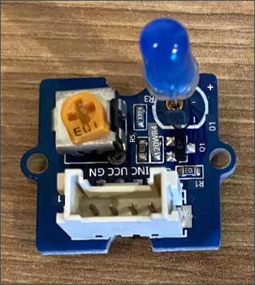
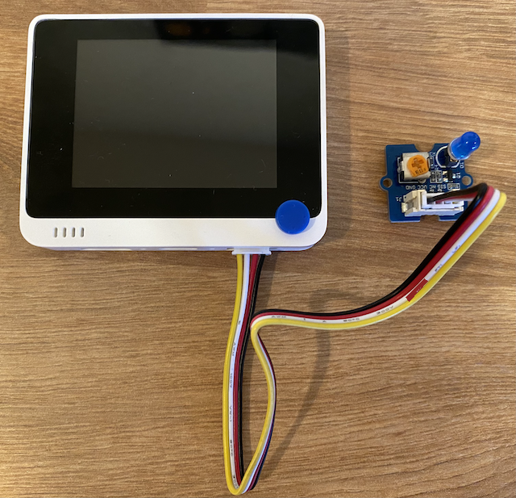

<!--
CO_OP_TRANSLATOR_METADATA:
{
  "original_hash": "db44083b4dc6fb06eac83c4f16448940",
  "translation_date": "2025-10-11T11:35:54+00:00",
  "source_file": "1-getting-started/lessons/3-sensors-and-actuators/wio-terminal-actuator.md",
  "language_code": "et"
}
-->
# Ehita öölamp - Wio Terminal

Selles õppetunni osas lisad oma Wio Terminalile LED-i ja kasutad seda öölambi loomiseks.

## Riistvara

Öölamp vajab nüüd täiturmehhanismi.

Täiturmehhanism on **LED**, [valgusdiood](https://wikipedia.org/wiki/Light-emitting_diode), mis kiirgab valgust, kui vool läbib seda. See on digitaalne täiturmehhanism, millel on kaks olekut: sisse ja välja. Väärtuse 1 saatmine lülitab LED-i sisse ja 0 lülitab selle välja. See on väline Grove täiturmehhanism, mis tuleb ühendada Wio Terminaliga.

Öölambi loogika pseudokoodis on:

```output
Check the light level.
If the light is less than 300
    Turn the LED on
Otherwise
    Turn the LED off
```

### Ühenda LED

Grove LED on moodul, millel on valik erinevaid LED-e, mis võimaldab valida värvi.

#### Ülesanne - ühenda LED

Ühenda LED.



1. Vali oma lemmik LED ja sisesta selle jalad LED-mooduli kahte auku.

    LED-id on valgusdioodid ja dioodid on elektroonilised seadmed, mis juhivad voolu ainult ühes suunas. See tähendab, et LED tuleb ühendada õigetpidi, vastasel juhul see ei tööta.

    Üks LED-i jalgadest on positiivne pin, teine negatiivne pin. LED ei ole täiesti ümmargune ja selle üks külg on veidi lamedam. Veidi lamedam külg on negatiivne pin. Kui ühendad LED-i mooduliga, veendu, et ümarama külje juures olev pin on ühendatud mooduli välisküljel märgitud **+** pistikuga ja lamedam külg on ühendatud mooduli keskele lähemal oleva pistikuga.

1. LED-moodulil on pöördnupp, mis võimaldab reguleerida heledust. Keera see alguses täielikult üles, pöörates seda vastupäeva nii kaugele kui võimalik, kasutades väikest Phillipsi kruvikeerajat.

1. Sisesta Grove-kaabli üks ots LED-mooduli pistikusse. See läheb sisse ainult ühes suunas.

1. Kui Wio Terminal on lahti ühendatud arvutist või muust toiteallikast, ühenda Grove-kaabli teine ots Wio Terminali parempoolse Grove-pistikuga, vaadates ekraani. See on pistik, mis asub toitenupust kõige kaugemal.

    > 💁 Parempoolset Grove-pistikut saab kasutada analoog- või digitaalsete sensorite ja täiturmehhanismidega. Vasakpoolne pistik on ainult I<sup>2</sup>C ja digitaalsete sensorite ning täiturmehhanismide jaoks. I<sup>2</sup>C käsitletakse hilisemas õppetunnis.



## Öölambi programmeerimine

Öölampi saab nüüd programmeerida, kasutades sisseehitatud valgusandurit ja Grove LED-i.

### Ülesanne - programmeeri öölamp

Programmee öölamp.

1. Ava öölambi projekt VS Code'is, mille lõid selle ülesande eelmises osas.

1. Lisa järgmine rida `setup` funktsiooni lõppu:

    ```cpp
    pinMode(D0, OUTPUT);
    ```

    See rida konfigureerib pin-i, mida kasutatakse LED-iga suhtlemiseks Grove-pordi kaudu.

    `D0` pin on digitaalne pin parempoolse Grove-pistiku jaoks. See pin on seadistatud `OUTPUT`, mis tähendab, et see ühendub täiturmehhanismiga ja andmeid kirjutatakse pin-ile.

1. Lisa järgmine kood kohe enne `delay` funktsiooni `loop` funktsioonis:

    ```cpp
    if (light < 300)
    {
        digitalWrite(D0, HIGH);
    }
    else
    {
        digitalWrite(D0, LOW);
    }
    ```

    See kood kontrollib `light` väärtust. Kui see on väiksem kui 300, saadab see `D0` digitaalsele pin-ile väärtuse `HIGH`. See `HIGH` on väärtus 1, mis lülitab LED-i sisse. Kui valgus on suurem või võrdne 300-ga, saadetakse pin-ile väärtus `LOW`, mis lülitab LED-i välja.

    > 💁 Digitaalväärtuste saatmisel täiturmehhanismidele on LOW väärtus 0v ja HIGH väärtus seadme maksimaalne pinge. Wio Terminali puhul on HIGH pinge 3.3V.

1. Ühenda Wio Terminal uuesti arvutiga ja laadi uus kood üles nagu varem.

1. Ühenda Serial Monitor. Valgusväärtused kuvatakse terminalis.

    ```output
    > Executing task: platformio device monitor <

    --- Available filters and text transformations: colorize, debug, default, direct, hexlify, log2file, nocontrol, printable, send_on_enter, time
    --- More details at http://bit.ly/pio-monitor-filters
    --- Miniterm on /dev/cu.usbmodem101  9600,8,N,1 ---
    --- Quit: Ctrl+C | Menu: Ctrl+T | Help: Ctrl+T followed by Ctrl+H ---
    Light value: 4
    Light value: 5
    Light value: 4
    Light value: 158
    Light value: 343
    Light value: 348
    Light value: 344
    ```

1. Kata ja ava valgusandur. Märka, kuidas LED süttib, kui valguse tase on 300 või vähem, ja kustub, kui valguse tase on suurem kui 300.


> 💁 Selle koodi leiad [code-actuator/wio-terminal](../../../../../1-getting-started/lessons/3-sensors-and-actuators/code-actuator/wio-terminal) kaustast.

😀 Sinu öölambi programm oli edukas!

---

**Lahtiütlus**:  
See dokument on tõlgitud tehisintellekti tõlketeenuse [Co-op Translator](https://github.com/Azure/co-op-translator) abil. Kuigi püüame tagada täpsuse, palume arvestada, et automaatsed tõlked võivad sisaldada vigu või ebatäpsusi. Algne dokument selle algses keeles tuleks lugeda autoriteetseks allikaks. Olulise teabe puhul soovitame kasutada professionaalset inimtõlget. Me ei vastuta selle tõlke kasutamisest tulenevate arusaamatuste või valede tõlgenduste eest.