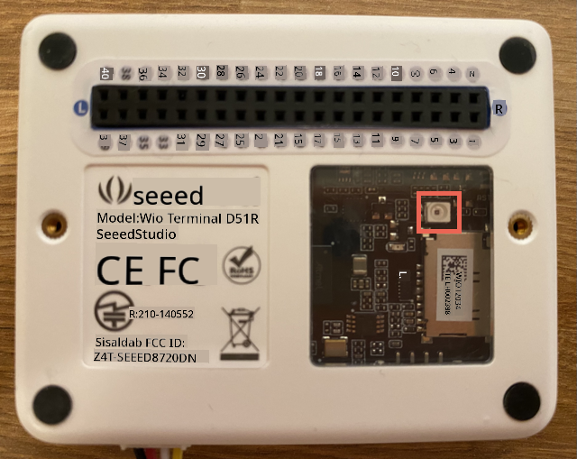

<!--
CO_OP_TRANSLATOR_METADATA:
{
  "original_hash": "7f4ad0ef54f248b85b92187c94cf9dcb",
  "translation_date": "2025-10-11T11:37:36+00:00",
  "source_file": "1-getting-started/lessons/3-sensors-and-actuators/wio-terminal-sensor.md",
  "language_code": "et"
}
-->
# Lisa sensor - Wio Terminal

Selles õppetunni osas kasutad Wio Terminali valgussensorit.

## Riistvara

Selle õppetunni sensor on **valgussensor**, mis kasutab [fotodioodi](https://wikipedia.org/wiki/Photodiode), et muundada valgus elektriliseks signaaliks. See on analoogsensor, mis saadab täisarvu väärtuse vahemikus 0 kuni 1,023, näidates suhtelist valguse hulka, mis ei vasta ühelegi standardsele mõõtühikule, nagu näiteks [lux](https://wikipedia.org/wiki/Lux).

Valgussensor on Wio Terminalisse sisse ehitatud ja nähtav läbi läbipaistva plastakna seadme tagaküljel.



## Programmeeri valgussensor

Seadet saab nüüd programmeerida kasutama sisseehitatud valgussensorit.

### Ülesanne

Programmeerige seade.

1. Ava öölambi projekt VS Code'is, mille lõid selle ülesande eelmises osas.

1. Lisa järgmine rida `setup` funktsiooni lõppu:

    ```cpp
    pinMode(WIO_LIGHT, INPUT);
    ```

   See rida konfigureerib sensoririistvaraga suhtlemiseks kasutatavad pinnid.

   `WIO_LIGHT` pin on GPIO pinni number, mis on ühendatud sisseehitatud valgussensoriga. See pin on seadistatud `INPUT`-iks, mis tähendab, et see on ühendatud sensoriga ja andmeid loetakse sellest pinnist.

1. Kustuta `loop` funktsiooni sisu.

1. Lisa järgmine kood nüüd tühja `loop` funktsiooni.

    ```cpp
    int light = analogRead(WIO_LIGHT);
    Serial.print("Light value: ");
    Serial.println(light);
    ```

   See kood loeb analoogväärtuse `WIO_LIGHT` pinnist. See loeb väärtuse vahemikus 0-1,023 sisseehitatud valgussensorist. See väärtus saadetakse seejärel jadaporti, et saaksid seda lugeda Serial Monitoris, kui kood töötab. `Serial.print` kirjutab teksti ilma uue reata lõpus, nii et iga rida algab `Light value:` ja lõpeb tegeliku valgusväärtusega.

1. Lisa `loop` funktsiooni lõppu väike viivitus ühe sekundi (1,000ms) ulatuses, kuna valguse taset ei ole vaja pidevalt kontrollida. Viivitus vähendab seadme energiatarbimist.

    ```cpp
    delay(1000);
    ```

1. Ühenda Wio Terminal uuesti arvutiga ja laadi üles uus kood nagu varem.

1. Ava Serial Monitor. Valgusväärtused kuvatakse terminalis. Kata ja ava Wio Terminali tagaküljel olev valgussensor ning väärtused muutuvad.

    ```output
    > Executing task: platformio device monitor <

    --- Available filters and text transformations: colorize, debug, default, direct, hexlify, log2file, nocontrol, printable, send_on_enter, time
    --- More details at http://bit.ly/pio-monitor-filters
    --- Miniterm on /dev/cu.usbmodem101  9600,8,N,1 ---
    --- Quit: Ctrl+C | Menu: Ctrl+T | Help: Ctrl+T followed by Ctrl+H ---
    Light value: 4
    Light value: 5
    Light value: 4
    Light value: 158
    Light value: 343
    Light value: 348
    Light value: 344
    ```

> 💁 Selle koodi leiad [code-sensor/wio-terminal](../../../../../1-getting-started/lessons/3-sensors-and-actuators/code-sensor/wio-terminal) kaustast.

😀 Sensori lisamine oma öölambi programmi oli edukas!

---

**Lahtiütlus**:  
See dokument on tõlgitud AI tõlketeenuse [Co-op Translator](https://github.com/Azure/co-op-translator) abil. Kuigi püüame tagada täpsust, palume arvestada, et automaatsed tõlked võivad sisaldada vigu või ebatäpsusi. Algne dokument selle algses keeles tuleks pidada autoriteetseks allikaks. Olulise teabe puhul soovitame kasutada professionaalset inimtõlget. Me ei vastuta selle tõlke kasutamisest tulenevate arusaamatuste või valesti tõlgenduste eest.