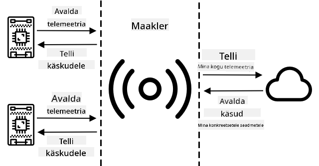
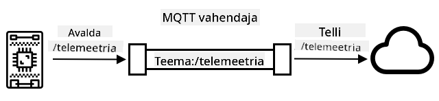
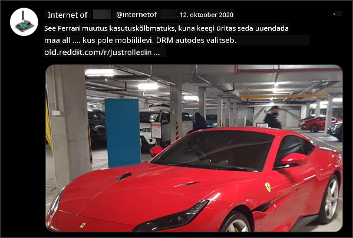

<!--
CO_OP_TRANSLATOR_METADATA:
{
  "original_hash": "71b5040e0b3472f1c0949c9b55f224c0",
  "translation_date": "2025-10-11T11:21:51+00:00",
  "source_file": "1-getting-started/lessons/4-connect-internet/README.md",
  "language_code": "et"
}
-->
# Ühenda oma seade Internetiga


> Visuaalne ülevaade: [Nitya Narasimhan](https://github.com/nitya). Klõpsa pildil, et näha suuremat versiooni.

See õppetund oli osa [Hello IoT sarjast](https://youtube.com/playlist?list=PLmsFUfdnGr3xRts0TIwyaHyQuHaNQcb6-) [Microsoft Reactorist](https://developer.microsoft.com/reactor/?WT.mc_id=academic-17441-jabenn). Õppetund jagunes kaheks videoks: 1-tunnine loeng ja 1-tunnine küsimuste-vastuste sessioon, kus süveneti õppetunni detailidesse ja vastati küsimustele.

[](https://youtu.be/O4dd172mZhs)

[](https://youtu.be/j-cVCzRDE2Q)

> 🎥 Klõpsa ülaltoodud piltidel, et vaadata videoid

## Eelloengu viktoriin

[Eelloengu viktoriin](https://black-meadow-040d15503.1.azurestaticapps.net/quiz/7)

## Sissejuhatus

IoT tähistab **Interneti**, mis viitab pilveühendusele ja teenustele, mis võimaldavad IoT-seadmete funktsioone, alates andurite mõõtmiste kogumisest kuni sõnumite saatmiseni, et juhtida täiturmehhanisme. IoT-seadmed ühenduvad tavaliselt ühe pilve IoT-teenusega, kasutades standardset suhtlusprotokolli, ja see teenus on ühendatud ülejäänud IoT-rakendusega, alates tehisintellekti teenustest, mis teevad andmete põhjal nutikaid otsuseid, kuni veebirakendusteni juhtimiseks või aruandluseks.

> 🎓 Andmeid, mida kogutakse anduritelt ja saadetakse pilve, nimetatakse telemeetriks.

IoT-seadmed saavad pilvest sõnumeid vastu võtta. Sageli sisaldavad need sõnumid käske – juhiseid, mis käsivad seadmel teha mingi toimingu kas sisemiselt (näiteks taaskäivitamine või püsivara uuendamine) või täiturmehhanismi abil (näiteks lambi sisse lülitamine).

Selles õppetunnis tutvustatakse mõningaid suhtlusprotokolle, mida IoT-seadmed kasutavad pilvega ühenduse loomiseks, ja andmetüüpe, mida nad võivad saata või vastu võtta. Samuti saad praktilise kogemuse, lisades oma öölambile interneti juhtimise, viies LED-i juhtimisloogika kohalikult töötavasse "serveri" koodi.

Selles õppetunnis käsitleme:

* [Suhtlusprotokollid](../../../../../1-getting-started/lessons/4-connect-internet)
* [Sõnumite järjekorra telemeetria transport (MQTT)](../../../../../1-getting-started/lessons/4-connect-internet)
* [Telemeetria](../../../../../1-getting-started/lessons/4-connect-internet)
* [Käsud](../../../../../1-getting-started/lessons/4-connect-internet)

## Suhtlusprotokollid

IoT-seadmete ja Interneti vaheliseks suhtluseks kasutatakse mitmeid populaarseid protokolle. Kõige populaarsemad põhinevad avaldamise/tellimise sõnumite edastamisel mingi vahendaja kaudu. IoT-seadmed ühenduvad vahendajaga, avaldavad telemeetria ja tellivad käske. Pilveteenused ühenduvad samuti vahendajaga, tellivad kõik telemeetria sõnumid ja avaldavad käske kas konkreetsetele seadmetele või seadmete gruppidele.



MQTT on IoT-seadmete seas kõige populaarsem suhtlusprotokoll ja seda käsitletakse selles õppetunnis. Muud protokollid hõlmavad AMQP ja HTTP/HTTPS.

## Sõnumite järjekorra telemeetria transport (MQTT)

[MQTT](http://mqtt.org) on kergekaaluline, avatud standardiga sõnumite edastamise protokoll, mis võimaldab seadmete vahel sõnumeid saata. See loodi 1999. aastal naftatorustike jälgimiseks ja vabastati 15 aastat hiljem IBM-i poolt avatud standardina.

MQTT-l on üks vahendaja ja mitu klienti. Kõik kliendid ühenduvad vahendajaga, ja vahendaja suunab sõnumid vastavatele klientidele. Sõnumeid suunatakse nimeliste teemade kaudu, mitte otse individuaalsele kliendile. Klient saab avaldada teemas ja kõik kliendid, kes seda teemat tellivad, saavad sõnumi.



✅ Uuri lähemalt. Kui sul on palju IoT-seadmeid, kuidas tagada, et sinu MQTT vahendaja suudab kõiki sõnumeid hallata?

### Ühenda oma IoT-seade MQTT-ga

Esimene samm öölambi interneti juhtimise lisamisel on selle ühendamine MQTT vahendajaga.

#### Ülesanne

Ühenda oma seade MQTT vahendajaga.

Selles õppetunni osas ühendad oma IoT öölambi internetiga, et seda saaks kaugjuhtida. Hiljem selles õppetunnis saadab sinu IoT-seade telemeetria sõnumi MQTT kaudu avalikule MQTT vahendajale valguse tasemega, kus see võetakse vastu serveri koodiga, mille sa kirjutad. See kood kontrollib valguse taset ja saadab käsusõnumi tagasi seadmele, öeldes, kas LED tuleks sisse või välja lülitada.

Sellise seadistuse reaalne kasutusjuhtum võiks olla andmete kogumine mitmest valgusandurist enne otsustamist, kas tuled sisse lülitada, näiteks staadionil, kus on palju tulesid. See võiks takistada tulesid sisse lülitamast, kui ainult üks andur on pilvede või linnu poolt kaetud, kuid teised andurid tuvastavad piisavalt valgust.

✅ Millistes olukordades oleks vaja hinnata andmeid mitmest andurist enne käskude saatmist?

Selle ülesande raames ei pea sa tegelema MQTT vahendaja seadistamise keerukusega, vaid saad kasutada avalikku testserverit, mis töötab [Eclipse Mosquitto](https://www.mosquitto.org) peal, mis on avatud lähtekoodiga MQTT vahendaja. See testvahendaja on avalikult saadaval aadressil [test.mosquitto.org](https://test.mosquitto.org) ja ei nõua konto seadistamist, muutes selle suurepäraseks tööriistaks MQTT klientide ja serverite testimiseks.

> 💁 See testvahendaja on avalik ja mitte turvaline. Kõik võivad kuulata, mida sa avaldad, seega ei tohiks seda kasutada andmetega, mis peavad jääma privaatseks.


Järgi allpool toodud samme, et ühendada oma seade MQTT vahendajaga:

* [Arduino - Wio Terminal](wio-terminal-mqtt.md)
* [Üheplaadi arvuti - Raspberry Pi/virtuaalne IoT-seade](single-board-computer-mqtt.md)

### Süvenemine MQTT-sse

Teemadel võib olla hierarhia ja kliendid saavad tellida hierarhia erinevaid tasemeid, kasutades metamärke. Näiteks saad saata temperatuuri telemeetria sõnumeid teemal `/telemetry/temperature` ja niiskuse sõnumeid teemal `/telemetry/humidity`, ning pilverakenduses tellida teemat `/telemetry/*`, et saada nii temperatuuri kui niiskuse telemeetria sõnumeid.

Sõnumeid saab saata kvaliteediteenusega (QoS), mis määrab sõnumi kättesaamise garantii.

* Maksimaalselt üks kord – sõnum saadetakse ainult üks kord ja klient ning vahendaja ei tee täiendavaid samme kättetoimetamise kinnitamiseks (saada ja unusta).
* Vähemalt üks kord – sõnumit saadetakse saatja poolt mitu korda, kuni kinnitus on saadud (kinnitatud kättetoimetamine).
* Täpselt üks kord – saatja ja vastuvõtja teevad kahe taseme käepigistuse, et tagada ainult ühe sõnumi koopia kättesaamine (kindel kättetoimetamine).

✅ Millistes olukordades oleks vaja kindlat kättetoimetamise sõnumit võrreldes "saada ja unusta" sõnumiga?

Kuigi nimi on Message Queueing (MQTT lühend), ei toeta see tegelikult sõnumijärjekordi. See tähendab, et kui klient ühenduse katkestab ja seejärel uuesti ühendub, ei saa ta ühenduse katkestamise ajal saadetud sõnumeid, välja arvatud need, mida ta oli juba QoS-protsessi kaudu töötlema hakanud. Sõnumitel võib olla määratud säilitamise lipp. Kui see on määratud, salvestab MQTT vahendaja viimase sõnumi, mis selle lipuga teemale saadeti, ja saadab selle hiljem teemat tellivatele klientidele. Nii saavad kliendid alati viimase sõnumi.

MQTT toetab ka ühenduse elusoleku funktsiooni, mis kontrollib, kas ühendus on endiselt aktiivne pikkade sõnumite vahede ajal.

> 🦟 [Mosquitto Eclipse Foundationilt](https://mosquitto.org) pakub tasuta MQTT vahendajat, mida saad ise käivitada, et MQTT-ga katsetada, samuti avalikku MQTT vahendajat, mida saad kasutada oma koodi testimiseks, aadressil [test.mosquitto.org](https://test.mosquitto.org).

MQTT ühendused võivad olla avalikud ja avatud või krüpteeritud ja turvatud kasutajanime ja parooli või sertifikaatidega.

> 💁 MQTT suhtleb TCP/IP kaudu, mis on sama võrgu protokoll nagu HTTP, kuid erineval pordil. MQTT-d saab kasutada ka veebipesade kaudu, et suhelda veebirakendustega, mis töötavad brauseris, või olukordades, kus tulemüürid või muud võrgu reeglid blokeerivad standardseid MQTT ühendusi.

## Telemeetria

Sõna telemeetria pärineb kreeka juurtest, mis tähendavad kaugmõõtmist. Telemeetria on andurite andmete kogumise ja pilve saatmise tegevus.

> 💁 Üks varasemaid telemeetria seadmeid leiutati Prantsusmaal 1874. aastal ja saatis reaalajas ilma- ja lumetaseme andmeid Mont Blancilt Pariisi. See kasutas füüsilisi juhtmeid, kuna traadita tehnoloogiad polnud tol ajal saadaval.

Vaatame tagasi nutika termostaadi näitele 1. õppetunnist.


Termostaadil on temperatuuriandurid telemeetria kogumiseks. Tõenäoliselt on sellel üks sisseehitatud temperatuuriandur ja see võib ühenduda mitme välise temperatuurianduriga traadita protokolli, näiteks [Bluetooth Low Energy](https://wikipedia.org/wiki/Bluetooth_Low_Energy) (BLE), kaudu.

Näide telemeetria andmetest, mida see saadaks, võiks olla:

| Nimi | Väärtus | Kirjeldus |
| ---- | ----- | ----------- |
| `thermostat_temperature` | 18°C | Termostaadi sisseehitatud temperatuurianduri mõõdetud temperatuur |
| `livingroom_temperature` | 19°C | Kaugtemperatuurianduri mõõdetud temperatuur, mis on nimetatud `livingroom`, et tuvastada ruum, kus see asub |
| `bedroom_temperature` | 21°C | Kaugtemperatuurianduri mõõdetud temperatuur, mis on nimetatud `bedroom`, et tuvastada ruum, kus see asub |

Pilveteenus saab seejärel kasutada seda telemeetria andmeid, et teha otsuseid, milliseid käske saata kütte juhtimiseks.

### Saada telemeetria oma IoT-seadmest

Järgmine samm öölambi interneti juhtimise lisamisel on valguse taseme telemeetria saatmine MQTT vahendajale telemeetria teemal.

#### Ülesanne - saada telemeetria oma IoT-seadmest

Saada valguse taseme telemeetria MQTT vahendajale.

Andmed saadetakse JSON-ina – JavaScripti objektide notatsioonina, mis on standard andmete tekstiliseks kodeerimiseks võtme/väärtuse paaridena.

✅ Kui sa pole varem JSON-iga kokku puutunud, saad selle kohta rohkem teada [JSON.org dokumentatsioonist](https://www.json.org/).

Järgi allpool toodud samme, et saata telemeetria oma seadmest MQTT vahendajale:

* [Arduino - Wio Terminal](wio-terminal-telemetry.md)
* [Üheplaadi arvuti - Raspberry Pi/virtuaalne IoT-seade](single-board-computer-telemetry.md)

### Võta telemeetria vastu MQTT vahendajalt

Telemeetria saatmisel pole mõtet, kui teisel poolel pole midagi, mis seda kuulaks. Valguse taseme telemeetria vajab midagi, mis seda kuulaks ja andmeid töötleks. See "serveri" kood on selline kood, mida sa paigaldaksid pilveteenusesse osana suuremast IoT-rakendusest, kuid siin hakkad seda koodi käivitama kohalikult oma arvutis (või oma Pi peal, kui sa seal otse kodeerid). Serveri kood koosneb Python rakendusest, mis kuulab telemeetria sõnumeid MQTT kaudu valguse tasemega. Hiljem selles õppetunnis paned selle vastama käsusõnumiga, mis sisaldab juhiseid LED-i sisse või välja lülitamiseks.

✅ Uuri lähemalt: Mis juhtub MQTT sõnumitega, kui kuulajat pole?

#### Paigalda Python ja VS Code

Kui sul pole Pythonit ja VS Code'i kohalikult paigaldatud, pead need mõlemad paigaldama, et serveri koodi kirjutada. Kui kasutad virtuaalset IoT-seadet või töötad oma Raspberry Pi peal, võid selle sammu vahele jätta, kuna need peaksid juba olema paigaldatud ja seadistatud.

##### Ülesanne - paigalda Python ja VS Code

Paigalda Python ja VS Code.

1. Paigalda Python. Vaata [Python allalaadimiste lehte](https://www.python.org/downloads/), et saada juhiseid Python'i uusima versiooni paigaldamiseks.

1. Paigalda Visual Studio Code (VS Code). See on redaktor, mida kasutad oma virtuaalse seadme koodi kirjutamiseks Pythonis. Vaata [VS Code dokumentatsiooni](https://code.visualstudio.com?WT.mc_id=academic-17441-jabenn), et saada juhiseid VS Code'i paigaldamiseks.

    > 💁 Sul on vabadus kasutada mis tahes Python IDE-d või redaktorit, kui sul on eelistatud tööriist, kuid õppetunnid annavad juhiseid VS Code'i kasutamise põhjal.

1. Paigalda VS Code Pylance laiendus. See on VS Code'i laiendus, mis pakub Python keele tuge. Vaata [Pylance laienduse dokumentatsiooni](https://marketplace.visualstudio.com/items?WT.mc_id=academic-17441-jabenn&itemName=ms-python.vscode-pylance), et saada juhiseid selle laienduse paigaldamiseks VS Code'is.

#### Konfigureeri Python virtuaalne keskkond
Üks Pythoni võimsamaid omadusi on võimalus installida [pip-pakette](https://pypi.org) – need on teiste inimeste kirjutatud ja internetti avaldatud koodipaketid. Sa saad pip-paketi oma arvutisse installida ühe käsuga ja seejärel kasutada seda oma koodis. Kasutad pip-i, et installida pakett MQTT-ga suhtlemiseks.

Vaikimisi, kui sa installid paketi, on see saadaval kõikjal sinu arvutis, mis võib tekitada probleeme pakettide versioonidega – näiteks kui üks rakendus sõltub ühest paketiversioonist, mis ei tööta, kui installid uue versiooni teise rakenduse jaoks. Selle probleemi lahendamiseks saad kasutada [Pythoni virtuaalset keskkonda](https://docs.python.org/3/library/venv.html), mis on sisuliselt Pythoni koopia spetsiaalses kaustas, ja kui sa installid pip-pakette, siis need installitakse ainult sellesse kausta.

##### Ülesanne – konfigureeri Pythoni virtuaalne keskkond

Konfigureeri Pythoni virtuaalne keskkond ja installi MQTT pip-paketid.

1. Ava terminal või käsurida ja käivita järgmised käsud endale sobivas asukohas, et luua ja liikuda uude kataloogi:

    ```sh
    mkdir nightlight-server
    cd nightlight-server
    ```

1. Nüüd käivita järgmine käsk, et luua virtuaalne keskkond `.venv` kaustas:

    ```sh
    python3 -m venv .venv
    ```

    > 💁 Sa pead selgelt kutsuma `python3`, et luua virtuaalne keskkond juhuks, kui sul on lisaks Python 3-le installitud ka Python 2 (viimane versioon). Kui sul on Python 2 installitud, siis `python` käivitamine kasutab Python 2 asemel Python 3.

1. Aktiveeri virtuaalne keskkond:

    * Windowsis:
        * Kui kasutad Command Prompti või Command Prompti läbi Windows Terminali, käivita:

            ```cmd
            .venv\Scripts\activate.bat
            ```

        * Kui kasutad PowerShelli, käivita:

            ```powershell
            .\.venv\Scripts\Activate.ps1
            ```

    * macOS-is või Linuxis, käivita:

        ```cmd
        source ./.venv/bin/activate
        ```

    > 💁 Need käsud tuleks käivitada samas asukohas, kus sa käivitasid käsu virtuaalse keskkonna loomiseks. Sa ei pea kunagi `.venv` kausta sisse liikuma, sa peaksid alati käivitama aktiveerimiskäsu ja kõik käsud pakettide installimiseks või koodi käivitamiseks kaustast, kus sa virtuaalse keskkonna lõid.

1. Kui virtuaalne keskkond on aktiveeritud, käivitab vaikimisi `python` käsk Pythoni versiooni, mida kasutati virtuaalse keskkonna loomiseks. Käivita järgmine käsk, et saada versioon:

    ```sh
    python --version
    ```

    Väljund on sarnane järgmisele:

    ```output
    (.venv) ➜  nightlight-server python --version
    Python 3.9.1
    ```

    > 💁 Sinu Pythoni versioon võib olla erinev – kui see on versioon 3.6 või uuem, siis on kõik korras. Kui ei, kustuta see kaust, installi uuem Pythoni versioon ja proovi uuesti.

1. Käivita järgmised käsud, et installida pip-pakett [Paho-MQTT](https://pypi.org/project/paho-mqtt/) jaoks, mis on populaarne MQTT teek.

    ```sh
    pip install paho-mqtt
    ```

    See pip-pakett installitakse ainult virtuaalsesse keskkonda ja ei ole saadaval väljaspool seda.

#### Kirjuta serveri kood

Serveri koodi saab nüüd kirjutada Pythonis.

##### Ülesanne – kirjuta serveri kood

Kirjuta serveri kood.

1. Ava terminal või käsurida ja käivita järgmine virtuaalses keskkonnas, et luua Pythoni fail nimega `app.py`:

    * Windowsis käivita:

        ```cmd
        type nul > app.py
        ```

    * macOS-is või Linuxis käivita:

        ```cmd
        touch app.py
        ```

1. Ava praegune kaust VS Code'is:

    ```sh
    code .
    ```

1. Kui VS Code käivitub, aktiveerib see Pythoni virtuaalse keskkonna. Seda näidatakse alumises olekuribal:

    

1. Kui VS Code Terminal on juba käimas, kui VS Code käivitub, siis virtuaalne keskkond ei ole seal aktiveeritud. Lihtsaim viis on terminal sulgeda, kasutades **Kill the active terminal instance** nuppu:

    

1. Käivita uus VS Code Terminal, valides *Terminal -> New Terminal* või vajutades `` CTRL+` ``. Uus terminal laadib virtuaalse keskkonna, aktiveerimiskäsk ilmub terminalis. Virtuaalse keskkonna nimi (`.venv`) ilmub ka käsurea promptis:

    ```output
    ➜  nightlight-server source .venv/bin/activate
    (.venv) ➜  nightlight 
    ```

1. Ava `app.py` fail VS Code'i explorerist ja lisa järgmine kood:

    ```python
    import json
    import time
    
    import paho.mqtt.client as mqtt
    
    id = '<ID>'
    
    client_telemetry_topic = id + '/telemetry'
    client_name = id + 'nightlight_server'
    
    mqtt_client = mqtt.Client(client_name)
    mqtt_client.connect('test.mosquitto.org')
    
    mqtt_client.loop_start()
    
    def handle_telemetry(client, userdata, message):
        payload = json.loads(message.payload.decode())
        print("Message received:", payload)
    
    mqtt_client.subscribe(client_telemetry_topic)
    mqtt_client.on_message = handle_telemetry
    
    while True:
        time.sleep(2)
    ```

    Asenda `<ID>` kuuendal real unikaalse ID-ga, mida kasutasid oma seadme koodi loomisel.

    ⚠️ See **peab** olema sama ID, mida kasutasid oma seadmes, vastasel juhul ei telli ega avalda serveri kood õigele teemale.

    See kood loob MQTT kliendi unikaalse nimega ja ühendub *test.mosquitto.org* brokeriga. Seejärel käivitab see töötlemisloopi, mis töötab taustal ja kuulab sõnumeid tellitud teemadel.

    Klient tellib sõnumeid telemeetria teemal ja määratleb funktsiooni, mida kutsutakse, kui sõnum on saadud. Kui telemeetria sõnum on saadud, kutsutakse `handle_telemetry` funktsioon, mis prindib saadud sõnumi konsooli.

    Lõpuks hoiab lõpmatu tsükkel rakenduse käimas. MQTT klient kuulab sõnumeid taustal ja töötab kogu aeg, kui põhirakendus töötab.

1. Käivita VS Code terminalist järgmine käsk, et käivitada oma Pythoni rakendus:

    ```sh
    python app.py
    ```

    Rakendus hakkab kuulama sõnumeid IoT-seadmest.

1. Veendu, et sinu seade töötab ja saadab telemeetria sõnumeid. Muuda füüsilise või virtuaalse seadme tuvastatud valguse taset. Saadetud sõnumid prinditakse terminali.

    ```output
    (.venv) ➜  nightlight-server python app.py
    Message received: {'light': 0}
    Message received: {'light': 400}
    ```

    Virtuaalses keskkonnas olev `app.py` fail peab olema käimas, et virtuaalses keskkonnas olev `app.py` fail saaks vastu võtta saadetud sõnumeid.

> 💁 Selle koodi leiad [code-server/server](../../../../../1-getting-started/lessons/4-connect-internet/code-server/server) kaustast.

### Kui tihti peaks telemeetriat saatma?

Üks oluline kaalutlus telemeetriaga on, kui tihti andmeid mõõta ja saata? Vastus on – see sõltub. Kui mõõdad tihti, saad kiiremini reageerida muutustele, kuid kasutad rohkem energiat, rohkem ribalaiust, genereerid rohkem andmeid ja vajad rohkem pilveressursse nende töötlemiseks. Sa pead mõõtma piisavalt tihti, kuid mitte liiga tihti.

Termostaadi puhul on tõenäoliselt piisav mõõta iga paari minuti järel, kuna temperatuurid ei muutu nii tihti. Kui mõõdad ainult kord päevas, siis võid sattuda olukorda, kus kütad oma maja öiste temperatuuride järgi keset päikeselist päeva, samas kui mõõtes iga sekund saad tuhandeid tarbetult dubleeritud temperatuurimõõtmisi, mis söövad kasutaja internetikiirust ja ribalaiust (probleem inimestele, kellel on piiratud ribalaiuse plaanid), kasutavad rohkem energiat, mis võib olla probleem akutoitel seadmete puhul nagu kaugandurid, ja suurendavad pilveteenuse pakkuja kulusid nende töötlemiseks ja salvestamiseks.

Kui jälgid andmeid tehase masinast, mille rike võib põhjustada katastroofilisi kahjustusi ja miljoneid dollareid kaotatud tulu, siis võib olla vajalik mõõta mitu korda sekundis. Parem on raisata ribalaiust kui jätta märkamata telemeetria, mis näitab, et masin tuleb peatada ja parandada enne, kui see katki läheb.

> 💁 Sellises olukorras võiks kaaluda servaseadme kasutamist, et telemeetriat esmalt töödelda ja vähendada sõltuvust internetist.

### Ühenduse kaotus

Internetiühendused võivad olla ebausaldusväärsed, katkestused on tavalised. Mida peaks IoT-seade sellises olukorras tegema – kas kaotama andmed või salvestama need kuni ühendus taastub? Jällegi, vastus on see sõltub.

Termostaadi puhul võib andmed tõenäoliselt kaotada kohe, kui uus temperatuurimõõtmine on tehtud. Küttesüsteem ei hooli sellest, et 20 minutit tagasi oli temperatuur 20.5°C, kui temperatuur on nüüd 19°C – just praegune temperatuur määrab, kas küte peaks olema sisse või välja lülitatud.

Masinate puhul võib olla vajalik andmed säilitada, eriti kui neid kasutatakse trendide otsimiseks. On olemas masinõppe mudelid, mis suudavad tuvastada anomaaliaid andmevoogudes, vaadates kindla ajaperioodi (näiteks viimase tunni) andmeid ja tuvastades ebatavalisi andmeid. Seda kasutatakse sageli ennustava hoolduse jaoks, otsides märke, et midagi võib peagi katki minna, et saaks selle enne parandada või asendada. Võid soovida, et iga masinast saadetud telemeetria oleks saadetud, et seda saaks töödelda anomaaliate tuvastamiseks, nii et kui IoT-seade suudab uuesti ühenduda, saadab see kõik internetikatkestuse ajal genereeritud telemeetria.

IoT-seadme disainerid peaksid kaaluma ka seda, kas IoT-seadet saab kasutada internetikatkestuse või signaali kadumise korral, mis on põhjustatud asukohast. Nutikas termostaat peaks suutma teha mõningaid piiratud otsuseid kütmise juhtimiseks, kui see ei saa telemeetriat pilve saata katkestuse tõttu.

[](https://twitter.com/internetofshit/status/1315736960082808832)

MQTT puhul, et käsitleda ühenduse kaotust, peavad seade ja serveri kood vastutama sõnumite edastamise tagamise eest, kui see on vajalik, näiteks nõudes, et kõik saadetud sõnumid vastatakse täiendavate sõnumitega vastusteemal, ja kui ei, siis need järjekorrastatakse käsitsi, et hiljem uuesti saata.

## Käsklused

Käsklused on sõnumid, mida pilv saadab seadmele, juhendades seda midagi tegema. Enamasti hõlmab see mingisuguse väljundi andmist läbi aktuaatori, kuid see võib olla juhis seadmele endale, näiteks taaskäivitamiseks või lisatelemeetria kogumiseks ja vastusena käsklusele tagastamiseks.


Termostaat võiks saada pilvest käsu kütmise sisselülitamiseks. Kõigi sensorite telemeetriaandmete põhjal otsustab pilveteenus, et küte peaks olema sisse lülitatud, ja saadab vastava käsu.

### Saada käsklusi MQTT brokerile

Järgmine samm meie internetiga juhitava öölambi jaoks on serveri koodist käsu saatmine IoT-seadmele, et juhtida valgust vastavalt tuvastatud valguse tasemele.

1. Ava serveri kood VS Code'is

1. Lisa järgmine rida pärast `client_telemetry_topic` deklaratsiooni, et määrata, millisele teemale käske saata:

    ```python
    server_command_topic = id + '/commands'
    ```

1. Lisa järgmine kood `handle_telemetry` funktsiooni lõppu:

    ```python
    command = { 'led_on' : payload['light'] < 300 }
    print("Sending message:", command)
    
    client.publish(server_command_topic, json.dumps(command))
    ```

    See saadab JSON-sõnumi käsuteemale, kus `led_on` väärtus on määratud tõeks või vääraks sõltuvalt sellest, kas valgus on väiksem kui 300 või mitte. Kui valgus on väiksem kui 300, saadetakse tõene, et juhendada seadet LED sisse lülitama.

1. Käivita kood nagu varem

1. Muuda füüsilise või virtuaalse seadme tuvastatud valguse taset. Saadetud sõnumid ja käsud prinditakse terminali:

    ```output
    (.venv) ➜  nightlight-server python app.py
    Message received: {'light': 0}
    Sending message: {'led_on': True}
    Message received: {'light': 400}
    Sending message: {'led_on': False}
    ```

> 💁 Telemeetria ja käsud saadetakse ühel teema kohta. See tähendab, et telemeetria mitmest seadmest ilmub samal telemeetria teemal ja käsud mitmele seadmele ilmuvad samal käsuteemal. Kui soovid saata käsku konkreetsele seadmele, võiksid kasutada mitut teemat, mis on nimetatud unikaalse seadme ID-ga, näiteks `/commands/device1`, `/commands/device2`. Nii saab seade kuulata sõnumeid, mis on mõeldud ainult sellele ühele seadmele.

> 💁 Selle koodi leiad [code-commands/server](../../../../../1-getting-started/lessons/4-connect-internet/code-commands/server) kaustast.

### Käskude käsitlemine IoT-seadmes

Nüüd, kui käsud saadetakse serverist, saad lisada koodi IoT-seadmesse, et neid käsitleda ja LED-i juhtida.

Järgi vastavat sammu allpool, et kuulata käske MQTT brokerilt:

* [Arduino - Wio Terminal](wio-terminal-commands.md)
* [Üheplaadiarvuti - Raspberry Pi/virtuaalne IoT-seade](single-board-computer-commands.md)

Kui see kood on kirjutatud ja käimas, katseta valguse taseme muutmist. Vaata serveri ja seadme väljundit ning jälgi LED-i, kui muudate valguse taset.

### Ühenduse kaotus

Mida peaks pilveteenus tegema, kui see peab saatma käsu IoT-seadmele, mis on offline? Jällegi, vastus on see sõltub.

Kui viimane käsk tühistab varasema, siis võib varasemad käsud tõenäoliselt ignoreerida. Kui pilveteenus saadab käsu kütmise sisselülitamiseks ja seejärel käsu kütmise väljalülitamiseks, siis võib sisse lülitamise käsku ignoreerida ja mitte uuesti saata.

Kui käsud tuleb töödelda järjekorras, näiteks liigutada robotkäsi üles ja seejärel sulgeda haarats, siis tuleb need järjekorras saata, kui ühendus taastub.

✅ Kuidas võiks seade või serveri kood tagada, et käsud saadetakse ja käsitletakse alati järjekorras MQTT kaudu, kui see on vajalik?

---

## 🚀 Väljakutse

Viimase kolme tunni väljakutse oli loetleda nii palju IoT-seadmeid kui võimalik, mis on sinu kodus, koolis või töökohas, ja otsustada, kas need on ehitatud mikroprotsessorite või üheplaadiarvutite ümber või isegi mõlema kombinatsioonina, ning mõelda, milliseid sensoreid ja aktuaatoreid nad kasutavad.

Nende seadmete puhul mõtle, milliseid sõnumeid nad võivad saata või vastu võtta. Millist telemeetriat nad saadavad? Milliseid sõnumeid või käske nad võivad vastu võtta? Kas arvad, et need on turvalised?

## Loengu järgne viktoriin
[Loengu järgne viktoriin](https://black-meadow-040d15503.1.azurestaticapps.net/quiz/8)

## Ülevaade ja iseseisev õppimine

Loe rohkem MQTT kohta [MQTT Wikipedia lehel](https://wikipedia.org/wiki/MQTT).

Proovi ise käivitada MQTT brokerit, kasutades [Mosquitto](https://www.mosquitto.org), ja ühenda see oma IoT seadme ja serveri koodiga.

> 💁 Näpunäide - vaikimisi ei luba Mosquitto anonüümseid ühendusi (ehk ühendusi ilma kasutajanime ja paroolita) ning ei luba ühendusi arvutist väljaspool, kus see töötab.
> Seda saab parandada [`mosquitto.conf` konfiguratsioonifailiga](https://www.mosquitto.org/man/mosquitto-conf-5.html), kasutades järgmist:
>
> ```sh
> listener 1883 0.0.0.0
> allow_anonymous true
> ```

## Ülesanne

[Võrdle ja vastanda MQTT-d teiste suhtlusprotokollidega](assignment.md)

---

**Lahtiütlus**:  
See dokument on tõlgitud AI tõlketeenuse [Co-op Translator](https://github.com/Azure/co-op-translator) abil. Kuigi püüame tagada täpsust, palume arvestada, et automaatsed tõlked võivad sisaldada vigu või ebatäpsusi. Algne dokument selle algses keeles tuleks pidada autoriteetseks allikaks. Olulise teabe puhul soovitame kasutada professionaalset inimtõlget. Me ei vastuta selle tõlke kasutamisest tulenevate arusaamatuste või valesti tõlgenduste eest.