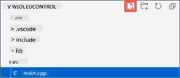

<!--
CO_OP_TRANSLATOR_METADATA:
{
  "original_hash": "d6faf0e8d3c2d6d20c0aef2a305dab18",
  "translation_date": "2025-10-11T11:19:43+00:00",
  "source_file": "1-getting-started/lessons/4-connect-internet/wio-terminal-mqtt.md",
  "language_code": "et"
}
-->
# Juhi oma öölampi interneti kaudu - Wio Terminal

IoT-seade tuleb programmeerida suhtlema *test.mosquitto.org*-iga, kasutades MQTT-d, et saata telemeetrilisi väärtusi valgusanduri näitude põhjal ja vastu võtta käske LED-i juhtimiseks.

Selles õppetunni osas ühendad oma Wio Terminali MQTT vahendajaga.

## WiFi ja MQTT Arduino teekide paigaldamine

Et suhelda MQTT vahendajaga, tuleb paigaldada mõned Arduino teegid, mis võimaldavad kasutada Wio Terminali WiFi kiipi ja suhelda MQTT kaudu. Arduino seadmete arendamisel saab kasutada laia valikut teeke, mis sisaldavad avatud lähtekoodiga funktsioone ja rakendavad mitmesuguseid võimalusi. Seeed avaldab teeke Wio Terminali jaoks, mis võimaldavad sel suhelda WiFi kaudu. Teised arendajad on avaldanud teeke MQTT vahendajatega suhtlemiseks, ja sa kasutad neid oma seadmega.

Need teegid on saadaval lähtekoodina, mida saab automaatselt importida PlatformIO-sse ja kompileerida sinu seadme jaoks. Nii töötavad Arduino teegid igal seadmel, mis toetab Arduino raamistikku, eeldusel, et seadmel on vajalik riistvara, mida teek vajab. Mõned teegid, nagu Seeed WiFi teegid, on spetsiifilised teatud riistvarale.

Teegid saab paigaldada globaalselt ja kompileerida vajadusel või konkreetse projekti jaoks. Selle ülesande jaoks paigaldatakse teegid projekti.

✅ Sa saad rohkem teada teekide haldamise ja nende leidmise ning paigaldamise kohta [PlatformIO teekide dokumentatsioonist](https://docs.platformio.org/en/latest/librarymanager/index.html).

### Ülesanne - paigalda WiFi ja MQTT Arduino teegid

Paigalda Arduino teegid.

1. Ava öölambi projekt VS Code'is.

1. Lisa järgmine `platformio.ini` faili lõppu:

    ```ini
    lib_deps =
        seeed-studio/Seeed Arduino rpcWiFi @ 1.0.5
        seeed-studio/Seeed Arduino FS @ 2.1.1
        seeed-studio/Seeed Arduino SFUD @ 2.0.2
        seeed-studio/Seeed Arduino rpcUnified @ 2.1.3
        seeed-studio/Seeed_Arduino_mbedtls @ 3.0.1
    ```

    See impordib Seeed WiFi teegid. Süntaks `@ <number>` viitab teegi konkreetsele versiooninumbrile.

    > 💁 Võid eemaldada `@ <number>`, et alati kasutada teekide uusimat versiooni, kuid pole garantiid, et hilisemad versioonid töötavad alloleva koodiga. Siin olev kood on testitud selle teekide versiooniga.

    See on kõik, mida pead tegema teekide lisamiseks. Järgmine kord, kui PlatformIO projekti kompileerib, laadib see teekide lähtekoodi alla ja kompileerib selle sinu projekti jaoks.

1. Lisa järgmine `lib_deps` sektsiooni:

    ```ini
    knolleary/PubSubClient @ 2.8
    ```

    See impordib [PubSubClient](https://github.com/knolleary/pubsubclient), Arduino MQTT kliendi.

## Ühenda WiFi-ga

Nüüd saab Wio Terminal ühendada WiFi-ga.

### Ülesanne - ühenda WiFi-ga

Ühenda Wio Terminal WiFi-ga.

1. Loo `src` kaustas uus fail nimega `config.h`. Seda saab teha, valides `src` kausta või `main.cpp` faili ja klõpsates **Uus fail** nuppu failihalduris. See nupp ilmub ainult siis, kui kursor on failihalduri kohal.

    

1. Lisa sellele failile järgmine kood, et määrata WiFi mandaadi konstandid:

    ```cpp
    #pragma once

    #include <string>
    
    using namespace std;
    
    // WiFi credentials
    const char *SSID = "<SSID>";
    const char *PASSWORD = "<PASSWORD>";
    ```

    Asenda `<SSID>` oma WiFi SSID-ga. Asenda `<PASSWORD>` oma WiFi parooliga.

1. Ava `main.cpp` fail.

1. Lisa faili algusesse järgmised `#include` direktiivid:

    ```cpp
    #include <PubSubClient.h>
    #include <rpcWiFi.h>
    #include <SPI.h>
    
    #include "config.h"
    ```

    Need lisavad päisefailid teekide jaoks, mille sa varem lisasid, samuti konfiguratsiooni päisefaili. Need päisefailid on vajalikud, et PlatformIO tooks teekide koodi sisse. Kui neid päisefaili ei lisata, ei kompileerita osa koodist ja saad kompilaatori veateateid.

1. Lisa järgmine kood `setup` funktsiooni kohale:

    ```cpp
    void connectWiFi()
    {
        while (WiFi.status() != WL_CONNECTED)
        {
            Serial.println("Connecting to WiFi..");
            WiFi.begin(SSID, PASSWORD);
            delay(500);
        }
    
        Serial.println("Connected!");
    }
    ```

    See kood kordab ühenduse loomist seni, kuni seade pole WiFi-ga ühendatud, ja proovib ühendust luua, kasutades konfiguratsiooni päisefailist saadud SSID-d ja parooli.

1. Lisa selle funktsiooni väljakutse `setup` funktsiooni lõppu, pärast pin'ide seadistamist.

    ```cpp
    connectWiFi();
    ```

1. Laadi see kood oma seadmesse, et kontrollida WiFi ühenduse toimimist. Sa peaksid nägema seda seeria monitoris.

    ```output
    > Executing task: platformio device monitor <
    
    --- Available filters and text transformations: colorize, debug, default, direct, hexlify, log2file, nocontrol, printable, send_on_enter, time
    --- More details at http://bit.ly/pio-monitor-filters
    --- Miniterm on /dev/cu.usbmodem1101  9600,8,N,1 ---
    --- Quit: Ctrl+C | Menu: Ctrl+T | Help: Ctrl+T followed by Ctrl+H ---
    Connecting to WiFi..
    Connected!
    ```

## Ühenda MQTT-ga

Kui Wio Terminal on WiFi-ga ühendatud, saab see ühendada MQTT vahendajaga.

### Ülesanne - ühenda MQTT-ga

Ühenda MQTT vahendajaga.

1. Lisa järgmine kood `config.h` faili lõppu, et määrata MQTT vahendaja ühenduse üksikasjad:

    ```cpp
    // MQTT settings
    const string ID = "<ID>";
    
    const string BROKER = "test.mosquitto.org";
    const string CLIENT_NAME = ID + "nightlight_client";
    ```

    Asenda `<ID>` unikaalse ID-ga, mida kasutatakse selle seadme kliendi nimeks ja hiljem selle seadme avaldatavate ja tellitavate teemade jaoks. *test.mosquitto.org* vahendaja on avalik ja seda kasutavad paljud inimesed, sealhulgas teised õpilased, kes teevad seda ülesannet. Unikaalse MQTT kliendi nime ja teema nimede olemasolu tagab, et sinu kood ei lähe vastuollu kellegi teise omaga. Sul on seda ID-d vaja ka hiljem, kui loote serveri koodi selle ülesande jaoks.

    > 💁 Sa võid kasutada veebisaiti nagu [GUIDGen](https://www.guidgen.com), et genereerida unikaalne ID.

    `BROKER` on MQTT vahendaja URL.

    `CLIENT_NAME` on unikaalne nimi selle MQTT kliendi jaoks vahendajas.

1. Ava `main.cpp` fail ja lisa järgmine kood `connectWiFi` funktsiooni alla ja `setup` funktsiooni kohale:

    ```cpp
    WiFiClient wioClient;
    PubSubClient client(wioClient);
    ```

    See kood loob WiFi kliendi, kasutades Wio Terminali WiFi teeke, ja kasutab seda MQTT kliendi loomiseks.

1. Lisa selle koodi alla järgmine:

    ```cpp
    void reconnectMQTTClient()
    {
        while (!client.connected())
        {
            Serial.print("Attempting MQTT connection...");
    
            if (client.connect(CLIENT_NAME.c_str()))
            {
                Serial.println("connected");
            }
            else
            {
                Serial.print("Retying in 5 seconds - failed, rc=");
                Serial.println(client.state());
                
                delay(5000);
            }
        }
    }
    ```

    See funktsioon testib ühendust MQTT vahendajaga ja ühendab uuesti, kui ühendus puudub. See kordab seni, kuni ühendus on loodud, ja proovib ühendust luua, kasutades konfiguratsiooni päisefailis määratud unikaalset kliendi nime.

    Kui ühendus ebaõnnestub, proovib see uuesti 5 sekundi pärast.

1. Lisa järgmine kood `reconnectMQTTClient` funktsiooni alla:

    ```cpp
    void createMQTTClient()
    {
        client.setServer(BROKER.c_str(), 1883);
        reconnectMQTTClient();
    }
    ```

    See kood määrab kliendi jaoks MQTT vahendaja, samuti määrab tagasihelistamise, kui sõnum vastu võetakse. Seejärel proovib see vahendajaga ühendust luua.

1. Kutsu `createMQTTClient` funktsioon `setup` funktsioonis pärast WiFi ühendamist.

1. Asenda kogu `loop` funktsioon järgmisega:

    ```cpp
    void loop()
    {
        reconnectMQTTClient();
        client.loop();
    
        delay(2000);
    }
    ```

    See kood alustab ühenduse uuesti loomist MQTT vahendajaga. Need ühendused võivad kergesti katkeda, seega tasub regulaarselt kontrollida ja vajadusel uuesti ühendust luua. Seejärel kutsub see MQTT kliendi `loop` meetodit, et töödelda kõiki sõnumeid, mis on tellitud teemas ootel. See rakendus on ühe lõimega, seega ei saa sõnumeid vastu võtta taustalõimes, mistõttu tuleb põhiloos eraldada aega võrgus ootel olevate sõnumite töötlemiseks.

    Lõpuks tagab 2-sekundiline viivitus, et valguse tasemeid ei saadeta liiga tihti, vähendades seadme energiatarbimist.

1. Laadi kood oma Wio Terminali ja kasuta seeria monitori, et näha seadme ühendamist WiFi ja MQTT-ga.

    ```output
    > Executing task: platformio device monitor <
    
    source /Users/jimbennett/GitHub/IoT-For-Beginners/1-getting-started/lessons/4-connect-internet/code-mqtt/wio-terminal/nightlight/.venv/bin/activate
    --- Available filters and text transformations: colorize, debug, default, direct, hexlify, log2file, nocontrol, printable, send_on_enter, time
    --- More details at http://bit.ly/pio-monitor-filters
    --- Miniterm on /dev/cu.usbmodem1201  9600,8,N,1 ---
    --- Quit: Ctrl+C | Menu: Ctrl+T | Help: Ctrl+T followed by Ctrl+H ---
    Connecting to WiFi..
    Connected!
    Attempting MQTT connection...connected
    ```

> 💁 Sa leiad selle koodi [code-mqtt/wio-terminal](../../../../../1-getting-started/lessons/4-connect-internet/code-mqtt/wio-terminal) kaustast.

😀 Sa oled edukalt ühendanud oma seadme MQTT vahendajaga.

---

**Lahtiütlus**:  
See dokument on tõlgitud AI tõlketeenuse [Co-op Translator](https://github.com/Azure/co-op-translator) abil. Kuigi püüame tagada täpsust, palume arvestada, et automaatsed tõlked võivad sisaldada vigu või ebatäpsusi. Algne dokument selle algses keeles tuleks pidada autoriteetseks allikaks. Olulise teabe puhul soovitame kasutada professionaalset inimtõlget. Me ei vastuta selle tõlke kasutamisest tulenevate arusaamatuste või valesti tõlgenduste eest.