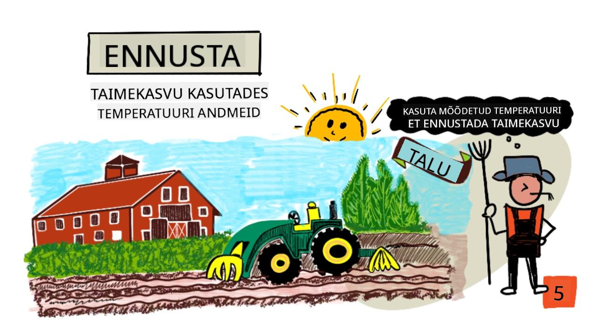
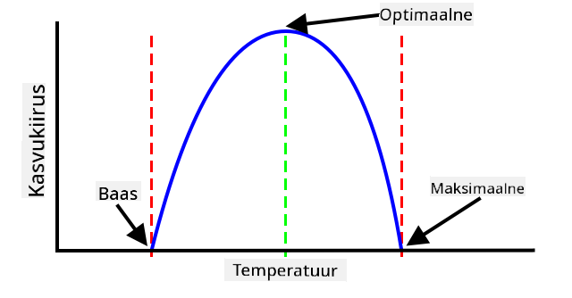
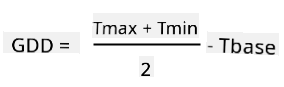
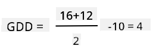
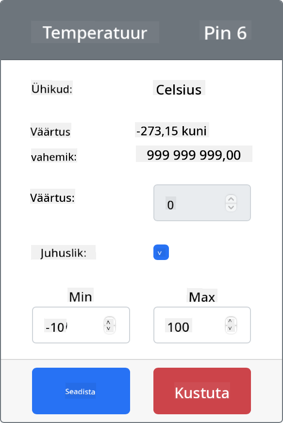
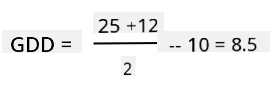

<!--
CO_OP_TRANSLATOR_METADATA:
{
  "original_hash": "d105b44deae539165855c976dcdeca99",
  "translation_date": "2025-10-11T12:36:52+00:00",
  "source_file": "2-farm/lessons/1-predict-plant-growth/README.md",
  "language_code": "et"
}
-->
# Ennusta taimede kasvu IoT abil



> Visandmärkmed: [Nitya Narasimhan](https://github.com/nitya). Klõpsa pildil, et näha suuremat versiooni.

## Eelloengu viktoriin

[Eelloengu viktoriin](https://black-meadow-040d15503.1.azurestaticapps.net/quiz/9)

## Sissejuhatus

Taimed vajavad kasvamiseks teatud tingimusi – vett, süsihappegaasi, toitaineid, valgust ja soojust. Selles õppetunnis õpid, kuidas arvutada taimede kasvu ja küpsemise kiirust, mõõtes õhutemperatuuri.

Selles õppetunnis käsitleme:

* [Digitaalne põllumajandus](../../../../../2-farm/lessons/1-predict-plant-growth)
* [Miks on temperatuur põllumajanduses oluline?](../../../../../2-farm/lessons/1-predict-plant-growth)
* [Mõõda ümbritsevat temperatuuri](../../../../../2-farm/lessons/1-predict-plant-growth)
* [Kasvupäevad (GDD)](../../../../../2-farm/lessons/1-predict-plant-growth)
* [Arvuta GDD temperatuurianduri andmete abil](../../../../../2-farm/lessons/1-predict-plant-growth)

## Digitaalne põllumajandus

Digitaalne põllumajandus muudab põllumajanduse viise, kasutades tööriistu andmete kogumiseks, salvestamiseks ja analüüsimiseks. Praegu elame ajajärgul, mida Maailma Majandusfoorum nimetab "neljandaks tööstusrevolutsiooniks", ja digitaalne põllumajandus on saanud nimeks "neljas põllumajandusrevolutsioon" ehk "Põllumajandus 4.0".

> 🎓 Termin "digitaalne põllumajandus" hõlmab ka kogu "põllumajandusväärtusahelat", mis tähendab teekonda farmist lauale. See hõlmab toodangu kvaliteedi jälgimist toidu transportimisel ja töötlemisel, lao- ja e-kaubandussüsteeme, isegi traktorirendi rakendusi!

Need muutused võimaldavad põllumeestel suurendada saagikust, kasutada vähem väetisi ja pestitsiide ning vett tõhusamalt. Kuigi peamiselt kasutatakse neid rikkamates riikides, muutuvad sensorid ja muud seadmed järk-järgult odavamaks, muutes need kättesaadavamaks ka arengumaades.

Mõned digitaalse põllumajanduse võimaldatud tehnikad on:

* Temperatuuri mõõtmine – temperatuuri mõõtmine võimaldab põllumeestel ennustada taimede kasvu ja küpsemist.
* Automaatne kastmine – mulla niiskuse mõõtmine ja niisutussüsteemide käivitamine, kui muld on liiga kuiv, selle asemel et kasta kindlatel kellaaegadel. Ajastatud kastmine võib viia taimede alakastmiseni kuuma ja kuiva perioodi ajal või ülekastmiseni vihma ajal. Kastmise optimeerimine ainult siis, kui muld seda vajab, aitab põllumeestel vett tõhusamalt kasutada.
* Kahjuritõrje – põllumehed saavad kasutada kaameraid automatiseeritud robotitel või droonidel kahjurite tuvastamiseks ja seejärel rakendada pestitsiide ainult seal, kus neid vaja on, vähendades pestitsiidide kasutamist ja nende sattumist kohalikesse veekogudesse.

✅ Tee veidi uurimistööd. Milliseid muid tehnikaid kasutatakse põllumajanduse saagikuse parandamiseks?

> 🎓 Termin "täppispõllumajandus" viitab põldude jälgimisele, mõõtmisele ja reageerimisele kas põldude kaupa või isegi põldude osade kaupa. See hõlmab vee, toitainete ja kahjurite taseme mõõtmist ning täpset reageerimist, näiteks kastmist ainult väikesele osale põllust.

## Miks on temperatuur põllumajanduses oluline?

Taimede kohta õppides õpetatakse enamikule õpilastele vee, valguse, süsihappegaasi (CO<sub>2</sub>) ja toitainete olulisust. Taimed vajavad kasvamiseks ka soojust – seepärast õitsevad taimed kevadel, kui temperatuur tõuseb, miks lumikellukesed või nartsissid võivad varakult tärgata lühikese soojaperioodi tõttu ja miks kasvuhooned on taimede kasvatamiseks nii tõhusad.

> 🎓 Kasvuhooned ja hothouses täidavad sarnast funktsiooni, kuid olulise erinevusega. Hothouses on kunstlikult köetud ja võimaldavad põllumeestel temperatuuri täpsemalt kontrollida, kasvuhooned aga tuginevad päikese soojusele ja tavaliselt ainus kontroll on aknad või muud avad, et soojust välja lasta.

Taimedel on baas- või minimaalne temperatuur, optimaalne temperatuur ja maksimaalne temperatuur, mis kõik põhinevad päeva keskmistel temperatuuridel.

* Baastemperatuur – minimaalne päeva keskmine temperatuur, mis on vajalik taime kasvuks.
* Optimaalne temperatuur – parim päeva keskmine temperatuur maksimaalse kasvu saavutamiseks.
* Maksimaalne temperatuur – maksimaalne temperatuur, mida taim talub. Kui temperatuur ületab selle piiri, peatab taim kasvu, et säästa vett ja ellu jääda.

> 💁 Need on keskmised temperatuurid, mis on arvutatud päeva- ja öötemperatuuride keskmisena. Taimed vajavad ka erinevaid temperatuure päeval ja öösel, et fotosünteesida tõhusamalt ja säästa energiat öösel.

Igal taimeliigil on erinevad väärtused oma baas-, optimaalse ja maksimaalse temperatuuri jaoks. Seetõttu õitsevad mõned taimed kuumades riikides ja teised külmemates riikides.

✅ Tee veidi uurimistööd. Uuri oma aias, koolis või kohalikus pargis kasvavate taimede baastemperatuuri.



Ülaltoodud graafik näitab näidet kasvu kiiruse ja temperatuuri graafikust. Baastemperatuurini ei toimu kasvu. Kasvu kiirus suureneb kuni optimaalse temperatuurini ja langeb pärast selle tipu saavutamist. Maksimaalse temperatuuri juures kasv peatub.

Selle graafiku kuju varieerub taimeliigiti. Mõnel on järsem langus optimaalse temperatuuri ületamisel, mõnel aeglasem tõus baastemperatuurist optimaalse temperatuurini.

> 💁 Põllumees, kes soovib parimat kasvu, peab teadma kolme temperatuuriväärtust ja mõistma graafikute kuju taimede jaoks, mida ta kasvatab.

Kui põllumehel on temperatuuri kontrollimise võimalus, näiteks kommertskasvuhoones, saab ta oma taimi optimeerida. Näiteks kommertskasvuhoones tomateid kasvatades hoitakse temperatuuri päeval umbes 25°C ja öösel 20°C, et saavutada kiireim kasv.

> 🍅 Kombineerides neid temperatuure kunstliku valguse, väetiste ja kontrollitud CO<sub>2</sub> tasemetega, saavad kommertskasvatajad kasvatada ja koristada saaki aastaringselt.

## Mõõda ümbritsevat temperatuuri

Temperatuuriandureid saab kasutada IoT seadmetega ümbritseva temperatuuri mõõtmiseks.

### Ülesanne – temperatuuri mõõtmine

Järgi vastavat juhendit, et jälgida temperatuure oma IoT seadme abil:

* [Arduino – Wio Terminal](wio-terminal-temp.md)
* [Üheplaatarvuti – Raspberry Pi](pi-temp.md)
* [Üheplaatarvuti – Virtuaalne seade](virtual-device-temp.md)

## Kasvupäevad

Kasvupäevad (tuntud ka kui kasvupäevaühikud) on viis taimede kasvu mõõtmiseks temperatuuri alusel. Eeldades, et taimel on piisavalt vett, toitaineid ja CO<sub>2</sub>, määrab temperatuur kasvukiiruse.

Kasvupäevad ehk GDD arvutatakse iga päeva kohta kui päeva keskmine temperatuur Celsiuse järgi, mis ületab taime baastemperatuuri. Iga taim vajab teatud arvu GDD, et kasvada, õitseda või toota ja küpsetada saaki. Mida rohkem GDD iga päev, seda kiiremini taim kasvab.

> 🇺🇸 Ameeriklaste jaoks saab kasvupäevi arvutada ka Fahrenheiti järgi. 5 GDD<sup>C</sup> (kasvupäevad Celsiuse järgi) vastab 9 GDD<sup>F</sup> (kasvupäevad Fahrenheiti järgi).

Täielik GDD valem on veidi keeruline, kuid sageli kasutatakse lihtsustatud võrrandit, mis on hea ligikaudne arvutus:



* **GDD** – kasvupäevade arv
* **T<sub>max</sub>** – päeva maksimaalne temperatuur kraadides Celsiuse järgi
* **T<sub>min</sub>** – päeva minimaalne temperatuur kraadides Celsiuse järgi
* **T<sub>base</sub>** – taime baastemperatuur kraadides Celsiuse järgi

> 💁 On variatsioone, mis käsitlevad T<sub>max</sub> üle 30°C või T<sub>min</sub> alla T<sub>base</sub>, kuid jätame need praegu kõrvale.

### Näide – Mais 🌽

Sõltuvalt sordist vajab mais (või maisitõlvik) küpsemiseks 800–2700 GDD, baastemperatuuriga 10°C.

Esimesel päeval, kui temperatuur ületas baastemperatuuri, mõõdeti järgmised temperatuurid:

| Mõõtmine   | Temp °C |
| :--------- | :-----: |
| Maksimaalne | 16      |
| Minimaalne  | 12      |

Sisestades need arvud meie arvutusse:

* T<sub>max</sub> = 16
* T<sub>min</sub> = 12
* T<sub>base</sub> = 10

See annab arvutuseks:



Mais sai sel päeval 4 GDD. Eeldades maisisorti, mis vajab küpsemiseks 800 GDD, vajab see veel 796 GDD, et küpseda.

✅ Tee veidi uurimistööd. Uuri oma aias, koolis või kohalikus pargis kasvavate taimede GDD arvu, mis on vajalik küpsemiseks või saagi tootmiseks.

## Arvuta GDD temperatuurianduri andmete abil

Taimed ei kasva kindlatel kuupäevadel – näiteks ei saa seemet istutada ja teada, et taim kannab vilja täpselt 100 päeva hiljem. Selle asemel võib põllumees saada umbkaudse ettekujutuse, kui kaua taim kasvab, ja seejärel kontrollida iga päev, millal saak on valmis.

See avaldab suurt tööjõumõju suurel farmil ja riskib, et põllumees jääb ootamatult varakult valminud saagist ilma. Temperatuuri mõõtmise abil saab põllumees arvutada, kui palju GDD taim on saanud, võimaldades tal kontrollida ainult eeldatava küpsuse lähedal.

Temperatuuriandmeid kogudes IoT seadme abil saab põllumeest automaatselt teavitada, kui taimed on küpsusele lähedal. Tüüpiline arhitektuur selleks on IoT seadmete temperatuuri mõõtmine ja nende telemeetriaandmete Interneti kaudu avaldamine, näiteks MQTT abil. Serveri kood kuulab neid andmeid ja salvestab need kuhugi, näiteks andmebaasi. See tähendab, et andmeid saab hiljem analüüsida, näiteks öine töö, et arvutada päeva GDD, summeerida iga saagi GDD seni ja teavitada, kui taim on küpsusele lähedal.


Serveri kood võib andmeid ka täiendada, lisades lisainformatsiooni. Näiteks võib IoT seade avaldada identifikaatori, mis näitab, milline seade see on, ja serveri kood võib kasutada seda seadme asukoha ja jälgitavate taimede leidmiseks. Samuti võib see lisada põhiandmeid, nagu praegune aeg, kuna mõned IoT seadmed ei ole varustatud täpse aja jälgimiseks vajaliku riistvaraga või vajavad täiendavat koodi, et lugeda praegust aega Interneti kaudu.

✅ Miks võivad erinevatel põldudel olla erinevad temperatuurid?

### Ülesanne – avalda temperatuuriandmed

Järgi vastavat juhendit, et avaldada temperatuuriandmeid MQTT kaudu oma IoT seadme abil, et neid hiljem analüüsida:

* [Arduino – Wio Terminal](wio-terminal-temp-publish.md)
* [Üheplaatarvuti – Raspberry Pi/Virtuaalne IoT seade](single-board-computer-temp-publish.md)

### Ülesanne – temperatuuriandmete kogumine ja salvestamine

Kui IoT seade avaldab telemeetria, saab serveri koodi kirjutada, et tellida need andmed ja salvestada need. Selle asemel, et salvestada andmeid andmebaasi, salvestab serveri kood need komaga eraldatud väärtuste (CSV) faili. CSV-failid salvestavad andmeid ridadena tekstina, kus iga väärtus on eraldatud komaga ja iga kirje uuel real. Need on mugav, inimloetav ja hästi toetatud viis andmete salvestamiseks failina.

CSV-failil on kaks veergu – *kuupäev* ja *temperatuur*. *Kuupäeva* veerg määratakse kui praegune kuupäev ja kellaaeg, mil sõnum serverisse jõudis, *temperatuur* pärineb telemeetria sõnumist.

1. Korda 4. õppetunnis tehtud samme, et luua serveri kood telemeetria tellimiseks. Sa ei pea lisama koodi käskude avaldamiseks.

    Sammud selleks on:

    * Konfigureeri ja aktiveeri Python Virtual Environment

    * Paigalda paho-mqtt pip pakett

    * Kirjuta kood, et kuulata MQTT sõnumeid, mis avaldatakse telemeetria teemal

      > ⚠️ Vajadusel viita [juhistele 4. õppetunnis Python rakenduse loomiseks telemeetria vastuvõtmiseks](../../../1-getting-started/lessons/4-connect-internet/README.md#receive-telemetry-from-the-mqtt-broker).

    Nimeta selle projekti kaust `temperature-sensor-server`.

1. Veendu, et `client_name` kajastaks seda projekti:

    ```cpp
    client_name = id + 'temperature_sensor_server'
    ```

1. Lisa järgmised impordid faili algusesse, olemasolevate importide alla:

    ```python
    from os import path
    import csv
    from datetime import datetime
    ```

    See impordib raamatukogu failide lugemiseks, raamatukogu CSV-failidega töötamiseks ja raamatukogu kuupäevade ja kellaaegadega töötamiseks.

1. Lisa järgmine kood enne funktsiooni `handle_telemetry`:

    ```python
    temperature_file_name = 'temperature.csv'
    fieldnames = ['date', 'temperature']
    
    if not path.exists(temperature_file_name):
        with open(temperature_file_name, mode='w') as csv_file:
            writer = csv.DictWriter(csv_file, fieldnames=fieldnames)
            writer.writeheader()
    ```

    See kood deklareerib mõned konstandid faili nime ja CSV-faili veerupäiste nimede jaoks. CSV-faili esimene rida sisaldab traditsiooniliselt veerupäiseid, mis on eraldatud komadega.

    Kood kontrollib, kas CSV-fail juba eksisteerib. Kui see ei eksisteeri, luuakse see veerupäistega esimesel real.

1. Lisa järgmine kood funktsiooni `handle_telemetry` lõppu:

    ```python
    with open(temperature_file_name, mode='a') as temperature_file:        
        temperature_writer = csv.DictWriter(temperature_file, fieldnames=fieldnames)
        temperature_writer.writerow({'date' : datetime.now().astimezone().replace(microsecond=0).isoformat(), 'temperature' : payload['temperature']})
    ```

See kood avab CSV-faili ja lisab lõppu uue rea. Reas on praegune kuupäev ja kellaaeg, mis on vormindatud loetaval kujul, ning IoT-seadmest saadud temperatuur. Andmed salvestatakse [ISO 8601 formaadis](https://wikipedia.org/wiki/ISO_8601) koos ajavööndiga, kuid ilma mikrosekunditeta.

1. Käivitage see kood samamoodi nagu varem, veendudes, et teie IoT-seade saadab andmeid. Samasse kausta luuakse CSV-fail nimega `temperature.csv`. Kui seda vaatate, näete kuupäevi/kellaaegu ja temperatuurimõõtmisi:

    ```output
    date,temperature
    2021-04-19T17:21:36-07:00,25
    2021-04-19T17:31:36-07:00,24
    2021-04-19T17:41:36-07:00,25
    ```

1. Käivitage see kood mõnda aega, et andmeid koguda. Ideaalis peaksite seda käivitama terve päeva, et koguda piisavalt andmeid GDD arvutamiseks.

    > 💁 Kui kasutate virtuaalset IoT-seadet, valige juhuslikkuse märkeruut ja määrake vahemik, et vältida sama temperatuuri saamist iga kord, kui temperatuuriväärtus tagastatakse.
     

    > 💁 Kui soovite seda terve päeva jooksul käivitada, peate veenduma, et arvuti, millel teie serverikood töötab, ei läheks unerežiimi. Seda saab teha kas toitesätete muutmisega või käivitades midagi sellist nagu [see süsteemi aktiivsena hoidmise Python skript](https://github.com/jaqsparow/keep-system-active).
    
> 💁 Selle koodi leiate kaustast [code-server/temperature-sensor-server](../../../../../2-farm/lessons/1-predict-plant-growth/code-server/temperature-sensor-server).

### Ülesanne - arvutage GDD salvestatud andmete abil

Kui server on temperatuuriandmed salvestanud, saab taime GDD arvutada.

Selle käsitsi tegemise sammud on järgmised:

1. Leidke taime baas-temperatuur. Näiteks maasikate puhul on baas-temperatuur 10°C.

1. Leidke failist `temperature.csv` päeva kõrgeim ja madalaim temperatuur.

1. Kasutage varem antud GDD valemit, et arvutada GDD.

Näiteks, kui päeva kõrgeim temperatuur on 25°C ja madalaim 12°C:



* 25 + 12 = 37
* 37 / 2 = 18.5
* 18.5 - 10 = 8.5

Seega on maasikad saanud **8.5** GDD-d. Maasikad vajavad vilja kandmiseks umbes 250 GDD-d, nii et veel on aega minna.

---

## 🚀 Väljakutse

Taimed vajavad kasvamiseks rohkem kui ainult soojust. Mida veel on vaja?

Uurige, kas nende jaoks on olemas andureid, mis suudavad neid mõõta. Aga aktuaatorid, mis suudaksid neid tasemeid kontrollida? Kuidas paneksite kokku ühe või mitu IoT-seadet, et optimeerida taimede kasvu?

## Loengu järgne viktoriin

[Loengu järgne viktoriin](https://black-meadow-040d15503.1.azurestaticapps.net/quiz/10)

## Ülevaade ja iseseisev õppimine

* Lugege rohkem digitaalse põllumajanduse kohta [Digitaalse põllumajanduse Wikipedia lehelt](https://wikipedia.org/wiki/Digital_agriculture). Samuti lugege täpse põllumajanduse kohta [Täpse põllumajanduse Wikipedia lehelt](https://wikipedia.org/wiki/Precision_agriculture).
* Täielik kasvukraadi päevade (GDD) arvutus on keerulisem kui siin esitatud lihtsustatud versioon. Lugege rohkem keerulisema valemi ja baasväärtusest madalamate temperatuuride käsitlemise kohta [Kasvukraadi päeva Wikipedia lehelt](https://wikipedia.org/wiki/Growing_degree-day).
* Tulevikus võib toit olla napp, kui jätkame samade põllumajandusmeetodite kasutamist. Uurige rohkem kõrgtehnoloogiliste põllumajandusmeetodite kohta selles [Tuleviku kõrgtehnoloogiliste farmide YouTube'i videos](https://www.youtube.com/watch?v=KIEOuKD9KX8).

## Ülesanne

[Visualiseerige GDD andmeid Jupyter Notebooki abil](assignment.md)

---

**Lahtiütlus**:  
See dokument on tõlgitud AI tõlketeenuse [Co-op Translator](https://github.com/Azure/co-op-translator) abil. Kuigi püüame tagada täpsust, palume arvestada, et automaatsed tõlked võivad sisaldada vigu või ebatäpsusi. Algne dokument selle algses keeles tuleks pidada autoriteetseks allikaks. Olulise teabe puhul soovitame kasutada professionaalset inimtõlget. Me ei vastuta selle tõlke kasutamisest tulenevate arusaamatuste või valesti tõlgenduste eest.