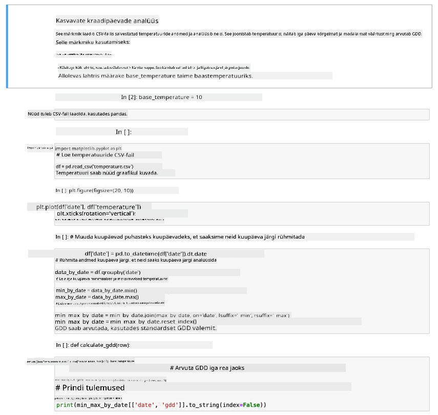

<!--
CO_OP_TRANSLATOR_METADATA:
{
  "original_hash": "1e21b012c6685f8bf73e0e76cdca3347",
  "translation_date": "2025-10-11T12:37:54+00:00",
  "source_file": "2-farm/lessons/1-predict-plant-growth/assignment.md",
  "language_code": "et"
}
-->
# Visualiseeri GDD andmeid Jupyter Notebooki abil

## Juhised

Selles õppetükis kogusid sa GDD andmeid IoT sensori abil. Heade GDD andmete saamiseks tuleb andmeid koguda mitme päeva jooksul. Temperatuuriandmete visualiseerimiseks ja GDD arvutamiseks saad kasutada selliseid tööriistu nagu [Jupyter Notebooks](https://jupyter.org), et andmeid analüüsida.

Alusta andmete kogumisega mitme päeva jooksul. Pead tagama, et serveri kood töötab kogu aeg, kui IoT seade töötab, kas siis toitehalduse seadete kohandamisega või millegi sarnase käivitamisega nagu [see süsteemi aktiivsena hoidmise Python skript](https://github.com/jaqsparow/keep-system-active).

Kui sul on temperatuuriandmed olemas, saad kasutada selle repo Jupyter Notebooki, et neid visualiseerida ja GDD arvutada. Jupyter Notebookid ühendavad koodi ja juhised plokkides, mida nimetatakse *rakkudeks*, sageli Pythonis. Sa saad juhiseid lugeda ja seejärel iga koodiploki ükshaaval käivitada. Samuti saad koodi redigeerida. Näiteks selles notebookis saad muuta baastemperatuuri, mida kasutatakse GDD arvutamiseks sinu taime jaoks.

1. Loo kaust nimega `gdd-calculation`

1. Laadi alla [gdd.ipynb](./code-notebook/gdd.ipynb) fail ja kopeeri see `gdd-calculation` kausta.

1. Kopeeri MQTT serveri poolt loodud `temperature.csv` fail.

1. Loo `gdd-calculation` kaustas uus Python virtuaalne keskkond.

1. Paigalda mõned pip paketid Jupyter Notebookide jaoks, koos raamatukogudega, mis on vajalikud andmete haldamiseks ja visualiseerimiseks:

    ```sh
    pip install --upgrade pip
    pip install pandas
    pip install matplotlib
    pip install jupyter
    ```

1. Käivita notebook Jupyteris:

    ```sh
    jupyter notebook gdd.ipynb
    ```

    Jupyter käivitub ja avab notebooki sinu brauseris. Järgi notebookis olevaid juhiseid, et visualiseerida mõõdetud temperatuurid ja arvutada kasvukraadipäevad.

    

## Hindamiskriteeriumid

| Kriteerium | Näidislik | Piisav | Vajab parandamist |
| ---------- | --------- | ------ | ----------------- |
| Andmete kogumine | Kogutud vähemalt 2 täispäeva andmeid | Kogutud vähemalt 1 täispäeva andmeid | Kogutud mõned andmed |
| GDD arvutamine | Notebook edukalt käivitatud ja GDD arvutatud | Notebook edukalt käivitatud | Notebooki käivitamine ebaõnnestus |

---

**Lahtiütlus**:  
See dokument on tõlgitud AI tõlketeenuse [Co-op Translator](https://github.com/Azure/co-op-translator) abil. Kuigi püüame tagada täpsust, palume arvestada, et automaatsed tõlked võivad sisaldada vigu või ebatäpsusi. Algne dokument selle algses keeles tuleks pidada autoriteetseks allikaks. Olulise teabe puhul soovitame kasutada professionaalset inimtõlget. Me ei vastuta selle tõlke kasutamisest tulenevate arusaamatuste või valesti tõlgenduste eest.