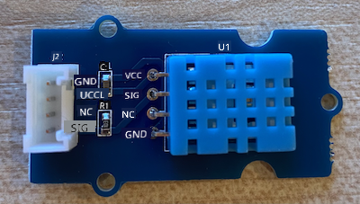
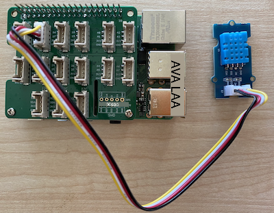

<!--
CO_OP_TRANSLATOR_METADATA:
{
  "original_hash": "7678f7c67b97ee52d5727496dcd7d346",
  "translation_date": "2025-10-11T12:34:03+00:00",
  "source_file": "2-farm/lessons/1-predict-plant-growth/pi-temp.md",
  "language_code": "et"
}
-->
# Mõõda temperatuuri - Raspberry Pi

Selles õppetunni osas lisad oma Raspberry Pile temperatuurianduri.

## Riistvara

Andur, mida kasutad, on [DHT11 niiskuse ja temperatuuri andur](https://www.seeedstudio.com/Grove-Temperature-Humidity-Sensor-DHT11.html), mis ühendab kaks andurit ühes pakendis. See on üsna populaarne, kuna paljud kaubanduslikult saadaval olevad andurid ühendavad temperatuuri, niiskuse ja mõnikord ka atmosfäärirõhu mõõtmise. Temperatuurianduri komponent on negatiivse temperatuurikoefitsiendiga (NTC) termistor, mille takistus väheneb temperatuuri tõustes.

See on digitaalne andur, millel on sisseehitatud ADC, mis loob digitaalse signaali, mis sisaldab temperatuuri ja niiskuse andmeid, mida mikrokontroller saab lugeda.

### Ühenda temperatuuriandur

Grove temperatuurianduri saab ühendada Raspberry Piga.

#### Ülesanne

Ühenda temperatuuriandur



1. Sisesta Grove kaabli üks ots niiskuse ja temperatuuri anduri pistikusse. Kaabel läheb sisse ainult ühel viisil.

1. Kui Raspberry Pi on välja lülitatud, ühenda Grove kaabli teine ots Grove Base hatti digitaalsesse pistikusse, mis on märgitud **D5**. See pistik asub GPIO pinide kõrval olevate pistikute reas, vasakult teine.



## Programmeeri temperatuuriandur

Seade on nüüd valmis programmeerimiseks, et kasutada ühendatud temperatuuriandurit.

### Ülesanne

Programmeeri seade.

1. Lülita Pi sisse ja oota, kuni see käivitub.

1. Käivita VS Code, kas otse Pi peal või ühenda Remote SSH laienduse kaudu.

    > ⚠️ Vajadusel viita [juhistele VS Code'i seadistamiseks ja käivitamiseks õppetunnis 1](../../../1-getting-started/lessons/1-introduction-to-iot/pi.md).

1. Terminalis loo `pi` kasutaja kodukataloogi uus kaust nimega `temperature-sensor`. Loo selles kaustas fail nimega `app.py`:

    ```sh
    mkdir temperature-sensor
    cd temperature-sensor
    touch app.py
    ```

1. Ava see kaust VS Code'is.

1. Temperatuuri ja niiskuse anduri kasutamiseks tuleb paigaldada täiendav Pip pakett. Käivita VS Code'i terminalis järgmine käsk, et paigaldada see Pip pakett Pi-le:

    ```sh
    pip3 install seeed-python-dht
    ```

1. Lisa `app.py` faili järgmine kood, et importida vajalikud teegid:

    ```python
    import time
    from seeed_dht import DHT
    ```

    `from seeed_dht import DHT` lause impordib `DHT` anduriklassi, et suhelda Grove temperatuurianduriga `seeed_dht` moodulist.

1. Lisa ülaltoodud koodi järel järgmine kood, et luua klassi eksemplar, mis haldab temperatuuriandurit:

    ```python
    sensor = DHT("11", 5)
    ```

    See deklareerib `DHT` klassi eksemplari, mis haldab **D**igitaalset **H**umidity ja **T**emperatuuri andurit. Esimene parameeter ütleb koodile, et kasutatav andur on *DHT11* - kasutatav teek toetab selle anduri teisi variante. Teine parameeter ütleb koodile, et andur on ühendatud Grove Base hatti digitaalsesse pistikusse `D5`.

    > ✅ Pea meeles, et kõik pistikud omavad unikaalseid pin-numbreid. Pinid 0, 2, 4 ja 6 on analoogpinid, pinid 5, 16, 18, 22, 24 ja 26 on digitaalsed pinid.

1. Lisa ülaltoodud koodi järel lõpmatu tsükkel, et küsida temperatuurianduri väärtust ja kuvada see konsoolis:

    ```python
    while True:
        _, temp = sensor.read()
        print(f'Temperature {temp}°C')
    ```

    `sensor.read()` meetodi kutsumine tagastab niiskuse ja temperatuuri tuple'i. Sul on vaja ainult temperatuuri väärtust, seega niiskus jäetakse tähelepanuta. Temperatuuri väärtus kuvatakse seejärel konsoolis.

1. Lisa tsükli lõppu väike kümnesekundiline paus, kuna temperatuuri taset ei ole vaja pidevalt kontrollida. Paus vähendab seadme energiatarbimist.

    ```python
    time.sleep(10)
    ```

1. Käivita VS Code'i terminalis järgmine käsk, et käivitada oma Python rakendus:

    ```sh
    python3 app.py
    ```

    Sa peaksid nägema temperatuuri väärtusi konsoolis. Kasuta midagi anduri soojendamiseks, näiteks vajuta sellele pöidlaga või kasuta ventilaatorit, et näha väärtuste muutumist:

    ```output
    pi@raspberrypi:~/temperature-sensor $ python3 app.py 
    Temperature 26°C
    Temperature 26°C
    Temperature 28°C
    Temperature 30°C
    Temperature 32°C
    ```

> 💁 Selle koodi leiad [code-temperature/pi](../../../../../2-farm/lessons/1-predict-plant-growth/code-temperature/pi) kaustast.

😀 Sinu temperatuurianduri programm oli edukas!

---

**Lahtiütlus**:  
See dokument on tõlgitud AI tõlketeenuse [Co-op Translator](https://github.com/Azure/co-op-translator) abil. Kuigi püüame tagada täpsust, palume arvestada, et automaatsed tõlked võivad sisaldada vigu või ebatäpsusi. Algne dokument selle algses keeles tuleks pidada autoriteetseks allikaks. Olulise teabe puhul soovitame kasutada professionaalset inimtõlget. Me ei vastuta selle tõlke kasutamisest tulenevate arusaamatuste või valesti tõlgenduste eest.