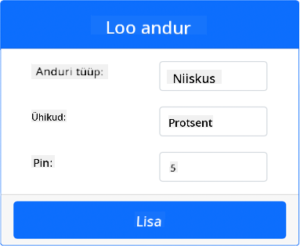
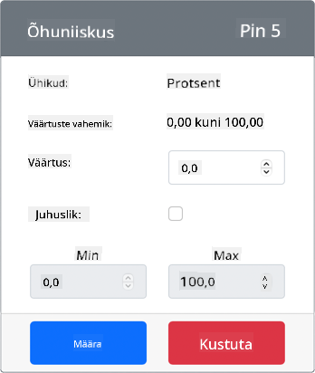
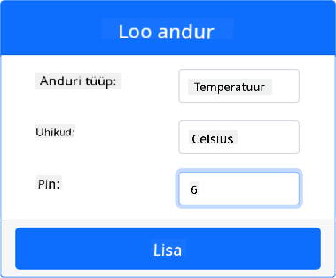
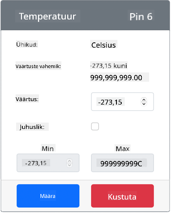

<!--
CO_OP_TRANSLATOR_METADATA:
{
  "original_hash": "70e5a428b607cd5a9a4f422c2a4df03d",
  "translation_date": "2025-10-11T12:33:06+00:00",
  "source_file": "2-farm/lessons/1-predict-plant-growth/virtual-device-temp.md",
  "language_code": "et"
}
-->
# Mõõda temperatuuri - Virtuaalne IoT riistvara

Selles õppetunni osas lisad oma virtuaalsele IoT-seadmele temperatuurianduri.

## Virtuaalne riistvara

Virtuaalne IoT-seade kasutab simuleeritud Grove digitaalset niiskuse ja temperatuuri andurit. See hoiab labori samasugusena nagu füüsilise Grove DHT11 anduri kasutamine Raspberry Pi-ga.

Andur ühendab **temperatuurianduri** ja **niiskuseanduri**, kuid selles laboris keskendutakse ainult temperatuurianduri komponendile. Füüsilises IoT-seadmes oleks temperatuuriandur [termistor](https://wikipedia.org/wiki/Thermistor), mis mõõdab temperatuuri, tuvastades takistuse muutuse temperatuuri muutudes. Temperatuuriandurid on tavaliselt digitaalsed andurid, mis teisendavad sisemiselt mõõdetud takistuse temperatuuriks Celsiuse (või Kelvini või Fahrenheiti) kraadides.

### Lisa andurid CounterFit-i

Virtuaalse niiskuse ja temperatuurianduri kasutamiseks tuleb need kaks andurit CounterFit rakendusse lisada.

#### Ülesanne - lisa andurid CounterFit-i

Lisa niiskuse ja temperatuuri andurid CounterFit rakendusse.

1. Loo oma arvutis uus Python rakendus kaustas `temperature-sensor`, millel on üks fail nimega `app.py` ja Python virtuaalne keskkond, ning lisa CounterFit pip paketid.

    > ⚠️ Vajadusel võid viidata [juhistele CounterFit Python projekti loomise ja seadistamise kohta õppetunnis 1](../../../1-getting-started/lessons/1-introduction-to-iot/virtual-device.md).

1. Paigalda täiendav Pip pakett, et lisada CounterFit shim DHT11 anduri jaoks. Veendu, et paigaldad selle terminalist, kus virtuaalne keskkond on aktiveeritud.

    ```sh
    pip install counterfit-shims-seeed-python-dht
    ```

1. Veendu, et CounterFit veebirakendus töötab.

1. Loo niiskuse andur:

    1. *Create sensor* kastis *Sensors* paneelil, ava *Sensor type* rippmenüü ja vali *Humidity*.

    1. Jäta *Units* väärtuseks *Percentage*.

    1. Veendu, et *Pin* väärtuseks on *5*.

    1. Vajuta **Add** nuppu, et luua niiskuse andur Pin 5-le.

    

    Niiskuse andur luuakse ja ilmub andurite loendisse.

    

1. Loo temperatuuri andur:

    1. *Create sensor* kastis *Sensors* paneelil, ava *Sensor type* rippmenüü ja vali *Temperature*.

    1. Jäta *Units* väärtuseks *Celsius*.

    1. Veendu, et *Pin* väärtuseks on *6*.

    1. Vajuta **Add** nuppu, et luua temperatuuri andur Pin 6-le.

    

    Temperatuuri andur luuakse ja ilmub andurite loendisse.

    

## Programmeeri temperatuuri anduri rakendus

Nüüd saab temperatuuri anduri rakendust programmeerida, kasutades CounterFit andureid.

### Ülesanne - programmeeri temperatuuri anduri rakendus

Programmeeri temperatuuri anduri rakendus.

1. Veendu, et `temperature-sensor` rakendus on avatud VS Code-is.

1. Ava `app.py` fail.

1. Lisa järgmine kood `app.py` faili algusesse, et ühendada rakendus CounterFit-iga:

    ```python
    from counterfit_connection import CounterFitConnection
    CounterFitConnection.init('127.0.0.1', 5000)
    ```

1. Lisa järgmine kood `app.py` faili, et importida vajalikud teegid:

    ```python
    import time
    from counterfit_shims_seeed_python_dht import DHT
    ```

    `from seeed_dht import DHT` lause impordib `DHT` anduriklassi, et suhelda virtuaalse Grove temperatuurianduriga, kasutades shimi `counterfit_shims_seeed_python_dht` moodulist.

1. Lisa järgmine kood ülaltoodud koodi järel, et luua klassi eksemplar, mis haldab virtuaalset niiskuse ja temperatuuri andurit:

    ```python
    sensor = DHT("11", 5)
    ```

    See deklareerib `DHT` klassi eksemplari, mis haldab virtuaalset **D**igitaalset **H**umidity ja **T**emperature andurit. Esimene parameeter ütleb koodile, et kasutatav andur on virtuaalne *DHT11* andur. Teine parameeter ütleb koodile, et andur on ühendatud porti `5`.

    > 💁 CounterFit simuleerib seda kombineeritud niiskuse ja temperatuuri andurit, ühendades 2 andurit: niiskuse anduri pin-ile, mis antakse `DHT` klassi loomisel, ja temperatuuri anduri, mis töötab järgmisel pin-il. Kui niiskuse andur on pin 5-l, eeldab shim, et temperatuuri andur on pin 6-l.

1. Lisa lõputu tsükkel ülaltoodud koodi järel, et küsida temperatuuri anduri väärtust ja kuvada see konsoolis:

    ```python
    while True:
        _, temp = sensor.read()
        print(f'Temperature {temp}°C')
    ```

    `sensor.read()` kutse tagastab tuple niiskuse ja temperatuuri väärtustega. Sul on vaja ainult temperatuuri väärtust, seega niiskus jäetakse tähelepanuta. Temperatuuri väärtus kuvatakse seejärel konsoolis.

1. Lisa tsükli lõppu väike paus, näiteks kümme sekundit, kuna temperatuuri taset ei ole vaja pidevalt kontrollida. Paus vähendab seadme energiatarbimist.

    ```python
    time.sleep(10)
    ```

1. Käivita oma Python rakendus VS Code terminalist, kus virtuaalne keskkond on aktiveeritud:

    ```sh
    python app.py
    ```

1. Muuda CounterFit rakenduses temperatuuri anduri väärtust, mida rakendus loeb. Seda saab teha kahel viisil:

    * Sisesta number *Value* kasti temperatuuri anduri jaoks ja vajuta **Set** nuppu. Sisestatud number on väärtus, mille andur tagastab.

    * Märgi *Random* märkeruut ja sisesta *Min* ja *Max* väärtused, seejärel vajuta **Set** nuppu. Iga kord, kui andur loeb väärtust, loeb see juhusliku numbri vahemikus *Min* ja *Max*.

    Sa peaksid nägema konsoolis väärtusi, mida seadistasid. Muuda *Value* või *Random* seadeid, et näha väärtuse muutumist.

    ```output
    (.venv) ➜  temperature-sensor python app.py
    Temperature 28.25°C
    Temperature 30.71°C
    Temperature 25.17°C
    ```

> 💁 Selle koodi leiad [code-temperature/virtual-device](../../../../../2-farm/lessons/1-predict-plant-growth/code-temperature/virtual-device) kaustast.

😀 Sinu temperatuuri anduri programm oli edukas!

---

**Lahtiütlus**:  
See dokument on tõlgitud, kasutades AI tõlketeenust [Co-op Translator](https://github.com/Azure/co-op-translator). Kuigi püüame tagada täpsust, palun arvestage, et automaatsed tõlked võivad sisaldada vigu või ebatäpsusi. Algne dokument selle algkeeles tuleks lugeda autoriteetseks allikaks. Olulise teabe puhul on soovitatav kasutada professionaalset inimtõlget. Me ei vastuta selle tõlke kasutamisest tulenevate arusaamatuste või valede tõlgenduste eest.