<!--
CO_OP_TRANSLATOR_METADATA:
{
  "original_hash": "4fb20273d299dc8d07a8f06c9cd0cdd9",
  "translation_date": "2025-10-11T12:26:58+00:00",
  "source_file": "2-farm/lessons/2-detect-soil-moisture/README.md",
  "language_code": "et"
}
-->
# Tuvasta mulla niiskus

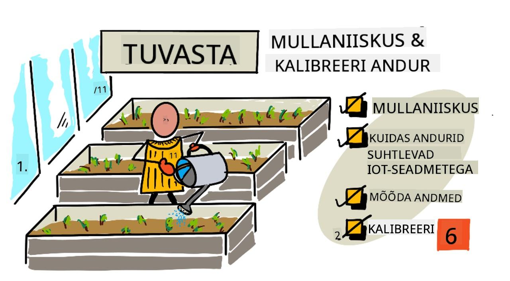

> Visuaalne ülevaade: [Nitya Narasimhan](https://github.com/nitya). Klõpsa pildil, et näha suuremat versiooni.

See õppetund oli osa [IoT algajatele: Projekt 2 - Digitaalne põllumajandus](https://youtube.com/playlist?list=PLmsFUfdnGr3yCutmcVg6eAUEfsGiFXgcx) sarjast, mida korraldas [Microsoft Reactor](https://developer.microsoft.com/reactor/?WT.mc_id=academic-17441-jabenn).

## Eeltest

[Eeltest](https://black-meadow-040d15503.1.azurestaticapps.net/quiz/11)

## Sissejuhatus

Eelmises õppetunnis uurisime, kuidas mõõta keskkonna omadusi ja kasutada neid taimede kasvu ennustamiseks. Temperatuuri saab kontrollida, kuid see on kulukas, kuna nõuab kontrollitud keskkonda. Lihtsaim keskkonna omadus, mida taimede jaoks kontrollida, on vesi – midagi, mida hallatakse igapäevaselt, alates suurtest niisutussüsteemidest kuni väikeste laste kastmiskannudeni.

Selles õppetunnis õpid, kuidas mõõta mulla niiskust, ja järgmises õppetunnis, kuidas automatiseeritud kastmissüsteemi juhtida. See õppetund tutvustab kolmandat sensorit – oled juba kasutanud valgusandurit ja temperatuuriandurit, ning nüüd õpid, kuidas sensorid ja aktuaatorid suhtlevad IoT seadmetega, et mõista, kuidas mulla niiskuse sensor saadab andmeid IoT seadmele.

Selles õppetunnis käsitleme:

* [Mulla niiskus](../../../../../2-farm/lessons/2-detect-soil-moisture)
* [Kuidas sensorid suhtlevad IoT seadmetega](../../../../../2-farm/lessons/2-detect-soil-moisture)
* [Mõõda mulla niiskustaset](../../../../../2-farm/lessons/2-detect-soil-moisture)
* [Sensori kalibreerimine](../../../../../2-farm/lessons/2-detect-soil-moisture)

## Mulla niiskus

Taimed vajavad kasvamiseks vett. Nad imavad vett kogu taime ulatuses, kusjuures enamik vett imendub juurestiku kaudu. Vett kasutavad taimed kolmel viisil:

* [Fotosüntees](https://wikipedia.org/wiki/Photosynthesis) – taimed tekitavad keemilise reaktsiooni vee, süsinikdioksiidi ja valguse abil, et toota süsivesikuid ja hapnikku.
* [Transpiratsioon](https://wikipedia.org/wiki/Transpiration) – taimed kasutavad vett süsinikdioksiidi difusiooniks õhust taime lehtede pooride kaudu. See protsess kannab ka toitaineid taime sees ja jahutab taime, sarnaselt inimeste higistamisele.
* Struktuur – taimed vajavad vett ka oma struktuuri säilitamiseks – nad koosnevad 90% ulatuses veest (inimesed ainult 60%), ja see vesi hoiab rakud jäigana. Kui taimel pole piisavalt vett, hakkab ta närbuma ja lõpuks sureb.

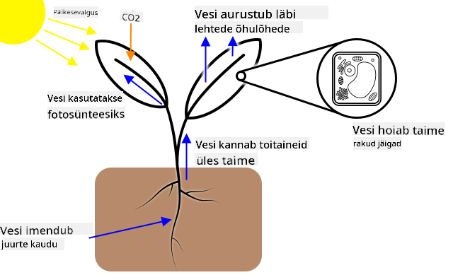

✅ Uuri: kui palju vett kaotatakse transpiratsiooni käigus?

Juurestik varustab taime veega mulla niiskusest, kus taim kasvab. Kui mullas on liiga vähe vett, ei saa taim piisavalt vett kasvu jaoks; kui vett on liiga palju, ei saa juured piisavalt hapnikku, mis on vajalik nende funktsioneerimiseks. See viib juurte hukkumiseni ja taim ei saa piisavalt toitaineid ellujäämiseks.

Et põllumees saaks parima taimede kasvu, peab muld olema mitte liiga märg ega liiga kuiv. IoT seadmed võivad aidata, mõõtes mulla niiskust ja võimaldades põllumehel kasta ainult siis, kui vaja.

### Mulla niiskuse mõõtmise viisid

Mulla niiskuse mõõtmiseks on mitmeid erinevaid sensoreid:

* Takistuslik – takistuslik sensor sisaldab kahte sondi, mis sisestatakse mulda. Elektrivool saadetakse ühele sondile ja võetakse vastu teise poolt. Sensor mõõdab mulla takistust – kui palju vool väheneb teisel sondil. Vesi juhib elektrit hästi, seega mida suurem on mulla veesisaldus, seda väiksem on takistus.

    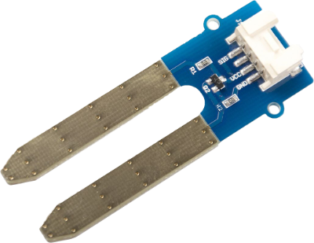

    > 💁 Takistusliku mulla niiskuse sensori saab ehitada, kasutades kahte metalltükki, näiteks naelu, mis on paigutatud paar sentimeetrit üksteisest, ja mõõtes nende vahel takistust multimeetriga.

* Mahtuvuslik – mahtuvuslik niiskuse sensor mõõdab elektrilaengu hulka, mida saab salvestada positiivse ja negatiivse elektriplaadi vahel ehk [mahtuvust](https://wikipedia.org/wiki/Capacitance). Mulla mahtuvus muutub niiskustaseme muutudes ja seda saab teisendada pingeks, mida IoT seade saab mõõta. Mida niiskem muld, seda madalam pinge sensorist väljub.

    

Mõlemad sensorid on analoogsensorid, mis tagastavad pinge, et näidata mulla niiskust. Aga kuidas see pinge jõuab sinu koodini? Enne nende sensoritega edasi minemist vaatame, kuidas sensorid ja aktuaatorid suhtlevad IoT seadmetega.

## Kuidas sensorid suhtlevad IoT seadmetega

Nendes õppetundides oled õppinud mitmeid sensoreid ja aktuaatoreid, mis on suhelnud sinu IoT arenduskomplektiga, kui oled teinud füüsilisi riistvaralaboreid. Aga kuidas see suhtlus toimib? Kuidas muutub mulla niiskuse sensori takistusmõõtmine numbriks, mida saad koodis kasutada?

Enamiku sensorite ja aktuaatoritega suhtlemiseks on vaja riistvara ja suhtlusprotokolli – see on hästi määratletud viis andmete saatmiseks ja vastuvõtmiseks. Näiteks mahtuvuslik mulla niiskuse sensor:

* Kuidas see sensor on ühendatud IoT seadmega?
* Kui see mõõdab pinget, mis on analoogsignaal, siis vajab see ADC-d, et luua digitaalse väärtuse esitus, ja see väärtus saadetakse vahelduva pingena, et edastada 0-sid ja 1-sid – aga kui kaua iga bitt saadetakse?
* Kui sensor tagastab digitaalse väärtuse, siis see on 0-de ja 1-de voog – jälle, kui kaua iga bitt saadetakse?
* Kui pinge on kõrge 0,1 sekundit, kas see on üks 1-bitt, kaks järjestikust 1-bitti või 10?
* Millal number algab? Kas `00001101` on 25 või on esimesed 5 bitti eelmise väärtuse lõpp?

Riistvara tagab füüsilise ühenduvuse, mille kaudu andmed saadetakse, ja erinevad suhtlusprotokollid tagavad, et andmed saadetakse või vastu võetakse õigesti, et neid saaks tõlgendada.

### Üldotstarbelised sisend-väljund (GPIO) pinnid

GPIO on komplekt pinne, mida saab kasutada riistvara ühendamiseks IoT seadmega, ja need on sageli saadaval IoT arenduskomplektides, nagu Raspberry Pi või Wio Terminal. Sa saad kasutada erinevaid suhtlusprotokolle, mida selles osas käsitletakse, GPIO pinne kaudu. Mõned GPIO pinnid tagavad pinge, tavaliselt 3,3V või 5V, mõned pinnid on maandus, ja teised saab programmeerimise teel seadistada kas pinge saatmiseks (väljund) või vastuvõtmiseks (sisend).

> 💁 Elektriahel peab ühendama pinge maandusega läbi kasutatava vooluringi. Võid mõelda pingest kui aku positiivsest (+) klemmist ja maandusest kui negatiivsest (-) klemmist.

Sa saad kasutada GPIO pinne otse mõne digitaalse sensori ja aktuaatoriga, kui sind huvitavad ainult sisse- või väljalülitatud väärtused – sisse lülitatud tähistatakse kui kõrge, välja lülitatud kui madal. Näiteks:

* Nupp. Sa saad ühendada nupu 5V pinni ja sisendiks seadistatud pinni vahel. Kui vajutad nuppu, lõpetab see vooluringi 5V pinni, nupu ja sisendpinni vahel. Koodist saad lugeda sisendpinni pinget ja kui see on kõrge (5V), siis nupp on vajutatud; kui see on madal (0V), siis nupp pole vajutatud. Pidage meeles, et tegelikku pinget ennast ei loeta, selle asemel saad digitaalse signaali 1 või 0, sõltuvalt sellest, kas pinge ületab läve või mitte.

    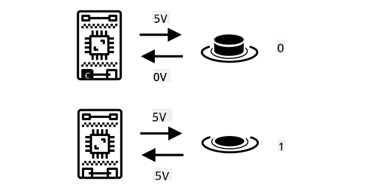

* LED. Sa saad ühendada LED-i väljundpinni ja maanduspinni vahel (kasutades takistit, muidu põletad LED-i läbi). Koodist saad seadistada väljundpinni kõrgeks ja see saadab 3,3V, luues vooluringi 3,3V pinni, LED-i ja maanduspinni vahel. See süütab LED-i.

    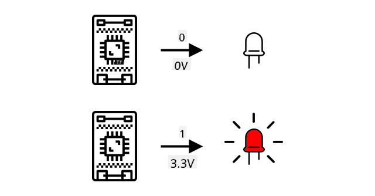

Täpsemate sensorite jaoks saad kasutada GPIO pinne digitaalsete andmete saatmiseks ja vastuvõtmiseks otse digitaalsete sensorite ja aktuaatoritega või kontrollerplaatide kaudu, millel on ADC-d ja DAC-d analoogsensorite ja -aktuaatoritega suhtlemiseks.

> 💁 Kui kasutad Raspberry Pi-d nendes laborites, siis Grove Base Hat sisaldab riistvara analoogsensorite signaalide digitaalseks teisendamiseks, et saata GPIO pinne kaudu.

✅ Kui sul on IoT seade GPIO pinne, leia need pinnid ja otsi diagramm, mis näitab, millised pinnid on pinge, maandus või programmeeritavad.

### Analoogpinnid

Mõned seadmed, nagu Arduino, pakuvad analoogpinne. Need on samad kui GPIO pinnid, kuid lisaks digitaalsele signaalile toetavad nad analoogsignaali. Tavaliselt on analoogpinnil ADC, mis teisendab pinget vahemikus 0–1,023.

Näiteks 3,3V plaadil, kui sensor tagastab 3,3V, siis tagastatav väärtus oleks 1,023. Kui tagastatav pinge on 1,65V, siis tagastatav väärtus on 511.

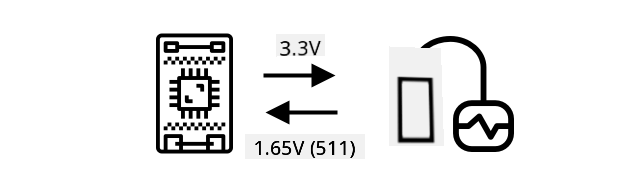

> 💁 Tagasi öölambi juurde – õppetund 3, valgusandur tagastas väärtuse vahemikus 0–1,023. Kui kasutad Wio Terminali, oli sensor ühendatud analoogpinniga. Kui kasutad Raspberry Pi-d, siis oli sensor ühendatud analoogpinniga baasmütsil, millel on integreeritud ADC, et suhelda GPIO pinne kaudu. Virtuaalne seade oli seadistatud saatma väärtust vahemikus 0–1,023, et simuleerida analoogpinni.

Mulla niiskuse sensorid tuginevad pingetele, seega kasutavad nad analoogpinne ja annavad väärtusi vahemikus 0–1,023.

### Inter Integrated Circuit (I2C)

I2C, hääldatakse *I-ruut-C*, on mitme kontrolleri ja mitme perifeerse seadme protokoll, kus kõik ühendatud seadmed võivad toimida kontrolleri või perifeerse seadmena, suheldes I2C siini kaudu (kommunikatsioonisüsteem, mis edastab andmeid). Andmed saadetakse adresseeritud pakettidena, kus iga pakett sisaldab ühendatud seadme aadressi, kellele see on mõeldud.

> 💁 Seda mudelit nimetati varem master/slave, kuid seda terminoloogiat hakatakse loobuma seoses selle seotusega orjandusega. [Avatud lähtekoodiga riistvara assotsiatsioon on võtnud kasutusele kontroller/perifeerne](https://www.oshwa.org/a-resolution-to-redefine-spi-signal-names/), kuid võid endiselt näha viiteid vanale terminoloogiale.

Seadmetel on aadress, mida kasutatakse, kui nad ühenduvad I2C siini, ja see on tavaliselt seadmesse kõvakoodiga. Näiteks igal Grove sensoril Seeedilt on sama aadress, seega kõigil valgusanduritel on sama aadress, kõigil nuppudel on sama aadress, mis erineb valgusanduri aadressist. Mõnel seadmel on võimalus aadressi muuta, muutes hüppaja seadeid või jootes kontakte kokku.

I2C sisaldab siini, mis koosneb kahest peamisest juhtmest, koos kahe toitejuhtmega:

| Juhe | Nimi | Kirjeldus |
| ---- | --------- | ----------- |
| SDA | Serial Data | See juhe on andmete saatmiseks seadmete vahel. |
| SCL | Serial Clock | See juhe saadab kellasignaali kiirusel, mille määrab kontroller. |
| VCC | Voltage common collector | Seadmete toiteallikas. See on ühendatud SDA ja SCL juhtmetega, et tagada nende toide tõmbetakisti kaudu, mis lülitab signaali välja, kui ükski seade pole kontroller. |
| GND | Ground | Tagab elektriahela ühise maanduse. |

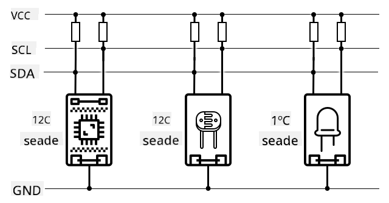

Andmete saatmiseks annab üks seade käivitusseisundi, et näidata, et see on valmis andmeid saatma. Seejärel muutub see kontrolleriks. Kontroller saadab seadme aadressi, kellega ta soovib suhelda, koos teatega, kas ta soovib andmeid lugeda või kirjutada. Pärast andmete edastamist saadab kontroller lõpetamisseisundi, et näidata, et ta on lõpetanud. Pärast seda võib teine seade muutuda kontrolleriks ja andmeid saata või vastu võtta.
I2C-l on kiiruspiirangud, kus on kolm erinevat režiimi, mis töötavad fikseeritud kiirustel. Kõige kiirem on High Speed režiim, mille maksimaalne kiirus on 3,4 Mbps (megabitti sekundis), kuigi väga vähesed seadmed toetavad seda kiirust. Näiteks Raspberry Pi on piiratud kiirusega Fast Mode, mille kiirus on 400 Kbps (kilobitti sekundis). Standard Mode töötab kiirusega 100 Kbps.

> 💁 Kui kasutate Raspberry Pi-d koos Grove Base hat'iga oma IoT riistvarana, näete plaadil mitmeid I2C pesasid, mida saab kasutada I2C sensoritega suhtlemiseks. Analoogsed Grove sensorid kasutavad samuti I2C-d koos ADC-ga, et saata analoogväärtusi digitaalandmetena, nii et valgussensor, mida kasutasite, simuleeris analoogpesa, kus väärtus saadeti üle I2C, kuna Raspberry Pi toetab ainult digitaalseid pesasid.

### Universaalne asünkroonne vastuvõtja-saatja (UART)

UART hõlmab füüsilist vooluringi, mis võimaldab kahel seadmel suhelda. Igal seadmel on 2 suhtlemispesa - saatmine (Tx) ja vastuvõtmine (Rx), kus esimese seadme Tx-pesa on ühendatud teise seadme Rx-pesaga ja teise seadme Tx-pesa on ühendatud esimese seadme Rx-pesaga. See võimaldab andmeid saata mõlemas suunas.

* Seade 1 saadab andmeid oma Tx-pesast, mida seade 2 võtab vastu oma Rx-pesaga
* Seade 1 võtab vastu andmeid oma Rx-pesast, mida seade 2 saadab oma Tx-pesast

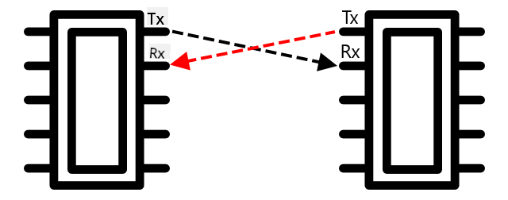

> 🎓 Andmed saadetakse üks bitt korraga, mida nimetatakse *järjestikuseks* suhtluseks. Enamik operatsioonisüsteeme ja mikrokontrollereid omavad *järjestikpesi*, st ühendusi, mis suudavad saata ja vastu võtta järjestikandmeid, mis on teie koodile kättesaadavad.

UART-seadmetel on [baudimäär](https://wikipedia.org/wiki/Symbol_rate) (tuntud ka kui sümbolimäär), mis on kiirus, millega andmeid saadetakse ja vastu võetakse bittides sekundis. Tavaline baudimäär on 9600, mis tähendab, et igas sekundis saadetakse 9600 bitti (0-d ja 1-d) andmeid.

UART kasutab algus- ja lõpubitte - see tähendab, et see saadab algusbiti, et näidata, et hakkab saatma baiti (8 bitti) andmeid, ja seejärel lõpubiti pärast 8 biti saatmist.

UART-i kiirus sõltub riistvarast, kuid isegi kõige kiiremad rakendused ei ületa 6,5 Mbps (megabitti sekundis ehk miljoneid bitte, 0 või 1, saadetakse sekundis).

UART-i saab kasutada GPIO-pesade kaudu - saate määrata ühe pesa Tx-ks ja teise Rx-ks, seejärel ühendada need teise seadmega.

> 💁 Kui kasutate Raspberry Pi-d koos Grove Base hat'iga oma IoT riistvarana, näete plaadil UART-pesa, mida saab kasutada sensoritega suhtlemiseks, mis kasutavad UART-protokolli.

### Järjestikperifeeria liides (SPI)

SPI on loodud suhtlemiseks lühikestel vahemaadel, näiteks mikrokontrolleri ja salvestusseadme, nagu välkmälu, vahel. See põhineb kontrolleri/perifeeria mudelil, kus üks kontroller (tavaliselt IoT-seadme protsessor) suhtleb mitme perifeeriaga. Kontroller juhib kõike, valides perifeeria ja saates või küsides andmeid.

> 💁 Nagu I2C puhul, on terminid kontroller ja perifeeria hiljutised muudatused, seega võite endiselt näha vanemaid termineid.

SPI kontrollerid kasutavad 3 juhtme, koos ühe lisajuhtmega perifeeria kohta. Perifeeriad kasutavad 4 juhtme. Need juhtmed on:

| Juhe | Nimi | Kirjeldus |
| ---- | --------- | ----------- |
| COPI | Kontrolleri väljund, perifeeria sisend | See juhe on andmete saatmiseks kontrollerist perifeeriasse. |
| CIPO | Kontrolleri sisend, perifeeria väljund | See juhe on andmete saatmiseks perifeeriast kontrollerisse. |
| SCLK | Järjestikkell | See juhe saadab kellasignaali kiirusel, mille määrab kontroller. |
| CS   | Kiibi valik | Kontrolleril on mitu juhet, üks perifeeria kohta, ja iga juhe ühendub vastava perifeeria CS juhtmega. |

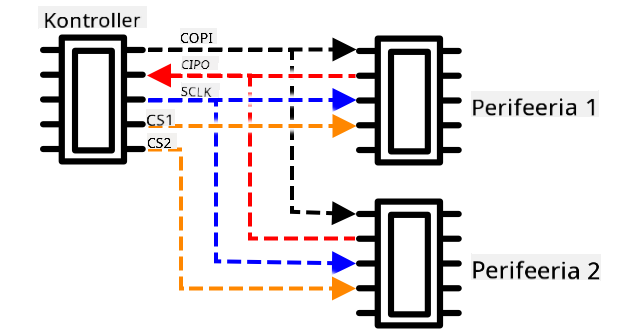

CS juhet kasutatakse ühe perifeeria korraga aktiveerimiseks, suheldes COPI ja CIPO juhtmete kaudu. Kui kontroller peab perifeeriat vahetama, deaktiveerib ta CS juhtme, mis on ühendatud praegu aktiivse perifeeriaga, ja seejärel aktiveerib juhtme, mis on ühendatud perifeeriaga, millega ta soovib järgmisena suhelda.

SPI on *täisdupleks*, mis tähendab, et kontroller saab samaaegselt andmeid saata ja vastu võtta samast perifeeriast, kasutades COPI ja CIPO juhtmeid. SPI kasutab SCLK juhtmel kellasignaali, et hoida seadmeid sünkroonis, seega ei vaja see nagu UART-i puhul algus- ja lõpubitte.

SPI-l ei ole määratletud kiiruspiiranguid, rakendused suudavad sageli edastada mitmeid megabaite andmeid sekundis.

IoT arendajakomplektid toetavad sageli SPI-d mõne GPIO-pesa kaudu. Näiteks Raspberry Pi puhul saate kasutada GPIO-pesasid 19, 21, 23, 24 ja 26 SPI jaoks.

### Juhtmevaba

Mõned sensorid suudavad suhelda standardsete juhtmevabade protokollide kaudu, nagu Bluetooth (peamiselt Bluetooth Low Energy ehk BLE), LoRaWAN (madala energiatarbega pika vahemaa võrguprotokoll) või WiFi. Need võimaldavad kaugandureid, mis ei ole füüsiliselt IoT-seadmega ühendatud.

Üks selline näide on kaubanduslikud pinnase niiskuse sensorid. Need mõõdavad niiskust põllul ja saadavad andmed LoRaWAN-i kaudu keskseadmesse, mis töötleb andmeid või saadab need Internetti. See võimaldab sensoril olla IoT-seadmest, mis andmeid haldab, eemal, vähendades energiatarbimist ja vajadust suurte WiFi-võrkude või pikkade kaablite järele.

BLE on populaarne arenenud sensorite jaoks, nagu näiteks fitness-jälgijad, mis töötavad randmel. Need kombineerivad mitmeid sensoreid ja saadavad sensorite andmed IoT-seadmesse, näiteks teie telefoni, BLE kaudu.

✅ Kas teil on Bluetooth-sensoreid enda juures, kodus või koolis? Need võivad hõlmata temperatuuriandureid, kohalolekuandureid, seadme jälgijaid ja fitness-seadmeid.

Üks populaarne viis kaubanduslike seadmete ühendamiseks on Zigbee. Zigbee kasutab WiFi-d, et moodustada seadmete vahel võrgusilma, kus iga seade ühendub võimalikult paljude lähedal asuvate seadmetega, moodustades suure hulga ühendusi nagu ämblikuvõrk. Kui üks seade soovib saata sõnumi Internetti, saab ta selle saata lähimatele seadmetele, mis edastavad selle edasi teistele lähedal asuvatele seadmetele ja nii edasi, kuni see jõuab koordinaatorini ja saab Internetti saata.

> 🐝 Nimi Zigbee viitab mesilaste tantsule pärast nende naasmist tarusse.

## Mõõda pinnase niiskustaset

Pinnase niiskustaset saab mõõta pinnase niiskuse sensori, IoT-seadme ja toataime või lähedal asuva pinnaseplatsi abil.

### Ülesanne - mõõda pinnase niiskust

Töötage läbi vastav juhend, et mõõta pinnase niiskust oma IoT-seadme abil:

* [Arduino - Wio Terminal](wio-terminal-soil-moisture.md)
* [Üheplaadiarvuti - Raspberry Pi](pi-soil-moisture.md)
* [Üheplaadiarvuti - Virtuaalne seade](virtual-device-soil-moisture.md)

## Sensori kalibreerimine

Sensorid tuginevad elektriliste omaduste, nagu takistus või mahtuvus, mõõtmisele.

> 🎓 Takistus, mõõdetuna oomides (Ω), näitab, kui palju vastupanu on elektrivoolul, mis läbib midagi. Kui materjalile rakendatakse pinget, sõltub voolu hulk, mis sellest läbi läheb, materjali takistusest. Lisateavet leiate [elektrilise takistuse Wikipedia lehelt](https://wikipedia.org/wiki/Electrical_resistance_and_conductance).

> 🎓 Mahtuvus, mõõdetuna faradites (F), näitab komponendi või vooluringi võimet koguda ja salvestada elektrienergiat. Lisateavet mahtuvuse kohta leiate [mahtuvuse Wikipedia lehelt](https://wikipedia.org/wiki/Capacitance).

Need mõõtmised ei ole alati kasulikud - kujutage ette temperatuuriandurit, mis annab teile mõõtmise 22,5 kΩ! Selle asemel tuleb mõõdetud väärtus teisendada kasulikuks ühikuks, kalibreerides selle - see tähendab mõõdetud väärtuste sobitamist mõõdetud suurusega, et võimaldada uute mõõtmiste teisendamist õigesse ühikusse.

Mõned sensorid on eelkalibreeritud. Näiteks temperatuuriandur, mida kasutasite eelmises tunnis, oli juba kalibreeritud, et see saaks tagastada temperatuuri mõõtmise °C-s. Tehases puutus esimene sensor kokku mitmesuguste teadaolevate temperatuuridega ja mõõdeti takistust. Seda kasutati seejärel arvutuse loomiseks, mis suudab teisendada mõõdetud väärtuse Ω-st (takistuse ühik) °C-ks.

> 💁 Valem takistuse arvutamiseks temperatuurist on [Steinhart–Hart'i võrrand](https://wikipedia.org/wiki/Steinhart–Hart_equation).

### Pinnase niiskuse sensori kalibreerimine

Pinnase niiskust mõõdetakse gravimeetrilise või mahulise veesisalduse abil.

* Gravimeetriline on vee kaal pinnase ühiku kaalu kohta, mõõdetuna kilogrammides vett kilogrammi kuiva pinnase kohta
* Mahuline on vee maht pinnase ühiku mahu kohta, mõõdetuna kuupmeetrites vett kuupmeetrites kuiva pinnase kohta

> 🇺🇸 Ameeriklaste jaoks, tänu ühikute järjepidevusele, saab neid mõõta naelades kilogrammide asemel või kuupjalgades kuupmeetrite asemel.

Pinnase niiskuse sensorid mõõdavad elektrilist takistust või mahtuvust - see varieerub mitte ainult pinnase niiskuse, vaid ka pinnase tüübi järgi, kuna pinnase komponendid võivad muuta selle elektrilisi omadusi. Ideaalis tuleks sensorid kalibreerida - see tähendab sensori näitude võrdlemist teaduslikuma lähenemisviisi abil saadud mõõtmistega. Näiteks labor võib arvutada gravimeetrilise pinnase niiskuse, kasutades konkreetse põllu proove paar korda aastas, ja neid numbreid kasutatakse sensori kalibreerimiseks, sobitades sensori näidu gravimeetrilise pinnase niiskusega.

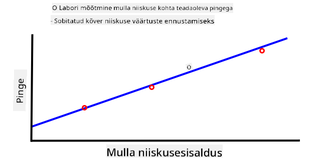

Ülaltoodud graafik näitab, kuidas sensorit kalibreerida. Pinge salvestatakse pinnaseproovi jaoks, mida seejärel mõõdetakse laboris, võrreldes niisket kaalu kuiva kaaluga (mõõtes kaalu märjana, seejärel kuivatades ahjus ja mõõtes kuivana). Kui on tehtud mõned mõõtmised, saab need graafikule joonistada ja punktidele sobitada joone. Seda joont saab seejärel kasutada pinnase niiskuse sensori näitude teisendamiseks IoT-seadme abil tegelikeks pinnase niiskuse mõõtmisteks.

💁 Resistiivsete pinnase niiskuse sensorite puhul pinge suureneb, kui pinnase niiskus suureneb. Mahtuvuslike pinnase niiskuse sensorite puhul pinge väheneb, kui pinnase niiskus suureneb, seega nende graafikud kalduksid allapoole, mitte ülespoole.

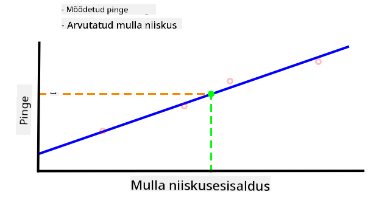

Ülaltoodud graafik näitab pinnase niiskuse sensori pingemõõtmist ja järgides seda graafiku joonele, saab arvutada tegeliku pinnase niiskuse.

See lähenemisviis tähendab, et põllumees peab saama laborimõõtmisi ainult paar korda põllu jaoks, seejärel saab ta kasutada IoT-seadmeid pinnase niiskuse mõõtmiseks - oluliselt kiirendades mõõtmiste tegemise aega.

---

## 🚀 Väljakutse

Resistiivsetel ja mahtuvuslikel pinnase niiskuse sensoritel on mitmeid erinevusi. Millised on need erinevused ja milline tüüp (kui üldse) on põllumehele parim kasutada? Kas see vastus muutub arenevate ja arenenud riikide vahel?

## Loengu järgne viktoriin

[Loengu järgne viktoriin](https://black-meadow-040d15503.1.azurestaticapps.net/quiz/12)

## Ülevaade ja iseseisev õpe

Lugege sensorite ja täiturite kasutatava riistvara ja protokollide kohta:

* [GPIO Wikipedia leht](https://wikipedia.org/wiki/General-purpose_input/output)
* [UART Wikipedia leht](https://wikipedia.org/wiki/Universal_asynchronous_receiver-transmitter)
* [SPI Wikipedia leht](https://wikipedia.org/wiki/Serial_Peripheral_Interface)
* [I2C Wikipedia leht](https://wikipedia.org/wiki/I²C)
* [Zigbee Wikipedia leht](https://wikipedia.org/wiki/Zigbee)

## Ülesanne

[Kalibreeri oma sensor](assignment.md)

---

**Lahtiütlus**:  
See dokument on tõlgitud AI tõlketeenuse [Co-op Translator](https://github.com/Azure/co-op-translator) abil. Kuigi püüame tagada täpsust, palume arvestada, et automaatsed tõlked võivad sisaldada vigu või ebatäpsusi. Algne dokument selle algses keeles tuleks pidada autoriteetseks allikaks. Olulise teabe puhul soovitame kasutada professionaalset inimtõlget. Me ei vastuta selle tõlke kasutamisest tulenevate arusaamatuste või valesti tõlgenduste eest.