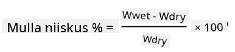
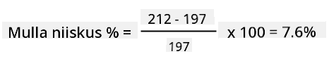

<!--
CO_OP_TRANSLATOR_METADATA:
{
  "original_hash": "506d21b544d5de47406c89ad496a21cd",
  "translation_date": "2025-10-11T12:28:45+00:00",
  "source_file": "2-farm/lessons/2-detect-soil-moisture/assignment.md",
  "language_code": "et"
}
-->
# Kalibreeri oma sensor

## Juhised

Selles õppetükis kogusid sa mulla niiskuse sensori näite, mis mõõdetakse väärtustena vahemikus 0-1023. Et need väärtused muuta tegelikeks mulla niiskuse näitudeks, tuleb sensor kalibreerida. Seda saab teha, võttes näite mullanäidistest ja arvutades nende näidiste gravimeetrilise mulla niiskusesisalduse.

Selleks tuleb samme mitu korda korrata, iga kord erineva mulla niiskustasemega.

1. Võta mulla niiskuse näit mulla niiskuse sensoriga. Kirjuta see näit üles.

1. Võta mullaproov ja kaalu see. Kirjuta kaal üles.

1. Kuivata muld – parim viis on kasutada sooja ahju temperatuuril 110°C (230°F) paar tundi. Seda saab teha ka päikese käes või asetades mulla sooja ja kuiva kohta, kuni see on täielikult kuivanud. Muld peaks olema pulbriline ja lahtine.

    > 💁 Laboris kõige täpsemate tulemuste saamiseks kuivatatakse mulda ahjus 48-72 tundi. Kui teie koolis on kuivatusahjud, uurige, kas saate neid kasutada pikemaks kuivatamiseks. Mida kauem kuivatada, seda kuivem on proov ja täpsemad tulemused.

1. Kaalu muld uuesti.

    > 🔥 Kui kuivatasid mulda ahjus, veendu, et see oleks enne kaalumist jahtunud!

Gravimeetriline mulla niiskus arvutatakse järgmiselt:

* Wmärg - märja mulla kaal
* Wkuiv - kuiva mulla kaal

Näiteks, oletame, et sul on mullaproov, mis kaalub märjana 212g ja kuivana 197g.

* Wmärg = 212g
* Wkuiv = 197g
* 212 - 197 = 15
* 15 / 197 = 0.076
* 0.076 * 100 = 7.6%

Selles näites on mulla gravimeetriline niiskus 7.6%.

Kui sul on vähemalt 3 näidise näidud, joonista graafik, kus on mulla niiskuse % ja mulla niiskuse sensori näit, ning lisa punktidele sobivaim joon. Selle abil saad arvutada gravimeetrilise mulla niiskusesisalduse antud sensori näidu korral, lugedes väärtuse graafiku joonelt.

## Hindamiskriteeriumid

| Kriteerium | Silmapaistev | Piisav | Vajab parandamist |
| ---------- | ------------ | ------ | ----------------- |
| Kalibreerimisandmete kogumine | Kogutud vähemalt 3 kalibreerimisnäidist | Kogutud vähemalt 2 kalibreerimisnäidist | Kogutud vähemalt 1 kalibreerimisnäidis |
| Kalibreeritud näidu tegemine | Kalibreerimisgraafik edukalt joonistatud ja sensori näit muudetud gravimeetriliseks mulla niiskusesisalduseks | Kalibreerimisgraafik edukalt joonistatud | Ei suutnud graafikut joonistada |

---

**Lahtiütlus**:  
See dokument on tõlgitud, kasutades AI tõlketeenust [Co-op Translator](https://github.com/Azure/co-op-translator). Kuigi püüame tagada täpsust, palun arvestage, et automaatsed tõlked võivad sisaldada vigu või ebatäpsusi. Algne dokument selle algkeeles tuleks lugeda autoriteetseks allikaks. Olulise teabe puhul on soovitatav kasutada professionaalset inimtõlget. Me ei vastuta selle tõlke kasutamisest tulenevate arusaamatuste või valede tõlgenduste eest.