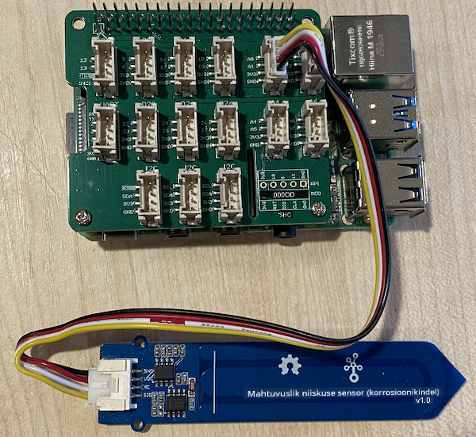

<!--
CO_OP_TRANSLATOR_METADATA:
{
  "original_hash": "9d4d00a47d5d0f3e6ce42c0d1020064a",
  "translation_date": "2025-10-11T12:28:19+00:00",
  "source_file": "2-farm/lessons/2-detect-soil-moisture/pi-soil-moisture.md",
  "language_code": "et"
}
-->
# Mõõda mulla niiskust - Raspberry Pi

Selles õppetunni osas lisad oma Raspberry Pi-le mahtuvusliku mulla niiskuse sensori ja loed sellest väärtusi.

## Riistvara

Raspberry Pi vajab mahtuvuslikku mulla niiskuse sensorit.

Sensor, mida kasutad, on [Mahtuvuslik mulla niiskuse sensor](https://www.seeedstudio.com/Grove-Capacitive-Moisture-Sensor-Corrosion-Resistant.html), mis mõõdab mulla niiskust, tuvastades mulla mahtuvust – omadust, mis muutub vastavalt mulla niiskuse tasemele. Kui mulla niiskus suureneb, väheneb pinge.

See on analoogsensor, mis kasutab analoogpinni ja Grove Base Hat-i 10-bitist ADC-d Raspberry Pi-l, et teisendada pinge digitaalseks signaaliks vahemikus 1–1023. Seejärel saadetakse see I<sup>2</sup>C kaudu GPIO-pinnide kaudu Pi-le.

### Ühenda mulla niiskuse sensor

Grove mulla niiskuse sensorit saab ühendada Raspberry Pi-ga.

#### Ülesanne - ühenda mulla niiskuse sensor

Ühenda mulla niiskuse sensor.


1. Sisesta Grove-kaabli üks ots mulla niiskuse sensori pistikusse. Kaabel läheb sisse ainult ühel viisil.

1. Kui Raspberry Pi on välja lülitatud, ühenda Grove-kaabli teine ots analoogpistikusse, mis on märgistatud **A0** Grove Base Hat-il, mis on kinnitatud Pi-le. See pistik on GPIO-pinnide kõrval asuva pistikurea parempoolne teine.



1. Sisesta mulla niiskuse sensor mulda. Sellel on "kõrgeima positsiooni joon" – valge joon sensori peal. Sisesta sensor kuni selle jooneni, kuid mitte üle selle.


## Programmeeri mulla niiskuse sensor

Nüüd saab Raspberry Pi programmeerida kasutama ühendatud mulla niiskuse sensorit.

### Ülesanne - programmeeri mulla niiskuse sensor

Programmeeeri seade.

1. Lülita Pi sisse ja oota, kuni see käivitub.

1. Käivita VS Code, kas otse Pi-l või ühenda Remote SSH laienduse kaudu.

    > ⚠️ Vajadusel viita [juhistele VS Code seadistamiseks ja käivitamiseks Nightlighti - õppetund 1](../../../1-getting-started/lessons/1-introduction-to-iot/pi.md).

1. Terminalis loo `pi` kasutaja kodukataloogi uus kaust nimega `soil-moisture-sensor`. Loo selles kaustas fail nimega `app.py`.

1. Ava see kaust VS Code'is.

1. Lisa `app.py` faili järgmine kood, et importida vajalikud teegid:

    ```python
    import time
    from grove.adc import ADC
    ```

    `import time` lause impordib `time` mooduli, mida kasutatakse hiljem selles ülesandes.

    `from grove.adc import ADC` lause impordib `ADC` Grove Python teekidest. See teek sisaldab koodi, mis võimaldab suhelda analoog-digitaalmuunduriga Pi Base Hat-il ja lugeda pingeid analoogsensoritelt.

1. Lisa järgmine kood selle alla, et luua `ADC` klassi eksemplar:

    ```python
    adc = ADC()
    ```

1. Lisa lõpmatu tsükkel, mis loeb ADC-d A0 pinnilt ja kirjutab tulemuse konsooli. See tsükkel saab seejärel teha 10-sekundilisi pause lugemiste vahel.

    ```python
    while True:
        soil_moisture = adc.read(0)
        print("Soil moisture:", soil_moisture)

        time.sleep(10)
    ```

1. Käivita Python rakendus. Näed mulla niiskuse mõõtmisi konsoolis. Lisa mulda vett või eemalda sensor mullast ja vaata, kuidas väärtus muutub.

    ```output
    pi@raspberrypi:~/soil-moisture-sensor $ python3 app.py 
    Soil moisture: 615
    Soil moisture: 612
    Soil moisture: 498
    Soil moisture: 493
    Soil moisture: 490
    Soil Moisture: 388
    ```

    Näites toodud väljundis näed, kuidas pinge langeb, kui vett lisatakse.

> 💁 Selle koodi leiad [code/pi](../../../../../2-farm/lessons/2-detect-soil-moisture/code/pi) kaustast.

😀 Sinu mulla niiskuse sensori programm oli edukas!

---

**Lahtiütlus**:  
See dokument on tõlgitud AI tõlketeenuse [Co-op Translator](https://github.com/Azure/co-op-translator) abil. Kuigi püüame tagada täpsust, palume arvestada, et automaatsed tõlked võivad sisaldada vigu või ebatäpsusi. Algne dokument selle algses keeles tuleks pidada autoriteetseks allikaks. Olulise teabe puhul soovitame kasutada professionaalset inimtõlget. Me ei vastuta selle tõlke kasutamisest tulenevate arusaamatuste või valesti tõlgenduste eest.